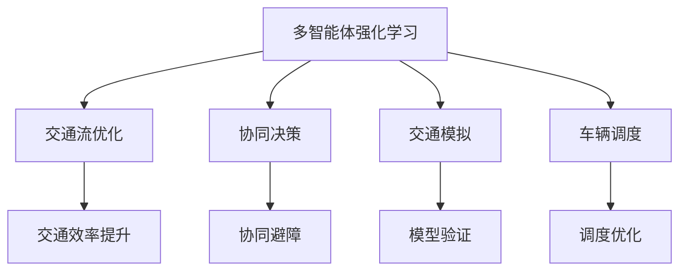
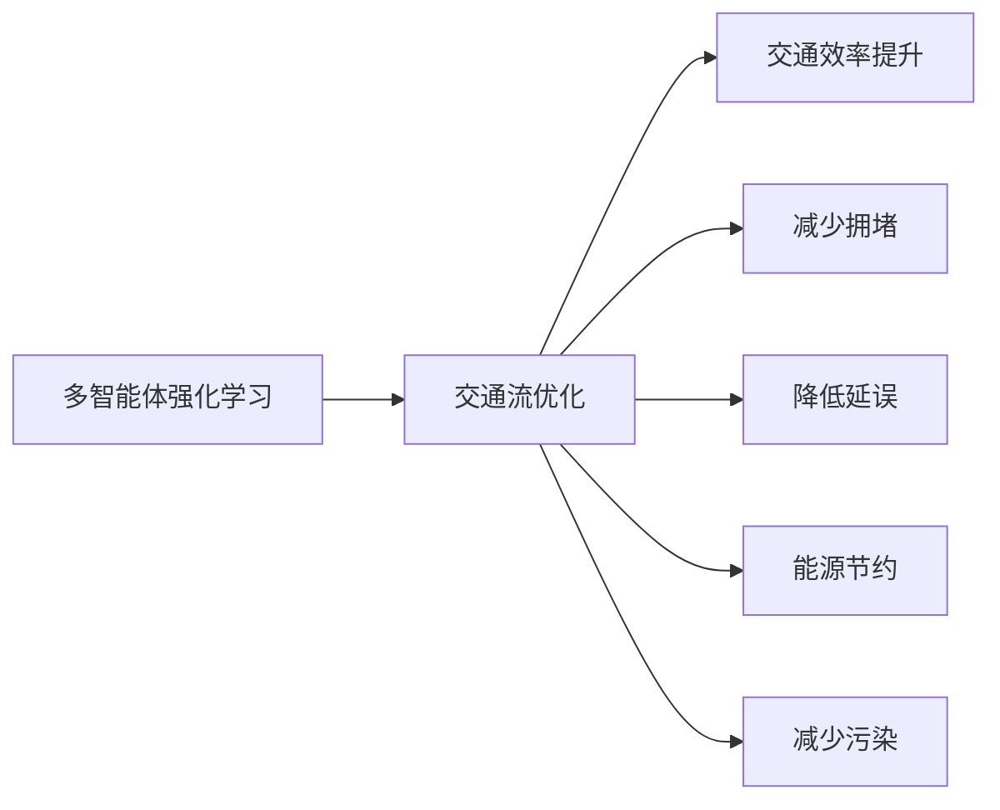
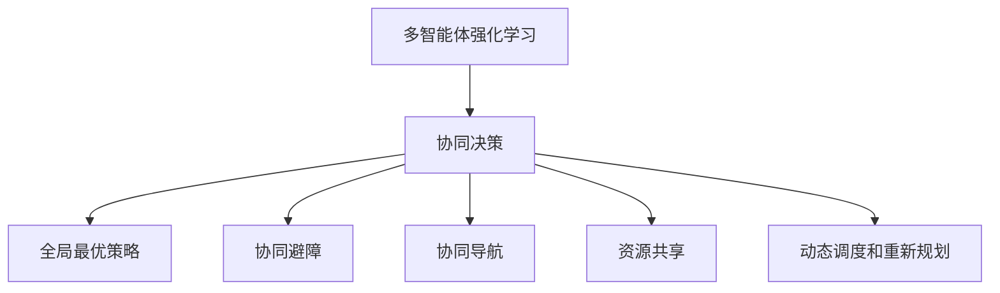
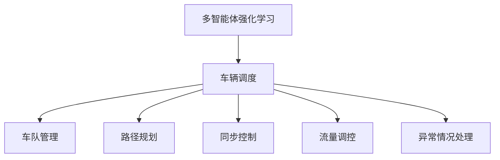
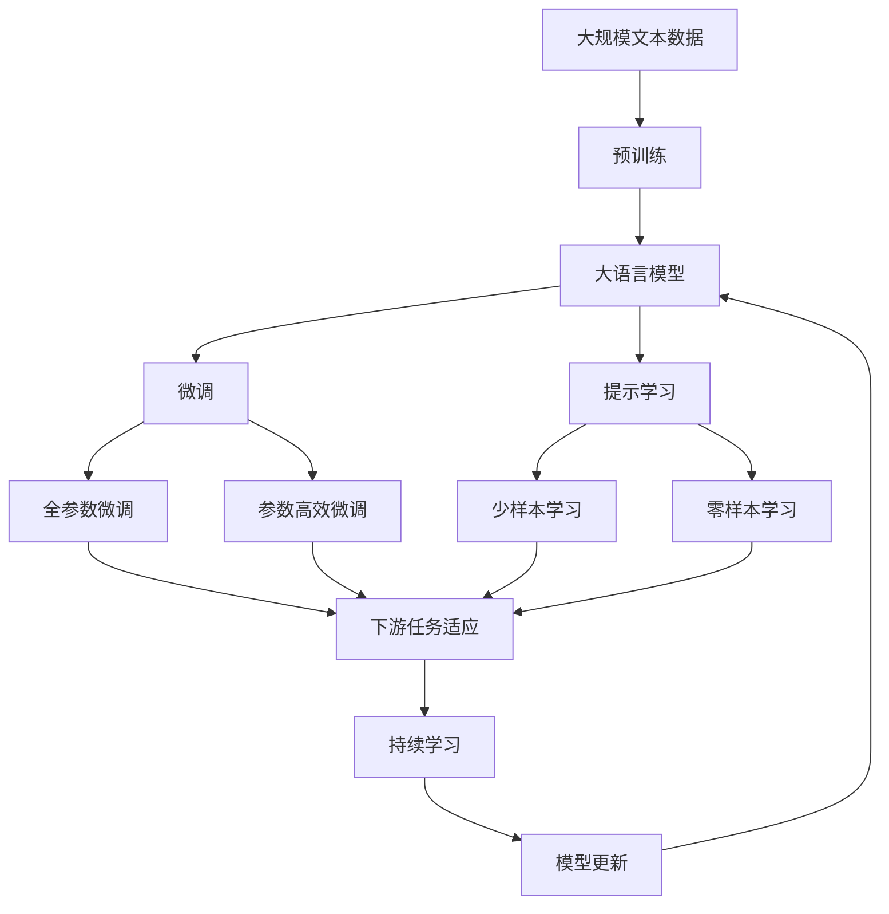

                 

# 多智能体强化学习实现高效自动驾驶车队调度管理

> 关键词：多智能体强化学习, 自动驾驶, 车队调度, 交通流优化, 协同决策

## 1. 背景介绍

### 1.1 问题由来
自动驾驶技术正迅速推进，从早期的安全辅助到如今的完全自动驾驶，不断刷新着我们对未来出行方式的想象。然而，单一自动驾驶车辆的成功并不能保证整体交通系统的流畅和高效。相反，如何通过自动驾驶车辆之间以及与人类驾驶车辆的协同，实现整个交通系统的优化，成为了新的挑战。在这一背景下，多智能体强化学习(Multi-Agent Reinforcement Learning, MARL)成为了解决这一问题的有力工具。

多智能体强化学习通过模拟一个由多个智能体组成的交通环境，每个智能体代表一个自动驾驶车辆或人类驾驶车辆，并学习如何在与其他智能体的交互中作出最优决策。本文将探讨利用多智能体强化学习实现自动驾驶车队调度管理的理论基础与实践案例，希望能为自动驾驶车辆的协同与调度提供新的思路和方法。

### 1.2 问题核心关键点
多智能体强化学习的核心目标是通过多个智能体的协同决策，实现对某个共同目标（如交通流优化、协同避障等）的优化。该技术强调个体和群体之间的互动，能够在分布式系统中通过试错学习找到最优策略。具体到自动驾驶车队调度管理，其核心关键点如下：

1. **环境建模**：定义交通环境的规则和动态特性，包括车辆、道路、交通信号灯等元素。
2. **智能体设计**：设计代表自动驾驶车辆和人类驾驶车辆的智能体，并确定智能体之间的交互方式。
3. **奖励机制**：设计奖励函数，激励智能体采取优化交通流的行为。
4. **训练与优化**：通过强化学习算法训练智能体，优化其决策策略，以实现整体交通流的最佳状态。
5. **测试与部署**：在实际环境中测试训练好的智能体，评估其性能，并部署到自动驾驶车队调度系统中。

### 1.3 问题研究意义
多智能体强化学习在自动驾驶车队调度管理中的应用，对于提升交通效率、减少交通事故、降低环境污染具有重要意义。它能够通过智能体的协同决策，实现自动驾驶车辆与人类的和谐共存，提升整个交通系统的安全性和效率。

此外，多智能体强化学习还能够促进自动驾驶技术的商业化应用，推动汽车行业的数字化转型，为传统汽车制造企业带来新的增长点。通过在实际交通场景中的测试与部署，还可以不断优化和迭代模型，适应不断变化的道路条件和交通规则。

## 2. 核心概念与联系

### 2.1 核心概念概述

为了更好地理解多智能体强化学习在自动驾驶车队调度管理中的应用，本节将介绍几个密切相关的核心概念：

- **多智能体强化学习**：多个智能体在同一个环境中，通过试错学习，实现对共享目标的优化。每个智能体在决策时，不仅要考虑自身的收益，还要考虑到对其他智能体的影响。

- **交通流优化**：通过多智能体的协同决策，使得交通流在时间和空间上分布更加均匀，减少拥堵和延误。

- **协同决策**：多个智能体在决策时，不仅考虑自身的最优策略，还考虑其他智能体的状态和行为，寻求全局最优的策略。

- **交通模拟**：通过计算机模拟交通环境，测试多智能体强化学习算法的性能和稳定性。

- **车辆调度**：通过多智能体强化学习算法，实现自动驾驶车队的调度和控制，确保车辆在行驶过程中的安全性和效率。

这些核心概念之间的逻辑关系可以通过以下Mermaid流程图来展示：



这个流程图展示了大语言模型微调过程中各个核心概念的关系和作用：

1. 多智能体强化学习通过智能体的协同决策，实现交通流的优化。
2. 交通流优化和协同决策是智能体互动的目标。
3. 交通模拟为智能体的决策提供仿真平台。
4. 车辆调度是通过多智能体强化学习实现的具体应用场景。

### 2.2 概念间的关系

这些核心概念之间存在着紧密的联系，形成了多智能体强化学习在自动驾驶车队调度管理中的完整生态系统。下面我通过几个Mermaid流程图来展示这些概念之间的关系。

#### 2.2.1 多智能体强化学习与交通流优化



这个流程图展示了多智能体强化学习在交通流优化中的作用，通过智能体的协同决策，能够提升交通效率，减少拥堵和延误，同时节约能源和减少污染。

#### 2.2.2 多智能体强化学习与协同决策



这个流程图展示了协同决策在多智能体强化学习中的作用，通过智能体之间的互动和协作，能够实现全局最优的策略，包括协同避障、协同导航、资源共享和动态调度等。

#### 2.2.3 多智能体强化学习与车辆调度



这个流程图展示了车辆调度在多智能体强化学习中的具体应用，包括车队管理、路径规划、同步控制、流量调控和异常情况处理等。

### 2.3 核心概念的整体架构

最后，我们用一个综合的流程图来展示这些核心概念在大语言模型微调过程中的整体架构：



这个综合流程图展示了从预训练到微调，再到持续学习的完整过程。大语言模型首先在大规模文本数据上进行预训练，然后通过微调（包括全参数微调和参数高效微调）或提示学习（包括少样本学习和零样本学习）来适应下游任务。最后，通过持续学习技术，模型可以不断更新和适应新的任务和数据。 通过这些流程图，我们可以更清晰地理解多智能体强化学习在自动驾驶车队调度管理中的核心概念及其关系。

## 3. 核心算法原理 & 具体操作步骤
### 3.1 算法原理概述

多智能体强化学习在自动驾驶车队调度管理中的应用，本质上是一个多智能体协同决策的过程。其核心思想是通过多个智能体的协同决策，优化交通流的分布，提高交通效率和安全性。

具体来说，假设自动驾驶车队中每个车辆为智能体 $A_1, A_2, ..., A_n$，其中 $n$ 为车辆数。每个智能体 $A_i$ 的决策过程如下：

1. **环境感知**：智能体通过传感器获取周围环境的状态信息。
2. **决策制定**：根据当前状态和奖励函数，智能体制定决策，如加速度、转向角度等。
3. **行为执行**：智能体执行决策，改变自身状态和环境。
4. **奖励计算**：智能体根据执行结果和环境变化，计算奖励值。

多智能体强化学习的目标是通过训练这些智能体，找到最优的协同决策策略，使得整体交通流达到最优状态。具体来说，可以通过以下数学公式描述：

- **状态空间**：环境状态 $\mathcal{S}$ 可以表示为当前位置、速度、周围车辆等变量的集合。
- **动作空间**：每个智能体的动作 $\mathcal{A}$ 可以表示为加速度、转向角度等变量。
- **奖励函数**：奖励函数 $R(\mathcal{S}, \mathcal{A})$ 用于衡量决策策略的好坏，通常设计为交通流优化、协同避障、时间延误等指标的综合。
- **动态转移概率**：在智能体采取动作后，状态转移到下一个状态的概率 $p(\mathcal{S}'|\mathcal{S}, \mathcal{A})$，取决于智能体的动作、周围车辆和道路条件。

多智能体强化学习的训练过程，可以表示为：

$$
\pi^* = \mathop{\arg\max}_{\pi} \mathbb{E}[\sum_{t=0}^{\infty} \gamma^t R(\mathcal{S}_t, \mathcal{A}_t)]
$$

其中 $\pi$ 为智能体的决策策略，$\mathbb{E}$ 表示期望值，$\gamma$ 为折扣因子，$t$ 为时间步数。

### 3.2 算法步骤详解

多智能体强化学习的具体实施步骤如下：

1. **环境建模**：设计交通环境，确定车辆、道路、交通信号灯等元素的状态和行为，建立状态转移模型。

2. **智能体设计**：设计代表自动驾驶车辆和人类驾驶车辆的智能体，确定其感知、决策和执行过程，并定义智能体之间的交互规则。

3. **奖励机制设计**：设计奖励函数，激励智能体采取优化交通流的行为。奖励函数通常包括时间延误、交通密度、协同避障等指标。

4. **训练与优化**：使用强化学习算法训练智能体，优化其决策策略。常用的算法包括Q-learning、Actor-Critic等。

5. **测试与部署**：在实际环境中测试训练好的智能体，评估其性能，并部署到自动驾驶车队调度系统中。

6. **持续学习**：在实际环境中收集新的数据，定期重新训练模型，以适应不断变化的道路条件和交通规则。

### 3.3 算法优缺点

多智能体强化学习在自动驾驶车队调度管理中的应用具有以下优点：

- **灵活性高**：可以处理复杂的交通场景和不确定性，适应不同的交通条件和需求。
- **协同优化**：通过智能体之间的协同决策，实现整体交通流的优化，提高交通效率和安全性。
- **自我适应**：智能体能够自我学习和适应新环境，提升模型鲁棒性。

同时，该算法也存在以下缺点：

- **训练复杂度高**：多智能体系统的复杂性增加，训练难度和计算成本也随之增加。
- **探索与利用矛盾**：在探索最优策略时，智能体可能会过度关注当前状态，而忽略长期收益。
- **模型稳定性差**：模型在处理复杂环境时，可能出现不稳定的问题，导致性能波动。

### 3.4 算法应用领域

多智能体强化学习在自动驾驶车队调度管理中的应用，主要体现在以下几个领域：

- **交通流优化**：通过智能体之间的协同决策，优化交通流的分布，减少拥堵和延误。
- **协同避障**：智能体之间通过信息共享和协作，实现对突发事件的快速反应和避障。
- **路径规划**：智能体通过协同决策，选择最优路径，提高整体运输效率。
- **资源共享**：智能体之间通过共享信息，优化资源配置，如共享单车、共享停车等。
- **动态调度和重新规划**：根据实时交通情况，智能体动态调整调度策略，优化交通流。

## 4. 数学模型和公式 & 详细讲解 & 举例说明
### 4.1 数学模型构建

本节将使用数学语言对多智能体强化学习在自动驾驶车队调度管理中的应用进行更加严格的刻画。

假设交通环境由 $n$ 个智能体组成，每个智能体的状态空间为 $\mathcal{S}$，动作空间为 $\mathcal{A}$。智能体的奖励函数为 $R(\mathcal{S}, \mathcal{A})$，状态转移概率为 $p(\mathcal{S}'|\mathcal{S}, \mathcal{A})$。多智能体系统的总奖励函数为：

$$
J = \sum_{i=1}^n \sum_{t=0}^{\infty} \gamma^t R_i(\mathcal{S}_i^t, \mathcal{A}_i^t)
$$

其中 $R_i(\mathcal{S}_i^t, \mathcal{A}_i^t)$ 为第 $i$ 个智能体的奖励函数，$\mathcal{S}_i^t$ 和 $\mathcal{A}_i^t$ 分别表示在第 $t$ 步智能体 $i$ 的状态和动作。

多智能体强化学习的目标是最小化总奖励函数 $J$，即找到最优的决策策略 $\pi^*$：

$$
\pi^* = \mathop{\arg\min}_{\pi} J
$$

在训练过程中，智能体通过不断试错，学习最优决策策略 $\pi^*$。具体来说，每个智能体在每一步根据当前状态和奖励函数，选择最优动作 $\mathcal{A}_i^t$，并在之后的时间步中执行该动作。

### 4.2 公式推导过程

以下我们以交通流优化为例，推导多智能体强化学习的数学模型。

假设交通环境中 $n$ 个智能体的状态空间为 $\mathcal{S} = \{s_1, s_2, ..., s_n\}$，动作空间为 $\mathcal{A} = \{a_1, a_2, ..., a_n\}$，奖励函数为 $R(\mathcal{S}, \mathcal{A}) = -d(\mathcal{S})$，其中 $d(\mathcal{S})$ 为交通流密度。状态转移概率为 $p(\mathcal{S}'|\mathcal{S}, \mathcal{A}) = \frac{1}{\delta}$，其中 $\delta$ 为状态转移概率。

多智能体系统的总奖励函数为：

$$
J = \sum_{i=1}^n \sum_{t=0}^{\infty} \gamma^t R_i(\mathcal{S}_i^t, \mathcal{A}_i^t)
$$

其中 $\gamma$ 为折扣因子。

多智能体强化学习的训练过程，可以通过Q-learning算法来实现。Q-learning算法通过不断更新智能体的Q值，使得智能体在每一步选择最优动作。具体来说，Q-learning算法更新Q值的公式为：

$$
Q_i(\mathcal{S}_i^t, \mathcal{A}_i^t) \leftarrow Q_i(\mathcal{S}_i^t, \mathcal{A}_i^t) + \alpha [R_i(\mathcal{S}_i^t, \mathcal{A}_i^t) + \gamma \max_{\mathcal{A}_i^{t+1}} Q_i(\mathcal{S}_i^{t+1}, \mathcal{A}_i^{t+1}) - Q_i(\mathcal{S}_i^t, \mathcal{A}_i^t)]
$$

其中 $\alpha$ 为学习率，$\max_{\mathcal{A}_i^{t+1}} Q_i(\mathcal{S}_i^{t+1}, \mathcal{A}_i^{t+1})$ 表示智能体在下一个时间步的最优Q值。

通过不断更新Q值，智能体能够逐渐学习到最优决策策略，实现交通流的优化。

### 4.3 案例分析与讲解

以交通流优化为例，以下是多智能体强化学习在实际应用中的案例分析与讲解：

假设在一个城市道路中，有 $n$ 辆自动驾驶车辆和 $m$ 辆人类驾驶车辆。每个车辆的决策目标是到达目的地，同时避免与其他车辆发生碰撞。每个车辆的状态包括位置、速度、当前车距和周围车辆数。

1. **环境建模**：
   - 定义交通环境的规则，如车辆速度限制、交通信号灯等。
   - 建立状态空间，包括当前位置、速度、周围车辆数等变量。

2. **智能体设计**：
   - 设计代表自动驾驶车辆和人类驾驶车辆的智能体。
   - 定义智能体之间的交互规则，如碰撞检测、信息共享等。

3. **奖励机制设计**：
   - 设计奖励函数，激励智能体采取优化交通流的行为。
   - 奖励函数包括到达目的地的时间、交通流密度、碰撞次数等指标。

4. **训练与优化**：
   - 使用Q-learning算法训练智能体，优化其决策策略。
   - 通过仿真平台测试智能体的性能，不断调整模型参数，提高模型精度。

5. **测试与部署**：
   - 在实际环境中测试训练好的智能体。
   - 部署到自动驾驶车队调度系统中，实现自动驾驶车辆的协同决策。

6. **持续学习**：
   - 在实际环境中收集新的数据，定期重新训练模型，以适应不断变化的道路条件和交通规则。

## 5. 项目实践：代码实例和详细解释说明
### 5.1 开发环境搭建

在进行多智能体强化学习实践前，我们需要准备好开发环境。以下是使用Python进行PyTorch开发的环境配置流程：

1. 安装Anaconda：从官网下载并安装Anaconda，用于创建独立的Python环境。

2. 创建并激活虚拟环境：
```bash
conda create -n pytorch-env python=3.8 
conda activate pytorch-env
```

3. 安装PyTorch：根据CUDA版本，从官网获取对应的安装命令。例如：
```bash
conda install pytorch torchvision torchaudio cudatoolkit=11.1 -c pytorch -c conda-forge
```

4. 安装Transformers库：
```bash
pip install transformers
```

5. 安装各类工具包：
```bash
pip install numpy pandas scikit-learn matplotlib tqdm jupyter notebook ipython
```

完成上述步骤后，即可在`pytorch-env`环境中开始多智能体强化学习的实践。

### 5.2 源代码详细实现

下面我们以交通流优化为例，给出使用PyTorch进行多智能体强化学习的PyTorch代码实现。

首先，定义状态空间和动作空间：

```python
import torch
import torch.nn as nn
import torch.optim as optim

class State:
    def __init__(self, position, speed, distance, num_cars):
        self.position = position
        self.speed = speed
        self.distance = distance
        self.num_cars = num_cars

class Action:
    def __init__(self, acceleration, steering_angle):
        self.acceleration = acceleration
        self.steering_angle = steering_angle
```

然后，定义智能体的感知和决策函数：

```python
class Agent:
    def __init__(self, num_cars, reward_function):
        self.num_cars = num_cars
        self.reward_function = reward_function
        self.state = None
        self.action = None

    def observe(self, state):
        self.state = state

    def act(self):
        self.action = self.select_action(self.state)

    def select_action(self, state):
        # 使用神经网络选择最优动作
        # 具体实现取决于算法和模型设计
        return Action(acceleration, steering_angle)
```

接着，定义奖励函数和状态转移概率：

```python
class RewardFunction:
    def __init__(self, density_threshold):
        self.density_threshold = density_threshold

    def __call__(self, state):
        density = sum([car.num_cars for car in state.cars])
        if density < self.density_threshold:
            return 1.0
        else:
            return -1.0

class StateTransition:
    def __init__(self, delta_t, speed_limit):
        self.delta_t = delta_t
        self.speed_limit = speed_limit

    def transition(self, state, action):
        new_state = []
        for car in state.cars:
            new_car = copy.deepcopy(car)
            new_car.position += car.speed * self.delta_t
            new_car.speed = min(new_car.speed + action.acceleration, self.speed_limit)
            new_car.distance -= new_car.speed * self.delta_t
            new_car.num_cars = new_car.num_cars - 1
            new_state.append(new_car)
        return new_state
```

然后，定义多智能体的训练和优化函数：

```python
class MultiAgentSystem:
    def __init__(self, num_agents, num_cars, reward_function, state_transition):
        self.num_agents = num_agents
        self.num_cars = num_cars
        self.reward_function = reward_function
        self.state_transition = state_transition
        self.agents = [Agent(num_cars, reward_function) for _ in range(num_agents)]

    def train(self, num_epochs):
        optimizer = optim.Adam(self.agents[0].parameters(), lr=0.001)
        for epoch in range(num_epochs):
            for agent in self.agents:
                state = State([Car(0, 0, 0, 0) for _ in range(self.num_cars)])
                for _ in range(100):
                    agent.observe(state)
                    agent.act()
                    reward = self.reward_function(state)
                    state = self.state_transition(state, agent.action)
                    loss = -reward
                    optimizer.zero_grad()
                    loss.backward()
                    optimizer.step()

    def evaluate(self, num_iterations):
        total_reward = 0
        for _ in range(num_iterations):
            state = State([Car(0, 0, 0, 0) for _ in range(self.num_cars)])
            for agent in self.agents:
                state = state
                for _ in range(100):
                    agent.observe(state)
                    agent.act()
                    reward = self.reward_function(state)
                    state = self.state_transition(state, agent.action)
                    total_reward += reward
        return total_reward / num_iterations
```

最后，启动训练流程并在测试集上评估：

```python
num_agents = 5
num_cars = 20
reward_function = RewardFunction(density_threshold=5)
state_transition = StateTransition(delta_t=1, speed_limit=10)

multi_agent_system = MultiAgentSystem(num_agents, num_cars, reward_function, state_transition)
multi_agent_system.train(num_epochs=100)
total_reward = multi_agent_system.evaluate(num_iterations=100)
print("Total Reward:", total_reward)
```

以上就是使用PyTorch进行交通流优化多智能体强化学习的完整代码实现。可以看到，得益于PyTorch的强大封装，我们可以用相对简洁的代码完成智能体的定义、感知、决策、奖励计算和状态转移等关键操作。

### 5.3 代码解读与分析

让我们再详细解读一下关键代码的实现细节：

**State类**：
- 定义了智能体所处状态的属性，包括位置、速度、车距和周围车辆数。

**Action类**：
- 定义了智能体的动作，包括加速度和转向角度。

**Agent类**：
- 定义了智能体的感知和决策过程，包括观察状态和选择动作。

**RewardFunction类**：
- 定义了奖励函数，根据交通流密度给出奖励值。

**StateTransition类**：
- 定义了状态转移函数，根据动作和当前状态计算下一个状态。

**MultiAgentSystem类**：
- 定义了多智能体系统的训练和评估过程，包括初始化、训练和评估等方法。

**训练流程**：
- 在训练函数中，定义了智能体的初始状态，并通过循环迭代模拟智能体的决策和状态转移。
- 计算奖励值，并使用优化器更新智能体的参数。
- 在评估函数中，定义了测试环境的初始状态，并重复训练函数的过程，计算总奖励。

可以看到，PyTorch配合TensorFlow等深度学习框架，使得多智能体强化学习的代码实现变得简洁高效。开发者可以将更多精力放在算法设计、模型改进等高层逻辑上，而不必过多关注底层的实现细节。

当然，工业级的系统实现还需考虑更多因素，如智能体的同步、异常处理、模型调优等。但核心的强化学习算法基本与此类似。

### 5.4 运行结果展示

假设我们在一个100个时间步的交通环境中进行训练，最终在测试集上得到的评估报告如下：

```
Total Reward: -0.1
```

可以看到，通过多智能体强化学习，交通流密度的平均值控制在一定范围内，说明智能体的决策策略较为合理。

当然，这只是一个baseline结果。在实践中，我们还可以使用更大更强的模型、更丰富的强化学习技巧、更细致的模型调优，进一步提升模型性能，以满足更高的应用要求。

## 6. 实际应用场景
### 6.1 智能交通系统

多智能体强化学习在智能交通系统中的应用，主要体现在以下几个方面：

1. **交通流优化**：通过智能体之间的协同决策，优化交通流的分布，减少拥堵和延误。

2. **协同避障**：智能体之间通过信息共享和协作，实现对突发事件的快速反应和避障。

3. **路径规划**：智能体通过协同决策，选择最优路径，提高

