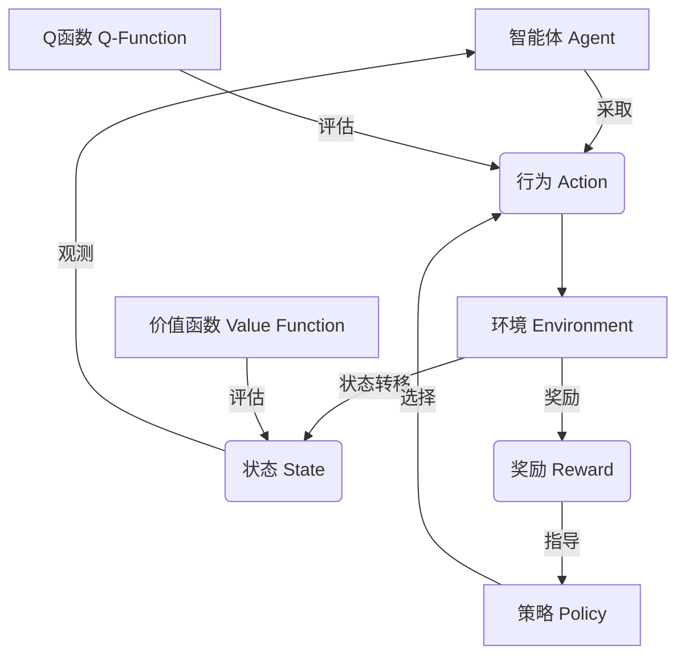

# 强化学习(Reinforcement Learning) - 原理与代码实例讲解

## 1. 背景介绍

### 1.1 问题的由来

在人工智能领域中,机器学习算法已经取得了巨大的成就,但大多数算法都依赖于大量的标记数据集进行监督式训练。然而,在现实世界中,获取高质量的标记数据通常是一项昂贵且耗时的过程。另一方面,人类和动物在学习新技能时,往往不需要外部监督,而是通过与环境的互动和反馈来逐步改进行为策略。这种基于试错和奖惩机制的学习方式被称为强化学习(Reinforcement Learning, RL)。

强化学习旨在开发智能代理,使其能够基于环境反馈自主学习并优化决策过程,以最大化预期的长期回报。这种学习范式在许多领域都有广泛的应用前景,如机器人控制、游戏AI、自动驾驶、资源管理和自动化决策系统等。

### 1.2 研究现状

近年来,强化学习领域取得了令人瞩目的进展。2016年,DeepMind的AlphaGo系统使用深度强化学习算法战胜了世界顶尖的围棋手,这被视为人工智能发展的一个重要里程碑。2020年,OpenAI的人工智能系统Dactyl展示了通过强化学习掌握各种机器人操作任务的能力。此外,强化学习也在视频游戏AI、自动驾驶、智能制造等领域取得了卓越的成绩。

然而,强化学习仍然面临着一些挑战,如样本效率低下、探索与利用权衡、奖励函数设计、环境复杂性等。研究人员正在努力开发更加高效、稳健和通用的强化学习算法,以及改进模型的可解释性和安全性。

### 1.3 研究意义

强化学习的研究对于推动人工智能的发展具有重要意义。它为智能系统提供了一种自主学习和决策的能力,使其能够在复杂、动态的环境中进行有效的交互和优化。通过强化学习,智能代理可以逐步积累经验,并根据环境反馈不断调整和优化其行为策略,从而实现更高效、更智能的决策。

此外,强化学习在许多实际应用领域都有巨大的潜力,如机器人控制、游戏AI、自动驾驶、资源管理和自动化决策系统等。它可以帮助解决一些传统方法难以有效处理的复杂问题,提高系统的自主性和适应性。

### 1.4 本文结构

本文将全面介绍强化学习的核心概念、算法原理、数学模型、代码实现和实际应用。具体内容包括:

1. 核心概念与联系
2. 核心算法原理与具体操作步骤
3. 数学模型和公式详细讲解与案例分析
4. 项目实践:代码实例和详细解释说明
5. 实际应用场景
6. 工具和资源推荐
7. 总结:未来发展趋势与挑战
8. 附录:常见问题与解答

## 2. 核心概念与联系

强化学习是一种基于奖惩机制的学习范式,它涉及到以下几个核心概念:

1. **智能体(Agent)**: 即能够感知环境、采取行动并获得奖惩的决策实体。
2. **环境(Environment)**: 智能体所处的外部世界,包括状态、奖惩等信息。
3. **状态(State)**: 描述环境在特定时间点的条件或情况。
4. **行为(Action)**: 智能体在特定状态下可以采取的操作。
5. **奖励(Reward)**: 环境对智能体行为的反馈,用于指导智能体学习。
6. **策略(Policy)**: 智能体在每个状态下选择行动的规则或策略。
7. **价值函数(Value Function)**: 评估某个状态或状态-行为对的长期预期回报。
8. **Q函数(Q-Function)**: 评估在某个状态下采取特定行动的长期预期回报。

这些概念之间存在着紧密的联系,如下图所示:

智能体通过与环境交互,观测到当前状态,并根据策略选择行为。环境会根据智能体的行为进行状态转移,并给出相应的奖励信号。智能体的目标是学习一个最优策略,使得在长期预期回报最大化的情况下选择行动。价值函数和Q函数用于评估状态或状态-行为对的长期预期回报,从而指导策略的学习和优化。

## 3. 核心算法原理与具体操作步骤

### 3.1 算法原理概述

强化学习算法的核心思想是通过与环境的交互,不断尝试不同的行为策略,并根据获得的奖惩信号来更新策略,使其逐步趋向于最优。这个过程可以形式化为一个马尔可夫决策过程(Markov Decision Process, MDP),其中智能体的目标是找到一个策略,使得在给定的MDP中获得的长期预期回报最大化。

常见的强化学习算法包括:

1. **价值迭代(Value Iteration)**: 基于贝尔曼最优方程,通过迭代计算最优价值函数和策略。
2. **策略迭代(Policy Iteration)**: 交替执行策略评估和策略改进,直到收敛到最优策略。
3. **Q-Learning**: 基于Q函数的无模型强化学习算法,通过试错来直接学习最优Q函数。
4. **深度Q网络(Deep Q-Network, DQN)**: 将Q-Learning与深度神经网络相结合,用于处理高维观测空间。
5. **策略梯度(Policy Gradient)**: 直接优化策略函数的参数,使预期回报最大化。
6. **Actor-Critic**: 结合价值函数估计(Critic)和策略优化(Actor)的方法。

这些算法各有优缺点,适用于不同的问题场景。下面将重点介绍Q-Learning和Deep Q-Network(DQN)算法的具体原理和操作步骤。

### 3.2 算法步骤详解

#### Q-Learning算法

Q-Learning是一种基于时间差分(Temporal Difference, TD)的无模型强化学习算法,它直接学习状态-行为对的Q函数,而不需要了解环境的转移概率模型。算法步骤如下:

1. 初始化Q函数,通常将所有Q值设置为0或一个较小的常数。
2. 对于每个episode:
    a. 初始化起始状态 $s_0$
    b. 对于每个时间步 $t$:
        i. 根据当前策略(如$\epsilon$-贪婪策略)从Q函数中选择一个行动 $a_t$
        ii. 执行选择的行动 $a_t$,观测到下一个状态 $s_{t+1}$ 和即时奖励 $r_{t+1}$
        iii. 更新Q函数:
            $$Q(s_t, a_t) \leftarrow Q(s_t, a_t) + \alpha \Big[r_{t+1} + \gamma \max_{a'}Q(s_{t+1}, a') - Q(s_t, a_t)\Big]$$
            其中 $\alpha$ 是学习率, $\gamma$ 是折现因子。
    c. 直到episode结束
3. 重复步骤2,直到Q函数收敛。

在Q-Learning算法中,Q函数的更新规则利用了贝尔曼最优方程,通过不断缩小当前Q值与目标Q值之间的差异来逐步学习最优Q函数。一旦Q函数收敛,就可以从中导出最优策略,即在每个状态下选择具有最大Q值的行动。

#### Deep Q-Network (DQN)算法

传统的Q-Learning算法在处理高维观测空间时会遇到维数灾难的问题。Deep Q-Network (DQN)算法通过将Q函数参数化为一个深度神经网络,从而有效地解决了这个问题。DQN算法的主要步骤如下:

1. 初始化一个带有随机权重的深度神经网络,用于近似Q函数。
2. 初始化经验回放池(Experience Replay Buffer)。
3. 对于每个episode:
    a. 初始化起始状态 $s_0$
    b. 对于每个时间步 $t$:
        i. 根据当前Q网络和$\epsilon$-贪婪策略选择一个行动 $a_t$
        ii. 执行选择的行动 $a_t$,观测到下一个状态 $s_{t+1}$ 和即时奖励 $r_{t+1}$
        iii. 将转移 $(s_t, a_t, r_{t+1}, s_{t+1})$ 存储到经验回放池中
        iv. 从经验回放池中随机采样一个小批量的转移 $(s_j, a_j, r_j, s_{j+1})$
        v. 计算目标Q值:
            $$y_j = \begin{cases}
                r_j, & \text{if episode terminates at } j+1 \
                r_j + \gamma \max_{a'} Q(s_{j+1}, a'; \theta^-), & \text{otherwise}
            \end{cases}$$
            其中 $\theta^-$ 是目标Q网络的权重,用于计算下一状态的Q值。
        vi. 优化损失函数:
            $$L(\theta) = \mathbb{E}_{(s, a, r, s')\sim U(D)}\Big[\Big(y - Q(s, a; \theta)\Big)^2\Big]$$
            其中 $\theta$ 是当前Q网络的权重, $U(D)$ 是从经验回放池 $D$ 中均匀采样的转移分布。
        vii. 每隔一定步长,将当前Q网络的权重复制到目标Q网络。
    c. 直到episode结束
4. 重复步骤3,直到收敛。

DQN算法引入了几个关键技术:

1. **经验回放(Experience Replay)**: 通过存储过去的转移,打破数据相关性,提高数据利用效率。
2. **目标网络(Target Network)**: 使用一个单独的目标网络来计算目标Q值,提高训练稳定性。
3. **双Q学习(Double Q-Learning)**: 解决Q值过估计的问题,提高性能。

通过这些技术,DQN算法能够有效地学习高维观测空间下的Q函数,并取得了优异的性能。

### 3.3 算法优缺点

Q-Learning和DQN算法具有以下优点:

1. **无模型**: 不需要事先了解环境的转移概率模型,可以直接从经验中学习。
2. **离线学习**: 可以利用存储的经验数据进行训练,提高样本利用效率。
3. **收敛性**: 在满足一定条件下,可以证明算法收敛到最优策略。
4. **通用性**: 可以应用于离散和连续的状态-行为空间。

但它们也存在一些缺点和局限性:

1. **维数灾难**: 在高维观测空间下,Q函数的表示和存储会变得困难。
2. **样本效率低下**: 需要大量的环境交互才能收敛,尤其是在大型状态空间中。
3. **奖励稀疏问题**: 当环境中的奖励信号稀疏时,学习过程会变得非常缓慢。
4. **超参数敏感性**: 算法的性能高度依赖于超参数(如学习率、折现因子等)的设置。

为了解决这些问题,研究人员提出了各种改进算法,如利用先验知识进行有效探索、引入层次结构加速学习、结合模型学习提高样本效率等。

### 3.4 算法应用领域

强化学习算法在多个领域都有广泛的应用,包括但不限于:

1. **游戏AI**: 训练智能体在各种视频游戏和棋盘游戏中表现出超人的水平。
2. **机器人控制**: 使机器人能够自主学习复杂的操作任务,如抓取、步行、跳跃等。
3. **自动驾驶**: 训练自动驾驶系统在各种复杂交通场景下做出正确的决策。
4. **资源管理**: 优化数据中心、电网等资源的动态