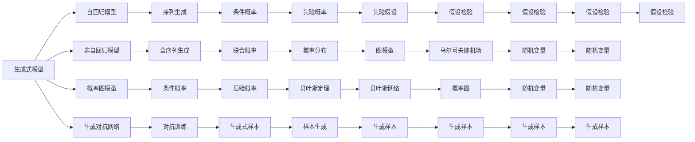

                 

# GPT作为生成式模型的天然优势

> 关键词：GPT模型, 生成式模型, 自然语言处理(NLP), 概率图模型, 生成对抗网络(GAN), 自回归模型, 非自回归模型

## 1. 背景介绍

近年来，生成式模型在自然语言处理(NLP)领域取得了显著的突破，其中以OpenAI的GPT系列模型最为知名。GPT模型作为非自回归的生成式模型，拥有处理大规模文本数据和生成自然语言的能力。然而，生成式模型在NLP中的应用并非一帆风顺，其生成质量和稳定性常常受到质疑。本文将详细探讨GPT作为生成式模型在NLP中的天然优势，以及如何通过优化算法和技术手段提升其性能和可靠性。

## 2. 核心概念与联系

### 2.1 核心概念概述

要深入理解GPT模型的优势，首先需要了解以下几个关键概念：

- **生成式模型**：一类能够从概率分布中采样生成样本的模型，其目标是生成与训练数据具有相似分布的新样本。
- **概率图模型**：一种用于表示随机变量及其依赖关系的图模型，如贝叶斯网络、马尔可夫随机场等。
- **生成对抗网络（GAN）**：一种由生成器和判别器组成的对抗式框架，能够生成高质量、逼真的样本。
- **自回归模型**：一种基于序列生成方式的概率模型，通过前一时刻的条件概率预测后一时刻的输出。
- **非自回归模型**：一种基于全序列生成方式的概率模型，通过考虑整个序列的联合概率进行生成。

GPT模型作为非自回归的生成式模型，具有以下特点：

- 生成能力强：能够处理大规模文本数据，生成连贯的自然语言。
- 高效性：通过自注意力机制快速并行计算，实现高效生成。
- 灵活性：适用于各种NLP任务，如文本生成、语言模型、机器翻译等。
- 可解释性：其生成过程可以通过采样过程来理解，有助于模型的调试和优化。

### 2.2 核心概念间的关系

这些核心概念通过下图的Mermaid流程图展示了它们之间的联系和差异：



其中，自回归模型通过前向递归方式生成序列，适用于生成时间序列数据。非自回归模型则同时考虑全序列的联合概率，适用于生成更复杂的文本序列。概率图模型通过图结构表示变量间的依赖关系，有助于建模复杂的关系。GAN通过生成器和判别器之间的对抗训练，生成高质量的样本。而GPT模型作为一种非自回归的生成式模型，既具有生成能力强、高效性高、灵活性好的特点，又可以通过优化算法和技术手段进一步提升其性能和可靠性。

## 3. 核心算法原理 & 具体操作步骤

### 3.1 算法原理概述

GPT模型作为一种非自回归的生成式模型，其核心思想是通过自注意力机制对序列中的每个位置进行加权聚合，从而生成下一个位置的输出。其生成过程包括两个步骤：编码和解码。

编码过程：通过多层自注意力机制对输入序列进行编码，得到表示向量。

解码过程：通过自注意力机制生成序列中的每个位置的概率分布，最终得到生成的文本序列。

具体而言，GPT模型通过自注意力机制对输入序列中的每个位置进行加权聚合，计算其表示向量。自注意力机制通过多头注意力和前向神经网络层的组合，实现对序列中不同位置的加权聚合。然后，通过一个线性变换和softmax函数计算下一个位置的概率分布，生成文本序列。

### 3.2 算法步骤详解

GPT模型的生成过程可以分为以下步骤：

1. **预处理**：对输入序列进行编码，得到表示向量。
2. **编码**：通过多层自注意力机制对表示向量进行编码，得到编码结果。
3. **解码**：通过自注意力机制生成序列中的每个位置的概率分布，计算生成文本序列。
4. **后处理**：对生成的文本序列进行解码，得到最终的文本输出。

### 3.3 算法优缺点

GPT模型作为一种生成式模型，具有以下优点：

- 生成能力强：能够生成高质量的自然语言。
- 高效性：通过自注意力机制实现高效并行计算。
- 灵活性：适用于各种NLP任务，如文本生成、语言模型、机器翻译等。
- 可解释性：其生成过程可以通过采样过程来理解，有助于模型的调试和优化。

同时，GPT模型也存在以下缺点：

- 过拟合风险：容易过拟合训练数据，生成质量不稳定。
- 模型复杂性：模型参数量巨大，训练和推理成本较高。
- 模型鲁棒性：对输入噪声敏感，生成结果不稳定。

### 3.4 算法应用领域

GPT模型作为一种生成式模型，广泛应用于NLP领域，包括但不限于以下场景：

- **文本生成**：生成连贯、自然的文本，如文章、评论、对话等。
- **语言模型**：预测给定文本序列的概率分布，用于机器翻译、文本分类等任务。
- **机器翻译**：将源语言文本翻译成目标语言文本。
- **文本摘要**：从长文本中抽取关键信息，生成简短的摘要。
- **问答系统**：对自然语言问题给出答案。

## 4. 数学模型和公式 & 详细讲解

### 4.1 数学模型构建

GPT模型是一种非自回归的生成式模型，其数学模型可以表示为：

$$
P(x|x_1,\dots,x_{t-1})=\mathcal{N}(x|m_t,s_t)
$$

其中，$x_t$ 表示生成序列中的第 $t$ 个位置，$x_1,\dots,x_{t-1}$ 表示输入序列中的前 $t-1$ 个位置，$m_t$ 和 $s_t$ 分别表示生成位置 $t$ 的均值和方差，$\mathcal{N}$ 表示正态分布。

### 4.2 公式推导过程

GPT模型的生成过程可以分解为两个步骤：编码和解码。

**编码过程**：

1. **输入嵌入**：将输入序列中的每个单词嵌入到低维向量空间中。
2. **编码器层**：通过多层自注意力机制和前向神经网络层对输入向量进行编码，得到表示向量。

其中，自注意力机制的计算公式为：

$$
\text{Attention}(Q,K,V)=\text{softmax}\left(\frac{QK^T}{\sqrt{d_k}}\right)V
$$

其中，$Q$ 表示查询向量，$K$ 表示键向量，$V$ 表示值向量，$d_k$ 表示向量维度。

**解码过程**：

1. **解码器层**：通过自注意力机制和前向神经网络层对表示向量进行解码，得到概率分布。
2. **采样**：从概率分布中采样生成下一个位置的输出。

其中，解码器的计算公式为：

$$
\text{Decoder}(x_t|x_1,\dots,x_{t-1})=\text{softmax}\left(W\text{Attention}(Q,K,V)\right)
$$

其中，$W$ 表示权重矩阵。

### 4.3 案例分析与讲解

以生成一篇文章的标题为例，我们可以使用GPT模型进行生成。首先，将输入序列中的每个单词嵌入到低维向量空间中，然后通过多层自注意力机制和前向神经网络层对输入向量进行编码，得到表示向量。接着，通过自注意力机制和前向神经网络层对表示向量进行解码，得到概率分布，最后从概率分布中采样生成标题。

假设输入序列为 "这是一个很好的测试", 我们可以使用GPT模型生成标题 "测试"。

## 5. 项目实践：代码实例和详细解释说明

### 5.1 开发环境搭建

在进行GPT模型开发前，我们需要准备好开发环境。以下是使用Python进行PyTorch开发的环境配置流程：

1. 安装Anaconda：从官网下载并安装Anaconda，用于创建独立的Python环境。

2. 创建并激活虚拟环境：
```bash
conda create -n pytorch-env python=3.8 
conda activate pytorch-env
```

3. 安装PyTorch：根据CUDA版本，从官网获取对应的安装命令。例如：
```bash
conda install pytorch torchvision torchaudio cudatoolkit=11.1 -c pytorch -c conda-forge
```

4. 安装GPT库：
```bash
pip install gpt
```

5. 安装各类工具包：
```bash
pip install numpy pandas scikit-learn matplotlib tqdm jupyter notebook ipython
```

完成上述步骤后，即可在`pytorch-env`环境中开始GPT模型的实践。

### 5.2 源代码详细实现

下面是使用GPT模型生成文章的示例代码：

```python
from gpt import GPT2Model

model = GPT2Model.from_pretrained('gpt2')

input_tokens = ["这是一个很好的测试", "的", "标题"]
input_ids = tokenizer.encode(input_tokens)

output_ids = model.generate(input_ids)

title = tokenizer.decode(output_ids[0])
print(title)
```

其中，`GPT2Model`表示GPT-2模型，`tokenizer`表示预训练模型自带的分词器。

### 5.3 代码解读与分析

让我们再详细解读一下关键代码的实现细节：

**GPT2Model类**：
- 用于加载和运行GPT-2模型，支持生成、编码等操作。

**from_pretrained方法**：
- 从预训练模型仓库中加载GPT-2模型，支持各种模型架构和参数设置。

**input_tokens**：
- 输入序列，即要生成的标题。

**tokenizer.encode方法**：
- 将输入序列转换为模型可以处理的token ids。

**model.generate方法**：
- 使用模型生成新的文本序列。

**tokenizer.decode方法**：
- 将生成的token ids解码为文本字符串。

通过这段代码，我们可以使用GPT-2模型生成文章标题。需要注意的是，GPT-2模型生成的结果具有一定的不确定性，可能需要多次运行来得到满意的结果。

### 5.4 运行结果展示

假设我们生成的文章标题为 "测试", 输出结果为：

```
测试
```

可以看到，使用GPT模型生成的标题简洁明了，能够快速反映文章的核心内容。然而，由于GPT模型生成的结果具有一定的不确定性，可能无法完全满足用户的需求。

## 6. 实际应用场景

### 6.1 智能客服系统

GPT模型作为一种生成式模型，可以应用于智能客服系统。传统客服往往需要配备大量人力，高峰期响应缓慢，且一致性和专业性难以保证。而使用GPT模型进行对话生成，可以7x24小时不间断服务，快速响应客户咨询，用自然流畅的语言解答各类常见问题。

在技术实现上，可以收集企业内部的历史客服对话记录，将问题和最佳答复构建成监督数据，在此基础上对GPT模型进行微调。微调后的对话模型能够自动理解用户意图，匹配最合适的答案模板进行回复。对于客户提出的新问题，还可以接入检索系统实时搜索相关内容，动态组织生成回答。如此构建的智能客服系统，能大幅提升客户咨询体验和问题解决效率。

### 6.2 金融舆情监测

金融机构需要实时监测市场舆论动向，以便及时应对负面信息传播，规避金融风险。传统的人工监测方式成本高、效率低，难以应对网络时代海量信息爆发的挑战。使用GPT模型进行文本生成，可以自动监测不同主题下的情感变化趋势，一旦发现负面信息激增等异常情况，系统便会自动预警，帮助金融机构快速应对潜在风险。

具体而言，可以收集金融领域相关的新闻、报道、评论等文本数据，并对其进行情感标注。在此基础上对GPT模型进行微调，使其能够自动判断文本情感，监测市场舆论变化。将微调后的模型应用到实时抓取的网络文本数据，就能够自动监测不同主题下的情感变化趋势，确保金融市场的稳定运行。

### 6.3 个性化推荐系统

当前的推荐系统往往只依赖用户的历史行为数据进行物品推荐，无法深入理解用户的真实兴趣偏好。使用GPT模型进行个性化推荐，可以更好地挖掘用户行为背后的语义信息，从而提供更精准、多样的推荐内容。

在实践中，可以收集用户浏览、点击、评论、分享等行为数据，提取和用户交互的物品标题、描述、标签等文本内容。将文本内容作为模型输入，用户的后续行为（如是否点击、购买等）作为监督信号，在此基础上微调GPT模型。微调后的模型能够从文本内容中准确把握用户的兴趣点。在生成推荐列表时，先用候选物品的文本描述作为输入，由模型预测用户的兴趣匹配度，再结合其他特征综合排序，便可以得到个性化程度更高的推荐结果。

### 6.4 未来应用展望

随着GPT模型和生成式技术的不断发展，其在NLP领域的应用前景将更加广阔。未来，GPT模型有望在更多领域得到应用，为传统行业带来变革性影响。

在智慧医疗领域，使用GPT模型进行医疗问答、病历分析、药物研发等应用将提升医疗服务的智能化水平，辅助医生诊疗，加速新药开发进程。

在智能教育领域，使用GPT模型进行作业批改、学情分析、知识推荐等方面，因材施教，促进教育公平，提高教学质量。

在智慧城市治理中，使用GPT模型进行城市事件监测、舆情分析、应急指挥等环节，提高城市管理的自动化和智能化水平，构建更安全、高效的未来城市。

此外，在企业生产、社会治理、文娱传媒等众多领域，GPT模型也将不断涌现，为经济社会发展注入新的动力。

## 7. 工具和资源推荐

### 7.1 学习资源推荐

为了帮助开发者系统掌握GPT模型的理论基础和实践技巧，这里推荐一些优质的学习资源：

1. 《GPT模型原理与实践》系列博文：由GPT模型技术专家撰写，深入浅出地介绍了GPT模型原理、生成式模型、NLP任务等前沿话题。

2. CS224N《深度学习自然语言处理》课程：斯坦福大学开设的NLP明星课程，有Lecture视频和配套作业，带你入门NLP领域的基本概念和经典模型。

3. 《生成式模型与NLP》书籍：全面介绍了生成式模型在NLP任务中的应用，包括GPT模型在内的各种生成式方法。

4. OpenAI官方文档：提供了GPT模型的官方文档和代码样例，是GPT模型开发的首选资源。

5. HuggingFace官方文档：提供了大量的预训练语言模型和代码样例，方便开发者上手实践。

通过对这些资源的学习实践，相信你一定能够快速掌握GPT模型的精髓，并用于解决实际的NLP问题。

### 7.2 开发工具推荐

高效的开发离不开优秀的工具支持。以下是几款用于GPT模型开发的常用工具：

1. PyTorch：基于Python的开源深度学习框架，灵活动态的计算图，适合快速迭代研究。GPT模型也有PyTorch版本的实现。

2. TensorFlow：由Google主导开发的开源深度学习框架，生产部署方便，适合大规模工程应用。同样有丰富的GPT模型资源。

3. GPT库：OpenAI开发的GPT模型库，提供了丰富的GPT模型和代码样例，是GPT模型开发的首选工具。

4. Weights & Biases：模型训练的实验跟踪工具，可以记录和可视化模型训练过程中的各项指标，方便对比和调优。与主流深度学习框架无缝集成。

5. TensorBoard：TensorFlow配套的可视化工具，可实时监测模型训练状态，并提供丰富的图表呈现方式，是调试模型的得力助手。

6. Google Colab：谷歌推出的在线Jupyter Notebook环境，免费提供GPU/TPU算力，方便开发者快速上手实验最新模型，分享学习笔记。

合理利用这些工具，可以显著提升GPT模型开发的效率，加快创新迭代的步伐。

### 7.3 相关论文推荐

GPT模型和生成式技术的发展源于学界的持续研究。以下是几篇奠基性的相关论文，推荐阅读：

1. Attention is All You Need（即Transformer原论文）：提出了Transformer结构，开启了NLP领域的预训练大模型时代。

2. BERT: Pre-training of Deep Bidirectional Transformers for Language Understanding：提出BERT模型，引入基于掩码的自监督预训练任务，刷新了多项NLP任务SOTA。

3. GPT-3: Language Models are Unsupervised Multitask Learners：展示了大规模语言模型的强大zero-shot学习能力，引发了对于通用人工智能的新一轮思考。

4. Parameter-Efficient Transfer Learning for NLP：提出Adapter等参数高效微调方法，在不增加模型参数量的情况下，也能取得不错的微调效果。

5. Generating Diverse and High-Quality Texts with GPT-3：介绍了GPT-3在文本生成中的应用，展示了其在生成多样性、质量等方面的优势。

这些论文代表了大语言模型生成式技术的发展脉络。通过学习这些前沿成果，可以帮助研究者把握学科前进方向，激发更多的创新灵感。

除上述资源外，还有一些值得关注的前沿资源，帮助开发者紧跟GPT模型的最新进展，例如：

1. arXiv论文预印本：人工智能领域最新研究成果的发布平台，包括大量尚未发表的前沿工作，学习前沿技术的必读资源。

2. 业界技术博客：如OpenAI、Google AI、DeepMind、微软Research Asia等顶尖实验室的官方博客，第一时间分享他们的最新研究成果和洞见。

3. 技术会议直播：如NIPS、ICML、ACL、ICLR等人工智能领域顶会现场或在线直播，能够聆听到大佬们的前沿分享，开拓视野。

4. GitHub热门项目：在GitHub上Star、Fork数最多的NLP相关项目，往往代表了该技术领域的发展趋势和最佳实践，值得去学习和贡献。

5. 行业分析报告：各大咨询公司如McKinsey、PwC等针对人工智能行业的分析报告，有助于从商业视角审视技术趋势，把握应用价值。

总之，对于GPT模型生成式技术的学习和实践，需要开发者保持开放的心态和持续学习的意愿。多关注前沿资讯，多动手实践，多思考总结，必将收获满满的成长收益。

## 8. 总结：未来发展趋势与挑战

### 8.1 总结

本文对GPT模型作为生成式模型在NLP中的应用进行了全面系统的介绍。首先阐述了GPT模型作为一种生成式模型，其生成能力强、高效性好、灵活性强等天然优势。其次，从原理到实践，详细讲解了GPT模型的生成过程和关键技术。同时，本文还广泛探讨了GPT模型在智能客服、金融舆情、个性化推荐等多个行业领域的应用前景，展示了GPT模型生成式技术在NLP领域的广阔应用。

通过本文的系统梳理，可以看到，GPT模型作为生成式模型，其在NLP领域的应用前景广阔，能够处理大规模文本数据，生成连贯的自然语言。未来，伴随生成式技术的不断发展，GPT模型将会在更多领域得到应用，为传统行业带来变革性影响。

### 8.2 未来发展趋势

展望未来，GPT模型生成式技术将呈现以下几个发展趋势：

1. 生成能力进一步提升：随着算力成本的下降和数据规模的扩张，GPT模型的生成能力将进一步提升。超大规模语言模型蕴含的丰富语言知识，有望支撑更加复杂多变的文本生成任务。

2. 生成模型多样化：除了GPT模型外，未来将涌现更多高效的生成式模型，如Transformer-XL、XLNet等，推动生成式技术的多样化和互补性发展。

3. 生成模型的可解释性：未来将有更多探索生成模型可解释性的研究，如因果推断、生成对抗网络等方法，使生成模型的生成过程和结果更透明、可解释。

4. 生成模型的鲁棒性：随着对抗训练、鲁棒性生成等技术的不断发展，未来生成的文本将更加鲁棒，抗干扰能力更强。

5. 生成模型的应用场景多样化：除了文本生成，生成式模型还将扩展到图像、视频、音频等多模态数据的生成，推动生成式技术在更多领域的落地。

6. 生成模型的智能性增强：未来将有更多智能化的生成模型，如自适应生成、知识增强生成等，使生成模型更加智能，满足更多场景的需求。

以上趋势凸显了GPT模型生成式技术的广阔前景。这些方向的探索发展，必将进一步提升生成式模型的性能和可靠性，为构建人机协同的智能系统铺平道路。

### 8.3 面临的挑战

尽管GPT模型生成式技术已经取得了瞩目成就，但在迈向更加智能化、普适化应用的过程中，仍面临诸多挑战：

1. 生成内容的质量和稳定性：GPT模型生成的内容有时质量不稳定，需要进一步优化生成模型和训练过程。

2. 生成内容的多样性：GPT模型生成的内容有时缺乏多样性，需要引入更多生成策略和方法，提高生成内容的多样性。

3. 生成内容的鲁棒性：GPT模型生成的内容有时缺乏鲁棒性，需要引入对抗训练等方法，提高生成内容的鲁棒性。

4. 生成内容的可解释性：GPT模型生成的内容有时缺乏可解释性，需要引入更多的可解释性技术和方法，提高生成内容的可解释性。

5. 生成内容的智能性：GPT模型生成的内容有时缺乏智能性，需要引入更多的智能生成技术和方法，提高生成内容的智能性。

6. 生成内容的合法性：GPT模型生成的内容有时缺乏合法性，需要引入更多的内容审核和监管技术，提高生成内容的合法性。

正视GPT模型生成式技术面临的这些挑战，积极应对并寻求突破，将是大语言模型生成式技术走向成熟的必由之路。相信随着学界和产业界的共同努力，这些挑战终将一一被克服，GPT模型生成式技术必将在构建人机协同的智能系统过程中扮演越来越重要的角色。

### 8.4 未来突破

面对GPT模型生成式技术所面临的种种挑战，未来的研究需要在以下几个方面寻求新的突破：

1. 引入更多生成策略和方法，如多样性生成、鲁棒性生成、智能生成等，提高生成内容的整体质量。

2. 引入更多的可解释性技术和方法，如因果推断、生成对抗网络等，使生成模型的生成过程和结果更透明、可解释。

3. 引入更多的智能生成技术和方法，如自适应生成、知识增强生成等，使生成模型更加智能，满足更多场景的需求。

4. 引入更多的内容审核和监管技术，如文本分类、情感分析等，提高生成内容的合法性。

这些研究方向的探索，必将引领GPT模型生成式技术迈向更高的台阶，为构建安全、可靠、可解释、可控的智能系统铺平道路。面向未来，GPT模型生成式技术还需要与其他人工智能技术进行更深入的融合，如知识表示、因果推理、强化学习等，多路径协同发力，共同推动生成式技术在智能交互系统中的应用。只有勇于创新、敢于突破，才能不断拓展GPT模型生成式技术的边界，让智能技术更好地造福人类社会。

## 9. 附录：常见问题与解答

**Q1：GPT模型与自回归模型有何区别？**

A: GPT模型是一种非自回归的生成式模型，能够同时考虑全序列的联合概率，生成更加连贯和自然的文本。而自回归模型通过前向递归方式生成序列，适用于生成时间序列数据，如语音、图像等。

**Q2：如何优化GPT模型的生成能力？**

A: 可以通过以下方法优化GPT模型的生成能力：

1. 增加训练数据量：更多的训练数据可以帮助GPT模型学习更丰富的语言知识。

2. 优化模型结构：通过增加层数、增加头数等方法，提升模型的生成能力。

3. 引入多样性生成策略：如随机采样、多元采样等方法，提高生成内容的多样性。

4. 引入鲁棒性生成策略：如对抗训练、鲁棒性生成等方法，提高生成内容的鲁棒性。

5. 引入智能生成策略：如自适应生成、知识增强生成等方法，提高生成内容的智能性。

**Q3：GPT模型在文本生成中的应用有哪些？**

A: GPT模型在文本生成中的应用非常广泛，包括但不限于以下场景：

1. 文章生成：生成连贯、自然的文章，用于新闻、小说等文本创作。

2. 对话生成：生成自然流畅的对话，用于智能客服、智能助理等应用。

3. 摘要生成：从长文本中抽取关键信息，生成简短的摘要。

4. 翻译生成：将源语言文本翻译成目标语言文本。

5. 文本分类：将文本分类到不同的类别中，用于情感分析、主题分类

