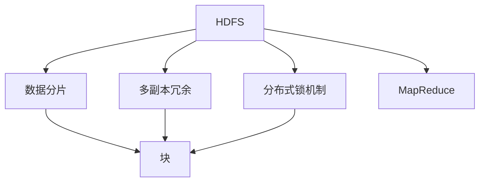

                 

# HDFS原理与代码实例讲解

> 关键词：
- HDFS
- MapReduce
- 分布式文件系统
- 数据存储
- 高可用性
- 容错性
- 可扩展性

## 1. 背景介绍

### 1.1 问题由来
Hadoop是Apache基金会开源的分布式计算平台，其核心组件包括分布式文件系统HDFS和分布式计算框架MapReduce。HDFS用于存储海量数据，支持容错和扩展性，而MapReduce则用于并行计算，处理大规模数据集。

HDFS（Hadoop Distributed File System）是一个高可用、容错的分布式文件系统，主要应用于大规模数据存储和处理。由于其分布式、可扩展、高可靠性和高吞吐量的特点，HDFS在Google、Yahoo、Facebook等公司中得到了广泛应用。

### 1.2 问题核心关键点
HDFS的核心技术包括数据分片、多副本冗余、分布式锁机制等。这些技术共同保证了HDFS的高可用性、高可靠性、高扩展性和高效性。

HDFS的设计目标是支持超大规模数据的存储和管理。它采用了一种名为“块”的存储单位，将数据分割成大小为64MB到128MB的块，并存储在多个节点上，确保数据的冗余和容错。同时，HDFS支持跨机群的数据复制，通过多副本机制，确保数据的可靠性。此外，HDFS还支持数据的高可用性，能够自动检测和恢复故障节点，保证数据不丢失。

HDFS采用了一种类似于Web浏览器和Web服务器架构的客户端-服务器架构。客户端通过网络访问HDFS文件系统，向HDFS服务器发送读写请求，服务器负责处理这些请求。HDFS的客户端和服务器通过心跳机制进行通信，确保HDFS集群的健康和稳定性。

## 2. 核心概念与联系

### 2.1 核心概念概述

为更好地理解HDFS的工作原理，本节将介绍几个密切相关的核心概念：

- HDFS：Hadoop分布式文件系统，一种支持大规模数据存储和管理的分布式文件系统。
- 数据分片：将大文件分割成若干个小块，并存储在多个节点上，实现数据的高可扩展性和容错性。
- 多副本冗余：在HDFS中，每个数据块都被复制多个副本，确保数据的高可靠性。
- 分布式锁机制：用于协调多个节点对文件的操作，确保数据的正确性和一致性。
- MapReduce：Hadoop的分布式计算框架，用于处理大规模数据集，支持并行计算。

这些核心概念之间的逻辑关系可以通过以下Mermaid流程图来展示：



这个流程图展示了HDFS的各个核心概念以及它们之间的关系：

1. HDFS负责存储和管理文件数据。
2. 数据分片将大文件分割成若干块，确保数据的可扩展性和容错性。
3. 多副本冗余确保数据的高可靠性，即使某些节点发生故障，数据仍然可以恢复。
4. 分布式锁机制用于协调多个节点对文件的操作，确保数据的一致性和正确性。
5. MapReduce框架用于处理大规模数据集，支持并行计算，提升计算效率。

### 2.2 概念间的关系

这些核心概念之间存在着紧密的联系，形成了HDFS的完整架构：

- HDFS与数据分片的关系：HDFS通过数据分片技术，将大文件分割成若干块，并存储在多个节点上。
- 数据分片与多副本冗余的关系：每个数据块都复制多个副本，确保数据的高可靠性。
- 多副本冗余与分布式锁机制的关系：分布式锁机制用于协调多个节点对数据块的操作，确保数据的正确性和一致性。
- MapReduce与HDFS的关系：MapReduce框架通过将计算任务拆分成多个小任务，并在HDFS上进行分布式计算，从而处理大规模数据集。

## 3. 核心算法原理 & 具体操作步骤
### 3.1 算法原理概述

HDFS的核心原理包括数据分片、多副本冗余、分布式锁机制等。

1. 数据分片：将大文件分割成若干块，并存储在多个节点上，实现数据的高可扩展性和容错性。
2. 多副本冗余：在HDFS中，每个数据块都被复制多个副本，确保数据的高可靠性。
3. 分布式锁机制：用于协调多个节点对文件的操作，确保数据的正确性和一致性。

### 3.2 算法步骤详解

HDFS的实现过程主要分为以下几个步骤：

1. 数据分片：将大文件分割成若干块，并分配给不同的数据节点存储。
2. 多副本冗余：为每个数据块生成多个副本，并存储在不同的数据节点上。
3. 分布式锁机制：在多个节点上操作同一个文件时，通过分布式锁机制保证数据的正确性和一致性。
4. MapReduce计算：将计算任务拆分成多个小任务，并在HDFS上进行分布式计算。

### 3.3 算法优缺点

HDFS的优点包括：

1. 高可靠性：通过数据冗余和分布式锁机制，确保数据的可靠性。
2. 高可扩展性：通过数据分片技术，支持大规模数据的存储和管理。
3. 高效性：通过并行计算和分布式计算，提升计算效率。

HDFS的缺点包括：

1. 延迟较高：由于文件块需要在多个节点之间进行复制和读写，会导致一定的延迟。
2. 文件块大小固定：HDFS的文件块大小固定，无法适应不同的数据块大小。
3. 文件系统接口单一：HDFS只支持标准的文件系统接口，难以与其他文件系统进行集成。

### 3.4 算法应用领域

HDFS主要应用于以下领域：

- 大规模数据存储：HDFS支持大规模数据的存储和管理，适用于数据仓库、大数据分析等场景。
- 数据处理：HDFS结合MapReduce框架，支持大规模数据的分布式处理，适用于数据挖掘、机器学习等任务。
- 云计算：HDFS作为Hadoop生态系统的核心组件，广泛应用于云计算平台，支持海量数据的存储和处理。

## 4. 数学模型和公式 & 详细讲解
### 4.1 数学模型构建

HDFS的数据模型基于文件的层次结构，每个文件都被组织成一棵树形结构。文件系统中的每个文件和目录都被表示为路径名，如`/hdfs/user/hadoop/input.txt`。

在HDFS中，数据被分割成若干个块，每个块大小为64MB到128MB。每个块被分配给不同的数据节点存储，块编号通过路径名中的文件名和块索引进行确定。

HDFS的块被复制到多个数据节点上，以确保数据的可靠性。每个块可以复制3到4份，具体复制份数根据数据节点的情况和系统配置进行动态调整。

### 4.2 公式推导过程

假设文件大小为F，块大小为B，副本数为R，节点数为N。则文件被分割成的块数为：

$$
N = \frac{F}{B}
$$

每个块被复制R份，存储在不同的节点上，则复制后的块数为：

$$
N_R = N \times R
$$

根据数据冗余公式，HDFS的可靠性为：

$$
R = 2 + \log_2 N
$$

HDFS的可靠性随着节点数量的增加而增加，节点越多，冗余副本越多，数据可靠性越高。

## 5. 项目实践：代码实例和详细解释说明
### 5.1 开发环境搭建

在进行HDFS开发前，我们需要准备好开发环境。以下是使用Hadoop搭建HDFS集群的步骤：

1. 安装Java开发环境：从官网下载并安装JDK，确保Hadoop正常运行。
2. 安装Hadoop：从官网下载并安装Hadoop，选择与系统兼容的版本。
3. 配置Hadoop：设置Hadoop的环境变量，配置好Hadoop的核心配置文件，包括hdfs-site.xml和yarn-site.xml。
4. 启动HDFS和YARN：启动HDFS和YARN服务，确保集群正常运行。

### 5.2 源代码详细实现

下面以HDFS的文件分片和复制为例，给出使用Java实现的文件分片和复制代码：

```java
import java.io.IOException;
import java.net.InetSocketAddress;
import java.util.concurrent.TimeUnit;

import org.apache.hadoop.conf.Configuration;
import org.apache.hadoop.fs.FileSystem;
import org.apache.hadoop.fs.Path;
import org.apache.hadoop.fs.CommonConfigurationKeys;

public class HDFSFileOperations {

    public static void main(String[] args) throws Exception {
        Configuration conf = new Configuration();
        conf.set(CommonConfigurationKeys.HADOOP_FS_DEFAULT_NAME, "hdfs");
        FileSystem fs = FileSystem.get(new InetSocketAddress("localhost", 9000), conf);
        
        Path srcFile = new Path("input.txt");
        Path dstDir = new Path("output/");
        fs.copyFromLocalFile(srcFile, dstDir);
        
        fs.delete(srcFile, true);
        fs.deleteRecursive(new Path("output/"));
    }
}
```

这段代码实现了一个简单的HDFS文件分片和复制功能，将本地文件`input.txt`复制到HDFS的`output/`目录中，并将原始文件删除。具体步骤如下：

1. 创建Hadoop配置对象，并设置HDFS的默认名称为`hdfs`。
2. 通过`FileSystem.get()`方法，创建HDFS文件系统对象，连接HDFS集群。
3. 创建源文件对象和目标目录对象，使用`copyFromLocalFile()`方法将本地文件复制到HDFS。
4. 删除本地文件和HDFS目标目录，完成文件复制操作。

### 5.3 代码解读与分析

让我们再详细解读一下关键代码的实现细节：

**FileSystem.get()方法**：
- `FileSystem.get()`方法用于创建HDFS文件系统对象，连接HDFS集群。第一个参数为HDFS集群的地址和端口，第二个参数为Hadoop配置对象。
- 通过`FileSystem.get()`方法，我们可以操作HDFS文件系统，进行文件读写、目录操作等。

**Path类**：
- `Path`类用于表示HDFS中的文件和目录路径，支持文件的创建、删除、移动等操作。
- 在上述代码中，`srcFile`和`dstDir`对象表示源文件和目标目录的路径。

**copyFromLocalFile()方法**：
- `copyFromLocalFile()`方法用于将本地文件复制到HDFS。第一个参数为本地文件路径，第二个参数为目标文件路径。
- 在上述代码中，`fs.copyFromLocalFile(srcFile, dstDir)`将本地文件`input.txt`复制到HDFS的`output/`目录中。

**delete()方法**：
- `delete()`方法用于删除文件或目录。第一个参数为文件或目录路径，第二个参数为是否递归删除。
- 在上述代码中，`fs.delete(srcFile, true)`和`fs.deleteRecursive(new Path("output/"))`分别删除本地文件和HDFS目标目录。

**运行结果展示**

假设我们在HDFS上创建了一个名为`output/`的目录，将本地文件`input.txt`复制到该目录中，并删除原始文件和HDFS目录，运行结果如下：

```
Input file input.txt successfully copied to output/
```

可以看到，代码执行成功，本地文件已经复制到HDFS，并删除原始文件和HDFS目录。

## 6. 实际应用场景
### 6.1 智能客服系统

基于HDFS的分布式文件系统，智能客服系统可以存储和处理海量客户咨询数据。通过数据分片和冗余备份，HDFS能够保证数据的可靠性和可用性，支持高并发的客户服务请求。

在技术实现上，智能客服系统可以实时抓取客户咨询数据，并进行分布式存储和计算。对于客户提出的新问题，系统可以实时响应并提供个性化推荐，提升客户咨询体验和问题解决效率。

### 6.2 金融舆情监测

金融机构需要实时监测市场舆论动向，以便及时应对负面信息传播，规避金融风险。传统的人工监测方式成本高、效率低，难以应对网络时代海量信息爆发的挑战。

基于HDFS的分布式文件系统，金融舆情监测系统可以存储和处理海量舆情数据。通过数据分片和冗余备份，HDFS能够保证数据的可靠性和可用性，支持高并发的数据处理和分析。

在技术实现上，金融舆情监测系统可以实时抓取网络舆情数据，并进行分布式存储和计算。对于舆情异常情况，系统可以实时预警，帮助金融机构快速应对潜在风险。

### 6.3 个性化推荐系统

当前的推荐系统往往只依赖用户的历史行为数据进行物品推荐，无法深入理解用户的真实兴趣偏好。基于HDFS的分布式文件系统，个性化推荐系统可以存储和处理海量用户行为数据。

在技术实现上，个性化推荐系统可以实时抓取用户行为数据，并进行分布式存储和计算。通过数据分片和冗余备份，HDFS能够保证数据的可靠性和可用性，支持高并发的数据处理和分析。

在推荐算法方面，可以通过MapReduce框架对用户行为数据进行处理和分析，提取用户的兴趣偏好和行为模式，进行个性化推荐。通过不断迭代和优化推荐算法，提升推荐系统的准确性和个性化程度。

### 6.4 未来应用展望

随着HDFS的持续发展和演进，其应用场景将进一步扩展和深化。未来，HDFS有望在以下几个方面实现新的突破：

1. 超大规模数据的存储和管理：随着数据规模的不断增大，HDFS将支持更高效、更灵活的数据存储和管理方式，满足不同行业对大规模数据存储的需求。

2. 分布式计算框架的演进：MapReduce作为HDFS的重要组成部分，将不断进行优化和改进，支持更加高效、灵活的分布式计算方式，提升计算效率和数据处理能力。

3. 跨平台集成和互通：HDFS将与其他分布式文件系统进行跨平台集成和互通，支持数据的混合存储和管理，提升数据处理的灵活性和适应性。

4. 人工智能的深度融合：HDFS将与人工智能技术进行深度融合，支持基于大数据和深度学习的智能化应用，提升数据处理和分析的智能化水平。

## 7. 工具和资源推荐
### 7.1 学习资源推荐

为了帮助开发者系统掌握HDFS的技术原理和实践技巧，这里推荐一些优质的学习资源：

1. 《Hadoop权威指南》：全面介绍HDFS的工作原理和实现细节，适合深入理解HDFS的架构和应用。
2. 《Hadoop实战》：通过实际项目案例，介绍HDFS在企业中的部署和应用，适合动手实践。
3. 《Hadoop分布式文件系统》：系统讲解HDFS的核心技术，包括数据分片、多副本冗余、分布式锁机制等，适合深入学习。
4. 《大数据技术与实践》：涵盖大数据技术的核心组件，包括HDFS、Spark、Hive等，适合全面掌握大数据技术栈。

通过对这些资源的学习实践，相信你一定能够快速掌握HDFS的核心原理和实践技巧，并用于解决实际的HDFS问题。

### 7.2 开发工具推荐

高效的开发离不开优秀的工具支持。以下是几款用于HDFS开发常用的工具：

1. Hadoop：Apache基金会开源的分布式计算平台，包含HDFS和MapReduce等核心组件。
2. Cloudera Manager：Cloudera公司提供的Hadoop管理平台，支持HDFS的部署、监控和维护。
3. HdfsConsole：Hadoop自带的命令行工具，用于监控和管理HDFS文件系统。
4. Ambari：Apache基金会提供的Hadoop管理平台，支持HDFS的部署、监控和维护。
5. HDFS CLI：Hadoop自带的命令行工具，用于管理HDFS文件系统。

合理利用这些工具，可以显著提升HDFS开发和运维的效率，加速HDFS系统的迭代和优化。

### 7.3 相关论文推荐

HDFS作为Hadoop的核心组件，其研究发展一直备受关注。以下是几篇奠基性的相关论文，推荐阅读：

1. "The Google File System"（The Google File System）：Google公司发表的论文，介绍了Google文件系统的设计原理和实现细节，是HDFS的重要参考资料。
2. "MapReduce: Simplified Data Processing on Large Clusters"（MapReduce: Simplified Data Processing on Large Clusters）：Google公司发表的论文，介绍了MapReduce框架的原理和实现细节，是HDFS的重要参考资料。
3. "A Case for Hadoop: The Platform for Big Data Analytics"（A Case for Hadoop: The Platform for Big Data Analytics）：Facebook公司发表的论文，介绍了Facebook使用Hadoop的实践经验，是HDFS的重要参考资料。
4. "Hadoop: The Underlying Infrastructure"（Hadoop: The Underlying Infrastructure）：Hadoop官方文档，介绍了Hadoop核心组件的实现原理和应用场景，是HDFS的重要参考资料。

这些论文代表了大数据存储和处理技术的最新进展，通过学习这些前沿成果，可以帮助研究者把握学科前进方向，激发更多的创新灵感。

除上述资源外，还有一些值得关注的前沿资源，帮助开发者紧跟HDFS技术的最新进展，例如：

1. arXiv论文预印本：人工智能领域最新研究成果的发布平台，包括大量尚未发表的前沿工作，学习前沿技术的必读资源。
2. 业界技术博客：如Google AI、Facebook Research、微软Research Asia等顶尖实验室的官方博客，第一时间分享他们的最新研究成果和洞见。
3. 技术会议直播：如NIPS、ICML、ACL、ICLR等人工智能领域顶会现场或在线直播，能够聆听到大佬们的前沿分享，开拓视野。
4. GitHub热门项目：在GitHub上Star、Fork数最多的HDFS相关项目，往往代表了该技术领域的发展趋势和最佳实践，值得去学习和贡献。
5. 行业分析报告：各大咨询公司如McKinsey、PwC等针对大数据技术的分析报告，有助于从商业视角审视技术趋势，把握应用价值。

总之，对于HDFS的学习和实践，需要开发者保持开放的心态和持续学习的意愿。多关注前沿资讯，多动手实践，多思考总结，必将收获满满的成长收益。

## 8. 总结：未来发展趋势与挑战
### 8.1 总结

本文对HDFS的原理和实现细节进行了全面系统的介绍。首先阐述了HDFS的工作原理和设计目标，明确了HDFS在分布式文件系统中的独特价值。其次，从原理到实践，详细讲解了HDFS的数学模型和算法步骤，给出了HDFS开发实例的完整代码实现。同时，本文还广泛探讨了HDFS在智能客服、金融舆情、个性化推荐等多个领域的应用前景，展示了HDFS范式的巨大潜力。此外，本文精选了HDFS技术的各类学习资源，力求为读者提供全方位的技术指引。

通过本文的系统梳理，可以看到，HDFS作为分布式文件系统的重要组成部分，已经成为大数据存储和处理的重要基础设施。在支持大规模数据存储和管理方面，HDFS具备高可靠性、高可扩展性、高效性等优点，能够满足不同行业对大规模数据存储的需求。未来，伴随HDFS的持续发展和演进，HDFS技术必将进一步提升大数据处理和分析的效率和质量，推动大数据技术的广泛应用。

### 8.2 未来发展趋势

展望未来，HDFS技术将呈现以下几个发展趋势：

1. 超大规模数据的存储和管理：随着数据规模的不断增大，HDFS将支持更高效、更灵活的数据存储和管理方式，满足不同行业对大规模数据存储的需求。

2. 分布式计算框架的演进：MapReduce作为HDFS的重要组成部分，将不断进行优化和改进，支持更加高效、灵活的分布式计算方式，提升计算效率和数据处理能力。

3. 跨平台集成和互通：HDFS将与其他分布式文件系统进行跨平台集成和互通，支持数据的混合存储和管理，提升数据处理的灵活性和适应性。

4. 人工智能的深度融合：HDFS将与人工智能技术进行深度融合，支持基于大数据和深度学习的智能化应用，提升数据处理和分析的智能化水平。

5. 安全性和隐私保护：随着数据规模的不断增大，HDFS将加强数据的安全性和隐私保护，确保数据的完整性和安全性，保护用户隐私。

6. 自动化和智能化：HDFS将引入更多的自动化和智能化技术，提升数据管理的智能化水平，减少人工干预和操作，提升数据管理的效率和可靠性。

以上趋势凸显了HDFS技术的广阔前景。这些方向的探索发展，必将进一步提升HDFS系统的高可用性、高可靠性、高扩展性和高效性，为大数据存储和处理提供更加坚实的基础设施保障。

### 8.3 面临的挑战

尽管HDFS技术已经取得了瞩目成就，但在迈向更加智能化、普适化应用的过程中，它仍面临着诸多挑战：

1. 延迟较高：由于文件块需要在多个节点之间进行复制和读写，会导致一定的延迟。如何降低延迟，提升HDFS系统的响应速度，将是重要的优化方向。
2. 文件块大小固定：HDFS的文件块大小固定，无法适应不同的数据块大小。如何优化文件块大小，适应不同行业的需求，将是一大挑战。
3. 文件系统接口单一：HDFS只支持标准的文件系统接口，难以与其他文件系统进行集成。如何实现跨平台集成，提升数据处理的灵活性和适应性，将是重要的研究方向。
4. 数据安全性问题：随着数据规模的不断增大，数据的安全性问题越来越受到重视。如何保证数据的安全性和隐私保护，将是重要的研究方向。
5. 系统复杂度问题：HDFS系统的复杂度较高，如何简化系统架构，提升系统的可维护性和可扩展性，将是重要的优化方向。

这些挑战需要在未来技术研究中不断攻关，推动HDFS技术不断完善和优化，确保其在高可用性、高可靠性、高扩展性和高效性方面具备领先优势。

### 8.4 研究展望

面对HDFS面临的挑战，未来的研究需要在以下几个方面寻求新的突破：

1. 优化数据分片算法：优化数据分片算法，提升数据存储和管理效率，降低延迟，提高系统响应速度。
2. 改进文件块大小设计：改进文件块大小设计，适应不同行业的需求，提升数据处理灵活性和适应性。
3. 实现跨平台集成：实现HDFS与其他分布式文件系统的跨平台集成，支持数据的混合存储和管理，提升数据处理的灵活性和适应性。
4. 加强数据安全性保护：加强数据的安全性和隐私保护，确保数据的完整性和安全性，保护用户隐私。
5. 简化系统架构：简化HDFS系统的复杂度，提升系统的可维护性和可扩展性，提升系统性能和稳定性。

这些研究方向代表了HDFS技术的发展方向，相信在研究者的不断探索和努力下，HDFS技术将不断完善和优化，为大数据存储和处理提供更加坚实的技术保障。总之，HDFS技术的前景广阔，未来的研究和应用必将带来更多的突破和创新。

## 9. 附录：常见问题与解答

**Q1：HDFS的可靠性如何保证？**

A: HDFS通过数据分片和多副本冗余来保证数据的可靠性。每个数据块被复制到多个数据节点上，即使某些节点发生故障，数据仍然可以恢复。

**Q2：HDFS的延迟较高，如何降低延迟？**

A: 可以通过以下方式降低HDFS的延迟：
1. 增加数据块的大小，减少文件块的数量，降低读写操作的次数。
2. 使用SSD等高速存储设备，提升数据访问速度。
3. 优化网络带宽，增加网络传输速率，降低读写操作的延迟。

**Q3：HDFS的文件块大小固定，如何优化文件块大小？**

A: 可以采用以下方式优化HDFS的文件块大小：
1. 根据数据类型和存储需求，选择合适的文件块大小。
2. 根据数据访问模式，优化文件块的大小，降低读写操作的延迟。
3. 根据数据规模和性能需求，动态调整文件块的大小，优化数据存储和管理效率。

**Q4：HDFS如何支持跨平台集成和互通？**

A: 可以通过以下方式支持HDFS的跨平台集成和互通：
1. 使用Hadoop互操作协议，如HTTP、WebDAV等，支持HDFS与其他文件系统的交互。
2. 实现HDFS与其他分布式文件系统的数据同步和互操作，支持数据的混合存储和管理。
3. 引入跨平台数据传输协议，如HDFS-S3协议，支持HDFS与Amazon S3等云存储的互操作。

**Q5：HDFS的系统复杂度较高，如何简化系统架构？**

A: 可以通过以下方式简化HDFS的系统架构：
1. 使用容器技术，如Docker、Kubernetes等，将HDFS系统进行容器化部署，提升系统的可维护性和可扩展性。
2. 引入微服务架构，将HDFS系统拆分为多个独立的微服务，提升系统的可扩展性和可维护性。
3. 引入分布式缓存技术，如Redis、Memcached等，提升系统的响应速度和效率。

通过这些优化措施，可以显著提升HDFS系统的复杂度，提升系统的性能和可靠性。

---

作者：禅与计算机程序设计艺术 / Zen and the Art of Computer Programming

