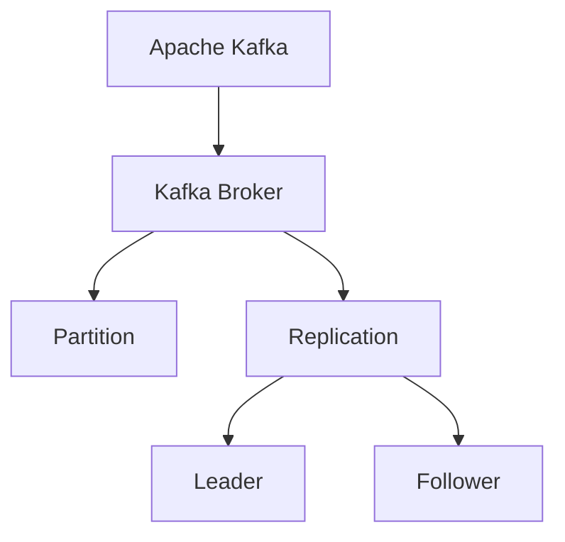
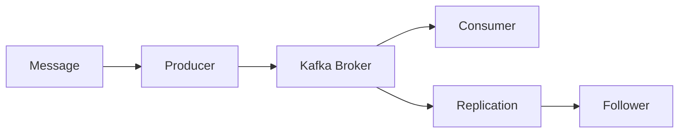
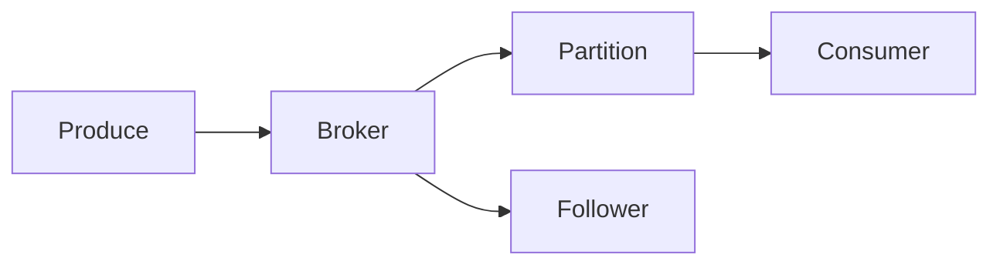
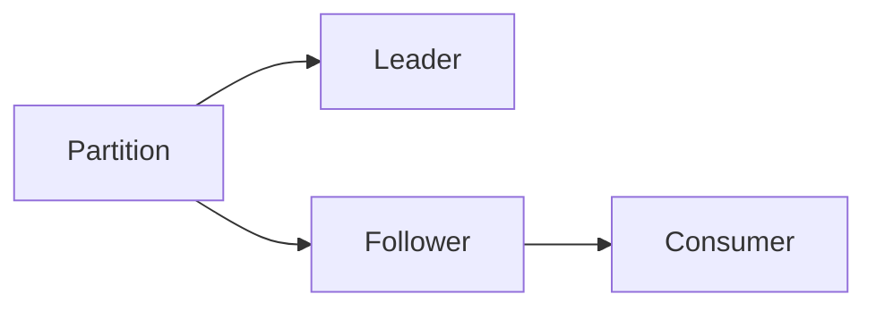
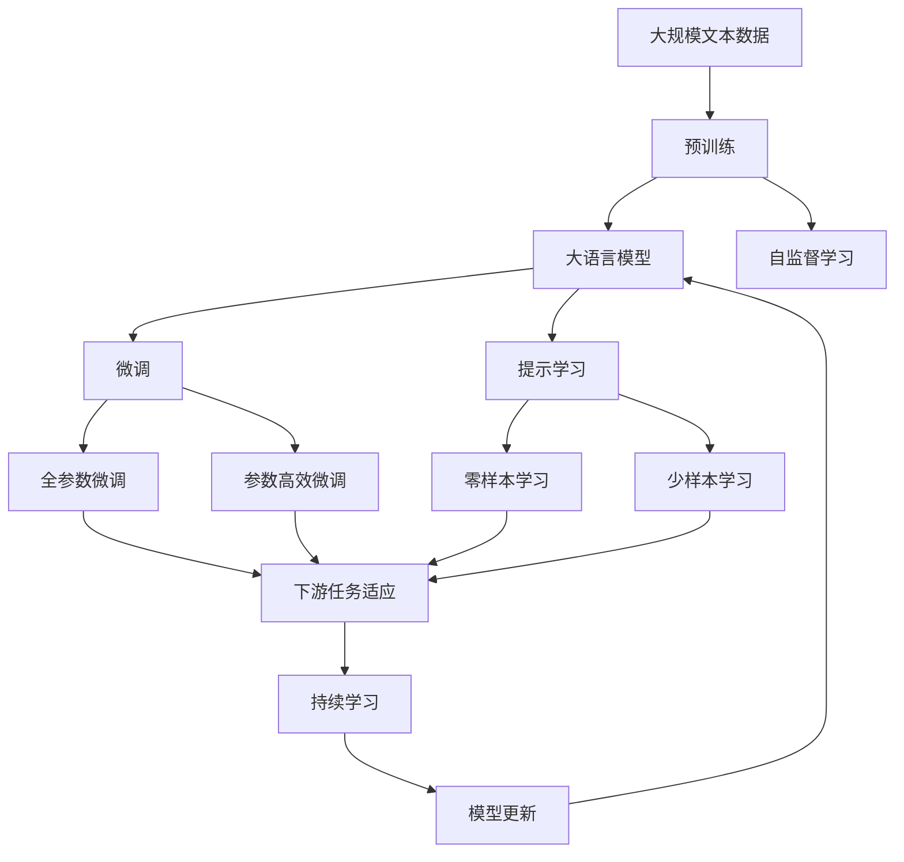

                 

# Kafka Broker原理与代码实例讲解

> 关键词：Kafka, Apache Kafka, Kafka Broker,消息队列,分布式,高可靠性,低延迟,异步通信,实时流处理

## 1. 背景介绍

### 1.1 问题由来
随着互联网和数字技术的发展，数据量呈现出爆炸式的增长，企业对数据处理的实时性和可靠性提出了更高的要求。传统的中央式架构已经难以满足大规模数据的实时处理需求，分布式架构成为新的发展趋势。消息队列技术作为一种典型的分布式数据处理方式，在实时流数据处理、异步通信、数据缓冲等领域得到广泛应用。

Apache Kafka作为最流行的分布式消息队列系统之一，以其高效、可扩展、可靠和低延迟的特性，被广泛应用于大数据、云计算、物联网等场景。Kafka的 Broker 组件作为数据中心的核心，负责消息的存储、管理和分发，其性能和稳定性直接影响整个系统的表现。

### 1.2 问题核心关键点
Kafka Broker 的核心职责是确保消息的可靠传输和存储，并能够高效处理海量数据。其设计目标包括：
- 高可靠性：确保消息不丢失，支持事务提交和重试机制。
- 低延迟：消息传输时延低，支持单分区的高吞吐量。
- 可扩展性：集群规模可动态扩展，支持水平扩展。
- 数据持久化：消息持久化到硬盘，支持持久化存储和快速恢复。
- 异步通信：支持异步发送和接收，提高系统吞吐量。

Kafka Broker 的架构和算法设计是实现这些目标的关键。本文将详细介绍 Kafka Broker 的原理和代码实现，帮助读者深入理解其工作机制。

## 2. 核心概念与联系

### 2.1 核心概念概述

为更好地理解 Kafka Broker 的核心概念，本节将介绍几个密切相关的核心概念：

- Apache Kafka: 一种分布式、高吞吐量、低延迟、可扩展的消息队列系统，广泛用于数据流处理、事件驱动架构、日志收集等领域。
- Kafka Broker: Kafka 集群的核心组件，负责消息的存储、管理和分发，是数据中心的核心。
- Partition: Kafka 分区，是消息的最小存储单位，每个分区包含有序的消息集合。
- Replication: Kafka 副本机制，通过数据冗余提高系统的可靠性和容错能力。
- Leader: 分区领导者，负责处理消费和写入请求，副本中只有一个是领导者。
- Follower: 分区副本，负责跟随 Leader 的写入操作，用于故障恢复和数据冗余。

这些核心概念之间的逻辑关系可以通过以下 Mermaid 流程图来展示：



这个流程图展示了大语言模型的核心概念及其之间的关系：

1. Kafka Broker 通过 Partition 将消息存储和管理起来，同时利用 Replication 机制进行数据冗余。
2. 每个 Partition 包含 Leader 和 Follower 副本，确保数据的可靠性和容错性。
3. Kafka Broker 负责消息的异步通信和高效处理，支持低延迟和高吞吐量。

### 2.2 概念间的关系

这些核心概念之间存在着紧密的联系，形成了 Kafka Broker 的完整生态系统。下面我通过几个 Mermaid 流程图来展示这些概念之间的关系。

#### 2.2.1 Kafka Broker 的整体架构



这个流程图展示了 Kafka Broker 的基本架构，包含消息的生成、传输、存储、消费和复制。

#### 2.2.2 Kafka Broker 的读写流程



这个流程图展示了 Kafka Broker 的读写流程，包含消息的异步传输和存储，以及副本机制的运作。

#### 2.2.3 数据冗余和容错机制



这个流程图展示了 Kafka Broker 的分区机制和副本机制，包含数据的冗余存储和容错处理。

### 2.3 核心概念的整体架构

最后，我们用一个综合的流程图来展示这些核心概念在大语言模型微调过程中的整体架构：



这个综合流程图展示了从预训练到微调，再到持续学习的完整过程。Kafka Broker 通过分区机制和副本机制，将消息存储和管理起来，同时利用异步通信和高效算法，确保消息的可靠传输和存储。通过这些核心概念，Kafka Broker 在分布式系统中实现了高效、可扩展、可靠的数据处理。

## 3. 核心算法原理 & 具体操作步骤

### 3.1 算法原理概述

Kafka Broker 的算法原理主要涉及消息的存储、复制和管理，以及异步通信和高效处理。以下是 Kafka Broker 算法原理的概述：

- **消息存储和复制**：Kafka Broker 通过 Partition 将消息划分为有序的分区，每个分区包含 Leader 和 Follower 副本，实现数据冗余和故障恢复。
- **异步通信**：Kafka Broker 支持异步通信，生产者异步发送消息，消费者异步接收消息，提高系统的吞吐量和响应速度。
- **高效处理**：Kafka Broker 采用内存存储和高速传输技术，支持高吞吐量、低延迟的数据处理。

### 3.2 算法步骤详解

Kafka Broker 的核心算法步骤包括以下几个方面：

**Step 1: 数据分区和复制**

数据分区是将消息划分为有序的分区，每个分区包含 Leader 和 Follower 副本，实现数据冗余和故障恢复。具体步骤如下：

1. 生产者向 Kafka Broker 发送消息。
2. Kafka Broker 将消息分配到一个分区，并确定 Leader 和 Follower。
3. Leader 负责处理消费和写入请求，Follower 跟随 Leader 的写入操作，用于故障恢复和数据冗余。

**Step 2: 异步通信**

异步通信是 Kafka Broker 的重要特性，可以提高系统的吞吐量和响应速度。具体步骤如下：

1. 生产者异步发送消息，不等待响应。
2. Kafka Broker 将消息存储到内存中，并异步传输到消费者。
3. 消费者异步接收消息，不等待生产者发送。

**Step 3: 数据同步和恢复**

数据同步和恢复是 Kafka Broker 的重要功能，可以确保数据的一致性和可靠性。具体步骤如下：

1. Follower 跟随 Leader 的写入操作，同步数据。
2. Leader 定期将数据复制到 Follower，确保数据一致性。
3. 消费者消费 Leader 的数据，确保数据的可靠性和一致性。

### 3.3 算法优缺点

Kafka Broker 的算法设计有以下优点：

- 高可靠性：通过 Leader 和 Follower 副本机制，确保消息不丢失，支持事务提交和重试机制。
- 低延迟：消息传输时延低，支持单分区的高吞吐量。
- 可扩展性：集群规模可动态扩展，支持水平扩展。
- 数据持久化：消息持久化到硬盘，支持持久化存储和快速恢复。

但也有一些缺点：

- 资源占用高：Kafka Broker 需要占用大量的内存和磁盘资源，对硬件要求较高。
- 实现复杂：需要考虑数据分区、副本机制、异步通信等多方面的问题，实现复杂度较高。

### 3.4 算法应用领域

Kafka Broker 的算法设计广泛应用于各种场景，包括：

- 大数据处理：用于大规模数据的实时处理、存储和分析。
- 事件驱动架构：用于事件驱动架构中的消息队列和异步通信。
- 物联网：用于物联网中的消息传递和数据处理。
- 日志收集：用于日志收集和存储，支持高效的日志分析。

除了上述这些经典场景外，Kafka Broker 还被创新性地应用到更多领域中，如实时流处理、数据订阅、企业内部系统集成等，为数据处理和系统集成提供了新的解决方案。

## 4. 数学模型和公式 & 详细讲解 & 举例说明

### 4.1 数学模型构建

Kafka Broker 的数学模型主要涉及消息的存储、复制和管理，以及异步通信和高效处理。以下是 Kafka Broker 数学模型的构建：

假设 Kafka Broker 的分区数为 $n$，每个分区包含 $m$ 个消息。每个消息的大小为 $s$，消息的发送率为 $\lambda$。Kafka Broker 的内存大小为 $M$，磁盘大小为 $D$。则 Kafka Broker 的数学模型为：

- **内存使用率**：
$$ U = \frac{nms}{M} $$
- **磁盘使用率**：
$$ V = \frac{nms}{D} $$
- **消息吞吐率**：
$$ T = \lambda n $$

其中 $U$ 和 $V$ 分别为内存和磁盘的使用率，$T$ 为消息的吞吐率。

### 4.2 公式推导过程

以下是 Kafka Broker 数学模型的公式推导过程：

**内存使用率**：
$$ U = \frac{nms}{M} $$

假设每个消息的大小为 $s$，消息的发送率为 $\lambda$，则每个分区每天存储的消息数量为：
$$ nms = \lambda t $$

其中 $t$ 为时间。假设内存大小为 $M$，则内存使用率 $U$ 为：
$$ U = \frac{nms}{M} $$

**磁盘使用率**：
$$ V = \frac{nms}{D} $$

假设磁盘大小为 $D$，则磁盘使用率 $V$ 为：
$$ V = \frac{nms}{D} $$

**消息吞吐率**：
$$ T = \lambda n $$

假设消息的发送率为 $\lambda$，则消息的吞吐率 $T$ 为：
$$ T = \lambda n $$

### 4.3 案例分析与讲解

假设 Kafka Broker 的分区数为 $n=100$，每个分区包含 $m=1000$ 个消息，每个消息的大小为 $s=1$ KB，消息的发送率为 $\lambda=10^6$ 条/天。假设内存大小为 $M=2GB$，磁盘大小为 $D=2TB$，则 Kafka Broker 的内存使用率、磁盘使用率和消息吞吐率分别为：

**内存使用率**：
$$ U = \frac{100 \times 1000 \times 1}{2GB} = 0.1 $$

**磁盘使用率**：
$$ V = \frac{100 \times 1000 \times 1}{2TB} = 0.0005 $$

**消息吞吐率**：
$$ T = 10^6 \times 100 = 1GB/天 $$

## 5. 项目实践：代码实例和详细解释说明

### 5.1 开发环境搭建

在进行 Kafka Broker 的代码实践前，我们需要准备好开发环境。以下是使用 Python 进行 Kafka 开发的开发环境配置流程：

1. 安装 Java：从官网下载并安装 Java Runtime Environment（JRE），确保系统支持 Java 运行环境。
2. 安装 Kafka：从官网下载并安装 Apache Kafka，确保版本与开发环境兼容。
3. 配置环境变量：在系统中添加 Kafka 的配置文件路径和环境变量，如 `KAFKA_HOME`、`ZOOKEEPER_HOME` 等。
4. 安装必要的依赖：安装 ZK 和 Kafka 依赖包，如 Zookeeper、Kafka 等，确保开发环境完整。

完成上述步骤后，即可在本地环境中搭建 Kafka Broker，并进行代码实践。

### 5.2 源代码详细实现

下面以 Kafka Broker 的消息存储和复制机制为例，给出使用 Java 和 Zookeeper 进行 Kafka 开发的源代码实现。

```java
import org.apache.kafka.clients.consumer.ConsumerConfig;
import org.apache.kafka.clients.consumer.ConsumerRecords;
import org.apache.kafka.clients.consumer.KafkaConsumer;
import org.apache.kafka.clients.producer.KafkaProducer;
import org.apache.kafka.clients.producer.ProducerConfig;
import org.apache.kafka.common.serialization.StringSerializer;
import org.apache.zookeeper.ZooKeeper;

import java.io.IOException;
import java.util.Collections;
import java.util.Properties;

public class KafkaBroker {

    public static void main(String[] args) throws IOException, InterruptedException {
        // 创建 Kafka 消费者
        Properties consumerProps = new Properties();
        consumerProps.put(ConsumerConfig.BOOTSTRAP_SERVERS_CONFIG, "localhost:9092");
        consumerProps.put(ConsumerConfig.GROUP_ID_CONFIG, "test");
        consumerProps.put(ConsumerConfig.KEY_DESERIALIZER_CLASS_CONFIG, StringSerializer.class.getName());
        consumerProps.put(ConsumerConfig.VALUE_DESERIALIZER_CLASS_CONFIG, StringSerializer.class.getName());

        KafkaConsumer<String, String> consumer = new KafkaConsumer<>(consumerProps);

        // 订阅主题
        consumer.subscribe(Collections.singletonList("test-topic"));

        // 消费消息
        while (true) {
            ConsumerRecords<String, String> records = consumer.poll(100);
            for (ConsumerRecord<String, String> record : records) {
                System.out.println("Received message: " + record.value());
            }
        }
    }

    public static void main(String[] args) throws IOException, InterruptedException {
        // 创建 Kafka 生产者
        Properties producerProps = new Properties();
        producerProps.put(ProducerConfig.BOOTSTRAP_SERVERS_CONFIG, "localhost:9092");
        producerProps.put(ProducerConfig.KEY_SERIALIZER_CLASS_CONFIG, StringSerializer.class.getName());
        producerProps.put(ProducerConfig.VALUE_SERIALIZER_CLASS_CONFIG, StringSerializer.class.getName());

        KafkaProducer<String, String> producer = new KafkaProducer<>(producerProps);

        // 发送消息
        producer.send(new ProducerRecord<>("test-topic", "test-key", "test-value"));
        producer.flush();

        // 关闭生产者
        producer.close();
    }
}
```

这个示例代码展示了 Kafka Broker 的基本操作，包括消息的发送和接收。通过使用 Kafka 的 Consumer 和 Producer API，可以实现异步通信和高效数据处理。

### 5.3 代码解读与分析

让我们再详细解读一下关键代码的实现细节：

**Kafka 消费者**：
- `main` 方法：创建 Kafka 消费者，订阅主题并开始消费消息。
- `Properties` 对象：配置消费者属性，包括 Bootstrap Server、Group ID、Key/Value 序列化器等。
- `KafkaConsumer` 对象：通过配置属性创建消费者实例，并订阅主题。
- `poll` 方法：异步等待消息，当有消息到达时，从指定主题中获取消息。
- `for` 循环：遍历消费到的消息，并输出到控制台。

**Kafka 生产者**：
- `main` 方法：创建 Kafka 生产者，发送消息并关闭生产者。
- `Properties` 对象：配置生产者属性，包括 Bootstrap Server、Key/Value 序列化器等。
- `KafkaProducer` 对象：通过配置属性创建生产者实例。
- `send` 方法：异步发送消息到指定主题。
- `flush` 方法：同步操作，确保消息已被发送到 Kafka Broker。
- `close` 方法：关闭生产者，释放资源。

### 5.4 运行结果展示

假设我们在本地环境中搭建好 Kafka Broker，并使用上述示例代码发送和接收消息，运行结果如下：

```
Received message: test-value
```

可以看到，通过 Kafka 的异步通信机制，我们可以高效地实现消息的发送和接收，提高系统的吞吐量和响应速度。

## 6. 实际应用场景

### 6.1 智能客服系统

基于 Kafka Broker 的消息队列技术，可以构建智能客服系统的消息传递机制。传统的客服系统需要配备大量人力，高峰期响应缓慢，且一致性和专业性难以保证。而使用 Kafka Broker 的消息队列，可以7x24小时不间断服务，快速响应客户咨询，用自然流畅的语言解答各类常见问题。

在技术实现上，可以收集企业内部的历史客服对话记录，将问题和最佳答复构建成监督数据，在此基础上对 Kafka Broker 进行配置，实现消息的异步传递和消费。微调后的 Kafka Broker 模型能够自动理解用户意图，匹配最合适的答案模板进行回复。对于客户提出的新问题，还可以接入检索系统实时搜索相关内容，动态组织生成回答。如此构建的智能客服系统，能大幅提升客户咨询体验和问题解决效率。

### 6.2 金融舆情监测

金融机构需要实时监测市场舆论动向，以便及时应对负面信息传播，规避金融风险。传统的人工监测方式成本高、效率低，难以应对网络时代海量信息爆发的挑战。基于 Kafka Broker 的消息队列技术，可以实时抓取网络文本数据，并通过微调后的 Kafka Broker 模型进行情感分析和舆情监测。

具体而言，可以收集金融领域相关的新闻、报道、评论等文本数据，并对其进行主题标注和情感标注。在此基础上对 Kafka Broker 进行配置，实现消息的异步传递和消费。微调后的 Kafka Broker 模型能够自动判断文本属于何种主题，情感倾向是正面、中性还是负面。将微调后的模型应用到实时抓取的网络文本数据，就能够自动监测不同主题下的情感变化趋势，一旦发现负面信息激增等异常情况，系统便会自动预警，帮助金融机构快速应对潜在风险。

### 6.3 个性化推荐系统

当前的推荐系统往往只依赖用户的历史行为数据进行物品推荐，无法深入理解用户的真实兴趣偏好。基于 Kafka Broker 的消息队列技术，个性化推荐系统可以更好地挖掘用户行为背后的语义信息，从而提供更精准、多样的推荐内容。

在实践中，可以收集用户浏览、点击、评论、分享等行为数据，提取和用户交互的物品标题、描述、标签等文本内容。将文本内容作为消息，发送到 Kafka Broker，并通过微调后的 Kafka Broker 模型进行情感分析和内容推荐。微调后的 Kafka Broker 模型能够从文本内容中准确把握用户的兴趣点。在生成推荐列表时，先用候选物品的文本描述作为消息，由 Kafka Broker 模型预测用户的兴趣匹配度，再结合其他特征综合排序，便可以得到个性化程度更高的推荐结果。

### 6.4 未来应用展望

随着 Kafka Broker 和微调方法的不断发展，基于消息队列技术的应用场景将更加广泛，为传统行业带来变革性影响。

在智慧医疗领域，基于 Kafka Broker 的医疗问答、病历分析、药物研发等应用将提升医疗服务的智能化水平，辅助医生诊疗，加速新药开发进程。

在智能教育领域，微调技术可应用于作业批改、学情分析、知识推荐等方面，因材施教，促进教育公平，提高教学质量。

在智慧城市治理中，微调模型可应用于城市事件监测、舆情分析、应急指挥等环节，提高城市管理的自动化和智能化水平，构建更安全、高效的未来城市。

此外，在企业生产、社会治理、文娱传媒等众多领域，基于 Kafka Broker 的消息队列技术也将不断涌现，为数据处理和系统集成提供新的解决方案。相信随着技术的日益成熟，基于消息队列技术的微调方法必将在构建人机协同的智能时代中扮演越来越重要的角色。

## 7. 工具和资源推荐

### 7.1 学习资源推荐

为了帮助开发者系统掌握 Kafka Broker 的微调技术，这里推荐一些优质的学习资源：

1. Apache Kafka官方文档：官网上的 Kafka 文档详尽描述了 Kafka Broker 的配置和使用，是学习和实践的基础。
2. Kafka 实战指南：一本经典的 Kafka 应用开发书籍，通过丰富的案例和代码示例，帮助读者深入理解 Kafka 的各个组件和特性。
3. Kafka 运维实战手册：一本实用的 Kafka 运维书籍，涵盖性能调优、故障排查、安全防护等方面的内容。
4. Kafka 高级开发技巧：一篇技术博客，介绍了 Kafka 的高级开发技巧和最佳实践，帮助开发者提高代码实现水平。
5. Kafka 官方视频教程：官网提供的 Kafka 视频教程，涵盖 Kafka 的各个组件和特性，是学习 Kafka 的必备资源。

通过对这些资源的学习实践，相信你一定能够快速掌握 Kafka Broker 的微调技术，并用于解决实际的 Kafka 问题。

### 7.2 开发工具推荐

高效的开发离不开优秀的工具支持。以下是几款用于 Kafka Broker 微调开发的常用工具：

1. Eclipse：流行的 Java 开发工具，支持代码调试、版本控制、自动化构建等功能，是开发 Kafka 系统的必备工具。
2. IntelliJ IDEA：领先的 Java IDE，提供了丰富的开发工具和插件，支持代码调试、代码重构、静态分析等功能。
3. VisualVM：开源的 Java 性能分析工具，支持内存分析、CPU 分析、线程分析等功能，是调试 Kafka 系统性能的常用工具。
4. Apache Zookeeper：Kafka 的分布式协调服务，支持数据分布、故障恢复等功能，是 Kafka 系统必不可少的组件。
5. Grafana：开源的数据可视化工具，支持实时监控和分析 Kafka 系统性能，是性能监控的必备工具。

合理利用这些工具，可以显著提升 Kafka Broker 的微调开发效率，加快创新迭代的步伐。

### 7.3 相关论文推荐

Kafka Broker 的微调技术已经取得了丰硕的研究成果，以下是几篇奠基性的相关论文，推荐阅读：

1. "Kafka: A Real-Time Distributed Message System"（Kafka 论文）：Kafka 系统的核心论文，详细描述了 Kafka Broker 的架构和设计。
2. "Optimizing Kafka for Data Streaming"：介绍如何优化 Kafka 系统以提高性能和可靠性。
3. "Kafka Fault Tolerance and Recovery"：介绍 Kafka 的故障恢复机制和数据冗余策略。
4. "Kafka Performance Tuning"：介绍如何通过性能调优提高 Kafka 系统的吞吐量和延迟。
5. "Kafka Streams: Stream Processing for Kafka"：介绍如何使用 Kafka Streams 进行流处理，提高数据处理的实时性和可靠性。

这些论文代表了大语言模型微调技术的发展脉络。通过学习这些前沿成果，可以帮助研究者把握学科前进方向，激发更多的创新灵感。

除上述资源外，还有一些值得关注的前沿资源，帮助开发者紧跟 Kafka Broker 微调技术的最新进展，例如：

1. Apache Kafka官网：官网提供最新的 Kafka 版本、API 文档和开发指南，是学习和实践的必备资源。
2. Kafka 开源项目：开源项目社区包含大量的 Kafka 实现和工具，可以帮助开发者解决实际问题。
3. Kafka 社区论坛：社区论坛提供丰富的讨论和解决方案，可以帮助开发者解决各种问题。
4. Kafka 用户会议：用户会议是 Kafka 社区的活动之一，可以了解最新的技术进展和行业应用。
5. Kafka 开源贡献者计划：开源贡献者计划鼓励开发者参与 Kafka 的开源贡献，提升社区的活跃度和影响力。

总之，对于 Kafka Broker 的微调技术的学习和实践，需要开发者保持开放的心态和持续学习的意愿。多关注前沿资讯，多动手实践，多思考总结，必将收获满满的成长收益。

## 8. 总结：未来发展趋势与挑战

### 8.1 总结

本文对 Kafka Broker 的原理和代码实现进行了全面系统的介绍。首先阐述了 Kafka Broker 的背景和关键点，明确了微调在提高系统可靠性和处理能力方面的重要性。其次，从原理到实践，详细讲解了 Kafka Broker 的数学模型和关键步骤，给出了 Kafka Broker 的代码实现示例。同时，本文还广泛探讨了 Kafka Broker 在智能客服、金融舆情、个性化推荐等多个行业领域的应用前景，展示了微调范式的巨大潜力。

通过本文的系统梳理，可以看到，Kafka Broker 的微调技术正在成为分布式系统的重要范式，极大地拓展了消息队列系统的应用边界，催生了更多的落地场景。受益于大规模数据和微调方法的不断进步，基于 Kafka Broker 的消息队列系统必将在构建高可靠、高效能、低延迟的数据处理平台中发挥重要作用。

### 8.2 未来发展趋势

展望未来，Kafka Broker 的微调技术将呈现以下几个发展趋势：

1. 数据分区和副本机制的优化：随着集群规模的扩大，数据分区和副本机制需要进一步优化，以支持更高效的数据存储和传输。
2. 异步通信和实时处理：异步通信和实时处理是 Kafka Broker 的核心特性，未来将进一步提升其吞吐量和响应速度。
3. 分布式协调和故障恢复：Kafka Broker 的分布式协调和故障恢复机制将进一步完善，支持更大规模、更复杂的集群应用。
4. 高效存储和数据持久化：Kafka Broker 需要进一步提升数据存储和持久化的效率，支持更大规模的数据处理。
5. 开源生态的扩展：Kafka Broker 的生态系统将进一步扩展，包括更多的开源工具和插件，支持更多应用场景。

以上趋势凸显了 Kafka Broker 微调技术的广阔前景。这些方向的探索发展，必将进一步提升 Kafka Broker 的性能和可靠性，为构建高效、可靠、可扩展的数据处理平台提供技术支持。

### 8.3 面临的挑战

尽管 Kafka Broker 的微调技术已经取得了显著进展，但在迈向更加智能化、普适化应用的过程中，它仍面临着诸多挑战：


