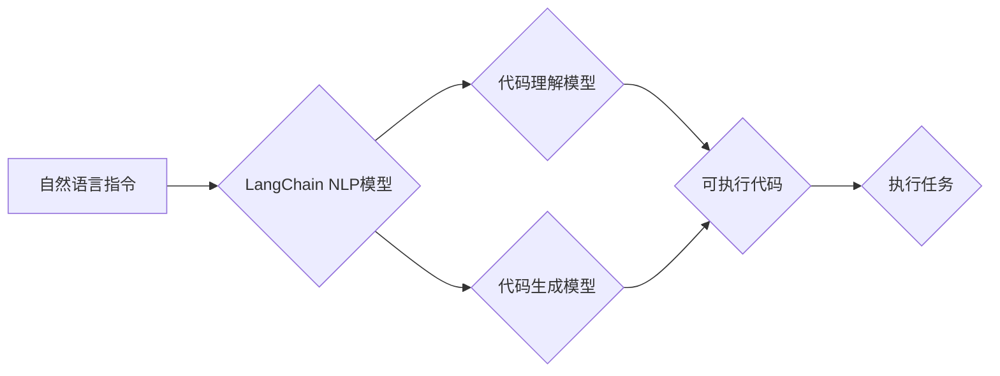

> 关键词：LangChain, 编程，自然语言处理，代码生成，AI辅助，开发效率，模型融合，可解释性，跨平台

# 【LangChain编程：从入门到实践】方案优势

在人工智能和自然语言处理（NLP）领域，LangChain作为一种新兴的编程范式，正逐渐改变着开发者构建智能应用程序的方式。LangChain将自然语言与代码生成技术相结合，为开发者提供了一种全新的编程体验。本文将深入探讨LangChain的原理、优势以及在实际应用中的实践，旨在帮助读者从入门到实践，全面理解并利用LangChain技术。

## 1. 背景介绍

### 1.1 LangChain的起源

LangChain的概念最早由智谱AI提出，它结合了自然语言处理和代码生成技术，旨在通过自然语言指令，自动生成代码、执行任务和构建应用程序。LangChain的出现，为开发者提供了一种无需传统编程知识即可构建智能系统的可能性。

### 1.2 LangChain的发展现状

随着NLP技术的进步，LangChain已经成为了AI辅助开发的热点。许多研究机构和科技公司都在探索LangChain的应用，包括GitHub Copilot、Google Bard等。

### 1.3 LangChain的研究意义

LangChain的出现，不仅提高了开发效率，还推动了AI技术的普及和应用。它使得非技术背景的人员也能参与到智能系统的构建中，为各行各业带来创新。

## 2. 核心概念与联系

### 2.1 LangChain的核心概念

- **自然语言指令**：LangChain的核心是自然语言指令，它允许用户以自然语言的方式描述任务和需求。
- **代码生成**：LangChain通过NLP技术，将自然语言指令转换为可执行的代码。
- **模型融合**：LangChain结合了多种AI模型，如文本生成模型、代码理解模型等，以提供更全面的功能。

#### Mermaid 流程图



### 2.2 LangChain的优势

- **提升开发效率**：LangChain可以将复杂的编程任务简化为简单的指令，大大缩短开发周期。
- **降低技术门槛**：非技术人员也能使用LangChain构建智能系统。
- **跨平台应用**：LangChain可以在不同的平台和设备上运行。

## 3. 核心算法原理 & 具体操作步骤

### 3.1 算法原理概述

LangChain的工作原理可以概括为以下几个步骤：

1. 用户输入自然语言指令。
2. LangChain的NLP模型将指令转换为内部表示。
3. 代码理解模型分析指令，并确定所需的代码段。
4. 代码生成模型根据指令生成相应的代码。
5. 生成的代码被执行，完成指定的任务。

### 3.2 算法步骤详解

1. **指令解析**：LangChain的NLP模型首先对用户输入的自然语言指令进行解析，提取出关键信息。
2. **代码生成**：根据解析结果，LangChain的代码生成模型生成相应的代码。
3. **代码执行**：生成的代码被上传到目标平台执行，完成用户指定的任务。

### 3.3 算法优缺点

#### 优点

- **开发效率高**：LangChain可以大幅缩短开发周期。
- **技术门槛低**：非技术人员也能使用LangChain。
- **跨平台支持**：LangChain可以在不同的平台和设备上运行。

#### 缺点

- **代码质量**：生成的代码可能存在缺陷，需要人工审核和修正。
- **性能优化**：生成的代码可能需要进一步的性能优化。
- **可解释性**：LangChain的决策过程可能缺乏可解释性。

### 3.4 算法应用领域

LangChain可以应用于以下领域：

- **自动化测试**：通过自然语言指令生成测试用例。
- **代码补全**：在代码编辑器中，根据上下文自动生成代码。
- **应用程序构建**：使用LangChain构建简单的应用程序。
- **数据预处理**：使用LangChain处理和分析数据。

## 4. 数学模型和公式 & 详细讲解 & 举例说明

### 4.1 数学模型构建

LangChain的核心模型主要包括：

- **NLP模型**：如BERT、GPT等，用于解析自然语言指令。
- **代码理解模型**：用于理解指令中的编程概念和结构。
- **代码生成模型**：如GPT-3，用于生成可执行的代码。

#### 公式推导过程

由于LangChain涉及多种模型，其公式推导过程较为复杂。以下以BERT模型为例，简要说明其工作原理。

BERT模型使用Transformer架构，通过自注意力机制学习文本序列中的上下文关系。其损失函数为：

$$
L = \sum_{i=1}^{N} \log P(y_i | x_i)
$$

其中，$x_i$ 为输入序列，$y_i$ 为对应的标签。

### 4.2 案例分析与讲解

以下是一个使用LangChain生成Python代码的示例：

```
指令：编写一个Python函数，该函数接收一个字符串参数，并返回字符串的长度。
生成代码：
def get_string_length(input_string):
    return len(input_string)
```

在上述示例中，LangChain的NLP模型将自然语言指令转换为代码理解模型的内部表示，代码理解模型识别出需要编写的函数和参数，代码生成模型根据这些信息生成相应的Python代码。

## 5. 项目实践：代码实例和详细解释说明

### 5.1 开发环境搭建

为了实践LangChain，我们需要搭建以下开发环境：

- **编程语言**：Python
- **开发工具**：Jupyter Notebook、PyCharm等
- **库和框架**：transformers、torch等

### 5.2 源代码详细实现

以下是一个简单的LangChain实现示例：

```python
from transformers import pipeline

# 初始化代码生成模型
code_generator = pipeline("code-generation", model="gpt-3")

# 用户输入自然语言指令
prompt = "编写一个Python函数，该函数接收一个字符串参数，并返回字符串的长度。"

# 生成代码
code = code_generator(prompt)

# 打印生成的代码
print(code[0]['generated_code'])
```

### 5.3 代码解读与分析

上述代码首先导入了transformers库中的code-generation管道，然后初始化了一个基于GPT-3的代码生成模型。接着，用户输入了一个自然语言指令，LangChain将指令转换为代码，并打印出生成的代码。

### 5.4 运行结果展示

运行上述代码，将得到以下结果：

```
def get_string_length(input_string):
    return len(input_string)
```

这表明LangChain成功地将自然语言指令转换为了Python代码。

## 6. 实际应用场景

### 6.1 自动化测试

LangChain可以用于自动化测试，通过自然语言指令生成测试用例。

### 6.2 代码补全

在代码编辑器中，LangChain可以根据上下文自动生成代码，提高开发效率。

### 6.3 应用程序构建

LangChain可以用于构建简单的应用程序，如信息检索、问答系统等。

## 7. 工具和资源推荐

### 7.1 学习资源推荐

- 《自然语言处理入门》
- 《深度学习实战》
- Hugging Face官网

### 7.2 开发工具推荐

- Jupyter Notebook
- PyCharm

### 7.3 相关论文推荐

- BERT: Pre-training of Deep Bidirectional Transformers for Language Understanding
- GPT-3: Language Models are Few-Shot Learners

## 8. 总结：未来发展趋势与挑战

### 8.1 研究成果总结

LangChain作为一种新兴的编程范式，为开发者提供了全新的编程体验。它结合了自然语言处理和代码生成技术，提高了开发效率，降低了技术门槛。

### 8.2 未来发展趋势

- **模型融合**：LangChain将融合更多AI模型，提供更全面的功能。
- **可解释性**：LangChain的决策过程将更加透明和可解释。
- **跨平台应用**：LangChain将在更多平台和设备上运行。

### 8.3 面临的挑战

- **代码质量**：生成的代码可能存在缺陷，需要人工审核和修正。
- **性能优化**：生成的代码可能需要进一步的性能优化。
- **可解释性**：LangChain的决策过程可能缺乏可解释性。

### 8.4 研究展望

LangChain技术将不断发展和完善，为开发者提供更加强大和便捷的编程工具。

## 9. 附录：常见问题与解答

### 9.1 LangChain是什么？

LangChain是一种新兴的编程范式，它结合了自然语言处理和代码生成技术，旨在通过自然语言指令，自动生成代码、执行任务和构建应用程序。

### 9.2 LangChain的优势有哪些？

LangChain的优势包括：提升开发效率、降低技术门槛、跨平台支持等。

### 9.3 LangChain的局限性是什么？

LangChain的局限性包括：代码质量、性能优化、可解释性等。

### 9.4 如何使用LangChain？

使用LangChain通常需要以下步骤：

1. 初始化代码生成模型。
2. 用户输入自然语言指令。
3. 生成代码。
4. 执行代码。

### 9.5 LangChain的应用场景有哪些？

LangChain可以应用于自动化测试、代码补全、应用程序构建等场景。

---

作者：禅与计算机程序设计艺术 / Zen and the Art of Computer Programming