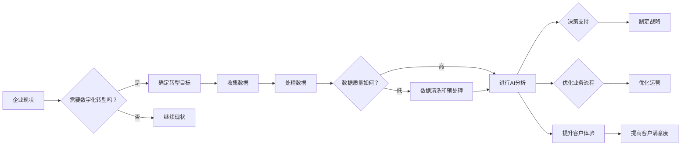

# 企业数字化转型中的AI应用

> 关键词：企业数字化转型，人工智能，AI应用，大数据，机器学习，深度学习，智能决策，业务流程优化

## 1. 背景介绍

随着信息技术的飞速发展，人工智能（AI）已经成为推动企业数字化转型的重要力量。AI技术的应用不仅改变了企业的运营模式，还极大地提升了企业的竞争力和市场响应速度。本文将深入探讨企业数字化转型中的AI应用，分析其核心概念、技术原理、实施步骤、实际应用场景，以及未来的发展趋势和挑战。

### 1.1 数字化转型的必要性

在数字经济时代，企业面临着前所未有的挑战和机遇。数字化转型成为企业实现持续增长、提升竞争力的必然选择。以下是数字化转型的一些关键原因：

- **市场竞争加剧**：数字化时代，市场变化速度加快，企业需要快速响应市场变化，以满足客户需求。
- **客户需求变化**：消费者对个性化、定制化服务的需求日益增长，企业需要通过数字化转型来满足这些需求。
- **技术进步**：云计算、大数据、物联网等新技术的出现，为企业数字化转型提供了强大的技术支撑。
- **降低成本**：数字化转型可以帮助企业优化业务流程，提高效率，降低运营成本。

### 1.2 AI在数字化转型中的作用

AI技术可以帮助企业在数字化转型过程中实现以下目标：

- **提升效率**：通过自动化处理重复性任务，减少人力成本，提高工作效率。
- **优化决策**：利用AI进行数据分析和预测，为企业提供决策支持。
- **创新业务模式**：AI可以帮助企业探索新的商业模式，创造新的价值。
- **提升客户体验**：通过个性化服务和智能交互，提升客户满意度和忠诚度。

## 2. 核心概念与联系

### 2.1 核心概念原理

企业数字化转型中的AI应用涉及以下核心概念：

- **大数据**：指规模巨大、类型多样的数据集合，需要使用特殊技术进行存储、管理和分析。
- **机器学习**：一种使计算机系统能够从数据中学习并做出决策的技术。
- **深度学习**：一种特殊的机器学习技术，通过构建深层神经网络模型来学习数据特征。
- **自然语言处理（NLP）**：使计算机能够理解、解释和生成人类语言的技术。
- **计算机视觉**：使计算机能够理解和解释视觉信息的技术。
- **推荐系统**：根据用户的历史行为和偏好，为用户推荐相关内容或商品的系统。

以下是一个描述AI应用在企业数字化转型中流程的Mermaid流程图：



### 2.2 核心概念联系

这些核心概念相互关联，共同构成了企业数字化转型中的AI应用体系。例如，机器学习依赖于大数据和深度学习技术来分析数据并提取特征；NLP和计算机视觉技术可以帮助企业理解和解释自然语言和视觉信息；推荐系统可以利用机器学习算法来预测用户行为。

## 3. 核心算法原理 & 具体操作步骤

### 3.1 算法原理概述

AI应用的核心是算法。以下是几种常见的AI算法及其原理：

- **监督学习**：通过训练数据集学习输入和输出之间的关系，用于预测新数据的标签。
- **非监督学习**：通过未标记的数据学习数据结构，用于发现数据中的模式。
- **强化学习**：通过奖励和惩罚机制来指导算法学习最优策略。

### 3.2 算法步骤详解

以下是一个基于监督学习的机器学习项目的典型步骤：

1. **问题定义**：明确要解决的问题，如预测客户流失、推荐商品等。
2. **数据收集**：收集相关数据，如用户行为数据、交易数据等。
3. **数据预处理**：清洗数据，处理缺失值，进行特征工程。
4. **模型选择**：选择合适的算法和模型，如线性回归、决策树、神经网络等。
5. **模型训练**：使用训练数据集训练模型。
6. **模型评估**：使用验证集评估模型性能。
7. **模型部署**：将模型部署到生产环境中，用于实际预测。

### 3.3 算法优缺点

每种算法都有其优缺点。以下是几种常见算法的优缺点：

- **线性回归**：简单易用，但难以处理非线性关系。
- **决策树**：易于理解，但容易过拟合。
- **神经网络**：能够处理复杂非线性关系，但训练时间较长。

### 3.4 算法应用领域

AI算法在各个领域都有广泛的应用，以下是一些例子：

- **金融**：信用评分、风险管理、欺诈检测。
- **医疗**：疾病诊断、药物研发、患者护理。
- **零售**：客户细分、库存管理、个性化推荐。
- **制造**：故障预测、质量控制、供应链优化。

## 4. 数学模型和公式 & 详细讲解 & 举例说明

### 4.1 数学模型构建

以下是一个简单的线性回归模型的数学模型：

$$
y = \beta_0 + \beta_1 x_1 + \beta_2 x_2 + \cdots + \beta_n x_n + \epsilon
$$

其中，$y$ 是因变量，$x_1, x_2, \ldots, x_n$ 是自变量，$\beta_0, \beta_1, \ldots, \beta_n$ 是模型的参数，$\epsilon$ 是误差项。

### 4.2 公式推导过程

线性回归模型的参数可以通过最小化损失函数来估计：

$$
\hat{\beta} = \arg\min_{\beta} \sum_{i=1}^N (y_i - \beta_0 - \beta_1 x_{1i} - \cdots - \beta_n x_{ni})^2
$$

### 4.3 案例分析与讲解

假设我们要预测一家在线零售商的销售额。我们可以收集历史销售数据，包括产品类别、价格、促销活动等信息。通过线性回归模型，我们可以建立一个预测模型，用于预测未来某个时间点的销售额。

## 5. 项目实践：代码实例和详细解释说明

### 5.1 开发环境搭建

为了进行AI应用开发，我们需要以下工具和软件：

- 编程语言：Python
- 机器学习库：scikit-learn、TensorFlow、PyTorch
- 数据处理库：Pandas、NumPy

### 5.2 源代码详细实现

以下是一个使用scikit-learn库进行线性回归的简单代码示例：

```python
from sklearn.linear_model import LinearRegression
from sklearn.model_selection import train_test_split
from sklearn.metrics import mean_squared_error

# 加载数据
data = pandas.read_csv('sales_data.csv')
X = data[['product_category', 'price', 'promotion']]
y = data['sales']

# 划分训练集和测试集
X_train, X_test, y_train, y_test = train_test_split(X, y, test_size=0.2, random_state=42)

# 创建线性回归模型
model = LinearRegression()

# 训练模型
model.fit(X_train, y_train)

# 预测测试集
y_pred = model.predict(X_test)

# 计算预测精度
mse = mean_squared_error(y_test, y_pred)
print(f'Mean Squared Error: {mse}')
```

### 5.3 代码解读与分析

以上代码首先从CSV文件中加载数据，然后划分训练集和测试集。接下来，创建一个线性回归模型，并使用训练集数据进行训练。最后，使用测试集数据进行预测，并计算预测精度。

## 6. 实际应用场景

### 6.1 客户关系管理

AI可以帮助企业更好地了解客户需求，提高客户满意度和忠诚度。以下是一些应用场景：

- 客户细分：根据客户行为和特征将客户划分为不同的群体，以便进行针对性的营销。
- 客户流失预测：预测哪些客户可能会流失，并采取措施挽留他们。
- 个性化推荐：根据客户的历史行为和偏好，为用户提供个性化的产品或服务推荐。

### 6.2 供应链管理

AI可以帮助企业优化供应链，降低成本，提高效率。以下是一些应用场景：

- 库存管理：预测未来需求，优化库存水平，避免库存积压或缺货。
- 供应商管理：评估供应商的绩效，选择最优供应商。
- 运输优化：优化运输路线，降低运输成本。

### 6.3 制造业

AI可以帮助企业提高生产效率，降低成本，提升产品质量。以下是一些应用场景：

- 设备故障预测：预测设备何时可能会发生故障，以便提前进行维修。
- 质量控制：自动检测产品质量，及时发现缺陷。
- 生产流程优化：优化生产流程，提高生产效率。

## 7. 工具和资源推荐

### 7.1 学习资源推荐

- 《Python机器学习》（作者：Sebastian Raschka）
- 《深度学习》（作者：Ian Goodfellow、Yoshua Bengio、Aaron Courville）
- Coursera上的《机器学习》课程
- edX上的《人工智能：一种现代的方法》课程

### 7.2 开发工具推荐

- Jupyter Notebook：用于数据分析和机器学习实验。
- TensorFlow：用于构建和训练深度学习模型。
- PyTorch：用于构建和训练深度学习模型。

### 7.3 相关论文推荐

- "Learning Representations by Backpropagating Errors"（作者：Geoffrey Hinton、David Warde-Farley、Richard Simon）
- "A Few Useful Things to Know about Machine Learning"（作者： Pedro Domingos）
- "Understanding Deep Learning"（作者：Shervin Pishevar）

## 8. 总结：未来发展趋势与挑战

### 8.1 研究成果总结

AI技术在企业数字化转型中发挥着越来越重要的作用。通过AI应用，企业可以提升效率、优化决策、创新业务模式、提升客户体验。然而，AI应用也面临着一些挑战，如数据质量、算法可解释性、模型鲁棒性等。

### 8.2 未来发展趋势

未来，AI技术在企业数字化转型中的应用将呈现以下趋势：

- 模型轻量化：为了适应移动设备和边缘计算环境，模型将更加轻量化。
- 可解释性增强：为了提高模型的信任度，模型的决策过程将更加可解释。
- 多模态学习：AI模型将能够处理多种类型的数据，如文本、图像、音频等。
- 联邦学习：为了保护用户隐私，联邦学习将成为一种重要的学习范式。

### 8.3 面临的挑战

AI在企业数字化转型中面临的挑战包括：

- 数据质量：高质量的数据是AI应用成功的关键。
- 算法可解释性：为了提高信任度，模型的决策过程需要更加可解释。
- 模型鲁棒性：模型需要能够抵抗对抗攻击和数据噪声。
- 伦理和隐私：AI应用需要遵循伦理和隐私保护原则。

### 8.4 研究展望

未来，AI技术在企业数字化转型中的应用将更加深入和广泛。以下是一些研究方向：

- 开发更强大的AI模型，以处理更复杂的数据和任务。
- 提高AI算法的可解释性和鲁棒性。
- 探索新的AI应用场景，如自动化决策、智能客服等。
- 建立AI伦理和隐私保护标准。

## 9. 附录：常见问题与解答

**Q1：什么是企业数字化转型？**

A：企业数字化转型是指企业利用数字技术改变其业务流程、组织结构和运营模式，以提高效率和竞争力。

**Q2：AI如何帮助企业进行数字化转型？**

A：AI可以帮助企业提升效率、优化决策、创新业务模式、提升客户体验。

**Q3：企业数字化转型中常见的挑战有哪些？**

A：企业数字化转型中常见的挑战包括数据质量、技术选型、人才培养、文化变革等。

**Q4：如何确保AI应用的可解释性和鲁棒性？**

A：确保AI应用的可解释性和鲁棒性需要从算法设计、数据质量、模型训练等方面进行综合考虑。

**Q5：AI在企业中的应用前景如何？**

A：AI在企业中的应用前景非常广阔，未来将会有更多的企业采用AI技术进行数字化转型。

---

作者：禅与计算机程序设计艺术 / Zen and the Art of Computer Programming