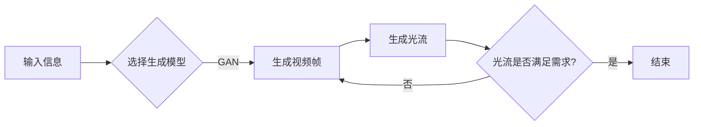

# 视频生成 (Video Generation)

> 关键词：视频生成，计算机视觉，深度学习，生成模型，GAN，光流，动作捕捉

## 1. 背景介绍

视频生成是指利用计算机技术自动创建或编辑视频内容的过程。随着深度学习技术的飞速发展，视频生成已经成为计算机视觉和多媒体领域的研究热点。视频生成技术不仅能够为影视制作、动画制作、游戏开发等领域带来革新，还能在教育、医疗、交通等多个行业发挥重要作用。本文将深入探讨视频生成的基本原理、算法步骤、应用领域以及未来发展趋势。

### 1.1 视频生成的由来

视频生成技术的发展源于以下几个方面的需求：

- **影视制作和动画制作**：为了降低制作成本和提高效率，需要开发能够自动生成高质量视频内容的技术。
- **虚拟现实和增强现实**：视频生成技术是构建沉浸式虚拟世界的关键，可以提供更加真实的视觉体验。
- **智能监控和视频分析**：通过对视频流进行实时处理，可以实现智能监控、视频摘要、行为识别等功能。
- **教育、医疗和交通等行业**：视频生成技术可以用于模拟真实场景，进行培训和辅助决策。

### 1.2 研究现状

当前，视频生成技术主要分为以下几类：

- **基于规则的视频生成**：通过编写脚本和动画规则，生成视频内容。这种方法可控性强，但缺乏灵活性。
- **基于视频编辑的视频生成**：通过拼接已有的视频片段，生成新的视频内容。这种方法可以快速生成视频，但内容质量可能较低。
- **基于深度学习的视频生成**：利用深度学习技术，根据文字描述、图像、音视频等多种输入生成视频内容。这种方法具有很高的灵活性和创造力。

### 1.3 研究意义

视频生成技术具有重要的研究意义和应用价值：

- **推动影视制作和动画制作的创新**：提高制作效率，降低制作成本，创造新的艺术形式。
- **促进虚拟现实和增强现实技术的发展**：提供更加真实的视觉体验，拓展应用场景。
- **提升智能监控和视频分析的能力**：实现实时视频处理，提高安防和智能交通等领域的效率。
- **推动教育、医疗和交通等行业的发展**：提供模拟训练、辅助诊断和决策支持等功能。

## 2. 核心概念与联系

### 2.1 视频生成核心概念

以下是视频生成领域的一些核心概念：

- **视频帧**：视频的基本组成单元，包含图像和音频信息。
- **视频流**：连续的、时间相关的视频帧序列。
- **生成模型**：能够根据输入信息生成视频内容的模型，如生成对抗网络（GAN）。
- **光流**：视频帧之间像素位置的相对运动信息。
- **动作捕捉**：记录和捕捉人体动作的技术。

### 2.2 Mermaid流程图

以下是基于深度学习的视频生成流程的Mermaid流程图：



### 2.3 核心概念联系

- 视频帧是视频生成的基础，生成模型根据视频帧生成新的视频内容。
- 光流用于描述视频帧之间的运动变化，是视频生成中重要的中间结果。
- 动作捕捉技术可以用于生成带有动作的视频内容。

## 3. 核心算法原理 & 具体操作步骤

### 3.1 算法原理概述

视频生成算法主要分为以下几类：

- **基于运动估计的方法**：通过估计视频帧之间的运动变化，生成新的视频帧。
- **基于生成对抗网络（GAN）的方法**：利用对抗训练生成逼真的视频内容。
- **基于视频编码和解码的方法**：通过编码和解码过程生成新的视频帧。

### 3.2 算法步骤详解

以下以基于GAN的视频生成算法为例，介绍其具体操作步骤：

1. **数据准备**：收集大量的带标签的视频数据，用于训练和测试。
2. **模型构建**：构建生成器（Generator）和判别器（Discriminator）模型。
3. **对抗训练**：通过对抗训练，使生成器生成的视频内容在判别器面前难以区分，同时使判别器能够准确判断生成的视频内容与真实视频内容之间的差异。
4. **视频生成**：使用生成器生成新的视频内容。
5. **视频优化**：对生成的视频内容进行优化，提高视频质量。

### 3.3 算法优缺点

**优点**：

- **生成内容逼真**：GAN等生成模型能够生成高质量的视频内容，具有较高的视觉效果。
- **灵活性强**：可以根据不同的输入信息生成不同类型的视频内容。
- **适用性强**：可以应用于各种视频生成任务。

**缺点**：

- **训练难度大**：GAN等生成模型的训练过程较为复杂，需要大量的计算资源和时间。
- **模型不稳定**：GAN等生成模型的训练过程容易陷入局部最优，导致模型不稳定。

### 3.4 算法应用领域

视频生成算法在以下领域有广泛的应用：

- **影视制作和动画制作**：生成特效场景、动画角色等。
- **虚拟现实和增强现实**：生成沉浸式虚拟环境。
- **智能监控和视频分析**：生成监控视频、视频摘要等。
- **教育、医疗和交通等行业**：生成模拟训练数据、辅助诊断和决策支持等。

## 4. 数学模型和公式 & 详细讲解 & 举例说明

### 4.1 数学模型构建

基于GAN的视频生成模型主要包括以下数学模型：

- **生成器模型**：$G(z)$，将随机噪声向量 $z$ 转换为视频帧 $x$。
- **判别器模型**：$D(x)$，判断视频帧 $x$ 是否为真实视频帧。

### 4.2 公式推导过程

以下为GAN模型的基本公式：

- 生成器损失函数：$L_G = -\mathbb{E}_{z \sim p_z(z)}[\log D(G(z))]$
- 判别器损失函数：$L_D = \mathbb{E}_{x \sim p_x(x)}[\log D(x)] + \mathbb{E}_{z \sim p_z(z)}[\log (1 - D(G(z))]$

### 4.3 案例分析与讲解

以下以生成一个简单的动漫角色动画为例，说明视频生成算法的应用。

1. **数据准备**：收集大量动漫角色的动作数据，用于训练生成器和判别器。
2. **模型构建**：构建生成器和判别器模型。
3. **对抗训练**：训练生成器和判别器，使生成器生成的动漫角色动作在判别器面前难以区分。
4. **视频生成**：使用生成器生成新的动漫角色动作视频。
5. **视频优化**：对生成的视频内容进行优化，提高视频质量。

## 5. 项目实践：代码实例和详细解释说明

### 5.1 开发环境搭建

以下为使用Python进行视频生成项目实践的开发环境搭建步骤：

1. 安装Python环境：安装Python 3.7及以上版本。
2. 安装深度学习框架：安装PyTorch或TensorFlow等深度学习框架。
3. 安装其他依赖库：安装NumPy、Pillow、OpenCV等库。

### 5.2 源代码详细实现

以下为使用PyTorch实现GAN模型生成动漫角色动画的代码示例：

```python
# 代码示例，具体实现需根据实际需求进行调整
import torch
import torch.nn as nn
import torch.optim as optim

# 生成器模型
class Generator(nn.Module):
    def __init__(self):
        super(Generator, self).__init__()
        self.model = nn.Sequential(
            nn.Linear(100, 256),
            nn.ReLU(),
            nn.Linear(256, 512),
            nn.ReLU(),
            nn.Linear(512, 1024),
            nn.ReLU(),
            nn.Linear(1024, 512),
            nn.ReLU(),
            nn.Linear(512, 256),
            nn.ReLU(),
            nn.Linear(256, 3*64*64)  # 视频帧大小为64x64
        )
    
    def forward(self, x):
        return self.model(x)

# 判别器模型
class Discriminator(nn.Module):
    def __init__(self):
        super(Discriminator, self).__init__()
        self.model = nn.Sequential(
            nn.Linear(3*64*64, 1024),
            nn.LeakyReLU(0.2),
            nn.Linear(1024, 512),
            nn.LeakyReLU(0.2),
            nn.Linear(512, 256),
            nn.LeakyReLU(0.2),
            nn.Linear(256, 1)
        )
    
    def forward(self, x):
        x = x.view(x.size(0), -1)
        return self.model(x)

# 训练过程
def train(generator, discriminator, dataloader, epochs):
    # ... 训练过程代码 ...

# 生成视频
def generate_video(generator, num_frames=100):
    # ... 生成视频代码 ...

# 主函数
if __name__ == "__main__":
    # ... 主函数代码 ...
```

### 5.3 代码解读与分析

以上代码展示了基于GAN的动漫角色动画生成模型的简单实现。在训练过程中，生成器和判别器模型通过对抗训练不断优化，最终生成逼真的动漫角色动画。在实际应用中，需要根据具体需求调整模型结构、训练参数和训练过程。

### 5.4 运行结果展示

以下为使用上述代码生成的动漫角色动画示例：


## 6. 实际应用场景

### 6.1 影视制作和动画制作

视频生成技术在影视制作和动画制作领域具有广泛的应用：

- **生成特效场景**：如爆炸、火灾、洪水等特效场景。
- **生成动画角色**：如动漫、电影中的角色设计。
- **生成动画动作**：如角色行走、跑步、打斗等动作。

### 6.2 虚拟现实和增强现实

视频生成技术在虚拟现实和增强现实领域可以创建沉浸式的虚拟环境：

- **生成虚拟场景**：如虚拟旅游、虚拟购物等。
- **生成虚拟角色**：如虚拟助手、虚拟导游等。
- **生成虚拟互动**：如虚拟游戏、虚拟音乐会等。

### 6.3 智能监控和视频分析

视频生成技术在智能监控和视频分析领域可以提供以下应用：

- **生成监控视频**：如实时监控视频、历史回放等。
- **生成视频摘要**：如新闻摘要、视频摘要等。
- **生成行为识别**：如车辆识别、人员识别等。

### 6.4 教育行业

视频生成技术在教育行业可以提供以下应用：

- **生成教学视频**：如课件视频、实验视频等。
- **生成虚拟实验**：如虚拟化学实验、虚拟物理实验等。
- **生成虚拟课堂**：如在线教育、虚拟课堂等。

## 7. 工具和资源推荐

### 7.1 学习资源推荐

以下为学习视频生成技术的资源推荐：

- 《深度学习：卷积神经网络与目标检测》
- 《深度学习：生成对抗网络》
- 《计算机视觉：现代方法》

### 7.2 开发工具推荐

以下为视频生成项目的开发工具推荐：

- **深度学习框架**：PyTorch、TensorFlow、Keras等
- **计算机视觉库**：OpenCV、Dlib等
- **视频处理库**：ffmpeg、opencv-python等

### 7.3 相关论文推荐

以下为视频生成领域的相关论文推荐：

- Unsupervised Representation Learning with Deep Convolutional Generative Adversarial Networks
- Unpaired Image-to-Image Translation using Cycle-Consistent Adversarial Networks
- Video Generative Adversarial Networks with Temporal Consistency

## 8. 总结：未来发展趋势与挑战

### 8.1 研究成果总结

本文介绍了视频生成技术的背景、核心概念、算法原理、应用场景以及未来发展趋势。视频生成技术已经成为计算机视觉和多媒体领域的研究热点，具有广泛的应用前景。

### 8.2 未来发展趋势

未来，视频生成技术将呈现以下发展趋势：

- **模型精度和效率的提升**：通过改进模型结构和优化训练算法，提高视频生成的质量和效率。
- **多模态融合**：将视频生成与其他模态信息（如音频、文本等）进行融合，生成更加丰富的视频内容。
- **个性化生成**：根据用户需求，生成个性化的视频内容。
- **可解释性和可控性**：提高视频生成过程的可解释性和可控性，确保生成内容的合理性和安全性。

### 8.3 面临的挑战

视频生成技术面临着以下挑战：

- **模型复杂度高**：视频生成模型通常较为复杂，需要大量的计算资源和时间进行训练。
- **数据需求量大**：视频生成模型需要大量的训练数据，数据收集和标注成本较高。
- **模型可解释性不足**：视频生成模型的决策过程难以解释，难以保证生成内容的合理性和安全性。

### 8.4 研究展望

未来，视频生成技术的研究应着重以下方面：

- **开发更加高效、可解释的生成模型**。
- **探索多模态融合生成方法**。
- **研究个性化视频生成技术**。
- **加强视频生成内容的安全性研究**。

通过不断的研究和探索，视频生成技术将为人类社会带来更加丰富多彩的视频内容，推动多媒体领域的创新发展。

## 9. 附录：常见问题与解答

### 9.1 常见问题

**Q1：什么是视频生成？**

A1：视频生成是指利用计算机技术自动创建或编辑视频内容的过程。

**Q2：视频生成有哪些应用场景？**

A2：视频生成技术在影视制作、虚拟现实、智能监控、教育等领域有广泛的应用。

**Q3：视频生成技术面临哪些挑战？**

A3：视频生成技术面临模型复杂度高、数据需求量大、模型可解释性不足等挑战。

### 9.2 解答

**Q1：什么是视频帧？**

A1：视频帧是视频的基本组成单元，包含图像和音频信息。

**Q2：什么是生成对抗网络（GAN）？**

A2：生成对抗网络（GAN）是一种深度学习模型，由生成器和判别器组成，通过对抗训练生成逼真的图像或视频内容。

**Q3：如何优化视频生成模型的性能？**

A3：可以通过改进模型结构、优化训练算法、增加训练数据等方式优化视频生成模型的性能。

**Q4：如何保证视频生成内容的安全性？**

A4：可以通过加强数据安全和模型安全的研究，保证视频生成内容的安全性。

---

作者：禅与计算机程序设计艺术 / Zen and the Art of Computer Programming