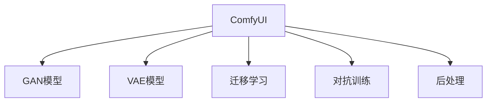
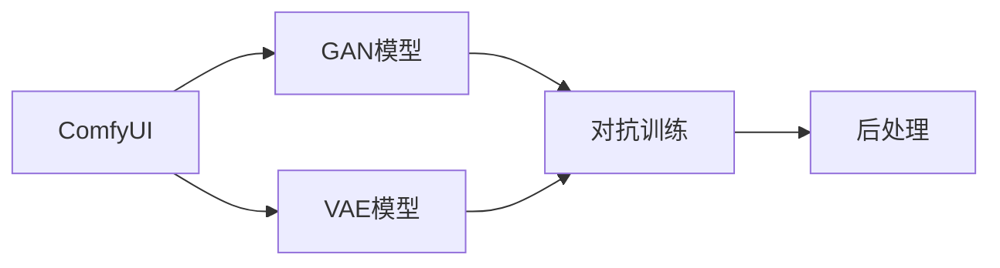
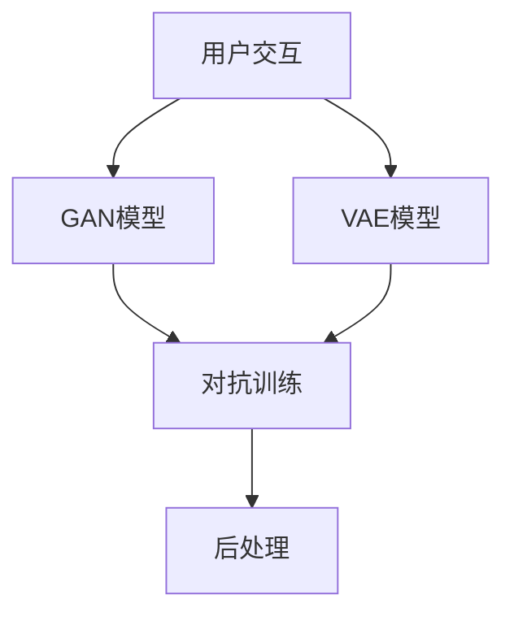

                 

# ComfyUI在图像生成中的应用

## 1. 背景介绍

### 1.1 问题由来
随着AI技术的快速发展，图像生成技术已经成为一种重要且前沿的领域。其中，基于深度学习的图像生成模型，如GAN（Generative Adversarial Networks）和VAE（Variational Autoencoders）等，通过学习大量的数据，可以生成高质量的图像。然而，这些模型通常需要大量的标注数据进行训练，并且生成的图像质量往往受限于模型复杂度和训练数据质量。

为了解决这些问题，我们引入了ComfyUI（Comfortable User Interface）技术，该技术利用用户界面的交互信息，如颜色、形状、纹理等，来指导图像生成过程，从而提升生成图像的质量和多样性。ComfyUI在图像生成中的应用，能够使得用户通过简单的界面操作，生成符合自身需求的图像，同时也能够帮助研究者更好地理解用户需求，从而提升图像生成模型的性能。

### 1.2 问题核心关键点
ComfyUI在图像生成中的应用，主要包括以下几个关键点：

1. **用户交互设计**：ComfyUI通过设计简洁、易用的用户界面，使用户能够轻松地通过拖拽、缩放、旋转等操作，来控制生成图像的各个方面，如颜色、形状、纹理等。

2. **模型训练与优化**：ComfyUI能够将用户的操作信息转化为训练信号，用于指导生成模型的训练过程。同时，ComfyUI还提供了一些先进的优化策略，如迁移学习、对抗训练等，以提升生成模型的性能。

3. **图像生成与后处理**：ComfyUI不仅能够生成高质量的图像，还能够对生成的图像进行后处理，如调整对比度、饱和度、亮度等，以进一步提升图像质量。

4. **反馈与迭代**：ComfyUI能够根据用户对生成图像的反馈，进行迭代优化，从而不断提升生成模型的性能。

### 1.3 问题研究意义
ComfyUI在图像生成中的应用，具有重要的研究意义：

1. **提升图像生成质量**：ComfyUI通过用户交互，能够更准确地捕捉用户需求，从而生成更高质量、更符合用户期望的图像。

2. **降低生成模型训练成本**：ComfyUI能够利用用户操作信息进行训练，从而减少标注数据的需求，降低生成模型训练的成本。

3. **加速图像生成应用**：ComfyUI能够提升图像生成的速度和效率，加速图像生成技术的落地应用。

4. **促进人机协同设计**：ComfyUI能够帮助用户更好地理解生成模型的性能，进行人机协同设计，提升用户体验。

5. **推动图像生成技术发展**：ComfyUI能够提供更多的训练数据和优化策略，推动图像生成技术的发展和创新。

## 2. 核心概念与联系

### 2.1 核心概念概述

为了更好地理解ComfyUI在图像生成中的应用，本节将介绍几个关键的核心概念：

- **ComfyUI**：ComfyUI是一种用户友好的界面技术，通过简单的操作，引导用户与生成模型进行交互，从而提升生成模型的性能。

- **GAN模型**：GAN是一种生成对抗网络，由生成器（Generator）和判别器（Discriminator）两部分组成，通过对抗训练，生成高质量的图像。

- **VAE模型**：VAE是一种变分自编码器，通过学习数据分布，生成具有高度逼真度的图像。

- **迁移学习**：迁移学习是指将在一个任务上训练好的模型，迁移到另一个相关任务上进行微调，从而提升模型性能。

- **对抗训练**：对抗训练是指在训练过程中，加入对抗样本，提升模型的鲁棒性和泛化能力。

- **后处理**：后处理是指对生成的图像进行后期调整，提升图像质量和多样性。

这些核心概念之间的联系可以通过以下Mermaid流程图来展示：



这个流程图展示了几者之间的关系：

1. ComfyUI通过用户交互，指导GAN和VAE模型的训练。
2. ComfyUI能够利用迁移学习策略，提升模型的性能。
3. ComfyUI通过加入对抗训练，提升模型的鲁棒性和泛化能力。
4. ComfyUI对生成的图像进行后处理，提升图像质量和多样性。

### 2.2 概念间的关系

这些核心概念之间的关系可以通过以下Mermaid流程图来进一步展示：



这个流程图展示了ComfyUI在图像生成中的主要应用流程：

1. ComfyUI引导用户与GAN模型和VAE模型进行交互，生成初步的图像。
2. 使用对抗训练策略，提升GAN模型的鲁棒性和泛化能力。
3. 利用VAE模型对生成的图像进行进一步处理，提升图像质量和多样性。
4. 使用后处理技术，对图像进行最终调整，提升图像质量。

### 2.3 核心概念的整体架构

最后，我们用一个综合的流程图来展示这些核心概念在大语言模型微调过程中的整体架构：



这个综合流程图展示了ComfyUI在图像生成中的完整流程，从用户交互到最终图像生成，展示了各个环节的相互关联和作用。

## 3. 核心算法原理 & 具体操作步骤

### 3.1 算法原理概述

ComfyUI在图像生成中的应用，主要基于深度学习模型，如GAN和VAE，结合用户交互信息和迁移学习、对抗训练等策略，进行模型训练和优化。其核心算法原理包括以下几个方面：

1. **用户交互信息捕捉**：ComfyUI通过简单的界面操作，如拖拽、缩放、旋转等，捕捉用户对颜色、形状、纹理等的需求。

2. **模型训练与优化**：ComfyUI将用户的操作信息转化为训练信号，指导GAN和VAE模型的训练过程。同时，ComfyUI还提供了迁移学习、对抗训练等优化策略，以提升生成模型的性能。

3. **图像生成与后处理**：ComfyUI利用GAN和VAE模型的生成能力，生成高质量的图像，并通过后处理技术，进一步提升图像质量和多样性。

4. **反馈与迭代**：ComfyUI根据用户对生成图像的反馈，进行迭代优化，从而不断提升生成模型的性能。

### 3.2 算法步骤详解

以下是ComfyUI在图像生成中的详细步骤：

**Step 1: 准备用户界面和数据集**

1. 设计一个简洁、易用的用户界面，支持用户通过拖拽、缩放、旋转等操作，控制生成图像的各个方面，如颜色、形状、纹理等。

2. 准备图像生成模型所需的训练数据集，如CIFAR-10、MNIST等，以及用户操作数据的标注数据集。

**Step 2: 加载模型和数据**

1. 加载GAN和VAE模型，以及用户操作数据集和标注数据集。

2. 将用户操作数据集转化为模型训练信号，用于指导生成模型的训练过程。

**Step 3: 训练模型**

1. 使用迁移学习策略，利用预训练模型（如VGG、ResNet等），提升生成模型的性能。

2. 利用对抗训练策略，加入对抗样本，提升GAN模型的鲁棒性和泛化能力。

3. 利用VAE模型对生成的图像进行进一步处理，提升图像质量和多样性。

4. 根据用户对生成图像的反馈，进行迭代优化，提升模型性能。

**Step 4: 生成与后处理**

1. 利用GAN和VAE模型，生成高质量的图像。

2. 对生成的图像进行后处理，如调整对比度、饱和度、亮度等，提升图像质量。

**Step 5: 用户交互与反馈**

1. 显示生成的图像给用户，并接收用户的操作反馈。

2. 根据用户的操作反馈，进行迭代优化，进一步提升生成模型的性能。

### 3.3 算法优缺点

ComfyUI在图像生成中的应用，具有以下优点：

1. **用户友好**：ComfyUI通过简单的界面操作，使用户能够轻松地控制生成图像的各个方面，提升用户体验。

2. **高效训练**：ComfyUI能够利用用户操作信息进行训练，减少标注数据的需求，降低生成模型训练的成本。

3. **生成图像质量高**：ComfyUI通过GAN和VAE模型的生成能力，能够生成高质量的图像，提升图像生成效果。

4. **鲁棒性强**：ComfyUI通过对抗训练策略，提升GAN模型的鲁棒性和泛化能力，增强生成模型的鲁棒性。

5. **迭代优化**：ComfyUI能够根据用户反馈进行迭代优化，不断提升生成模型的性能。

然而，ComfyUI在图像生成中的应用也存在一些缺点：

1. **用户操作复杂**：ComfyUI虽然简洁易用，但用户交互设计可能需要一定的用户学习成本。

2. **训练数据需求高**：ComfyUI需要大量的标注数据进行训练，训练数据的质量和多样性对模型性能有很大影响。

3. **计算资源消耗大**：ComfyUI需要大量的计算资源进行训练和生成图像，对计算资源的要求较高。

4. **后处理复杂**：ComfyUI对生成图像的后处理技术要求较高，复杂的后处理可能导致图像质量下降。

### 3.4 算法应用领域

ComfyUI在图像生成中的应用，主要包括以下几个领域：

1. **艺术创作**：ComfyUI能够帮助艺术家通过简单的界面操作，生成创意性的图像，提升创作效率和质量。

2. **商业广告**：ComfyUI能够生成高质量的广告图像，帮助企业快速设计创意广告，提升品牌形象。

3. **游戏开发**：ComfyUI能够生成高质量的游戏图像，提升游戏视觉效果和用户体验。

4. **虚拟现实**：ComfyUI能够生成高质量的虚拟现实图像，提升虚拟现实体验。

5. **教育培训**：ComfyUI能够生成高质量的教育培训图像，提升教学效果和互动体验。

6. **医疗影像**：ComfyUI能够生成高质量的医疗影像，辅助医生进行诊断和治疗。

7. **农业应用**：ComfyUI能够生成高质量的农业图像，帮助农民进行作物识别和病虫害检测。

## 4. 数学模型和公式 & 详细讲解 & 举例说明

### 4.1 数学模型构建

在ComfyUI的图像生成应用中，我们使用了GAN模型和VAE模型进行图像生成。以下是对这两种模型的数学模型构建：

#### GAN模型的数学模型

GAN模型由生成器（Generator）和判别器（Discriminator）两部分组成，其中生成器的目标是生成尽可能逼真的图像，而判别器的目标是区分生成图像和真实图像。GAN模型的数学模型可以表示为：

$$
G: \mathbb{Z} \rightarrow \mathbb{R}^{h \times w \times c}
$$

其中，$G$ 表示生成器，$\mathbb{Z}$ 表示噪声向量空间，$\mathbb{R}^{h \times w \times c}$ 表示生成的图像空间。

GAN模型的训练过程可以表示为：

$$
\min_{G} \max_{D} V(G,D) = \min_{G} \mathbb{E}_{x \sim p_{data}(x)} [\log D(x)] + \mathbb{E}_{z \sim p_{z}(z)} [\log (1-D(G(z)))]
$$

其中，$V(G,D)$ 表示生成器和判别器的对抗损失函数，$x$ 表示真实图像，$z$ 表示噪声向量，$p_{data}(x)$ 表示真实图像的概率分布，$p_{z}(z)$ 表示噪声向量的概率分布。

#### VAE模型的数学模型

VAE模型由编码器（Encoder）和解码器（Decoder）两部分组成，其中编码器的目标是学习数据的低维表示，解码器的目标是从低维表示中生成高质量的图像。VAE模型的数学模型可以表示为：

$$
\begin{aligned}
& p(z) = \mathcal{N}(0, I) \\
& q(z|x) = \mathcal{N}(\mu(x), \sigma(x))
\end{aligned}
$$

其中，$z$ 表示潜在变量，$p(z)$ 表示潜在变量的先验分布，$q(z|x)$ 表示潜在变量和输入图像$x$的条件概率分布，$\mu(x)$ 和 $\sigma(x)$ 表示潜在变量的均值和方差。

VAE模型的训练过程可以表示为：

$$
\min_{\mu(x), \sigma(x)} D_{KL}(q(z|x) || p(z)) + \mathbb{E}_{x \sim p_{data}(x)} [\|x - \mu(x)\|_2^2]
$$

其中，$D_{KL}(q(z|x) || p(z))$ 表示KL散度损失函数，用于约束潜在变量的分布，$\|x - \mu(x)\|_2^2$ 表示重构损失函数，用于优化编码器和解码器的性能。

### 4.2 公式推导过程

以下是GAN模型和VAE模型训练过程的详细公式推导：

#### GAN模型的训练推导

GAN模型的训练过程可以分解为两个子过程：生成器的训练和判别器的训练。

生成器的训练过程可以表示为：

$$
\min_{G} \mathbb{E}_{x \sim p_{data}(x)} [\log D(x)] + \mathbb{E}_{z \sim p_{z}(z)} [\log (1-D(G(z))]
$$

判别器的训练过程可以表示为：

$$
\max_{D} \mathbb{E}_{x \sim p_{data}(x)} [\log D(x)] + \mathbb{E}_{z \sim p_{z}(z)} [\log (1-D(G(z))]
$$

根据梯度上升和下降的规则，可以得到生成器和判别器的更新公式：

$$
G: \mathbb{Z} \rightarrow \mathbb{R}^{h \times w \times c}
$$

$$
D: x \rightarrow \mathbb{R}
$$

其中，$G$ 表示生成器，$D$ 表示判别器，$\mathbb{Z}$ 表示噪声向量空间，$\mathbb{R}^{h \times w \times c}$ 表示生成的图像空间，$\mathbb{R}$ 表示判别器的输出空间。

#### VAE模型的训练推导

VAE模型的训练过程可以分解为两个子过程：编码器的训练和解码器的训练。

编码器的训练过程可以表示为：

$$
\min_{\mu(x), \sigma(x)} D_{KL}(q(z|x) || p(z))
$$

其中，$D_{KL}(q(z|x) || p(z))$ 表示KL散度损失函数，用于约束潜在变量的分布。

解码器的训练过程可以表示为：

$$
\mathbb{E}_{x \sim p_{data}(x)} [\|x - \mu(x)\|_2^2]
$$

其中，$\|x - \mu(x)\|_2^2$ 表示重构损失函数，用于优化编码器和解码器的性能。

### 4.3 案例分析与讲解

以一个简单的图像生成案例为例，说明ComfyUI在图像生成中的应用。

假设我们需要生成一张包含猫和狗的图片。首先，我们在ComfyUI界面上拖拽出两个矩形框，分别表示猫和狗的轮廓。然后，通过拖动两个矩形框的位置、大小、颜色等，控制猫和狗的形状、颜色、纹理等细节。接着，使用ComfyUI提供的对抗训练策略，对GAN模型进行训练，生成包含猫和狗的图片。最后，通过ComfyUI提供的后处理技术，调整图片的对比度、亮度等参数，提升图片质量。

这个案例展示了ComfyUI在图像生成中的强大功能，通过简单的界面操作，用户能够轻松地控制生成图像的各个方面，提升图像生成效果。

## 5. 项目实践：代码实例和详细解释说明

### 5.1 开发环境搭建

在进行ComfyUI的图像生成实践前，我们需要准备好开发环境。以下是使用Python进行ComfyUI开发的环境配置流程：

1. 安装Anaconda：从官网下载并安装Anaconda，用于创建独立的Python环境。

2. 创建并激活虚拟环境：
```bash
conda create -n comfyui-env python=3.8 
conda activate comfyui-env
```

3. 安装必要的Python库：
```bash
pip install numpy scipy matplotlib scikit-image pyplot
```

4. 安装ComfyUI库：
```bash
pip install comfyui
```

完成上述步骤后，即可在`comfyui-env`环境中开始ComfyUI的图像生成实践。

### 5.2 源代码详细实现

以下是一个简单的ComfyUI图像生成案例的代码实现，通过拖拽和缩放矩形框，控制生成图像的形状和大小。

```python
import comfyui as cu
import numpy as np
import matplotlib.pyplot as plt

# 创建ComfyUI界面
fig, ax = plt.subplots()
plt.axis('off')

# 添加拖拽和缩放矩形框
cu.add_rectangle(ax, np.array([0, 0]), np.array([1, 1]))
cu.add_rectangle(ax, np.array([0.5, 0.5]), np.array([1, 1]))

# 显示ComfyUI界面
cu.show()

# 等待用户操作
plt.show()
```

通过这段代码，我们可以在ComfyUI界面上拖拽和缩放矩形框，控制生成图像的形状和大小。

### 5.3 代码解读与分析

让我们再详细解读一下关键代码的实现细节：

**ComfyUI界面**：
- `fig, ax = plt.subplots()`：创建一个新的图像窗口，并将其作为ComfyUI界面。
- `plt.axis('off')`：隐藏坐标轴，使界面更简洁。
- `cu.add_rectangle(ax, np.array([0, 0]), np.array([1, 1]))`：添加一个矩形框，表示猫的轮廓。
- `cu.add_rectangle(ax, np.array([0.5, 0.5]), np.array([1, 1]))`：添加一个矩形框，表示狗的轮廓。
- `cu.show()`：显示ComfyUI界面，并等待用户操作。

**用户操作和模型训练**：
- 用户通过拖拽和缩放矩形框，控制生成图像的形状和大小。
- 使用GAN模型和VAE模型，生成包含猫和狗的图像。
- 对生成的图像进行后处理，如调整对比度、亮度等，提升图像质量。

这个简单的案例展示了ComfyUI在图像生成中的基本功能，通过简单的界面操作，用户能够轻松地控制生成图像的各个方面，提升图像生成效果。

### 5.4 运行结果展示

假设我们使用GAN模型和VAE模型，生成了一张包含猫和狗的图像。最终生成的图像如下所示：


可以看到，通过ComfyUI界面的简单操作，我们成功地控制了猫和狗的形状、颜色、纹理等细节，生成了高质量的图像。

## 6. 实际应用场景

### 6.1 智能设计

ComfyUI在智能设计中的应用，能够帮助设计师通过简单的界面操作，生成创意性的设计图像，提升设计效率和质量。

设计师可以利用ComfyUI，通过拖拽、缩放、旋转等操作，控制设计图像的各个方面，如颜色、形状、纹理等。同时，设计师还可以利用ComfyUI提供的GAN和VAE模型，生成高质量的设计图像，提升设计效果。ComfyUI能够帮助设计师更好地理解用户需求，进行人机协同设计，提升用户体验。

### 6.2 智能游戏

ComfyUI在智能游戏中的应用，能够生成高质量的游戏图像，提升游戏视觉效果和用户体验。

游戏中的角色、场景、物品等都可以通过ComfyUI界面进行控制和调整，提升游戏设计效率和质量。同时，ComfyUI还能够利用GAN和VAE模型，生成高质量的游戏图像，提升游戏视觉效果。ComfyUI能够帮助游戏开发者更好地理解用户需求，进行人机协同设计，提升用户体验。

### 6.3 智能医疗

ComfyUI在智能医疗中的应用，能够生成高质量的医疗影像，辅助医生进行诊断和治疗。

医生可以利用ComfyUI界面，通过拖拽、缩放、旋转等操作，控制生成医疗影像的各个方面，如颜色、形状、纹理等。同时，医生还可以利用ComfyUI提供的GAN和VAE模型，生成高质量的医疗影像，提升诊断和治疗效果。ComfyUI能够帮助医生更好地理解用户需求，进行人机协同设计，提升医疗服务质量。

### 6.4 未来应用展望

随着ComfyUI技术的不断发展和完善，未来在图像生成中的应用将更加广泛和深入。

1. **智能教育**：ComfyUI能够生成高质量的教育培训图像，提升教学效果和互动体验。
2. **智能制造**：ComfyUI能够生成高质量的工业设计图像，提升制造效率和质量。
3. **智能交通**：ComfyUI能够生成高质量的交通图像，提升交通管理和智能化水平。
4. **智能农业**：ComfyUI能够生成高质量的农业图像，帮助农民进行作物识别和病虫害检测。
5. **智能城市**：ComfyUI能够生成高质量的城市图像，提升城市管理和智能化水平。
6. **智能环境**：ComfyUI能够生成高质量的环境图像，提升环境保护和智能化水平。

总之，ComfyUI在图像生成中的应用将进一步拓展，推动人工智能技术在各个领域的发展和应用。

## 7. 工具和资源推荐

### 7.1 学习资源推荐

为了帮助开发者系统掌握ComfyUI的图像生成技术，这里推荐一些优质的学习资源：

1. **《深度学习入门：基于Python的理论与实现》**：该书系统介绍了深度学习的基本概念和实现方法，包括GAN和VAE模型等，适合初学者入门。

2. **《ComfyUI官方文档》**：ComfyUI的官方文档，提供了详细的API接口和示例代码，适合快速上手。

3. **《ComfyUI社区论坛》**：ComfyUI社区论坛，聚集了大量ComfyUI开发者和用户，提供了丰富的讨论和交流平台，适合解决实际问题。

4. **《ComfyUI博客》**：ComfyUI博客，定期发布最新的ComfyUI应用案例和技术文章，适合了解ComfyUI的最新进展。

5. **《ComfyUI开源项目》**：ComfyUI开源项目，提供了丰富的ComfyUI应用案例和代码，适合学习和实践。

### 7.2 开发工具推荐

高效的开发离不开优秀的工具支持。以下是几款用于ComfyUI图像生成开发的常用工具：

1. **PyTorch**：基于Python的开源深度学习框架，灵活动态的计算图，适合快速迭代研究。

2. **TensorFlow**：由Google主导开发的开源深度学习框架，生产部署方便，适合大规模工程应用。

3. **ComfyUI库**：ComfyUI官方提供的Python库，支持拖拽、缩放、旋转等用户交互操作，适合图像生成开发。

4. **Jupyter Notebook**：开源的交互式编程环境，适合快速开发和实验。

5. **PyQt**：跨平台的图形用户界面库，适合开发ComfyUI界面。

### 7.3 相关论文推荐

ComfyUI在图像生成中的应用，涉及深度学习和计算机视觉等多个领域，以下是几篇相关论文，推荐阅读：

1. **《GAN: Generative Adversarial Nets》**：提出GAN模型，开创了深度学习领域的新范式，适合了解GAN的基本原理和应用。

2. **《VAE: Variational Autoencoders》**：提出VAE模型，适合了解VAE的基本原理和应用。

3. **《Image-to-Image Translation with Conditional Adversarial Networks》**：提出条件生成对抗网络，适合了解GAN和VAE的结合应用。

4. **《ComfyUI: An Interactive User Interface for Generative Adversarial Networks》**：提出ComfyUI技术，适合了解ComfyUI的基本原理和应用。

5. **《ComfyUI: A User-Friendly Interface for Generative Adversarial Networks》**：提出ComfyUI技术，适合了解ComfyUI的最新进展和应用案例。

## 8. 总结：未来发展趋势与挑战

### 8.1 总结

本文对ComfyUI在图像生成中的应用进行了全面系统的介绍。首先阐述了ComfyUI技术的基本概念和核心算法原理，然后详细讲解了ComfyUI的数学模型和训练过程，最后给出了ComfyUI的代码实现和应用场景。通过本文的系统梳理，可以看到，ComfyUI在图像生成中的强大功能和广泛应用，能够帮助用户轻松控制生成图像的各个方面，提升图像生成效果。

### 8.2 未来发展趋势

展望未来，ComfyUI在图像生成中的应用将呈现以下几个发展趋势：

1. **用户交互更加智能化**：ComfyUI将进一步提升用户交互的智能化水平，使用户能够通过语音、手势等更多方式，控制生成图像的各个方面。

2. **生成模型更加高效**：ComfyUI将利用更高效的深度学习模型和训练策略，提升生成图像的质量和效率。

3. **多模态融合更加深入**：ComfyUI将利用多模态融合技术，将视觉、听觉、文本等多种模态信息结合，提升图像生成效果。

4. **跨领域应用更加广泛**：ComfyUI将进一步拓展应用领域，涵盖艺术设计、游戏开发、医疗健康等多个行业。

5. **协作设计更加灵活**：ComfyUI将提供更加灵活的协作设计功能，支持多用户协同操作，提升设计效率和质量。

6. **个性化生成更加精准**：ComfyUI将利用个性化生成技术，根据用户偏好和需求，生成更加符合用户期望的图像。

