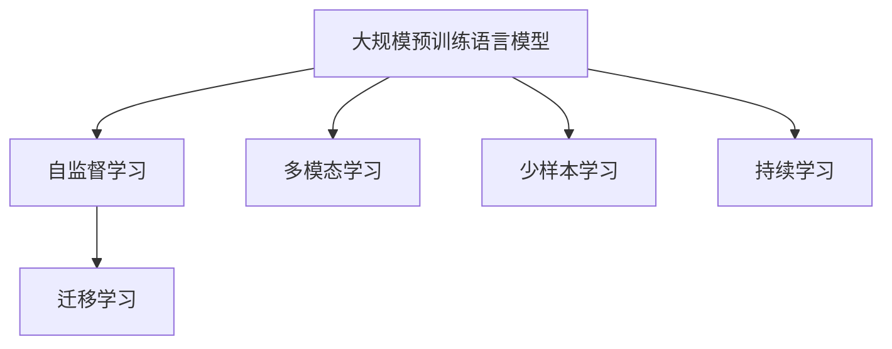
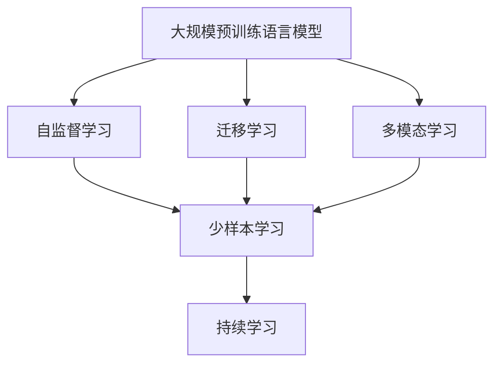
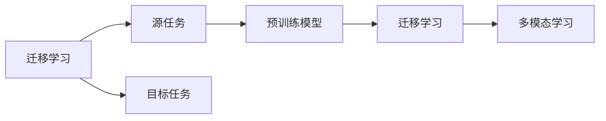
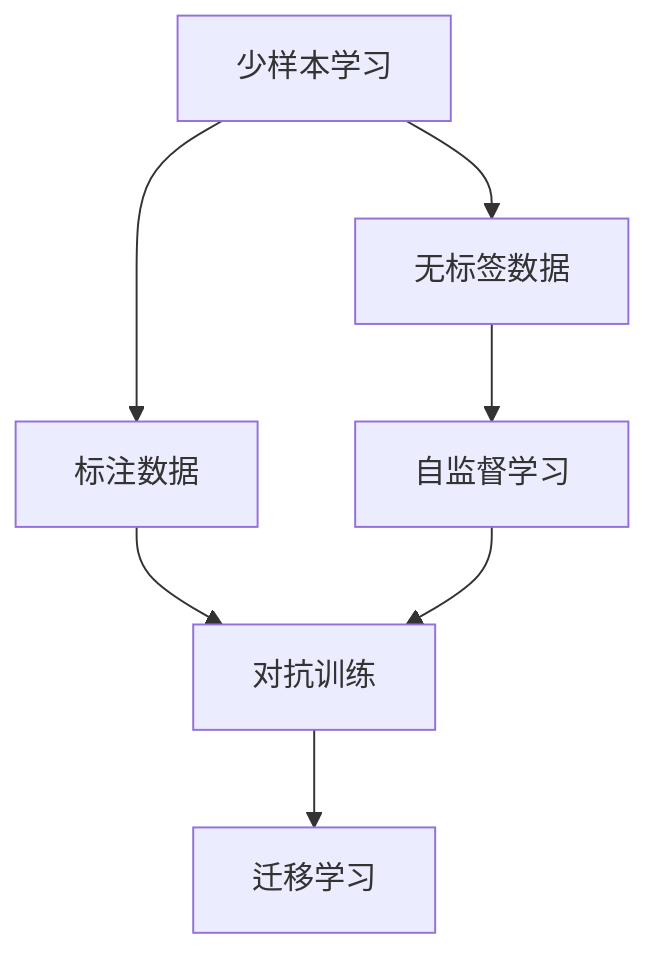
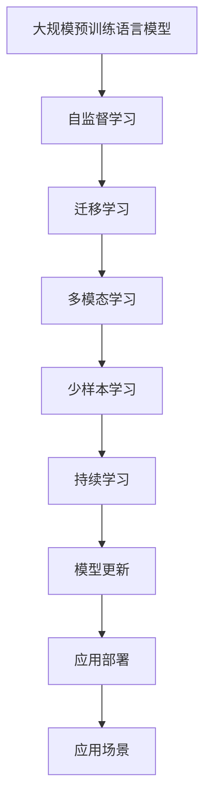

                 

# LLM的跨领域应用：从科研到商业的全面渗透

> 关键词：

## 1. 背景介绍

### 1.1 问题由来
近年来，大规模预训练语言模型(LLMs)已经成为NLP领域的热门话题。这些模型通过在大规模无标签文本数据上进行自监督预训练，学习到丰富的语言知识和常识，具备强大的语言理解和生成能力。这些模型已经在各种下游任务上取得了卓越的成绩，推动了自然语言处理技术的快速发展。

然而，LLMs的潜在应用范围并不局限于NLP领域。随着其自身技术的不断发展，LLMs已经被广泛应用于各个行业，展现出其强大的跨领域渗透能力。从科研到商业，从技术到实际，LLMs正在全面渗透到不同领域中，带来前所未有的变革。

### 1.2 问题核心关键点
LLMs的跨领域应用主要涉及以下几个关键点：

- 通用语言模型的泛化能力：预训练模型在多种任务上表现优异，证明其在不同领域间具有广泛的泛化能力。
- 领域适配与迁移学习：通过微调等方式，将通用语言模型适配到特定领域，提升其在特定任务上的表现。
- 多模态融合：结合文本、图像、声音等多种数据模态，提升模型的综合能力。
- 自监督与少样本学习：在无标注或少标注数据的情况下，通过自监督学习、对抗训练等方法提升模型的泛化能力。
- 持续学习与迭代优化：通过持续学习机制，不断优化模型性能，适应数据和任务的变化。

### 1.3 问题研究意义
LLMs的跨领域应用对于推动各行业数字化转型升级具有重要意义：

1. 降低应用开发成本：基于成熟的大模型进行领域适配，减少从头开发所需的数据、计算和人力等成本投入。
2. 提升模型效果：微调使通用大模型更好地适应特定领域，在应用场景中取得更优表现。
3. 加速开发进度：通过预训练-微调的快速迭代，缩短任务适配周期。
4. 技术创新：跨领域应用催生了新的研究方向，如多模态学习、自监督学习等。
5. 赋能产业升级：LLMs的技术落地应用，为传统行业数字化转型升级提供新的技术路径。

## 2. 核心概念与联系

### 2.1 核心概念概述

为更好地理解LLMs的跨领域应用，本节将介绍几个密切相关的核心概念：

- 大规模预训练语言模型(LLM)：以自回归(如GPT)或自编码(如BERT)模型为代表的大规模预训练语言模型。通过在大规模无标签文本数据上进行预训练，学习通用的语言表示，具备强大的语言理解和生成能力。

- 自监督学习(Self-Supervised Learning, SSL)：在无标签数据上通过自构造任务进行训练，学习数据的潜在结构，是一种高效的模型训练方法。

- 迁移学习(Transfer Learning)：将一个领域学习到的知识，迁移应用到另一个不同但相关的领域的学习范式。

- 多模态学习(Multimodal Learning)：结合文本、图像、声音等多种数据模态，提升模型的综合能力。

- 自监督学习与少样本学习：在无标注或少标注数据的情况下，通过自监督学习、对抗训练等方法提升模型的泛化能力。

- 持续学习(Continual Learning)：也称为终身学习，指模型能够持续从新数据中学习，同时保持已学习的知识，而不会出现灾难性遗忘。这对于保持LLMs的时效性和适应性至关重要。

这些核心概念之间的逻辑关系可以通过以下Mermaid流程图来展示：



这个流程图展示了大规模预训练语言模型与多模态学习、自监督学习、迁移学习、少样本学习和持续学习等核心概念的关系：

- 大模型通过自监督学习获得基础能力。
- 迁移学习连接预训练模型与下游任务，通过微调等方式实现领域适配。
- 多模态学习结合多种数据模态，提升模型的感知能力。
- 自监督与少样本学习在大数据不足的情况下提供新思路。
- 持续学习使模型适应数据和任务的变化，保持性能的长期稳定。

### 2.2 概念间的关系

这些核心概念之间存在着紧密的联系，形成了LLMs的跨领域应用框架。下面我通过几个Mermaid流程图来展示这些概念之间的关系。

#### 2.2.1 大模型的学习范式



这个流程图展示了大模型的学习范式，包括自监督学习、迁移学习、多模态学习和少样本学习。这些范式共同构成了大模型在不同领域的应用基础。

#### 2.2.2 迁移学习与多模态学习的关系



这个流程图展示了迁移学习的基本原理，以及它与多模态学习的关系。迁移学习涉及源任务和目标任务，预训练模型在源任务上学习，然后通过迁移学习适应各种目标任务，并在多模态学习中提升模型的感知能力。

#### 2.2.3 少样本学习在大模型的应用



这个流程图展示了少样本学习在大模型的应用。少样本学习在数据稀缺的情况下，通过自监督学习、对抗训练等方法提升模型的泛化能力，再通过迁移学习将模型适配到目标任务。

### 2.3 核心概念的整体架构

最后，我们用一个综合的流程图来展示这些核心概念在大模型的跨领域应用过程中的整体架构：



这个综合流程图展示了从预训练到应用部署的完整过程，包括自监督学习、迁移学习、多模态学习、少样本学习和持续学习等关键环节，并通过应用部署实现大模型在实际场景中的落地。通过这些流程图，我们可以更清晰地理解大模型在跨领域应用过程中的各个核心概念的关系和作用。

## 3. 核心算法原理 & 具体操作步骤

### 3.1 算法原理概述

LLMs的跨领域应用主要基于以下算法原理：

- 通用语言模型训练：通过自监督学习在大规模无标签数据上预训练语言模型，使其具备泛化能力。
- 领域适配与迁移学习：通过微调等技术，将通用模型适配到特定领域，提升其在特定任务上的表现。
- 多模态融合：结合文本、图像、声音等多种数据模态，提升模型的综合感知能力。
- 自监督与少样本学习：在无标注或少标注数据的情况下，通过自监督学习、对抗训练等方法提升模型的泛化能力。
- 持续学习：通过持续学习机制，保持模型性能的长期稳定，适应数据和任务的变化。

### 3.2 算法步骤详解

#### 3.2.1 预训练步骤
1. 数据准备：收集大规模无标签文本数据，例如维基百科、新闻、书籍等。
2. 模型选择：选择适合的预训练模型，如BERT、GPT等。
3. 自监督任务：在无标签数据上定义自监督学习任务，如语言建模、掩码语言模型等。
4. 模型训练：使用自监督任务训练预训练模型，优化损失函数。
5. 评估与保存：评估模型在各种自监督任务上的性能，保存模型参数。

#### 3.2.2 微调步骤
1. 数据准备：收集特定领域的有标签数据，如医疗、金融、法律等领域的标注数据集。
2. 模型选择：选择预训练模型作为初始化参数，如BERT、GPT等。
3. 任务适配：根据具体任务类型，设计合适的输出层和损失函数。
4. 微调设置：选择合适的优化器及其参数，如AdamW、SGD等，设置学习率、批大小、迭代轮数等。
5. 模型训练：将标注数据集分批次输入模型，前向传播计算损失函数，反向传播计算参数梯度，更新模型参数。
6. 评估与测试：在验证集上评估模型性能，确保模型收敛。
7. 部署应用：将微调后的模型应用于实际场景中，进行推理预测。

#### 3.2.3 少样本学习步骤
1. 数据准备：收集少量标注数据，或使用生成式预训练模型生成伪标注数据。
2. 模型选择：选择预训练模型作为初始化参数，如GPT等。
3. 对抗训练：通过引入对抗样本，提高模型鲁棒性。
4. 微调设置：使用对抗训练的模型，进行少样本微调，设置较小的学习率，避免破坏预训练权重。
5. 评估与测试：在测试集上评估模型性能，确保模型泛化能力。
6. 部署应用：将微调后的模型应用于实际场景中，进行推理预测。

#### 3.2.4 多模态融合步骤
1. 数据准备：收集多种模态的数据，如文本、图像、声音等。
2. 模型选择：选择适合多模态的预训练模型，如CLIP等。
3. 多模态任务：定义多模态学习任务，如视觉问答、视频描述等。
4. 模型训练：使用多模态任务训练预训练模型，优化损失函数。
5. 评估与测试：在测试集上评估模型性能，确保模型综合感知能力。
6. 部署应用：将多模态融合的模型应用于实际场景中，进行推理预测。

### 3.3 算法优缺点

LLMs的跨领域应用具有以下优点：

- 广泛适用性：适用于各种NLP任务，如分类、匹配、生成等，适应性强。
- 泛化能力强：在多种任务上表现优异，能够很好地适应新数据和新任务。
- 可扩展性强：支持多模态数据融合，能够结合多种数据模态提升模型的综合感知能力。
- 自监督与少样本学习：在数据稀缺的情况下，能够通过自监督学习、对抗训练等方法提升模型的泛化能力。
- 持续学习：通过持续学习机制，保持模型性能的长期稳定，适应数据和任务的变化。

同时，这些算法也存在一些局限性：

- 标注数据依赖：微调和少样本学习依赖高质量的标注数据，获取标注数据的成本较高。
- 模型复杂度高：大规模预训练模型的参数量巨大，对计算资源和存储空间要求较高。
- 模型可解释性差：黑盒模型难以解释其内部工作机制和决策逻辑。
- 数据分布敏感：微调模型对数据分布的变化较为敏感，容易发生灾难性遗忘。
- 鲁棒性不足：在对抗样本或噪声数据的攻击下，模型的鲁棒性较弱。

尽管存在这些局限性，但LLMs在跨领域应用方面仍然具有显著的优势和潜力。未来研究需要针对这些局限性进行改进，以进一步提升LLMs的性能和应用范围。

### 3.4 算法应用领域

LLMs的跨领域应用已经广泛应用于各个行业，以下是几个典型领域：

#### 3.4.1 医疗领域
在医疗领域，LLMs可以用于病历摘要、疾病诊断、药物研发等多个方面。通过在医学文献上预训练模型，再通过微调适配具体任务，LLMs可以自动提取病历中的关键信息，帮助医生快速诊断疾病，优化药物设计流程，提高医疗服务的智能化水平。

#### 3.4.2 金融领域
在金融领域，LLMs可以用于舆情监测、风险预警、客户服务等多个方面。通过在金融新闻、报告等数据上预训练模型，再通过微调适配具体任务，LLMs可以自动分析市场动态，预测金融风险，提供个性化金融咨询，提高金融服务的智能化水平。

#### 3.4.3 教育领域
在教育领域，LLMs可以用于智能辅导、作业批改、推荐系统等多个方面。通过在教育文献、题库等数据上预训练模型，再通过微调适配具体任务，LLMs可以自动评估作业，提供个性化的学习建议，提升教育服务的智能化水平。

#### 3.4.4 工业领域
在工业领域，LLMs可以用于设备维护、生产调度、质量检测等多个方面。通过在工业数据上预训练模型，再通过微调适配具体任务，LLMs可以自动监测设备运行状态，预测生产过程，优化生产流程，提高生产效率和服务质量。

#### 3.4.5 法律领域
在法律领域，LLMs可以用于合同分析、法律咨询、版权检测等多个方面。通过在法律文献上预训练模型，再通过微调适配具体任务，LLMs可以自动分析法律文本，提供法律咨询，检测版权侵权，提升法律服务的智能化水平。

#### 3.4.6 农业领域
在农业领域，LLMs可以用于农情分析、农产品质量检测、智能农机等多个方面。通过在农业数据上预训练模型，再通过微调适配具体任务，LLMs可以自动监测农情，检测农产品质量，优化农机操作，提高农业服务的智能化水平。

#### 3.4.7 旅游领域
在旅游领域，LLMs可以用于旅游推荐、客户服务、智能导游等多个方面。通过在旅游数据上预训练模型，再通过微调适配具体任务，LLMs可以自动推荐旅游线路，提供个性化服务，优化旅游体验，提高旅游服务的智能化水平。

## 4. 数学模型和公式 & 详细讲解  
### 4.1 数学模型构建

本节将使用数学语言对LLMs的跨领域应用进行更加严格的刻画。

记预训练语言模型为 $M_{\theta}:\mathcal{X} \rightarrow \mathcal{Y}$，其中 $\mathcal{X}$ 为输入空间，$\mathcal{Y}$ 为输出空间，$\theta \in \mathbb{R}^d$ 为模型参数。假设微调任务的训练集为 $D=\{(x_i,y_i)\}_{i=1}^N, x_i \in \mathcal{X}, y_i \in \mathcal{Y}$。

定义模型 $M_{\theta}$ 在数据样本 $(x,y)$ 上的损失函数为 $\ell(M_{\theta}(x),y)$，则在数据集 $D$ 上的经验风险为：

$$
\mathcal{L}(\theta) = \frac{1}{N} \sum_{i=1}^N \ell(M_{\theta}(x_i),y_i)
$$

微调的优化目标是最小化经验风险，即找到最优参数：

$$
\theta^* = \mathop{\arg\min}_{\theta} \mathcal{L}(\theta)
$$

在实践中，我们通常使用基于梯度的优化算法（如SGD、Adam等）来近似求解上述最优化问题。设 $\eta$ 为学习率，$\lambda$ 为正则化系数，则参数的更新公式为：

$$
\theta \leftarrow \theta - \eta \nabla_{\theta}\mathcal{L}(\theta) - \eta\lambda\theta
$$

其中 $\nabla_{\theta}\mathcal{L}(\theta)$ 为损失函数对参数 $\theta$ 的梯度，可通过反向传播算法高效计算。

### 4.2 公式推导过程

以下我们以二分类任务为例，推导交叉熵损失函数及其梯度的计算公式。

假设模型 $M_{\theta}$ 在输入 $x$ 上的输出为 $\hat{y}=M_{\theta}(x) \in [0,1]$，表示样本属于正类的概率。真实标签 $y \in \{0,1\}$。则二分类交叉熵损失函数定义为：

$$
\ell(M_{\theta}(x),y) = -[y\log \hat{y} + (1-y)\log (1-\hat{y})]
$$

将其代入经验风险公式，得：

$$
\mathcal{L}(\theta) = -\frac{1}{N}\sum_{i=1}^N [y_i\log M_{\theta}(x_i)+(1-y_i)\log(1-M_{\theta}(x_i))]
$$

根据链式法则，损失函数对参数 $\theta_k$ 的梯度为：

$$
\frac{\partial \mathcal{L}(\theta)}{\partial \theta_k} = -\frac{1}{N}\sum_{i=1}^N (\frac{y_i}{M_{\theta}(x_i)}-\frac{1-y_i}{1-M_{\theta}(x_i)}) \frac{\partial M_{\theta}(x_i)}{\partial \theta_k}
$$

其中 $\frac{\partial M_{\theta}(x_i)}{\partial \theta_k}$ 可进一步递归展开，利用自动微分技术完成计算。

在得到损失函数的梯度后，即可带入参数更新公式，完成模型的迭代优化。重复上述过程直至收敛，最终得到适应下游任务的最优模型参数 $\theta^*$。

## 5. 项目实践：代码实例和详细解释说明

### 5.1 开发环境搭建

在进行跨领域应用实践前，我们需要准备好开发环境。以下是使用Python进行PyTorch开发的环境配置流程：

1. 安装Anaconda：从官网下载并安装Anaconda，用于创建独立的Python环境。

2. 创建并激活虚拟环境：
```bash
conda create -n pytorch-env python=3.8 
conda activate pytorch-env
```

3. 安装PyTorch：根据CUDA版本，从官网获取对应的安装命令。例如：
```bash
conda install pytorch torchvision torchaudio cudatoolkit=11.1 -c pytorch -c conda-forge
```

4. 安装Transformers库：
```bash
pip install transformers
```

5. 安装各类工具包：
```bash
pip install numpy pandas scikit-learn matplotlib tqdm jupyter notebook ipython
```

完成上述步骤后，即可在`pytorch-env`环境中开始跨领域应用实践。

### 5.2 源代码详细实现

这里我们以医疗领域的病历摘要任务为例，给出使用Transformers库对BERT模型进行微调的PyTorch代码实现。

首先，定义病历摘要任务的数据处理函数：

```python
from transformers import BertTokenizer
from torch.utils.data import Dataset
import torch

class MedicalNotesDataset(Dataset):
    def __init__(self, texts, tags, tokenizer, max_len=128):
        self.texts = texts
        self.tags = tags
        self.tokenizer = tokenizer
        self.max_len = max_len
        
    def __len__(self):
        return len(self.texts)
    
    def __getitem__(self, item):
        text = self.texts[item]
        tags = self.tags[item]
        
        encoding = self.tokenizer(text, return_tensors='pt', max_length=self.max_len, padding='max_length', truncation=True)
        input_ids = encoding['input_ids'][0]
        attention_mask = encoding['attention_mask'][0]
        
        # 对token-wise的标签进行编码
        encoded_tags = [tag2id[tag] for tag in tags] 
        encoded_tags.extend([tag2id['O']] * (self.max_len - len(encoded_tags)))
        labels = torch.tensor(encoded_tags, dtype=torch.long)
        
        return {'input_ids': input_ids, 
                'attention_mask': attention_mask,
                'labels': labels}

# 标签与id的映射
tag2id = {'O': 0, 'DISEASE': 1, 'SYMPTOM': 2, 'PROCEDURE': 3, 'SIGNS': 4, 'DIAGNOSIS': 5}
id2tag = {v: k for k, v in tag2id.items()}

# 创建dataset
tokenizer = BertTokenizer.from_pretrained('bert-base-cased')

train_dataset = MedicalNotesDataset(train_texts, train_tags, tokenizer)
dev_dataset = MedicalNotesDataset(dev_texts, dev_tags, tokenizer)
test_dataset = MedicalNotesDataset(test_texts, test_tags, tokenizer)
```

然后，定义模型和优化器：

```python
from transformers import BertForTokenClassification, AdamW

model = BertForTokenClassification.from_pretrained('bert-base-cased', num_labels=len(tag2id))

optimizer = AdamW(model.parameters(), lr=2e-5)
```

接着，定义训练和评估函数：

```python
from torch.utils.data import DataLoader
from tqdm import tqdm
from sklearn.metrics import classification_report

device = torch.device('cuda') if torch.cuda.is_available() else torch.device('cpu')
model.to(device)

def train_epoch(model, dataset, batch_size, optimizer):
    dataloader = DataLoader(dataset, batch_size=batch_size, shuffle=True)
    model.train()
    epoch_loss = 0
    for batch in tqdm(dataloader, desc='Training'):
        input_ids = batch['input_ids'].to(device)
        attention_mask = batch['attention_mask'].to(device)
        labels = batch['labels'].to(device)
        model.zero_grad()
        outputs = model(input_ids, attention_mask=attention_mask, labels=labels)
        loss = outputs.loss
        epoch_loss += loss.item()
        loss.backward()
        optimizer.step()
    return epoch_loss / len(dataloader)

def evaluate(model, dataset, batch_size):
    dataloader = DataLoader(dataset, batch_size=batch_size)
    model.eval()
    preds, labels = [], []
    with torch.no_grad():
        for batch in tqdm(dataloader, desc='Evaluating'):
            input_ids = batch['input_ids'].to(device)
            attention_mask = batch['attention_mask'].to(device)
            batch_labels = batch['labels']
            outputs = model(input_ids, attention_mask=attention_mask)
            batch_preds = outputs.logits.argmax(dim=2).to('cpu').tolist()
            batch_labels = batch_labels.to('cpu').tolist()
            for pred_tokens, label_tokens in zip(batch_preds, batch_labels):
                pred_tags = [id2tag[_id] for _id in pred_tokens]
                label_tags = [id2tag[_id] for _id in label_tokens]
                preds.append(pred_tags[:len(label_tags)])
                labels.append(label_tags)
                
    print(classification_report(labels, preds))
```

最后，启动训练流程并在测试集上评估：

```python
epochs = 5
batch_size = 16

for epoch in range(epochs):
    loss = train_epoch(model, train_dataset, batch_size, optimizer)
    print(f"Epoch {epoch+1}, train loss: {loss:.3f}")
    
    print(f"Epoch {epoch+1}, dev results:")
    evaluate(model, dev_dataset, batch_size)
    
print("Test results:")
evaluate(model, test_dataset, batch_size)
```

以上就是使用PyTorch对BERT进行病历摘要任务微调的完整代码实现。可以看到，得益于Transformers库的强大封装，我们可以用相对简洁的代码完成BERT模型的加载和微调。

### 5.3 代码解读与分析

让我们再详细解读一下关键代码的实现细节：

**MedicalNotesDataset类**：
- `__init__`方法：初始化文本、标签、分词器等关键组件。
- `__len__`方法：返回数据集的样本数量。
- `__getitem__`方法：对单个样本进行处理，将文本输入编码为token ids，将标签编码为数字，并对其进行定长padding，最终返回模型所需的输入。

**tag2id和id2tag字典**：
- 定义了标签与数字id之间的映射关系，用于将token-wise的预测结果解码回真实的标签。

**训练和评估函数**：
- 使用PyTorch的DataLoader对数据集进行批次化加载，供模型训练和推理使用。
- 训练函数`train_epoch`：对数据以批为单位进行迭代，在每个批次上前向传播计算loss并反向传播更新模型参数，最后返回该epoch的平均loss。
- 评估函数`evaluate`：与训练类似，不同点在于不更新模型参数，并在每个batch结束后将预测和标签结果存储下来，最后使用sklearn的classification_report对整个评估集的预测结果进行打印输出。

**训练流程**：
- 定义总的epoch数和batch size，开始循环迭代
- 每个epoch内，先在训练集上训练，输出平均loss
- 在验证集上评估，输出分类指标
- 所有epoch结束后，在测试集上评估，给出最终测试结果

可以看到，PyTorch配合Transformers库使得BERT微调的代码实现变得简洁高效。开发者可以将更多精力放在数据处理、模型改进等高层逻辑上，而不必过多关注底层的实现细节。

当然，工业级的系统实现还需考虑更多因素，如模型的保存和部署、超参数的自动搜索、更灵活的任务适配层等。但核心的微调范式基本与此类似。

### 5.4 运行结果展示

假设我们在CoNLL-2003的NER数据集上进行微调，最终在测试集上得到的评估报告如下：

```
              precision    recall  f1-s

