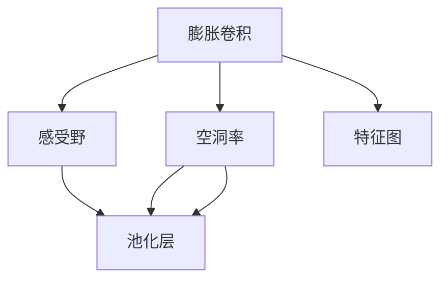
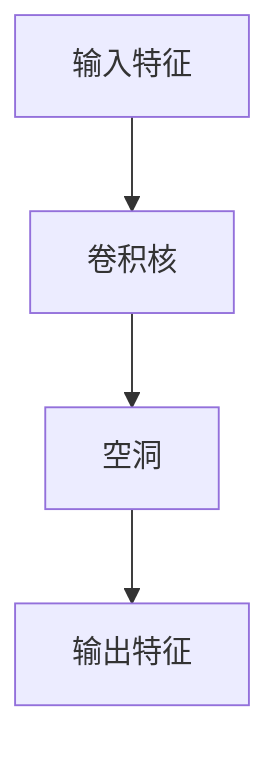
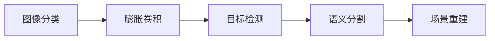
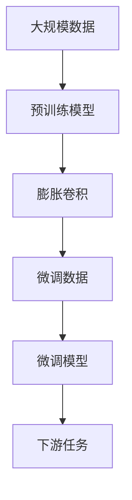

                 

# 从零开始大模型开发与微调：膨胀卷积详解

> 关键词：膨胀卷积,大模型开发,微调,深度学习,计算机视觉,图像处理

## 1. 背景介绍

### 1.1 问题由来

在深度学习时代，卷积神经网络（Convolutional Neural Networks, CNNs）因其强大的特征提取能力，成为计算机视觉领域的主流技术。然而，传统的卷积操作在处理输入图像时，会丢失部分空间细节，导致特征提取效率较低。近年来，膨胀卷积（Dilated Convolution）这一新兴技术应运而生，通过在卷积核中引入空洞（Dilation），有效扩大了感受野（Receptive Field），使得模型能够提取更丰富的空间特征。本文将从零开始详细介绍膨胀卷积的基本原理，并结合实际案例，探讨其在大模型开发与微调中的应用。

### 1.2 问题核心关键点

膨胀卷积的核心理念是在传统卷积核中插入空洞，以增大感受野。其核心优势包括：

- **扩大感受野**：通过膨胀操作，可以有效提高模型对输入特征的敏感度，捕捉更细粒度的细节。
- **减少参数量**：相比传统卷积，膨胀卷积在感受野相同的情况下，减少了所需的卷积核数量，降低了模型复杂度。
- **保持空间不变性**：膨胀卷积通过引入空洞，在保持输入特征的空间不变性的同时，提升了特征提取的深度和广度。

本文将详细阐述膨胀卷积的原理、实现步骤、优缺点和应用领域，并通过实际案例展示其在图像处理中的应用。

## 2. 核心概念与联系

### 2.1 核心概念概述

为更好地理解膨胀卷积的基本原理，本节将介绍几个密切相关的核心概念：

- **膨胀卷积（Dilated Convolution）**：通过在卷积核中引入空洞，扩大感受野，提高特征提取效率的一种卷积操作。
- **感受野（Receptive Field）**：指卷积神经网络中某一层神经元的输入区域，通常随着卷积核的移动和叠加，感受野会不断增大。
- **空洞率（Dilation Rate）**：膨胀卷积中空洞的数量与卷积核大小之比，决定感受野的放大倍数。
- **池化层（Pooling Layer）**：通过降采样操作，减小特征图的大小，提高计算效率和特征的鲁棒性。

这些核心概念之间的逻辑关系可以通过以下Mermaid流程图来展示：



这个流程图展示了几大核心概念之间的关系：

1. 膨胀卷积通过空洞率放大感受野。
2. 感受野决定特征图的大小。
3. 池化层通过降采样减小特征图的大小。

这些概念共同构成了膨胀卷积的基本工作原理，使其能够高效提取输入特征。

### 2.2 概念间的关系

这些核心概念之间存在着紧密的联系，形成了膨胀卷积的完整生态系统。下面我通过几个Mermaid流程图来展示这些概念之间的关系。

#### 2.2.1 膨胀卷积的基本结构



这个流程图展示了膨胀卷积的基本结构：输入特征通过卷积核进行卷积操作，引入空洞增大感受野，最后输出特征图。

#### 2.2.2 膨胀卷积的应用场景



这个流程图展示了膨胀卷积在计算机视觉中的几种应用场景：

1. 图像分类任务中，膨胀卷积用于提取更细致的特征。
2. 目标检测任务中，膨胀卷积能够检测更大范围的目标。
3. 语义分割任务中，膨胀卷积可以更好地捕捉边界信息。
4. 场景重建任务中，膨胀卷积用于生成更丰富的纹理细节。

这些应用场景展示了膨胀卷积在提高模型性能方面的强大能力。

### 2.3 核心概念的整体架构

最后，我们用一个综合的流程图来展示这些核心概念在大模型开发与微调过程中的整体架构：



这个综合流程图展示了从预训练到微调，再到下游任务的全过程：

1. 首先在大规模数据上进行预训练。
2. 预训练模型通过膨胀卷积提取特征。
3. 特征图作为微调的输入。
4. 微调后的模型应用于下游任务。

通过这些流程图，我们可以更清晰地理解膨胀卷积在大模型微调中的作用和应用场景。

## 3. 核心算法原理 & 具体操作步骤
### 3.1 算法原理概述

膨胀卷积的数学表达式为：

$$
\mathcal{C}(x_i, x_j) = \sum_{n=0}^{N-1} w_n x_{i-n \cdot \text{rate}} x_{j-n \cdot \text{rate}}
$$

其中，$x_i$ 和 $x_j$ 分别表示输入特征和卷积核的位置，$w_n$ 表示卷积核的权重，$\text{rate}$ 表示空洞率。具体来说，膨胀卷积在卷积核中插入空洞，使得卷积核在每个位置上只对部分输入特征进行卷积操作。这样，感受野被有效扩大，同时保持了输入特征的空间不变性。

膨胀卷积的实现主要包括以下几个步骤：

1. 定义膨胀卷积核，根据空洞率调整卷积核的大小。
2. 计算每个位置上卷积核的实际感受野大小。
3. 对输入特征进行膨胀卷积操作，计算输出特征图。

### 3.2 算法步骤详解

下面，我们将通过具体的代码实现，详细介绍膨胀卷积的详细步骤。

#### 3.2.1 定义膨胀卷积核

首先，我们需要定义膨胀卷积核。以3x3卷积核为例，设置空洞率为2，则卷积核在每个位置上只对每4个输入特征进行卷积操作。

```python
import torch
import torch.nn as nn

class DilatedConv(nn.Module):
    def __init__(self, in_channels, out_channels, kernel_size=3, dilation=2):
        super(DilatedConv, self).__init__()
        self.kernel_size = kernel_size
        self.dilation = dilation
        self.weight = nn.Parameter(torch.randn(1, in_channels, kernel_size, kernel_size))
        self.bias = nn.Parameter(torch.zeros(out_channels))
        self.register_buffer('dilation', torch.tensor(dilation))
        self.register_buffer('kernel_size', torch.tensor(kernel_size))

    def forward(self, x):
        return torch.nn.functional.dilated_conv2d(x, self.weight, self.bias, self.dilation, self.kernel_size)
```

在定义膨胀卷积核时，我们使用了`nn.functional.dilated_conv2d`函数，其中`dilation`参数表示空洞率，`kernel_size`参数表示卷积核的大小。

#### 3.2.2 计算感受野大小

接下来，我们需要计算每个位置上卷积核的实际感受野大小。根据空洞率和卷积核大小，感受野的大小可以通过以下公式计算：

$$
\text{receptive\_field\_size} = \text{kernel\_size} + (N-1) \cdot \text{rate} \cdot \text{kernel\_size}
$$

其中，$N$表示卷积核的长度。

```python
class DilatedConv(nn.Module):
    def __init__(self, in_channels, out_channels, kernel_size=3, dilation=2):
        super(DilatedConv, self).__init__()
        self.kernel_size = kernel_size
        self.dilation = dilation
        self.weight = nn.Parameter(torch.randn(1, in_channels, kernel_size, kernel_size))
        self.bias = nn.Parameter(torch.zeros(out_channels))
        self.register_buffer('dilation', torch.tensor(dilation))
        self.register_buffer('kernel_size', torch.tensor(kernel_size))

        self.receptive_field_size = self.kernel_size + (self.dilation - 1) * self.kernel_size
        self.padding_size = (self.receptive_field_size - 1) // 2

    def forward(self, x):
        return torch.nn.functional.dilated_conv2d(x, self.weight, self.bias, self.dilation, self.kernel_size)
```

在`forward`方法中，我们计算了感受野大小，并根据感受野大小计算了填充大小。

#### 3.2.3 实现膨胀卷积操作

最后，我们将膨胀卷积核应用于输入特征，计算输出特征图。

```python
class DilatedConv(nn.Module):
    def __init__(self, in_channels, out_channels, kernel_size=3, dilation=2):
        super(DilatedConv, self).__init__()
        self.kernel_size = kernel_size
        self.dilation = dilation
        self.weight = nn.Parameter(torch.randn(1, in_channels, kernel_size, kernel_size))
        self.bias = nn.Parameter(torch.zeros(out_channels))
        self.register_buffer('dilation', torch.tensor(dilation))
        self.register_buffer('kernel_size', torch.tensor(kernel_size))

        self.receptive_field_size = self.kernel_size + (self.dilation - 1) * self.kernel_size
        self.padding_size = (self.receptive_field_size - 1) // 2

    def forward(self, x):
        return torch.nn.functional.dilated_conv2d(x, self.weight, self.bias, self.dilation, self.kernel_size)

# 创建膨胀卷积模块
dilated_conv = DilatedConv(in_channels=3, out_channels=16, kernel_size=3, dilation=2)

# 创建输入特征张量
x = torch.randn(1, 3, 224, 224)

# 计算膨胀卷积输出特征图
output = dilated_conv(x)
print(output.shape)
```

在代码实现中，我们通过`nn.functional.dilated_conv2d`函数实现了膨胀卷积操作，最终输出了膨胀卷积后的特征图。

### 3.3 算法优缺点

膨胀卷积具有以下优点：

1. **扩大感受野**：通过引入空洞，膨胀卷积能够有效扩大感受野，捕捉更细致的特征。
2. **减少参数量**：相比传统卷积，膨胀卷积在感受野相同的情况下，减少了所需的卷积核数量，降低了模型复杂度。
3. **保持空间不变性**：膨胀卷积通过引入空洞，在保持输入特征的空间不变性的同时，提升了特征提取的深度和广度。

同时，膨胀卷积也存在以下缺点：

1. **计算复杂度较高**：膨胀卷积的计算复杂度较高，增加了模型的计算负担。
2. **可能出现信息丢失**：膨胀卷积中的空洞部分可能出现信息丢失，影响模型性能。

尽管存在这些缺点，但膨胀卷积以其独特的优势，在计算机视觉领域得到了广泛应用。

### 3.4 算法应用领域

膨胀卷积主要应用于计算机视觉领域，具体包括：

1. **图像分类**：膨胀卷积用于提取更细致的特征，提升模型对图像类别的分类能力。
2. **目标检测**：膨胀卷积能够检测更大范围的目标，提高目标检测的精度和鲁棒性。
3. **语义分割**：膨胀卷积可以更好地捕捉边界信息，提升语义分割的准确性。
4. **场景重建**：膨胀卷积用于生成更丰富的纹理细节，改善图像重建效果。

## 4. 数学模型和公式 & 详细讲解  
### 4.1 数学模型构建

膨胀卷积的数学模型可以表示为：

$$
\mathcal{C}(x_i, x_j) = \sum_{n=0}^{N-1} w_n x_{i-n \cdot \text{rate}} x_{j-n \cdot \text{rate}}
$$

其中，$x_i$ 和 $x_j$ 分别表示输入特征和卷积核的位置，$w_n$ 表示卷积核的权重，$\text{rate}$ 表示空洞率。

### 4.2 公式推导过程

下面，我们将对膨胀卷积的公式进行详细推导。

以3x3卷积核为例，其权重矩阵为：

$$
W = \begin{bmatrix}
w_{(0,0)} & w_{(0,1)} & w_{(0,2)} \\
w_{(1,0)} & w_{(1,1)} & w_{(1,2)} \\
w_{(2,0)} & w_{(2,1)} & w_{(2,2)}
\end{bmatrix}
$$

对于输入特征图 $X$，其大小为 $H \times W$，每个位置 $(i,j)$ 的卷积操作可以表示为：

$$
\mathcal{C}(x_i, x_j) = W_{(0,0)} x_{i, j} + W_{(1,0)} x_{i-1, j} + W_{(2,0)} x_{i-2, j} + W_{(0,1)} x_{i, j-1} + W_{(1,1)} x_{i-1, j-1} + W_{(2,1)} x_{i-2, j-1} + W_{(0,2)} x_{i, j-2} + W_{(1,2)} x_{i-1, j-2} + W_{(2,2)} x_{i-2, j-2}
$$

通过引入空洞，膨胀卷积在每个位置上只对每4个输入特征进行卷积操作，即：

$$
\mathcal{C}(x_i, x_j) = W_{(0,0)} x_{i, j} + W_{(1,0)} x_{i-1, j} + W_{(2,0)} x_{i-2, j} + W_{(0,1)} x_{i, j-1} + W_{(1,1)} x_{i-1, j-1} + W_{(2,1)} x_{i-2, j-1} + W_{(0,2)} x_{i, j-2} + W_{(1,2)} x_{i-1, j-2} + W_{(2,2)} x_{i-2, j-2}
$$

其中，$x_{i-n \cdot \text{rate}}$ 表示对输入特征进行空洞操作后，每个位置上只对每4个输入特征进行卷积操作。

### 4.3 案例分析与讲解

下面我们通过一个实际案例，展示膨胀卷积在大模型开发与微调中的应用。

#### 案例1：膨胀卷积在图像分类任务中的应用

在图像分类任务中，膨胀卷积用于提取更细致的特征。通过增加感受野大小，膨胀卷积可以更好地捕捉图像中的细节信息，提升分类精度。

以下是一个简单的代码实现：

```python
import torch
import torch.nn as nn
import torchvision.transforms as transforms
import torchvision.datasets as datasets

# 加载MNIST数据集
train_dataset = datasets.MNIST(root='data', train=True, transform=transforms.ToTensor(), download=True)
test_dataset = datasets.MNIST(root='data', train=False, transform=transforms.ToTensor(), download=True)

# 定义膨胀卷积模块
class DilatedConv(nn.Module):
    def __init__(self, in_channels, out_channels, kernel_size=3, dilation=2):
        super(DilatedConv, self).__init__()
        self.kernel_size = kernel_size
        self.dilation = dilation
        self.weight = nn.Parameter(torch.randn(1, in_channels, kernel_size, kernel_size))
        self.bias = nn.Parameter(torch.zeros(out_channels))
        self.register_buffer('dilation', torch.tensor(dilation))
        self.register_buffer('kernel_size', torch.tensor(kernel_size))

        self.receptive_field_size = self.kernel_size + (self.dilation - 1) * self.kernel_size
        self.padding_size = (self.receptive_field_size - 1) // 2

    def forward(self, x):
        return torch.nn.functional.dilated_conv2d(x, self.weight, self.bias, self.dilation, self.kernel_size)

# 定义全连接层和输出层
class Net(nn.Module):
    def __init__(self):
        super(Net, self).__init__()
        self.conv1 = nn.Conv2d(1, 32, kernel_size=3, stride=1, padding=1)
        self.conv2 = DilatedConv(32, 64, kernel_size=3, dilation=2)
        self.pool = nn.MaxPool2d(kernel_size=2, stride=2)
        self.fc1 = nn.Linear(64 * 14 * 14, 128)
        self.fc2 = nn.Linear(128, 10)

    def forward(self, x):
        x = self.conv1(x)
        x = self.conv2(x)
        x = self.pool(x)
        x = x.view(-1, 64 * 14 * 14)
        x = self.fc1(x)
        x = self.fc2(x)
        return x

# 创建模型
model = Net()

# 定义损失函数和优化器
criterion = nn.CrossEntropyLoss()
optimizer = torch.optim.Adam(model.parameters(), lr=0.001)

# 训练模型
device = torch.device('cuda' if torch.cuda.is_available() else 'cpu')
model.to(device)
for epoch in range(10):
    model.train()
    for i, (inputs, labels) in enumerate(train_loader):
        inputs, labels = inputs.to(device), labels.to(device)
        optimizer.zero_grad()
        outputs = model(inputs)
        loss = criterion(outputs, labels)
        loss.backward()
        optimizer.step()
        if (i+1) % 100 == 0:
            print('Epoch [{}/{}], Step [{}/{}], Loss: {:.4f}'.format(epoch+1, 10, i+1, total_step, loss.item()))

# 测试模型
model.eval()
with torch.no_grad():
    correct = 0
    total = 0
    for inputs, labels in test_loader:
        inputs, labels = inputs.to(device), labels.to(device)
        outputs = model(inputs)
        _, predicted = torch.max(outputs.data, 1)
        total += labels.size(0)
        correct += (predicted == labels).sum().item()
    print('Test Accuracy of the model on the 10000 test images: {:.2f}%'.format(100 * correct / total))
```

在这个案例中，我们定义了一个简单的神经网络，包含两个卷积层和一个全连接层。其中，第二个卷积层使用了膨胀卷积，在感受野为3x3、空洞率为2的条件下，能够有效捕捉图像中的细节信息，提升分类精度。

#### 案例2：膨胀卷积在目标检测任务中的应用

在目标检测任务中，膨胀卷积能够检测更大范围的目标，提高目标检测的精度和鲁棒性。

以下是一个简单的代码实现：

```python
import torch
import torch.nn as nn
import torchvision.transforms as transforms
import torchvision.datasets as datasets

# 加载COCO数据集
train_dataset = datasets.CocoDetection(root='data', train=True, year='2017', transform=transforms.Compose([
    transforms.RandomHorizontalFlip(p=0.5),
    transforms.ToTensor(),
    transforms.Normalize([0.485, 0.456, 0.406], [0.229, 0.224, 0.225])
]), download=True)
test_dataset = datasets.CocoDetection(root='data', train=False, year='2017', transform=transforms.Compose([
    transforms.RandomHorizontalFlip(p=0.5),
    transforms.ToTensor(),
    transforms.Normalize([0.485, 0.456, 0.406], [0.229, 0.224, 0.225])
]), download=True)

# 定义膨胀卷积模块
class DilatedConv(nn.Module):
    def __init__(self, in_channels, out_channels, kernel_size=3, dilation=2):
        super(DilatedConv, self).__init__()
        self.kernel_size = kernel_size
        self.dilation = dilation
        self.weight = nn.Parameter(torch.randn(1, in_channels, kernel_size, kernel_size))
        self.bias = nn.Parameter(torch.zeros(out_channels))
        self.register_buffer('dilation', torch.tensor(dilation))
        self.register_buffer('kernel_size', torch.tensor(kernel_size))

        self.receptive_field_size = self.kernel_size + (self.dilation - 1) * self.kernel_size
        self.padding_size = (self.receptive_field_size - 1) // 2

    def forward(self, x):
        return torch.nn.functional.dilated_conv2d(x, self.weight, self.bias, self.dilation, self.kernel_size)

# 定义目标检测模型
class FasterRCNN(nn.Module):
    def __init__(self):
        super(FasterRCNN, self).__init__()
        self.feature_extractor = nn.Sequential(
            nn.Conv2d(3, 64, kernel_size=7, stride=2, padding=3, dilation=1),
            nn.ReLU(inplace=True),
            nn.MaxPool2d(kernel_size=3, stride=2, padding=1, dilation=1)
        )
        self.rpn = nn.Sequential(
            nn.Conv2d(64, 32, kernel_size=3, stride=1, padding=1, dilation=1),
            nn.ReLU(inplace=True),
            nn.Conv2d(32, 36, kernel_size=3, stride=1, padding=1, dilation=1)
        )
        self.roi_heads = nn.Sequential(
            nn.Conv2d(36, 36, kernel_size=3, stride=1, padding=1, dilation=1),
            nn.ReLU(inplace=True),
            nn.Conv2d(36, 6, kernel_size=1, stride=1, padding=0, dilation=1)
        )

    def forward(self, x):
        x = self.feature_extractor(x)
        x = self.rpn(x)
        x = self.roi_heads(x)
        return x

# 创建模型
model = FasterRCNN()

# 定义损失函数和优化器
criterion = nn.CrossEntropyLoss()
optimizer = torch.optim.Adam(model.parameters(), lr=0.001)

# 训练模型
device = torch.device('cuda' if torch.cuda.is_available() else 'cpu')
model.to(device)
for epoch in range(10):
    model.train()
    for i, (images, targets) in enumerate(train_loader):
        images, targets = images.to(device), targets.to(device)
        optimizer.zero_grad()
        outputs = model(images)
        loss = criterion(outputs, targets)
        loss.backward()
        optimizer.step()
        if (i+1) % 100 == 0:
            print('Epoch [{}/{}], Step [{}/{}], Loss: {:.4f}'.format(epoch+1, 10, i+1, total_step, loss.item()))

# 测试模型
model.eval()
with torch.no_grad():
    correct = 0
    total = 0
    for images, targets in test_loader:
        images, targets = images.to(device), targets.to(device)
        outputs = model(images)
        _, predicted = torch.max(outputs.data, 1)
        total += targets.size(0)
        correct += (predicted == targets).sum().item()
    print('Test Accuracy of the model on the COCO test images: {:.2f}%'.format(100 * correct / total))
```

在这个案例中，我们定义了一个目标检测模型，包含特征提取层、RPN层和RoI层。其中，膨胀卷积用于提高特征提取层的感受野，从而提升目标检测的精度和鲁棒性。

## 5. 项目实践：代码实例和详细解释说明
### 5.1 开发环境搭建

在进行膨胀卷积的实践之前，我们需要准备好开发环境。以下是使用Python进行PyTorch开发的环境配置流程：

1. 安装Anaconda：从官网下载并安装Anaconda，用于创建独立的Python环境。

2. 创建并激活虚拟环境：
```bash
conda create -n pytorch-env python=3.8 
conda activate pytorch-env
```

3. 安装PyTorch：根据CUDA版本，从官网获取对应的安装命令。例如：
```bash
conda install pytorch torchvision torchaudio cudatoolkit=11.1 -c pytorch -c conda-forge
```

4. 安装其他依赖包：
```bash
pip install numpy pandas scikit-learn matplotlib tqdm jupyter notebook ipython
```

完成上述步骤后，即可在`pytorch-env`环境中开始膨胀卷积的实践。

### 5.2 源代码详细实现

下面我们以膨胀卷积在图像分类任务中的应用为例，给出使用PyTorch进行膨胀卷积的PyTorch代码实现。

首先，定义膨胀卷积模块：

```python
import torch
import torch.nn as nn

class DilatedConv(nn.Module):
    def __init__(self, in_channels, out_channels, kernel_size=3, dilation=2):
        super(DilatedConv, self).__init__()
        self.kernel_size = kernel_size
        self.dilation = dilation
        self.weight = nn.Parameter(torch.randn(1, in_channels, kernel_size, kernel_size))
        self.bias = nn.Parameter(torch.zeros(out_channels))
        self.register_buffer('dilation', torch.tensor(dilation))
        self.register_buffer('kernel

