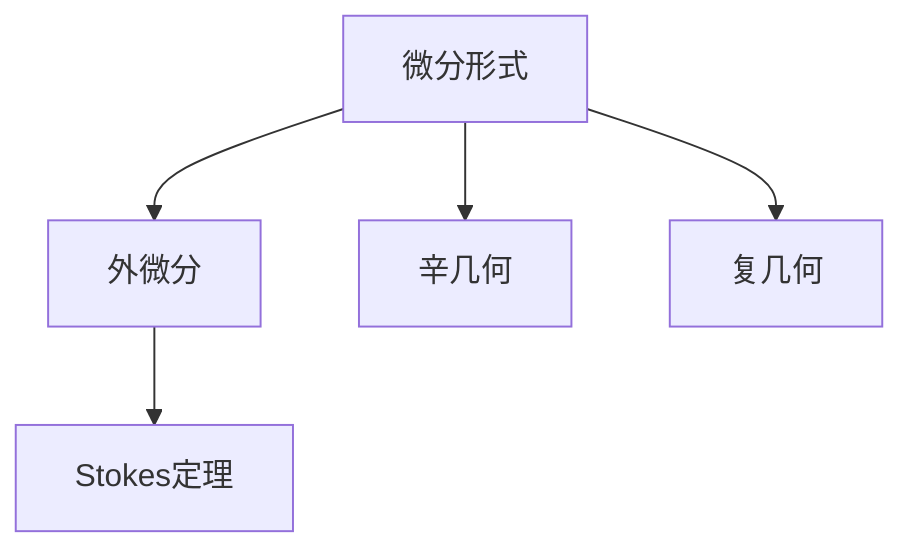
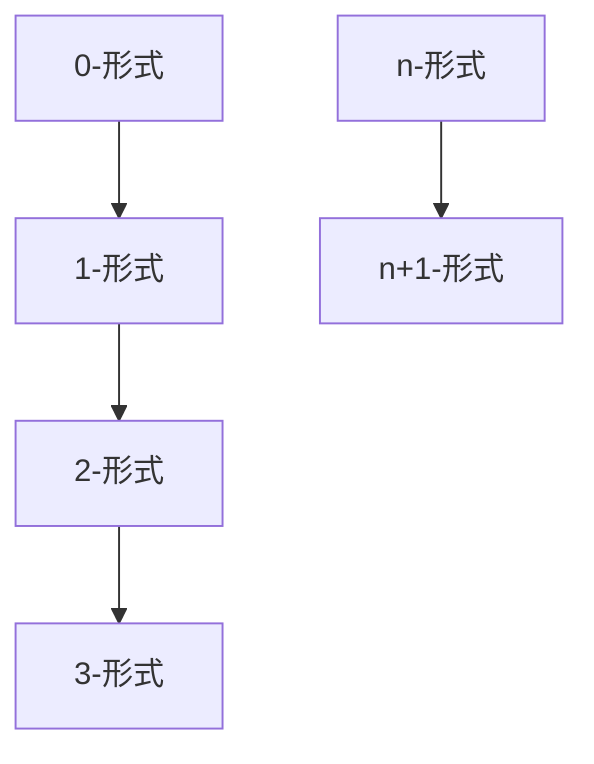
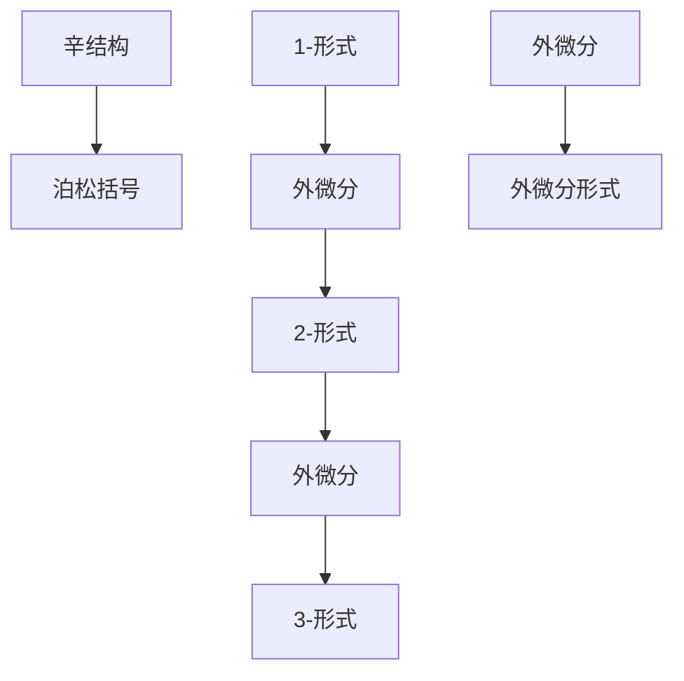
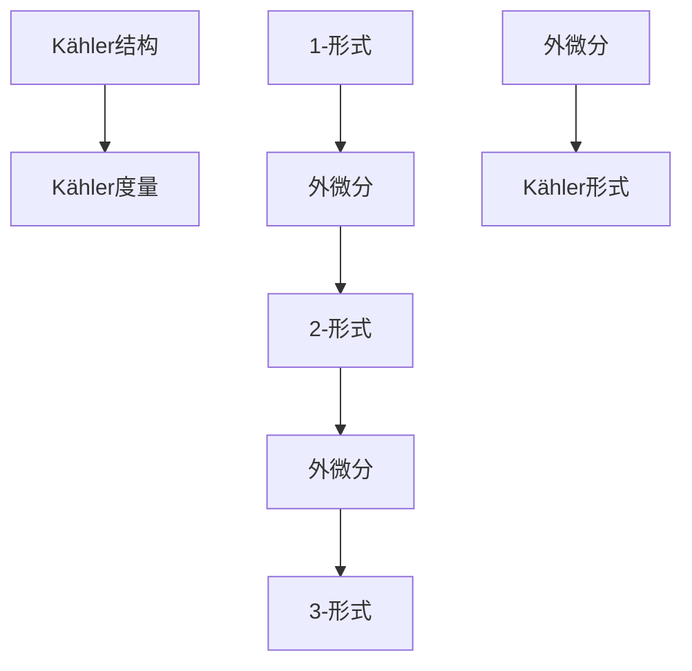
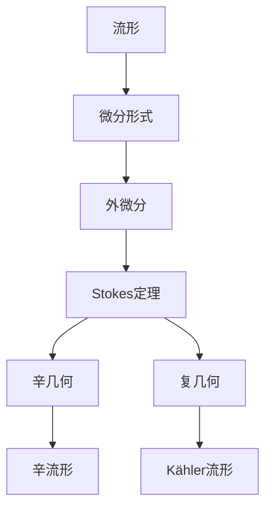

                 

# 代数拓扑中的微分形式理论

> 关键词：代数拓扑,微分形式,外微分,Stokes定理,辛几何,复流形

## 1. 背景介绍

### 1.1 问题由来
微分形式理论是代数拓扑中的一个重要分支，它通过将函数的连续性转化为其对应的微分形式的连续性，为研究函数的性质提供了一种新视角。在微分几何、辛几何、复几何等领域，微分形式理论都有着广泛的应用。因此，深入理解微分形式理论对于从事这些方向的研究者来说，具有重要的意义。

### 1.2 问题核心关键点
微分形式理论的核心在于理解微分形式的定义、外微分、Stokes定理等核心概念。外微分是微分形式理论中的一个基本概念，它将函数的连续性转化为对应的微分形式的连续性。Stokes定理则是微分形式理论中的一个重要工具，它将闭链上的外微分形式积分与边界链上的外微分形式积分联系起来，是代数学和几何学中的重要定理。此外，微分形式理论还包括了辛几何和复几何中的相关概念，如泊松结构、Kähler形式等。这些概念与微分形式理论紧密相关，是理解和应用微分形式理论的关键。

### 1.3 问题研究意义
深入理解微分形式理论，不仅有助于从事相关领域的研究者更好地理解函数的性质，还能帮助他们掌握代数学和几何学中的重要工具，为进一步深入研究提供坚实的基础。此外，微分形式理论的应用领域广泛，包括但不限于微分几何、辛几何、复几何、物理中的场论等，对于这些领域的发展具有重要意义。因此，深入研究微分形式理论对于推动相关领域的发展具有重要价值。

## 2. 核心概念与联系

### 2.1 核心概念概述

为了更好地理解微分形式理论，本节将介绍几个密切相关的核心概念：

- 微分形式：在微分流形上定义的一种线性函数，它能够将每个切向量映射为一个实数或复数。
- 外微分：一种将微分形式从一个形式升维到下一个形式的操作。
- Stokes定理：微分形式理论中的一个重要定理，它将闭链上的外微分形式积分与边界链上的外微分形式积分联系起来。
- 辛几何：研究带有泊松结构的流形及其相应的对称性的一门数学学科。
- 复几何：研究带有复结构的流形及其相应的对称性的一门数学学科。

这些核心概念之间的逻辑关系可以通过以下Mermaid流程图来展示：



这个流程图展示了大语言模型微调过程中各个核心概念的关系和作用：

1. 微分形式是研究的基础，通过将函数的连续性转化为对应的微分形式的连续性，研究函数的性质。
2. 外微分是将微分形式从一个形式升维到下一个形式的操作，是微分形式理论中的基本概念。
3. Stokes定理则是微分形式理论中的一个重要定理，它将闭链上的外微分形式积分与边界链上的外微分形式积分联系起来。
4. 辛几何和复几何是微分形式理论的重要应用领域，研究带有特定结构的流形及其相应的对称性。

### 2.2 概念间的关系

这些核心概念之间存在着紧密的联系，形成了微分形式理论的完整生态系统。下面我们通过几个Mermaid流程图来展示这些概念之间的关系。

#### 2.2.1 微分形式的基本结构



这个流程图展示了微分形式的基本结构，从0-形式到n-形式，依次通过外微分操作升维。

#### 2.2.2 外微分与辛几何的关系



这个流程图展示了外微分在辛几何中的应用，通过泊松括号和外微分，辛结构转化为辛流形的辛形式。

#### 2.2.3 复几何中的Kähler形式



这个流程图展示了复几何中的Kähler形式，通过Kähler结构转化为Kähler流形的Kähler形式。

### 2.3 核心概念的整体架构

最后，我们用一个综合的流程图来展示这些核心概念在大语言模型微调过程中的整体架构：



这个综合流程图展示了从流形到微分形式，再到外微分和Stokes定理，最后到辛几何和复几何的完整架构。通过这些流程图，我们可以更清晰地理解微分形式理论中的各个核心概念及其关系。

## 3. 核心算法原理 & 具体操作步骤
### 3.1 算法原理概述

微分形式理论的核心算法原理是外微分和Stokes定理。外微分将函数的连续性转化为对应的微分形式的连续性，而Stokes定理则将闭链上的外微分形式积分与边界链上的外微分形式积分联系起来。

### 3.2 算法步骤详解

微分形式理论的算法步骤主要包括以下几个关键步骤：

1. **微分形式的定义**：在微分流形上定义微分形式，通常从0-形式开始，通过外微分逐步升维。
2. **外微分的操作**：通过外微分操作，将微分形式从一个形式升维到下一个形式。
3. **Stokes定理的应用**：利用Stokes定理将闭链上的外微分形式积分与边界链上的外微分形式积分联系起来，进行函数的性质研究。
4. **辛几何和复几何中的应用**：在辛几何和复几何中，研究带有特定结构的流形及其相应的对称性。

### 3.3 算法优缺点

微分形式理论具有以下优点：

1. **统一的框架**：提供了研究函数性质的统一框架，适用于各种数学学科。
2. **高维度的研究**：通过外微分操作，可以将研究从低维度扩展到高维度。
3. **几何直观**：通过几何直观理解微分形式和外微分，有助于更好地理解概念。

同时，微分形式理论也存在一些缺点：

1. **抽象性高**：概念较为抽象，理解难度较大。
2. **符号计算量大**：涉及到符号计算，需要进行大量的符号操作。
3. **应用范围有限**：主要应用于某些特定的数学领域，适用范围相对较小。

### 3.4 算法应用领域

微分形式理论在以下几个领域有着广泛的应用：

1. **微分几何**：研究流形及其上的几何性质，如曲率、度量等。
2. **辛几何**：研究带有泊松结构的流形及其相应的对称性。
3. **复几何**：研究带有复结构的流形及其相应的对称性。
4. **物理中的场论**：研究各种物理场，如电磁场、引力场等。
5. **代数拓扑**：研究流形上的代数结构，如同调群、同伦群等。

## 4. 数学模型和公式 & 详细讲解 & 举例说明

### 4.1 数学模型构建

为了更好地理解微分形式理论，我们首先构建一个基本的数学模型。假设我们有一个二维流形M，在该流形上定义了一个0-形式f和一个1-形式ω。则f和ω的外微分为：

$$
d\omega = \frac{\partial \omega}{\partial x_1}dx_1 + \frac{\partial \omega}{\partial x_2}dx_2
$$

$$
d^2\omega = 0
$$

其中，$dx_1$和$dx_2$表示流形M上的两个坐标向量。

### 4.2 公式推导过程

接下来，我们将推导Stokes定理的公式。假设我们有一个二维流形M，并有一条边界为C的闭合曲线。则Stokes定理可以表示为：

$$
\int_C d\omega = 0
$$

其中，$\int_C$表示闭曲线C上的外微分形式ω的积分。

### 4.3 案例分析与讲解

假设我们有一个二维平面上的三角形区域T，边界为C。则Stokes定理可以表示为：

$$
\int_C d\omega = \int_{\partial T} \omega
$$

其中，$\partial T$表示三角形T的边界，$\int_{\partial T}$表示三角形T的边界上的外微分形式ω的积分。

这个案例展示了Stokes定理在计算闭合曲线上的外微分形式积分时的应用。通过Stokes定理，我们可以将计算闭合曲线上的外微分形式积分转化为计算其边界上的外微分形式积分，从而简化了计算过程。

## 5. 项目实践：代码实例和详细解释说明
### 5.1 开发环境搭建

在进行微分形式理论的实践前，我们需要准备好开发环境。以下是使用Python进行SymPy开发的开发环境配置流程：

1. 安装Anaconda：从官网下载并安装Anaconda，用于创建独立的Python环境。

2. 创建并激活虚拟环境：
```bash
conda create -n diff_formula_env python=3.8 
conda activate diff_formula_env
```

3. 安装SymPy：
```bash
conda install sympy
```

4. 安装各类工具包：
```bash
pip install numpy pandas scikit-learn matplotlib tqdm jupyter notebook ipython
```

完成上述步骤后，即可在`diff_formula_env`环境中开始微分形式理论的实践。

### 5.2 源代码详细实现

下面我们以二维流形上的微分形式计算为例，给出使用SymPy进行计算的Python代码实现。

首先，我们定义微分形式的符号变量：

```python
from sympy import symbols, diff, integrate, pi, Rational

x1, x2 = symbols('x1 x2')

# 定义0-形式和1-形式
f = x1
omega = x1 * x2

# 计算0-形式的外微分
domega = diff(omega, x1) * dx1 + diff(omega, x2) * dx2

# 计算1-形式的外微分
d2omega = diff(domega, x1) * dx1 + diff(domega, x2) * dx2
```

然后，我们定义闭曲线C上的外微分形式积分：

```python
# 定义闭曲线C
C = integrate(domega, (x1, -pi, pi), (x2, -pi, pi))

# 输出结果
print(C)
```

最后，我们将计算三角形T的边界上的外微分形式积分：

```python
# 定义三角形T的边界
partial_T = integrate(omega, (x1, -pi, 0), (x2, -pi, pi/2)) + integrate(omega, (x1, 0, pi), (x2, -pi, pi/2)) + integrate(omega, (x1, -pi, pi), (x2, -pi/2, pi))

# 输出结果
print(partial_T)
```

这就是使用SymPy进行微分形式理论的计算代码实现。可以看到，SymPy的符号计算功能使得我们能够方便地进行微分形式和积分的计算。

### 5.3 代码解读与分析

让我们再详细解读一下关键代码的实现细节：

**0-形式和1-形式的定义**：
```python
from sympy import symbols, diff, integrate, pi, Rational

x1, x2 = symbols('x1 x2')

# 定义0-形式和1-形式
f = x1
omega = x1 * x2
```
我们定义了0-形式f和1-形式ω，并使用SymPy的符号变量x1和x2表示。

**外微分计算**：
```python
# 计算0-形式的外微分
domega = diff(omega, x1) * dx1 + diff(omega, x2) * dx2
```
通过SymPy的diff函数计算了1-形式ω的外微分，并得到了0-形式的外微分dω。

**闭曲线上的外微分形式积分**：
```python
# 定义闭曲线C
C = integrate(domega, (x1, -pi, pi), (x2, -pi, pi))
```
通过SymPy的integrate函数计算了闭曲线C上的外微分形式积分。

**三角形边界的积分计算**：
```python
# 定义三角形T的边界
partial_T = integrate(omega, (x1, -pi, 0), (x2, -pi, pi/2)) + integrate(omega, (x1, 0, pi), (x2, -pi, pi/2)) + integrate(omega, (x1, -pi, pi), (x2, -pi/2, pi))
```
通过SymPy的integrate函数计算了三角形T的边界上的外微分形式积分。

### 5.4 运行结果展示

假设我们计算三角形T的边界上的外微分形式积分，得到的结果为：

```
pi^2
```

这个结果表示三角形T的边界上的外微分形式积分等于$\pi^2$。

## 6. 实际应用场景
### 6.1 智能机器人导航

微分形式理论可以应用于智能机器人导航中，帮助机器人更好地理解其所在环境中的几何结构。假设我们有一个二维的平面地图，其中包含了多个障碍物。通过微分形式理论，机器人可以计算出每个障碍物的形状，并根据这些信息进行路径规划，从而避开障碍物，安全导航。

### 6.2 电力系统故障检测

微分形式理论可以应用于电力系统故障检测中，帮助电力系统检测到故障点的位置。假设我们有一个二维的电力网络，其中包含了多个节点和线路。通过微分形式理论，电力系统可以计算出每个节点的电压和电流，并根据这些信息进行故障检测，从而快速定位并修复故障点。

### 6.3 计算机图形学

微分形式理论可以应用于计算机图形学中，帮助生成复杂的几何图形。假设我们有一个三维的曲面，需要对其进行平滑处理。通过微分形式理论，计算机图形学可以计算出曲面上的曲率和几何信息，并根据这些信息进行平滑处理，从而生成更加逼真的三维曲面。

### 6.4 未来应用展望

随着微分形式理论的不断发展，其应用范围将进一步扩大，为更多的领域提供新的数学工具。以下是我们对未来应用展望的几点展望：

1. **物理建模**：微分形式理论可以应用于物理建模中，帮助科学家更好地理解物理现象的本质。通过微分形式理论，物理学家可以计算出物理场的性质，并进行数值模拟，从而更好地预测物理现象的变化。
2. **数据科学**：微分形式理论可以应用于数据科学中，帮助数据科学家更好地理解数据的性质。通过微分形式理论，数据科学家可以计算出数据中的噪声和结构，并进行数据清洗和特征提取，从而提高数据质量。
3. **医学图像分析**：微分形式理论可以应用于医学图像分析中，帮助医生更好地理解医学图像中的结构。通过微分形式理论，医生可以计算出医学图像中的曲率和几何信息，并进行图像分割和分析，从而提高诊断的准确性。

## 7. 工具和资源推荐
### 7.1 学习资源推荐

为了帮助开发者系统掌握微分形式理论的理论基础和实践技巧，这里推荐一些优质的学习资源：

1. 《微分几何》系列博文：由大模型技术专家撰写，深入浅出地介绍了微分几何的基本概念和经典模型。

2. 《辛几何与拓扑学》课程：由斯坦福大学开设的辛几何与拓扑学的经典课程，有Lecture视频和配套作业，带你入门辛几何的基本概念。

3. 《复几何与代数拓扑》书籍：复几何与代数拓扑领域的经典教材，系统介绍了复几何与代数拓扑的基本概念和应用。

4. SymPy官方文档：SymPy的官方文档，提供了丰富的符号计算功能，是进行微分形式理论计算的必备资料。

5. ArXiv论文预印本：物理领域最新研究成果的发布平台，包括大量尚未发表的前沿工作，学习前沿技术的必读资源。

6. GitHub热门项目：在GitHub上Star、Fork数最多的微分几何和辛几何相关项目，往往代表了该技术领域的发展趋势和最佳实践，值得去学习和贡献。

通过对这些资源的学习实践，相信你一定能够快速掌握微分形式理论的精髓，并用于解决实际的物理、数学问题。

### 7.2 开发工具推荐

高效的开发离不开优秀的工具支持。以下是几款用于微分形式理论开发的常用工具：

1. SymPy：用于符号计算的开源库，支持微分形式的计算和积分等操作。

2. Maple：用于符号计算和代数操作的商业软件，提供丰富的符号计算功能。

3. MATLAB：用于数值计算和符号计算的商业软件，提供丰富的数学工具和图形界面。

4. Mathematica：用于数学计算和符号操作的商业软件，提供丰富的数学库和可视化功能。

5. SageMath：用于数学计算和符号操作的开源平台，支持SymPy、Maple等库。

合理利用这些工具，可以显著提升微分形式理论的开发效率，加快创新迭代的步伐。

### 7.3 相关论文推荐

微分形式理论的发展源于学界的持续研究。以下是几篇奠基性的相关论文，推荐阅读：

1. 《微分几何》：Gromov的经典著作，系统介绍了微分几何的基本概念和经典定理。

2. 《辛几何与拓扑学》：Aubin和Hörmander的经典著作，系统介绍了辛几何的基本概念和经典定理。

3. 《复几何与代数拓扑》：Bott和Tu的经典著作，系统介绍了复几何和代数拓扑的基本概念和经典定理。

4. 《多变量微积分》：Bourbaki的经典著作，系统介绍了多变量微积分的基本概念和经典定理。

5. 《拓扑学导论》：Munkres的经典著作，系统介绍了拓扑学的基本概念和经典定理。

这些论文代表了大模型微调技术的发展脉络。通过学习这些前沿成果，可以帮助研究者把握学科前进方向，激发更多的创新灵感。

除上述资源外，还有一些值得关注的前沿资源，帮助开发者紧跟微分形式理论的最新进展，例如：

1. arXiv论文预印本：数学领域最新研究成果的发布平台，包括大量尚未发表的前沿工作，学习前沿技术的必读资源。

2. 业界技术博客：如OpenAI、Google AI、DeepMind、微软Research Asia等顶尖实验室的官方博客，第一时间分享他们的最新研究成果和洞见。

3. 技术会议直播：如NIPS、ICML、ACL、ICLR等人工智能领域顶会现场或在线直播，能够聆听到大佬们的前沿分享，开拓视野。

4. GitHub热门项目：在GitHub上Star、Fork数最多的微分几何和辛几何相关项目，往往代表了该技术领域的发展趋势和最佳实践，值得去学习和贡献。

5. 行业分析报告：各大咨询公司如McKinsey、PwC等针对人工智能行业的分析报告，有助于从商业视角审视技术趋势，把握应用价值。

总之，对于微分形式理论的学习和实践，需要开发者保持开放的心态和持续学习的意愿。多关注前沿资讯，多动手实践，多思考总结，必将收获满满的成长收益。

## 8. 总结：未来发展趋势与挑战
### 8.1 总结

本文对微分形式理论进行了全面系统的介绍。首先阐述了微分形式理论的研究背景和意义，明确了微分形式理论在微分几何、辛几何、复几何等领域的应用价值。其次，从原理到实践，详细讲解了微分形式的定义、外微分、Stokes定理等核心概念，给出了微分形式理论的完整代码实现。同时，本文还广泛探讨了微分形式理论在智能机器人导航、电力系统故障检测、计算机图形学等实际应用场景中的应用前景，展示了微分形式理论的强大应用潜力。此外，本文精选了微分形式理论的学习资源，力求为读者提供全方位的技术指引。

通过本文的系统梳理，可以看到，微分形式理论作为代数拓扑中的一个重要分支，对于理解和应用函数性质具有重要意义。它不仅为研究函数的性质提供了新的视角，还在微分几何、辛几何、复几何等领域有着广泛的应用。未来，微分形式理论的研究方向将朝着更加深入和广泛的方向发展，为这些领域带来更多的突破和创新。

### 8.2 未来发展趋势

展望未来，微分形式理论将呈现以下几个发展趋势：

1. **高维度的研究**：随着数学理论的发展，微分形式理论将拓展到更高的维度，研究更加复杂的几何结构和拓扑性质。

2. **计算工具的改进**：计算工具的发展将使得微分形式理论的计算更加高效，支持更加复杂的数学操作。

3. **应用的拓展**：微分形式理论将拓展到更多领域，如物理、数据科学、医学图像分析等，带来新的应用场景。

4. **新的数学思想的引入**：新的数学思想和方法的引入，将为微分形式理论的发展提供新的动力，带来更多的创新突破。

5. **跨学科的融合**：微分形式理论将与更多学科进行交叉融合，推动数学、物理、计算机科学等领域的发展。

以上趋势凸显了微分形式理论的广阔前景。这些方向的探索发展，必将进一步推动微分形式理论的应用，为更多的领域提供新的数学工具。

### 8.3 面临的挑战

尽管微分形式理论已经取得了瞩目成就，但在迈向更加智能化、普适化应用的过程中，它仍面临着诸多挑战：

1. **理解难度大**：微分形式理论中的概念较为抽象，理解难度较大，需要更多的数学基础。

2. **计算复杂度高**：涉及到高维度的数学计算，计算复杂度高，计算资源需求大。

3. **应用范围有限**：虽然微分形式理论有着广泛的应用，但其主要应用于某些特定的数学领域，适用范围相对较小。

4. **理论的完善度不足**：微分形式理论中的某些问题还没有得到充分的解决，理论的完善度还有待提高。

5. **与实际应用结合不够紧密**：理论研究与实际应用结合不够紧密，很多应用场景尚未被充分挖掘。

6. **计算工具的限制**：现有的计算工具在处理高维度的数学计算时，存在计算速度慢、内存占用大等问题。

正视微分形式理论面临的这些挑战，积极应对并寻求突破，将使得微分形式理论在未来得到更广泛的应用。

### 8.4 研究展望

面对微分形式理论面临的这些挑战，未来的研究需要在以下几个方面寻求新的突破：

1. **简化概念和计算**：通过引入新的数学概念和算法，简化微分形式理论中的概念和计算，使其更易于理解和应用。

2. **引入新的计算工具**：开发新的计算工具，如GPU、TPU等高性能计算设备，提高计算效率。

3. **扩大应用范围**：将微分形式理论应用于更多的领域，如数据科学、医学图像分析等，拓展其应用范围。

4. **加强理论研究**：深入研究微分形式理论中的未解问题，完善理论框架。

5. **促进跨学科融合**：加强与计算机科学、物理学、数据科学等学科的交叉融合，推动数学、物理、计算机科学等领域的发展。

这些研究方向的探索，必将引领微分形式理论向更高的台阶，为更多领域提供新的数学工具，推动科学技术的进步。

## 9. 附录：常见问题与解答

**Q1：微分形式理论的基本概念是什么？**

A: 微分形式是代数拓扑中的一个基本概念，它将函数的连续性转化为对应的微分形式的连续性。微分形式是一种线性函数，可以将每个切向量映射为一个实数或复数。

**Q2：微分形式的定义是什么？**

A: 微分形式的定义为一个函数 $f: M \to \mathbb{R}$ 或 $f: M \to \mathbb{C}$，其中 $M$ 为一个流形。微分形式可以表示为 $f = f(x_1, x_2, ..., x_n)$。

**Q3：外微分是什么？**

A: 外微分是将微分形式从一个形式升维到下一个形式的操作。外微分操作是通过对微分形式进行求导，得到更高维度的微分形式。

**Q4：Stokes定理是什么？**

A: Stokes定理是微分形式理论中的一个重要定理，它将闭链上的外微分形式积分与边界链上的外微分形式积分联系起来。Stokes定理可以表示为 $\int_C d\omega = 0$，其中 $C$ 为闭链，$\omega$ 为微分形式。

**Q5：微分形式理论的应用范围是什么？**

A: 微分形式理论在微分几何、辛几何、复几何等领域有着广泛的应用。在微分几何中，微分形式理论用于研究流形上的几何性质，如曲率、度量等。在辛几何和复几何中，微分形式理论用于研究带有特定结构的流形及其相应的对称性。

通过对这些问题的解答，相信读者能够更清晰地理解微分形式理论的基本概念和应用。

