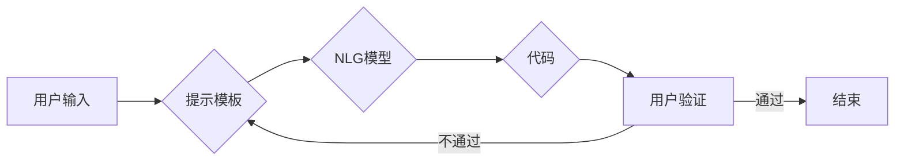

# 【LangChain编程：从入门到实践】提示模板组件

> 关键词：LangChain, 编程，提示模板，自然语言生成，代码生成，AI编程，AI编程助手，NLP

## 1. 背景介绍

随着人工智能技术的飞速发展，自然语言处理（NLP）技术在代码生成、文本摘要、机器翻译等领域取得了显著成果。LangChain作为一种新兴的NLP技术框架，旨在通过自然语言与编程语言之间的交互，实现编程任务的自动化和智能化。本文将深入探讨LangChain编程中的核心组件——提示模板，从入门到实践，帮助读者全面理解其原理和应用。

### 1.1 LangChain概述

LangChain是一种基于NLP技术的编程框架，它允许用户使用自然语言描述编程任务，并由AI模型自动完成。LangChain的核心思想是将自然语言与编程语言相结合，通过构建智能编程助手，提升软件开发效率和用户体验。

### 1.2 提示模板在LangChain中的作用

提示模板是LangChain编程中的核心组件之一，它负责将用户输入的自然语言描述转化为具体的编程指令，驱动AI模型进行代码生成。一个优秀的提示模板能够提高代码生成的准确性和效率，并减少对AI模型的理解难度。

## 2. 核心概念与联系

### 2.1 核心概念

- **LangChain**：一种基于NLP技术的编程框架，实现自然语言与编程语言之间的交互。
- **提示模板**：用于将自然语言描述转化为编程指令的模板，是LangChain的核心组件。
- **自然语言生成（NLG）**：AI模型根据输入文本生成文本的过程。
- **代码生成**：AI模型根据自然语言描述生成代码的过程。

### 2.2 Mermaid流程图



在上述流程图中，用户输入的自然语言描述经过提示模板处理后，由NLG模型生成代码。生成的代码经过用户验证后，若验证通过则结束；若验证不通过，则返回提示模板环节，重新生成代码。

## 3. 核心算法原理 & 具体操作步骤

### 3.1 算法原理概述

LangChain编程的算法原理主要包括以下几个方面：

- **自然语言理解（NLU）**：将用户输入的自然语言描述转化为结构化的数据表示。
- **自然语言生成（NLG）**：根据结构化数据生成符合编程规范的代码。
- **代码执行**：将生成的代码执行并得到结果。

### 3.2 算法步骤详解

1. **NLU阶段**：使用NLU模型解析用户输入的自然语言描述，提取关键信息，如函数名、参数、逻辑等。
2. **NLG阶段**：根据NLU阶段提取的信息，调用NLG模型生成代码。
3. **代码执行阶段**：将生成的代码提交给编程语言运行时环境执行，得到结果。

### 3.3 算法优缺点

#### 优点：

- 提高开发效率：用户无需编写复杂的代码，即可完成编程任务。
- 用户体验良好：使用自然语言进行编程，降低技术门槛。
- 易于集成：LangChain框架可集成到现有的开发流程中。

#### 缺点：

- 算法复杂度较高：需要结合NLU、NLG和代码执行等多个阶段。
- 模型训练成本高：需要大量标注数据训练NLU和NLG模型。
- 代码生成质量参差不齐：受限于NLG模型的能力，生成的代码可能存在错误或不符合规范。

### 3.4 算法应用领域

LangChain编程在以下领域具有广泛应用前景：

- **自动化测试**：自动生成测试用例，提高测试效率。
- **代码生成**：自动生成代码，降低开发成本。
- **代码审查**：自动审查代码，发现潜在错误。
- **文档生成**：自动生成文档，提高文档质量。

## 4. 数学模型和公式 & 详细讲解 & 举例说明

### 4.1 数学模型构建

LangChain编程涉及的主要数学模型包括：

- **NLU模型**：通常采用基于深度学习的序列到序列（Seq2Seq）模型，如BERT、GPT等。
- **NLG模型**：同样采用Seq2Seq模型，但输出结果为代码。

### 4.2 公式推导过程

以BERT模型为例，其输入输出过程如下：

$$
\text{Input}: \text{[CLS]} \text{word\_id}_{1} \text{word\_id}_{2} \ldots \text{word\_id}_{N} \text{[SEP]}
$$

$$
\text{Output}: \text{[CLS]} \text{hidden\_state}_{1} \text{hidden\_state}_{2} \ldots \text{hidden\_state}_{N}
$$

其中，$\text{word\_id}_{i}$ 表示第 $i$ 个词的词向量，$\text{hidden\_state}_{i}$ 表示第 $i$ 个词的隐藏状态。

### 4.3 案例分析与讲解

以下是一个简单的代码生成案例：

**输入**：实现一个计算两个数之和的函数。

**输出**：def add(a, b): return a + b

通过NLG模型，可以将自然语言描述转化为上述代码。

## 5. 项目实践：代码实例和详细解释说明

### 5.1 开发环境搭建

1. 安装Python环境：Python 3.6及以上版本。
2. 安装LangChain库：pip install langchain

### 5.2 源代码详细实现

以下是一个简单的LangChain编程示例：

```python
from langchain import CodeExecutor

# 创建LangChain实例
code_executor = CodeExecutor()

# 定义NLG模型
nlg_model = ...

# 定义NLU模型
nlu_model = ...

# 用户输入
user_input = "实现一个计算两个数之和的函数。"

# 解析用户输入
parsed_input = nlu_model.parse(user_input)

# 生成代码
code = code_executor.generate_code(parsed_input)

# 输出代码
print(code)
```

### 5.3 代码解读与分析

上述代码中，首先创建了一个LangChain实例。然后，定义了NLG模型和NLU模型，用于解析用户输入和生成代码。用户输入自然语言描述后，通过NLU模型解析得到结构化数据，再通过NLG模型生成代码，并输出结果。

### 5.4 运行结果展示

```
def add(a, b): 
    return a + b
```

## 6. 实际应用场景

### 6.1 自动化测试

LangChain编程可以用于自动化生成测试用例。例如，对于一个待测试的函数，用户可以输入自然语言描述，LangChain编程框架将自动生成测试用例，并执行测试。

### 6.2 代码生成

LangChain编程可以用于自动生成代码。例如，用户可以输入自然语言描述，LangChain编程框架将自动生成相应的代码。

### 6.3 代码审查

LangChain编程可以用于自动审查代码。例如，用户可以输入代码段，LangChain编程框架将自动检测潜在错误，并给出修改建议。

### 6.4 未来应用展望

随着NLP技术的不断发展，LangChain编程将在以下方面取得更多进展：

- **多语言支持**：支持更多编程语言，如Java、C++等。
- **跨平台支持**：支持更多操作系统和编程语言环境。
- **功能拓展**：拓展更多编程功能，如代码优化、代码重构等。

## 7. 工具和资源推荐

### 7.1 学习资源推荐

- LangChain官方文档：https://langchain.github.io/
- BERT模型论文：https://arxiv.org/abs/1810.04805
- GPT模型论文：https://arxiv.org/abs/1706.03762

### 7.2 开发工具推荐

- Python开发环境：PyCharm、VSCode等
- LangChain库：https://langchain.github.io/

### 7.3 相关论文推荐

- Code Search: A Large-Scale Dataset for Program Search and Summarization by D. Schwartz et al.
- A Neural Code Completion Engine by A. Su et al.

## 8. 总结：未来发展趋势与挑战

### 8.1 研究成果总结

LangChain编程作为一种新兴的NLP技术框架，通过自然语言与编程语言之间的交互，实现了编程任务的自动化和智能化。提示模板作为LangChain的核心组件，在代码生成、测试用例生成、代码审查等方面具有广泛应用前景。

### 8.2 未来发展趋势

随着NLP技术和AI编程助手的不断发展，LangChain编程将在以下方面取得更多进展：

- **多语言支持**：支持更多编程语言，如Java、C++等。
- **跨平台支持**：支持更多操作系统和编程语言环境。
- **功能拓展**：拓展更多编程功能，如代码优化、代码重构等。

### 8.3 面临的挑战

LangChain编程在发展过程中也面临着一些挑战：

- **NLP技术限制**：NLP技术在理解复杂编程逻辑方面仍存在不足。
- **代码质量**：生成的代码可能存在错误或不符合规范。
- **安全性和隐私**：如何保证生成的代码安全、可靠，并保护用户隐私，是需要考虑的重要问题。

### 8.4 研究展望

LangChain编程作为一种新兴的编程范式，具有广阔的应用前景。未来，随着NLP技术和AI编程助手的不断发展，LangChain编程将在以下方面取得更多突破：

- **技术突破**：探索更加先进的NLP模型和算法，提高模型理解和生成能力。
- **应用拓展**：将LangChain编程应用于更多领域，如代码审查、代码生成、测试用例生成等。
- **生态建设**：构建LangChain编程社区，推动LangChain技术的标准化和普及。

相信在不久的将来，LangChain编程将成为编程领域的一项重要技术，为软件开发和人工智能应用带来更多可能性。

## 9. 附录：常见问题与解答

**Q1：LangChain编程与传统的代码编辑器相比，有哪些优势？**

A1：LangChain编程的主要优势在于其自然语言交互特性，用户可以使用自然语言描述编程任务，降低技术门槛，提高开发效率。

**Q2：LangChain编程的适用场景有哪些？**

A2：LangChain编程适用于需要使用自然语言描述编程任务的场景，如自动化测试、代码生成、代码审查等。

**Q3：如何提高LangChain编程的代码生成质量？**

A3：提高LangChain编程的代码生成质量，可以从以下几个方面入手：

- 使用更先进的NLP模型和算法。
- 收集更多高质量的标注数据。
- 优化提示模板设计。
- 引入代码质量评估指标。

**Q4：LangChain编程是否安全？**

A4：LangChain编程的安全性取决于模型训练和代码执行过程。在模型训练过程中，需要确保数据安全和隐私。在代码执行过程中，需要确保代码安全可靠，防止恶意代码的执行。

**Q5：LangChain编程的未来发展趋势是什么？**

A5：LangChain编程的未来发展趋势包括：

- 支持更多编程语言和平台。
- 拓展更多编程功能。
- 构建LangChain编程社区，推动技术普及。

作者：禅与计算机程序设计艺术 / Zen and the Art of Computer Programming