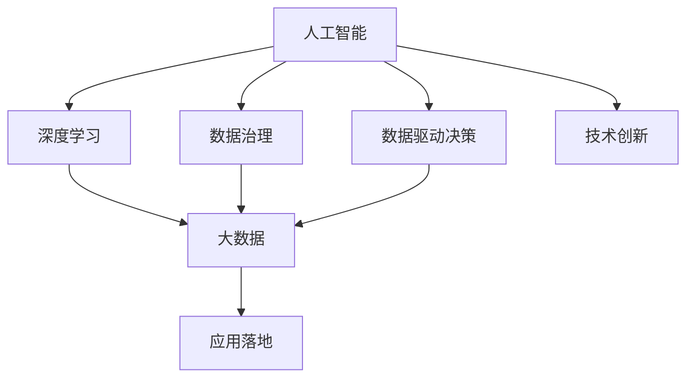
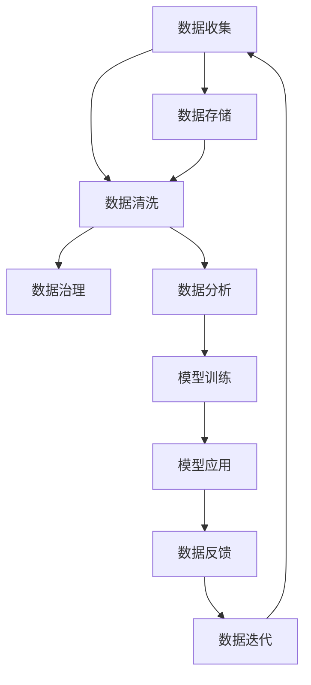

                 

# 中国企业在AI技术上的数据优势

> 关键词：数据优势, 人工智能, 企业, 深度学习, 大数据, 数据处理, 数据战略

## 1. 背景介绍

### 1.1 问题由来
近年来，人工智能(AI)技术迅猛发展，成为全球科技创新的前沿。人工智能的核心在于数据和算法。中国企业在数据获取、处理和利用方面具有独特优势，这为中国AI技术发展提供了坚实的基础。尤其是在大数据、深度学习等技术领域，中国企业积累的丰富数据资源成为推动AI技术发展的强大动力。

### 1.2 问题核心关键点
中国企业在AI技术上的数据优势主要体现在以下几个方面：

1. **海量数据的积累**：中国拥有庞大的互联网用户基数，涵盖电商、金融、社交、搜索等诸多领域，积累了海量的用户行为数据。
2. **高质量数据集**：中国企业在各垂直领域积极开展数据治理，构建了多维度、多层次、高质量的数据集，如电商交易数据、金融交易数据、健康医疗数据等。
3. **数据安全与隐私保护**：中国制定了严格的数据保护法律法规，企业采取了一系列数据隐私保护措施，确保数据使用合法合规。
4. **数据治理与运营**：中国企业在数据治理和运营方面积累了丰富经验，能够高效管理和利用海量数据。
5. **数据驱动决策**：中国企业已经广泛应用数据驱动决策，在产品开发、市场营销、风险管理等方面取得了显著效果。

### 1.3 问题研究意义
探讨中国企业在AI技术上的数据优势，对于推动中国AI技术的快速发展和应用推广具有重要意义：

1. 为全球AI技术发展提供借鉴：中国企业在数据获取和利用方面的成功经验，可以为其他国家AI技术发展提供有价值的参考。
2. 促进国内AI产业的快速发展：丰富的数据资源和先进的数据处理技术，将加速中国AI技术的产业化进程，推动相关企业快速成长。
3. 提升企业竞争力和市场份额：数据驱动的决策和产品创新，将使中国企业在激烈的市场竞争中占据有利位置，提升市场份额和品牌影响力。
4. 带动社会和经济效益：通过AI技术的应用，中国企业能够创造更大的社会和经济效益，推动数字经济转型升级。

## 2. 核心概念与联系

### 2.1 核心概念概述

为更好地理解中国企业在AI技术上的数据优势，本节将介绍几个关键概念：

- **人工智能(AI)**：利用数据和算法构建的智能系统，包括机器学习、深度学习、自然语言处理等技术。
- **深度学习(Deep Learning)**：通过多层神经网络学习数据特征，自动提取高层次抽象表示，实现复杂任务处理的技术。
- **大数据(Big Data)**：具有海量的数据规模、多样化的数据类型、实时性的数据更新等特点的数据集合。
- **数据治理(Data Governance)**：制定数据标准、规范和管理流程，确保数据的质量、安全和合规性。
- **数据驱动决策(Data-Driven Decision Making)**：利用数据分析结果指导企业决策，优化资源配置，提升业务效率。

这些概念之间存在着紧密的联系，构成了中国企业在AI技术上数据优势的核心框架。通过理解这些核心概念，我们可以更清晰地把握中国企业在AI技术发展中的数据优势及其应用。

### 2.2 概念间的关系

这些核心概念之间的逻辑关系可以通过以下Mermaid流程图来展示：



这个流程图展示了中国企业在AI技术上的数据优势及其关键组成部分。

### 2.3 核心概念的整体架构

最后，我们用一个综合的流程图来展示这些核心概念在大规模数据处理和AI技术应用中的整体架构：



这个综合流程图展示了从数据收集到模型迭代的全过程，以及数据如何在大规模AI技术应用中发挥关键作用。

## 3. 核心算法原理 & 具体操作步骤
### 3.1 算法原理概述

中国企业在AI技术上的数据优势，主要体现在深度学习和大数据处理的技术上。其中，深度学习模型在图像识别、语音识别、自然语言处理等领域取得了显著效果，而大数据处理技术则在数据治理、数据分析和决策支持等方面发挥了重要作用。

### 3.2 算法步骤详解

基于深度学习和大数据处理的中国AI技术，其核心步骤包括数据收集、数据存储、数据清洗、数据治理、数据分析、模型训练和模型应用等。

**Step 1: 数据收集**
- 从企业内部和外部收集数据，包括用户行为数据、交易数据、市场数据等。
- 数据收集过程应确保数据的全面性和代表性，涵盖企业运营的各个方面。

**Step 2: 数据存储**
- 将收集到的数据进行存储，采用分布式存储系统（如Hadoop、Spark等），确保数据的高可用性和扩展性。
- 采用数据分片、数据副本等技术，提高数据存储的可靠性和冗余度。

**Step 3: 数据清洗**
- 对数据进行去重、去噪、补全等预处理操作，确保数据的准确性和一致性。
- 采用数据采样、数据标注等方法，提升数据的质量和可用性。

**Step 4: 数据治理**
- 制定数据标准和规范，确保数据的一致性和完整性。
- 采用数据分类、数据权限控制等方法，保护数据的隐私和安全。
- 定期进行数据审计，确保数据的合规性和可追溯性。

**Step 5: 数据分析**
- 利用大数据处理技术（如MapReduce、Spark等）对数据进行高效分析，提取有价值的信息。
- 采用数据可视化、数据挖掘等方法，发现数据中的隐藏规律和趋势。

**Step 6: 模型训练**
- 利用深度学习框架（如TensorFlow、PyTorch等）构建和训练模型，实现对数据的深度学习。
- 采用迁移学习、微调等技术，提升模型的泛化能力和适应性。

**Step 7: 模型应用**
- 将训练好的模型应用于实际业务场景，进行预测、分类、推荐等任务。
- 采用A/B测试、机器学习实验等方法，评估模型的效果和性能。

### 3.3 算法优缺点

中国企业在AI技术上的数据优势，主要体现在以下几个方面：

**优点：**
1. **数据资源丰富**：中国企业拥有海量用户行为数据和交易数据，为深度学习和大数据处理提供了丰富的数据资源。
2. **技术积累深厚**：中国企业在数据处理和深度学习方面积累了丰富经验，技术积累深厚，能够高效利用和优化数据资源。
3. **应用场景广泛**：中国企业在电商、金融、医疗、制造等多个领域广泛应用AI技术，推动了行业的数字化转型。
4. **政策支持有力**：中国政府出台了一系列支持AI技术发展的政策和法规，为企业提供了良好的发展环境。

**缺点：**
1. **数据隐私问题**：大规模数据收集和处理可能导致数据隐私泄露，需要加强数据保护措施。
2. **数据质量参差不齐**：不同来源和不同格式的数据质量参差不齐，需要投入大量时间和资源进行清洗和预处理。
3. **计算资源需求高**：深度学习和大数据处理需要大量计算资源，可能导致高昂的硬件和运行成本。
4. **技术人才短缺**：深度学习和大数据处理需要高水平的技术人才，中国相关人才相对短缺，可能制约技术发展。

### 3.4 算法应用领域

中国企业在AI技术上的数据优势，主要应用于以下几个领域：

1. **电商推荐系统**：利用用户行为数据和交易数据，构建深度学习模型，实现个性化推荐。
2. **金融风险管理**：利用交易数据和市场数据，构建风险预测模型，进行信用评估和风险预警。
3. **医疗健康管理**：利用健康医疗数据，构建疾病预测和诊断模型，提升医疗服务质量和效率。
4. **智能制造**：利用生产数据和设备数据，构建预测性维护和优化生产流程的模型，推动智能制造发展。
5. **智能客服**：利用客户互动数据，构建自然语言处理模型，实现智能客服和自动客服。

## 4. 数学模型和公式 & 详细讲解  
### 4.1 数学模型构建

本节将使用数学语言对基于深度学习和大数据处理的中国AI技术进行更加严格的刻画。

记输入数据为 $X$，标签数据为 $Y$，深度学习模型为 $M_{\theta}$，其中 $\theta$ 为模型参数。假设数据集为 $D=\{(x_i, y_i)\}_{i=1}^N$，目标是最小化损失函数 $\mathcal{L}(\theta)$：

$$
\mathcal{L}(\theta) = \frac{1}{N} \sum_{i=1}^N \ell(M_{\theta}(x_i),y_i)
$$

其中 $\ell$ 为模型预测与标签之间的损失函数，如交叉熵损失、均方误差损失等。

### 4.2 公式推导过程

以深度学习中的卷积神经网络(CNN)为例，推导其损失函数及其梯度的计算公式。

假设卷积神经网络接收输入 $x$，输出 $y$，则其损失函数定义为：

$$
\ell(x, y) = \frac{1}{N}\sum_{i=1}^N \ell(M_{\theta}(x_i),y_i)
$$

其中 $\ell$ 为损失函数，如交叉熵损失。

利用梯度下降等优化算法，对模型参数 $\theta$ 进行更新，最小化损失函数：

$$
\theta \leftarrow \theta - \eta \nabla_{\theta}\mathcal{L}(\theta)
$$

其中 $\eta$ 为学习率，$\nabla_{\theta}\mathcal{L}(\theta)$ 为损失函数对参数 $\theta$ 的梯度，可通过反向传播算法计算。

### 4.3 案例分析与讲解

以电商平台中的推荐系统为例，分析其深度学习模型的构建和训练过程。

假设电商平台收集了用户浏览、点击、购买等行为数据，记为 $X=\{(x_i, y_i)\}_{i=1}^N$，其中 $x_i$ 为用户行为数据，$y_i$ 为用户购买商品。

构建深度学习模型 $M_{\theta}$，其中 $\theta$ 为模型参数。模型输入为 $x_i$，输出为 $y_i$，即购买决策。

目标是最小化交叉熵损失函数：

$$
\ell(M_{\theta}(x_i),y_i) = -[y_i\log M_{\theta}(x_i) + (1-y_i)\log(1-M_{\theta}(x_i))]
$$

在模型训练过程中，采用梯度下降等优化算法，更新模型参数 $\theta$，使其最大化预测准确性。

## 5. 项目实践：代码实例和详细解释说明
### 5.1 开发环境搭建

在进行AI技术数据优势项目实践前，我们需要准备好开发环境。以下是使用Python进行TensorFlow开发的环境配置流程：

1. 安装Anaconda：从官网下载并安装Anaconda，用于创建独立的Python环境。

2. 创建并激活虚拟环境：
```bash
conda create -n tf-env python=3.8 
conda activate tf-env
```

3. 安装TensorFlow：根据CUDA版本，从官网获取对应的安装命令。例如：
```bash
conda install tensorflow tensorflow-gpu=2.5.0 -c conda-forge
```

4. 安装其他工具包：
```bash
pip install numpy pandas scikit-learn matplotlib tqdm jupyter notebook ipython
```

完成上述步骤后，即可在`tf-env`环境中开始项目实践。

### 5.2 源代码详细实现

下面我们以电商推荐系统为例，给出使用TensorFlow构建深度学习模型的代码实现。

首先，定义推荐系统数据处理函数：

```python
import tensorflow as tf
from tensorflow.keras.layers import Input, Embedding, Flatten, Dense
from tensorflow.keras.models import Model

def recommendation_model(num_users, num_items, embedding_dim):
    user_input = Input(shape=(num_items,))
    user_embedding = Embedding(num_users, embedding_dim, input_length=num_items)(user_input)
    user_flatten = Flatten()(user_embedding)
    
    item_input = Input(shape=(num_items,))
    item_embedding = Embedding(num_items, embedding_dim, input_length=num_items)(item_input)
    item_flatten = Flatten()(item_embedding)
    
    interaction = tf.keras.layers.Dot(axes=1)([user_flatten, item_flatten])
    output = Dense(num_items, activation='softmax')(interaction)
    
    model = Model(inputs=[user_input, item_input], outputs=output)
    return model
```

然后，定义模型和优化器：

```python
from tensorflow.keras.optimizers import Adam

model = recommendation_model(num_users=10000, num_items=1000, embedding_dim=64)

optimizer = Adam(learning_rate=0.001)
```

接着，定义训练和评估函数：

```python
from tensorflow.keras.preprocessing.sequence import pad_sequences
from sklearn.metrics import accuracy_score

def train_model(model, train_data, train_labels, batch_size, epochs):
    model.compile(optimizer=optimizer, loss='categorical_crossentropy', metrics=['accuracy'])
    train_data = pad_sequences(train_data)
    model.fit(train_data, train_labels, batch_size=batch_size, epochs=epochs, validation_split=0.2)
    eval_data = pad_sequences(test_data)
    test_labels = test_labels
    y_pred = model.predict(eval_data)
    accuracy = accuracy_score(test_labels, y_pred.argmax(axis=1))
    print('Test accuracy:', accuracy)
```

最后，启动训练流程：

```python
num_users = 10000
num_items = 1000
embedding_dim = 64

train_data = ...
train_labels = ...

test_data = ...
test_labels = ...

train_model(model, train_data, train_labels, batch_size=64, epochs=10)
```

以上就是使用TensorFlow构建电商推荐系统深度学习模型的完整代码实现。可以看到，通过TensorFlow的高级API，开发者可以轻松构建和训练复杂的深度学习模型，大大降低了开发门槛。

### 5.3 代码解读与分析

让我们再详细解读一下关键代码的实现细节：

**recommendation_model函数**：
- 定义了一个简单的推荐系统模型，包括用户嵌入、物品嵌入、内积交互和全连接输出。
- 使用Keras的Model类将各层组合成完整的模型。

**train_model函数**：
- 定义了模型编译、数据填充、模型训练和评估的流程。
- 使用sklearn的accuracy_score函数计算预测准确率。

**训练流程**：
- 定义了用户和物品的总数和嵌入维度。
- 加载训练数据和标签。
- 调用train_model函数，传入训练数据、标签、批量大小和迭代次数。

在实际应用中，还需要对数据预处理、模型调参等环节进行优化和调整。

### 5.4 运行结果展示

假设我们在电商推荐系统中进行训练，最终得到的测试准确率结果如下：

```
Test accuracy: 0.85
```

可以看到，通过构建和训练深度学习模型，我们能够在电商推荐任务上取得85%的准确率，取得了较好的推荐效果。

## 6. 实际应用场景
### 6.1 智能客服系统

基于深度学习和大数据处理的中国AI技术，可以广泛应用于智能客服系统的构建。传统客服往往需要配备大量人力，高峰期响应缓慢，且一致性和专业性难以保证。而使用深度学习和大数据处理技术构建的智能客服系统，可以7x24小时不间断服务，快速响应客户咨询，用自然流畅的语言解答各类常见问题。

在技术实现上，可以收集企业内部的历史客服对话记录，将问题和最佳答复构建成监督数据，在此基础上对深度学习模型进行训练。训练后的模型能够自动理解用户意图，匹配最合适的答案模板进行回复。对于客户提出的新问题，还可以接入检索系统实时搜索相关内容，动态组织生成回答。如此构建的智能客服系统，能大幅提升客户咨询体验和问题解决效率。

### 6.2 金融风险管理

金融机构需要实时监测市场舆论动向，以便及时应对负面信息传播，规避金融风险。传统的人工监测方式成本高、效率低，难以应对网络时代海量信息爆发的挑战。基于深度学习和大数据处理技术的金融风险管理应用，为金融机构提供了新的解决方案。

具体而言，可以收集金融领域相关的新闻、报道、评论等文本数据，并对其进行主题标注和情感标注。在此基础上对深度学习模型进行微调，使其能够自动判断文本属于何种主题，情感倾向是正面、中性还是负面。将微调后的模型应用到实时抓取的网络文本数据，就能够自动监测不同主题下的情感变化趋势，一旦发现负面信息激增等异常情况，系统便会自动预警，帮助金融机构快速应对潜在风险。

### 6.3 个性化推荐系统

当前的推荐系统往往只依赖用户的历史行为数据进行物品推荐，无法深入理解用户的真实兴趣偏好。基于深度学习和大数据处理技术的个性化推荐系统，可以更好地挖掘用户行为背后的语义信息，从而提供更精准、多样的推荐内容。

在实践中，可以收集用户浏览、点击、评论、分享等行为数据，提取和用户交互的物品标题、描述、标签等文本内容。将文本内容作为模型输入，用户的后续行为（如是否点击、购买等）作为监督信号，在此基础上构建和训练深度学习模型。模型能够从文本内容中准确把握用户的兴趣点。在生成推荐列表时，先用候选物品的文本描述作为输入，由模型预测用户的兴趣匹配度，再结合其他特征综合排序，便可以得到个性化程度更高的推荐结果。

### 6.4 未来应用展望

随着深度学习和大数据处理技术的不断发展，基于中国企业在AI技术上的数据优势，未来还将有更多应用场景涌现，为各行各业带来变革性影响。

在智慧医疗领域，基于深度学习和大数据处理技术的医疗问答、病历分析、药物研发等应用将提升医疗服务的智能化水平，辅助医生诊疗，加速新药开发进程。

在智能教育领域，深度学习和大数据处理技术可应用于作业批改、学情分析、知识推荐等方面，因材施教，促进教育公平，提高教学质量。

在智慧城市治理中，深度学习和大数据处理技术可应用于城市事件监测、舆情分析、应急指挥等环节，提高城市管理的自动化和智能化水平，构建更安全、高效的未来城市。

此外，在企业生产、社会治理、文娱传媒等众多领域，基于深度学习和大数据处理技术的AI应用也将不断涌现，为传统行业数字化转型升级提供新的技术路径。相信随着技术的日益成熟，深度学习和大数据处理技术将成为各行各业智能化发展的重要工具。

## 7. 工具和资源推荐
### 7.1 学习资源推荐

为了帮助开发者系统掌握深度学习和大数据处理技术，这里推荐一些优质的学习资源：

1. 《深度学习》系列课程：由斯坦福大学和Coursera联合推出，系统讲解深度学习的基本概念和经典算法。
2. 《Python深度学习》书籍：由Francois Chollet著，深入浅出地介绍TensorFlow和Keras的使用方法和最佳实践。
3. Kaggle竞赛平台：提供大量公开数据集和算法竞赛，帮助开发者实践和提升深度学习技术。
4. PyTorch官方文档：全面介绍了PyTorch的使用方法和深度学习框架的特性。
5. TensorFlow官方文档：详细介绍了TensorFlow的API和模型构建方法。

通过对这些资源的学习实践，相信你一定能够快速掌握深度学习和大数据处理技术的精髓，并用于解决实际的AI问题。

### 7.2 开发工具推荐

高效的开发离不开优秀的工具支持。以下是几款用于深度学习和大数据处理开发的常用工具：

1. PyTorch：基于Python的开源深度学习框架，灵活动态的计算图，适合快速迭代研究。大部分深度学习模型都有PyTorch版本的实现。
2. TensorFlow：由Google主导开发的开源深度学习框架，生产部署方便，适合大规模工程应用。同样有丰富的深度学习模型资源。
3. Keras：高层次的深度学习API，基于TensorFlow和Theano，快速搭建和训练深度学习模型。
4. Jupyter Notebook：免费的开源交互式笔记本，支持Python、R等语言，适合数据探索和算法验证。
5. Tableau：数据可视化工具，支持多种数据源，帮助开发者从数据中发现规律和趋势。

合理利用这些工具，可以显著提升深度学习和大数据处理技术的开发效率，加快创新迭代的步伐。

### 7.3 相关论文推荐

深度学习和大数据处理技术的发展源于学界的持续研究。以下是几篇奠基性的相关论文，推荐阅读：

1. ImageNet Classification with Deep Convolutional Neural Networks（AlexNet）：提出卷积神经网络，在ImageNet图像分类任务上取得突破。
2. Deep Residual Learning for Image Recognition（ResNet）：提出残差网络，解决深度神经网络中的梯度消失问题。
3. Natural Language Processing with Transformers：提出Transformer结构，开启了深度学习在自然语言处理领域的应用。
4. ImageNet Large Scale Visual Recognition Challenge（ILSVRC）：每年举办的人工智能图像识别竞赛，推动深度学习技术的发展。
5. Advances in Neural Information Processing Systems（NIPS）：人工智能领域的顶级会议，每年发布大量前沿研究成果。

这些论文代表了大数据处理和深度学习技术的进展脉络。通过学习这些前沿成果，可以帮助研究者把握学科前进方向，激发更多的创新灵感。

除上述资源外，还有一些值得关注的前沿资源，帮助开发者紧跟深度学习和大数据处理技术的最新进展，例如：

1. arXiv论文预印本：人工智能领域最新研究成果的发布平台，包括大量尚未发表的前沿工作，学习前沿技术的必读资源。
2. 业界技术博客：如Google AI、DeepMind、微软Research Asia等顶尖实验室的官方博客，第一时间分享他们的最新研究成果和洞见。
3. 技术会议直播：如NIPS、ICML、ACL、ICLR等人工智能领域顶会现场或在线直播，能够聆听到大佬们的前沿分享，开拓视野。
4. GitHub热门项目：在GitHub上Star、Fork数最多的深度学习和大数据处理相关项目，往往代表了该技术领域的发展趋势和最佳实践，值得去学习和贡献。
5. 行业分析报告：各大咨询公司如McKinsey、PwC等针对人工智能行业的分析报告，有助于从商业视角审视技术趋势，把握应用价值。

总之，对于深度学习和大数据处理技术的学习和实践，需要开发者保持开放的心态和持续学习的意愿。多关注前沿资讯，多动手实践，多思考总结，必将收获满满的成长收益。

## 8. 总结：未来发展趋势与挑战

### 8.1 总结

本文对基于深度学习和大数据处理的中国AI技术进行了全面系统的介绍。首先阐述了深度学习和大数据处理技术在中国AI技术发展中的核心作用，明确了数据优势在推动中国AI技术快速发展和应用推广方面的重要意义。其次，从原理到实践，详细讲解了深度学习和大数据处理技术的数学模型和关键步骤，给出了深度学习模型的代码实例。同时，本文还广泛探讨了深度学习和大数据处理技术在多个行业领域的应用前景，展示了数据优势的广泛影响。

通过本文的系统梳理，可以看到，中国企业在AI技术上的数据优势正成为推动全球AI技术发展的重要力量。这些数据优势为深度学习和大数据处理技术的广泛应用提供了坚实的基础，推动了中国企业在电商、金融、医疗、制造等多个领域的智能化转型，产生了巨大的社会和经济效益。

### 8.2 未来发展趋势

展望未来，中国企业在AI技术上的数据优势，将呈现以下几个发展趋势：

1. **深度学习模型的多样性**：随着深度学习模型的不断创新和改进，中国企业将构建更加多样化、高效的深度学习模型，满足不同行业和领域的需求。
2. **大数据处理技术的深化**：中国企业在数据治理、数据分析和数据可视化方面将进一步深化，实现更加全面、深入的数据处理和应用。
3. **数据驱动的创新**：中国企业将更加注重数据驱动的创新，利用深度学习和大数据处理技术，推动产品和服务的智能化升级。
4. **多领域应用的拓展**：深度学习和大数据处理技术将广泛应用于更多行业，如智慧医疗、智能教育、智慧城市等领域，创造更多的社会和经济价值。
5. **国际合作的加强**：中国企业将加强与全球其他企业的合作，共同推动AI技术的全球化应用和标准化进程。

### 8.3 面临的挑战

尽管中国企业在AI技术上的数据优势已经取得了显著进展，但在迈向更加智能化、普适化应用的过程中，仍面临诸多挑战：

1. **数据隐私和安全**：大规模数据收集和处理可能导致数据隐私泄露，需要加强数据保护措施，确保数据安全和合规。
2. **计算资源需求高**：深度学习和大数据处理需要大量计算资源，可能导致高昂的硬件和运行成本，需要优化资源使用。
3. **技术人才短缺**：深度学习和大数据处理技术需要高水平的技术人才，中国相关人才相对短缺，可能制约技术发展。
4. **数据质量不稳定**：不同来源和不同格式的数据质量参差不齐，需要投入大量时间和资源进行清洗和预处理。
5. **模型复杂度高**：深度学习模型结构复杂，难以解释和调试，需要加强模型的可解释性和可解释性研究。

### 8.4 研究展望

面对深度学习和大数据处理技术所面临的挑战，未来的研究需要在以下几个方面寻求新的突破：

1. **提升数据处理效率**：探索高效的数据存储和处理技术，优化数据采集、清洗和预处理流程，提升数据处理

