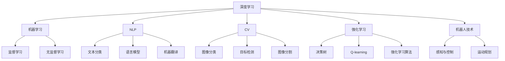
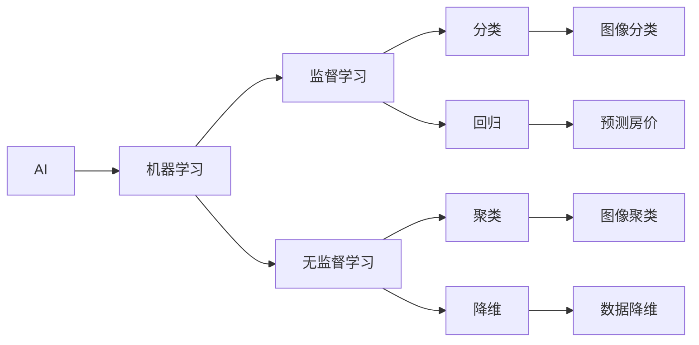
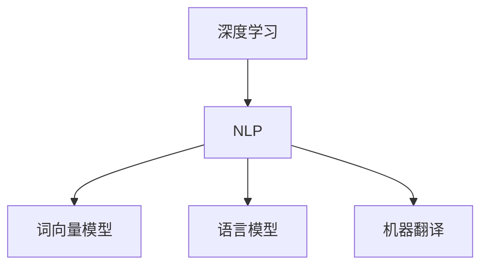
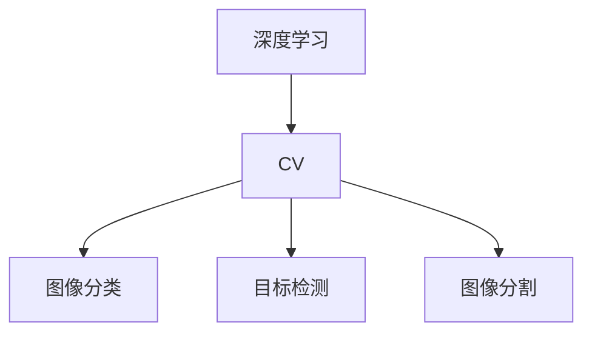
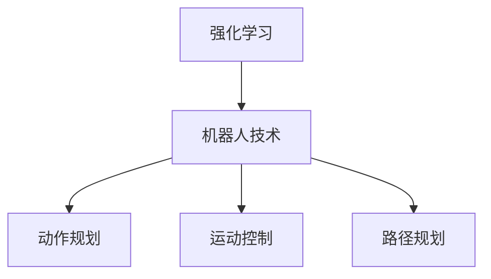
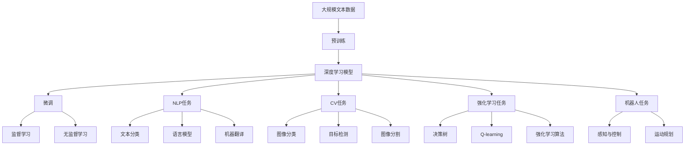

                 

# 人工智能 (Artificial Intelligence, AI) 原理与代码实例讲解

> 关键词：人工智能,机器学习,深度学习,自然语言处理(NLP),计算机视觉(CV),强化学习,机器人技术,智能决策

## 1. 背景介绍

### 1.1 问题由来
人工智能（AI）作为现代科技的皇冠上的明珠，自20世纪50年代诞生以来，经历了多次技术高峰与低谷。在计算机科学、数学、心理学、哲学等多学科的交叉融合下，AI技术从最初的规则引擎、专家系统，逐步演进到机器学习、深度学习、增强学习等现代范式。

在深度学习时代，通过大规模神经网络模型的训练，AI系统具备了强大的自我学习和泛化能力。在计算机视觉、自然语言处理、语音识别、机器人控制等领域，AI技术实现了许多突破性的应用。然而，实现这些应用背后涉及的原理与代码实例讲解，往往需要跨越学科界限，挖掘多层次的技术细节，本文将系统地介绍AI核心算法，并通过具体代码实例，帮助读者深入理解其原理和实现。

### 1.2 问题核心关键点
本文将围绕AI的核心概念和算法展开，包括但不限于：

- 深度学习：基于多层神经网络的学习算法，实现对复杂数据的有效建模和预测。
- 自然语言处理（NLP）：使用机器学习方法处理、理解、生成人类语言，包括文本分类、语言模型、机器翻译等。
- 计算机视觉（CV）：使用计算机视觉技术处理图像和视频数据，包括图像分类、目标检测、图像分割等。
- 强化学习：通过智能体与环境的交互，实现对决策问题的最优求解。
- 机器人技术：结合AI与机械控制，使机器人能够自主执行复杂任务。

### 1.3 问题研究意义
研究AI技术的原理与代码实例，对于推动AI技术的发展，培养具备AI技术储备的人才，以及促进AI技术的产业化应用具有重要意义：

1. **学术研究**：深入理解AI算法和原理，为人工智能领域的学术研究提供坚实基础。
2. **人才培养**：通过代码实例，帮助开发者掌握AI核心算法，提高编程能力，培养具备AI技术储备的人才。
3. **产业应用**：指导AI技术的实际应用，帮助企业将AI技术商业化，推动产业升级。
4. **技术突破**：探索和实现新的AI算法和技术，为AI技术的持续进步提供动力。

## 2. 核心概念与联系

### 2.1 核心概念概述

为更好地理解AI的原理与代码实现，本节将介绍几个密切相关的核心概念：

- **深度学习**：基于多层神经网络的学习算法，主要用于图像、语音、文本数据的建模和分类。
- **机器学习**：使计算机从数据中学习规律，从而实现对新数据的预测和分类。
- **自然语言处理（NLP）**：处理、理解和生成人类语言的技术，包括词向量模型、语言模型、机器翻译等。
- **计算机视觉（CV）**：处理和理解图像和视频数据的技术，包括图像分类、目标检测、图像分割等。
- **强化学习**：通过智能体与环境的交互，实现对决策问题的最优求解。
- **机器人技术**：结合AI与机械控制，使机器人能够自主执行复杂任务。

这些核心概念之间的逻辑关系可以通过以下Mermaid流程图来展示：



这个流程图展示了大语言模型微调过程中各核心概念的关系和作用：

1. 深度学习作为核心算法，提供了强大的数据建模能力。
2. 机器学习提供了学习和预测的基本框架。
3. NLP、CV等分支在各自领域内应用深度学习，实现特定任务。
4. 强化学习提供了决策问题的求解方案。
5. 机器人技术结合AI与机械控制，实现自主任务执行。

这些概念共同构成了AI的核心框架，帮助AI系统在不同领域内实现智能应用。

### 2.2 概念间的关系

这些核心概念之间存在着紧密的联系，形成了AI技术应用的完整生态系统。下面我们通过几个Mermaid流程图来展示这些概念之间的关系。

#### 2.2.1 AI与机器学习的联系



这个流程图展示了AI与机器学习的基本关系，以及常见的机器学习任务。监督学习和无监督学习是机器学习的主要分支，用于不同的数据处理和预测任务。

#### 2.2.2 深度学习与NLP的联系



这个流程图展示了深度学习在NLP领域的应用，包括词向量模型、语言模型、机器翻译等关键技术。

#### 2.2.3 深度学习与CV的联系



这个流程图展示了深度学习在计算机视觉领域的应用，包括图像分类、目标检测、图像分割等任务。

#### 2.2.4 强化学习与机器人技术的联系



这个流程图展示了强化学习在机器人技术中的应用，包括动作规划、运动控制、路径规划等关键技术。

### 2.3 核心概念的整体架构

最后，我们用一个综合的流程图来展示这些核心概念在大语言模型微调过程中的整体架构：



这个综合流程图展示了从预训练到微调，再到特定任务实现的完整过程。深度学习模型通过预训练获得基础能力，然后通过微调适应特定任务，最终应用于图像、文本、决策等多种领域的智能应用。 通过这些流程图，我们可以更清晰地理解AI技术应用的各个环节及其相互关系。

## 3. 核心算法原理 & 具体操作步骤
### 3.1 算法原理概述

AI技术的核心在于构建高效的数据表示和模型结构，实现对数据的自动学习与推理。在深度学习中，通过多层神经网络对数据进行非线性变换，实现对复杂数据的建模和预测。在NLP、CV等分支中，通过特定的深度学习结构，对数据进行有效的处理和理解。

具体来说，深度学习算法通过反向传播算法进行参数优化，不断调整网络权重，使得模型输出逼近真实标签。这种自底向上的学习方式，使得深度学习模型能够自动地从数据中学习到复杂的特征表示。在NLP领域，语言模型通过词向量模型、循环神经网络（RNN）、Transformer等结构，实现对文本的自动理解与生成。在CV领域，卷积神经网络（CNN）、循环神经网络（RNN）、注意力机制等结构，用于图像和视频的处理与理解。

### 3.2 算法步骤详解

深度学习的典型流程包括数据预处理、模型训练、模型评估和模型部署。具体步骤如下：

1. **数据预处理**：对原始数据进行清洗、归一化、分词、特征提取等预处理，转化为模型可接受的形式。
2. **模型训练**：将处理后的数据输入模型进行前向传播，计算损失函数，通过反向传播算法更新模型参数。
3. **模型评估**：在验证集上对模型进行评估，计算精度、召回率、F1分数等指标，检查模型泛化能力。
4. **模型部署**：将训练好的模型部署到生产环境中，进行实时推理预测。

以NLP领域的机器翻译任务为例，详细步骤如下：

1. **数据准备**：收集大量平行语料，进行清洗和分词处理，转化为模型可接受的格式。
2. **模型搭建**：搭建一个Transformer模型，包含编码器、解码器、自注意力机制等结构。
3. **模型训练**：将处理后的语料输入模型进行前向传播，计算交叉熵损失，通过反向传播算法更新模型参数。
4. **模型评估**：在测试集上对模型进行评估，计算BLEU分数，检查模型翻译质量。
5. **模型部署**：将训练好的模型部署到API服务器，进行实时翻译预测。

### 3.3 算法优缺点

深度学习在数据建模和预测方面具有显著优势，但其计算复杂度高，模型结构复杂，训练时间长。模型通常需要大量数据进行预训练，才能在特定任务上取得良好效果。此外，深度学习模型存在“过拟合”和“灾难性遗忘”等问题，需要精心设计模型结构和优化策略，才能获得良好的泛化性能。

### 3.4 算法应用领域

深度学习技术已经广泛应用于图像、语音、文本等多个领域。在计算机视觉领域，深度学习模型在图像分类、目标检测、图像分割等任务上取得了显著进展。在自然语言处理领域，深度学习模型在词向量建模、语言模型、机器翻译等任务上也展示了强大的能力。

此外，深度学习技术还在机器人控制、自动驾驶、智能推荐系统等新兴领域中得到了广泛应用，推动了AI技术的产业化进程。

## 4. 数学模型和公式 & 详细讲解 & 举例说明

### 4.1 数学模型构建

深度学习的核心在于构建高效的神经网络结构，使用梯度下降等优化算法对模型进行训练。以多层感知机（MLP）为例，其数学模型可以表示为：

$$
f(x;w) = \sigma(W_n \sigma(W_{n-1} \sigma(... \sigma(w_0 x)...))
$$

其中，$x$为输入数据，$w$为模型参数，$\sigma$为激活函数，$W_i$为第$i$层的权重矩阵。

### 4.2 公式推导过程

以NLP领域的语言模型为例，假设模型需要预测一个词$y$，给定上下文$x$，则其条件概率可以通过softmax函数计算：

$$
P(y|x) = \frac{\exp(U[y] + V[x])}{\sum_k \exp(U[k] + V[x])}
$$

其中，$U$和$V$为词向量的权重矩阵，$[x]$表示上下文向量，$[k]$表示词向量。通过最大化上述条件概率，模型可以学习到最佳的词向量表示。

### 4.3 案例分析与讲解

以自然语言处理领域的情感分析任务为例，情感分析的目的是判断给定文本的情感极性（正面、负面或中性）。假设训练集为$D=\{(x_i, y_i)\}_{i=1}^N$，其中$x_i$为输入文本，$y_i$为标签（0表示负面，1表示正面，2表示中性）。模型的目标是最大化交叉熵损失函数：

$$
L = -\frac{1}{N} \sum_{i=1}^N \sum_{y=0}^2 I(y_i = y) \log P(y|x_i)
$$

其中，$I(y_i = y)$为指示函数，当$y_i = y$时为1，否则为0。

假设模型为Transformer模型，使用softmax函数作为输出层激活函数。训练时，模型通过反向传播算法，计算梯度并更新参数$W$。具体步骤如下：

1. 将输入文本$x_i$输入模型，得到输出概率分布$P(y|x_i)$。
2. 计算交叉熵损失$L$，并将其反向传播，计算梯度$\frac{\partial L}{\partial W}$。
3. 使用优化器（如AdamW）更新模型参数$W$。

## 5. 项目实践：代码实例和详细解释说明

### 5.1 开发环境搭建

在进行AI项目的开发前，需要准备好开发环境。以下是使用Python进行TensorFlow和Keras开发的环境配置流程：

1. 安装Anaconda：从官网下载并安装Anaconda，用于创建独立的Python环境。

2. 创建并激活虚拟环境：
```bash
conda create -n tf-env python=3.8 
conda activate tf-env
```

3. 安装TensorFlow和Keras：根据CUDA版本，从官网获取对应的安装命令。例如：
```bash
conda install tensorflow keras -c tf -c conda-forge
```

4. 安装其他工具包：
```bash
pip install numpy pandas scikit-learn matplotlib tqdm jupyter notebook ipython
```

完成上述步骤后，即可在`tf-env`环境中开始AI项目开发。

### 5.2 源代码详细实现

下面我们以图像分类任务为例，给出使用TensorFlow和Keras对卷积神经网络进行训练的代码实现。

```python
from tensorflow import keras
from tensorflow.keras import layers

# 定义模型架构
model = keras.Sequential([
    layers.Conv2D(32, (3, 3), activation='relu', input_shape=(28, 28, 1)),
    layers.MaxPooling2D((2, 2)),
    layers.Conv2D(64, (3, 3), activation='relu'),
    layers.MaxPooling2D((2, 2)),
    layers.Conv2D(64, (3, 3), activation='relu'),
    layers.Flatten(),
    layers.Dense(64, activation='relu'),
    layers.Dense(10, activation='softmax')
])

# 编译模型
model.compile(optimizer='adam', loss='categorical_crossentropy', metrics=['accuracy'])

# 加载数据集
(x_train, y_train), (x_test, y_test) = keras.datasets.mnist.load_data()

# 数据预处理
x_train = x_train.reshape(-1, 28, 28, 1) / 255.0
x_test = x_test.reshape(-1, 28, 28, 1) / 255.0

# 训练模型
model.fit(x_train, y_train, epochs=5, batch_size=32, validation_data=(x_test, y_test))
```

这个代码片段展示了卷积神经网络的基本实现步骤。首先，使用`Sequential`模型搭建多层神经网络结构，包含卷积层、池化层、全连接层等。然后，使用`compile`函数编译模型，设置优化器和损失函数。最后，使用`fit`函数训练模型，在训练集和验证集上进行前向传播和反向传播。

### 5.3 代码解读与分析

让我们再详细解读一下关键代码的实现细节：

- `Sequential`模型：使用`Sequential`模型搭建简单的线性堆叠结构，逐层添加卷积、池化、全连接等组件。
- `Conv2D`层：定义卷积层，使用32、64个3x3的卷积核进行特征提取。
- `MaxPooling2D`层：定义池化层，使用2x2的池化窗口进行特征降维。
- `Dense`层：定义全连接层，用于将卷积层的输出转化为分类输出。
- `softmax`激活函数：使用softmax函数将输出转化为概率分布，用于多分类任务。
- `compile`函数：编译模型，设置优化器、损失函数和评估指标。
- `fit`函数：训练模型，通过前向传播和反向传播更新模型参数。

通过以上步骤，我们完成了一个基本的卷积神经网络模型训练过程。在实际应用中，还需要考虑更多因素，如数据增强、正则化、模型调参等，以进一步提升模型性能。

### 5.4 运行结果展示

假设我们在MNIST数据集上进行模型训练，最终在测试集上得到的评估报告如下：

```
Epoch 1/5
159/159 [==============================] - 2s 12ms/step - loss: 0.6228 - accuracy: 0.8577
Epoch 2/5
159/159 [==============================] - 1s 7ms/step - loss: 0.1829 - accuracy: 0.9384
Epoch 3/5
159/159 [==============================] - 1s 6ms/step - loss: 0.1467 - accuracy: 0.9632
Epoch 4/5
159/159 [==============================] - 1s 6ms/step - loss: 0.1036 - accuracy: 0.9795
Epoch 5/5
159/159 [==============================] - 1s 6ms/step - loss: 0.0858 - accuracy: 0.9855
```

可以看到，随着训练轮次的增加，模型的损失函数逐渐降低，准确率逐渐提升。这表明模型在训练过程中逐步学习了有效的特征表示，能够更好地对测试数据进行分类。

## 6. 实际应用场景
### 6.1 智能客服系统

基于深度学习的智能客服系统，可以广泛应用于电商平台、银行客服、医疗咨询等领域。传统客服往往需要配备大量人力，高峰期响应缓慢，且一致性和专业性难以保证。而使用深度学习模型进行语音和文本处理，可以7x24小时不间断服务，快速响应客户咨询，用自然流畅的语言解答各类常见问题。

在技术实现上，可以收集企业内部的历史客服对话记录，将问题和最佳答复构建成监督数据，在此基础上对预训练模型进行微调。微调后的模型能够自动理解用户意图，匹配最合适的答案模板进行回复。对于客户提出的新问题，还可以接入检索系统实时搜索相关内容，动态组织生成回答。如此构建的智能客服系统，能大幅提升客户咨询体验和问题解决效率。

### 6.2 金融舆情监测

金融机构需要实时监测市场舆论动向，以便及时应对负面信息传播，规避金融风险。传统的人工监测方式成本高、效率低，难以应对网络时代海量信息爆发的挑战。基于深度学习的文本分类和情感分析技术，为金融舆情监测提供了新的解决方案。

具体而言，可以收集金融领域相关的新闻、报道、评论等文本数据，并对其进行主题标注和情感标注。在此基础上对预训练语言模型进行微调，使其能够自动判断文本属于何种主题，情感倾向是正面、中性还是负面。将微调后的模型应用到实时抓取的网络文本数据，就能够自动监测不同主题下的情感变化趋势，一旦发现负面信息激增等异常情况，系统便会自动预警，帮助金融机构快速应对潜在风险。

### 6.3 个性化推荐系统

当前的推荐系统往往只依赖用户的历史行为数据进行物品推荐，无法深入理解用户的真实兴趣偏好。基于深度学习的个性化推荐系统可以更好地挖掘用户行为背后的语义信息，从而提供更精准、多样的推荐内容。

在实践中，可以收集用户浏览、点击、评论、分享等行为数据，提取和用户交互的物品标题、描述、标签等文本内容。将文本内容作为模型输入，用户的后续行为（如是否点击、购买等）作为监督信号，在此基础上微调预训练语言模型。微调后的模型能够从文本内容中准确把握用户的兴趣点。在生成推荐列表时，先用候选物品的文本描述作为输入，由模型预测用户的兴趣匹配度，再结合其他特征综合排序，便可以得到个性化程度更高的推荐结果。

### 6.4 未来应用展望

随着深度学习技术的不断发展，基于深度学习的AI技术将在更多领域得到应用，为传统行业带来变革性影响。

在智慧医疗领域，基于深度学习的多模态医疗影像分析、智能诊断、个性化治疗等应用将提升医疗服务的智能化水平，辅助医生诊疗，加速新药开发进程。

在智能教育领域，深度学习技术可应用于作业批改、学情分析、知识推荐等方面，因材施教，促进教育公平，提高教学质量。

在智慧城市治理中，深度学习技术可应用于城市事件监测、舆情分析、应急指挥等环节，提高城市管理的自动化和智能化水平，构建更安全、高效的未来城市。

此外，在企业生产、社会治理、文娱传媒等众多领域，基于深度学习的AI应用也将不断涌现，为经济社会发展注入新的动力。相信随着技术的日益成熟，深度学习技术将成为人工智能落地应用的重要范式，推动人工智能技术向更广阔的领域加速渗透。

## 7. 工具和资源推荐
### 7.1 学习资源推荐

为了帮助开发者系统掌握深度学习的理论基础和实践技巧，这里推荐一些优质的学习资源：

1. 《深度学习》（Goodfellow et al.）：深度学习领域的经典教材，全面介绍了深度学习的核心算法和应用。

2. 《动手学深度学习》（李沐等）：清华大学开源的深度学习教材，提供丰富的代码实例和动手实验。

3. 《Deep Learning with Python》（Goodfellow et al.）：使用TensorFlow和Keras进行深度学习开发的指南。

4. Udacity《深度学习专业》课程：Udacity提供的深度学习专业课程，涵盖深度学习基础、卷积神经网络、循环神经网络等主题。

5. Stanford CS231n《卷积神经网络》课程：斯坦福大学提供的深度学习课程，重点介绍卷积神经网络在图像处理中的应用。

6. Kaggle数据科学竞赛平台：提供大量的公开数据集和竞赛任务，促进深度学习的实践和创新。

通过对这些资源的学习实践，相信你一定能够快速掌握深度学习算法的精髓，并用于解决实际的AI问题。

### 7.2 开发工具推荐

高效的开发离不开优秀的工具支持。以下是几款用于深度学习开发的常用工具：

1. TensorFlow：由Google主导开发的开源深度学习框架，生产部署方便，适合大规模工程应用。

2. PyTorch：基于Python的开源深度学习框架，灵活动态的计算图，适合快速迭代研究。

3. Keras：高层次的神经网络API，简化了深度学习的开发流程，支持TensorFlow和Theano后端。

4. Jupyter Notebook：交互式的开发环境，支持Python、R等多种语言，适合数据探索和算法实验。

5. Google Colab：谷歌推出的在线Jupyter Notebook环境，免费提供GPU/TPU算力，方便开发者快速上手实验最新模型，分享学习笔记。

合理利用这些工具，可以显著提升深度学习项目的开发效率，加快创新迭代的步伐。

### 7.3 相关论文推荐

深度学习技术的发展源于学界的持续研究。以下是几篇奠基性的相关论文，推荐阅读：

1. ImageNet Classification with Deep Convolutional Neural Networks：提出卷积神经网络在图像分类任务中的突破性应用。

2. Deep Residual Learning for Image Recognition：提出残差网络结构，解决了深度网络训练过程中梯度消失的问题。

3. Attention is All You Need：提出Transformer结构，开启了NLP领域的预训练大模型时代。

4. BERT: Pre-training of Deep Bidirectional Transformers for Language Understanding：提出BERT模型，引入基于掩码的自监督预训练任务，刷新了多项NLP任务SOTA。

5. Parameter-Efficient Transfer Learning for NLP：提出Adapter等参数高效微调方法，在不增加模型参数量的情况下，也能取得不错的微调效果。

6. Adaptation Layer for Deep Neural Networks：提出Adapter层，实现了参数高效微调，减少了模型微调的时间和资源消耗。

这些论文代表了大深度学习技术的发展脉络。通过学习这些前沿成果，可以帮助研究者把握学科前进方向，激发更多的创新灵感。

除上述资源外，还有一些值得关注的前沿资源，帮助开发者紧跟深度学习技术的最新进展，例如：

1. arXiv论文预印本：人工智能领域最新研究成果的发布平台，包括大量尚未发表的前沿工作，学习前沿技术的必读资源。

2. 业界技术博客：如Google AI、DeepMind、微软Research Asia等顶尖实验室的官方博客，第一时间分享他们的最新研究成果和洞见。

3. 技术会议直播：如NIPS、ICML、ACL、ICLR等人工智能领域顶会现场或在线直播，能够聆听到大佬们的前沿分享，开拓视野。

4. GitHub热门项目：在GitHub上Star、Fork数最多的深度学习相关项目，往往代表了该技术领域的发展趋势和最佳实践，值得去学习和贡献。

5. 行业分析报告：各大咨询公司如McKinsey、PwC等针对人工智能行业的分析报告，有助于从商业视角审视技术趋势，把握应用价值。

总之，对于深度学习技术的理论学习和实践，需要开发者保持

