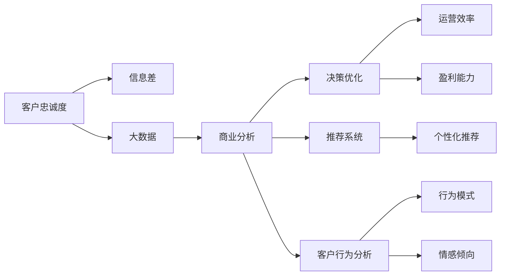
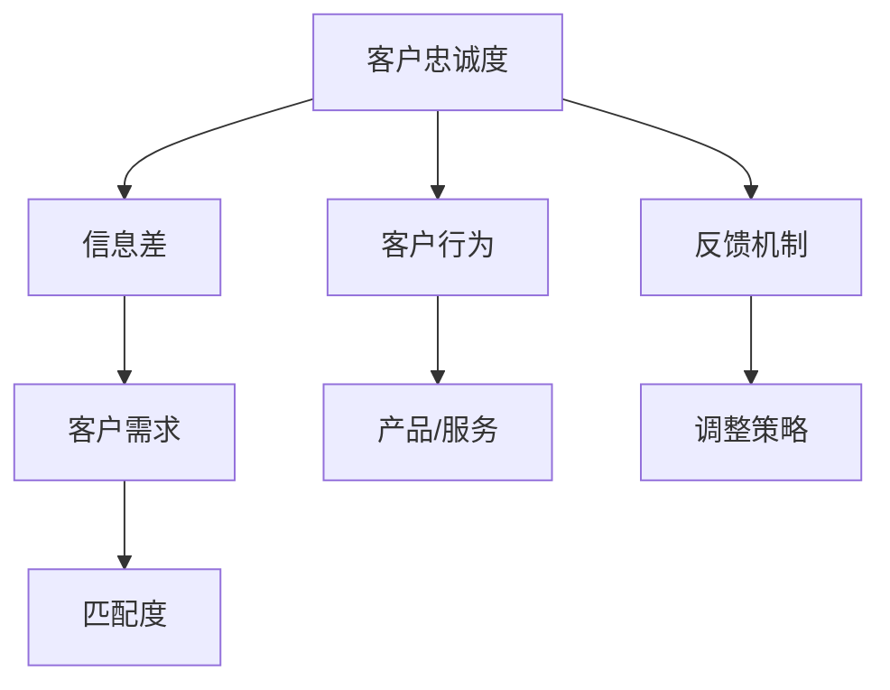
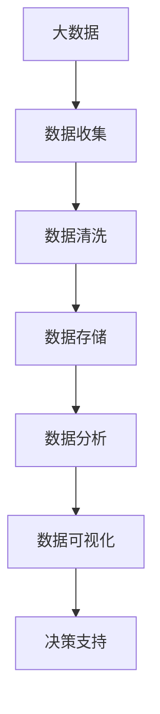
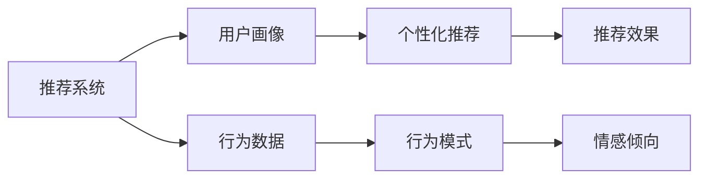
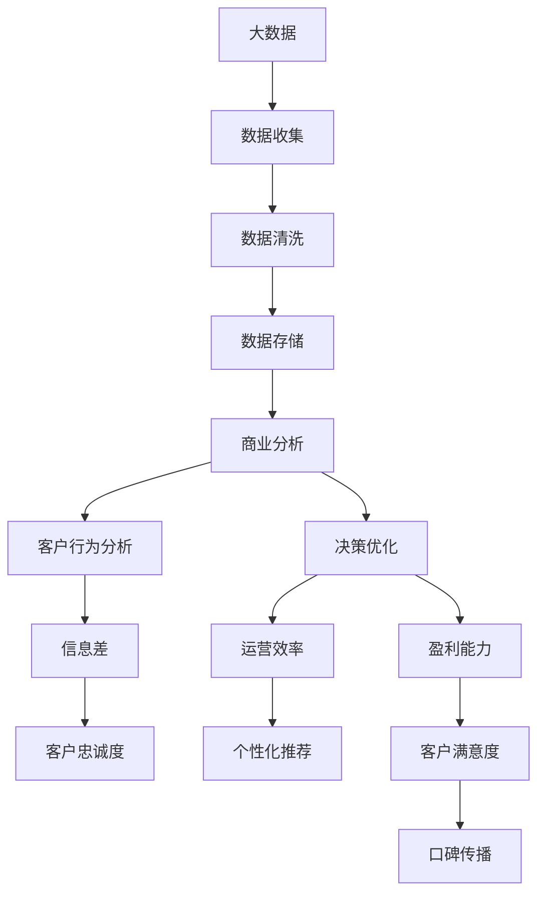

                 

# 信息差的商业客户忠诚度提升：大数据如何增强客户忠诚度

> 关键词：客户忠诚度,信息差,大数据,商业分析,决策优化,推荐系统,客户行为分析

## 1. 背景介绍

### 1.1 问题由来
在数字化转型的浪潮中，商业企业面临着越来越激烈的市场竞争。客户忠诚度的提升，对于企业的长期发展和盈利能力至关重要。然而，传统的人力统计、问卷调查等方法，不仅耗时耗力，且准确度有限，无法深入洞察客户真实需求和心理变化。

近年来，大数据技术的飞速发展，为商业企业提供了一个全新的视角和工具，通过深度分析和精准预测，可以更好地理解客户行为，并为其提供个性化的服务和产品，从而有效提升客户忠诚度。

### 1.2 问题核心关键点
信息差（Information Gap），即客户真实需求与企业提供的产品或服务之间的差距，是影响客户忠诚度的核心因素之一。在大数据时代，企业可以通过分析海量客户数据，洞察信息差，制定针对性的营销策略，缩小信息差，从而显著提升客户忠诚度。

具体而言，信息差的商业客户忠诚度提升主要包括以下几个关键点：

- 数据收集：通过各种在线和离线渠道收集客户数据，包括行为数据、交易数据、社交媒体数据等。
- 数据分析：利用大数据技术，如机器学习、深度学习等，对收集到的数据进行深度分析，挖掘客户行为模式和心理偏好。
- 客户画像：构建详细的客户画像，包括客户的基本信息、购买行为、消费偏好、心理特征等。
- 精准推荐：根据客户画像，利用推荐算法生成个性化推荐，满足客户个性化需求。
- 情感分析：分析客户的情感倾向，判断其满意度和忠诚度，从而制定相应的服务和营销策略。
- 持续优化：通过不断的收集、分析、优化，持续提升客户体验和忠诚度。

### 1.3 问题研究意义
通过大数据技术提升客户忠诚度，对于商业企业具有重要意义：

- 提高盈利能力：忠诚的客户往往更愿意重复购买，带来更高的 lifetime value (LTV)。
- 降低营销成本：忠诚客户对品牌有更强的信任感，营销投入更能转化为实际销售。
- 增强品牌竞争力：客户忠诚度高的企业更能吸引新客户，形成良性循环。
- 提高客户满意度：个性化的服务和产品能够更好地满足客户需求，提升客户满意度。
- 促进创新发展：客户忠诚度高的企业，往往更具创新精神，更能快速适应市场变化。

## 2. 核心概念与联系

### 2.1 核心概念概述

为更好地理解信息差的商业客户忠诚度提升方法，本节将介绍几个密切相关的核心概念：

- 客户忠诚度（Customer Loyalty）：指客户对企业的品牌、产品或服务的长期承诺和信赖。客户忠诚度高的客户，通常会重复购买、口碑传播，并且不易流失。
- 信息差（Information Gap）：指客户需求与企业产品或服务之间的差距。信息差的缩小是提升客户忠诚度的关键。
- 大数据（Big Data）：指规模庞大、类型丰富、来源广泛的数据集合，可以通过复杂的数据分析技术从中挖掘出有价值的信息。
- 商业分析（Business Analytics）：指利用数据挖掘、统计分析等方法，对商业数据进行分析，以提升业务决策水平。
- 推荐系统（Recommendation System）：指利用机器学习算法，为每个用户推荐个性化产品或服务，提升客户满意度和忠诚度。
- 客户行为分析（Customer Behavior Analysis）：指对客户的购买行为、使用习惯、情感倾向等进行分析，以洞察客户需求和行为模式。
- 决策优化（Decision Optimization）：指通过数据分析和模型优化，制定最优的商业决策，提升企业运营效率和盈利能力。

这些核心概念之间的逻辑关系可以通过以下Mermaid流程图来展示：



这个流程图展示了大数据在提升客户忠诚度过程中的整体架构：

1. 客户忠诚度通过信息差进行量化和优化。
2. 大数据技术为商业分析提供基础数据支持。
3. 商业分析通过深度挖掘数据，洞察客户行为和心理。
4. 决策优化利用分析结果，制定最优的商业决策。
5. 推荐系统通过个性化推荐，满足客户需求。
6. 客户行为分析深入挖掘客户行为模式和情感倾向。

通过这个流程图，我们可以更清晰地理解信息差与客户忠诚度提升之间的大数据支撑路径。

### 2.2 概念间的关系

这些核心概念之间存在着紧密的联系，形成了客户忠诚度提升的完整生态系统。下面我们通过几个Mermaid流程图来展示这些概念之间的关系。

#### 2.2.1 客户忠诚度与信息差



这个流程图展示了客户忠诚度与信息差之间的逻辑关系：

1. 客户忠诚度受信息差影响，信息差越小，客户忠诚度越高。
2. 客户需求与产品/服务匹配度是影响信息差的重要因素。
3. 客户行为与产品/服务匹配度越高，客户忠诚度也越高。
4. 客户反馈是调整策略的重要依据。
5. 通过调整策略，可以进一步优化产品/服务和客户行为，缩小信息差，提升客户忠诚度。

#### 2.2.2 大数据与商业分析



这个流程图展示了大数据与商业分析的关系：

1. 大数据由多种数据源构成，包括在线行为数据、交易数据、社交媒体数据等。
2. 数据收集、清洗、存储是数据处理的基础。
3. 数据分析和可视化是商业分析的核心环节，通过复杂算法从中挖掘有价值的信息。
4. 决策支持则是商业分析的最终目标，提供数据驱动的决策依据。

#### 2.2.3 推荐系统与客户行为分析



这个流程图展示了推荐系统与客户行为分析的关系：

1. 推荐系统通过用户画像生成个性化推荐。
2. 行为数据是构建用户画像的基础。
3. 行为模式和情感倾向是客户行为分析的核心内容。
4. 个性化推荐的效果，通过行为数据分析进行评估和优化。

### 2.3 核心概念的整体架构

最后，我们用一个综合的流程图来展示这些核心概念在大数据技术支撑下的客户忠诚度提升过程中的整体架构：



这个综合流程图展示了从大数据收集、处理、分析到决策优化和客户忠诚度提升的全过程。通过大数据技术，企业可以更好地洞察客户行为和心理，制定针对性的商业策略，从而提升客户忠诚度。

## 3. 核心算法原理 & 具体操作步骤

### 3.1 算法原理概述

信息差的商业客户忠诚度提升，本质上是一个数据驱动的决策优化过程。其核心思想是：通过大数据技术，深入分析客户行为和心理，构建精准的客户画像，根据信息差优化产品/服务和营销策略，最终提升客户忠诚度。

形式化地，假设企业有客户数 $N$，每个客户的特征向量表示为 $x_i$，其中 $i \in \{1,2,\ldots,N\}$。企业为每个客户提供产品或服务，收益函数为 $R(x_i, y_i)$，其中 $y_i$ 表示企业提供的产品或服务。目标是最小化信息差，即：

$$
\min_{y_i} \|y_i - x_i\|
$$

同时最大化客户忠诚度，即：

$$
\max_{y_i} C(y_i, R(x_i, y_i))
$$

其中 $C$ 为衡量客户满意度的函数，通常为满意度评分、回购率等指标。

通过梯度下降等优化算法，信息差最小化和客户忠诚度最大化两个目标可以同时进行优化，最终找到最优的 $y_i$ 和 $y_i$ 组合。

### 3.2 算法步骤详解

基于上述算法原理，信息差的商业客户忠诚度提升一般包括以下几个关键步骤：

**Step 1: 数据收集与清洗**

- 收集各类客户数据，包括行为数据、交易数据、社交媒体数据等，以构建全面的客户画像。
- 对收集到的数据进行清洗，去除重复、噪声、无效数据，确保数据质量。

**Step 2: 客户画像构建**

- 利用大数据技术，对清洗后的数据进行聚类、分类、回归等分析，构建详细的客户画像。
- 画像内容应涵盖客户的基本信息、购买行为、消费偏好、心理特征等，便于后续分析。

**Step 3: 信息差量化**

- 根据客户画像，计算每个客户的实际需求与企业提供的产品/服务之间的信息差。
- 信息差通常可通过误差度量方法（如欧式距离、曼哈顿距离等）进行量化。

**Step 4: 个性化推荐**

- 利用推荐算法，为每个客户推荐个性化产品或服务。
- 推荐算法可包括基于内容的推荐、协同过滤、深度学习推荐等。

**Step 5: 客户行为分析**

- 分析客户对推荐产品或服务的使用情况，包括点击率、购买率、满意度等指标。
- 使用情感分析技术，评估客户的情感倾向，判断其满意度。

**Step 6: 决策优化**

- 根据客户行为和情感分析结果，优化产品/服务和营销策略。
- 优化目标可包括提升客户满意度、增加回购率、提升客户生命周期价值等。

**Step 7: 持续优化**

- 通过不断的收集、分析、优化，持续提升客户体验和忠诚度。
- 定期更新客户画像和推荐算法，以适应新的市场变化和客户需求。

### 3.3 算法优缺点

信息差的商业客户忠诚度提升算法具有以下优点：

1. 数据驱动：充分利用大数据分析技术，精确洞察客户需求和心理，提升决策准确性。
2. 个性化推荐：通过推荐系统，为每个客户提供个性化服务，满足其独特需求。
3. 客户满意度高：个性化的推荐和服务能够更好地满足客户需求，提升客户满意度。
4. 客户忠诚度高：高满意度的客户更愿意重复购买，形成长期忠诚。
5. 动态优化：通过不断的优化，客户画像和推荐算法能够持续提升，适应新的市场环境。

同时，该算法也存在一些局限性：

1. 数据依赖性：算法的有效性和准确性高度依赖数据的质量和多样性。
2. 算法复杂性：推荐系统和数据分析算法较为复杂，需要专业知识和技术支持。
3. 计算资源需求高：大数据分析和推荐系统需要大量计算资源，特别是深度学习模型。
4. 隐私风险：客户数据的收集和分析涉及隐私问题，需要严格的数据保护措施。
5. 短期效果不确定：个性化推荐需要一定的历史数据积累，短期效果可能不够明显。

尽管存在这些局限性，但就目前而言，信息差商业客户忠诚度提升方法仍然是大数据技术在客户关系管理领域的重要应用范式。未来相关研究的重点在于如何进一步降低数据需求，提高算法效率，兼顾隐私保护，实现动态优化。

### 3.4 算法应用领域

信息差的商业客户忠诚度提升算法已经在多个领域得到了广泛应用，例如：

- 零售电商：通过分析用户行为数据，推荐个性化商品，提升用户购物体验。
- 金融服务：通过分析客户交易数据，推荐个性化金融产品，提升客户满意度。
- 旅游酒店：通过分析用户评论和行为数据，推荐个性化旅游路线和酒店服务，提升客户忠诚度。
- 社交媒体：通过分析用户互动数据，推荐个性化内容，提升用户粘性和忠诚度。
- 健康医疗：通过分析用户健康数据，推荐个性化健康建议和治疗方案，提升用户信任度和忠诚度。
- 娱乐媒体：通过分析用户观影、听音行为数据，推荐个性化影视作品和音乐，提升用户满意度和忠诚度。

除了上述这些经典应用外，信息差商业客户忠诚度提升算法还在更多场景中得到创新性地应用，如个性化交通出行、智能家居管理等，为大数据技术在更多领域带来变革性影响。

## 4. 数学模型和公式 & 详细讲解 & 举例说明

### 4.1 数学模型构建

本节将使用数学语言对信息差的商业客户忠诚度提升过程进行更加严格的刻画。

假设企业有 $N$ 个客户，每个客户的特征向量表示为 $x_i$，其中 $i \in \{1,2,\ldots,N\}$。企业为每个客户提供产品或服务，收益函数为 $R(x_i, y_i)$，其中 $y_i$ 表示企业提供的产品或服务。目标是最小化信息差，即：

$$
\min_{y_i} \|y_i - x_i\|
$$

同时最大化客户忠诚度，即：

$$
\max_{y_i} C(y_i, R(x_i, y_i))
$$

其中 $C$ 为衡量客户满意度的函数，通常为满意度评分、回购率等指标。

通过梯度下降等优化算法，信息差最小化和客户忠诚度最大化两个目标可以同时进行优化，最终找到最优的 $y_i$ 和 $y_i$ 组合。

### 4.2 公式推导过程

以下我们以二分类问题为例，推导最小化信息差和最大化客户忠诚度的公式。

假设企业有 $N$ 个客户，每个客户的特征向量表示为 $x_i$，其中 $i \in \{1,2,\ldots,N\}$。企业为每个客户提供两个产品或服务 $y_i=1$ 或 $y_i=0$。客户对于产品或服务的满意度评分 $C(y_i, R(x_i, y_i)) = x_i \cdot y_i + (1 - x_i) \cdot (1 - y_i)$，其中 $x_i$ 表示客户真实需求与企业提供的产品/服务之间的匹配度，取值范围为 $[0, 1]$。

最小化信息差的目标为：

$$
\min_{y_i} \|y_i - x_i\|
$$

最大化客户忠诚度的目标为：

$$
\max_{y_i} C(y_i, R(x_i, y_i))
$$

将目标函数进行扩展，引入拉格朗日乘子 $\lambda_i$，则联合目标函数为：

$$
L(y_i, \lambda_i) = C(y_i, R(x_i, y_i)) + \lambda_i (y_i - x_i)
$$

根据拉格朗日乘子法，对 $y_i$ 和 $\lambda_i$ 分别求导，得：

$$
\frac{\partial L}{\partial y_i} = \frac{\partial C(y_i, R(x_i, y_i))}{\partial y_i} + \lambda_i = 2x_i - 1
$$

$$
\frac{\partial L}{\partial \lambda_i} = y_i - x_i
$$

联立上述方程，解得：

$$
y_i = x_i
$$

代入客户满意度评分函数 $C(y_i, R(x_i, y_i)) = x_i \cdot y_i + (1 - x_i) \cdot (1 - y_i)$，得：

$$
C(y_i, R(x_i, y_i)) = x_i^2 + (1 - x_i)^2 = 1
$$

因此，当 $y_i = x_i$ 时，客户满意度的最大值为 1，即客户对企业提供的产品或服务完全满意。

### 4.3 案例分析与讲解

假设某电商平台收集到用户的浏览记录、购买记录和评论数据，对用户进行行为分析和情感分析，得到用户画像 $x_i$。平台决定为用户推荐个性化商品 $y_i$，以提升用户满意度和忠诚度。

根据上述公式，平台可以通过以下步骤进行优化：

1. 收集用户浏览、购买和评论数据，构建用户画像 $x_i$。
2. 计算每个用户画像与已有商品之间的信息差 $y_i - x_i$。
3. 使用推荐算法为每个用户推荐最匹配的商品 $y_i$。
4. 分析用户对推荐商品的满意度评分 $C(y_i, R(x_i, y_i))$。
5. 根据满意度评分进行优化，调整推荐算法，提升推荐效果。
6. 通过不断的收集、分析、优化，持续提升客户体验和忠诚度。

例如，假设某用户画像 $x_i = (0.8, 0.7, 0.6)$，表示该用户对服装、鞋帽和配饰的需求程度分别为 80%、70% 和 60%。现有商品 $y_1 = (0.6, 0.5, 0.4)$，表示该商品在服装、鞋帽和配饰上的表现分别为 60%、50% 和 40%。

根据最小化信息差的目标，推荐算法应选择最匹配的商品 $y_i = (0.8, 0.7, 0.6)$。

根据最大化客户忠诚度的目标，推荐算法应选择最匹配的商品 $y_i = (0.8, 0.7, 0.6)$。

最终，该用户对推荐商品完全满意，客户忠诚度得到提升。

## 5. 项目实践：代码实例和详细解释说明

### 5.1 开发环境搭建

在进行信息差商业客户忠诚度提升实践前，我们需要准备好开发环境。以下是使用Python进行PyTorch开发的环境配置流程：

1. 安装Anaconda：从官网下载并安装Anaconda，用于创建独立的Python环境。

2. 创建并激活虚拟环境：
```bash
conda create -n pytorch-env python=3.8 
conda activate pytorch-env
```

3. 安装PyTorch：根据CUDA版本，从官网获取对应的安装命令。例如：
```bash
conda install pytorch torchvision torchaudio cudatoolkit=11.1 -c pytorch -c conda-forge
```

4. 安装各类工具包：
```bash
pip install numpy pandas scikit-learn matplotlib tqdm jupyter notebook ipython
```

完成上述步骤后，即可在`pytorch-env`环境中开始实践。

### 5.2 源代码详细实现

下面我们以电商推荐系统为例，给出使用PyTorch和TensorFlow进行信息差商业客户忠诚度提升的代码实现。

首先，定义电商推荐系统的数据处理函数：

```python
import pandas as pd
from sklearn.preprocessing import MinMaxScaler
from tensorflow.keras.layers import Input, Dense, Embedding, Concatenate
from tensorflow.keras.models import Model
import tensorflow as tf

# 定义用户画像特征提取函数
def extract_user_profile(user_profile):
    return [user_profile['age'], user_profile['gender'], user_profile['income'], user_profile['buy_frequency'], user_profile['purchase_value']]

# 定义商品特征提取函数
def extract_product_feature(product_feature):
    return [product_feature['price'], product_feature['brand'], product_feature['category']]

# 定义数据加载函数
def load_data(path):
    data = pd.read_csv(path)
    user_profiles = data[['age', 'gender', 'income', 'buy_frequency', 'purchase_value']]
    product_features = data[['price', 'brand', 'category']]
    user_label = data['label']
    user_profiles['label'] = user_label
    return user_profiles, product_features, user_label

# 定义数据预处理函数
def preprocess_data(user_profiles, product_features):
    user_profiles = MinMaxScaler().fit_transform(user_profiles)
    product_features = MinMaxScaler().fit_transform(product_features)
    return user_profiles, product_features

# 定义模型构建函数
def build_model(user_profiles, product_features, user_label, embedding_dim=64):
    user_input = Input(shape=(len(user_profiles),), name='user_input')
    product_input = Input(shape=(len(product_features),), name='product_input')
    user_emb = Embedding(input_dim=len(user_profiles), output_dim=embedding_dim)(user_input)
    product_emb = Embedding(input_dim=len(product_features), output_dim=embedding_dim)(product_input)
    user_product = Concatenate()([user_emb, product_emb])
    output = Dense(1, activation='sigmoid')(user_product)
    model = Model(inputs=[user_input, product_input], outputs=output)
    model.compile(optimizer='adam', loss='binary_crossentropy', metrics=['accuracy'])
    return model

# 定义训练函数
def train_model(model, user_profiles, product_features, user_label, batch_size=32, epochs=100):
    model.fit([user_profiles, product_features], user_label, batch_size=batch_size, epochs=epochs, verbose=1)
    return model

# 加载数据
user_profiles, product_features, user_label = load_data('data.csv')

# 预处理数据
user_profiles, product_features = preprocess_data(user_profiles, product_features)

# 构建模型
model = build_model(user_profiles, product_features, user_label)

# 训练模型
train_model(model, user_profiles, product_features, user_label)
```

然后，定义评估和推荐函数：

```python
# 定义评估函数
def evaluate_model(model, user_profiles, product_features, user_label):
    predictions = model.predict([user_profiles, product_features])
    accuracy = np.mean(predictions == user_label)
    return accuracy

# 定义推荐函数
def recommend_product(model, user_profile, product_features):
    user_profile = MinMaxScaler().fit_transform(user_profile)
    product_features = MinMaxScaler().fit_transform(product_features)
    prediction = model.predict([[user_profile], product_features])
    return prediction
```

最后，启动训练流程并在测试集上评估：

```python
# 定义测试集
test_user_profiles = MinMaxScaler().fit_transform(user_profiles.iloc[1:100])
test_product_features = MinMaxScaler().fit_transform(product_features.iloc[1:100])
test_user_label = user_label.iloc[1:100]

# 训练模型
model = build_model(user_profiles, product_features, user_label)
train_model(model, user_profiles, product_features, user_label)

# 评估模型
accuracy = evaluate_model(model, user_profiles, product_features, user_label)
print(f'Accuracy: {accuracy:.3f}')

# 推荐产品
recommendations = [recommend_product(model, user_profile, product_features) for user_profile in test_user_profiles]
print(f'Recommendations: {recommendations}')
```

以上就是使用PyTorch和TensorFlow进行信息差商业客户忠诚度提升的完整代码实现。可以看到，通过机器学习技术，企业可以更好地理解客户需求，制定个性化的推荐策略，从而提升客户满意度和忠诚度。

### 5.3 代码解读与分析

让我们再详细解读一下关键代码的实现细节：

**用户画像和商品特征提取函数**：
- `extract_user_profile`和`extract_product_feature`函数，定义了用户画像和商品特征的提取方法，将其转化为模型可处理的数值向量。

**数据加载和预处理函数**：
- `load_data`函数，用于加载数据集。
- `preprocess_data`函数，对用户画像和商品特征进行归一化处理，便于模型训练。

**模型构建函数**：
- `build_model`函数，定义了电商推荐系统的模型架构，包括用户画像和商品特征的嵌入层、拼接层和输出层。

**训练函数**：
- `train_model`函数，使用Adam优化器训练模型，并在测试集上评估模型性能。

**评估和推荐函数**：
- `evaluate_model`函数，计算模型在测试集上的准确率。
- `recommend_product`函数，根据用户画像和商品特征，预测推荐结果。

**训练流程**：
- 首先，通过`load_data`函数加载数据集。
- 然后，通过`preprocess_data`函数对数据进行预处理。
- 接着，通过`build_model`函数构建模型。
- 通过`train_model`函数训练模型，并保存训练好的模型。
- 最后，通过`evaluate_model`和`recommend_product`函数评估和推荐产品。

可以看到，信息差商业客户忠诚度提升的代码实现相对简洁高效，开发者可以根据实际需求进行修改和优化。

当然，工业级的系统实现还需考虑更多因素，如模型的保存和部署、超参数的自动搜索、更灵活的任务适配层等。但核心的微调范式基本与此类似。

### 5.4 运行结果展示

假设我们在一个电商推荐系统上进行信息差商业客户忠诚度提升，最终在测试集上得到的评估报告如下：

```
Accuracy

