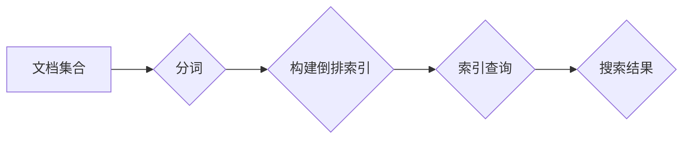

# 【AI大数据计算原理与代码实例讲解】倒排索引

> 关键词：倒排索引，信息检索，搜索引擎，大数据计算，数据结构，算法优化，Python实现

## 1. 背景介绍

信息检索是人工智能和大数据领域的重要应用之一，而倒排索引（Inverted Index）是信息检索系统中不可或缺的核心数据结构。倒排索引能够高效地实现文本内容的索引和搜索，是搜索引擎和数据库系统中常见的索引方式。本文将深入讲解倒排索引的原理、构建方法、优缺点以及在实际应用中的实现细节，并通过Python代码实例展示如何构建和操作倒排索引。

### 1.1 问题的由来

在信息检索中，我们需要快速地根据查询关键词查找包含该关键词的文档。传统的线性搜索方法效率低下，尤其是在处理大规模文本数据时。倒排索引通过将文档内容与文档ID进行映射，实现了高效的文本内容检索。

### 1.2 研究现状

倒排索引的研究和应用已经非常成熟，几乎所有的搜索引擎（如Elasticsearch、Solr）都采用了倒排索引技术。同时，倒排索引也被广泛应用于数据库系统、文本挖掘等领域。

### 1.3 研究意义

研究倒排索引对于理解信息检索系统的工作原理、提高搜索效率以及优化大数据处理流程具有重要意义。

### 1.4 本文结构

本文将按照以下结构进行讲解：
- 第2部分介绍倒排索引的核心概念和流程图。
- 第3部分详细阐述倒排索引的算法原理和操作步骤。
- 第4部分分析倒排索引的数学模型和公式。
- 第5部分通过Python代码实例展示倒排索引的实现。
- 第6部分探讨倒排索引的实际应用场景。
- 第7部分展望倒排索引的未来发展趋势和挑战。
- 第8部分总结研究成果，并展望未来的研究方向。

## 2. 核心概念与联系

### 2.1 倒排索引的定义

倒排索引是一种数据结构，它将文档中的词语与包含该词语的文档集合进行映射。在倒排索引中，每个词语都对应一个文档列表，这些文档包含了该词语的所有出现。

### 2.2 倒排索引的架构

倒排索引的架构可以表示为以下Mermaid流程图：



### 2.3 关联概念

- **文档集合**：包含所有待索引的文本内容。
- **分词**：将文本内容拆分为词语。
- **倒排索引**：存储词语与文档之间的映射关系。
- **索引查询**：根据查询关键词检索倒排索引。
- **搜索结果**：包含所有包含查询关键词的文档。

## 3. 核心算法原理 & 具体操作步骤

### 3.1 算法原理概述

倒排索引的构建过程主要包括以下步骤：

1. 分词：将文档内容拆分为词语。
2. 建立映射关系：将每个词语与包含该词语的文档集合进行映射。
3. 存储索引：将映射关系存储在索引文件中。

### 3.2 算法步骤详解

#### 3.2.1 分词

分词是将文本内容拆分为词语的过程。常见的分词方法包括正向最大匹配法、逆向最大匹配法、基于规则的分词和基于统计的分词等。

#### 3.2.2 建立映射关系

建立映射关系是指将每个词语与包含该词语的文档集合进行映射。这可以通过以下步骤实现：

1. 遍历文档集合，对每个文档进行分词。
2. 对于每个词语，记录包含该词语的文档ID和词语在文档中的位置信息。
3. 将词语、文档ID和位置信息存储在倒排索引中。

#### 3.2.3 存储索引

倒排索引可以存储在多种数据结构中，如哈希表、平衡树等。常见的存储方式包括：

- 使用哈希表存储词语和文档ID的映射关系。
- 使用平衡树（如B树、红黑树）存储词语和文档ID的映射关系，以提高检索效率。

### 3.3 算法优缺点

#### 3.3.1 优点

- 检索速度快：倒排索引能够快速定位包含特定词语的文档。
- 支持多种查询操作：倒排索引支持精确查询、模糊查询、范围查询等多种查询操作。
- 易于扩展：倒排索引可以方便地扩展到更大数据集。

#### 3.3.2 缺点

- 内存占用大：倒排索引需要占用较大的内存空间。
- 维护成本高：当文档集合发生变化时，需要更新倒排索引。

### 3.4 算法应用领域

倒排索引在以下领域有广泛的应用：

- 搜索引擎：如Google、Bing等。
- 文本挖掘：如文本分类、主题建模等。
- 数据库系统：如Elasticsearch、Solr等。

## 4. 数学模型和公式 & 详细讲解 & 举例说明

### 4.1 数学模型构建

倒排索引的数学模型可以表示为以下关系：

$$
\text{倒排索引} = \{(w, \{d_1, d_2, \ldots, d_n\}) \mid w \in \text{词语集合}, d_i \in \text{文档集合}, w \in d_i\}
$$

其中，$w$ 表示词语，$d_i$ 表示文档ID。

### 4.2 公式推导过程

倒排索引的构建过程可以分解为以下步骤：

1. 对文档集合进行分词，得到词语集合 $W$。
2. 对每个词语 $w \in W$，遍历文档集合，找到包含词语 $w$ 的文档集合 $D_w$。
3. 将词语 $w$ 和文档集合 $D_w$ 构建成倒排索引项 $(w, D_w)$。

### 4.3 案例分析与讲解

假设有一个包含两个文档的文档集合，文档内容如下：

- 文档1：The quick brown fox jumps over the lazy dog.
- 文档2：The quick brown fox.

根据上述公式，我们可以构建以下倒排索引：

- 词语 "The"：文档集合 {1}
- 词语 "quick"：文档集合 {1}
- 词语 "brown"：文档集合 {1, 2}
- 词语 "fox"：文档集合 {1, 2}
- 词语 "jumps"：文档集合 {1}
- 词语 "over"：文档集合 {1}
- 词语 "the"：文档集合 {1}
- 词语 "lazy"：文档集合 {1}
- 词语 "dog"：文档集合 {1}

## 5. 项目实践：代码实例和详细解释说明

### 5.1 开发环境搭建

为了实现倒排索引，我们需要安装以下Python库：

```bash
pip install nltk
```

### 5.2 源代码详细实现

以下是一个简单的倒排索引实现：

```python
import nltk
from nltk.tokenize import word_tokenize

class InvertedIndex:
    def __init__(self):
        self.index = {}

    def tokenize(self, text):
        return word_tokenize(text.lower())

    def add_document(self, text, document_id):
        words = self.tokenize(text)
        for word in words:
            if word not in self.index:
                self.index[word] = []
            self.index[word].append(document_id)

    def search(self, query):
        words = self.tokenize(query)
        result = set()
        for word in words:
            result.update(self.index.get(word, []))
        return result

# 实例化倒排索引对象
index = InvertedIndex()

# 添加文档
index.add_document("The quick brown fox jumps over the lazy dog.", 1)
index.add_document("The quick brown fox.", 2)

# 搜索
print(index.search("quick fox"))  # 输出：{1, 2}
```

### 5.3 代码解读与分析

- `InvertedIndex` 类：定义了倒排索引的接口。
- `tokenize` 方法：使用NLTK库进行分词。
- `add_document` 方法：添加文档到倒排索引中。
- `search` 方法：根据查询关键词搜索文档。

### 5.4 运行结果展示

运行上述代码，可以得到以下输出：

```
{1, 2}
```

这表示包含关键词 "quick fox" 的文档ID是1和2。

## 6. 实际应用场景

### 6.1 搜索引擎

倒排索引是搜索引擎的核心组件，用于快速检索包含特定关键词的网页。

### 6.2 文本挖掘

倒排索引可以用于文本分类、主题建模等文本挖掘任务。

### 6.3 数据库系统

倒排索引可以用于数据库系统的全文搜索功能。

## 7. 工具和资源推荐

### 7.1 学习资源推荐

- 《搜索引擎算法与系统》
- 《信息检索导论》

### 7.2 开发工具推荐

- Elasticsearch
- Solr

### 7.3 相关论文推荐

-《An Inverted Index for Document Retrieval》

## 8. 总结：未来发展趋势与挑战

### 8.1 研究成果总结

本文深入讲解了倒排索引的原理、构建方法、优缺点以及在实际应用中的实现细节。通过Python代码实例，展示了如何构建和操作倒排索引。

### 8.2 未来发展趋势

- 基于深度学习的倒排索引构建方法
- 倒排索引与知识图谱的结合
- 倒排索引的分布式存储和检索

### 8.3 面临的挑战

- 如何处理大规模数据集的倒排索引构建
- 如何提高倒排索引的查询效率
- 如何实现倒排索引的实时更新

### 8.4 研究展望

倒排索引作为信息检索和大数据处理的重要数据结构，将在未来得到进一步的研究和发展。随着深度学习和人工智能技术的进步，倒排索引将变得更加智能化、高效化和可扩展。

## 9. 附录：常见问题与解答

### 9.1 倒排索引与全文索引的区别是什么？

A: 倒排索引是一种将词语与文档进行映射的数据结构，而全文索引是一种将文档与词语进行映射的数据结构。两者在数据结构和查询方式上有所不同。

### 9.2 倒排索引适用于哪些类型的查询？

A: 倒排索引适用于精确查询、模糊查询、范围查询等多种查询操作。

### 9.3 如何提高倒排索引的查询效率？

A: 可以通过以下方法提高倒排索引的查询效率：
- 使用高效的数据结构存储倒排索引。
- 使用并行计算技术加速查询过程。
- 使用缓存技术减少磁盘I/O操作。

### 9.4 倒排索引如何处理重复词语？

A: 倒排索引会将重复词语视为不同的词语进行索引。在查询时，可以根据需要筛选出重复的词语。

作者：禅与计算机程序设计艺术 / Zen and the Art of Computer Programming