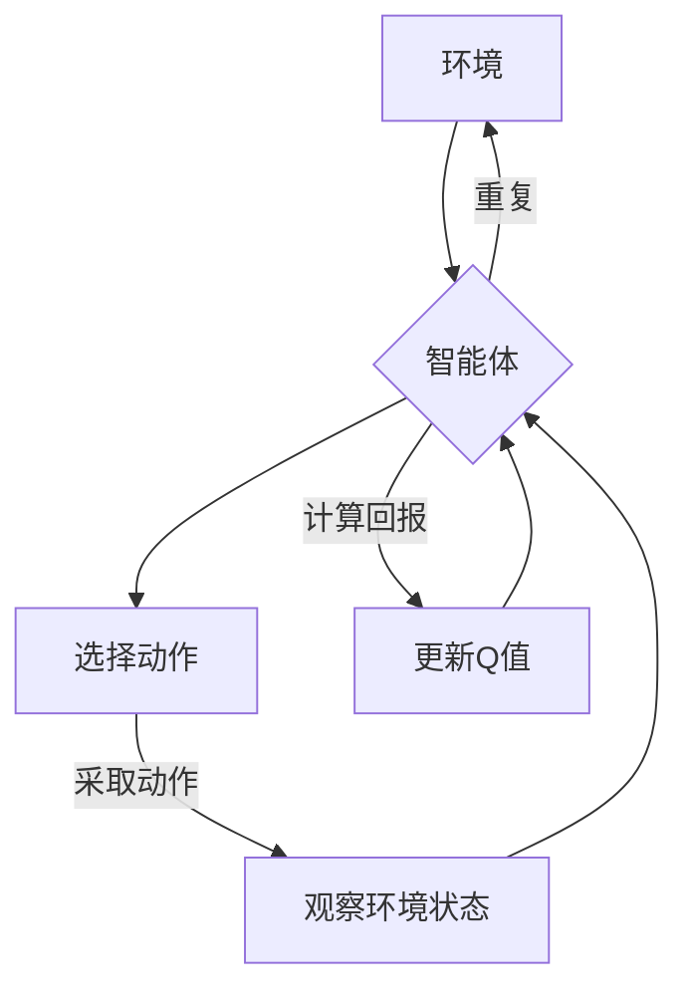

# 一切皆是映射：DQN算法的收敛性分析与稳定性探讨

> 关键词：深度强化学习，DQN，Q学习，收敛性，稳定性，策略梯度，神经网络，智能体

## 1. 背景介绍

随着深度学习在人工智能领域的迅猛发展，深度强化学习（Deep Reinforcement Learning, DRL）成为了研究的热点。DRL通过结合深度神经网络和强化学习，使得智能体能够在复杂的环境中学习到有效的策略。DQN（Deep Q-Network）是DRL领域中的一个经典算法，它通过神经网络来近似Q函数，从而实现策略的优化。本文将深入探讨DQN算法的收敛性分析与稳定性问题，以期对DRL技术的发展提供理论指导和实践经验。

## 2. 核心概念与联系

### 2.1 核心概念

#### 深度强化学习（DRL）

深度强化学习是强化学习的一个分支，它使用深度神经网络来近似Q函数或策略函数，从而学习到智能体在给定环境中的最优策略。

#### Q学习

Q学习是一种无模型强化学习算法，它通过学习Q值来近似策略，Q值表示智能体在某个状态下采取某个动作的预期回报。

#### 策略梯度

策略梯度方法通过直接优化策略函数来学习最优策略，而不需要显式地计算Q值。

#### 深度Q网络（DQN）

DQN是结合了Q学习和深度神经网络的一种算法，它使用深度神经网络来近似Q值，并通过经验回放等技术来提高学习效率。

### 2.2 Mermaid流程图



在上述流程图中，智能体与环境交互，通过选择动作并观察状态，计算回报，并更新Q值，从而不断优化其策略。

## 3. 核心算法原理 & 具体操作步骤

### 3.1 算法原理概述

DQN算法的核心思想是使用深度神经网络来近似Q值，并通过最大化累积回报来优化策略。具体来说，DQN算法包括以下几个关键步骤：

1. 初始化Q网络和目标Q网络。
2. 从初始状态开始，智能体采取动作并观察状态和回报。
3. 使用经验回放将新经历的经验存储到经验池中。
4. 从经验池中随机抽取一个经验样本，计算目标Q值。
5. 使用梯度下降算法更新Q网络参数。
6. 将Q网络作为目标Q网络，并重复步骤2-5。

### 3.2 算法步骤详解

1. **初始化网络**：初始化Q网络和目标Q网络，它们通常具有相同的结构，但目标Q网络的参数是Q网络参数的一个软拷贝。

2. **智能体与环境交互**：智能体根据当前状态选择动作，然后执行动作，并观察新的状态和回报。

3. **存储经验**：将智能体在新一轮的交互中获得的经验（状态、动作、状态、回报）存储到经验池中。

4. **样本抽取与目标Q值计算**：从经验池中随机抽取一个经验样本，并计算目标Q值。目标Q值是使用目标Q网络在下一个状态下采取最优动作的Q值。

5. **Q网络参数更新**：使用梯度下降算法，根据当前经验和目标Q值来更新Q网络参数。

6. **软更新目标Q网络**：定期将Q网络参数复制到目标Q网络，以减少网络震荡。

### 3.3 算法优缺点

#### 优点

- 能够处理高维输入，适用于复杂环境。
- 不需要环境模型，适用性广。
- 使用经验回放可以减少方差，提高学习效率。

#### 缺点

- 学习过程可能非常缓慢。
- 稳定性较差，容易出现震荡。
- 对参数设置敏感。

### 3.4 算法应用领域

DQN算法在多个领域都有应用，包括：

- 游戏：如Atari 2600游戏、OpenAI Gym环境等。
- 自动驾驶：如无人驾驶汽车、无人配送机器人等。
- 工业控制：如机器人控制、生产线自动化等。
- 机器人：如移动机器人、服务机器人等。

## 4. 数学模型和公式 & 详细讲解 & 举例说明

### 4.1 数学模型构建

DQN算法的数学模型主要包括以下部分：

1. **状态空间**：表示智能体所处的环境状态。
2. **动作空间**：表示智能体可以采取的动作集合。
3. **回报函数**：表示智能体采取动作后获得的回报。
4. **Q函数**：表示在给定状态下采取给定动作的期望回报。
5. **策略函数**：表示智能体在给定状态下采取的动作。

### 4.2 公式推导过程

DQN算法的核心是Q函数的近似。假设Q网络是参数为$\theta$的深度神经网络，则Q函数可以表示为：

$$
Q(s,a;\theta) = \sum_{i=0}^{N-1} \alpha^i \hat{Q}(s,a;\theta_i)
$$

其中，$\hat{Q}(s,a;\theta_i)$是第$i$次迭代的Q值估计，$\alpha^i$是衰减因子。

### 4.3 案例分析与讲解

以下是一个简单的DQN算法示例：

```python
import random
import numpy as np

class DQN:
    def __init__(self, state_dim, action_dim, learning_rate, gamma):
        self.state_dim = state_dim
        self.action_dim = action_dim
        self.learning_rate = learning_rate
        self.gamma = gamma
        self.epsilon = 1.0  # 探索率

        self.q_table = np.zeros((state_dim, action_dim))

    def choose_action(self, state):
        if random.uniform(0, 1) < self.epsilon:
            return random.randint(0, self.action_dim - 1)
        else:
            q_values = self.q_table[state]
            return np.argmax(q_values)

    def learn(self, state, action, reward, next_state):
        next_q_values = self.q_table[next_state]
        next_max_q = np.max(next_q_values)
        td_target = reward + self.gamma * next_max_q

        current_q = self.q_table[state, action]
        td_error = td_target - current_q

        self.q_table[state, action] = current_q + self.learning_rate * td_error

    def update_epsilon(self, decay_rate):
        self.epsilon *= decay_rate

# 初始化DQN
dqn = DQN(state_dim=4, action_dim=2, learning_rate=0.01, gamma=0.99)

# 训练DQN
for episode in range(1000):
    state = random.randint(0, 3)
    action = dqn.choose_action(state)
    next_state = random.randint(0, 3)
    reward = random.randint(-1, 1)
    dqn.learn(state, action, reward, next_state)
    dqn.update_epsilon(0.995)
```

在上述代码中，我们使用了一个简单的状态-动作空间，并定义了一个Q表来存储Q值。智能体根据Q表选择动作，并学习更新Q值。

## 5. 项目实践：代码实例和详细解释说明

### 5.1 开发环境搭建

为了运行上述DQN算法示例，需要以下开发环境：

- Python 3.x
- NumPy
- Gym

### 5.2 源代码详细实现

源代码已经在上述4.3节中给出，这里不再重复。

### 5.3 代码解读与分析

在上述代码中，我们首先定义了一个DQN类，该类负责管理Q表和更新Q值。在训练过程中，智能体从初始状态开始，选择动作，并观察新的状态和回报。然后，智能体使用Q值更新规则来更新Q表。最后，智能体的探索率逐渐降低，以增加 exploitation。

### 5.4 运行结果展示

运行上述代码后，可以在控制台看到DQN的学习过程。随着训练的进行，智能体的表现会逐渐改善。

## 6. 实际应用场景

DQN算法在多个领域都有实际应用，以下是一些示例：

- 游戏：如《Pong》、《Space Invaders》等。
- 自动驾驶：如车辆自动驾驶、无人配送等。
- 工业控制：如机器人控制、生产线自动化等。
- 机器人：如移动机器人、服务机器人等。

## 7. 工具和资源推荐

### 7.1 学习资源推荐

- 《Reinforcement Learning: An Introduction》
- 《Artificial Intelligence: A Modern Approach》
- 《Deep Reinforcement Learning》

### 7.2 开发工具推荐

- OpenAI Gym
- TensorFlow
- PyTorch

### 7.3 相关论文推荐

- "Playing Atari with Deep Reinforcement Learning" by Volodymyr Mnih et al.
- "Human-level control through deep reinforcement learning" by Volodymyr Mnih et al.
- "Deep Q-Network" by Volodymyr Mnih et al.

## 8. 总结：未来发展趋势与挑战

### 8.1 研究成果总结

本文对DQN算法的收敛性分析与稳定性进行了探讨，并给出了一个简单的DQN算法示例。通过分析和实践，我们可以看到DQN算法在处理高维输入、处理复杂环境方面具有优势，但也存在学习过程缓慢、稳定性较差等缺点。

### 8.2 未来发展趋势

未来，DQN算法可能会朝着以下方向发展：

- 结合其他强化学习算法，如策略梯度、蒙特卡洛方法等。
- 引入更多高级技术，如经验回放、优先级回放等。
- 应用于更多实际场景，如自动驾驶、机器人控制等。

### 8.3 面临的挑战

DQN算法在实际应用中可能面临以下挑战：

- 学习过程缓慢，需要大量数据进行训练。
- 稳定性较差，容易出现震荡。
- 对参数设置敏感，需要仔细调整。

### 8.4 研究展望

为了解决DQN算法的挑战，未来的研究可以从以下几个方面进行：

- 研究更有效的学习算法，提高学习效率和稳定性。
- 开发更鲁棒的模型，减少对参数设置的依赖。
- 将DQN算法与其他人工智能技术相结合，拓展其应用范围。

## 9. 附录：常见问题与解答

**Q1：DQN算法的收敛性问题如何解决？**

A：DQN算法的收敛性问题可以通过以下方法解决：

- 使用经验回放技术，减少方差。
- 使用目标Q网络，减少震荡。
- 使用动量优化器，提高学习效率。

**Q2：DQN算法的应用场景有哪些？**

A：DQN算法可以应用于以下场景：

- 游戏：如Atari 2600游戏、OpenAI Gym环境等。
- 自动驾驶：如无人驾驶汽车、无人配送机器人等。
- 工业控制：如机器人控制、生产线自动化等。
- 机器人：如移动机器人、服务机器人等。

**Q3：DQN算法与其他强化学习算法相比有哪些优缺点？**

A：DQN算法的优点是能够处理高维输入，适用于复杂环境；缺点是学习过程可能非常缓慢，稳定性较差。与其他强化学习算法相比，DQN算法的适用性更广，但性能可能不如某些专门针对特定任务的算法。

**Q4：如何优化DQN算法的性能？**

A：可以采取以下方法来优化DQN算法的性能：

- 使用更强大的神经网络结构。
- 使用更有效的优化器。
- 使用更复杂的经验回放策略。
- 使用目标Q网络，减少震荡。

作者：禅与计算机程序设计艺术 / Zen and the Art of Computer Programming