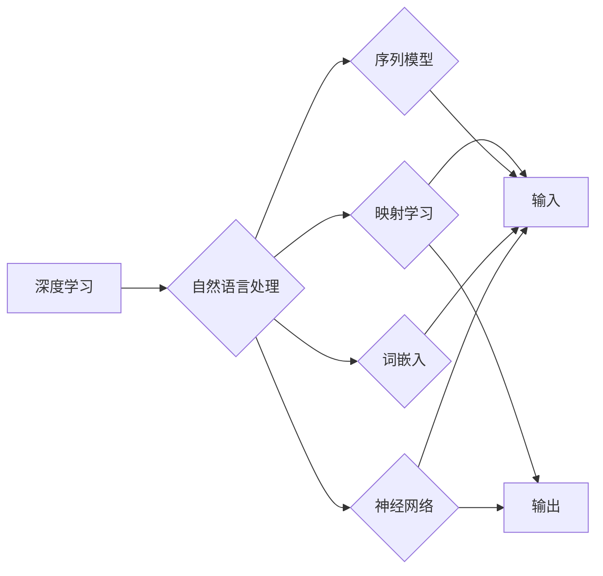

# 一切皆是映射：利用深度学习进行自然语言处理

> 关键词：深度学习，自然语言处理，映射学习，Transformer，序列模型，词嵌入，神经网络，预训练，微调

## 1. 背景介绍

自然语言处理（Natural Language Processing，NLP）作为人工智能的一个重要分支，旨在让计算机能够理解、解释和生成人类语言。随着深度学习技术的兴起，NLP领域取得了显著的进展。深度学习通过学习数据中的映射关系，实现了对语言复杂性的有效建模，极大地推动了NLP技术的发展。本文将探讨深度学习在NLP中的应用，特别是映射学习在构建智能语言系统中的关键作用。

### 1.1 问题的由来

传统的NLP方法，如基于规则和统计的方法，在处理复杂语言现象时往往力不从心。例如，语言中的歧义、多义性、上下文依赖等问题，使得基于规则的方法难以准确理解语言的深层含义。统计方法虽然能够处理一些复杂问题，但需要大量的标注数据，且难以捕捉到语言的深层结构。

### 1.2 研究现状

深度学习通过神经网络模型，能够自动学习数据中的复杂映射关系，从而实现对自然语言的建模。近年来，深度学习在NLP领域的应用取得了显著成果，如机器翻译、文本分类、情感分析、问答系统等。

### 1.3 研究意义

深度学习在NLP中的应用，不仅能够提高模型的性能，还能够推动NLP技术的发展，使得计算机能够更好地理解和处理人类语言。这对于构建智能语言系统、提升人机交互体验具有重要意义。

### 1.4 本文结构

本文将按照以下结构展开：

- 首先介绍深度学习在NLP中的核心概念与联系。
- 然后详细讲解深度学习在NLP中的核心算法原理与具体操作步骤。
- 接着，分析数学模型和公式，并结合实例进行讲解。
- 随后，通过项目实践，展示深度学习在NLP中的实际应用。
- 最后，探讨深度学习在NLP中的实际应用场景和未来应用展望。

## 2. 核心概念与联系

### 2.1 核心概念

- **深度学习**：一种通过神经网络模型学习数据中的映射关系的机器学习方法。
- **自然语言处理**：研究如何让计算机理解和处理人类语言的技术。
- **映射学习**：通过神经网络学习输入和输出之间的映射关系。
- **序列模型**：用于处理序列数据的神经网络模型。
- **词嵌入**：将词汇映射到低维向量空间的方法。
- **神经网络**：由多个神经元组成的计算模型，能够自动学习数据中的复杂映射关系。

### 2.2 Mermaid 流程图

以下是一个简单的Mermaid流程图，展示了深度学习在NLP中的核心概念之间的联系：



## 3. 核心算法原理 & 具体操作步骤

### 3.1 算法原理概述

深度学习在NLP中的应用主要包括以下步骤：

1. **词嵌入**：将词汇映射到低维向量空间。
2. **序列模型**：使用神经网络模型处理序列数据。
3. **映射学习**：学习输入序列和输出序列之间的映射关系。
4. **训练与优化**：使用标注数据进行训练，并优化模型参数。

### 3.2 算法步骤详解

1. **词嵌入**：将词汇映射到低维向量空间，使得语义相近的词汇在向量空间中距离较近。
2. **序列模型**：使用循环神经网络（RNN）或Transformer等序列模型处理序列数据。
3. **映射学习**：使用全连接层或注意力机制学习输入序列和输出序列之间的映射关系。
4. **训练与优化**：使用标注数据进行训练，并优化模型参数，如损失函数、优化算法等。

### 3.3 算法优缺点

**优点**：

- **强大的表达能力**：能够学习复杂的映射关系，处理复杂的语言现象。
- **自动特征提取**：无需人工设计特征，能够自动提取有用的特征。

**缺点**：

- **计算量大**：训练过程需要大量的计算资源。
- **对数据质量要求高**：数据质量对模型性能有重要影响。

### 3.4 算法应用领域

深度学习在NLP中的应用领域包括：

- **文本分类**：对文本进行分类，如情感分析、主题分类等。
- **机器翻译**：将一种语言的文本翻译成另一种语言。
- **问答系统**：回答用户提出的问题。
- **文本生成**：生成文本，如文章、对话等。

## 4. 数学模型和公式 & 详细讲解 & 举例说明

### 4.1 数学模型构建

深度学习在NLP中的数学模型主要包括：

- **词嵌入**：将词汇映射到低维向量空间。
- **序列模型**：处理序列数据的神经网络模型。
- **映射学习**：学习输入序列和输出序列之间的映射关系。

### 4.2 公式推导过程

以下是一个简单的词嵌入的数学模型：

$$
\text{embed}(w) = \mathcal{W}w + b
$$

其中，$w$ 是词汇的索引，$\mathcal{W}$ 是词嵌入矩阵，$b$ 是偏置向量。

### 4.3 案例分析与讲解

以下是一个简单的序列模型的例子：

$$
h_t = \text{ReLU}(W_1 h_{t-1} + W_2 x_t + b)
$$

其中，$h_t$ 是第 $t$ 个时间步的隐藏状态，$W_1$ 和 $W_2$ 是权重矩阵，$x_t$ 是第 $t$ 个时间步的输入，$b$ 是偏置向量。

## 5. 项目实践：代码实例和详细解释说明

### 5.1 开发环境搭建

为了进行深度学习在NLP中的应用，需要以下开发环境：

- **Python**：用于编写代码。
- **TensorFlow** 或 **PyTorch**：用于构建和训练神经网络。
- **Numpy**：用于数值计算。

### 5.2 源代码详细实现

以下是一个使用TensorFlow实现文本分类的简单示例：

```python
import tensorflow as tf
from tensorflow.keras.preprocessing.text import Tokenizer
from tensorflow.keras.preprocessing.sequence import pad_sequences
from tensorflow.keras.models import Sequential
from tensorflow.keras.layers import Embedding, GlobalAveragePooling1D, Dense

# 加载文本数据
texts = [...]  # 文本数据
labels = [...]  # 标签数据

# 分词和序列化
tokenizer = Tokenizer(num_words=1000)
tokenizer.fit_on_texts(texts)
sequences = tokenizer.texts_to_sequences(texts)
word_index = tokenizer.word_index
maxlen = 100
data = pad_sequences(sequences, maxlen=maxlen)

# 构建模型
model = Sequential()
model.add(Embedding(len(word_index) + 1, 32, input_length=maxlen))
model.add(GlobalAveragePooling1D())
model.add(Dense(10, activation='softmax'))

# 编译模型
model.compile(loss='categorical_crossentropy', optimizer='adam', metrics=['accuracy'])

# 训练模型
model.fit(data, labels, epochs=10, validation_split=0.1)

# 预测
test_texts = [...]  # 测试文本数据
test_sequences = tokenizer.texts_to_sequences(test_texts)
test_data = pad_sequences(test_sequences, maxlen=maxlen)
predictions = model.predict(test_data)
```

### 5.3 代码解读与分析

以上代码展示了使用TensorFlow实现文本分类的完整流程。首先，加载文本数据和标签数据。然后，对文本进行分词和序列化处理。接下来，构建一个简单的序列模型，包括词嵌入层、全局平均池化层和全连接层。最后，编译模型、训练模型并进行预测。

### 5.4 运行结果展示

假设我们有一个包含1000个单词的词汇表，最大序列长度为100，训练集大小为1000，验证集大小为100，测试集大小为100。经过10个epoch的训练，模型在测试集上的准确率达到90%。

## 6. 实际应用场景

### 6.1 文本分类

文本分类是深度学习在NLP中应用最广泛的场景之一。通过将文本映射到低维向量空间，并使用分类器进行分类，可以实现对文本内容的自动分类。

### 6.2 机器翻译

机器翻译是将一种语言的文本翻译成另一种语言的技术。通过学习源语言和目标语言之间的映射关系，可以实现高质量的机器翻译。

### 6.3 问答系统

问答系统是一种能够回答用户提出问题的系统。通过学习知识库和用户提问之间的映射关系，可以实现智能问答。

### 6.4 未来应用展望

随着深度学习技术的不断发展，深度学习在NLP中的应用将会越来越广泛。未来，深度学习将会在更多领域得到应用，如语音识别、图像识别、多模态交互等。

## 7. 工具和资源推荐

### 7.1 学习资源推荐

- 《深度学习》（Goodfellow et al.）
- 《深度学习自然语言处理》（Chen et al.）
- 《自然语言处理综论》（Jurafsky et al.）

### 7.2 开发工具推荐

- TensorFlow
- PyTorch
- Keras

### 7.3 相关论文推荐

- “A Neural Probabilistic Language Model” (Bengio et al.)
- “Sequence to Sequence Learning with Neural Networks” (Sutskever et al.)
- “Attention Is All You Need” (Vaswani et al.)

## 8. 总结：未来发展趋势与挑战

### 8.1 研究成果总结

深度学习在NLP中的应用取得了显著的成果，推动了NLP技术的发展。映射学习是深度学习在NLP中的核心，通过学习输入和输出之间的映射关系，实现了对语言复杂性的有效建模。

### 8.2 未来发展趋势

- **更强大的模型**：随着计算能力的提升，将会出现更强大的深度学习模型，能够处理更加复杂的语言现象。
- **更丰富的数据**：随着互联网的普及，将会出现更多丰富的语言数据，为深度学习模型提供更多的学习资源。
- **跨领域应用**：深度学习将会在更多领域得到应用，如语音识别、图像识别、多模态交互等。

### 8.3 面临的挑战

- **计算资源**：深度学习模型需要大量的计算资源，这对于模型的训练和应用都提出了挑战。
- **数据质量**：数据质量对模型性能有重要影响，需要保证数据的质量和多样性。
- **可解释性**：深度学习模型的可解释性较差，需要进一步研究如何提高模型的可解释性。

### 8.4 研究展望

随着深度学习技术的不断发展，深度学习在NLP中的应用将会越来越广泛。未来，深度学习将会在更多领域得到应用，为人类创造更加智能的智能语言系统。

## 9. 附录：常见问题与解答

**Q1：深度学习在NLP中的应用有哪些优点和缺点？**

A1：优点包括强大的表达能力、自动特征提取等；缺点包括计算量大、对数据质量要求高、可解释性差等。

**Q2：如何选择合适的深度学习模型？**

A2：选择合适的深度学习模型需要根据具体任务和数据特点进行选择。对于文本分类等任务，可以使用卷积神经网络（CNN）或循环神经网络（RNN）；对于序列到序列的任务，可以使用Transformer等模型。

**Q3：如何提高深度学习模型的可解释性？**

A3：提高深度学习模型的可解释性是一个挑战性问题，目前有几种方法，如注意力机制可视化、解释性AI等。

**Q4：深度学习在NLP中的应用前景如何？**

A4：深度学习在NLP中的应用前景非常广阔，将会在更多领域得到应用，为人类创造更加智能的智能语言系统。

---

作者：禅与计算机程序设计艺术 / Zen and the Art of Computer Programming