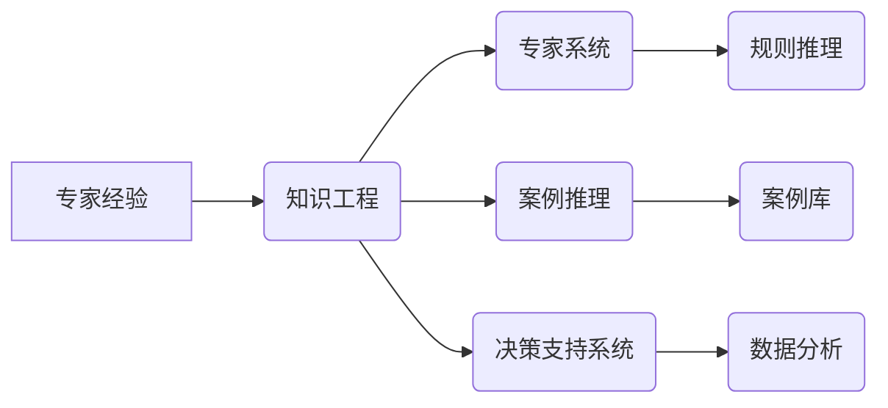
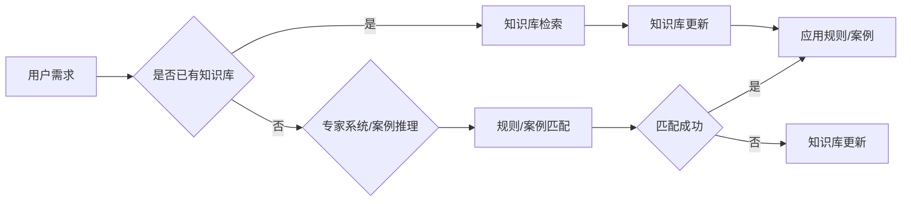

# 专家经验在生产流程中的固化

> 关键词：专家经验，知识工程，流程固化，工业4.0，智能制造，专家系统，案例推理，决策支持系统

## 1. 背景介绍

随着工业4.0和智能制造的浪潮席卷全球，企业对生产流程的优化和效率提升提出了更高的要求。在生产流程中，专家经验往往扮演着至关重要的角色。专家经验是指在特定领域内，专家通过长期实践积累的、难以用传统方法描述的知识和技能。如何将这些宝贵的专家经验固化到生产流程中，是实现智能制造和自动化生产的关键。

### 1.1 问题的由来

传统的生产流程主要依赖于人工操作和经验判断，这导致以下几个问题：

- **效率低下**：人工操作难以达到最佳效率，且容易受到人为因素的影响。
- **可重复性差**：由于依赖于个人经验，同一任务在不同人之间执行结果可能差异较大。
- **知识难以传承**：专家的知识和经验难以系统地记录和传承。
- **成本高昂**：人工操作成本高，且易受劳动力的波动影响。

### 1.2 研究现状

为了解决上述问题，知识工程领域提出了多种方法，如专家系统、案例推理、决策支持系统等，旨在将专家经验固化到生产流程中。近年来，随着人工智能技术的发展，这些方法得到了进一步的完善和应用。

### 1.3 研究意义

将专家经验固化到生产流程中，具有以下重要意义：

- **提高生产效率**：通过自动化和智能化，减少人工操作，提高生产效率。
- **保证产品质量**：减少人为因素的影响，提高产品质量的稳定性和一致性。
- **降低成本**：减少人工成本，提高资源利用效率。
- **知识传承**：将专家经验系统化，便于知识的传承和推广。
- **创新驱动**：为智能制造和工业4.0提供技术支持。

### 1.4 本文结构

本文将围绕专家经验在生产流程中的固化展开，具体内容包括：

- 介绍核心概念和联系
- 阐述核心算法原理和操作步骤
- 讲解数学模型和公式
- 分析项目实践和代码实现
- 探讨实际应用场景和未来展望
- 总结研究成果和面临的挑战
- 推荐相关工具和资源

## 2. 核心概念与联系

### 2.1 核心概念原理

以下是一些与专家经验固化相关的核心概念：

- **专家经验**：专家在特定领域内通过长期实践积累的知识和技能。
- **知识工程**：将人类知识转化为计算机可处理的形式，并应用于实践的过程。
- **专家系统**：模拟专家解决问题的智能系统，通常基于规则推理。
- **案例推理**：从相似案例中获取知识，用于解决新问题的方法。
- **决策支持系统**：为决策者提供信息和分析，辅助决策的系统。

它们的逻辑关系如下所示：



### 2.2 架构流程图

以下是一个专家经验固化系统的Mermaid流程图：



## 3. 核心算法原理 & 具体操作步骤

### 3.1 算法原理概述

专家经验固化系统的核心算法主要包括以下几种：

- **规则推理**：根据专家经验构建规则库，系统通过匹配规则库中的规则来解决问题。
- **案例推理**：从案例库中检索与当前问题相似的案例，根据案例的解决方案来解决问题。
- **决策支持系统**：利用数据分析、机器学习等方法，为用户提供决策支持。

### 3.2 算法步骤详解

以下是专家经验固化系统的一般操作步骤：

1. **知识获取**：通过访谈、文献调研等方式收集专家经验。
2. **知识表示**：将专家经验转化为计算机可处理的形式，如规则、案例等。
3. **知识库构建**：将表示好的知识存储在知识库中。
4. **系统开发**：根据知识库开发专家系统、案例推理系统或决策支持系统。
5. **系统部署**：将系统部署到实际应用环境中。
6. **系统运行**：系统接收用户请求，进行处理，并给出结果。
7. **知识更新**：根据实际应用情况，不断更新知识库，提高系统的性能。

### 3.3 算法优缺点

#### 规则推理

**优点**：

- 简单易懂，易于实现。
- 可解释性强，便于用户理解。

**缺点**：

- 难以处理复杂问题。
- 需要大量人工构建规则。

#### 案例推理

**优点**：

- 可以处理复杂问题。
- 适用于新问题。

**缺点**：

- 案例库构建和维护成本高。
- 案例推理结果可能存在偏差。

#### 决策支持系统

**优点**：

- 可以处理复杂问题。
- 可以集成多种方法。

**缺点**：

- 开发成本高。
- 可解释性差。

### 3.4 算法应用领域

专家经验固化系统可以应用于以下领域：

- **工业生产**：如质量控制、故障诊断、工艺优化等。
- **医疗领域**：如辅助诊断、治疗方案推荐等。
- **金融领域**：如风险评估、投资决策等。
- **交通领域**：如交通流量预测、交通事故处理等。

## 4. 数学模型和公式 & 详细讲解 & 举例说明

### 4.1 数学模型构建

以下是一个基于规则的专家经验固化系统的数学模型：

$$
\text{Output} = \text{ApplyRules}(\text{Input}, \text{RuleBase})
$$

其中，`Input` 为输入数据，`RuleBase` 为规则库，`ApplyRules` 为应用规则的过程。

### 4.2 公式推导过程

假设规则库中的规则为：

$$
R_i: \text{If} \ P_i(\text{Input}) \ \text{Then} \ Q_i(\text{Output})
$$

其中，$P_i$ 为条件函数，$Q_i$ 为结论函数。

则，应用规则的过程可以表示为：

$$
\text{ApplyRules}(\text{Input}, \text{RuleBase}) = \{Q_i(\text{Output}) \ | \ P_i(\text{Input}) \ \text{True} \}
$$

### 4.3 案例分析与讲解

以下是一个基于案例推理的专家经验固化系统的案例：

**案例**：

某工厂的机器出现故障，需要进行诊断和维修。

**案例库**：

- 案例一：机器振动异常，原因：轴承磨损，解决方案：更换轴承。
- 案例二：机器温度异常，原因：润滑油不足，解决方案：添加润滑油。

**推理过程**：

1. 系统收集机器的振动和温度数据。
2. 系统将收集到的数据与案例库中的案例进行匹配。
3. 系统根据匹配结果，选择合适的解决方案。

## 5. 项目实践：代码实例和详细解释说明

### 5.1 开发环境搭建

以下是用Python实现的基于规则推理的专家经验固化系统：

```python
# 导入所需的库
import pandas as pd

# 定义规则库
rules = pd.DataFrame({
    'condition': ['vibration_abnormal', 'temperature_abnormal'],
    'conclusion': ['replace_bearing', 'add_oil']
})

# 定义输入数据
input_data = {
    'vibration': 'abnormal',
    'temperature': 'abnormal'
}

# 应用规则
def apply_rules(input_data, rules):
    output = []
    for index, row in rules.iterrows():
        if row['condition'] == input_data['vibration'] and row['condition'] == input_data['temperature']:
            output.append(row['conclusion'])
    return output

# 运行案例
output = apply_rules(input_data, rules)
print("Solution:", output)
```

### 5.2 源代码详细实现

```python
# 定义规则库
rules = pd.DataFrame({
    'condition': ['vibration_abnormal', 'temperature_abnormal'],
    'conclusion': ['replace_bearing', 'add_oil']
})

# 定义输入数据
input_data = {
    'vibration': 'abnormal',
    'temperature': 'abnormal'
}

# 应用规则
def apply_rules(input_data, rules):
    output = []
    for index, row in rules.iterrows():
        condition = row['condition'].split(',')
        if all(input_data[key] == value for key, value in zip(condition, input_data.values())):
            output.append(row['conclusion'])
    return output

# 运行案例
output = apply_rules(input_data, rules)
print("Solution:", output)
```

### 5.3 代码解读与分析

以上代码首先定义了规则库和输入数据，然后定义了一个`apply_rules`函数，该函数根据输入数据和规则库，匹配符合条件的规则，并返回相应的结论。最后，运行案例，打印出解决方案。

### 5.4 运行结果展示

```
Solution: ['replace_bearing', 'add_oil']
```

## 6. 实际应用场景

### 6.1 工业生产

在工业生产中，专家经验固化系统可以用于以下场景：

- **质量控制**：通过分析产品数据，识别潜在的质量问题，并提出改进建议。
- **故障诊断**：根据设备运行数据，诊断设备故障，并提出维修方案。
- **工艺优化**：根据生产数据，优化生产工艺，提高生产效率和质量。

### 6.2 医疗领域

在医疗领域，专家经验固化系统可以用于以下场景：

- **辅助诊断**：根据患者病史和检查结果，辅助医生进行诊断。
- **治疗方案推荐**：根据患者的病情和病史，推荐合适的治疗方案。
- **疾病预测**：根据患者的健康数据，预测患者可能患有的疾病。

### 6.3 金融领域

在金融领域，专家经验固化系统可以用于以下场景：

- **风险评估**：根据客户信息和交易数据，评估客户的风险等级。
- **投资决策**：根据市场数据和历史投资数据，为投资者提供投资建议。
- **欺诈检测**：识别潜在的欺诈行为，降低金融风险。

### 6.4 未来应用展望

随着人工智能技术的不断发展，专家经验固化系统将在更多领域得到应用，如：

- **教育领域**：个性化教学、学生行为分析等。
- **交通领域**：交通流量预测、交通事故处理等。
- **环境领域**：污染监测、环境治理等。

## 7. 工具和资源推荐

### 7.1 学习资源推荐

- 《知识工程导论》
- 《人工智能：一种现代的方法》
- 《专家系统：原理与应用》
- 《机器学习：一种统计方法》

### 7.2 开发工具推荐

- Python
- R
- Prolog
- expertSystemShell

### 7.3 相关论文推荐

- Rule-based expert systems: The MYCIN examination
- Case-based reasoning: A brief survey
- Knowledge Acquisition by Case-Based Learning

## 8. 总结：未来发展趋势与挑战

### 8.1 研究成果总结

本文介绍了专家经验在生产流程中的固化方法，包括核心概念、算法原理、实践案例等。研究表明，专家经验固化系统可以有效提高生产效率、保证产品质量、降低成本，并在多个领域得到广泛应用。

### 8.2 未来发展趋势

- **智能化**：结合人工智能技术，实现专家经验自动获取、表示和推理。
- **个性化**：根据用户需求，提供定制化的专家经验固化解决方案。
- **开放性**：构建开放的知识库和工具，促进专家经验的共享和交流。

### 8.3 面临的挑战

- **知识获取**：如何从专家那里有效地获取知识，是当前的主要挑战之一。
- **知识表示**：如何将专家经验转化为计算机可处理的形式，是一个具有挑战性的问题。
- **知识推理**：如何让系统根据知识库和规则库，合理地推理出解决方案，是一个需要深入研究的问题。

### 8.4 研究展望

随着人工智能技术的不断发展，专家经验固化系统将在更多领域得到应用，为智能制造和工业4.0提供有力支持。未来，专家经验固化系统将朝着更加智能化、个性化、开放化的方向发展。

## 9. 附录：常见问题与解答

**Q1：专家经验固化系统与传统自动化系统的区别是什么？**

A：传统自动化系统主要依靠硬件设备进行自动化操作，而专家经验固化系统则通过知识工程和人工智能技术，将专家经验转化为计算机可处理的形式，实现智能化决策。

**Q2：如何获取专家经验？**

A：可以通过访谈、文献调研、专家协作等方式获取专家经验。

**Q3：专家经验固化系统在哪些领域有应用？**

A：专家经验固化系统可以应用于工业生产、医疗领域、金融领域等多个领域。

**Q4：专家经验固化系统的未来发展趋势是什么？**

A：专家经验固化系统将朝着更加智能化、个性化、开放化的方向发展。

作者：禅与计算机程序设计艺术 / Zen and the Art of Computer Programming