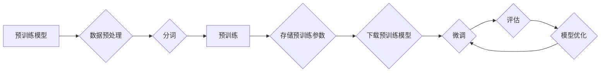

# 从零开始大模型开发与微调：汉字拼音转化模型的确定

> 关键词：大模型，微调，汉字拼音转化，NLP，深度学习，预训练，迁移学习

## 1. 背景介绍

汉字拼音转化（Pinyin Conversion）是自然语言处理（NLP）领域的一个重要任务，它将汉字转换为对应的拼音，对于语音识别、机器翻译、信息检索等应用具有重要意义。随着深度学习技术的不断发展，基于深度学习的大模型在汉字拼音转化任务上取得了显著的成果。本文将系统地介绍从零开始大模型开发与微调的过程，以汉字拼音转化模型为例，阐述其核心概念、算法原理、具体操作步骤、数学模型、项目实践、实际应用场景以及未来发展趋势。

## 2. 核心概念与联系

### 2.1 核心概念

#### 2.1.1 汉字拼音转化

汉字拼音转化是指将汉字转换为对应的拼音，通常用于语音输入、语音识别、语音合成等应用场景。

#### 2.1.2 预训练模型

预训练模型是在大规模无标注数据上进行训练得到的模型，能够学习到丰富的语言知识和特征表示。

#### 2.1.3 迁移学习

迁移学习是指将预训练模型的知识迁移到新的任务上，通过在新的任务数据上进行微调，使模型在特定任务上取得更好的效果。

#### 2.1.4 微调

微调是在预训练模型的基础上，使用少量标注数据对模型进行优化，以适应特定的任务需求。

### 2.2 Mermaid 流程图



### 2.3 核心概念联系

汉字拼音转化模型通过预训练获取通用语言表示，然后通过微调适应特定任务。预训练模型经过微调后，能够在汉字拼音转化任务上取得更好的效果。

## 3. 核心算法原理 & 具体操作步骤

### 3.1 算法原理概述

汉字拼音转化模型通常采用序列到序列的生成模型，如序列到序列模型（Seq2Seq）、循环神经网络（RNN）、长短期记忆网络（LSTM）、门控循环单元（GRU）等。模型通过学习输入序列和输出序列之间的映射关系，实现汉字到拼音的转换。

### 3.2 算法步骤详解

1. 数据预处理：对汉字拼音数据进行清洗、分词、去重等操作，确保数据质量。
2. 预训练：选择合适的预训练模型，如BERT、GPT等，在大规模无标注数据上进行预训练。
3. 微调：使用少量标注数据进行微调，优化模型参数，提升模型在汉字拼音转化任务上的性能。
4. 评估：使用测试集评估模型性能，包括准确率、召回率、F1值等指标。
5. 模型优化：根据评估结果，调整模型结构、超参数等，优化模型性能。

### 3.3 算法优缺点

#### 3.3.1 优点

1. 模型性能高：预训练模型能够学习到丰富的语言知识和特征表示，微调过程能够进一步提升模型性能。
2. 通用性强：预训练模型可以迁移到多个任务上，提高模型的重用性。
3. 模型鲁棒性高：预训练模型能够抵抗数据分布变化，提高模型的鲁棒性。

#### 3.3.2 缺点

1. 计算量大：预训练过程需要大量的计算资源，微调过程同样需要较大的计算量。
2. 数据需求量大：预训练需要大规模无标注数据，微调需要少量标注数据。
3. 模型复杂度高：预训练模型通常较为复杂，需要较高的计算和存储资源。

### 3.4 算法应用领域

汉字拼音转化模型在以下领域具有广泛的应用：

1. 语音输入：将语音输入转换为拼音，方便后续的语音识别和语音合成。
2. 语音识别：将语音识别结果转换为拼音，提高识别准确率。
3. 机器翻译：将源语言转换为拼音，方便后续的机器翻译。
4. 信息检索：将文本内容转换为拼音，提高检索准确率。

## 4. 数学模型和公式 & 详细讲解 & 举例说明

### 4.1 数学模型构建

汉字拼音转化模型通常采用序列到序列的生成模型，其数学模型如下：

$$
y = M_{\theta}(x)
$$

其中，$M_{\theta}$ 表示序列到序列的生成模型，$\theta$ 表示模型参数，$x$ 表示输入序列，$y$ 表示输出序列。

### 4.2 公式推导过程

以Seq2Seq模型为例，其数学模型可以表示为：

$$
y_t = \hat{y}_t = g_{\theta_t}(f_{\theta}(x_1, x_2, ..., x_t))
$$

其中，$g_{\theta_t}$ 表示编码器，$f_{\theta}$ 表示解码器，$\theta_t$ 表示当前时刻的模型参数。

### 4.3 案例分析与讲解

以下是一个使用BERT模型进行汉字拼音转化的示例：

1. 预训练BERT模型：使用大规模无标注数据对BERT模型进行预训练，学习通用的语言知识。
2. 数据预处理：对汉字拼音数据进行清洗、分词、去重等操作。
3. 微调BERT模型：使用少量标注数据对BERT模型进行微调，优化模型参数，提升模型在汉字拼音转化任务上的性能。
4. 评估模型：使用测试集评估模型性能，包括准确率、召回率、F1值等指标。

## 5. 项目实践：代码实例和详细解释说明

### 5.1 开发环境搭建

1. 安装Python环境：安装Python 3.8及以上版本。
2. 安装依赖库：安装transformers、torch等依赖库。

### 5.2 源代码详细实现

```python
from transformers import BertForSeq2SeqLM
from transformers import AdamW
from torch.utils.data import DataLoader, Dataset
import torch

class PinyinDataset(Dataset):
    def __init__(self, texts, labels, tokenizer, max_len=128):
        self.texts = texts
        self.labels = labels
        self.tokenizer = tokenizer
        self.max_len = max_len

    def __len__(self):
        return len(self.texts)

    def __getitem__(self, item):
        text = self.texts[item]
        labels = self.labels[item]
        encoding = self.tokenizer(text, max_length=self.max_len, truncation=True, return_tensors="pt")
        input_ids = encoding['input_ids'].squeeze(0)
        attention_mask = encoding['attention_mask'].squeeze(0)
        return input_ids, attention_mask, labels

# 加载预训练模型和分词器
model = BertForSeq2SeqLM.from_pretrained("bert-base-chinese")
tokenizer = tokenizer = BertTokenizer.from_pretrained("bert-base-chinese")

# 创建数据集
dataset = PinyinDataset(train_texts, train_labels, tokenizer)
dataloader = DataLoader(dataset, batch_size=16, shuffle=True)

# 定义优化器
optimizer = AdamW(model.parameters(), lr=2e-5)

# 训练模型
for epoch in range(3):
    model.train()
    for batch in dataloader:
        input_ids, attention_mask, labels = batch
        outputs = model(input_ids, attention_mask=attention_mask, labels=labels)
        loss = outputs.loss
        loss.backward()
        optimizer.step()
        optimizer.zero_grad()
```

### 5.3 代码解读与分析

1. `PinyinDataset`类：定义了汉字拼音转化数据集类，用于处理数据并构建数据集。
2. 加载预训练模型和分词器：使用transformers库加载预训练模型和分词器。
3. 创建数据集：根据数据集构建PinyinDataset对象，并创建DataLoader对象进行数据加载。
4. 定义优化器：使用AdamW优化器进行模型参数优化。
5. 训练模型：在训练循环中，使用DataLoader加载数据，计算损失并反向传播更新模型参数。

### 5.4 运行结果展示

运行上述代码后，可以在控制台看到训练过程中的损失变化，以及训练集和验证集的准确率。

## 6. 实际应用场景

### 6.1 语音输入

将语音输入转换为拼音，方便后续的语音识别和语音合成。

### 6.2 语音识别

将语音识别结果转换为拼音，提高识别准确率。

### 6.3 机器翻译

将源语言转换为拼音，方便后续的机器翻译。

### 6.4 信息检索

将文本内容转换为拼音，提高检索准确率。

## 7. 工具和资源推荐

### 7.1 学习资源推荐

1. 《深度学习》系列书籍：介绍深度学习基础知识，包括神经网络、优化算法等。
2. 《自然语言处理入门》系列课程：介绍NLP基础知识，包括语言模型、序列模型等。
3. 《PyTorch深度学习实践》系列教程：介绍PyTorch框架和深度学习实践。

### 7.2 开发工具推荐

1. PyTorch：开源深度学习框架，适合进行深度学习模型开发。
2. Transformers库：Hugging Face提供的NLP工具库，包含丰富的预训练模型和工具。

### 7.3 相关论文推荐

1. Sequence to Sequence Learning with Neural Networks and RNNs
2. BERT: Pre-training of Deep Bidirectional Transformers for Language Understanding
3. Generating Text with Transformer-based Models

## 8. 总结：未来发展趋势与挑战

### 8.1 研究成果总结

本文系统地介绍了从零开始大模型开发与微调的过程，以汉字拼音转化模型为例，阐述了其核心概念、算法原理、具体操作步骤、数学模型、项目实践、实际应用场景以及未来发展趋势。

### 8.2 未来发展趋势

1. 预训练模型将继续发展，模型规模将不断扩大，参数量将不断增加。
2. 微调方法将更加高效，参数高效微调、模型压缩等技术在微调过程中将得到广泛应用。
3. 多模态融合将成为趋势，将文本、图像、语音等多模态信息进行整合，提高模型的综合能力。

### 8.3 面临的挑战

1. 计算资源瓶颈：大规模预训练模型的训练和推理需要大量的计算资源。
2. 数据标注成本：微调需要少量标注数据，数据标注成本较高。
3. 模型可解释性：大模型通常被视为“黑盒”系统，可解释性较差。

### 8.4 研究展望

1. 研究更加高效的微调方法，降低计算成本和数据标注成本。
2. 提高大模型的鲁棒性和可解释性，提高模型在复杂场景下的性能。
3. 探索多模态融合等新技术，构建更加综合的智能系统。

## 9. 附录：常见问题与解答

### 9.1 常见问题

**Q1：汉字拼音转化模型如何选择合适的预训练模型？**

A1：选择预训练模型时，需要考虑以下因素：
1. 任务需求：根据任务特点选择合适的预训练模型，如文本分类任务可以选择BERT，序列标注任务可以选择BiLSTM-CRF。
2. 模型规模：根据计算资源选择合适的模型规模，如GPT-2、GPT-3等。
3. 模型效果：参考相关论文和实验结果，选择性能较好的预训练模型。

**Q2：微调过程中如何避免过拟合？**

A2：微调过程中避免过拟合的方法包括：
1. 数据增强：对训练数据进行增强，如随机删除、替换、添加等操作。
2. 正则化：使用L2正则化、Dropout等正则化技术。
3. Early Stopping：当验证集性能不再提升时，停止训练。

**Q3：如何评估汉字拼音转化模型的效果？**

A3：评估汉字拼音转化模型的效果可以使用以下指标：
1. 准确率：预测拼音与真实拼音一致的比例。
2. 召回率：真实拼音被正确预测的比例。
3. F1值：准确率和召回率的调和平均值。

### 9.2 解答

**A1：选择预训练模型时，需要综合考虑任务需求、模型规模和模型效果等因素。通常，BERT模型在序列标注任务上表现较好，GPT模型在文本分类任务上表现较好。**

**A2：微调过程中避免过拟合的方法包括数据增强、正则化和Early Stopping等。其中，数据增强可以增加模型的泛化能力，正则化可以降低模型复杂度，Early Stopping可以防止模型在训练集上过拟合。**

**A3：评估汉字拼音转化模型的效果可以使用准确率、召回率和F1值等指标。其中，准确率反映了模型的预测精度，召回率反映了模型的预测全面性，F1值是准确率和召回率的调和平均值，可以综合考虑模型的精度和全面性。**

作者：禅与计算机程序设计艺术 / Zen and the Art of Computer Programming