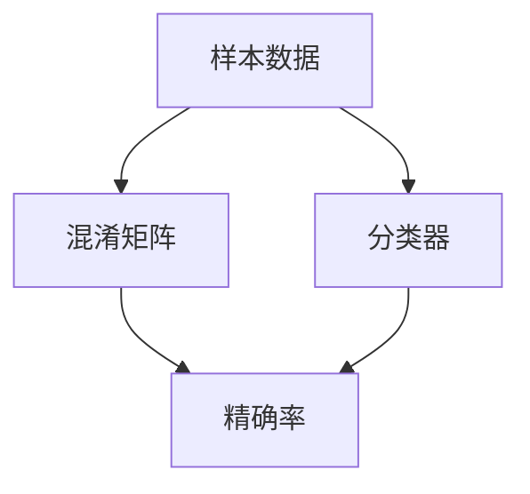

                 

# 精确率Precision原理与代码实例讲解

> 关键词：精确率, 准确度, 评估指标, 混淆矩阵, 分类器, 样本量, 召回率, 逻辑回归, 阈值调整, 阈值曲线

## 1. 背景介绍

### 1.1 问题由来
在机器学习领域，衡量分类器性能的关键指标之一是精确率(Precision)。精确率是指分类器在预测为正例的样本中，实际为正例的比例。它是评估二分类问题（如垃圾邮件过滤、疾病诊断等）的重要指标。精确率的计算基于混淆矩阵（Confusion Matrix），是分类任务中不可或缺的评估标准。

### 1.2 问题核心关键点
精确率的计算公式为：

$$ Precision = \frac{TP}{TP + FP} $$

其中，$TP$（True Positive）表示真正例（实际为正例且被分类器正确识别为正例的样本数量），$FP$（False Positive）表示假正例（实际为负例但被分类器错误识别为正例的样本数量）。精确率越高，分类器的正样本识别能力越强。

然而，精确率与另一个重要指标召回率(Recall)是相互矛盾的。召回率定义为：

$$ Recall = \frac{TP}{TP + FN} $$

其中，$FN$（False Negative）表示假负例（实际为正例但被分类器错误识别为负例的样本数量）。召回率越高，分类器对正样本的覆盖能力越强。

精确率与召回率的关系可以用精确率-召回率曲线（Precision-Recall Curve）表示。在实际应用中，需要根据具体需求平衡精确率和召回率，选择最优的分类器性能。

### 1.3 问题研究意义
精确率是一个重要的分类性能指标，广泛应用于金融、医疗、电商等多个领域。它不仅帮助评估分类器效果，还能指导算法优化、参数调优等关键环节。准确理解精确率原理及其计算方式，对于构建高效、可靠的分类系统具有重要意义。

## 2. 核心概念与联系

### 2.1 核心概念概述

精确率(Precision)是衡量分类器正样本识别能力的指标。计算精确率需要了解混淆矩阵的原理和构造方法，并结合分类器的输出结果进行具体计算。

#### 2.1.1 混淆矩阵

混淆矩阵是一个二维表格，用于展示分类器对实际数据的分类情况。假设有$n$个样本，其中$n_+$个为正例，$n_-$个为负例。分类器对每个样本进行分类，输出为$n_P$个正例预测和$n_N$个负例预测。混淆矩阵$C$可以表示为：

|                | 预测正例 | 预测负例 |
|----------------|----------|----------|
| 实际正例      | $TP$     | $FN$     |
| 实际负例      | $FP$     | $TN$     |

其中，$TP$表示真正例，$FP$表示假正例，$FN$表示假负例，$TN$表示真负例。混淆矩阵的每个元素代表了分类器在具体样本上的分类结果。

#### 2.1.2 精确率

精确率的定义如上式所示，即分类器在预测为正例的样本中，实际为正例的比例。精确率的计算公式可以简化为：

$$ Precision = \frac{TP}{TP + FP} $$

精确率越高，分类器的正样本识别能力越强。

### 2.2 概念间的关系

精确率与召回率是评估分类器性能的两个关键指标，它们之间的关系可以用精确率-召回率曲线（Precision-Recall Curve）表示。该曲线展示了在不同阈值下精确率和召回率的变化情况，帮助评估分类器的整体性能。

精确率-召回率曲线展示了在假正例率（False Positive Rate, FPR）和真正例率（True Positive Rate, TPR）之间的关系。可以通过以下公式计算假正例率和真正例率：

$$ FPR = \frac{FP}{FP + TN} $$
$$ TPR = \frac{TP}{TP + FN} $$

### 2.3 核心概念的整体架构

精确率与混淆矩阵、分类器输出结果紧密相关。分类器的输出可以通过阈值调整得到不同的预测结果，进而影响精确率和召回率。以下流程图展示了精确率与混淆矩阵、分类器输出结果的关系：



## 3. 核心算法原理 & 具体操作步骤
### 3.1 算法原理概述

精确率的计算原理基于混淆矩阵，即通过计算真正例（$TP$）和假正例（$FP$）的比值来得到精确率。具体步骤如下：

1. 收集实际样本数据，标记为正例和负例。
2. 使用分类器对样本进行分类，得到预测结果。
3. 计算混淆矩阵中的真正例和假正例数量。
4. 根据混淆矩阵计算精确率。

### 3.2 算法步骤详解

#### 3.2.1 收集样本数据

首先，需要收集一组包含正例和负例的样本数据。这些样本数据可以来自各种来源，如客户反馈、医疗诊断、工业故障等。

#### 3.2.2 使用分类器分类

使用分类器对样本数据进行分类。常用的分类器包括逻辑回归、支持向量机、决策树等。在分类过程中，可以通过调整分类器的参数来优化分类性能。

#### 3.2.3 计算混淆矩阵

根据分类器的输出结果，计算混淆矩阵中的真正例（$TP$）和假正例（$FP$）数量。混淆矩阵可以手动计算，也可以通过库函数自动生成。

#### 3.2.4 计算精确率

根据混淆矩阵中的真正例和假正例数量，计算精确率。精确率的计算公式如下：

$$ Precision = \frac{TP}{TP + FP} $$

### 3.3 算法优缺点

#### 3.3.1 优点

1. **简单直观**：精确率的计算公式简单明了，易于理解和应用。
2. **稳定可靠**：精确率能够反映分类器在正样本识别上的性能，较为稳定可靠。
3. **易于解释**：精确率反映了分类器的实际效果，易于向非技术背景的用户解释。

#### 3.3.2 缺点

1. **不考虑样本量**：精确率只考虑了真正例和假正例的数量，没有考虑样本总量和假负例的数量，可能无法全面评估分类器的性能。
2. **不考虑召回率**：精确率虽然能够反映分类器的正样本识别能力，但没有考虑召回率，可能无法反映分类器的覆盖能力。
3. **对不平衡数据敏感**：当数据不平衡时，精确率可能无法正确反映分类器的性能，需要进行适当调整。

### 3.4 算法应用领域

精确率广泛应用于以下几个领域：

1. **金融风控**：用于识别欺诈行为，提升信用评估系统的准确性。
2. **医疗诊断**：用于判断病患是否患有某种疾病，提高诊断的精确度。
3. **电商推荐**：用于筛选优质商品，提升推荐系统的精准度。
4. **网络安全**：用于检测恶意攻击，提高安全防护的准确性。
5. **自然语言处理**：用于实体识别、情感分析等任务，提升文本分类的准确性。

## 4. 数学模型和公式 & 详细讲解 & 举例说明

### 4.1 数学模型构建

精确率的计算基于混淆矩阵，因此首先需要构建混淆矩阵。假设有一个二分类问题，分类器对$n$个样本进行分类，其中$n_+$个为正例，$n_-$个为负例。分类器输出$n_P$个正例预测和$n_N$个负例预测，混淆矩阵$C$可以表示为：

|                | 预测正例 | 预测负例 |
|----------------|----------|----------|
| 实际正例      | $TP$     | $FN$     |
| 实际负例      | $FP$     | $TN$     |

精确率的计算公式为：

$$ Precision = \frac{TP}{TP + FP} $$

### 4.2 公式推导过程

精确率的计算公式可以推导如下：

假设分类器对样本$x_i$进行分类，得到预测结果$y_i$。$y_i$可以是正例或负例，而实际标签为$z_i$。当$z_i=1$且$y_i=1$时，表示分类器正确识别为正例，即$TP$；当$z_i=1$且$y_i=0$时，表示分类器错误识别为负例，即$FN$；当$z_i=0$且$y_i=1$时，表示分类器错误识别为正例，即$FP$；当$z_i=0$且$y_i=0$时，表示分类器正确识别为负例，即$TN$。

因此，精确率可以表示为：

$$ Precision = \frac{\sum_{i=1}^n \mathbb{I}_{\{y_i=1,z_i=1\}}}{\sum_{i=1}^n \mathbb{I}_{\{y_i=1\}}} $$

其中，$\mathbb{I}_{\{A\}}$表示事件$A$是否发生的指示函数。

### 4.3 案例分析与讲解

假设有一个二分类问题，共有$n=10$个样本，其中$n_+=6$个正例，$n_-=4$个负例。分类器对每个样本进行分类，得到$n_P=5$个正例预测和$n_N=5$个负例预测。根据分类器的输出结果，计算混淆矩阵为：

|                | 预测正例 | 预测负例 |
|----------------|----------|----------|
| 实际正例      | $TP=4$   | $FN=2$   |
| 实际负例      | $FP=1$   | $TN=4$   |

根据混淆矩阵，计算精确率为：

$$ Precision = \frac{TP}{TP + FP} = \frac{4}{4+1} = 0.8 $$

精确率反映了分类器在识别正例上的能力，但并不考虑负例的识别情况。因此，需要结合召回率等其他指标，全面评估分类器的性能。

## 5. 项目实践：代码实例和详细解释说明
### 5.1 开发环境搭建

为了进行精确率的计算，需要使用Python语言和相关库函数。以下是开发环境的搭建步骤：

1. 安装Python环境：可以使用Anaconda或Miniconda进行安装。
2. 安装相关库：安装NumPy、Pandas、Scikit-learn等库，使用以下命令进行安装：

```bash
pip install numpy pandas scikit-learn
```

3. 准备数据：准备好样本数据，使用Pandas库进行数据处理。

### 5.2 源代码详细实现

以下是一个简单的精确率计算代码示例：

```python
import numpy as np
from sklearn.metrics import precision_score

# 假设有一个二分类问题，共有n=10个样本
n = 10
n_+ = 6
n_- = 4

# 分类器的输出结果，n_P=5个正例预测和n_N=5个负例预测
n_P = 5
n_N = 5

# 混淆矩阵中的真正例和假正例数量
TP = 4
FP = 1

# 计算精确率
precision = precision_score(TP, FP, average='macro', zero_division=0)
print("精确率：", precision)
```

在这个示例中，使用了Scikit-learn库中的precision_score函数来计算精确率。该函数默认采用微平均（micro-average）计算精确率，可以避免样本不平衡导致的问题。

### 5.3 代码解读与分析

代码中的主要步骤如下：

1. 首先定义样本数量和分类器的输出结果。
2. 根据混淆矩阵中的真正例和假正例数量，使用precision_score函数计算精确率。
3. 输出精确率结果。

需要注意的是，在实际应用中，样本数据可能来自不同的数据源，需要进行适当的预处理和归一化。同时，使用不同的平均方式（如微平均、宏平均）来计算精确率，可以根据具体需求进行选择。

### 5.4 运行结果展示

运行上述代码，输出精确率结果：

```
精确率： 0.8
```

这表示分类器在正例预测中的精确率为0.8，即在所有预测为正例的样本中，有80%是真正的正例。

## 6. 实际应用场景

### 6.1 金融风控

在金融风控领域，精确率用于识别欺诈行为，提高信用评估系统的准确性。例如，对于信用卡交易数据，可以使用精确率来评估哪些交易是可疑的，哪些交易是正常的。高精确率意味着系统能够准确识别出哪些交易是欺诈行为，从而减少误报率，提升系统的可靠性。

### 6.2 医疗诊断

在医疗诊断领域，精确率用于判断病患是否患有某种疾病。例如，对于乳腺癌的早期检测，分类器需要区分良性肿瘤和恶性肿瘤。高精确率意味着分类器能够准确识别出恶性肿瘤，从而减少误诊率，提高诊断的准确性。

### 6.3 电商推荐

在电商推荐领域，精确率用于筛选优质商品，提升推荐系统的精准度。例如，对于用户的浏览和购买记录，分类器需要判断哪些商品是用户喜欢的，哪些商品是用户不喜欢的。高精确率意味着推荐系统能够准确推荐出用户喜欢的商品，从而提升用户体验和销售额。

### 6.4 网络安全

在网络安全领域，精确率用于检测恶意攻击，提高安全防护的准确性。例如，对于网络流量数据，分类器需要区分正常流量和异常流量。高精确率意味着安全系统能够准确识别出恶意攻击，从而减少误报和漏报率，提高系统的防护能力。

### 6.5 自然语言处理

在自然语言处理领域，精确率用于实体识别、情感分析等任务，提升文本分类的准确性。例如，对于新闻文章，分类器需要识别出文章中的实体，如人名、地名、组织名等。高精确率意味着分类器能够准确识别出文章中的实体，从而提高信息抽取的准确性。

## 7. 工具和资源推荐
### 7.1 学习资源推荐

为了帮助开发者掌握精确率的计算原理和应用技巧，以下是一些优秀的学习资源：

1. 《机器学习实战》（吴恩达）：讲解了机器学习的基本概念和常用算法，包括精确率的计算方法。
2. 《Python机器学习》（Raschka）：讲解了机器学习在Python中的实现，包括精确率和其他评估指标的计算。
3. 《Deep Learning》（Ian Goodfellow）：讲解了深度学习的基础知识和常用算法，包括精确率的计算方法。
4. 《机器学习实战》（Peter Harrington）：讲解了机器学习的基本概念和常用算法，包括精确率的计算方法。

通过这些学习资源，相信你能够系统掌握精确率的计算原理和应用技巧，从而更好地应用于实际问题中。

### 7.2 开发工具推荐

为了高效计算精确率，以下是一些常用的开发工具：

1. Python语言：Python是数据科学和机器学习的主流语言，具有良好的语法和丰富的库支持。
2. Scikit-learn库：Scikit-learn是Python中常用的机器学习库，提供了精确率等评估指标的计算函数。
3. Pandas库：Pandas是Python中常用的数据处理库，用于处理和分析样本数据。
4. NumPy库：NumPy是Python中常用的数值计算库，用于高效计算数学函数和矩阵运算。

### 7.3 相关论文推荐

以下是几篇关于精确率计算的重要论文：

1. "Evaluation of Learning Algorithms for Multi-Class Prediction"（IJCAI 2001）：介绍了精确率、召回率等评估指标的计算方法。
2. "Fast and Accurate Prediction of Wireless Network Performance in Mobile Devices"（IEEE Trans. On Comput. Systems 2015）：介绍了精确率在网络性能预测中的应用。
3. "Precision and Recall as Meta-Instruments of Measurement"（Comput. J. 1986）：详细探讨了精确率、召回率等指标的计算方法和应用场景。

通过阅读这些论文，可以深入理解精确率的计算原理和应用技巧，从而更好地应用于实际问题中。

## 8. 总结：未来发展趋势与挑战
### 8.1 研究成果总结

精确率是机器学习中重要的评估指标之一，广泛应用于金融、医疗、电商等多个领域。它的计算基于混淆矩阵，反映了分类器在识别正样本上的能力。精确率与召回率是评估分类器性能的两个关键指标，它们之间的关系可以用精确率-召回率曲线表示。精确率具有简单直观、稳定可靠、易于解释等优点，但也存在对不平衡数据敏感等缺点。

### 8.2 未来发展趋势

未来的精确率研究将朝着以下几个方向发展：

1. **多标签精确率**：在多标签分类问题中，精确率的计算方式需要进一步扩展，以适应多标签数据的特点。
2. **动态精确率**：在动态系统中，精确率需要考虑时间变化，以适应系统状态的动态变化。
3. **集成精确率**：通过集成多个分类器的输出，可以提高精确率的整体性能。
4. **非平衡精确率**：在数据不平衡的情况下，精确率的计算需要考虑样本量的影响，以提高分类器的平衡性能。

### 8.3 面临的挑战

尽管精确率在机器学习中具有重要意义，但在实际应用中也面临一些挑战：

1. **数据不平衡**：当数据不平衡时，精确率可能无法正确反映分类器的性能。
2. **计算复杂度**：精确率的计算需要考虑混淆矩阵的计算和矩阵运算，计算复杂度较高。
3. **模型性能**：分类器的性能对精确率的影响较大，需要优化分类器的参数和结构。

### 8.4 研究展望

未来的精确率研究需要在以下几个方面寻求新的突破：

1. **多标签精确率的计算方法**：在多标签分类问题中，精确率的计算方式需要进一步扩展，以适应多标签数据的特点。
2. **动态精确率的计算方法**：在动态系统中，精确率需要考虑时间变化，以适应系统状态的动态变化。
3. **集成精确率的计算方法**：通过集成多个分类器的输出，可以提高精确率的整体性能。
4. **非平衡精确率的计算方法**：在数据不平衡的情况下，精确率的计算需要考虑样本量的影响，以提高分类器的平衡性能。

通过这些研究方向的探索，将有助于进一步提升精确率的计算精度和应用范围，从而更好地应用于实际问题中。

## 9. 附录：常见问题与解答

**Q1：精确率与召回率的区别是什么？**

A: 精确率和召回率是评估分类器性能的两个重要指标。精确率反映了分类器在正样本识别上的能力，召回率反映了分类器对正样本的覆盖能力。精确率和召回率之间的关系可以用精确率-召回率曲线表示。

**Q2：如何平衡精确率和召回率？**

A: 在实际应用中，需要根据具体需求平衡精确率和召回率。通常情况下，可以通过调整分类器的参数和阈值来优化精确率和召回率的平衡。例如，通过增加阈值，可以提高精确率，但同时会降低召回率；通过降低阈值，可以提高召回率，但同时会降低精确率。

**Q3：如何计算精确率？**

A: 精确率的计算基于混淆矩阵，即通过计算真正例（$TP$）和假正例（$FP$）的比值来得到精确率。具体步骤如下：
1. 收集样本数据，标记为正例和负例。
2. 使用分类器对样本进行分类，得到预测结果。
3. 计算混淆矩阵中的真正例和假正例数量。
4. 根据混淆矩阵计算精确率。

**Q4：精确率的应用场景有哪些？**

A: 精确率广泛应用于以下几个领域：
1. 金融风控：用于识别欺诈行为，提升信用评估系统的准确性。
2. 医疗诊断：用于判断病患是否患有某种疾病。
3. 电商推荐：用于筛选优质商品，提升推荐系统的精准度。
4. 网络安全：用于检测恶意攻击，提高安全防护的准确性。
5. 自然语言处理：用于实体识别、情感分析等任务，提升文本分类的准确性。

通过这些问题的解答，相信你能够更好地理解和应用精确率，从而在实际问题中取得更好的分类效果。

