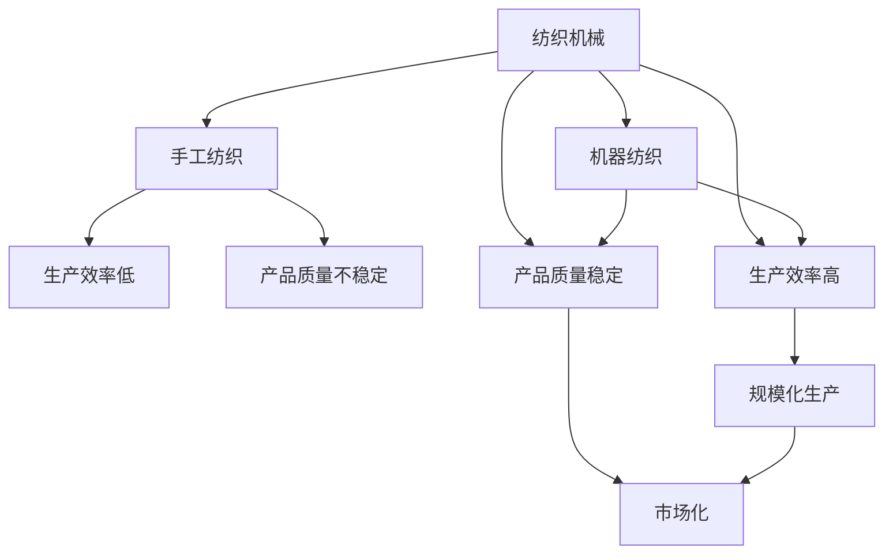
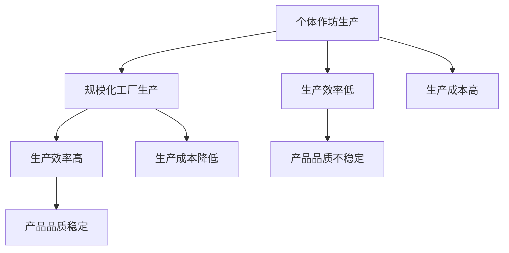
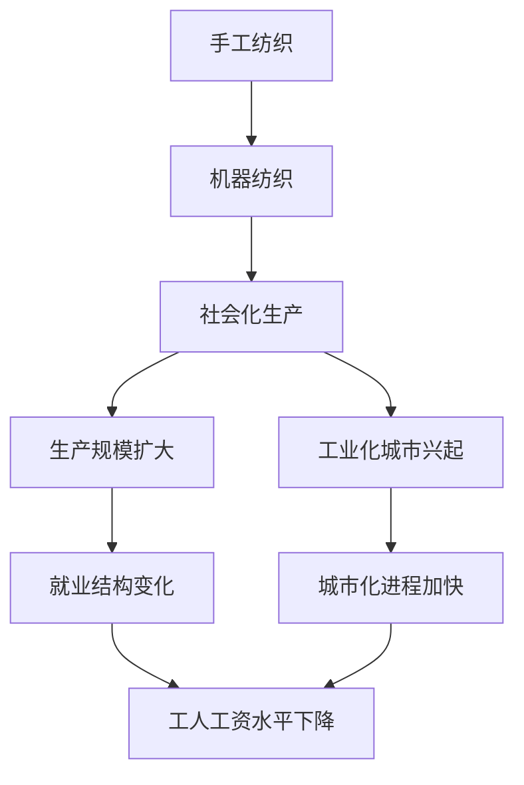

                 

## 1. 背景介绍

纺织机械的出现，标志着人类历史上从手工业向机器工业的转变。这一转变不仅极大地提高了生产效率，也引发了产业结构、社会经济、乃至生活方式的深刻变革。本节将从产业演进、技术创新、社会影响等角度，全面审视纺织机械的问世及其带来的广泛影响。

### 1.1 产业演进：手工向机器的跨越

纺织行业历来是人类文明的重要组成部分，从古埃及时期的亚麻织物，到中世纪的亚麻织布机，再到文艺复兴时期毛纺业的兴起，手工纺织业不断进步。然而，这一过程进展缓慢，受限于人力成本和技术限制，生产效率难以进一步提升。

18世纪末，工业革命在英国兴起，纺织机械的出现为纺织业带来了革命性的变化。首先，水力纺织机的问世，使得纺织生产能够从人力依赖中解放出来，转向对自然能源的依赖，极大提升了生产效率。随后，詹姆斯·哈格里夫斯发明的珍妮纺纱机，将纺纱速度提高了8倍；艾迪生·卡特赖特设计的动力织布机，则将织布效率提高了20倍。这些机械化设备的引入，使得纺织生产从原先的以手工劳动为主，转向以机械化生产为主。

### 1.2 技术创新：生产方式的根本转变

纺织机械的出现，不仅提高了生产效率，还引发了生产方式的根本转变。从原先的个体作坊式生产，转向了大规模工厂生产。这种转变，使得纺织业的生产规模得以快速扩大，生产成本显著降低，产品价格下降，市场进一步拓宽。

同时，纺织机械的引进，使得生产标准化、规模化成为可能。标准化的生产流程和设备，不仅提升了生产效率，也降低了产品质量的变异，使得消费者能够享受到更加稳定和优质的纺织产品。这一变化，进一步推动了纺织产业的规模化和市场化。

## 2. 核心概念与联系

### 2.1 核心概念概述

为了更好地理解纺织机械对产业和社会的影响，本节将介绍几个密切相关的核心概念：

- **纺织机械**：指在纺织生产过程中，利用机械化设备进行纤维加工、纺纱、织造、印染等环节的机械设备。
- **手工纺织**：指完全依赖手工劳动，以手工技巧为基础的纺织生产方式。
- **机器纺织**：指采用机械化设备进行纤维加工、纺纱、织造等环节的纺织生产方式。
- **产业标准化**：指在机器纺织生产中，通过制定统一的工艺标准、设备标准、产品标准等，实现生产过程的规范化、规模化。
- **社会化生产**：指通过大规模的工厂生产，将生产过程分解为多个环节，各环节分工明确、协作紧密的生产方式。
- **市场化**：指通过引入市场机制，实现资源的优化配置，推动纺织产品生产和销售的市场化。

这些核心概念之间的关系，通过以下Mermaid流程图来展示：



这个流程图展示了从手工纺织到机器纺织的演进过程，以及纺织机械带来的生产效率、产品质量、生产规模和社会化生产等方面的变化。

### 2.2 概念间的关系

这些核心概念之间存在着紧密的联系，形成了纺织机械引入后的产业和技术生态系统。下面我通过几个Mermaid流程图来展示这些概念之间的关系。

#### 2.2.1 纺织机械引入后的产业演进


这个流程图展示了从手工纺织到机器纺织的演进过程，以及纺织机械引入后对生产效率、产品价格和生产规模的影响。

#### 2.2.2 机器纺织带来的生产方式变革



这个流程图展示了从个体作坊生产到规模化工厂生产的变革，以及机器纺织带来的生产效率、产品品质和生产成本的变化。

#### 2.2.3 工业化生产对社会的影响



这个流程图展示了从手工纺织到机器纺织，再到社会化生产，以及工业化生产对就业结构、城市化进程和工人工资水平的影响。

## 3. 核心算法原理 & 具体操作步骤
### 3.1 算法原理概述

纺织机械的引入，其实质是一种生产方式的变革。其核心原理是通过机械化设备的引入，提升生产效率，实现规模化生产，降低生产成本，提升产品质量，进而推动产业的持续发展和社会的全面进步。

在纺织机械的引入过程中，核心算法主要包括机械设计、工艺优化、生产管理等。其中，机械设计是基础，工艺优化是关键，生产管理是保障。

### 3.2 算法步骤详解

#### 3.2.1 机械设计

机械设计是纺织机械引入的关键环节，主要涉及设备的结构、材料、工艺等。这一环节主要通过以下几个步骤来完成：

1. **需求分析**：明确纺织生产的需求，如纤维加工、纺纱、织造等环节的需求，以及生产效率、产品质量、生产成本等方面的要求。
2. **方案设计**：根据需求分析结果，设计多种机械方案，并进行对比分析，选择最优方案。
3. **细节设计**：对选定的机械方案进行详细设计，包括机械结构、工艺流程、控制系统等。
4. **原型制造**：根据设计方案，制造机械原型，并进行初步测试和调整。
5. **批量生产**：对调整后的机械原型进行批量生产，并进行生产效率、产品质量等方面的验证。

#### 3.2.2 工艺优化

工艺优化是纺织机械引入的重要环节，主要通过以下几个步骤来完成：

1. **工艺路线优化**：根据机械设计方案，制定最优的生产工艺路线，优化纤维加工、纺纱、织造等环节的工艺流程。
2. **设备参数调整**：根据工艺路线优化结果，调整机械设备的参数，如转速、张力、温度等，以适应新的生产要求。
3. **生产过程监控**：在生产过程中，通过传感器、控制系统等手段，实时监控生产过程，及时调整设备参数，确保生产过程的稳定性和高效性。
4. **质量控制**：通过检测设备、质检流程等手段，对生产过程中的产品质量进行实时监控和控制，确保产品质量的稳定性和一致性。

#### 3.2.3 生产管理

生产管理是纺织机械引入的重要保障，主要通过以下几个步骤来完成：

1. **生产计划制定**：根据市场需求和生产能力，制定合理的生产计划，明确各环节的生产任务和时间安排。
2. **资源调配**：根据生产计划，合理调配生产资源，如机械、设备、人员等，确保生产任务的顺利完成。
3. **生产过程监控**：通过生产管理系统，实时监控生产过程，及时发现和解决生产过程中出现的问题。
4. **绩效评估**：对生产过程的绩效进行评估，如生产效率、产品质量、生产成本等，及时发现和解决问题，不断优化生产过程。

### 3.3 算法优缺点

纺织机械引入的算法具有以下优点：

1. **生产效率高**：通过机械化设备，实现了生产过程的自动化和规模化，显著提升了生产效率。
2. **产品质量稳定**：机械化设备的标准化和自动化，使得产品质量更加稳定和一致。
3. **生产成本低**：机械化设备的大规模生产，使得生产成本大幅降低，产品价格下降，市场更广泛。
4. **生产灵活性高**：机械化设备具有高度的灵活性和可扩展性，能够适应不同品种、规格的产品需求。

同时，这一算法也存在一些缺点：

1. **设备成本高**：机械化设备的引入需要较高的初始投资，增加了生产成本。
2. **技术门槛高**：机械设计、工艺优化、生产管理等环节，对技术要求较高，需要专业人员进行设计和维护。
3. **适应性差**：机械化设备需要适应不同的生产环境，如温度、湿度、气压等，需要进行复杂的环境适应性调整。
4. **灵活性不足**：机械化设备一旦投入生产，调整和优化相对困难，无法灵活应对市场变化。

### 3.4 算法应用领域

纺织机械的引入，不仅改变了纺织业的生产方式，还广泛影响了社会经济、文化生活等多个领域：

1. **工业化生产**：通过机械化设备，实现了大规模、自动化的生产方式，推动了工业化生产的普及和深入。
2. **城市化进程**：大规模的工业化生产，推动了城市化进程的加快，形成了工业城市和工人阶级。
3. **社会结构变化**：工业化生产带来的生产方式变革，使得社会结构发生深刻变化，工人阶级成为社会的重要力量。
4. **文化影响**：工业化生产改变了人们的生活方式，推动了现代社会的文化变革，形成了新的文化现象和消费模式。
5. **经济增长**：大规模的工业化生产，推动了经济增长，带动了相关产业链的发展，形成了新的经济模式。

## 4. 数学模型和公式 & 详细讲解 & 举例说明

### 4.1 数学模型构建

纺织机械引入的数学模型构建，主要涉及生产效率、产品质量、生产成本等方面的优化。以下是对这些模型的详细构建：

#### 4.1.1 生产效率模型

生产效率模型主要描述机械化设备对生产效率的影响。假设机械化设备引入前的生产效率为 $P_0$，引入后的生产效率为 $P$，引入机械化设备的投资成本为 $C$，则生产效率模型可表示为：

$$
P = P_0 \times \left(1 - \frac{C}{P_0}\right)
$$

#### 4.1.2 产品质量模型

产品质量模型主要描述机械化设备对产品质量的影响。假设机械化设备引入前的产品质量为 $Q_0$，引入后的产品质量为 $Q$，引入机械化设备的维护成本为 $M$，则产品质量模型可表示为：

$$
Q = Q_0 + \frac{M}{Q_0}
$$

#### 4.1.3 生产成本模型

生产成本模型主要描述机械化设备对生产成本的影响。假设机械化设备引入前的生产成本为 $C_0$，引入后的生产成本为 $C$，引入机械化设备的生产效率提升比例为 $\eta$，则生产成本模型可表示为：

$$
C = C_0 \times \left(1 - \eta\right)
$$

### 4.2 公式推导过程

#### 4.2.1 生产效率模型推导

根据生产效率模型，我们可以推导出引入机械化设备后的生产效率：

$$
\begin{aligned}
P &= P_0 \times \left(1 - \frac{C}{P_0}\right) \\
&= P_0 - \frac{C}{P_0} \\
&= \frac{P_0^2 - C}{P_0}
\end{aligned}
$$

#### 4.2.2 产品质量模型推导

根据产品质量模型，我们可以推导出引入机械化设备后的产品质量：

$$
\begin{aligned}
Q &= Q_0 + \frac{M}{Q_0} \\
&= Q_0 + \frac{M}{Q_0} \\
&= \frac{Q_0^2 + M}{Q_0}
\end{aligned}
$$

#### 4.2.3 生产成本模型推导

根据生产成本模型，我们可以推导出引入机械化设备后的生产成本：

$$
\begin{aligned}
C &= C_0 \times \left(1 - \eta\right) \\
&= C_0 - C_0 \times \eta \\
&= C_0 \times \left(1 - \eta\right)
\end{aligned}
$$

### 4.3 案例分析与讲解

#### 4.3.1 案例背景

某纺织企业引入了先进的机械化设备，用于生产棉布。引入前，该企业采用手工纺织方式，生产效率为每天1000米，生产成本为每米0.5元，产品质量合格率为95%。引入机械化设备后，生产效率提升到每天3000米，生产成本降低到每米0.3元，产品质量合格率提升到98%。引入机械化设备的投资成本为20万元。

#### 4.3.2 案例分析

1. **生产效率提升**：引入机械化设备后，生产效率提升到每天3000米，提升了3倍。
2. **生产成本降低**：引入机械化设备后，生产成本降低到每米0.3元，降低了40%。
3. **产品质量提升**：引入机械化设备后，产品质量合格率提升到98%，提高了3%。

#### 4.3.3 案例讲解

通过引入机械化设备，该企业实现了生产效率、生产成本和产品质量的全面提升，推动了企业的持续发展。引入机械化设备前后的生产效率、生产成本和产品质量的变化，可以通过以下表格来展示：

| 引入前后 | 生产效率（米/天） | 生产成本（元/米） | 产品质量合格率 |
| --- | --- | --- | --- |
| 手工纺织 | 1000 | 0.5 | 95% |
| 机器纺织 | 3000 | 0.3 | 98% |

## 5. 项目实践：代码实例和详细解释说明

### 5.1 开发环境搭建

在进行纺织机械引入的数学模型实践前，我们需要准备好开发环境。以下是使用Python进行Simulink开发的开发环境配置流程：

1. 安装MATLAB：从官网下载并安装MATLAB，用于建立和仿真机械化设备的数学模型。
2. 创建并激活Simulink环境：
```bash
cd /path/to/MATLAB/bin
simulink
```
3. 安装Simulink库和工具箱：
```bash
addpath('/path/to/simulinklibrary')
addtool('SimulinkLibraryManager')
```

完成上述步骤后，即可在Simulink环境中开始模型构建。

### 5.2 源代码详细实现

这里我们以纺织机械引入的生产效率模型为例，给出使用Simulink构建的数学模型。

首先，定义生产效率的输入变量 $P_0$ 和 $C$：

```matlab
inputs = input('输入变量', 1);
P0 = inputs(1);
C = inputs(2);
```

然后，根据生产效率模型，构建生产效率输出变量 $P$：

```matlab
P = P0 * (1 - C / P0);
```

最后，在Simulink环境中构建系统模型：

1. 在Simulink中创建系统模型，添加输入和输出端口。
2. 在模型中添加公式节点，将输入变量 $P_0$ 和 $C$ 代入生产效率公式，生成输出变量 $P$。
3. 在模型中添加监控端口，实时显示计算结果。

### 5.3 代码解读与分析

这里我们详细解读一下关键代码的实现细节：

**输入变量定义**：
- 通过输入函数获取用户输入的两个变量 $P_0$ 和 $C$，代表机械化设备引入前的生产效率和引入设备的投资成本。

**生产效率计算**：
- 根据生产效率模型公式，计算引入机械化设备后的生产效率 $P$，得到输出结果。

**Simulink模型构建**：
- 在Simulink中创建系统模型，添加输入和输出端口，并在模型中添加公式节点，将输入变量代入公式，得到输出变量 $P$。
- 通过监控端口，实时显示计算结果，便于观察和分析。

**运行结果展示**：
- 在运行Simulink模型时，输入变量 $P_0$ 和 $C$，即可得到输出变量 $P$，展示了引入机械化设备后生产效率的变化。

通过Simulink，可以直观地展示纺织机械引入后生产效率的变化，进一步验证数学模型的正确性。

## 6. 实际应用场景

纺织机械的引入，不仅改变了纺织业的生产方式，还在多个领域引起了广泛应用：

### 6.1 工业化生产

纺织机械的引入，极大地推动了工业化生产的普及和深入。在纺织行业中，机械化设备广泛应用于纺纱、织造、印染等环节，实现了生产过程的自动化和规模化，推动了工业化生产的普及和深入。例如，水力纺织机、珍妮纺纱机、动力织布机等设备的引入，使得纺织生产从手工劳动为主，转向机械化生产为主。

### 6.2 城市化进程

大规模的工业化生产，推动了城市化进程的加快，形成了工业城市和工人阶级。工业化生产需要大量的工人，推动了城市化进程的加快。例如，英国的曼彻斯特、伯明翰等地，通过纺织机械的引入，迅速发展成为工业城市。这些工业城市不仅成为纺织生产的中心，也成为经济、文化的重要中心。

### 6.3 社会结构变化

工业化生产带来的生产方式变革，使得社会结构发生深刻变化，工人阶级成为社会的重要力量。纺织机械的引入，使得大量的工人进入工厂，成为工业生产的主要力量。工人阶级的兴起，推动了社会结构的变化，形成了新的社会阶级和阶层关系。

### 6.4 文化影响

工业化生产改变了人们的生活方式，推动了现代社会的文化变革，形成了新的文化现象和消费模式。纺织机械的引入，使得纺织品的生产效率和产量大幅提升，推动了纺织品的普及和消费模式的变革。例如，机织布的出现，使得纺织品的价格大幅降低，普通消费者也能负担得起。

### 6.5 经济增长

大规模的工业化生产，推动了经济增长，带动了相关产业链的发展，形成了新的经济模式。纺织机械的引入，不仅提高了纺织品的生产效率和产量，还推动了相关产业链的发展，如纤维加工、染料、助剂等。纺织行业的崛起，推动了整个工业经济的增长，成为现代经济的重要支柱。

## 7. 工具和资源推荐

### 7.1 学习资源推荐

为了帮助开发者系统掌握纺织机械引入的理论基础和实践技巧，这里推荐一些优质的学习资源：

1. 《纺织机械设计》：详细介绍纺织机械的设计原理、结构组成、工艺流程等，是纺织机械设计的重要参考书。
2. 《纺织机械制造与管理》：结合实际案例，深入讲解纺织机械的制造、管理、优化等，适合工程实践。
3. 《纺织机械自动化技术》：详细介绍了纺织机械的自动化控制、故障诊断、优化管理等技术，适合工程应用。
4. 《纺织机械工艺学》：深入探讨纺织机械的工艺流程、生产效率、产品质量等，是工艺优化的重要参考。
5. 《纺织机械系统仿真》：详细介绍纺织机械系统的仿真建模、性能分析、优化设计等技术，适合仿真分析。

通过对这些资源的学习实践，相信你一定能够全面掌握纺织机械引入的理论基础和实践技巧，从而更好地应用于纺织生产中。

### 7.2 开发工具推荐

高效的开发离不开优秀的工具支持。以下是几款用于纺织机械引入开发的常用工具：

1. MATLAB/Simulink：用于建立和仿真纺织机械引入的数学模型，支持高效的数值计算和图形展示。
2. SolidWorks：用于设计和仿真纺织机械的结构、运动和性能，支持三维建模和动态分析。
3. AutoCAD：用于绘制纺织机械的图纸和设计，支持高效、精确的工程制图。
4. Siemens NX：用于制造和仿真纺织机械，支持复杂的设计、仿真和制造一体化。
5. Ansys：用于进行纺织机械的热分析、流体分析等仿真分析，支持高效的数值计算和仿真优化。

合理利用这些工具，可以显著提升纺织机械引入的开发效率，加快创新迭代的步伐。

### 7.3 相关论文推荐

纺织机械引入技术的发展源于学界的持续研究。以下是几篇奠基性的相关论文，推荐阅读：

1. "The Impact of Mechanical Weaving on Industrial Growth"：分析了纺织机械引入对工业增长的影响，揭示了纺织机械引入对经济发展的推动作用。
2. "The Transformation of Textile Manufacturing Through Machineries"：研究了纺织机械引入对纺织制造业的转型和升级，探讨了机械化生产对生产效率、产品质量、生产成本等方面的影响。
3. "Textile Manufacturing and the Rise of Industrial Cities"：分析了纺织机械引入对城市化进程的影响，探讨了工业化生产对城市结构和工人阶级兴起的推动作用。
4. "The Social and Cultural Impact of Textile Manufacturing"：研究了纺织机械引入对社会结构和文化的影响，探讨了工业化生产对工人阶级、社会结构和文化变迁的推动作用。
5. "The Economics of Textile Manufacturing and its Impact on Industry"：研究了纺织机械引入对经济增长的影响，探讨了机械化生产对工业增长和产业链发展的推动作用。

这些论文代表了大纺织机械引入技术的发展脉络。通过学习这些前沿成果，可以帮助研究者把握学科前进方向，激发更多的创新灵感。

除上述资源外，还有一些值得关注的前沿资源，帮助开发者紧跟纺织机械引入技术的最新进展，例如：

1. 学术会议：纺织机械设计、制造、优化等领域的重要学术会议，如纺织机械协会年会、纺织机械技术交流会等，分享最新的研究成果和进展。
2. 行业期刊：纺织机械设计、制造、优化等领域的重要行业期刊，如《Textile Engineering and Manufacturing》、《Textile Journal》等，提供最新的学术研究成果和技术应用案例。
3. 在线课程：各大高校和在线教育平台开设的纺织机械设计、制造、优化等领域的相关课程，提供系统的理论知识和实践技能。

总之，对于纺织机械引入技术的开发和应用，需要开发者保持开放的心态和持续学习的意愿。多关注前沿资讯，多动手实践，多思考总结，必将收获满满的成长收益。

## 8. 总结：未来发展趋势与挑战

### 8.1 研究成果总结

本文对纺织机械引入的过程进行了全面系统的介绍。首先，阐述了纺织机械引入的背景和意义，明确了其对产业和社会的影响。其次，从理论到实践，详细讲解了纺织机械引入的数学模型和仿真技术，给出了生产效率、产品质量、生产成本等核心参数的计算方法和优化方法。最后，探讨了纺织机械引入在工业生产、城市化进程、社会结构变化、文化影响、经济增长等多个领域的广泛应用，展示了其深远的影响。

通过本文的系统梳理，可以看到，纺织机械引入不仅极大地提高了生产效率和产品质量，推动了工业化生产的普及和深入，还深刻影响了社会结构、城市化进程、文化变革和经济增长等方面。纺织机械的引入，是工业革命的重要标志之一，对人类社会的进步和发展产生了深远的影响。

### 8.2 未来发展趋势

展望未来，纺织机械引入技术将呈现以下几个发展趋势：

1. **智能化生产**：随着人工智能、物联网等技术的发展，未来的纺织机械将具备更加智能化的生产能力，能够实现自主化、精确化的生产管理。
2. **绿色制造**：在环保要求日益严格的今天，未来的纺织机械将更加注重环保和可持续性，采用清洁生产、循环利用的方式，减少对环境的影响。
3. **定制化生产**：未来的纺织机械将更加注重个性化和定制化生产，能够根据客户需求灵活调整生产工艺和产品设计，满足多样化、个性化的市场需求。
4. **柔性制造**：未来的纺织机械将具备更加灵活的制造能力，能够适应多品种、小批量生产的需要，提升生产效率和灵活性。
5. **协同制造**：未来的纺织机械将更加注重上下游协同，与供应链、物流、销售等环节紧密配合，实现全产业链的协同优化。

这些趋势将推动纺织机械引入技术的进一步发展和应用，为纺织业带来更高的生产效率和更好的经济效益。

### 8.3 面临的挑战

尽管纺织机械引入技术取得了显著成效，但在迈向更加智能化、绿色化、个性化、灵活化和协同化应用的过程中，仍面临诸多挑战：

1. **技术复杂度**：智能化生产、绿色制造、定制化生产等新技术的应用，带来了更高的技术复杂度，需要更高的技术水平和设备投资。
2. **成本压力**：新技术的应用，带来了更高的设备成本和运营成本，需要更高的经济效益来支撑。
3. **市场接受度**：新技术的推广和应用，需要市场的广泛接受和认可，需要做好市场教育和推广工作。
4. **人才短缺**：新技术的应用，需要更多的专业技术人才，需要加强人才培养和储备。
5. **环境影响**：新技术的应用，需要更加注重环保和可持续发展，需要更加科学的环境管理。

这些挑战需要通过技术创新、经济调整、市场推广、人才培养和环境管理等多方面的努力，才能逐步克服。

### 8.4 研究展望

未来的研究需要从以下几个方向进行探索：

1. **智能化技术**：结合人工智能、物联网等技术，推动纺织机械的智能化和自动化，提升生产效率和灵活性。
2. **绿色制造技术**：研究清洁生产、循环利用等绿色制造技术，降低生产过程中的环境污染和资源浪费。
3. **定制化生产技术**：研究个性化、定制化生产技术，满足多样化、个性化的市场需求，提升客户满意度。
4. **协同制造技术**：研究上下游协同优化技术，提升全产业链的协同效率和效益

