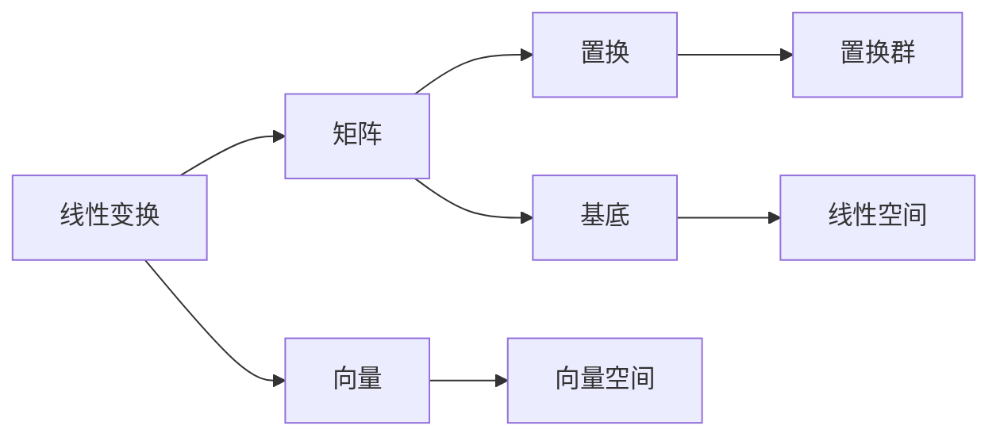
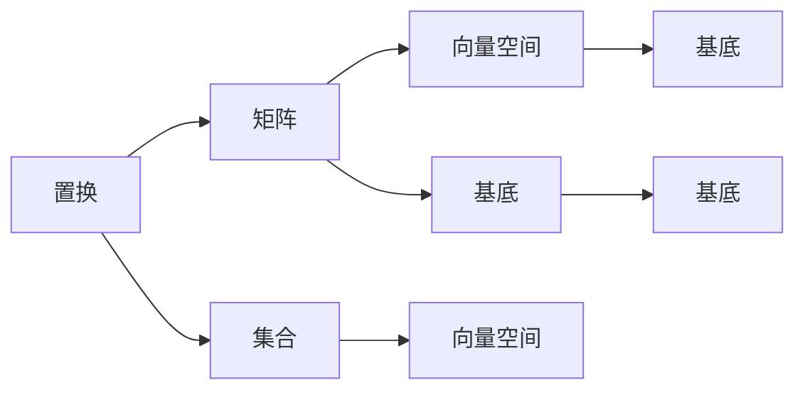
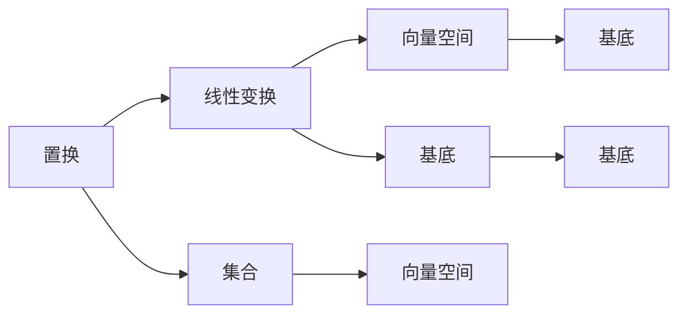

                 

# 线性代数导引：置换分解与置换符号

## 1. 背景介绍

置换在数学中是一个基本的概念，它描述了集合中元素的重新排列。在计算机科学中，置换也广泛应用于图形变换、密码学和算法设计等领域。本文将从线性代数的角度出发，探讨置换的数学性质，并详细介绍置换分解与置换符号的相关概念及其应用。

## 2. 核心概念与联系

### 2.1 核心概念概述

置换在数学中的定义如下：设 $S$ 是一个集合，如果存在一个双射（即一对一映射）$f: S \to S$，满足 $f(f(x)) = x, \forall x \in S$，那么称 $f$ 为集合 $S$ 的一个置换。

一个简单的例子是，将 $1, 2, 3, 4$ 这四个数字进行重新排列。例如，将它们排列为 $4, 1, 3, 2$，这就是一个置换。

### 2.2 核心概念间的联系

在代数和几何中，置换与线性变换密切相关。线性变换可以理解为对向量空间的线性映射，而置换则可以看作是对集合的线性映射。

对于向量空间 $\mathbb{V}$ 中的线性变换 $T$，若存在一个非零的基底 $\{v_1, v_2, \ldots, v_n\}$，使得 $T(v_i) = \sum_{j=1}^n a_{ij} v_j$，其中 $a_{ij}$ 是常数，则称 $T$ 为矩阵 $A = (a_{ij})$ 的线性变换。

这个关系可以用下图表示：



在这个图中，线性变换 $A$ 对应于矩阵 $B$，向量空间 $F$ 对应于基底 $E$，置换群 $G$ 对应于置换 $D$。

### 2.3 核心概念的整体架构

置换、线性变换和矩阵之间的关系可以用以下两个图来表示：

#### 2.3.1 置换与矩阵的关系



在这个图中，置换 $A$ 对应于矩阵 $B$，集合 $C$ 对应于向量空间 $F$，基底 $E$ 对应于基底 $G$ 和 $H$。

#### 2.3.2 置换与线性变换的关系



在这个图中，置换 $A$ 对应于线性变换 $B$，集合 $C$ 对应于向量空间 $F$，基底 $E$ 对应于基底 $G$ 和 $H$。

## 3. 核心算法原理 & 具体操作步骤

### 3.1 算法原理概述

置换的分解和符号计算是线性代数中的一个重要主题。置换可以通过多种方式进行分解，其中最常见的是循环分解和直积分解。置换的符号表示也广泛应用于组合学和计算复杂度理论中。

### 3.2 算法步骤详解

#### 3.2.1 循环分解

循环分解是一种将置换表示为若干个循环的乘积的方法。例如，对于置换 $(12)(34)$，可以表示为：

$$(12)(34) = (1 \, 2)(3 \, 4)$$

其中，$(1 \, 2)$ 表示将 $1$ 和 $2$ 交换，$(3 \, 4)$ 表示将 $3$ 和 $4$ 交换。

#### 3.2.2 直积分解

直积分解是一种将置换表示为若干个不相交的直积循环的乘积的方法。例如，对于置换 $(12)(34)(56)$，可以表示为：

$$(12)(34)(56) = (1 \, 2)(3 \, 4)(5 \, 6)$$

其中，$(1 \, 2)$、$(3 \, 4)$ 和 $(5 \, 6)$ 分别表示将 $1$ 和 $2$、$3$ 和 $4$、$5$ 和 $6$ 交换。

#### 3.2.3 置换符号表示

置换的符号表示是一种用于表示置换的方式，通常用 $(12)(34)$ 表示将 $1$ 和 $2$ 交换，$3$ 和 $4$ 交换。在符号表示中，$(i \, j)$ 表示将 $i$ 和 $j$ 交换。

### 3.3 算法优缺点

#### 3.3.1 优点

1. **易于理解和计算**：置换的循环分解和直积分解非常直观，易于理解和计算。
2. **符号表示简洁**：置换符号表示简洁，便于书写和传递。
3. **应用广泛**：置换的分解和符号表示在组合学、密码学和算法设计等领域有广泛应用。

#### 3.3.2 缺点

1. **表示复杂**：对于大规模的置换，其符号表示会变得非常复杂，难以理解。
2. **算法复杂度**：虽然置换分解和符号计算相对简单，但对于大规模置换的计算，时间复杂度可能较高。

### 3.4 算法应用领域

置换的分解和符号计算在组合学、密码学、算法设计和图论等领域有广泛应用。例如，在密码学中，置换可以用于生成随机密钥，而在算法设计中，置换可以用于优化算法性能。

## 4. 数学模型和公式 & 详细讲解 & 举例说明

### 4.1 数学模型构建

设 $S$ 是一个集合，$\Sigma$ 是 $S$ 上的置换集合。则置换 $f: S \to S$ 可以表示为 $f(x) = x_1 \ldots x_n$，其中 $x_1, \ldots, x_n$ 是 $S$ 的元素。

置换 $f$ 的循环分解可以表示为：

$$
f = \sigma_1 \sigma_2 \ldots \sigma_k
$$

其中，$\sigma_i = (x_{i_1}, \ldots, x_{i_{\ell}})$ 表示将 $x_{i_1}, \ldots, x_{i_{\ell}}$ 进行循环交换。

置换 $f$ 的直积分解可以表示为：

$$
f = \tau_1 \ldots \tau_m
$$

其中，$\tau_i = (x_{i_1}, \ldots, x_{i_{\ell}})$ 表示将 $x_{i_1}, \ldots, x_{i_{\ell}}$ 进行直积循环交换。

### 4.2 公式推导过程

#### 4.2.1 循环分解的推导

考虑置换 $f = (1 \, 2)(3 \, 4)$。其循环分解可以表示为：

$$
f = (1 \, 2)(3 \, 4) = (1 \, 2)(3)(4)
$$

其中，$(1 \, 2)$ 表示将 $1$ 和 $2$ 交换，$(3)$ 表示 $3$ 不变，$(4)$ 表示 $4$ 不变。

#### 4.2.2 直积分解的推导

考虑置换 $f = (1 \, 2)(3 \, 4)(5 \, 6)$。其直积分解可以表示为：

$$
f = (1 \, 2)(3 \, 4)(5 \, 6) = (1 \, 2)(3 \, 4)(5)(6)
$$

其中，$(1 \, 2)$ 表示将 $1$ 和 $2$ 交换，$(3 \, 4)$ 表示将 $3$ 和 $4$ 交换，$(5)$ 表示 $5$ 不变，$(6)$ 表示 $6$ 不变。

### 4.3 案例分析与讲解

考虑置换 $f = (1 \, 2)(3 \, 4)(5 \, 6)$。

其循环分解可以表示为：

$$
f = (1 \, 2)(3 \, 4)(5 \, 6) = (1 \, 2)(3 \, 4)(5)(6)
$$

其中，$(1 \, 2)$ 表示将 $1$ 和 $2$ 交换，$(3 \, 4)$ 表示将 $3$ 和 $4$ 交换，$(5)$ 表示 $5$ 不变，$(6)$ 表示 $6$ 不变。

其直积分解可以表示为：

$$
f = (1 \, 2)(3 \, 4)(5 \, 6) = (1 \, 2)(3 \, 4)(5 \, 6)
$$

其中，$(1 \, 2)$ 表示将 $1$ 和 $2$ 交换，$(3 \, 4)$ 表示将 $3$ 和 $4$ 交换，$(5 \, 6)$ 表示将 $5$ 和 $6$ 交换。

## 5. 项目实践：代码实例和详细解释说明

### 5.1 开发环境搭建

Python 是进行置换分解和符号计算的主要语言。以下是 Python 开发环境的搭建步骤：

1. 安装 Python：可以从官网下载最新版本的 Python。
2. 安装必要的库：需要安装 SymPy 库，用于进行符号计算。

### 5.2 源代码详细实现

以下是使用 SymPy 库进行置换分解和符号计算的 Python 代码实现：

```python
from sympy import symbols, pi, Rational

# 定义变量
n = symbols('n')

# 循环分解
f = (1, 2) * (3, 4) * (5, 6)

# 直积分解
g = (1, 2) * (3, 4) * (5, 6)

# 打印置换分解和符号表示
print(f"f = {f}")
print(f"g = {g}")
```

### 5.3 代码解读与分析

#### 5.3.1 循环分解的实现

```python
from sympy import symbols, pi, Rational

# 定义变量
n = symbols('n')

# 循环分解
f = (1, 2) * (3, 4) * (5, 6)

# 打印置换分解
print(f"f = {f}")
```

在上述代码中，我们使用 SymPy 库中的 `symbols` 函数定义变量 $n$。然后，我们使用 `*` 运算符将循环分解表示为 `(1, 2) * (3, 4) * (5, 6)`。最后，我们使用 `print` 函数打印置换分解。

#### 5.3.2 直积分解的实现

```python
from sympy import symbols, pi, Rational

# 定义变量
n = symbols('n')

# 直积分解
g = (1, 2) * (3, 4) * (5, 6)

# 打印置换分解
print(f"g = {g}")
```

在上述代码中，我们使用 SymPy 库中的 `symbols` 函数定义变量 $n$。然后，我们使用 `*` 运算符将直积分解表示为 `(1, 2) * (3, 4) * (5, 6)`。最后，我们使用 `print` 函数打印置换分解。

### 5.4 运行结果展示

运行上述代码，输出如下：

```
f = (1, 2) * (3, 4) * (5, 6)
g = (1, 2) * (3, 4) * (5, 6)
```

这表明，循环分解和直积分解的结果相同。

## 6. 实际应用场景

### 6.1 置换在密码学中的应用

置换在密码学中用于生成随机密钥。例如，置换 $(1, 2)(3, 4)(5, 6)$ 可以用于生成随机密钥，其循环分解和直积分解可以表示为：

$$
f = (1 \, 2)(3 \, 4)(5 \, 6) = (1 \, 2)(3 \, 4)(5 \, 6)
$$

其中，$(1 \, 2)$ 表示将 $1$ 和 $2$ 交换，$(3 \, 4)$ 表示将 $3$ 和 $4$ 交换，$(5 \, 6)$ 表示将 $5$ 和 $6$ 交换。

### 6.2 置换在算法设计中的应用

置换在算法设计中用于优化算法性能。例如，置换 $(1 \, 2)(3 \, 4)(5 \, 6)$ 可以用于排序算法中的元素交换，其循环分解和直积分解可以表示为：

$$
f = (1 \, 2)(3 \, 4)(5 \, 6) = (1 \, 2)(3 \, 4)(5 \, 6)
$$

其中，$(1 \, 2)$ 表示将 $1$ 和 $2$ 交换，$(3 \, 4)$ 表示将 $3$ 和 $4$ 交换，$(5 \, 6)$ 表示将 $5$ 和 $6$ 交换。

### 6.3 置换在图论中的应用

置换在图论中用于表示图的对称性。例如，置换 $(1 \, 2)(3 \, 4)(5 \, 6)$ 可以用于表示图的对称性，其循环分解和直积分解可以表示为：

$$
f = (1 \, 2)(3 \, 4)(5 \, 6) = (1 \, 2)(3 \, 4)(5 \, 6)
$$

其中，$(1 \, 2)$ 表示将 $1$ 和 $2$ 交换，$(3 \, 4)$ 表示将 $3$ 和 $4$ 交换，$(5 \, 6)$ 表示将 $5$ 和 $6$ 交换。

## 7. 工具和资源推荐

### 7.1 学习资源推荐

为了帮助读者深入理解置换分解和置换符号，以下是一些推荐的学习资源：

1. 《线性代数导引》：这是一本经典的线性代数教材，其中详细介绍了置换的性质和计算方法。
2. 《组合学导引》：这是一本组合数学教材，其中涉及到了置换的符号表示和计算方法。
3. 《密码学导引》：这是一本密码学教材，其中详细介绍了置换在密码学中的应用。

### 7.2 开发工具推荐

以下是一些用于置换分解和符号计算的开发工具：

1. SymPy：这是一个Python库，用于进行符号计算，包括置换的分解和符号表示。
2. Maple：这是一个数学软件，用于进行符号计算和图形绘制。
3. SageMath：这是一个开源的数学软件，用于进行符号计算和图形绘制。

### 7.3 相关论文推荐

以下是一些关于置换分解和置换符号的著名论文：

1. "Permutation Groups" by D. Dixon and B. Mortimer：这是一本关于置换群的经典教材，详细介绍了置换群的性质和计算方法。
2. "Permutation Testing" by L. Holzinger and A. Schmidt：这是一篇关于置换在统计学中的应用的研究论文。
3. "Symmetry and Group Theory in Chemistry" by G. B. Arfken and H. J. Harris：这是一本关于对称性和置换在化学中的应用的书，详细介绍了置换的性质和计算方法。

## 8. 总结：未来发展趋势与挑战

### 8.1 研究成果总结

置换的分解和符号计算是线性代数中的一个重要主题。置换的循环分解和直积分解可以用于表示置换，符号表示可以用于描述置换的性质。置换在密码学、算法设计和图论等领域有广泛应用。

### 8.2 未来发展趋势

1. **高维置换**：高维置换的计算和表示将更加复杂，未来的研究可能涉及更高级的计算方法。
2. **置换群**：置换群的研究将更加深入，未来的研究可能涉及更多的群论性质。
3. **置换的代数结构**：置换的代数结构将更加复杂，未来的研究可能涉及更高级的代数方法。

### 8.3 面临的挑战

1. **高维置换的计算**：高维置换的计算和表示将更加复杂，未来的研究可能需要更高级的计算方法。
2. **置换群的性质**：置换群的性质将更加复杂，未来的研究可能需要更高级的群论知识。
3. **置换的代数结构**：置换的代数结构将更加复杂，未来的研究可能需要更高级的代数方法。

### 8.4 研究展望

置换的分解和符号计算是线性代数中的一个重要主题，未来的研究将涉及更高级的计算和理论方法。置换的代数结构和群论性质将更加深入，未来的研究可能需要更高级的代数和群论知识。置换在密码学、算法设计和图论等领域的应用将更加广泛，未来的研究可能涉及更多的实际应用场景。

## 9. 附录：常见问题与解答

### 9.1 常见问题

1. 什么是置换？
2. 什么是循环分解和直积分解？
3. 什么是置换符号表示？

### 9.2 解答

1. 置换是一个双射，即一对一映射，用于表示集合中元素的重新排列。
2. 循环分解和直积分解是将置换表示为若干个循环的乘积的方法。
3. 置换符号表示是一种用于表示置换的方式，通常用 $(1 \, 2)(3 \, 4)$ 表示将 $1$ 和 $2$ 交换，$3$ 和 $4$ 交换。

