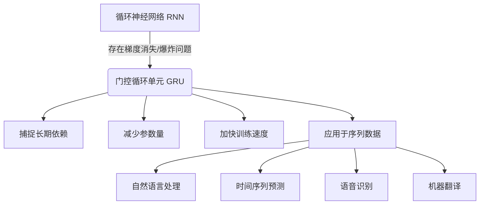

# 从零开始大模型开发与微调：什么是GRU

## 1. 背景介绍

### 1.1 问题的由来

在自然语言处理和时间序列预测等领域,循环神经网络(Recurrent Neural Networks, RNNs)因其能够捕捉序列数据中的长期依赖关系而备受关注。然而,传统的RNN在处理长序列时存在梯度消失和梯度爆炸的问题,这极大限制了其在实际应用中的表现。为了解决这一问题,门控循环单元(Gated Recurrent Unit, GRU)应运而生。

### 1.2 研究现状

GRU是一种改进的RNN变体,由Kyunghyun Cho等人于2014年提出。与长短期记忆网络(Long Short-Term Memory, LSTM)类似,GRU也采用了门控机制来控制信息的流动,但其结构更加简洁,参数更少,因此在某些场景下具有更快的训练速度和更小的计算开销。

近年来,GRU在自然语言处理、语音识别、机器翻译等领域得到了广泛应用,并取得了优异的表现。随着深度学习的不断发展,GRU也在不断演进和改进,以适应更加复杂的任务需求。

### 1.3 研究意义

深入理解GRU的工作原理及其数学模型对于开发和优化基于GRU的深度学习模型至关重要。本文将从零开始,系统地介绍GRU的核心概念、算法原理、数学模型、实现细节以及实际应用场景,旨在为读者提供一个全面而深入的GRU学习资源。

### 1.4 本文结构

本文将按照以下结构进行阐述:

1. 背景介绍
2. 核心概念与联系
3. 核心算法原理与具体操作步骤
4. 数学模型和公式详细讲解与举例说明
5. 项目实践:代码实例和详细解释说明
6. 实际应用场景
7. 工具和资源推荐
8. 总结:未来发展趋势与挑战
9. 附录:常见问题与解答

## 2. 核心概念与联系

GRU是RNN的一种变体,旨在解决传统RNN在处理长序列时存在的梯度消失和梯度爆炸问题。与LSTM类似,GRU通过引入门控机制来控制信息的流动,从而能够更好地捕捉序列数据中的长期依赖关系。

与LSTM相比,GRU的结构更加简洁,参数更少,因此在某些场景下具有更快的训练速度和更小的计算开销。GRU广泛应用于自然语言处理、时间序列预测、语音识别、机器翻译等领域,在处理序列数据方面表现出色。

## 3. 核心算法原理与具体操作步骤

### 3.1 算法原理概述

GRU的核心思想是使用更新门(Update Gate)和重置门(Reset Gate)来控制信息的流动,从而决定保留和丢弃哪些信息。具体来说:

1. **更新门(Update Gate)**: 决定了当前时间步的隐藏状态应该如何与新输入信息和前一时间步的隐藏状态相结合。
2. **重置门(Reset Gate)**: 用于控制忘记前一时间步的隐藏状态,以防止不相关信息的持续存储和传递。

通过这两个门的协同工作,GRU能够有效地捕捉序列数据中的长期依赖关系,同时避免梯度消失和梯度爆炸问题。

### 3.2 算法步骤详解

GRU在每个时间步的计算过程可以分为以下几个步骤:

1. **计算更新门**:

$$
z_t = \sigma(W_z \cdot [h_{t-1}, x_t] + b_z)
$$

其中,$z_t$表示更新门的激活值向量,$\sigma$是sigmoid激活函数,$W_z$和$b_z$分别是更新门的权重矩阵和偏置向量,$h_{t-1}$是前一时间步的隐藏状态向量,$x_t$是当前时间步的输入向量。

2. **计算重置门**:

$$
r_t = \sigma(W_r \cdot [h_{t-1}, x_t] + b_r)
$$

其中,$r_t$表示重置门的激活值向量,$W_r$和$b_r$分别是重置门的权重矩阵和偏置向量。

3. **计算候选隐藏状态**:

$$
\tilde{h}_t = \tanh(W \cdot [r_t \odot h_{t-1}, x_t] + b)
$$

其中,$\tilde{h}_t$是候选隐藏状态向量,$\odot$表示元素级别的向量乘积,即Hadamard乘积,$W$和$b$分别是候选隐藏状态的权重矩阵和偏置向量。

4. **计算当前时间步的隐藏状态**:

$$
h_t = (1 - z_t) \odot h_{t-1} + z_t \odot \tilde{h}_t
$$

其中,$h_t$是当前时间步的隐藏状态向量,它是前一时间步的隐藏状态$h_{t-1}$和候选隐藏状态$\tilde{h}_t$的加权和,权重由更新门$z_t$决定。

通过上述步骤,GRU能够根据当前输入和前一时间步的隐藏状态,动态地更新隐藏状态,从而捕捉序列数据中的长期依赖关系。

### 3.3 算法优缺点

**优点**:

1. **参数更少**: 相比LSTM,GRU的结构更加简洁,参数更少,因此在某些场景下具有更快的训练速度和更小的计算开销。
2. **捕捉长期依赖**: 与传统RNN相比,GRU能够更好地捕捉序列数据中的长期依赖关系,避免梯度消失和梯度爆炸问题。
3. **并行计算友好**: GRU的门控机制使得它在并行计算环境下表现良好,适合GPU加速。

**缺点**:

1. **表现不如LSTM**: 在某些任务上,LSTM的表现可能优于GRU,因为LSTM的门控机制更加复杂,能够捕捉更丰富的模式。
2. **过拟合风险**: 与其他神经网络模型一样,GRU也存在过拟合的风险,需要采取适当的正则化措施。
3. **长期依赖捕捉能力有限**: 尽管GRU能够捕捉长期依赖,但对于极长的序列,其捕捉能力仍然有限。

### 3.4 算法应用领域

GRU在以下领域有着广泛的应用:

1. **自然语言处理**: 包括文本分类、情感分析、机器翻译、问答系统等。
2. **时间序列预测**: 如股票价格预测、天气预报、销售预测等。
3. **语音识别**: 将语音信号转换为文本。
4. **图像描述**: 根据图像自动生成描述性文本。
5. **视频分析**: 用于行为识别、动作预测等任务。

总的来说,GRU擅长处理序列数据,因此在上述领域都有着广泛的应用前景。

## 4. 数学模型和公式详细讲解与举例说明

### 4.1 数学模型构建

GRU的数学模型可以表示为:

$$
\begin{aligned}
z_t &= \sigma(W_z \cdot [h_{t-1}, x_t] + b_z) \
r_t &= \sigma(W_r \cdot [h_{t-1}, x_t] + b_r) \
\tilde{h}_t &= \tanh(W \cdot [r_t \odot h_{t-1}, x_t] + b) \
h_t &= (1 - z_t) \odot h_{t-1} + z_t \odot \tilde{h}_t
\end{aligned}
$$

其中:

- $z_t$是更新门的激活值向量
- $r_t$是重置门的激活值向量
- $\tilde{h}_t$是候选隐藏状态向量
- $h_t$是当前时间步的隐藏状态向量
- $W_z$, $W_r$, $W$分别是更新门、重置门和候选隐藏状态的权重矩阵
- $b_z$, $b_r$, $b$分别是更新门、重置门和候选隐藏状态的偏置向量
- $\sigma$是sigmoid激活函数
- $\odot$表示元素级别的向量乘积(Hadamard乘积)

这个数学模型描述了GRU在每个时间步的计算过程,包括更新门、重置门、候选隐藏状态和当前隐藏状态的计算。通过这些门控机制,GRU能够动态地控制信息的流动,从而捕捉序列数据中的长期依赖关系。

### 4.2 公式推导过程

我们来详细推导一下GRU的数学模型中各个公式的含义和来源。

1. **更新门公式推导**:

$$
z_t = \sigma(W_z \cdot [h_{t-1}, x_t] + b_z)
$$

更新门$z_t$决定了当前时间步的隐藏状态应该如何与新输入信息和前一时间步的隐藏状态相结合。它是一个向量,每个元素的值介于0和1之间,由sigmoid激活函数确保。

更新门的输入是前一时间步的隐藏状态$h_{t-1}$和当前时间步的输入$x_t$的拼接,经过权重矩阵$W_z$的线性变换和偏置$b_z$的加权,最后通过sigmoid激活函数得到更新门的激活值向量$z_t$。

2. **重置门公式推导**:

$$
r_t = \sigma(W_r \cdot [h_{t-1}, x_t] + b_r)
$$

重置门$r_t$用于控制忘记前一时间步的隐藏状态,以防止不相关信息的持续存储和传递。它的计算方式与更新门类似,也是通过sigmoid激活函数得到一个介于0和1之间的向量。

重置门的输入同样是前一时间步的隐藏状态$h_{t-1}$和当前时间步的输入$x_t$的拼接,经过权重矩阵$W_r$的线性变换和偏置$b_r$的加权,最后通过sigmoid激活函数得到重置门的激活值向量$r_t$。

3. **候选隐藏状态公式推导**:

$$
\tilde{h}_t = \tanh(W \cdot [r_t \odot h_{t-1}, x_t] + b)
$$

候选隐藏状态$\tilde{h}_t$是一个向量,表示当前时间步的潜在隐藏状态。它的计算需要考虑当前输入$x_t$、重置门$r_t$和前一时间步的隐藏状态$h_{t-1}$。

首先,将重置门$r_t$与前一时间步的隐藏状态$h_{t-1}$进行元素级别的向量乘积(Hadamard乘积),得到$r_t \odot h_{t-1}$,这相当于根据重置门的值来"重置"或"遗忘"前一时间步的隐藏状态中的某些信息。

然后,将$r_t \odot h_{t-1}$与当前输入$x_t$拼接,经过权重矩阵$W$的线性变换和偏置$b$的加权,最后通过tanh激活函数得到候选隐藏状态向量$\tilde{h}_t$。tanh激活函数的输出范围在-1到1之间,能够更好地捕捉序列数据中的长期依赖关系。

4. **当前隐藏状态公式推导**:

$$
h_t = (1 - z_t) \odot h_{t-1} + z_t \odot \tilde{h}_t
$$

当前时间步的隐藏状态$h_t$是前一时间步的隐藏状态$h_{t-1}$和候选隐藏状态$\tilde{h}_t$的加权和,权重由更新门$z_t$决定。

具体来说,$(1 - z_t) \odot h_{t-1}