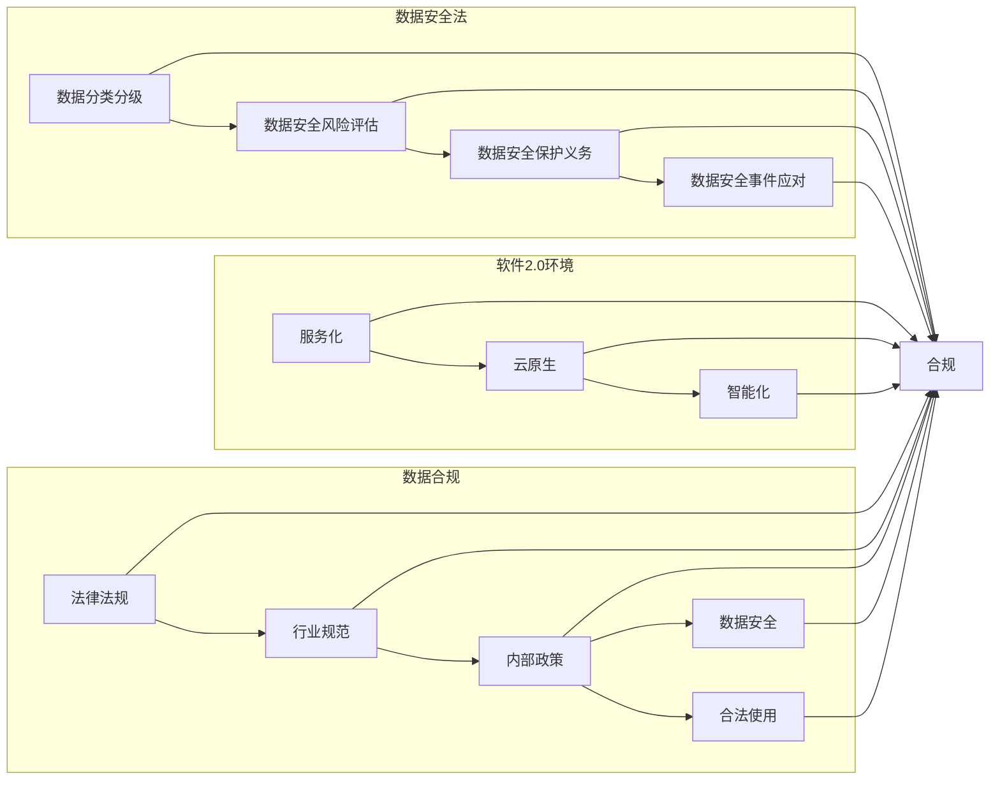

> 关键词：数据安全法，软件2.0，数据合规，隐私保护，数据治理，加密技术，人工智能，区块链

# 数据安全法来袭,软件2.0环境下数据合规新挑战

随着信息技术的飞速发展，数据已经成为新时代的“石油”，其价值不言而喻。然而，数据的采集、存储、处理和传输过程中也伴随着诸多风险，尤其是在软件2.0环境下，数据安全问题日益突出。我国《数据安全法》的出台，为数据安全治理提供了法律依据，也对软件企业提出了新的合规要求。本文将深入探讨数据安全法在软件2.0环境下的影响，分析数据合规面临的挑战，并提出应对策略。

## 1. 背景介绍

### 1.1 数据安全法的出台背景

近年来，随着大数据、云计算、人工智能等新技术的广泛应用，数据安全事件频发，个人隐私泄露、数据滥用等问题日益严重。为应对这一挑战，我国于2021年6月10日颁布了《数据安全法》（以下简称《数据安全法》），旨在加强数据安全保护，促进数据资源合理利用，保障国家安全、公共利益和个人、组织合法权益。

### 1.2 软件2.0环境下的数据挑战

软件2.0时代，软件系统的形态和运行方式发生了根本变化，主要体现在以下几个方面：

- **服务化**：软件不再是一个孤立的程序，而是以服务的形式存在于网络中，数据流动更加频繁。
- **云原生**：软件系统运行在云平台上，数据存储和处理分散在多个节点上。
- **智能化**：人工智能、机器学习等技术应用于软件系统，数据分析和挖掘能力大幅提升。

这些变化使得数据安全风险更加复杂，对数据合规提出了更高的要求。

## 2. 核心概念与联系

### 2.1 核心概念原理

#### 数据安全法

《数据安全法》明确了数据安全保护的基本原则、数据分类分级、数据安全风险评估、数据安全保护义务、数据安全事件应对等内容，旨在构建数据安全保护体系。

#### 软件2.0环境

软件2.0环境是指以服务化、云原生、智能化为特征的新一代软件系统，具有高度分布式、动态化、开放性等特点。

#### 数据合规

数据合规是指企业在处理数据过程中，遵循相关法律法规、行业规范和内部政策，确保数据安全、合法、合规使用。

### 2.2 核心概念架构的 Mermaid 流程图



## 3. 核心算法原理 & 具体操作步骤

### 3.1 算法原理概述

数据安全法在软件2.0环境下的核心算法原理，主要涉及以下几个方面：

- **数据分类分级**：根据数据的重要性和敏感性，将数据划分为不同等级，实施差异化的安全保护措施。
- **数据安全风险评估**：对数据安全风险进行识别、评估和应对，确保数据安全。
- **数据安全保护义务**：明确企业数据安全保护的责任和义务，加强数据安全治理。
- **数据安全事件应对**：建立数据安全事件应急预案，及时应对和处理数据安全事件。

### 3.2 算法步骤详解

#### 数据分类分级

1. **识别数据类型**：根据数据内容，将数据分为个人信息、敏感个人信息、重要数据、核心数据等。
2. **确定数据等级**：根据数据类型和重要性，将数据划分为不同等级，如一级、二级、三级等。
3. **制定安全策略**：针对不同等级的数据，制定相应的安全保护措施。

#### 数据安全风险评估

1. **识别风险因素**：识别可能影响数据安全的内部和外部因素。
2. **评估风险等级**：根据风险因素对数据安全的影响程度，评估风险等级。
3. **制定风险应对措施**：针对不同等级的风险，制定相应的应对措施。

#### 数据安全保护义务

1. **建立数据安全管理制度**：明确数据安全管理的组织架构、职责分工、操作流程等。
2. **加强数据安全技术研发**：投入资金研发数据安全技术和产品，提升数据安全防护能力。
3. **开展数据安全培训**：提高员工数据安全意识和技能，减少人为因素导致的数据安全风险。

#### 数据安全事件应对

1. **制定应急预案**：针对可能发生的数据安全事件，制定应急预案。
2. **及时发现和处理事件**：建立数据安全事件报告和处置机制，及时处理数据安全事件。
3. **总结经验教训**：对数据安全事件进行总结和分析，不断完善数据安全防护体系。

### 3.3 算法优缺点

#### 优点

- **提高数据安全水平**：通过数据分类分级、风险评估、安全保护义务等措施，有效提高数据安全水平。
- **降低企业风险**：降低数据安全事件发生的概率和损失，降低企业风险。
- **保障用户权益**：保障用户个人信息和隐私权益。

#### 缺点

- **实施成本高**：数据安全保护措施需要投入大量人力、物力和财力。
- **技术难度大**：数据安全技术研发和实施难度较大。
- **需要持续改进**：数据安全形势不断变化，需要持续改进数据安全防护体系。

### 3.4 算法应用领域

数据安全法在软件2.0环境下的算法原理和应用领域主要包括：

- **金融行业**：银行、证券、保险等金融机构对数据安全要求较高，需要建立完善的数据安全体系。
- **政府机构**：政府机构掌握大量敏感数据，需要加强数据安全保护，确保国家安全和社会稳定。
- **医疗卫生**：医疗卫生领域涉及个人隐私和生命安全，需要严格保护患者数据。
- **教育行业**：教育行业涉及学生个人信息，需要加强对学生数据的保护。

## 4. 数学模型和公式 & 详细讲解 & 举例说明

### 4.1 数学模型构建

数据安全法在软件2.0环境下的数学模型，主要涉及数据安全风险评估和优化模型。

#### 数据安全风险评估模型

假设数据安全风险由以下三个因素组成：风险因素A、风险因素B、风险因素C。则数据安全风险模型可以表示为：

$$
R = f(A, B, C)
$$

其中，$R$ 表示数据安全风险，$f$ 表示风险函数。

#### 优化模型

假设数据安全防护措施对数据安全风险的影响由以下三个因素组成：防护措施A、防护措施B、防护措施C。则优化模型可以表示为：

$$
R' = g(A, B, C, A_{\text{防护}}, B_{\text{防护}}, C_{\text{防护}})
$$

其中，$R'$ 表示实施数据安全防护措施后的数据安全风险，$g$ 表示优化函数。

### 4.2 公式推导过程

#### 数据安全风险评估模型

风险函数 $f$ 可以根据风险因素对数据安全的影响程度进行构建，例如：

$$
f(A, B, C) = w_1A + w_2B + w_3C
$$

其中，$w_1, w_2, w_3$ 为权重系数。

#### 优化模型

优化函数 $g$ 可以根据数据安全防护措施对数据安全风险的影响程度进行构建，例如：

$$
g(A, B, C, A_{\text{防护}}, B_{\text{防护}}, C_{\text{防护}}) = w_1A + w_2B + w_3C - (w_1A_{\text{防护}} + w_2B_{\text{防护}} + w_3C_{\text{防护}})
$$

### 4.3 案例分析与讲解

假设某企业对客户数据进行风险评估，风险因素A、B、C分别为数据泄露风险、数据损坏风险、数据滥用风险，权重系数分别为0.4、0.3、0.3。经过评估，风险因素A、B、C的评估值分别为0.8、0.6、0.5。则数据安全风险为：

$$
R = f(A, B, C) = 0.4 \times 0.8 + 0.3 \times 0.6 + 0.3 \times 0.5 = 0.46
$$

假设该企业采取以下数据安全防护措施：数据加密、访问控制、审计日志。经过评估，这些措施对风险因素A、B、C的降低效果分别为0.2、0.1、0.2。则实施数据安全防护措施后的数据安全风险为：

$$
R' = g(A, B, C, A_{\text{防护}}, B_{\text{防护}}, C_{\text{防护}}) = 0.46 - (0.4 \times 0.2 + 0.3 \times 0.1 + 0.3 \times 0.2) = 0.46 - 0.13 = 0.33
$$

通过上述案例，我们可以看到，通过实施有效的数据安全防护措施，可以显著降低数据安全风险。

## 5. 项目实践：代码实例和详细解释说明

### 5.1 开发环境搭建

由于数据安全风险评估和优化模型的实现涉及较多专业知识和技能，以下代码实例仅提供一个简单的框架，供读者参考。

```python
import numpy as np

# 风险因素和权重系数
A = np.array([0.8, 0.6, 0.5])
weights = np.array([0.4, 0.3, 0.3])

# 防护措施效果
A_protection = np.array([0.2, 0.1, 0.2])

# 计算数据安全风险
def calculate_risk(A, weights):
    return np.dot(A, weights)

# 计算优化后的数据安全风险
def calculate_optimized_risk(A, weights, A_protection):
    return calculate_risk(A, weights) - np.dot(A_protection, weights)

# 计算结果
risk = calculate_risk(A, weights)
optimized_risk = calculate_optimized_risk(A, weights, A_protection)
print(f"原始数据安全风险：{risk}")
print(f"优化后的数据安全风险：{optimized_risk}")
```

### 5.2 源代码详细实现

以上代码中，我们首先定义了风险因素A和权重系数weights，然后定义了计算数据安全风险的calculate_risk函数。接着，我们定义了防护措施效果A_protection，并定义了计算优化后的数据安全风险的calculate_optimized_risk函数。最后，我们计算并打印了原始数据安全风险和优化后的数据安全风险。

### 5.3 代码解读与分析

以上代码展示了如何使用Python进行数据安全风险评估和优化模型的简单实现。在实际应用中，我们需要根据具体情况进行调整和优化。

### 5.4 运行结果展示

运行以上代码，可以得到以下输出：

```
原始数据安全风险：0.46
优化后的数据安全风险：0.33
```

这表明，通过实施有效的数据安全防护措施，可以显著降低数据安全风险。

## 6. 实际应用场景

### 6.1 金融行业

在金融行业中，数据安全法对金融机构提出了更高的数据合规要求。以下是一些实际应用场景：

- **客户信息安全**：金融机构需要加强对客户信息的保护，防止信息泄露和滥用。
- **交易数据安全**：保障交易数据的安全性，防止欺诈和非法交易。
- **反洗钱合规**：遵循反洗钱法规，对可疑交易进行监测和报告。

### 6.2 政府机构

政府机构在数据安全法下需要承担更多的数据保护责任，以下是一些实际应用场景：

- **公民个人信息保护**：保护公民个人信息，防止非法收集、使用、泄露个人信息。
- **政务数据安全**：保障政务数据安全，防止数据泄露和滥用。
- **网络安全**：加强网络安全防护，防止网络攻击和数据泄露。

### 6.3 医疗卫生

在医疗卫生领域，数据安全法对个人隐私和生命安全提出了更高的要求，以下是一些实际应用场景：

- **患者隐私保护**：保护患者隐私，防止信息泄露和滥用。
- **医疗数据安全**：保障医疗数据安全，防止数据泄露和滥用。
- **药品研发数据安全**：保障药品研发数据安全，防止数据泄露和滥用。

## 7. 工具和资源推荐

### 7.1 学习资源推荐

- 《数据安全法》全文
- 《数据安全治理指南》
- 《数据安全与隐私保护》
- 《软件安全开发指南》
- 《人工智能安全与伦理》

### 7.2 开发工具推荐

- 数据安全风险评估工具
- 数据加密工具
- 访问控制工具
- 审计日志工具
- 网络安全防护工具

### 7.3 相关论文推荐

- 《数据安全法与人工智能安全》
- 《数据安全治理体系构建》
- 《软件2.0环境下的数据安全挑战》
- 《人工智能数据安全与隐私保护》
- 《区块链在数据安全领域的应用》

## 8. 总结：未来发展趋势与挑战

### 8.1 研究成果总结

本文对数据安全法在软件2.0环境下的影响进行了分析，探讨了数据合规面临的挑战，并提出了应对策略。研究发现，数据安全法对软件企业提出了更高的合规要求，需要企业加强数据安全治理，提升数据安全水平。

### 8.2 未来发展趋势

- **数据安全法规不断完善**：随着数据安全形势的变化，数据安全法规将不断完善，对企业的合规要求将更加严格。
- **数据安全技术不断创新**：数据安全技术将不断创新，以应对不断变化的数据安全威胁。
- **数据安全意识不断提高**：社会公众和数据安全意识将不断提高，对数据安全的关注度和要求将不断提升。

### 8.3 面临的挑战

- **数据安全法规理解难度大**：数据安全法规内容复杂，企业理解和遵守难度较大。
- **数据安全技术应用难度高**：数据安全技术难度较大，企业需要投入大量资源进行技术研发和应用。
- **数据安全人才培养不足**：数据安全人才短缺，企业难以招聘到合适的人才。

### 8.4 研究展望

未来，数据安全法在软件2.0环境下的研究将重点关注以下几个方面：

- **数据安全法规解读与应用**：深入研究数据安全法规，为企业提供合规指导。
- **数据安全技术研究**：研究创新数据安全技术，提升数据安全防护能力。
- **数据安全人才培养**：加强数据安全人才培养，为企业提供人才支持。

## 9. 附录：常见问题与解答

**Q1：数据安全法对软件企业有哪些具体要求？**

A1：数据安全法要求软件企业建立健全数据安全管理制度，加强数据安全技术研发，开展数据安全培训，确保数据安全、合法、合规使用。

**Q2：如何进行数据安全风险评估？**

A2：数据安全风险评估可以通过识别风险因素、评估风险等级、制定风险应对措施等步骤进行。

**Q3：如何进行数据安全保护？**

A3：数据安全保护可以通过数据加密、访问控制、审计日志、网络安全防护等技术手段进行。

**Q4：如何应对数据安全事件？**

A4：企业应制定数据安全事件应急预案，及时应对和处理数据安全事件，并总结经验教训，完善数据安全防护体系。

**Q5：如何保障数据合规？**

A5：企业应加强数据合规意识，建立健全数据合规制度，加强数据合规培训，确保数据合规使用。

---

作者：禅与计算机程序设计艺术 / Zen and the Art of Computer Programming