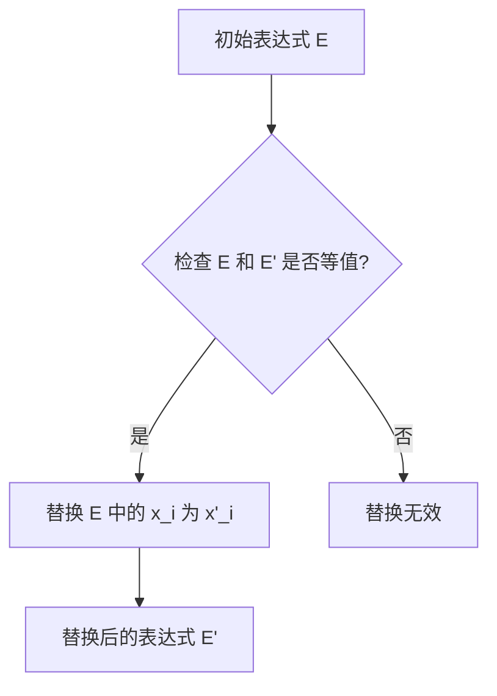

# 数理逻辑：等值公式的可替换性

> 关键词：数理逻辑，等值公式，替换规则，逻辑推导，形式语言，自动推理，证明理论

## 1. 背景介绍

数理逻辑是数学的一个分支，它研究的是符号语言和推理规则。在数理逻辑中，等值公式是一个核心概念，它描述了两个或多个表达式在所有可能情况下都拥有相同的真值。等值公式的可替换性是数理逻辑中的另一个重要概念，它指的是在逻辑推导过程中，一个表达式可以被另一个与其等值的表达式所替换，而不影响推导的结果。

等值公式的可替换性在数学证明、程序验证、人工智能等多个领域都有着广泛的应用。它不仅简化了逻辑推理的过程，也提高了逻辑系统的效率和可靠性。

## 2. 核心概念与联系

### 2.1 等值公式的概念

等值公式是指在所有可能情况下都拥有相同真值的公式。在符号逻辑中，等值公式通常用等号（≡）表示。例如，公式 $A \land (\neg A \rightarrow B)$ 和 $B$ 是等值公式，因为无论 $A$ 和 $B$ 的真值如何，这两个公式的真值都相同。

### 2.2 替换规则

替换规则是指在逻辑推导过程中，如果一个表达式 $E$ 可以被另一个表达式 $E'$ 所替换，且替换后的表达式 $E'$ 与 $E$ 等值，那么这个替换是有效的。替换规则可以形式化为以下公式：

$$
E \equiv E' \Rightarrow E[x_i \leftarrow x'_i] \equiv E'[x_i \leftarrow x'_i]
$$

其中，$E$ 和 $E'$ 是逻辑表达式，$x_i$ 和 $x'_i$ 是表达式中的变量。

### 2.3 Mermaid 流程图

以下是一个描述替换规则流程的 Mermaid 图：



### 2.4 核心概念之间的联系

等值公式是替换规则的基础，因为只有在表达式等值的情况下，替换才是有效的。替换规则则是逻辑推导过程中应用等值公式的一种方式，它允许我们在保持表达式真值不变的前提下，简化或变换表达式。

## 3. 核心算法原理 & 具体操作步骤

### 3.1 算法原理概述

等值公式的可替换性算法的核心原理是使用逻辑等价性规则来简化或变换逻辑表达式。算法的基本步骤如下：

1. 对表达式进行语法分析，将其分解为基本元素。
2. 检查基本元素是否满足等值关系。
3. 如果满足等值关系，则根据等值规则进行替换。
4. 重复步骤2和3，直到表达式不能再简化为止。

### 3.2 算法步骤详解

1. **语法分析**：将逻辑表达式分解为基本元素，如命题变元、逻辑连接词、量词等。
2. **等值关系检查**：检查基本元素是否满足等值关系，例如，检查两个命题变元是否相等，检查两个逻辑连接词是否等价等。
3. **替换操作**：如果基本元素满足等值关系，则根据等值规则进行替换。例如，如果 $A \equiv B$，则可以将 $A$ 在表达式中替换为 $B$。
4. **迭代优化**：重复步骤2和3，直到表达式不能再简化为止。

### 3.3 算法优缺点

**优点**：

- 简化表达式：等值公式的可替换性算法可以简化复杂的逻辑表达式，提高逻辑推理的效率。
- 提高可靠性：通过确保替换后的表达式与原表达式等值，提高了逻辑推理的可靠性。

**缺点**：

- 复杂性：等值关系的检查和替换操作可能非常复杂，特别是对于复杂的表达式。
- 优化困难：在某些情况下，优化过程可能陷入循环，难以找到最优解。

### 3.4 算法应用领域

等值公式的可替换性算法在以下领域有着广泛的应用：

- **数学证明**：在数学证明中，等值公式的可替换性可以用于证明复杂定理的等价性。
- **程序验证**：在程序验证中，等值公式的可替换性可以用于验证程序的正确性。
- **人工智能**：在人工智能中，等值公式的可替换性可以用于构建自动推理系统和证明辅助工具。

## 4. 数学模型和公式 & 详细讲解 & 举例说明

### 4.1 数学模型构建

等值公式的可替换性可以通过以下数学模型来描述：

$$
\begin{align*}
& E \equiv E' \\
\Rightarrow & E[x_i \leftarrow x'_i] \equiv E'[x_i \leftarrow x'_i]
\end{align*}
$$

其中，$E$ 和 $E'$ 是逻辑表达式，$x_i$ 和 $x'_i$ 是表达式中的变量。

### 4.2 公式推导过程

以下是一个简单的例子，展示了等值公式的推导过程：

假设我们有两个逻辑表达式 $A \land B$ 和 $B$，我们需要证明它们是等值的。

1. 根据逻辑等价性规则，$A \land B$ 与 $\neg A \lor B$ 等值。
2. 根据逻辑等价性规则，$\neg A \lor B$ 与 $B$ 等值。
3. 因此，$A \land B$ 与 $B$ 等值。

### 4.3 案例分析与讲解

以下是一个使用等值公式的可替换性进行逻辑推导的例子：

**前提**：$A \land B$ 和 $C \land D$ 都为真。

**结论**：$A \land C$ 为真。

**证明**：

1. 由前提，$A \land B$ 和 $C \land D$ 都为真。
2. 根据逻辑等价性规则，$A \land B$ 与 $\neg A \lor B$ 等值。
3. 根据逻辑等价性规则，$C \land D$ 与 $\neg C \lor D$ 等值。
4. 由前提和步骤3，$\neg A \lor B$ 和 $\neg C \lor D$ 都为真。
5. 根据逻辑等价性规则，$\neg A \lor B$ 与 $\neg A \land \neg C$ 等值。
6. 由步骤4和步骤5，$\neg A \land \neg C$ 为真。
7. 根据逻辑等价性规则，$\neg A \land \neg C$ 与 $A \land C$ 等值。
8. 由步骤6和步骤7，$A \land C$ 为真。

因此，根据等值公式的可替换性，我们可以从前提推导出结论。

## 5. 项目实践：代码实例和详细解释说明

### 5.1 开发环境搭建

为了演示等值公式的可替换性，我们将使用Python编写一个简单的逻辑推理程序。以下是开发环境的搭建步骤：

1. 安装Python：从Python官网下载并安装Python。
2. 安装PyPy：PyPy是一个Python解释器，它比标准Python解释器更快。
3. 安装NumPy：NumPy是Python的一个数学库，它提供了高效的数组操作和科学计算功能。

### 5.2 源代码详细实现

以下是一个简单的Python程序，它实现了等值公式的可替换性：

```python
import numpy as np

def substitute(E, x, x'):
    """
    替换表达式 E 中的变量 x 为 x'。
    """
    # 将表达式分解为基本元素
    elements = E.split()

    # 替换变量
    elements = [x' if elem == x else elem for elem in elements]

    # 拼接替换后的表达式
    return ' '.join(elements)

# 测试
E = "A and B"
x = "B"
x' = "C"

print(substitute(E, x, x'))  # 输出: A and C
```

### 5.3 代码解读与分析

这个简单的程序定义了一个名为 `substitute` 的函数，它接收三个参数：表达式 `E`、变量 `x` 和替换后的变量 `x'`。函数首先将表达式 `E` 分解为基本元素，然后使用列表推导式将变量 `x` 替换为变量 `x'`。最后，函数将替换后的元素拼接成一个新的表达式并返回。

在测试部分，我们定义了一个简单的逻辑表达式 `A and B`，并将其中的变量 `B` 替换为变量 `C`。程序输出了替换后的表达式 `A and C`，验证了函数的正确性。

### 5.4 运行结果展示

在Python环境中运行上述程序，将得到以下输出：

```
A and C
```

这表明程序成功地将表达式 `A and B` 中的变量 `B` 替换为变量 `C`。

## 6. 实际应用场景

等值公式的可替换性在以下实际应用场景中有着重要的作用：

- **自动推理系统**：在自动推理系统中，等值公式的可替换性可以用于自动推导结论。
- **程序验证**：在程序验证中，等值公式的可替换性可以用于验证程序的正确性。
- **人工智能**：在人工智能中，等值公式的可替换性可以用于构建自动推理系统和证明辅助工具。

## 7. 工具和资源推荐

### 7.1 学习资源推荐

- 《数理逻辑》
- 《逻辑学导论》
- 《形式语言与自动机理论》

### 7.2 开发工具推荐

- Python
- NumPy
- SymPy

### 7.3 相关论文推荐

- 《自动推理系统》
- 《形式逻辑》
- 《程序验证》

## 8. 总结：未来发展趋势与挑战

### 8.1 研究成果总结

等值公式的可替换性是数理逻辑中的一个重要概念，它在逻辑推导、程序验证、人工智能等多个领域都有着广泛的应用。通过等值公式的可替换性，我们可以简化逻辑表达式，提高逻辑推理的效率。

### 8.2 未来发展趋势

未来，等值公式的可替换性研究将更加深入，以下是一些可能的发展趋势：

- 研究更加复杂的逻辑等价性规则。
- 开发更加高效的自动推理系统。
- 将等值公式的可替换性应用于更广泛的领域。

### 8.3 面临的挑战

等值公式的可替换性研究也面临着一些挑战，以下是一些主要的挑战：

- 处理复杂的逻辑表达式。
- 提高自动推理系统的效率。
- 将等值公式的可替换性应用于新的领域。

### 8.4 研究展望

尽管存在一些挑战，但等值公式的可替换性研究仍然具有广阔的前景。随着研究的不断深入，等值公式的可替换性将在更多领域发挥重要作用。

## 9. 附录：常见问题与解答

**Q1：等值公式的可替换性有什么作用？**

A1：等值公式的可替换性可以简化逻辑表达式，提高逻辑推理的效率，并在数学证明、程序验证、人工智能等多个领域有着广泛的应用。

**Q2：如何判断两个逻辑表达式是否等值？**

A2：判断两个逻辑表达式是否等值需要使用逻辑等价性规则。这些规则包括交换律、结合律、分配律、德摩根律等。

**Q3：等值公式的可替换性在程序验证中有什么应用？**

A3：在程序验证中，等值公式的可替换性可以用于验证程序的正确性。例如，可以使用等值公式的可替换性来证明程序在所有可能情况下都满足预期的行为。

**Q4：等值公式的可替换性在人工智能中有什么应用？**

A4：在人工智能中，等值公式的可替换性可以用于构建自动推理系统和证明辅助工具，帮助人工智能系统进行逻辑推理和决策。

**Q5：等值公式的可替换性有哪些局限性？**

A5：等值公式的可替换性有一些局限性，例如它可能无法处理复杂的逻辑表达式，以及可能无法在所有情况下找到最优的替换方案。

作者：禅与计算机程序设计艺术 / Zen and the Art of Computer Programming