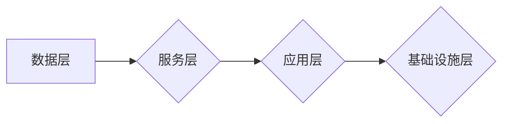

# 文档管理与知识共享原理与代码实战案例讲解

> 关键词：文档管理，知识共享，内容管理系统，知识图谱，语义搜索，机器学习，代码实战

## 1. 背景介绍

随着信息化时代的到来，企业和组织内部积累了大量的文档和知识资源。如何高效地管理和共享这些资源，成为提升组织效率和创新能力的关键。文档管理与知识共享系统应运而生，它不仅可以帮助用户快速找到所需信息，还可以促进知识的积累和传承，提高团队协作效率。

### 1.1 问题的由来

在传统的文档管理中，信息往往分散存储在各个部门、个人或系统中，难以统一检索和共享。同时，知识也以碎片化的形式存在，难以形成体系化的知识库。这些问题导致了以下挑战：

- 信息孤岛：不同部门或个人之间的信息难以互通。
- 知识重复：相同或类似的知识被重复创建和存储。
- 搜索效率低：用户难以快速找到所需信息。
- 知识更新不及时：知识库中的知识难以及时更新。

### 1.2 研究现状

为了解决上述问题，许多企业和组织开始构建文档管理与知识共享系统。这些系统通常包含以下核心功能：

- 文档存储与管理：提供文档的上传、下载、版本控制和权限管理等功能。
- 知识库构建：将分散的知识点整理成体系化的知识库，方便用户检索和学习。
- 语义搜索：利用自然语言处理技术，实现更精准的搜索结果。
- 知识图谱：构建知识图谱，展示知识之间的关系，帮助用户更好地理解和应用知识。
- 用户社区：提供用户交流和分享的平台，促进知识的传播和创新。

### 1.3 研究意义

文档管理与知识共享系统对于企业和组织具有重要的意义：

- 提高信息利用率：通过统一管理和共享，提高信息的利用率。
- 促进知识传承：将知识转化为可检索的资源，方便后人学习和应用。
- 提升团队协作效率：方便团队成员之间共享信息和知识，提高协作效率。
- 增强创新能力：通过知识共享，激发创新思维，促进技术创新。

### 1.4 本文结构

本文将围绕文档管理与知识共享系统展开，具体内容包括：

- 核心概念与联系：介绍文档管理与知识共享系统的核心概念和架构。
- 核心算法原理：讲解语义搜索、知识图谱等关键算法的原理。
- 项目实践：通过代码实战案例，展示如何构建文档管理与知识共享系统。
- 实际应用场景：分析文档管理与知识共享系统的实际应用场景。
- 工具和资源推荐：推荐相关学习资源、开发工具和论文。
- 总结：总结研究成果，展望未来发展趋势和挑战。

## 2. 核心概念与联系

### 2.1 核心概念

#### 文档管理

文档管理是指对文档进行存储、检索、共享和版本控制的过程。它主要包括以下功能：

- 文件上传和下载：提供用户上传和下载文档的接口。
- 文档分类和标签：对文档进行分类和标签，方便用户检索。
- 文件版本控制：记录文档的修改历史，方便用户查看和回退到旧版本。
- 权限管理：控制用户对文档的访问权限。

#### 知识共享

知识共享是指将知识从一个人或组织传递到另一个人或组织的过程。它主要包括以下功能：

- 知识库构建：将分散的知识点整理成体系化的知识库。
- 语义搜索：利用自然语言处理技术，实现更精准的搜索结果。
- 知识图谱：构建知识图谱，展示知识之间的关系。
- 用户社区：提供用户交流和分享的平台。

### 2.2 架构

文档管理与知识共享系统的架构通常包括以下几个层次：

1. **数据层**：存储文档和知识库的数据，包括文档内容、元数据、知识图谱等。
2. **服务层**：提供文档管理、知识共享、语义搜索、知识图谱等服务。
3. **应用层**：提供用户界面，包括文档管理界面、知识库界面、搜索界面等。
4. **基础设施层**：包括数据库、服务器、网络等基础设施。

Mermaid流程图如下：



## 3. 核心算法原理 & 具体操作步骤

### 3.1 算法原理概述

#### 3.1.1 语义搜索

语义搜索利用自然语言处理技术，理解用户的查询意图，并返回与意图相关的文档或知识。其核心原理包括：

- 词向量：将文本转化为向量表示，以便进行相似度计算。
- 文档相似度计算：计算文档与查询之间的相似度，返回相似度最高的文档。
- 意图识别：识别用户的查询意图，以便返回更相关的结果。

#### 3.1.2 知识图谱

知识图谱是一种结构化数据，用于表示知识之间的关系。其核心原理包括：

- 实体识别：识别文本中的实体，如人名、地名、组织名等。
- 关系抽取：识别实体之间的关系，如“工作于”、“毕业于”等。
- 知识图谱构建：将实体和关系存储在图结构中，形成知识图谱。

### 3.2 算法步骤详解

#### 3.2.1 语义搜索

1. 对文档和查询文本进行分词和词性标注。
2. 将文档和查询文本转化为词向量。
3. 计算文档与查询之间的相似度。
4. 根据相似度排序，返回结果。

#### 3.2.2 知识图谱

1. 对文档进行实体识别和关系抽取。
2. 将实体和关系存储在图结构中。
3. 根据查询信息，在知识图谱中进行路径搜索。
4. 返回搜索结果。

### 3.3 算法优缺点

#### 3.3.1 语义搜索

优点：

- 提高搜索精度，返回更相关的结果。
- 支持自然语言查询，用户使用方便。

缺点：

- 需要大量标注数据。
- 需要复杂的算法实现。

#### 3.3.2 知识图谱

优点：

- 结构化数据，便于推理和计算。
- 可视化展示，方便用户理解。

缺点：

- 知识图谱构建难度大。
- 难以处理动态变化的知识。

### 3.4 算法应用领域

语义搜索和知识图谱在以下领域具有广泛的应用：

- 文档检索：如搜索引擎、企业内部知识库等。
- 常见问题解答：如客服机器人、问答系统等。
- 智能推荐：如新闻推荐、商品推荐等。

## 4. 数学模型和公式 & 详细讲解 & 举例说明

### 4.1 数学模型构建

#### 4.1.1 词向量

词向量是一种将文本转化为向量表示的方法。常见的词向量模型包括：

- word2vec：基于神经网络的方法，包括CBOW和Skip-gram模型。
- GloVe：基于全局词频统计的方法。

#### 4.1.2 知识图谱

知识图谱可以用图结构表示，其中节点代表实体，边代表实体之间的关系。图结构可以用以下数学模型表示：

- 图的邻接矩阵：表示图中节点之间的连接关系。
- 节点嵌入：表示节点的向量表示。

### 4.2 公式推导过程

#### 4.2.1 词向量

以word2vec的Skip-gram模型为例，其目标函数为：

$$
\mathcal{L}(\theta) = -\sum_{x \in \mathcal{X}} \sum_{y \in \mathcal{Y}(x)} \log p(y|x;\theta)
$$

其中，$\mathcal{X}$ 为词汇表，$\mathcal{Y}(x)$ 为与 $x$ 相关的词汇集合，$\theta$ 为模型参数。

#### 4.2.2 知识图谱

知识图谱的邻接矩阵可以用以下公式表示：

$$
A = \begin{bmatrix} 
0 & 1 & 0 & 0 \\ 
1 & 0 & 0 & 1 \\ 
0 & 0 & 0 & 1 \\ 
0 & 0 & 1 & 0 
\end{bmatrix}
$$

其中，$A_{ij} = 1$ 表示节点 $i$ 和节点 $j$ 之间存在连接关系。

### 4.3 案例分析与讲解

#### 4.3.1 语义搜索

以一个简单的语义搜索任务为例，我们将使用word2vec模型进行词向量表示，并计算文档与查询之间的相似度。

```python
from gensim.models import Word2Vec
from sklearn.metrics.pairwise import cosine_similarity

# 假设我们有一个包含大量文本数据的文档集合
documents = ["The quick brown fox jumps over the lazy dog", "The brown fox jumps over the lazy dog"]

# 使用word2vec模型进行词向量表示
model = Word2Vec(documents, vector_size=100, window=5, min_count=1, workers=4)

# 将文档和查询文本转化为词向量
def vectorize(text, model):
    words = text.split()
    return [model[word] for word in words if word in model.wv]

query_vector = vectorize("The quick brown fox", model)
document_vector = vectorize(documents[0], model)

# 计算文档与查询之间的相似度
similarity = cosine_similarity([query_vector], [document_vector])[0][0]
print(f"Similarity: {similarity}")
```

#### 4.3.2 知识图谱

以一个简单的知识图谱为例，我们将使用图结构表示实体和关系，并展示如何进行路径搜索。

```python
import networkx as nx

# 创建一个图
G = nx.Graph()

# 添加节点和边
G.add_edge("Entity1", "Entity2", relation="relation1")
G.add_edge("Entity2", "Entity3", relation="relation2")
G.add_edge("Entity3", "Entity1", relation="relation3")

# 进行路径搜索
path = nx.single_source_dijkstra_path(G, source="Entity1", target="Entity3")
print(f"Path: {path}")
```

## 5. 项目实践：代码实例和详细解释说明

### 5.1 开发环境搭建

为了进行文档管理与知识共享系统的开发，我们需要以下环境：

- Python 3.x
- Flask：一个轻量级的Web框架
- Elasticsearch：一个基于Lucene的全文搜索引擎
- Neo4j：一个高性能的图数据库

### 5.2 源代码详细实现

以下是一个简单的文档管理与知识共享系统的示例代码：

```python
from flask import Flask, request, jsonify
from elasticsearch import Elasticsearch
from neo4j import GraphDatabase

app = Flask(__name__)
es = Elasticsearch("localhost:9200")
driver = GraphDatabase.driver("bolt://localhost:7687", auth=("neo4j", "password"))

# 文档上传接口
@app.route("/upload", methods=["POST"])
def upload():
    file = request.files["file"]
    file.save(file.filename)
    # 将文件信息存储到Elasticsearch和Neo4j
    # ...
    return jsonify({"message": "File uploaded successfully!"})

# 文档检索接口
@app.route("/search", methods=["GET"])
def search():
    query = request.args.get("query")
    results = es.search(index="documents", body={"query": {"match": {"content": query}}})
    return jsonify(results["hits"]["hits"])

# 知识图谱路径搜索接口
@app.route("/knowledge-graph", methods=["POST"])
def knowledge_graph():
    source = request.json["source"]
    target = request.json["target"]
    results = nx.single_source_dijkstra_path(G, source=source, target=target)
    return jsonify({"path": results})

if __name__ == "__main__":
    app.run(debug=True)
```

### 5.3 代码解读与分析

上述代码展示了如何使用Flask、Elasticsearch和Neo4j构建一个简单的文档管理与知识共享系统。主要包括以下几个部分：

- 文档上传接口：允许用户上传文档，并将文件信息存储到Elasticsearch和Neo4j中。
- 文档检索接口：允许用户根据查询文本搜索相关文档。
- 知识图谱路径搜索接口：允许用户在知识图谱中搜索从源实体到目标实体的路径。

### 5.4 运行结果展示

通过运行上述代码，我们可以启动一个Web服务，并在浏览器中访问相应的接口，实现文档上传、检索和知识图谱路径搜索等功能。

## 6. 实际应用场景

文档管理与知识共享系统在以下场景中具有广泛的应用：

- 企业内部知识库：用于存储和管理企业内部的知识资源，如技术文档、产品手册等。
- 教育平台：用于构建在线课程和知识库，方便学生学习和复习。
- 政府部门：用于存储和管理政府文件、政策法规等。
- 医疗机构：用于存储和管理医疗知识、病例资料等。

## 7. 工具和资源推荐

### 7.1 学习资源推荐

- 《自然语言处理原理与实践》
- 《图数据库实践指南》
- 《Python网络编程实战》

### 7.2 开发工具推荐

- Flask：Python轻量级Web框架
- Elasticsearch：全文搜索引擎
- Neo4j：图数据库

### 7.3 相关论文推荐

-《知识图谱构建与应用》
-《自然语言处理中的语义搜索》
-《图神经网络在知识图谱中的应用》

## 8. 总结：未来发展趋势与挑战

### 8.1 研究成果总结

本文介绍了文档管理与知识共享系统的原理和实战案例，包括核心概念、算法原理、开发实践等。通过介绍，我们了解到文档管理与知识共享系统对于企业和组织具有重要的意义，可以帮助提高信息利用率、促进知识传承、提升团队协作效率、增强创新能力。

### 8.2 未来发展趋势

随着人工智能、大数据等技术的发展，文档管理与知识共享系统将呈现以下发展趋势：

- 人工智能赋能：利用自然语言处理、机器学习等技术，实现更智能的文档管理和知识共享。
- 大数据驱动：利用大数据分析技术，挖掘用户行为和知识关联，实现个性化推荐和知识推荐。
- 云原生架构：采用云原生架构，实现系统的弹性扩展和高效运维。

### 8.3 面临的挑战

文档管理与知识共享系统在发展过程中也面临着以下挑战：

- 数据质量：确保文档和知识库的数据质量，避免错误和冗余信息。
- 数据安全：保护文档和知识库的安全，防止数据泄露和滥用。
- 用户体验：提高用户体验，方便用户检索和使用知识库。
- 技术整合：整合各种技术，实现系统的功能完善和性能优化。

### 8.4 研究展望

未来，文档管理与知识共享系统将朝着更加智能、高效、安全的方向发展。通过不断创新和突破，文档管理与知识共享系统将为企业和组织创造更大的价值。

## 9. 附录：常见问题与解答

**Q1：文档管理与知识共享系统有哪些关键技术？**

A：文档管理与知识共享系统涉及的关键技术包括自然语言处理、图数据库、全文搜索引擎、机器学习等。

**Q2：如何保证文档和知识库的数据质量？**

A：为了保证文档和知识库的数据质量，可以采取以下措施：

- 建立数据审核机制，确保文档和知识库的准确性。
- 定期对文档和知识库进行数据清理，删除错误和冗余信息。
- 对用户进行培训，提高他们的数据意识。

**Q3：如何提高文档管理与知识共享系统的用户体验？**

A：为了提高文档管理与知识共享系统的用户体验，可以采取以下措施：

- 设计简洁易用的界面。
- 提供多种检索方式，如关键词搜索、分类搜索等。
- 提供个性化推荐功能，推荐用户可能感兴趣的知识。

**Q4：文档管理与知识共享系统有哪些应用场景？**

A：文档管理与知识共享系统可以应用于企业内部知识库、教育平台、政府部门、医疗机构等多个场景。

作者：禅与计算机程序设计艺术 / Zen and the Art of Computer Programming