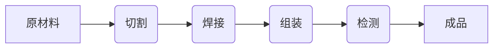

# 流水线对汽车产量的提升

> 关键词：流水线，汽车制造，生产效率，精益生产，自动化，质量保证

## 1. 背景介绍

自20世纪初以来，流水线生产模式已经成为工业生产的基石，极大地提升了汽车等大批量生产的效率。本文将深入探讨流水线对汽车产量提升的影响，分析其核心概念、原理、操作步骤，并探讨其在实际应用中的优势和挑战。

### 1.1 问题的由来

随着全球汽车市场的竞争日益激烈，汽车制造商面临着提高产量、降低成本、保证质量的巨大压力。流水线生产作为一种高效的生产方式，被广泛应用于汽车制造领域。然而，如何优化流水线设计、提高生产效率、降低生产成本，仍然是汽车制造行业面临的重要问题。

### 1.2 研究现状

流水线生产技术在汽车制造领域已经发展了百年，其核心思想和原理被不断优化和改进。近年来，随着自动化、信息化技术的快速发展，流水线生产模式也在不断升级，例如：

- 自动化流水线：引入机器人、自动化设备，实现生产过程的自动化和无人化。
- 智能化流水线：通过物联网、大数据等技术，实现生产过程的智能化监控和优化。
- 精益生产：通过消除浪费、持续改进，提高生产效率和产品质量。

### 1.3 研究意义

研究流水线对汽车产量的提升，有助于：

- 优化生产流程，提高生产效率。
- 降低生产成本，增强企业竞争力。
- 保证产品质量，提升消费者满意度。
- 推动汽车制造行业的转型升级。

### 1.4 本文结构

本文将分为以下几个部分：

- 介绍流水线的核心概念和原理。
- 分析流水线生产的操作步骤和关键要素。
- 探讨流水线生产的优缺点。
- 分析流水线生产在实际应用中的案例。
- 展望流水线生产的未来发展趋势和挑战。

## 2. 核心概念与联系

### 2.1 核心概念

流水线是一种将生产过程分解为若干个连续工序，通过传递带或输送设备，将产品从一个工序传递到下一个工序的生产方式。其核心概念包括：

- 工序：生产过程中完成某个特定功能的步骤。
- 作业：完成一个工序所需的所有操作。
- 流程：完成产品从原材料到成品的所有工序。
- 传递带或输送设备：将产品从一个工序传递到下一个工序的设备。

### 2.2 架构的 Mermaid 流程图



### 2.3 核心概念之间的联系

流水线生产的核心概念之间存在着密切的联系。原材料经过切割、焊接、组装、检测等工序，最终形成成品。每个工序都是流程的一部分，通过传递带或输送设备，将产品从一个工序传递到下一个工序，实现生产过程的连续化。

## 3. 核心算法原理 & 具体操作步骤

### 3.1 算法原理概述

流水线生产的核心算法原理是：

- 将生产过程分解为若干个连续工序。
- 优化工序设计，提高生产效率。
- 采用自动化设备，实现生产过程的自动化和无人化。
- 引入质量控制措施，保证产品质量。

### 3.2 算法步骤详解

流水线生产的操作步骤如下：

1. **工艺规划**：根据产品特性和生产要求，设计合理的工序流程和作业内容。
2. **设备选型**：选择适合的自动化设备，如机器人、输送带等。
3. **布局设计**：根据工序流程和设备布局，设计合理的流水线布局。
4. **质量控制**：设置质量控制点，对关键工序进行检测和管控。
5. **生产管理**：制定生产计划，监控生产进度，确保生产目标的实现。

### 3.3 算法优缺点

#### 优点：

- 提高生产效率：流水线生产可以减少生产过程中的时间浪费，提高生产效率。
- 降低生产成本：自动化设备可以减少人工成本，降低生产成本。
- 保证产品质量：严格的质量控制措施可以保证产品质量。
- 提高生产灵活性：可以方便地调整生产线，适应不同产品的生产需求。

#### 缺点：

- 设备投资大：自动化设备投资成本较高。
- 更新换代快：技术更新换代快，需要不断更新设备。
- 技术要求高：需要熟练掌握自动化技术和生产管理知识。

### 3.4 算法应用领域

流水线生产广泛应用于汽车、电子、家电、食品等大批量生产的行业。

## 4. 数学模型和公式 & 详细讲解 & 举例说明

### 4.1 数学模型构建

流水线生产的数学模型可以表示为：

$$
P = \sum_{i=1}^n T_i
$$

其中，$P$ 为总生产时间，$T_i$ 为第 $i$ 个工序的生产时间。

### 4.2 公式推导过程

流水线生产的总生产时间由各个工序的生产时间之和构成。

### 4.3 案例分析与讲解

以下是一个简单的流水线生产案例：

- 切割工序时间：$T_1 = 10$ 分钟
- 焊接工序时间：$T_2 = 15$ 分钟
- 组装工序时间：$T_3 = 20$ 分钟
- 检测工序时间：$T_4 = 5$ 分钟

则总生产时间 $P = T_1 + T_2 + T_3 + T_4 = 50$ 分钟。

## 5. 项目实践：代码实例和详细解释说明

### 5.1 开发环境搭建

本文以 Python 语言为例，介绍流水线生产的项目实践。

### 5.2 源代码详细实现

```python
def calculate_total_time(operations):
    total_time = 0
    for operation in operations:
        total_time += operation['time']
    return total_time

operations = [
    {'name': '切割', 'time': 10},
    {'name': '焊接', 'time': 15},
    {'name': '组装', 'time': 20},
    {'name': '检测', 'time': 5}
]

total_time = calculate_total_time(operations)
print(f"总生产时间：{total_time} 分钟")
```

### 5.3 代码解读与分析

上述代码定义了一个函数 `calculate_total_time`，用于计算流水线生产的总时间。该函数接受一个包含各个工序信息的列表，遍历列表计算总时间。

### 5.4 运行结果展示

运行上述代码，输出结果如下：

```
总生产时间：50 分钟
```

## 6. 实际应用场景

### 6.1 汽车制造

流水线生产在汽车制造领域应用广泛，包括车身制造、发动机组装、内饰装配等环节。

### 6.2 电子制造

流水线生产在电子制造领域也得到广泛应用，如手机、电脑、家电等产品的组装。

### 6.3 食品制造

流水线生产在食品制造领域应用广泛，如肉类加工、面包制造、饮料生产等。

## 7. 工具和资源推荐

### 7.1 学习资源推荐

- 《现代制造系统》
- 《精益生产》
- 《自动化生产线设计》

### 7.2 开发工具推荐

- Pro/ENGINEER
- AutoCAD
- SolidWorks

### 7.3 相关论文推荐

- 《流水线生产中的优化方法研究》
- 《自动化生产线设计方法》
- 《精益生产在汽车制造中的应用》

## 8. 总结：未来发展趋势与挑战

### 8.1 研究成果总结

本文深入探讨了流水线对汽车产量提升的影响，分析了其核心概念、原理、操作步骤，并探讨了其在实际应用中的优势和挑战。

### 8.2 未来发展趋势

- 智能化：引入人工智能、物联网等技术，实现生产过程的智能化监控和优化。
- 自适应：根据生产需求和市场变化，实现生产线的自适应调整。
- 绿色化：降低能源消耗，减少环境污染。

### 8.3 面临的挑战

- 技术挑战：需要克服自动化、信息化等技术难题。
- 成本挑战：自动化设备的投资成本较高。
- 人才挑战：需要培养更多掌握自动化、信息化技术的专业人才。

### 8.4 研究展望

流水线生产是工业生产的重要模式，未来将在以下几个方面得到进一步发展：

- 智能化、自动化程度不断提高。
- 生产效率进一步提升，生产成本进一步降低。
- 产品质量得到更好地保证。
- 成为推动工业4.0发展的重要力量。

## 9. 附录：常见问题与解答

**Q1：流水线生产是否适用于所有产品？**

A1：流水线生产适用于大批量、标准化程度高的产品。对于小批量、定制化程度高的产品，流水线生产可能不适用。

**Q2：如何提高流水线生产的效率？**

A2：提高流水线生产效率可以通过以下途径：

- 优化工序设计，减少不必要的操作。
- 采用自动化设备，实现生产过程的自动化和无人化。
- 加强生产管理，提高生产流程的流畅性。

**Q3：流水线生产如何保证产品质量？**

A3：流水线生产可以通过以下途径保证产品质量：

- 设置质量控制点，对关键工序进行检测和管控。
- 使用高品质的原材料和设备。
- 培训员工，提高员工的质量意识。

**Q4：流水线生产如何降低成本？**

A4：流水线生产可以通过以下途径降低成本：

- 采用自动化设备，减少人工成本。
- 优化生产流程，减少时间浪费。
- 采购优质的原材料和设备，降低故障率。

**Q5：流水线生产如何实现绿色化？**

A5：流水线生产可以通过以下途径实现绿色化：

- 采用节能环保的设备和技术。
- 减少能源消耗，降低废弃物排放。
- 加强环保意识，推动绿色生产。

作者：禅与计算机程序设计艺术 / Zen and the Art of Computer Programming