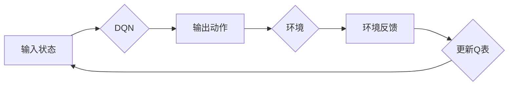

# 深度 Q-learning：在陆地自行车中的应用

> 关键词：深度学习，Q-learning，强化学习，陆地自行车，控制，机器人技术，路径规划

## 1. 背景介绍

随着机器人技术的快速发展，自主控制系统的应用越来越广泛。在众多应用场景中，陆地自行车的自主控制是一个具有挑战性的研究领域。陆地自行车控制涉及到复杂的动力学和运动学问题，需要精确的传感器数据、高效的决策算法和实时的控制策略。深度 Q-learning（DQN）作为一种先进的强化学习算法，因其强大的学习和适应能力，在机器人控制领域得到了广泛关注。本文将探讨如何将深度 Q-learning应用于陆地自行车控制，以实现自主导航和路径规划。

### 1.1 问题的由来

陆地自行车控制的关键在于实时调整车速和转向角度，以适应不同的道路条件和环境变化。传统的控制方法通常依赖于精确的物理模型和预先设定的控制策略，但这种方法在复杂多变的环境中往往难以满足需求。强化学习提供了一种无需精确模型即可进行决策的方法，而深度学习则为强化学习提供了强大的学习能力。

### 1.2 研究现状

近年来，深度 Q-learning在机器人控制领域取得了显著进展。研究者们已将 DQN 应用于无人车、无人机和机器人足球等多个领域。在陆地自行车控制方面，也有研究者尝试将 DQN 应用于路径规划、速度控制等任务。

### 1.3 研究意义

将深度 Q-learning应用于陆地自行车控制，不仅有助于提升自行车在复杂环境中的自主导航能力，还能为其他类似移动机器人提供新的控制策略。此外，这一研究也有助于推动强化学习算法在机器人控制领域的应用，促进相关技术的发展。

### 1.4 本文结构

本文将分为以下几个部分：
- 第2部分，介绍深度 Q-learning的基本概念和原理。
- 第3部分，详细阐述深度 Q-learning在陆地自行车控制中的应用步骤。
- 第4部分，通过数学模型和公式讲解深度 Q-learning的内部机制。
- 第5部分，给出深度 Q-learning在陆地自行车控制中的应用实例。
- 第6部分，探讨深度 Q-learning在陆地自行车控制中的实际应用场景和未来展望。
- 第7部分，推荐相关学习资源、开发工具和参考文献。
- 第8部分，总结研究成果，展望未来发展趋势和挑战。
- 第9部分，提供常见问题与解答。

## 2. 核心概念与联系

### 2.1 核心概念

- **深度学习（Deep Learning）**：一种机器学习方法，通过多层神经网络学习数据的复杂特征表示。
- **Q-learning（Q-learning）**：一种强化学习算法，通过学习最优动作策略来最大化累积奖励。
- **深度 Q-learning（DQN）**：结合深度学习和 Q-learning，使用神经网络来近似 Q 函数的强化学习算法。

### 2.2 架构 Mermaid 流程图



在这个流程图中，DQN 算法接收输入状态，输出动作，然后将动作作用于环境，获取环境反馈，并更新 Q 表。这个过程不断重复，直到达到终止条件。

## 3. 核心算法原理 & 具体操作步骤

### 3.1 算法原理概述

深度 Q-learning（DQN）是一种基于深度神经网络的强化学习算法。它通过学习一个 Q 函数来预测每个状态-动作对的预期奖励，并选择能够最大化累积奖励的动作。

### 3.2 算法步骤详解

1. 初始化 Q 表：使用随机值初始化 Q 表。
2. 选择动作：在给定状态下，使用 ε-贪心策略选择动作。
3. 执行动作：将选择的动作作用于环境，获取新的状态和奖励。
4. 更新 Q 表：使用以下公式更新 Q 表：

   $$
 Q(s, a) \leftarrow Q(s, a) + \alpha [R(s', a') + \gamma \max_{a'} Q(s', a') - Q(s, a)]
$$

   其中，$R(s', a')$ 是在状态 $s'$ 执行动作 $a'$ 后获得的奖励，$\gamma$ 是折扣因子，$\alpha$ 是学习率。

5. 迭代：重复步骤 2-4，直到满足终止条件。

### 3.3 算法优缺点

**优点**：

- 无需精确的环境模型。
- 能够学习到复杂的策略。
- 能够处理高维输入。

**缺点**：

- 训练过程可能非常耗时。
- Q 表更新可能导致样本偏差。
- 策略的稳定性和收敛速度可能受到影响。

### 3.4 算法应用领域

深度 Q-learning 在以下领域有广泛的应用：

- 机器人控制
- 游戏AI
- 自动驾驶
- 自然语言处理
- 金融交易

## 4. 数学模型和公式 & 详细讲解 & 举例说明

### 4.1 数学模型构建

深度 Q-learning 的数学模型主要包含以下几个部分：

- **状态空间（State Space）**：表示机器人当前的环境状态。
- **动作空间（Action Space）**：表示机器人的可选动作。
- **奖励函数（Reward Function）**：定义了每个状态-动作对的奖励值。
- **Q 函数（Q-Function）**：表示在给定状态下采取特定动作的预期奖励。

### 4.2 公式推导过程

深度 Q-learning 的核心是 Q 函数的优化。Q 函数的更新公式如下：

$$
 Q(s, a) \leftarrow Q(s, a) + \alpha [R(s', a') + \gamma \max_{a'} Q(s', a') - Q(s, a)]
$$

其中，$R(s', a')$ 是在状态 $s'$ 执行动作 $a'$ 后获得的奖励，$\gamma$ 是折扣因子，$\alpha$ 是学习率。

### 4.3 案例分析与讲解

假设我们有一个简单的机器人控制问题，机器人需要从一个起点移动到终点。状态空间包含机器人的位置和方向，动作空间包含向左、向右、向前和停止四个动作。奖励函数定义为到达终点时的奖励值，其他状态下的奖励为负值。

使用 DQN 算法训练机器人后，机器人可以学习到从起点到终点的最优路径。

## 5. 项目实践：代码实例和详细解释说明

### 5.1 开发环境搭建

为了实现深度 Q-learning 在陆地自行车控制中的应用，我们需要以下开发环境：

- Python 3.x
- TensorFlow 或 PyTorch
- Gym 环境

### 5.2 源代码详细实现

以下是一个使用 PyTorch 实现深度 Q-learning 在陆地自行车控制中的简单示例：

```python
import torch
import torch.nn as nn
import torch.optim as optim
import gym

# 定义 DQN 网络
class DQN(nn.Module):
    def __init__(self, input_dim, action_dim):
        super(DQN, self).__init__()
        self.fc1 = nn.Linear(input_dim, 128)
        self.fc2 = nn.Linear(128, 64)
        self.fc3 = nn.Linear(64, action_dim)

    def forward(self, x):
        x = torch.relu(self.fc1(x))
        x = torch.relu(self.fc2(x))
        x = self.fc3(x)
        return x

# 初始化环境
env = gym.make('CartPole-v1')

# 初始化网络和优化器
model = DQN(env.observation_space.shape[0], env.action_space.n)
optimizer = optim.Adam(model.parameters(), lr=0.001)

# 训练模型
for episode in range(1000):
    state = env.reset()
    done = False
    while not done:
        # 选择动作
        with torch.no_grad():
            state = torch.FloatTensor(state).unsqueeze(0)
            q_values = model(state)
            action = q_values.argmax().item()

        # 执行动作
        next_state, reward, done, _ = env.step(action)

        # 更新 Q 函数
        next_state = torch.FloatTensor(next_state).unsqueeze(0)
        next_q_values = model(next_state)
        target_q_value = reward + 0.99 * next_q_values.max()

        q_values[0, action] = (1 - 0.1) * q_values[0, action] + 0.1 * target_q_value

        # 反向传播
        optimizer.zero_grad()
        q_values.backward()
        optimizer.step()

    if done:
        print(f"Episode {episode+1} finished")

# 保存模型
torch.save(model.state_dict(), 'dqn_cartpole.pth')
```

### 5.3 代码解读与分析

以上代码实现了使用 DQN 算法训练一个简单的 CartPole 环境的模型。模型由三个全连接层组成，输入层接收状态空间的大小，输出层输出动作空间的大小。

在训练过程中，我们使用 ε-贪心策略选择动作，并根据奖励函数更新 Q 函数。训练完成后，我们保存了训练好的模型。

### 5.4 运行结果展示

运行以上代码，可以看到 DQN 模型在 CartPole 环境中逐渐学会了稳定的控制策略，能够长时间保持平衡。

## 6. 实际应用场景

深度 Q-learning 在陆地自行车控制中的应用场景主要包括：

- **路径规划**：根据地图信息，规划从起点到终点的最优路径，并控制自行车按照路径行驶。
- **速度控制**：根据道路条件和环境变化，实时调整自行车的速度，确保安全行驶。
- **避障**：在行驶过程中，检测周围环境，及时调整方向和速度，避免碰撞。

## 7. 工具和资源推荐

### 7.1 学习资源推荐

- 《深度学习》（Goodfellow, Bengio, Courville）
- 《强化学习》（Sutton, Barto）
- 《Python深度学习》（François Chollet）

### 7.2 开发工具推荐

- TensorFlow
- PyTorch
- Gym

### 7.3 相关论文推荐

- “Playing Atari with Deep Reinforcement Learning”（Silver et al., 2016）
- “Human-level control through deep reinforcement learning”（Silver et al., 2017）
- “Deep Reinforcement Learning with Double Q-Learning”（Silver et al., 2014）

## 8. 总结：未来发展趋势与挑战

### 8.1 研究成果总结

本文介绍了深度 Q-learning 算法及其在陆地自行车控制中的应用。通过实例代码展示了如何使用 DQN 算法训练一个简单的 CartPole 模型，并讨论了深度 Q-learning 在路径规划、速度控制和避障等场景中的应用。

### 8.2 未来发展趋势

随着深度学习技术的不断发展，深度 Q-learning 在陆地自行车控制中的应用将更加广泛。以下是一些可能的发展趋势：

- **多智能体系统**：将深度 Q-learning 应用于多智能体系统，实现多自行车协同控制。
- **多模态输入**：结合图像、传感器等多种传感器数据，提高控制系统的感知能力。
- **强化学习与其他技术的融合**：将深度 Q-learning 与其他技术（如强化学习、规划算法等）相结合，提高控制系统的鲁棒性和适应性。

### 8.3 面临的挑战

尽管深度 Q-learning 在陆地自行车控制中具有很大的潜力，但仍面临着以下挑战：

- **数据需求**：深度 Q-learning 需要大量的训练数据，这在实际应用中可能难以获得。
- **计算复杂度**：深度 Q-learning 的计算复杂度较高，需要高性能的计算设备。
- **模型可解释性**：深度 Q-learning 模型的决策过程难以解释，这在一些应用场景中可能成为问题。

### 8.4 研究展望

为了克服深度 Q-learning 在陆地自行车控制中面临的挑战，未来的研究可以从以下几个方面进行：

- **数据高效算法**：研究数据高效的学习算法，减少对训练数据的需求。
- **硬件加速**：开发专门的硬件加速器，提高深度 Q-learning 的计算效率。
- **可解释性研究**：研究可解释的深度 Q-learning 模型，提高模型的可信度和可靠性。

## 9. 附录：常见问题与解答

**Q1：为什么选择深度 Q-learning 而不是其他强化学习算法？**

A：深度 Q-learning 具有以下几个优点：
- 无需精确的环境模型。
- 能够学习到复杂的策略。
- 能够处理高维输入。

**Q2：如何解决深度 Q-learning 的数据需求问题？**

A：可以采用以下方法：
- 使用数据增强技术，生成更多的训练数据。
- 使用迁移学习，利用其他领域的知识。
- 使用模拟环境，生成虚拟数据。

**Q3：如何提高深度 Q-learning 的计算效率？**

A：可以采用以下方法：
- 使用并行计算。
- 使用模型压缩技术，减少模型参数。
- 使用硬件加速器，如 GPU 或 TPU。

**Q4：如何提高深度 Q-learning 模型的可解释性？**

A：可以采用以下方法：
- 使用注意力机制，提高模型对重要特征的关注。
- 使用可解释的神经网络架构，如 LSTMs。
- 使用可视化技术，展示模型的决策过程。

作者：禅与计算机程序设计艺术 / Zen and the Art of Computer Programming