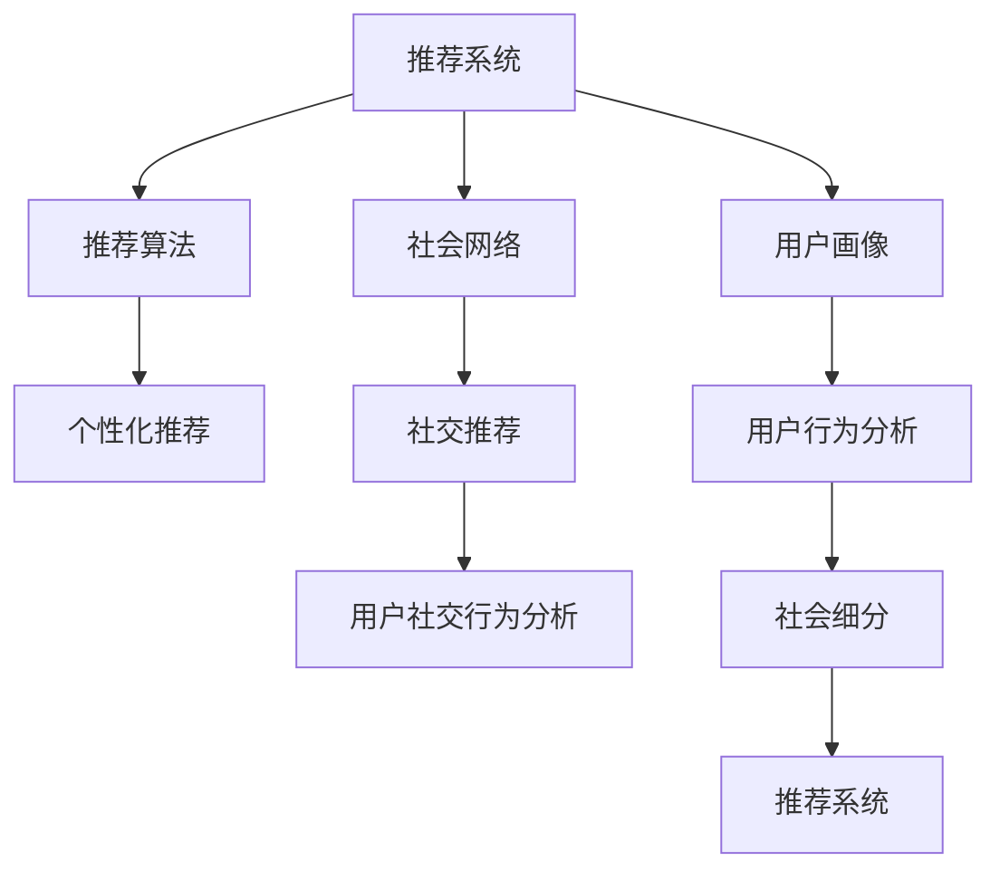

                 

# 社会细分：每个人沉醉于自己的世界

> 关键词：社会网络, 用户画像, 个性化推荐, 推荐系统, 社交行为分析

## 1. 背景介绍

在信息爆炸的时代，个体被海量的信息包围，如何从中筛选出最有价值的信息成为一大挑战。推荐系统正是在这一背景下应运而生，通过分析用户的行为，推荐其感兴趣的内容，从而提高信息获取的效率和质量。然而，推荐系统往往忽略了社会结构的影响，导致用户只能沉浸在自己的信息世界中，与其他用户的信息世界隔阂越来越深。

社会细分是推荐系统中一个重要概念，它通过对用户社交网络和社会行为进行分析，将用户分成不同的细分群体，从而为用户提供更加个性化和贴合实际需求的推荐。社会细分不仅能够提升推荐系统的效果，还能够帮助用户发现与自己相似的其他用户，扩大其信息世界的边界。

## 2. 核心概念与联系

### 2.1 核心概念概述

为了更好地理解社会细分在推荐系统中的应用，本节将介绍几个关键概念：

- **推荐系统(Recommendation System)**：通过分析用户的历史行为，为用户推荐其可能感兴趣的内容的系统。推荐系统广泛应用于电商、视频、新闻等众多领域，是提高信息获取效率和质量的重要手段。

- **社会网络(Social Network)**：由个体（用户）和个体之间互动关系构成的网络，用于描述个体之间的社会联系。在推荐系统中，社会网络可以用于分析用户之间的相似性，帮助推荐更加个性化的内容。

- **用户画像(User Profile)**：通过用户的行为数据、社交网络等构建的详尽用户画像，用于描述用户的兴趣、偏好、社交关系等信息。用户画像是推荐系统实现个性化推荐的基础。

- **社会细分(Social Segmentation)**：通过分析用户的社交网络和社会行为，将用户分成不同的细分群体。社会细分的目的在于更好地理解用户，提升推荐系统的个性化和准确性。

- **推荐算法(Recommendation Algorithm)**：包括基于内容的推荐、协同过滤推荐、混合推荐等，用于根据用户画像和历史行为数据为用户推荐内容。推荐算法是推荐系统的核心组成部分。

- **个性化推荐(Personalized Recommendation)**：基于用户画像和行为数据，为用户提供个性化推荐的系统。个性化推荐能够提高用户满意度和黏性，是推荐系统追求的主要目标之一。

- **社交推荐(Social Recommendation)**：利用用户的社交网络信息，为用户推荐其社交网络中其他用户感兴趣的内容，帮助用户发现与自己相似的其他用户。

- **隐私保护(Privacy Protection)**：推荐系统中需要保护用户隐私，避免个人信息泄露。隐私保护措施包括数据匿名化、差分隐私等。

### 2.2 核心概念间的联系

这些核心概念之间的联系可以通过以下Mermaid流程图来展示：



这个流程图展示了几大核心概念之间的关系：

1. 推荐系统由推荐算法和用户画像构成，用于为用户推荐个性化内容。
2. 用户画像和行为分析构成了推荐系统的基础，社会网络用于分析用户间的相似性。
3. 社会细分通过分析用户的社交网络，将用户分成不同的细分群体，提升推荐系统的个性化。
4. 社交推荐利用用户社交网络中的信息，为用户推荐社交网络中其他用户感兴趣的内容。
5. 隐私保护是推荐系统中不可或缺的一环，确保用户隐私不受侵犯。

这些概念共同构成了推荐系统的生态系统，使其能够高效地为用户提供个性化和贴合实际需求的推荐。

## 3. 核心算法原理 & 具体操作步骤

### 3.1 算法原理概述

社会细分算法通过分析用户的社交网络和社会行为，将用户分成不同的细分群体。算法的基本流程如下：

1. 收集用户的行为数据和社交网络数据。
2. 构建用户画像，描述用户的兴趣、偏好、社交关系等信息。
3. 分析用户的社交网络，计算用户间的相似度。
4. 将用户分成不同的细分群体，每个群体内的用户具有相似的社会行为和兴趣。
5. 根据用户画像和细分群体，为用户推荐个性化的内容。

社会细分算法的核心在于如何定义相似性和如何将用户分成不同的细分群体。常用的相似性度量包括基于内容的相似性、基于行为相似性和基于社交相似性等。细分群体的划分方法包括层次聚类、密度聚类、图分割等。

### 3.2 算法步骤详解

#### 3.2.1 数据收集

数据收集是社会细分的第一步。需要收集用户的行为数据和社交网络数据，这些数据可以来源于用户的浏览历史、购买记录、社交媒体互动等。常用的数据收集方式包括：

- 浏览器插件和API：通过浏览器插件收集用户的浏览历史和点击行为。
- 电商平台数据：通过电商平台记录用户的购买记录和评分。
- 社交媒体数据：通过社交媒体API获取用户的互动信息和社交网络。
- 智能设备数据：通过智能设备记录用户的定位、行为等数据。

#### 3.2.2 用户画像构建

用户画像描述了用户的兴趣、偏好、社交关系等信息，是推荐系统实现个性化推荐的基础。用户画像的构建过程如下：

1. 提取用户的属性特征，如年龄、性别、职业等。
2. 分析用户的历史行为数据，如浏览记录、购买记录等，提取用户的兴趣和偏好。
3. 利用用户的社交网络信息，分析用户的社交关系和社交行为。
4. 综合上述信息，构建详尽的用户画像。

#### 3.2.3 相似度计算

相似度计算用于衡量用户之间的相似性，是社会细分的关键步骤。常用的相似度度量方法包括：

- 基于内容的相似性：通过计算用户的历史行为数据和内容标签的相似度，衡量用户之间的兴趣相似性。
- 基于行为的相似性：通过计算用户的行为数据和行为模式的相似度，衡量用户之间的行为相似性。
- 基于社交的相似性：通过计算用户之间的社交网络距离，衡量用户之间的社交关系相似性。

#### 3.2.4 用户细分

用户细分的目的是将用户分成不同的群体，每个群体内的用户具有相似的社会行为和兴趣。常用的用户细分方法包括：

- 层次聚类：通过迭代合并相似度高的用户，将用户分成不同的层次，形成不同的细分群体。
- 密度聚类：通过计算用户的密度，将密度相似的用户分成同一群体。
- 图分割：通过图割算法，将用户分成不同的子图，每个子图中的用户具有相似的社交关系和行为。

#### 3.2.5 个性化推荐

个性化推荐根据用户画像和细分群体，为用户推荐个性化的内容。常用的推荐方法包括：

- 基于内容的推荐：通过用户画像和内容特征的相似度，为用户推荐内容。
- 基于行为的推荐：通过分析用户的行为数据，预测用户的兴趣，为用户推荐内容。
- 基于社交的推荐：利用用户社交网络中的信息，为用户推荐社交网络中其他用户感兴趣的内容。
- 混合推荐：综合利用基于内容的推荐、基于行为的推荐和基于社交的推荐，提升推荐效果。

### 3.3 算法优缺点

社会细分算法具有以下优点：

- 能够提升推荐系统的个性化和准确性。通过分析用户的社交网络和社会行为，将用户分成不同的群体，为用户提供更加个性化的推荐。
- 能够帮助用户发现与自己相似的其他用户，扩大其信息世界的边界。
- 能够发现和推荐用户兴趣中的长尾内容，避免信息过载。

然而，社会细分算法也存在一些缺点：

- 数据需求较大。需要收集和分析大量的用户行为数据和社交网络数据，对数据的获取和处理要求较高。
- 对数据质量敏感。数据的不完整性、不准确性会影响算法的准确性。
- 对隐私问题要求高。需要保护用户隐私，避免个人信息泄露。

### 3.4 算法应用领域

社会细分算法在多个领域中得到了广泛的应用：

- 电商推荐：通过分析用户的购买记录和社交网络，为用户推荐个性化商品。
- 视频推荐：通过分析用户的观看历史和社交网络，为用户推荐个性化视频。
- 新闻推荐：通过分析用户的阅读历史和社交网络，为用户推荐个性化新闻。
- 社交推荐：利用用户的社交网络信息，为用户推荐其他用户感兴趣的内容。
- 内容聚合：通过分析用户的兴趣和社交网络，为用户推荐聚合的个性化内容。

此外，社会细分算法还在广告推荐、音乐推荐、教育推荐等领域得到了应用。随着数据技术和算法研究的不断进步，社会细分算法将有更广阔的应用前景。

## 4. 数学模型和公式 & 详细讲解 & 举例说明

### 4.1 数学模型构建

本节将使用数学语言对社会细分算法的原理进行更加严格的刻画。

记用户集合为 $U$，每个用户 $u \in U$ 的行为数据为 $x_u$，社交网络数据为 $s_u$。设相似度矩阵为 $S$，每个用户画像为 $p_u$。

用户细分的目标是最大化用户之间的相似度，同时最大化用户画像与用户相似度的差异。可以使用如下优化问题描述：

$$
\max_{G} \sum_{u,v \in U} S_{uv} \cdot \mathbf{p_u}^T \cdot \mathbf{p_v}
$$

其中 $G$ 表示用户分组，$S_{uv}$ 表示用户 $u$ 和用户 $v$ 之间的相似度，$\mathbf{p_u}$ 和 $\mathbf{p_v}$ 表示用户 $u$ 和用户 $v$ 的画像向量。

### 4.2 公式推导过程

以下我们以基于密度的聚类算法为例，推导用户细分的数学模型和优化公式。

密度聚类算法通过计算用户的密度，将密度相似的用户分成同一群体。设用户 $u$ 的邻居集合为 $N(u)$，用户 $u$ 的社交网络度数为 $\deg(u)$，用户 $u$ 的密度为 $\rho_u$，用户 $u$ 和用户 $v$ 之间的密度相似度为 $S_{uv}$。

用户 $u$ 的密度定义为：

$$
\rho_u = \frac{\sum_{v \in N(u)} S_{uv}}{\deg(u)}
$$

密度聚类的目标是最小化用户间的密度差异，同时最大化用户画像与密度的差异。优化问题可以表示为：

$$
\min_{G} \sum_{u,v \in U} |\rho_u - \rho_v| \cdot \mathbf{p_u}^T \cdot \mathbf{p_v}
$$

上述优化问题可以通过迭代优化算法求解，如谱聚类算法、K-means算法等。

### 4.3 案例分析与讲解

假设我们有一组用户数据，每个用户记录了其浏览历史和社交网络数据。我们将使用基于密度的聚类算法对用户进行细分，并根据用户画像为用户推荐个性化内容。

首先，我们需要构建每个用户的画像向量 $p_u$，可以使用用户的历史行为数据和社交网络数据。然后，计算用户之间的相似度矩阵 $S$，可以使用余弦相似度或欧几里得距离等方法。

接着，使用谱聚类算法或K-means算法对用户进行聚类，得到不同的用户群体。最后，根据用户画像和细分群体，为用户推荐个性化内容。

例如，一个用户画像为 $p_u = [0.5, 0.3, 0.8]$，表示用户对电影、书籍和音乐感兴趣，相似度矩阵 $S$ 如下：

| u   | v   | S_(u,v) |
| ---- | ---- | ------- |
| 1    | 2    | 0.8     |
| 2    | 3    | 0.6     |
| 3    | 4    | 0.5     |
| ...  | ...  | ...     |

我们可以将用户分成两个群体，群体1和群体2。使用谱聚类算法，可以得到如下聚类结果：

| u   | v   | G_u |
| ---- | ---- | ---- |
| 1    | 2    | 1    |
| 2    | 3    | 2    |
| 3    | 4    | 1    |
| ...  | ...  | ...  |

根据用户画像和细分群体，我们可以为用户推荐电影、书籍和音乐。例如，对于群体1的用户，推荐电影和书籍；对于群体2的用户，推荐电影和音乐。

## 5. 项目实践：代码实例和详细解释说明

### 5.1 开发环境搭建

在进行社会细分实践前，我们需要准备好开发环境。以下是使用Python进行PyTorch开发的环境配置流程：

1. 安装Anaconda：从官网下载并安装Anaconda，用于创建独立的Python环境。

2. 创建并激活虚拟环境：
```bash
conda create -n pytorch-env python=3.8 
conda activate pytorch-env
```

3. 安装PyTorch：根据CUDA版本，从官网获取对应的安装命令。例如：
```bash
conda install pytorch torchvision torchaudio cudatoolkit=11.1 -c pytorch -c conda-forge
```

4. 安装Pandas库：
```bash
pip install pandas
```

5. 安装Scikit-learn库：
```bash
pip install scikit-learn
```

6. 安装Numpy库：
```bash
pip install numpy
```

完成上述步骤后，即可在`pytorch-env`环境中开始社会细分实践。

### 5.2 源代码详细实现

下面我们以社交网络数据为例，给出使用Pandas库进行社交聚类的Python代码实现。

```python
import pandas as pd
import networkx as nx

# 加载社交网络数据
G = nx.read_edgelist('social_network.txt')

# 计算每个节点的度数
degrees = G.degree().values()

# 计算每个节点的密度
rho = {u: sum(G[u].values()) / degrees[u] for u in G.nodes()}

# 使用谱聚类算法进行聚类
from sklearn.cluster import SpectralClustering
import numpy as np

X = np.array([rho[u] for u in G.nodes()])
labels = SpectralClustering(n_clusters=2, affinity='precomputed', eigen_solver='arpack').fit(X).labels_

# 输出聚类结果
print(labels)
```

上述代码首先加载社交网络数据，计算每个节点的度数和密度。然后使用谱聚类算法对节点进行聚类，得到不同的聚类标签。最后输出聚类结果。

### 5.3 代码解读与分析

让我们再详细解读一下关键代码的实现细节：

**加载社交网络数据**：
- `G = nx.read_edgelist('social_network.txt')`：使用networkx库加载社交网络数据，存储为Graph对象。

**计算节点度数和密度**：
- `degrees = G.degree().values()`：计算每个节点的度数。
- `rho = {u: sum(G[u].values()) / degrees[u] for u in G.nodes()}`：计算每个节点的密度。

**使用谱聚类算法进行聚类**：
- `from sklearn.cluster import SpectralClustering`：导入sklearn库的谱聚类算法。
- `X = np.array([rho[u] for u in G.nodes()])`：将节点密度数组转换为NumPy数组。
- `labels = SpectralClustering(n_clusters=2, affinity='precomputed', eigen_solver='arpack').fit(X).labels_`：使用谱聚类算法进行聚类，得到聚类标签。

**输出聚类结果**：
- `print(labels)`：输出聚类结果。

可以看到，利用Python和第三方库，我们可以很方便地实现社会细分算法的核心功能。

## 6. 实际应用场景

### 6.1 电商推荐

电商推荐是社会细分算法的典型应用场景之一。电商推荐系统需要为用户推荐其可能感兴趣的商品，提升用户体验和销售额。

电商推荐系统通常使用用户的浏览历史、购买记录、评价等数据，结合用户的社交网络信息，进行推荐。例如，一个用户浏览了手机、电脑和电视，同时其好友推荐了手机和电脑，电商推荐系统就可以为用户推荐手机、电脑和电视。

### 6.2 视频推荐

视频推荐系统需要为用户推荐其可能感兴趣的视频内容，提升用户的视频体验和平台黏性。

视频推荐系统通常使用用户的观看历史、评分、收藏等数据，结合用户的社交网络信息，进行推荐。例如，一个用户观看了很多恐怖片，同时其好友推荐了科幻片，视频推荐系统就可以为用户推荐恐怖片和科幻片。

### 6.3 新闻推荐

新闻推荐系统需要为用户推荐其可能感兴趣的新闻内容，提升用户的新闻体验和平台黏性。

新闻推荐系统通常使用用户的阅读历史、点赞、评论等数据，结合用户的社交网络信息，进行推荐。例如，一个用户经常阅读国际新闻，同时其好友推荐了体育新闻，新闻推荐系统就可以为用户推荐国际新闻和体育新闻。

### 6.4 未来应用展望

随着数据技术和算法研究的不断进步，社会细分算法将有更广阔的应用前景。未来，社会细分算法将在以下领域得到进一步应用：

- 医疗推荐：通过分析患者的社交网络和医疗记录，为用户推荐个性化治疗方案和健康建议。
- 教育推荐：通过分析学生的社交网络和学习记录，为用户推荐个性化的学习内容和资源。
- 智能交通：通过分析用户的出行行为和社交网络，为用户推荐最优的出行路线和交通工具。
- 金融推荐：通过分析用户的财务记录和社交网络，为用户推荐个性化的理财方案和投资建议。
- 社交推荐：利用用户的社交网络信息，为用户推荐其他用户感兴趣的内容，帮助用户发现与自己相似的其他用户。

## 7. 工具和资源推荐

### 7.1 学习资源推荐

为了帮助开发者系统掌握社会细分算法的理论基础和实践技巧，这里推荐一些优质的学习资源：

1. 《推荐系统实战》系列博文：由大模型技术专家撰写，深入浅出地介绍了推荐系统的原理、算法和实践，涵盖社交细分的相关内容。

2. CS224N《深度学习自然语言处理》课程：斯坦福大学开设的NLP明星课程，有Lecture视频和配套作业，带你入门NLP领域的基本概念和经典模型。

3. 《推荐系统》书籍：著名推荐系统专家Wikipedia推荐的经典入门书籍，涵盖了推荐系统的理论和实践，包括社会细分的相关内容。

4. HuggingFace官方文档：Transformers库的官方文档，提供了海量预训练模型和完整的微调样例代码，是进行推荐系统开发的利器。

5. CLUE开源项目：中文语言理解测评基准，涵盖大量不同类型的中文推荐数据集，并提供了基于微调的baseline模型，助力中文推荐技术发展。

通过对这些资源的学习实践，相信你一定能够快速掌握社会细分算法的精髓，并用于解决实际的推荐问题。

### 7.2 开发工具推荐

高效的开发离不开优秀的工具支持。以下是几款用于社会细分推荐系统开发的常用工具：

1. PyTorch：基于Python的开源深度学习框架，灵活动态的计算图，适合快速迭代研究。大部分推荐系统组件都有PyTorch版本的实现。

2. TensorFlow：由Google主导开发的开源深度学习框架，生产部署方便，适合大规模工程应用。同样有丰富的推荐系统组件资源。

3. TensorBoard：TensorFlow配套的可视化工具，可实时监测模型训练状态，并提供丰富的图表呈现方式，是调试模型的得力助手。

4. Weights & Biases：模型训练的实验跟踪工具，可以记录和可视化模型训练过程中的各项指标，方便对比和调优。与主流深度学习框架无缝集成。

5. Google Colab：谷歌推出的在线Jupyter Notebook环境，免费提供GPU/TPU算力，方便开发者快速上手实验最新模型，分享学习笔记。

合理利用这些工具，可以显著提升推荐系统开发的效率，加快创新迭代的步伐。

### 7.3 相关论文推荐

社会细分算法的发展源于学界的持续研究。以下是几篇奠基性的相关论文，推荐阅读：

1. Social Recommendation Systems: A Survey – Current Challenges, Opportunities, and Research Directions：综述了社交推荐系统的现状和未来发展方向，介绍了多种社会细分算法。

2. Neural Collaborative Filtering：介绍了基于神经网络的协同过滤推荐算法，可用于基于内容的推荐和基于行为的推荐。

3. Mining Social Media Data for Recommendation Systems: The Next Generation of Recommendations：探讨了社交媒体数据在推荐系统中的应用，介绍了多种社会细分方法。

4. Knowledge-Intensive Collaborative Filtering: Enhancing Recommendations with Expert Knowledge – A Case Study in Healthcare：通过结合专家知识，提升了推荐系统的效果，介绍了多种社会细分和知识融合方法。

5. Scalable Multi-Personalized Recommendations Using Sparse Data：介绍了基于稀疏数据的推荐算法，可用于社交推荐和个性化推荐。

这些论文代表了大语言模型微调技术的发展脉络。通过学习这些前沿成果，可以帮助研究者把握学科前进方向，激发更多的创新灵感。

除上述资源外，还有一些值得关注的前沿资源，帮助开发者紧跟社会细分算法的最新进展，例如：

1. arXiv论文预印本：人工智能领域最新研究成果的发布平台，包括大量尚未发表的前沿工作，学习前沿技术的必读资源。

2. 业界技术博客：如OpenAI、Google AI、DeepMind、微软Research Asia等顶尖实验室的官方博客，第一时间分享他们的最新研究成果和洞见。

3. 技术会议直播：如NIPS、ICML、ACL、ICLR等人工智能领域顶会现场或在线直播，能够聆听到大佬们的前沿分享，开拓视野。

4. GitHub热门项目：在GitHub上Star、Fork数最多的推荐相关项目，往往代表了该技术领域的发展趋势和最佳实践，值得去学习和贡献。

5. 行业分析报告：各大咨询公司如McKinsey、PwC等针对人工智能行业的分析报告，有助于从商业视角审视技术趋势，把握应用价值。

总之，对于社会细分算法的学习和实践，需要开发者保持开放的心态和持续学习的意愿。多关注前沿资讯，多动手实践，多思考总结，必将收获满满的成长收益。

## 8. 总结：未来发展趋势与挑战

### 8.1 总结

本文对社会细分算法进行了全面系统的介绍。首先阐述了社会细分的背景和意义，明确了其在推荐系统中的重要性。其次，从原理到实践，详细讲解了社会细分算法的数学原理和关键步骤，给出了社会细分算法开发的完整代码实例。同时，本文还广泛探讨了社会细分算法在电商推荐、视频推荐、新闻推荐等多个领域的应用前景，展示了社会细分算法的巨大潜力。此外，本文精选了社会细分算法的各类学习资源，力求为读者提供全方位的技术指引。

通过本文的系统梳理，可以看到，社会细分算法正在成为推荐系统的重要范式，极大地提升了推荐系统的个性化和准确性。社会细分不仅能够提升推荐系统的效果，还能够帮助用户发现与自己相似的其他用户，扩大其信息世界的边界。未来，伴随数据技术和算法研究的不断进步，社会细分算法将有更广阔的应用前景。

### 8.2 未来发展趋势

展望未来，社会细分算法将呈现以下几个发展趋势：

1. 数据需求进一步降低。随着数据采集和处理技术的进步，推荐系统可以逐步减少对标注数据的依赖，更加注重数据的多样性和实时性。
2. 社交行为分析更加深入。社交行为分析能够帮助推荐系统更好地理解用户，提升推荐效果。未来将进一步研究社交行为背后的心理和情感因素。
3. 推荐系统与更多外部数据的融合。推荐系统将更多地与外部知识库、规则库等专家知识结合，形成更加全面、准确的信息整合能力。
4. 用户细分的更加精细化。未来将采用更加精细化的用户分组策略，如层次聚类、图分割等，提升用户细分的准确性。
5. 推荐系统与用户交互的进一步优化。推荐系统将更加注重用户反馈，通过交互式推荐和即时反馈，提升用户体验和满意度。
6. 推荐系统的可解释性和透明度。未来将进一步提升推荐系统的可解释性和透明度，让用户能够理解推荐结果的来源和逻辑。

以上趋势凸显了社会细分算法的广阔前景。这些方向的探索发展，必将进一步提升推荐系统的个性化和准确性，为推荐系统的不断进步提供新的动力。

### 8.3 面临的挑战

尽管社会细分算法已经取得了瞩目成就，但在迈向更加智能化、普适化应用的过程中，它仍面临着诸多挑战：

1. 数据质量要求高。推荐系统需要大量高质量的数据，数据的不完整性、不准确性会影响算法的准确性。
2. 用户隐私问题敏感。推荐系统需要保护用户隐私，避免个人信息泄露。
3. 推荐效果不稳定。推荐系统容易受到用户行为变化的影响，导致推荐效果不稳定。
4. 推荐算法复杂度高。推荐算法需要处理海量数据，算法复杂度较高，需要高效的数据处理和计算能力。
5. 跨领域适应性差。推荐系统在不同领域应用时，需要重新调整算法和数据，适应不同领域的特点。

正视社会细分面临的这些挑战，积极应对并寻求突破，将是社会细分算法不断进步的关键。相信随着学界和产业界的共同努力，这些挑战终将一一被克服，社会细分算法必将在构建人机协同的智能时代中扮演越来越重要的角色。

### 8.4 研究展望

面对社会细分算法所面临的种种挑战，未来的研究需要在以下几个方面寻求新的突破：

1. 探索更加高效的数据采集和处理技术。通过大数据和分布式计算技术，进一步降低数据需求，提高数据质量和实时性。
2. 研究更加深入的社交行为分析方法。结合心理学、社会学等学科，深入分析社交行为背后的心理和情感因素，提升推荐系统的准确性。
3. 开发更加高效的推荐算法。利用深度学习、强化学习等技术，开发更加高效、可解释的推荐算法，提升推荐系统的性能和透明度。
4. 引入更加多样化的外部知识。将专家知识、

