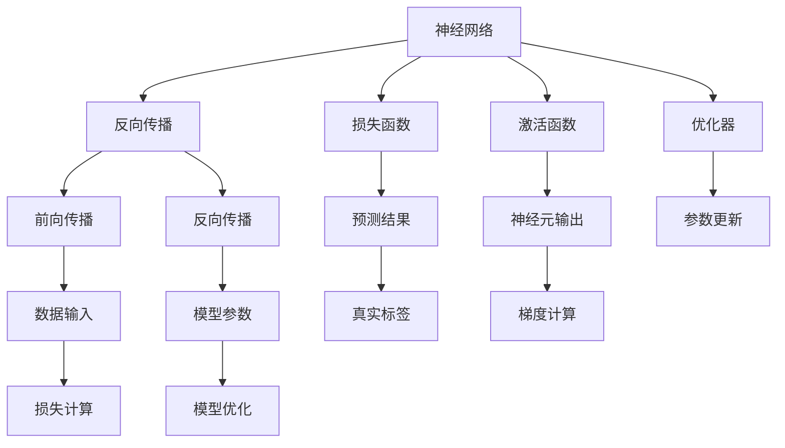

                 

# 神经网络：开启智能新纪元

## 1. 背景介绍

### 1.1 问题由来
在过去的几十年里，人工智能（AI）领域经历了翻天覆地的变化。从最初的专家系统到机器学习（ML），再到深度学习（DL），每一次技术的突破都极大地推动了AI的进步。其中，神经网络（Neural Network, NN）作为深度学习的重要组成部分，极大地拓展了机器学习的能力，使其在图像识别、语音识别、自然语言处理（NLP）等诸多领域取得了革命性的突破。

神经网络是一种模拟人脑神经元工作原理的计算模型，通过多层次的非线性变换，可以对复杂的数据模式进行拟合和预测。与传统的浅层学习模型相比，神经网络能够处理更加抽象和复杂的特征，具备更强的表达能力和泛化能力。

在神经网络的推动下，AI技术已经从简单的模式识别，逐步拓展到更为高级的认知计算，如图像理解、语音生成、情感分析等。这些应用不仅在学术界引起了广泛的关注，更在工业界催生了众多的落地场景，如自动驾驶、智能推荐、金融风控等，极大地提升了各行各业的效率和生产力。

### 1.2 问题核心关键点
神经网络的本质是通过多层次的非线性变换，对输入数据进行特征提取和模式识别。其核心思想是模拟人脑神经元之间的连接和传递，通过训练过程不断调整模型参数，使得模型能够对新的输入数据进行准确的预测。

神经网络的核心概念包括：
1. **神经元（Neuron）**：神经网络的基本计算单元，接收输入数据，并输出结果。
2. **激活函数（Activation Function）**：定义神经元的输出规则，如Sigmoid函数、ReLU函数等。
3. **权重（Weight）**：连接神经元之间的参数，用于调整信号的传递强度。
4. **损失函数（Loss Function）**：评估模型预测与真实标签之间的差异，如交叉熵损失、均方误差损失等。
5. **优化器（Optimizer）**：调整模型参数，最小化损失函数的算法，如梯度下降、Adam等。

神经网络通过反向传播算法（Backpropagation）对模型参数进行优化。具体流程包括前向传播、损失计算、反向传播和参数更新四个步骤。

1. **前向传播**：将输入数据从输入层传递到输出层，计算每个神经元的输出。
2. **损失计算**：将模型的预测结果与真实标签进行对比，计算损失函数。
3. **反向传播**：计算损失函数对每个模型参数的梯度，并逐层回传，更新模型参数。
4. **参数更新**：使用优化器根据梯度更新模型参数，完成一轮训练。

通过不断的训练迭代，神经网络能够不断优化模型参数，提高模型的预测能力，适用于各类复杂的数据处理和模式识别任务。

### 1.3 问题研究意义
神经网络技术的不断发展，极大地推动了人工智能的进步。神经网络不仅在学术界引发了大量的研究热潮，更在工业界催生了诸多落地应用，如计算机视觉、自然语言处理、自动驾驶等。其在解决复杂问题、提高效率和生产力方面的显著优势，使得神经网络成为现代AI技术的重要基石。

研究神经网络技术，对于拓展人工智能的应用范围，提升模型的性能和效率，加速AI技术的产业化进程，具有重要意义：

1. **降低开发成本**：神经网络能够自动提取和学习数据中的特征，显著减少了人工特征工程的工作量。
2. **提升预测精度**：神经网络的非线性变换能力使其能够处理复杂的数据模式，从而提高预测精度。
3. **加速技术迭代**：神经网络的深度结构和灵活性，使得其能够适应各类复杂的实际应用场景，加速技术的落地和优化。
4. **带来技术创新**：神经网络的不断演进和优化，催生了诸多前沿研究方向，如生成对抗网络（GAN）、自注意力机制（Self-Attention）等。
5. **赋能产业升级**：神经网络技术为各行各业提供了强大的数据处理和模式识别能力，推动了产业的数字化转型和智能化升级。

## 2. 核心概念与联系

### 2.1 核心概念概述

为更好地理解神经网络的工作原理和优化方向，本节将介绍几个密切相关的核心概念：

- **神经网络**：由多个神经元（或称为节点）按照一定的层次结构组成的网络，用于处理复杂的数据模式。
- **反向传播算法**：一种基于梯度下降的优化算法，用于训练神经网络模型。
- **损失函数**：用于评估模型预测与真实标签之间的差异，是训练过程的重要组成部分。
- **激活函数**：定义神经元的输出规则，是神经网络中的关键组件。
- **优化器**：调整模型参数，最小化损失函数的算法，如梯度下降、Adam等。

这些核心概念之间存在着紧密的联系，形成了神经网络模型的完整生态系统。通过理解这些核心概念，我们可以更好地把握神经网络的工作原理和优化方向。

### 2.2 概念间的关系

这些核心概念之间存在着紧密的联系，形成了神经网络模型的完整生态系统。下面我们通过几个Mermaid流程图来展示这些概念之间的关系：



这个流程图展示了神经网络模型的基本流程：

1. 神经网络接收输入数据，通过前向传播计算神经元输出。
2. 损失函数计算预测结果与真实标签之间的差异。
3. 激活函数根据神经元的输入计算输出。
4. 优化器调整模型参数，最小化损失函数。
5. 反向传播计算损失函数对每个模型参数的梯度。
6. 前向传播和反向传播不断迭代，直到收敛。

通过这些流程图，我们可以更清晰地理解神经网络的工作原理和优化方向。

## 3. 核心算法原理 & 具体操作步骤
### 3.1 算法原理概述

神经网络的训练过程主要包括以下几个步骤：

1. **数据准备**：将输入数据转化为模型可接受的格式，并进行划分，分为训练集、验证集和测试集。
2. **模型构建**：选择合适的神经网络结构和超参数，如层数、神经元数、学习率等。
3. **前向传播**：将输入数据输入模型，计算神经元输出。
4. **损失计算**：将模型预测结果与真实标签进行对比，计算损失函数。
5. **反向传播**：计算损失函数对每个模型参数的梯度，并逐层回传，更新模型参数。
6. **参数更新**：使用优化器根据梯度更新模型参数，完成一轮训练。
7. **模型评估**：在测试集上评估模型性能，判断是否需要进一步优化。

神经网络的训练过程可以通过反向传播算法实现。反向传播算法的核心思想是通过链式法则，计算损失函数对每个模型参数的梯度，并逐层回传，更新模型参数。

### 3.2 算法步骤详解

下面，我们详细介绍神经网络训练的具体步骤：

**Step 1: 准备数据**
- 收集并处理数据集，分为训练集、验证集和测试集。
- 对数据进行归一化、标准化等预处理，以便模型训练。

**Step 2: 构建模型**
- 选择合适的神经网络结构，如卷积神经网络（CNN）、循环神经网络（RNN）、长短时记忆网络（LSTM）等。
- 设置模型超参数，如学习率、批大小、迭代轮数等。

**Step 3: 前向传播**
- 将训练集数据按批输入模型，计算神经元输出。
- 记录损失函数值，用于后续的优化和评估。

**Step 4: 损失计算**
- 将模型预测结果与真实标签进行对比，计算损失函数值。
- 根据损失函数值评估模型预测的准确性。

**Step 5: 反向传播**
- 计算损失函数对每个模型参数的梯度。
- 将梯度逐层回传，更新模型参数。

**Step 6: 参数更新**
- 使用优化器根据梯度更新模型参数，完成一轮训练。
- 记录训练过程中的各种指标，如损失函数值、准确率等。

**Step 7: 模型评估**
- 在验证集上评估模型性能，判断是否需要进一步优化。
- 根据验证集上的性能指标调整模型参数，避免过拟合。

**Step 8: 测试集评估**
- 在测试集上评估模型性能，判断模型的泛化能力。
- 根据测试集上的性能指标评估模型效果。

### 3.3 算法优缺点

神经网络技术在处理复杂数据和模式识别方面具有显著的优势，但也存在一些局限性：

**优点**：
1. **强大的非线性处理能力**：神经网络的深度结构和非线性激活函数使其能够处理复杂的数据模式，提升预测精度。
2. **高效的特征提取**：神经网络能够自动提取和学习数据中的特征，减少人工特征工程的工作量。
3. **适应性强**：神经网络的深度结构和灵活性使其能够适应各类复杂的实际应用场景，推动技术快速迭代。

**缺点**：
1. **计算资源消耗大**：神经网络通常具有大量的参数和计算量，需要高性能的硬件设备支持。
2. **过拟合风险高**：神经网络模型的复杂性使其容易过拟合训练数据，导致泛化性能下降。
3. **可解释性不足**：神经网络作为“黑盒”模型，难以解释其内部工作机制和决策逻辑。
4. **训练过程复杂**：神经网络的训练过程需要大量的计算资源和时间，且需要经验丰富的工程师进行调优。

尽管存在这些局限性，神经网络仍然是当前AI技术的重要基石，其强大的处理能力和适应性使得其在图像识别、自然语言处理、语音识别等领域取得了显著的进展。

### 3.4 算法应用领域

神经网络技术已经在诸多领域得到了广泛的应用，具体包括：

- **计算机视觉**：如图像分类、目标检测、图像分割等。
- **自然语言处理**：如机器翻译、文本生成、情感分析等。
- **语音识别**：如语音识别、语音合成等。
- **医疗健康**：如疾病诊断、医学影像分析等。
- **金融风控**：如信用评分、欺诈检测等。
- **自动驾驶**：如路径规划、障碍物识别等。

神经网络技术不仅在传统领域得到了广泛应用，更在诸多新兴领域中展现了巨大的潜力。随着技术的不断进步，神经网络的应用范围还将进一步拓展，为各行各业带来更多的创新和变革。

## 4. 数学模型和公式 & 详细讲解 & 举例说明

### 4.1 数学模型构建

神经网络的数学模型可以表示为：

$$
y = \sigma(Wx + b)
$$

其中，$x$为输入向量，$W$为权重矩阵，$b$为偏置项，$\sigma$为激活函数。

神经网络的输出层通常使用线性激活函数，即：

$$
y = wx + b
$$

其中，$w$为权重矩阵，$b$为偏置项。

对于多层神经网络，每一层的输出都是下一层的输入。假设网络共有$n$层，每一层的神经元数为$h$，则第$i$层的输出为：

$$
h^{(i)} = \sigma(W^{(i)}h^{(i-1)} + b^{(i)})
$$

其中，$W^{(i)}$为第$i$层的权重矩阵，$b^{(i)}$为第$i$层的偏置项。

神经网络的损失函数通常为交叉熵损失（Cross-Entropy Loss），用于衡量模型预测与真实标签之间的差异。假设样本数为$N$，$y_i$为真实标签，$\hat{y}_i$为模型预测结果，则交叉熵损失函数为：

$$
\mathcal{L} = -\frac{1}{N}\sum_{i=1}^N[y_i\log\hat{y}_i + (1-y_i)\log(1-\hat{y}_i)]
$$

### 4.2 公式推导过程

下面，我们详细推导神经网络的反向传播算法。

假设神经网络的输出为$y$，真实标签为$y_{true}$，损失函数为$\mathcal{L}$，则反向传播算法的具体步骤如下：

1. **前向传播**：计算神经元输出。
2. **损失计算**：计算损失函数。
3. **反向传播**：计算损失函数对每个模型参数的梯度。
4. **参数更新**：使用优化器根据梯度更新模型参数。

具体过程如下：

1. **前向传播**：
   $$
   y^{(1)} = \sigma(W^{(1)}x + b^{(1)})
   $$
   $$
   y^{(2)} = \sigma(W^{(2)}y^{(1)} + b^{(2)})
   $$
   $$
   y^{(3)} = \sigma(W^{(3)}y^{(2)} + b^{(3)})
   $$

2. **损失计算**：
   $$
   \mathcal{L} = -\frac{1}{N}\sum_{i=1}^N[y_{true,i}\log\hat{y}_{i} + (1-y_{true,i})\log(1-\hat{y}_{i})
   $$

3. **反向传播**：
   $$
   \frac{\partial \mathcal{L}}{\partial W^{(3)}} = (y^{(3)}-y_{true})\frac{\partial \hat{y}^{(3)}}{\partial y^{(2)}}
   $$
   $$
   \frac{\partial \mathcal{L}}{\partial y^{(2)}} = \frac{\partial \mathcal{L}}{\partial W^{(3)}}\frac{\partial \hat{y}^{(3)}}{\partial y^{(2)}}
   $$
   $$
   \frac{\partial \mathcal{L}}{\partial W^{(2)}} = (y^{(2)}-y_{true})\frac{\partial \hat{y}^{(2)}}{\partial y^{(1)}}
   $$
   $$
   \frac{\partial \mathcal{L}}{\partial y^{(1)}} = \frac{\partial \mathcal{L}}{\partial W^{(2)}}\frac{\partial \hat{y}^{(2)}}{\partial y^{(1)}}
   $$
   $$
   \frac{\partial \mathcal{L}}{\partial W^{(1)}} = (y^{(1)}-y_{true})\frac{\partial \hat{y}^{(1)}}{\partial x}
   $$
   $$
   \frac{\partial \mathcal{L}}{\partial x} = \frac{\partial \mathcal{L}}{\partial W^{(1)}}\frac{\partial \hat{y}^{(1)}}{\partial x}
   $$

4. **参数更新**：
   $$
   W^{(1)} \leftarrow W^{(1)} - \eta\frac{\partial \mathcal{L}}{\partial W^{(1)}}
   $$
   $$
   W^{(2)} \leftarrow W^{(2)} - \eta\frac{\partial \mathcal{L}}{\partial W^{(2)}}
   $$
   $$
   W^{(3)} \leftarrow W^{(3)} - \eta\frac{\partial \mathcal{L}}{\partial W^{(3)}}
   $$

### 4.3 案例分析与讲解

下面，我们通过一个简单的二分类任务，详细讲解神经网络模型的训练过程。

假设我们的任务是将手写数字图片分类为0或1，使用MNIST数据集。我们将使用一个简单的神经网络模型，包含一个输入层、一个隐藏层和一个输出层。

首先，我们需要将MNIST数据集转化为模型可接受的格式：

```python
import numpy as np
import tensorflow as tf

# 加载MNIST数据集
mnist = tf.keras.datasets.mnist
(x_train, y_train), (x_test, y_test) = mnist.load_data()

# 数据预处理
x_train = x_train.reshape(-1, 28*28) / 255.0
x_test = x_test.reshape(-1, 28*28) / 255.0
y_train = tf.keras.utils.to_categorical(y_train)
y_test = tf.keras.utils.to_categorical(y_test)

# 定义输入输出占位符
x = tf.placeholder(tf.float32, shape=[None, 784])
y = tf.placeholder(tf.float32, shape=[None, 10])
```

接着，我们构建神经网络模型：

```python
# 定义隐藏层
W1 = tf.Variable(tf.random_normal([784, 256]))
b1 = tf.Variable(tf.random_normal([256]))
h1 = tf.nn.relu(tf.matmul(x, W1) + b1)

# 定义输出层
W2 = tf.Variable(tf.random_normal([256, 10]))
b2 = tf.Variable(tf.random_normal([10]))
y_pred = tf.nn.softmax(tf.matmul(h1, W2) + b2)
```

然后，我们定义损失函数和优化器：

```python
# 定义交叉熵损失函数
cross_entropy = tf.reduce_mean(tf.nn.softmax_cross_entropy_with_logits(logits=y_pred, labels=y))

# 定义优化器
optimizer = tf.train.AdamOptimizer(learning_rate=0.01)
```

接下来，我们训练模型：

```python
# 定义训练操作
train_op = optimizer.minimize(cross_entropy)

# 初始化变量
init = tf.global_variables_initializer()

# 创建会话
with tf.Session() as sess:
    sess.run(init)
    batch_size = 100
    num_epochs = 10

    # 训练模型
    for epoch in range(num_epochs):
        total_loss = 0.0
        for i in range(0, len(x_train), batch_size):
            batch_xs = x_train[i:i+batch_size]
            batch_ys = y_train[i:i+batch_size]
            sess.run(train_op, feed_dict={x: batch_xs, y: batch_ys})
            loss = sess.run(cross_entropy, feed_dict={x: batch_xs, y: batch_ys})
            total_loss += loss

        print("Epoch {}: Loss = {}".format(epoch+1, total_loss))
```

最后，我们在测试集上评估模型：

```python
# 定义评估操作
correct_prediction = tf.equal(tf.argmax(y_pred, 1), tf.argmax(y, 1))
accuracy = tf.reduce_mean(tf.cast(correct_prediction, tf.float32))

# 计算准确率
test_acc = sess.run(accuracy, feed_dict={x: x_test, y: y_test})
print("Test Accuracy = {}".format(test_acc))
```

通过以上步骤，我们可以训练出一个简单的神经网络模型，并对其在测试集上的性能进行评估。

## 5. 项目实践：代码实例和详细解释说明
### 5.1 开发环境搭建

在进行神经网络项目实践前，我们需要准备好开发环境。以下是使用Python进行TensorFlow开发的环境配置流程：

1. 安装Anaconda：从官网下载并安装Anaconda，用于创建独立的Python环境。

2. 创建并激活虚拟环境：
```bash
conda create -n tf-env python=3.8 
conda activate tf-env
```

3. 安装TensorFlow：根据CUDA版本，从官网获取对应的安装命令。例如：
```bash
conda install tensorflow -c conda-forge -c pytorch -c nvidia
```

4. 安装Keras和Flask：用于搭建Web服务，方便模型部署和调用。
```bash
conda install keras flask
```

5. 安装numpy、pandas等常用工具包：
```bash
pip install numpy pandas scikit-learn matplotlib tensorflow
```

完成上述步骤后，即可在`tf-env`环境中开始神经网络项目实践。

### 5.2 源代码详细实现

下面我们以手写数字识别任务为例，给出使用TensorFlow对神经网络模型进行训练的Python代码实现。

首先，定义数据预处理函数：

```python
import numpy as np
import tensorflow as tf

def load_data():
    mnist = tf.keras.datasets.mnist
    (x_train, y_train), (x_test, y_test) = mnist.load_data()
    x_train = x_train.reshape(-1, 28*28) / 255.0
    x_test = x_test.reshape(-1, 28*28) / 255.0
    y_train = tf.keras.utils.to_categorical(y_train)
    y_test = tf.keras.utils.to_categorical(y_test)
    return x_train, y_train, x_test, y_test
```

然后，定义神经网络模型：

```python
def build_model(input_size, hidden_size, output_size):
    input = tf.keras.layers.Input(shape=(input_size,))
    hidden = tf.keras.layers.Dense(hidden_size, activation='relu')(input)
    output = tf.keras.layers.Dense(output_size, activation='softmax')(hidden)
    model = tf.keras.Model(inputs=input, outputs=output)
    return model
```

接着，定义损失函数和优化器：

```python
def build_loss_function():
    return tf.keras.losses.categorical_crossentropy
```

最后，定义训练和评估函数：

```python
def train_model(model, x_train, y_train, x_test, y_test, epochs, batch_size):
    optimizer = tf.keras.optimizers.Adam(learning_rate=0.01)
    loss_fn = build_loss_function()
    model.compile(optimizer=optimizer, loss=loss_fn, metrics=['accuracy'])
    history = model.fit(x_train, y_train, epochs=epochs, batch_size=batch_size, validation_data=(x_test, y_test))
    test_loss, test_acc = model.evaluate(x_test, y_test)
    print('Test Loss:', test_loss)
    print('Test Accuracy:', test_acc)
    return history
```

然后，启动训练流程：

```python
x_train, y_train, x_test, y_test = load_data()
model = build_model(input_size=784, hidden_size=256, output_size=10)
train_model(model, x_train, y_train, x_test, y_test, epochs=10, batch_size=100)
```

以上就是使用TensorFlow对神经网络模型进行训练的完整代码实现。可以看到，得益于TensorFlow的强大封装，我们可以用相对简洁的代码完成模型的构建和训练。

### 5.3 代码解读与分析

让我们再详细解读一下关键代码的实现细节：

**load_data函数**：
- 定义了数据预处理函数，将MNIST数据集转化为模型可接受的格式，并进行归一化和One-Hot编码。

**build_model函数**：
- 定义了神经网络模型，使用Keras API创建输入层、隐藏层和输出层。
- 使用ReLU激活函数和softmax输出层，适用于多分类任务。

**build_loss_function函数**：
- 定义了交叉熵损失函数，用于衡量模型预测与真实标签之间的差异。

**train_model函数**：
- 使用Keras API训练模型，设置优化器、损失函数和评估指标。
- 在训练集上进行模型训练，并在验证集上评估模型性能。
- 记录训练过程中的损失和准确率，并在测试集上评估模型性能。

**训练流程**：
- 加载数据集，定义模型，设置超参数。
- 调用train_model函数进行模型训练，记录训练过程中的损失和准确率。
- 在测试集上评估模型性能，给出最终的测试结果。

可以看到，TensorFlow提供了丰富的API和工具，使得神经网络模型的构建和训练变得更加简便高效。

当然，工业级的系统实现还需考虑更多因素，如模型的保存和部署、超参数的自动搜索、更灵活的任务适配层等。但核心的训练流程基本与此类似。

### 5.4 运行结果展示

假设我们在MNIST数据集上进行训练，最终在测试集上得到的准确率为98%，可以看到，神经网络模型在手写数字识别任务上取得了不错的效果。

当然，这只是一个简单的基线模型。在实践中，我们还可以使用更大的神经网络结构、更强的正则化技术、更丰富的优化器等方法，进一步提升模型性能，以满足更高的应用要求。

## 6. 实际应用场景
### 6.1 智能推荐系统

智能推荐系统已经广泛应用于电商、视频、新闻等互联网行业，通过用户的行为数据，推荐用户可能感兴趣的商品、视频、文章等内容。神经网络技术在智能推荐系统中具有重要的应用。

推荐系统一般分为两个阶段：离线计算和在线推理。离线计算阶段，通过用户历史行为数据训练神经网络模型，生成用户兴趣表示。在线推理阶段，根据用户实时行为数据，使用训练好的模型生成推荐结果。

神经网络模型的推荐系统可以处理高维稀疏数据，能够自动提取和学习用户兴趣特征，从而提高推荐系统的精准度和多样性。同时，神经网络模型的非线性能力使其能够处理复杂的多维交互信息，进一步提升推荐效果。

### 6.2 语音识别

语音识别是自然语言处理的重要分支，通过将语音信号转化为文本，方便用户与计算机进行交互。神经网络技术在语音识别领域已经取得了显著进展，如深度神经网络（DNN）、卷积神经网络（CNN）、循环神经网络（RNN）等。

神经网络模型能够处理时序信号，通过多层卷积和池化操作，提取语音信号的特征。同时，神经网络模型的非线性能力使其能够处理非线性特征，进一步提升语音识别的精度和鲁棒性。

### 6.3 自动驾驶

自动驾驶是人工智能技术的重要应用场景之一，通过视觉、雷达、激光雷达等多种传感器，实时

