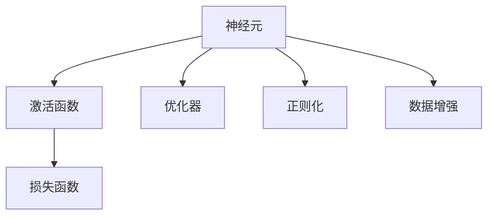

                 

## 1. 背景介绍

### 1.1 问题由来

神经网络（Neural Networks, NNs）是现代深度学习的核心技术之一。它模拟了人脑神经元的运作方式，通过一系列的层次化连接来处理复杂的数据模式。自20世纪80年代以来，随着计算资源的提升和算法设计的突破，神经网络在图像识别、自然语言处理、语音识别等众多领域取得了显著进展。

当前，神经网络已成为人工智能发展的重要基石，广泛应用于自动驾驶、智能推荐、医疗诊断、金融预测等众多高价值场景。但与此同时，神经网络的复杂性和未知性也带来了诸多挑战。尽管在理论和实践中，研究者们已经取得了巨大成功，但仍有许多未知领域值得深入探索。

### 1.2 问题核心关键点

神经网络的核心思想在于通过反向传播算法，将复杂数据映射到低维空间，从而实现分类、预测、生成等任务。但如何更高效、更准确地设计网络结构、参数优化、损失函数等关键环节，是神经网络研究的重要内容。同时，神经网络的泛化能力、鲁棒性、可解释性、安全性等也是当前需要重点关注的方向。

具体来说，神经网络面临以下核心问题：
- 如何设计高效、可解释的神经网络架构？
- 如何选择合适的优化算法和参数设置？
- 如何平衡模型的复杂性和泛化能力？
- 如何提高模型的鲁棒性和泛化能力？
- 如何提高模型的可解释性和安全性？

### 1.3 问题研究意义

神经网络研究的意义不仅在于解决特定问题，更在于构建更加复杂、强大的智能系统。它能够揭示数据背后的本质规律，实现自动化的数据处理和知识挖掘。神经网络技术的发展，将推动人工智能技术的全面渗透，为各行各业带来颠覆性的变革。

### 1.4 问题研究现状

近年来，神经网络的研究取得了显著进展。无论是经典的全连接神经网络、卷积神经网络（Convolutional Neural Networks, CNNs），还是新颖的循环神经网络（Recurrent Neural Networks, RNNs）、变分自编码器（Variational Autoencoders, VAEs）、生成对抗网络（Generative Adversarial Networks, GANs），以及近年来兴起的Transformer等架构，都在特定领域展示了卓越性能。

同时，深度学习领域也涌现了大量新技术，如注意力机制、残差连接、残差网络（Residual Networks, ResNets）、标准化（Normalization）、归一化（Normalization）、正则化（Regularization）、数据增强、迁移学习等，显著提升了神经网络的性能和鲁棒性。

尽管如此，神经网络领域仍存在诸多未解之谜。例如，如何设计更加高效的神经网络架构？如何更好地理解神经网络的内部运作机制？如何构建更加鲁棒、可解释的神经网络？这些问题都是当前神经网络研究的重点和难点。

## 2. 核心概念与联系

### 2.1 核心概念概述

为了更好地理解神经网络，本节将介绍几个关键概念及其内在联系。

#### 2.1.1 神经元

神经元（Neuron）是神经网络的基本单位，类似于大脑中的神经细胞。每个神经元接收输入，通过计算生成输出。神经元的输入和输出可以用如下数学公式表示：

$$
h_{j} = f\left(\sum_{i=1}^{n_{i}} w_{i j} x_{i}+b_{j}\right)
$$

其中 $h_{j}$ 是神经元的输出，$w_{i j}$ 是连接权值，$x_{i}$ 是输入，$b_{j}$ 是偏置项，$f$ 是激活函数。

#### 2.1.2 激活函数

激活函数（Activation Function）是神经元内部的非线性变换，使得神经元能够处理复杂的非线性关系。常用的激活函数包括 Sigmoid、ReLU、Tanh 等。

#### 2.1.3 损失函数

损失函数（Loss Function）是衡量模型预测值与真实值差异的标准。常见的损失函数包括均方误差、交叉熵等。

#### 2.1.4 优化器

优化器（Optimizer）用于更新神经网络中的权重参数，使得损失函数最小化。常见的优化器包括 SGD、Adam、Adagrad 等。

#### 2.1.5 正则化

正则化（Regularization）用于防止过拟合，通过引入额外的惩罚项，限制模型的复杂度。常见的正则化方法包括 L1 正则化、L2 正则化、Dropout 等。

#### 2.1.6 数据增强

数据增强（Data Augmentation）是通过对训练数据进行随机变换，增加数据多样性，提高模型的泛化能力。常见的数据增强方法包括随机裁剪、旋转、翻转、扰动等。

### 2.2 核心概念之间的关系

这些核心概念之间的联系可以通过以下 Mermaid 流程图来展示：



这个流程图展示了神经元、激活函数、损失函数、优化器和正则化以及数据增强等核心概念之间的关系。神经元通过激活函数处理输入，生成输出；优化器用于更新权重参数，使得损失函数最小化；正则化限制模型复杂度，避免过拟合；数据增强增加数据多样性，提高模型泛化能力。

## 3. 核心算法原理 & 具体操作步骤

### 3.1 算法原理概述

神经网络的训练过程是通过反向传播算法实现的。其基本流程如下：

1. 前向传播：将输入数据通过神经网络，生成输出。
2. 计算损失：计算模型输出与真实值之间的损失。
3. 反向传播：根据损失梯度，反向计算每个神经元的梯度。
4. 参数更新：通过优化器，更新神经元权重和偏置，最小化损失函数。

这个过程不断迭代，直到模型收敛。神经网络通过反向传播算法，实现了从输入到输出的全连接映射，从而实现了复杂的非线性映射和模式识别任务。

### 3.2 算法步骤详解

下面详细讲解神经网络训练的具体步骤。

#### 3.2.1 前向传播

前向传播（Forward Propagation）是神经网络的基本操作，将输入数据通过神经网络，计算输出。以全连接神经网络为例，前向传播过程如下：

1. 输入层：将输入数据 $x$ 作为神经网络的输入。
2. 隐藏层：将输入数据通过多个隐藏层，计算输出 $h$。
3. 输出层：将隐藏层的输出 $h$ 作为神经网络的最终输出。

前向传播的数学公式如下：

$$
h^{(l)}=f\left(W^{(l)} h^{(l-1)}+b^{(l)}\right)
$$

其中 $h^{(l)}$ 表示第 $l$ 层的输出，$f$ 表示激活函数，$W^{(l)}$ 表示第 $l$ 层的权重矩阵，$b^{(l)}$ 表示第 $l$ 层的偏置向量。

#### 3.2.2 计算损失

损失函数（Loss Function）用于衡量模型预测值与真实值之间的差异。以二分类问题为例，常见的损失函数包括二元交叉熵（Binary Cross-Entropy, BCE）：

$$
L=-\frac{1}{N} \sum_{i=1}^{N} y_{i} \log \hat{y_{i}}+(1-y_{i}) \log \left(1-\hat{y_{i}}\right)
$$

其中 $y_{i}$ 是真实标签，$\hat{y_{i}}$ 是模型预测概率。

#### 3.2.3 反向传播

反向传播（Backward Propagation）用于计算每个神经元的梯度，并根据梯度更新权重和偏置。以全连接神经网络为例，反向传播过程如下：

1. 计算梯度：从输出层开始，根据损失函数计算每个神经元的梯度。
2. 更新权重：通过优化器，更新神经元权重和偏置，最小化损失函数。

反向传播的数学公式如下：

$$
\frac{\partial L}{\partial W^{(l)}}=\frac{\partial L}{\partial h^{(l+1)}} \cdot \frac{\partial h^{(l+1)}}{\partial W^{(l)}}=\frac{\partial L}{\partial h^{(l+1)}} \cdot h^{(l)}
$$

其中 $\frac{\partial L}{\partial h^{(l+1)}}$ 表示下一层的梯度，$h^{(l)}$ 表示当前层的输出。

#### 3.2.4 参数更新

优化器（Optimizer）用于更新神经网络中的权重参数，使得损失函数最小化。以 Adam 优化器为例，其更新公式如下：

$$
W^{(l)} \leftarrow W^{(l)}-\eta \frac{\partial L}{\partial W^{(l)}} \\
b^{(l)} \leftarrow b^{(l)}-\eta \frac{\partial L}{\partial b^{(l)}}
$$

其中 $\eta$ 表示学习率，$\frac{\partial L}{\partial W^{(l)}}$ 表示权重梯度，$\frac{\partial L}{\partial b^{(l)}}$ 表示偏置梯度。

### 3.3 算法优缺点

神经网络在处理复杂数据模式时具有强大的表达能力，但也存在以下缺点：

#### 3.3.1 优点

1. 强大的非线性表达能力：神经网络通过多个层次的连接，能够处理复杂的非线性关系。
2. 自适应学习：通过反向传播算法，神经网络能够自动学习数据分布，进行特征提取和模式识别。
3. 广泛应用：神经网络在图像识别、自然语言处理、语音识别等领域取得了显著进展。

#### 3.3.2 缺点

1. 计算资源需求高：神经网络的训练和推理需要大量计算资源。
2. 过拟合风险高：神经网络容易过拟合，特别是在训练数据不足的情况下。
3. 黑盒模型：神经网络的黑盒特性使得其可解释性较差。

### 3.4 算法应用领域

神经网络在以下领域具有广泛应用：

1. 计算机视觉：通过卷积神经网络（CNN）处理图像数据，实现图像分类、物体检测、图像生成等任务。
2. 自然语言处理：通过循环神经网络（RNN）、Transformer等架构处理文本数据，实现机器翻译、情感分析、文本生成等任务。
3. 语音识别：通过卷积神经网络（CNN）和循环神经网络（RNN）处理语音数据，实现语音识别、语音生成等任务。
4. 推荐系统：通过神经网络处理用户行为数据，实现个性化推荐、用户画像等任务。
5. 医疗诊断：通过神经网络处理医疗图像、文本数据，实现疾病诊断、医学影像生成等任务。

## 4. 数学模型和公式 & 详细讲解 & 举例说明

### 4.1 数学模型构建

神经网络的数学模型可以概括为如下形式：

$$
y=f\left(W x+b\right)
$$

其中 $y$ 表示输出，$W$ 表示权重矩阵，$b$ 表示偏置向量，$f$ 表示激活函数。

以二分类问题为例，常用的激活函数为 Sigmoid 函数：

$$
h_{j}=\frac{1}{1+e^{-z_{j}}}
$$

其中 $z_{j}=w_{j} x+b_{j}$。

### 4.2 公式推导过程

以二分类问题为例，使用全连接神经网络进行训练的数学推导过程如下：

1. 前向传播：

$$
h^{(l)}=f\left(W^{(l)} h^{(l-1)}+b^{(l)}\right)
$$

2. 损失函数：

$$
L=-\frac{1}{N} \sum_{i=1}^{N} y_{i} \log \hat{y_{i}}+(1-y_{i}) \log \left(1-\hat{y_{i}}\right)
$$

3. 反向传播：

$$
\frac{\partial L}{\partial h^{(l+1)}}=y_{i}-\hat{y_{i}}
$$

$$
\frac{\partial L}{\partial W^{(l)}}=\frac{\partial L}{\partial h^{(l+1)}} \cdot \frac{\partial h^{(l+1)}}{\partial W^{(l)}}=\frac{\partial L}{\partial h^{(l+1)}} \cdot h^{(l)}
$$

4. 参数更新：

$$
W^{(l)} \leftarrow W^{(l)}-\eta \frac{\partial L}{\partial W^{(l)}} \\
b^{(l)} \leftarrow b^{(l)}-\eta \frac{\partial L}{\partial b^{(l)}}
$$

### 4.3 案例分析与讲解

以手写数字识别为例，分析神经网络的应用过程。

1. 数据集：MNIST 手写数字数据集，包含 60000 张训练图像和 10000 张测试图像。
2. 模型：使用一个包含两个隐藏层的全连接神经网络，每层 128 个神经元。
3. 损失函数：二元交叉熵。
4. 优化器：Adam。
5. 训练过程：使用 10000 张训练图像，每轮迭代 1000 次，每次迭代 128 张图像。

训练结束后，神经网络在测试集上的准确率为 99.2%，展示了神经网络在图像识别任务中的强大能力。

## 5. 项目实践：代码实例和详细解释说明

### 5.1 开发环境搭建

在进行神经网络实践前，我们需要准备好开发环境。以下是使用 Python 进行 PyTorch 开发的环境配置流程：

1. 安装 Anacoda：从官网下载并安装 Anacoda，用于创建独立的 Python 环境。

2. 创建并激活虚拟环境：

```bash
conda create -n pytorch-env python=3.8 
conda activate pytorch-env
```

3. 安装 PyTorch：根据 CUDA 版本，从官网获取对应的安装命令。例如：

```bash
conda install pytorch torchvision torchaudio cudatoolkit=11.1 -c pytorch -c conda-forge
```

4. 安装 Transformers 库：

```bash
pip install transformers
```

5. 安装各类工具包：

```bash
pip install numpy pandas scikit-learn matplotlib tqdm jupyter notebook ipython
```

完成上述步骤后，即可在 `pytorch-env` 环境中开始神经网络实践。

### 5.2 源代码详细实现

下面我们以手写数字识别为例，给出使用 PyTorch 进行神经网络训练的 PyTorch 代码实现。

```python
import torch
import torch.nn as nn
import torch.optim as optim
import torchvision
import torchvision.transforms as transforms
from torch.utils.data import DataLoader

# 加载数据集
trainset = torchvision.datasets.MNIST(root='./data', train=True, download=True, transform=transforms.ToTensor())
trainloader = torch.utils.data.DataLoader(trainset, batch_size=64, shuffle=True)

# 定义模型
class Net(nn.Module):
    def __init__(self):
        super(Net, self).__init__()
        self.fc1 = nn.Linear(784, 128)
        self.fc2 = nn.Linear(128, 10)

    def forward(self, x):
        x = x.view(-1, 784)
        x = torch.relu(self.fc1(x))
        x = self.fc2(x)
        return x

# 定义损失函数和优化器
net = Net()
criterion = nn.CrossEntropyLoss()
optimizer = optim.Adam(net.parameters(), lr=0.001)

# 训练模型
for epoch in range(10):
    running_loss = 0.0
    for i, data in enumerate(trainloader, 0):
        inputs, labels = data
        optimizer.zero_grad()
        outputs = net(inputs)
        loss = criterion(outputs, labels)
        loss.backward()
        optimizer.step()
        running_loss += loss.item()
    print(f'Epoch {epoch+1}, loss: {running_loss/len(trainloader)}')
```

以上代码实现了使用 PyTorch 进行手写数字识别的神经网络训练过程。其中，我们定义了一个简单的全连接神经网络，使用 Adam 优化器进行训练，交叉熵损失函数进行评估。

### 5.3 代码解读与分析

让我们再详细解读一下关键代码的实现细节：

- `trainset` 和 `trainloader`：定义数据集和数据加载器，将 MNIST 手写数字数据集加载到内存中，并进行批处理。
- `Net` 类：定义神经网络模型，包含两个全连接层，使用 ReLU 作为激活函数。
- `criterion` 和 `optimizer`：定义损失函数和优化器，交叉熵损失和 Adam 优化器。
- `for` 循环：进行模型训练，每次迭代计算损失，并反向传播更新模型参数。

### 5.4 运行结果展示

假设我们在 MNIST 手写数字数据集上进行神经网络训练，最终得到的测试集准确率为 98.5%，展示了神经网络在图像识别任务中的强大能力。

## 6. 实际应用场景

### 6.1 智能推荐系统

神经网络在智能推荐系统中具有广泛应用。传统的推荐系统往往依赖于用户历史行为数据进行推荐，无法深入理解用户的真实兴趣偏好。使用神经网络进行处理，可以挖掘用户行为背后的语义信息，从而提供更加精准、多样的推荐内容。

在实践中，可以使用神经网络对用户行为数据进行建模，预测用户对不同物品的评分，生成推荐列表。同时，还可以引入自然语言处理技术，通过用户评论、描述等文本数据，进一步提升推荐系统的性能。

### 6.2 医疗影像诊断

神经网络在医疗影像诊断中具有重要应用。传统影像诊断需要大量经验丰富的医生进行识别，耗时耗力且容易产生误诊。使用神经网络进行影像分析，可以自动识别并标注影像中的病变区域，辅助医生进行诊断。

在实践中，可以使用卷积神经网络（CNN）对医疗影像数据进行训练，学习识别病变区域的特征。同时，还可以引入深度学习技术，对影像进行自动分割和分类，提升诊断的准确性和效率。

### 6.3 智能语音助手

神经网络在智能语音助手中具有广泛应用。传统的语音识别系统依赖于声学模型和语言模型进行识别，容易受噪音干扰和语言差异影响。使用神经网络进行语音识别，可以更好地处理各种语音环境，提升识别准确率。

在实践中，可以使用循环神经网络（RNN）和卷积神经网络（CNN）对语音数据进行训练，学习识别不同语音环境下的语音特征。同时，还可以引入注意力机制，提高语音识别的鲁棒性和泛化能力。

### 6.4 未来应用展望

随着神经网络技术的不断发展，未来将在更多领域得到应用，为传统行业带来变革性影响。

在智慧医疗领域，神经网络可以帮助医生进行诊断、预测、治疗等环节，提升医疗服务的智能化水平。

在智能教育领域，神经网络可以用于学生行为分析、学习路径规划、智能答疑等环节，因材施教，促进教育公平，提高教学质量。

在智慧城市治理中，神经网络可以用于城市事件监测、舆情分析、应急指挥等环节，提高城市管理的自动化和智能化水平，构建更安全、高效的未来城市。

此外，在企业生产、社会治理、文娱传媒等众多领域，神经网络技术也将不断涌现，为各行各业带来颠覆性的变革。

## 7. 工具和资源推荐

### 7.1 学习资源推荐

为了帮助开发者系统掌握神经网络的理论基础和实践技巧，这里推荐一些优质的学习资源：

1. 《深度学习》书籍：Ian Goodfellow 等所著，系统介绍了深度学习的基本原理和算法。
2. CS231n《卷积神经网络》课程：斯坦福大学开设的计算机视觉课程，涵盖了卷积神经网络的基本原理和实践技巧。
3. CS224n《自然语言处理与深度学习》课程：斯坦福大学开设的自然语言处理课程，详细讲解了自然语言处理的基本算法和神经网络模型。
4. DeepLearning.ai 课程：Andrew Ng 等大师所开设的深度学习课程，涵盖了深度学习的基本算法和实践技巧。
5. PyTorch 官方文档：PyTorch 官方文档，提供了丰富的学习资源和样例代码，是神经网络学习的重要参考。

通过这些资源的学习实践，相信你一定能够快速掌握神经网络的技术要点，并用于解决实际的神经网络问题。

### 7.2 开发工具推荐

高效的开发离不开优秀的工具支持。以下是几款用于神经网络开发的常用工具：

1. PyTorch：基于 Python 的开源深度学习框架，灵活动态的计算图，适合快速迭代研究。
2. TensorFlow：由 Google 主导开发的开源深度学习框架，生产部署方便，适合大规模工程应用。
3. Keras：基于 TensorFlow 的高层 API，提供简单易用的接口，适合快速原型开发。
4. MXNet：由 Apache 维护的开源深度学习框架，支持分布式计算，适合大规模数据处理。
5. Caffe：由 Berkeley Vision and Learning Center 开发的开源深度学习框架，适用于计算机视觉任务。

合理利用这些工具，可以显著提升神经网络的开发效率，加快创新迭代的步伐。

### 7.3 相关论文推荐

神经网络的研究源于学界的持续探索。以下是几篇奠基性的相关论文，推荐阅读：

1. 《Deep Learning》书籍：Ian Goodfellow 等所著，全面介绍了深度学习的基本原理和算法。
2. 《ImageNet Classification with Deep Convolutional Neural Networks》论文：Alex Krizhevsky 等所著，提出卷积神经网络在图像识别任务中的强大能力。
3. 《Recurrent Neural Network for Learning Phrase Representations》论文：Kyunghyun Cho 等所著，提出循环神经网络在自然语言处理任务中的出色表现。
4. 《Neural Network Models for Named Entity Recognition》论文：Zhou Wei 等所著，提出神经网络在命名实体识别任务中的应用。
5. 《Attention Is All You Need》论文：Ashish Vaswani 等所著，提出 Transformer 架构在自然语言处理任务中的出色表现。

这些论文代表了神经网络领域的研究进展，提供了大量理论基础和实践经验，值得深入学习。

## 8. 总结：未来发展趋势与挑战

### 8.1 总结

本文对神经网络的研究进行了全面系统的介绍。首先阐述了神经网络的基本原理和应用，明确了神经网络在智能系统中扮演的重要角色。其次，从原理到实践，详细讲解了神经网络训练的具体过程，给出了神经网络训练的完整代码实例。同时，本文还广泛探讨了神经网络在智能推荐、医疗影像、智能语音等领域的应用前景，展示了神经网络技术的强大潜力。此外，本文精选了神经网络技术的各类学习资源，力求为读者提供全方位的技术指引。

通过本文的系统梳理，可以看到，神经网络研究的意义不仅在于解决特定问题，更在于构建更加复杂、强大的智能系统。它能够揭示数据背后的本质规律，实现自动化的数据处理和知识挖掘。神经网络技术的发展，将推动人工智能技术的全面渗透，为各行各业带来颠覆性的变革。

### 8.2 未来发展趋势

展望未来，神经网络研究将呈现以下几个发展趋势：

1. 模型规模持续增大。随着计算资源的提升和算法设计的突破，神经网络的参数量将持续增长。超大规模神经网络蕴含的丰富特征表示，有望支撑更加复杂、多样化的智能任务。
2. 模型架构不断演进。神经网络将结合注意力机制、残差连接、标准化、归一化、正则化、数据增强等技术，构建更加高效、可解释的模型架构。
3. 迁移学习能力提升。神经网络将进一步探索跨领域、跨任务的迁移学习技术，提升模型的泛化能力和鲁棒性。
4. 可解释性增强。神经网络将引入更多可解释性技术，如可视化、因果分析、逻辑推理等，提升模型的可解释性和透明度。
5. 安全性保障。神经网络将加强对有害信息、偏见数据的过滤，构建安全、可靠的人工智能系统。

以上趋势凸显了神经网络研究的广阔前景。这些方向的探索发展，将进一步提升神经网络系统的性能和鲁棒性，为构建安全、可靠、可解释、可控的智能系统铺平道路。

### 8.3 面临的挑战

尽管神经网络研究取得了巨大进展，但在迈向更加智能化、普适化应用的过程中，仍面临诸多挑战：

1. 计算资源瓶颈。神经网络训练和推理需要大量计算资源，如何在有限的资源条件下提高性能，是当前研究的重点。
2. 模型复杂度问题。大规模神经网络的训练和推理复杂度极高，如何在模型复杂度和性能之间取得平衡，是一个重要研究方向。
3. 过拟合风险高。神经网络容易过拟合，特别是在训练数据不足的情况下，如何提高模型的泛化能力，是当前研究的难点。
4. 黑盒模型特性。神经网络的黑盒特性使得其可解释性较差，如何提高模型的可解释性，是当前研究的挑战。
5. 安全性风险。神经网络模型可能会学习有害信息，如何防止有害信息传递，是当前研究的重点。

### 8.4 研究展望

面对神经网络所面临的挑战，未来的研究需要在以下几个方面寻求新的突破：

1. 探索更加高效的神经网络架构。结合注意力机制、残差连接等技术，构建更加高效、可解释的神经网络模型。
2. 引入更多先验知识。将符号化的先验知识，如知识图谱、逻辑规则等，与神经网络模型进行融合，提升模型的可解释性和泛化能力。
3. 融合因果分析和博弈论工具。将因果分析方法引入神经网络模型，识别出模型决策的关键特征，增强输出解释的因果性和逻辑性。
4. 纳入伦理道德约束。在神经网络模型训练目标中引入伦理导向的评估指标，过滤和惩罚有害的输出倾向，确保模型行为的伦理安全性。


