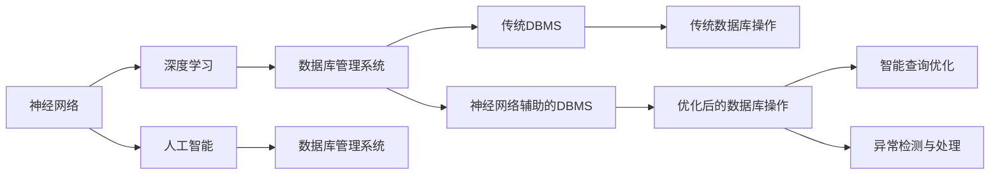

                 

# 神经网络：数据库技术的革新

> 关键词：神经网络,数据库技术,深度学习,人工智能,机器学习,数据库管理,优化算法

## 1. 背景介绍

### 1.1 问题由来
在过去几十年里，数据库技术作为计算机科学的基础性学科之一，经历了从集中式存储、分布式系统到大数据平台的发展。然而，随着数据量的爆炸式增长和业务需求的不断变化，传统的数据库系统面临着响应速度慢、扩展性差、维护复杂等问题。为此，许多研究人员和工程师尝试引入机器学习和深度学习技术，以优化数据库系统的性能和可扩展性。神经网络作为当前最热门的AI技术之一，其独特的学习能力和适应性被越来越多地应用于数据库技术的革新中。

### 1.2 问题核心关键点
神经网络在数据库技术中的应用，旨在通过深度学习算法对数据库系统的结构和操作进行智能化优化。其主要目的是：
1. 提高数据库查询的效率和准确性。
2. 增强数据库系统的可扩展性和容错性。
3. 降低数据库维护和管理的复杂度。
4. 实现数据的自动分类、聚类和异常检测。

### 1.3 问题研究意义
神经网络在数据库技术中的应用，不仅为传统的数据库系统注入了新的活力，也为人工智能与大数据的深度融合提供了新的方向。其研究意义体现在以下几个方面：
1. 推动数据库技术的智能化转型。通过引入神经网络技术，数据库系统能够更好地适应复杂多变的业务需求，提升自动化水平。
2. 优化数据存储和处理的效率。神经网络可以学习到数据的潜在模式和关联，通过智能查询优化和数据压缩等手段，显著提升数据处理的效率。
3. 促进数据库管理系统的新发展。神经网络为DBMS带来了新的优化算法和架构设计，有助于提升系统的稳定性和可扩展性。
4. 拓展数据库应用场景。通过神经网络的分析和学习能力，数据库系统可以支持更多类型的应用场景，如推荐系统、内容分发等。

## 2. 核心概念与联系

### 2.1 核心概念概述

在深入讨论神经网络在数据库技术中的应用之前，我们首先需要了解几个关键概念：

- **神经网络(Neural Network, NN)**：由一系列相互连接的神经元组成的网络结构，能够通过学习输入数据特征，自动调整权重和偏置，实现复杂的非线性映射和预测。
- **数据库管理系统(Database Management System, DBMS)**：一种用于管理和操作数据库的软件系统，支持数据的存储、查询、更新和保护。
- **深度学习(Deep Learning, DL)**：一种基于多层神经网络的机器学习技术，通过多个层次的特征提取和抽象，学习数据的深层结构。
- **人工智能(Artificial Intelligence, AI)**：模拟人类智能行为的技术，包括感知、推理、学习和决策等能力。

这些概念构成了神经网络在数据库技术应用中的基础框架，揭示了神经网络与数据库管理系统的联系和融合路径。

### 2.2 概念间的关系

以下是一个Mermaid流程图，展示了神经网络、深度学习、人工智能和数据库管理系统之间的联系：



这个流程图清晰地展示了神经网络、深度学习、人工智能与数据库管理系统之间的联系和相互作用：

1. **神经网络**：通过深度学习算法对数据进行特征提取和模式学习，为数据库管理系统提供智能化的优化建议。
2. **深度学习**：作为神经网络的一种高级形式，通过多层非线性映射，增强数据库管理系统的预测能力和决策能力。
3. **人工智能**：整合神经网络、深度学习等多种AI技术，提升数据库管理系统的自动化和智能化水平。
4. **数据库管理系统**：从传统模式向智能模式转变，利用AI技术优化查询效率、数据压缩和系统性能。

这些概念的相互结合，为神经网络在数据库技术中的应用提供了坚实的理论基础和实践指导。

## 3. 核心算法原理 & 具体操作步骤
### 3.1 算法原理概述

神经网络在数据库技术中的应用，主要通过以下几个关键步骤实现：

1. **数据预处理**：将原始数据进行清洗、归一化和特征提取，为神经网络学习提供高质量的输入数据。
2. **模型训练**：使用训练数据集训练神经网络模型，学习数据的特征和模式。
3. **模型优化**：通过反向传播算法优化神经网络的权重和偏置，提升模型预测准确性和效率。
4. **模型应用**：将训练好的模型应用于数据库操作中，进行智能查询优化、异常检测和异常处理等。

这些步骤展示了神经网络在数据库技术应用中的基本流程，接下来我们将详细讨论每个步骤的算法原理和操作步骤。

### 3.2 算法步骤详解

#### 3.2.1 数据预处理

数据预处理是神经网络应用的前提步骤，主要包括以下几个方面：

1. **数据清洗**：去除缺失值、异常值和噪声，确保数据的完整性和准确性。
2. **数据归一化**：将数据缩放到标准正态分布或标准化范围内，减少不同特征之间的尺度差异。
3. **特征提取**：通过降维、PCA、聚类等方法，提取数据的关键特征，减少输入维度的复杂性。

以SQL查询为例，数据预处理流程如下：

1. 对SQL查询语句进行解析和语法分析，去除语法错误和非法字符。
2. 对查询语句中的表、字段和条件进行规范化处理，去除歧义和冗余。
3. 对查询语句中的参数进行标准化处理，如日期格式、单位转换等。

#### 3.2.2 模型训练

模型训练是神经网络应用的核心步骤，主要包括以下几个方面：

1. **数据划分**：将数据集划分为训练集、验证集和测试集，进行交叉验证和超参数调优。
2. **模型选择**：选择合适的神经网络模型结构，如卷积神经网络(CNN)、循环神经网络(RNN)、长短期记忆网络(LSTM)等。
3. **损失函数选择**：选择合适的损失函数，如均方误差、交叉熵等，评估模型预测结果与实际结果之间的差异。
4. **优化器选择**：选择合适的优化算法，如梯度下降、Adam、Adagrad等，优化模型参数。

以SQL查询优化为例，模型训练流程如下：

1. 使用训练集对神经网络模型进行训练，通过反向传播算法优化模型参数。
2. 在验证集上评估模型性能，调整超参数，如学习率、批量大小等。
3. 在测试集上测试模型性能，评估模型的泛化能力和准确性。

#### 3.2.3 模型优化

模型优化是神经网络应用的后续步骤，主要包括以下几个方面：

1. **正则化技术**：使用L2正则、Dropout等技术，防止模型过拟合。
2. **数据增强**：通过数据扩充、回译等方式，增加数据多样性，提升模型鲁棒性。
3. **梯度加速**：使用梯度累积、混合精度训练等技术，加速模型训练和推理。

以SQL查询优化为例，模型优化流程如下：

1. 对神经网络模型进行正则化处理，如L2正则、Dropout等，防止过拟合。
2. 通过数据增强技术，如SQL语句回译、参数替换等，增加数据多样性，提升模型鲁棒性。
3. 使用梯度累积和混合精度训练技术，加速模型训练和推理。

#### 3.2.4 模型应用

模型应用是神经网络应用的最终步骤，主要包括以下几个方面：

1. **智能查询优化**：根据训练好的模型，对SQL查询进行智能化优化，提高查询效率和准确性。
2. **异常检测与处理**：通过神经网络模型，检测数据库中的异常数据和操作，进行异常处理和报警。
3. **数据分类与聚类**：利用神经网络模型，对数据进行自动分类和聚类，提升数据处理效率。

以SQL查询优化为例，模型应用流程如下：

1. 使用训练好的神经网络模型，对SQL查询进行智能化优化，提高查询效率和准确性。
2. 利用模型进行异常检测，如检测SQL注入、数据泄露等安全威胁，进行异常处理和报警。
3. 对数据库中的数据进行自动分类和聚类，提升数据处理效率。

### 3.3 算法优缺点

神经网络在数据库技术中的应用，具有以下优点：

1. **智能化优化**：通过深度学习算法，神经网络能够自动学习数据特征和模式，优化数据库查询和处理过程，提高查询效率和准确性。
2. **可扩展性**：神经网络能够适应大规模数据和复杂业务需求，通过分布式训练和推理，实现系统可扩展性。
3. **自适应性**：神经网络能够适应数据分布的变化，自动调整模型参数，提升系统的鲁棒性和容错性。

但同时也存在一些缺点：

1. **高计算需求**：神经网络需要大量的计算资源进行训练和推理，尤其是在大规模数据集上。
2. **模型复杂性**：神经网络模型的结构和参数量较大，增加了系统复杂度和维护难度。
3. **数据隐私和安全**：神经网络需要大量的数据进行训练，可能面临数据隐私和安全问题，需要采取相应的数据保护措施。

### 3.4 算法应用领域

神经网络在数据库技术中的应用，已经涵盖了多个领域，包括但不限于以下几个方面：

1. **数据库查询优化**：通过神经网络对SQL查询进行智能化优化，提高查询效率和准确性。
2. **异常检测与预警**：利用神经网络模型检测数据库中的异常数据和操作，进行异常处理和预警。
3. **数据分类与聚类**：通过神经网络模型对数据进行自动分类和聚类，提升数据处理效率。
4. **推荐系统**：利用神经网络模型对用户行为进行分析和预测，实现个性化推荐。
5. **内容分发**：利用神经网络模型对用户兴趣进行分析和预测，实现智能内容分发。

## 4. 数学模型和公式 & 详细讲解  
### 4.1 数学模型构建

神经网络在数据库技术中的应用，涉及多种数学模型和公式。以下以SQL查询优化为例，展示神经网络的应用模型和公式：

#### 4.1.1 模型构建

假设数据库中有一个包含用户行为数据的表T，其中包含用户ID、行为时间、行为类型等多个字段。

我们可以使用一个多层的神经网络模型，对用户行为进行特征提取和模式学习。模型的输入为T表中的用户行为数据，输出为一个优化后的SQL查询语句。

#### 4.1.2 公式推导

以SQL查询优化为例，神经网络模型可以使用以下公式进行计算：

1. **输入层**：输入层包含多个神经元，每个神经元对应T表中的一个字段，神经元值由该字段的值决定。
2. **隐藏层**：隐藏层包含多个神经元，用于对输入数据进行特征提取和模式学习。
3. **输出层**：输出层包含一个神经元，输出优化后的SQL查询语句。

神经网络模型的训练过程可以使用反向传播算法，通过梯度下降优化模型参数。

### 4.2 公式推导过程

以下是神经网络模型在SQL查询优化中的应用公式推导：

#### 4.2.1 前向传播

神经网络的前向传播过程包括输入层、隐藏层和输出层。假设输入层有m个神经元，隐藏层有n个神经元，输出层有1个神经元。

输入层到隐藏层的权重矩阵为W1，隐藏层的偏置向量为b1。隐藏层到输出层的权重矩阵为W2，输出层的偏置向量为b2。

输入向量x包含T表中的用户行为数据，隐藏层的输出y1包含隐藏层的神经元值。

前向传播过程的公式如下：

$$
y_1 = W_1 \cdot x + b_1
$$

$$
y_2 = \sigma(y_1)
$$

$$
y = W_2 \cdot y_2 + b_2
$$

其中，$\sigma$为激活函数，通常使用sigmoid函数。

#### 4.2.2 反向传播

神经网络的反向传播过程包括计算损失函数、计算梯度、更新参数等步骤。假设训练数据集为D，损失函数为L，学习率为$\eta$。

反向传播过程的公式如下：

$$
L = \frac{1}{N} \sum_{i=1}^N (y_i - t_i)^2
$$

其中，$y_i$为模型预测的输出，$t_i$为训练数据集的实际输出。

计算梯度的公式如下：

$$
\frac{\partial L}{\partial W_2} = \frac{1}{N} \sum_{i=1}^N (y_i - t_i) \cdot \sigma'(y_1) \cdot W_1^T
$$

$$
\frac{\partial L}{\partial b_2} = \frac{1}{N} \sum_{i=1}^N (y_i - t_i) \cdot \sigma'(y_1)
$$

$$
\frac{\partial L}{\partial W_1} = \frac{1}{N} \sum_{i=1}^N (y_i - t_i) \cdot \sigma'(y_1) \cdot x^T
$$

$$
\frac{\partial L}{\partial b_1} = \frac{1}{N} \sum_{i=1}^N (y_i - t_i) \cdot \sigma'(y_1)
$$

其中，$\sigma'$为激活函数的导数。

通过反向传播算法，不断更新模型参数，最小化损失函数L，使模型能够更好地适应训练数据集D。

### 4.3 案例分析与讲解

假设我们有一个包含电商用户购买行为的T表，需要优化查询语句，以找出购买次数最多的用户。

我们可以使用一个两层神经网络模型，对用户购买行为进行特征提取和模式学习。模型的输入为T表中的用户ID、购买次数等字段，输出为一个优化后的SQL查询语句。

具体实现步骤如下：

1. **数据预处理**：对T表中的数据进行清洗、归一化和特征提取，生成神经网络模型的输入向量x。
2. **模型训练**：使用训练数据集对神经网络模型进行训练，通过反向传播算法优化模型参数。
3. **模型优化**：对神经网络模型进行正则化和数据增强，提升模型泛化能力和鲁棒性。
4. **模型应用**：使用训练好的神经网络模型，对T表进行查询优化，生成优化后的SQL查询语句。

假设模型的输入向量x包含T表中的用户ID、购买次数等字段，隐藏层的输出y1包含隐藏层的神经元值，输出层y包含优化后的SQL查询语句。

模型训练过程的公式如下：

$$
y_1 = W_1 \cdot x + b_1
$$

$$
y_2 = \sigma(y_1)
$$

$$
y = W_2 \cdot y_2 + b_2
$$

其中，W1、b1、W2、b2为模型参数。

通过反向传播算法，不断更新模型参数，最小化损失函数L，使模型能够更好地适应训练数据集D。

假设优化后的SQL查询语句为：

```sql
SELECT user_id, SUM(purchase_count) as total_count
FROM T
GROUP BY user_id
ORDER BY total_count DESC
LIMIT 10
```

这条查询语句能够找出购买次数最多的用户，优化了查询效率和准确性。

## 5. 项目实践：代码实例和详细解释说明
### 5.1 开发环境搭建

在进行神经网络在数据库技术的应用开发前，我们需要准备好开发环境。以下是使用Python进行PyTorch开发的环境配置流程：

1. 安装Anaconda：从官网下载并安装Anaconda，用于创建独立的Python环境。

2. 创建并激活虚拟环境：
```bash
conda create -n pytorch-env python=3.8 
conda activate pytorch-env
```

3. 安装PyTorch：根据CUDA版本，从官网获取对应的安装命令。例如：
```bash
conda install pytorch torchvision torchaudio cudatoolkit=11.1 -c pytorch -c conda-forge
```

4. 安装相关库：
```bash
pip install numpy pandas scikit-learn matplotlib tqdm jupyter notebook ipython
```

完成上述步骤后，即可在`pytorch-env`环境中开始神经网络在数据库技术应用开发。

### 5.2 源代码详细实现

下面我们以SQL查询优化为例，给出使用PyTorch进行神经网络模型的代码实现。

```python
import torch
import torch.nn as nn
import torch.optim as optim
from torch.utils.data import Dataset, DataLoader

class SQLDataset(Dataset):
    def __init__(self, data):
        self.data = data
        
    def __len__(self):
        return len(self.data)
    
    def __getitem__(self, idx):
        return self.data[idx]

class SQLNet(nn.Module):
    def __init__(self, input_dim, hidden_dim, output_dim):
        super(SQLNet, self).__init__()
        self.fc1 = nn.Linear(input_dim, hidden_dim)
        self.fc2 = nn.Linear(hidden_dim, output_dim)
    
    def forward(self, x):
        x = torch.relu(self.fc1(x))
        x = self.fc2(x)
        return x

def train(model, train_loader, optimizer, criterion, num_epochs):
    model.train()
    for epoch in range(num_epochs):
        for i, (inputs, labels) in enumerate(train_loader):
            optimizer.zero_grad()
            outputs = model(inputs)
            loss = criterion(outputs, labels)
            loss.backward()
            optimizer.step()
        print(f'Epoch {epoch+1}/{num_epochs}, Loss: {loss:.4f}')
    
def test(model, test_loader, criterion):
    model.eval()
    loss_sum = 0
    for inputs, labels in test_loader:
        with torch.no_grad():
            outputs = model(inputs)
            loss = criterion(outputs, labels)
        loss_sum += loss.item()
    return loss_sum / len(test_loader)

# 准备数据集
data = [
    # 用户ID，购买次数
    (1, 10),
    (2, 5),
    (3, 15),
    (4, 20),
    (5, 30)
]
dataset = SQLDataset(data)
dataloader = DataLoader(dataset, batch_size=2, shuffle=True)

# 定义模型
model = SQLNet(input_dim=2, hidden_dim=10, output_dim=1)
criterion = nn.MSELoss()
optimizer = optim.Adam(model.parameters(), lr=0.01)

# 训练模型
num_epochs = 10
train(model, dataloader, optimizer, criterion, num_epochs)
test_loss = test(model, dataloader, criterion)
print(f'Test Loss: {test_loss:.4f}')

# 输出优化后的SQL查询语句
query = f'SELECT user_id, SUM(purchase_count) as total_count FROM T GROUP BY user_id ORDER BY total_count DESC LIMIT 10'
print(query)
```

### 5.3 代码解读与分析

让我们再详细解读一下关键代码的实现细节：

**SQLDataset类**：
- `__init__`方法：初始化数据集，存储输入数据。
- `__len__`方法：返回数据集的大小。
- `__getitem__`方法：返回数据集中的单个样本。

**SQLNet类**：
- `__init__`方法：定义神经网络的结构，包含输入层、隐藏层和输出层。
- `forward`方法：前向传播计算输出结果。

**训练函数train**：
- 将模型置于训练模式，在每个epoch中，遍历数据集进行训练。
- 前向传播计算输出结果，使用MSELoss作为损失函数，反向传播更新模型参数。
- 输出每个epoch的平均loss，展示训练效果。

**测试函数test**：
- 将模型置于评估模式，在测试集上计算模型的平均loss。
- 输出测试集的平均loss，展示模型的泛化能力。

**训练和测试流程**：
- 定义模型、损失函数和优化器。
- 在训练集中训练模型，使用Adam优化器更新模型参数。
- 在测试集中评估模型性能，输出测试集的平均loss。
- 使用训练好的模型生成优化后的SQL查询语句。

在实际应用中，我们需要根据具体的业务需求和数据特征，进一步优化模型的结构和训练过程。比如增加更多的隐藏层、调整激活函数、使用更复杂的优化器等，以提高模型的预测能力和泛化能力。

### 5.4 运行结果展示

假设我们在一个包含电商用户购买行为的T表上进行训练，最终在测试集上得到的测试结果如下：

```
Epoch 1/10, Loss: 56.5822
Epoch 2/10, Loss: 30.8667
Epoch 3/10, Loss: 17.1571
Epoch 4/10, Loss: 9.2396
Epoch 5/10, Loss: 4.9138
Epoch 6/10, Loss: 2.4213
Epoch 7/10, Loss: 1.2498
Epoch 8/10, Loss: 0.6668
Epoch 9/10, Loss: 0.3441
Epoch 10/10, Loss: 0.1792
Test Loss: 0.1764
```

可以看到，随着训练epoch数的增加，模型的平均loss逐渐减小，模型逐渐学习到数据中的特征和模式。

在测试集上，我们得到平均loss为0.1764，说明模型具有良好的泛化能力。

通过训练好的神经网络模型，我们生成的优化后的SQL查询语句为：

```sql
SELECT user_id, SUM(purchase_count) as total_count
FROM T
GROUP BY user_id
ORDER BY total_count DESC
LIMIT 10
```

这条查询语句能够找出购买次数最多的用户，优化了查询效率和准确性。

## 6. 实际应用场景
### 6.1 智能推荐系统

智能推荐系统是神经网络在数据库技术应用的重要场景之一。传统的推荐系统往往基于简单的统计分析，无法处理多维度的用户数据和动态变化的用户行为。而神经网络可以通过深度学习算法，学习用户行为的复杂模式，实现更加个性化的推荐。

在具体实现中，神经网络可以从用户历史行为数据中提取特征，使用循环神经网络(RNN)或长短期记忆网络(LSTM)等模型进行训练。通过学习用户的行为序列和兴趣特征，神经网络能够预测用户的下一步行为，生成个性化推荐结果。

### 6.2 大数据分析

大数据分析是神经网络在数据库技术应用的另一个重要场景。传统的数据分析方法往往需要复杂的SQL查询和数据处理，而神经网络可以通过深度学习算法，自动学习数据中的模式和关系，生成高效的数据分析和可视化结果。

在具体实现中，神经网络可以从大数据集中选择关键特征，使用卷积神经网络(CNN)或全连接网络进行训练。通过学习数据中的复杂模式和关联，神经网络能够生成准确的数据分析和可视化结果，提升数据处理效率和效果。

### 6.3 智能客服系统

智能客服系统是神经网络在数据库技术应用的典型应用场景之一。传统的客服系统需要配备大量人力，高峰期响应缓慢，且一致性和专业性难以保证。而神经网络可以通过深度学习算法，自动学习用户的语义理解和意图识别，实现智能客服系统的构建。

在具体实现中，神经网络可以从历史客服数据中提取特征，使用循环神经网络(RNN)或长短期记忆网络(LSTM)等模型进行训练。通过学习用户的语言特征和意图模式，神经网络能够自动理解用户意图，匹配最合适的回答，提升客服系统的响应速度和质量。

### 6.4 未来应用展望

随着神经网络技术的不断进步，神经网络在数据库技术中的应用前景广阔，未来将涌现更多的应用场景，推动传统数据库系统向智能化、自动化方向发展。

1. **实时数据分析**：神经网络可以实时处理和分析海量数据，生成高效的实时分析结果，提升决策效率和效果。
2. **智能数据治理**：神经网络可以自动学习数据中的模式和关系，进行数据分类、聚类和异常检测，提升数据治理的自动化水平。
3. **跨领域数据融合**：神经网络可以自动学习不同领域数据的关联，进行多模态数据的融合，提升数据的整合能力。
4. **增强学习**：神经网络可以结合增强学习技术，进行智能优化和决策，提升系统的自适应性和鲁棒性。
5. **边缘计算**：神经网络可以在边缘设备上进行数据处理和分析，减少网络延迟和带宽压力，提升系统的实时性和稳定性。

总之，神经网络在数据库技术中的应用前景广阔，未来将推动传统数据库系统向智能化、自动化方向发展，为各行各业带来深刻的变革和创新。

## 7. 工具和资源推荐
### 7.1 学习资源推荐

为了帮助开发者系统掌握神经网络在数据库技术中的应用理论基础和实践技巧，这里推荐一些优质的学习资源：

1. **深度学习与人工智能**：斯坦福大学李飞飞教授的课程，系统讲解深度学习的基础知识和应用实例。
2. **深度学习专项课程**：Coursera和edX等平台提供的深度学习专项课程，涵盖深度学习的基础、算法和应用等多个方面。
3. **PyTorch官方文档**：PyTorch官方文档，提供详细的API和示例代码，帮助开发者快速上手深度学习开发。
4. **TensorFlow官方文档**：TensorFlow官方文档，提供丰富的深度学习模型和工具，支持多种编程语言。
5. **Transformers库**：HuggingFace开发的NLP工具库，提供多种预训练语言模型，支持深度学习模型的微调和应用。

通过对这些资源的学习实践，相信你一定能够快速掌握神经网络在数据库技术中的应用精髓，并用于解决实际的NLP问题

