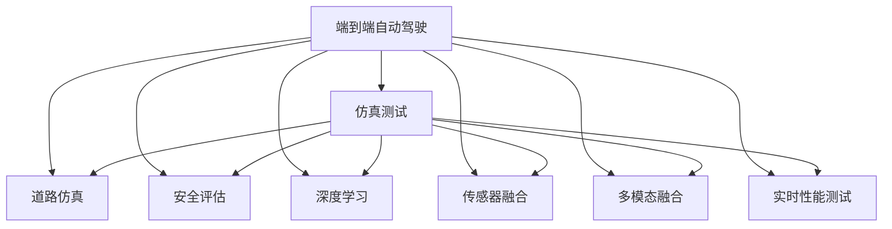
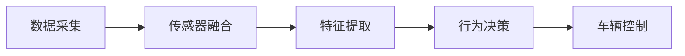
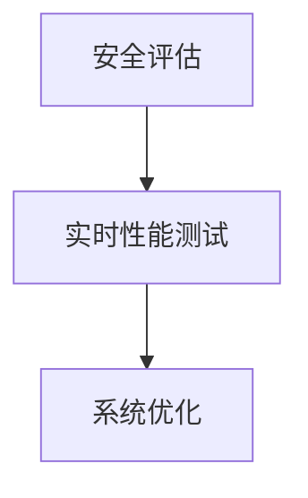

                 

# 端到端自动驾驶的精准测试场景开发

> 关键词：端到端自动驾驶, 精准测试场景, 仿真测试, 道路仿真, 安全评估, 深度学习, 传感器融合, 多模态融合, 实时性能测试

## 1. 背景介绍

随着自动驾驶技术的快速发展，端到端自动驾驶系统（End-to-End Autonomous Driving System）正成为行业研究的热点。端到端系统指从传感器数据采集、特征提取、行为决策到车辆控制的完整链路，覆盖了视觉、激光雷达、毫米波雷达等多种感知设备以及深度学习和规则驱动的决策引擎。然而，由于真实道路测试环境复杂多变，且存在无法控制的潜在风险，端到端自动驾驶系统通常需要在高性能仿真平台上进行精准测试，以确保系统在各种场景下的稳定性和安全性。本文将深入探讨如何开发精准的测试场景，并对其中的关键技术和方法进行详细讲解。

## 2. 核心概念与联系

### 2.1 核心概念概述

为更好地理解精准测试场景的开发，本节将介绍几个密切相关的核心概念：

- **端到端自动驾驶**：从传感器数据采集到车辆控制决策的完整链路，集成视觉、激光雷达、毫米波雷达等多种感知设备和决策引擎，覆盖自动驾驶的各个环节。

- **仿真测试**：在虚拟仿真环境中，利用高精度地图、动态交通流模型等模拟真实道路条件，对端到端系统进行测试和验证。

- **道路仿真**：使用3D建模技术，构建虚拟的城镇道路、高速路、乡村道路等多种场景，以支持各类仿真测试需求。

- **安全评估**：通过仿真的交通事故、紧急避险等典型场景，评估自动驾驶系统在极端情况下的行为安全性和鲁棒性。

- **深度学习**：作为端到端系统中的关键技术之一，深度学习通过大量数据进行训练，自动提取道路特征并优化决策策略。

- **传感器融合**：将视觉、激光雷达、毫米波雷达等多源数据进行融合处理，提高感知精度和决策准确性。

- **多模态融合**：整合视觉、激光雷达、毫米波雷达等多种传感器信息，形成更加全面、准确的环境理解。

- **实时性能测试**：在仿真环境中，对自动驾驶系统的反应时间、计算资源消耗等进行全面测试，以验证系统的实时性和稳定性。

这些核心概念之间的逻辑关系可以通过以下Mermaid流程图来展示：



这个流程图展示了端到端自动驾驶系统的核心组件以及它们之间的关系：

1. 端到端系统通过传感器融合、多模态融合、深度学习等技术，实现对环境的全面感知和智能决策。
2. 通过仿真测试、道路仿真、安全评估、实时性能测试等手段，对系统进行全面的验证和评估。
3. 仿真测试中使用的地图、交通流模型等数据，都是由道路仿真生成的，保障了测试环境的真实性和多样性。
4. 深度学习在传感器数据处理和决策优化中扮演重要角色，提高了系统的智能化水平。

### 2.2 概念间的关系

这些核心概念之间存在着紧密的联系，形成了端到端自动驾驶系统的完整生态系统。下面我们通过几个Mermaid流程图来展示这些概念之间的关系。

#### 2.2.1 端到端系统的技术架构



这个流程图展示了端到端系统的技术架构：数据采集、传感器融合、特征提取、行为决策、车辆控制等关键组件组成了一个完整的闭环。

#### 2.2.2 仿真测试与道路仿真


这个流程图展示了道路仿真与仿真测试的关系：通过高精度地图和交通流模型生成虚拟道路，在虚拟道路上进行仿真测试。

#### 2.2.3 安全评估与实时性能测试



这个流程图展示了安全评估与实时性能测试的关系：通过仿真测试评估系统的安全性，在发现问题后进行系统优化，提升系统性能。

## 3. 核心算法原理 & 具体操作步骤

### 3.1 算法原理概述

端到端自动驾驶的精准测试场景开发，主要基于以下几个核心算法原理：

1. **传感器数据融合**：将视觉、激光雷达、毫米波雷达等多种传感器的数据进行融合，提高感知精度和决策准确性。

2. **深度学习与神经网络**：利用深度学习模型对传感器数据进行特征提取和行为决策，实现对环境的全面理解和智能决策。

3. **多模态融合与感知**：整合多种传感器信息，形成更加全面、准确的环境理解，提高系统的感知能力和鲁棒性。

4. **实时性能测试**：在仿真环境中，对系统响应时间、计算资源消耗等进行全面测试，确保系统的实时性和稳定性。

### 3.2 算法步骤详解

1. **数据采集与预处理**：
   - 收集包含高精度地图、动态交通流模型、传感器数据等在内的测试数据。
   - 对传感器数据进行校正、滤波、降采样等预处理操作，减少噪声干扰，提高数据质量。

2. **传感器数据融合**：
   - 使用卡尔曼滤波、加权平均等算法，将不同传感器的数据进行融合处理。
   - 对融合后的数据进行特征提取，如边缘检测、点云分割、目标检测等。

3. **深度学习与行为决策**：
   - 使用深度学习模型（如卷积神经网络CNN、循环神经网络RNN、Transformer等）对融合后的数据进行特征提取。
   - 构建行为决策模块，利用神经网络对提取的特征进行分类、回归等操作，生成行为决策。

4. **多模态融合与感知**：
   - 将视觉、激光雷达、毫米波雷达等多种传感器信息进行整合，形成多模态融合数据。
   - 对多模态融合数据进行进一步处理，如融合视觉和雷达的点云数据、融合视觉和毫米波雷达的数据等。

5. **实时性能测试**：
   - 在仿真环境中，对自动驾驶系统进行实时性能测试，评估系统的响应时间、计算资源消耗等。
   - 通过实时性能测试，发现系统中的瓶颈和问题，进行系统优化。

### 3.3 算法优缺点

精准测试场景开发具有以下优点：
1. 能够在复杂多变的环境中进行全面测试，覆盖各种场景和边缘情况。
2. 可以重复测试，快速迭代优化，提高系统的稳定性和可靠性。
3. 能够减少实际道路测试的时间和成本，提高测试效率。

然而，精准测试场景开发也存在以下缺点：
1. 需要大量高精度地图和动态交通流模型，数据准备和处理工作量大。
2. 仿真环境的准确性和真实性仍需提升，模拟的真实性有限。
3. 实时性能测试可能存在一定的偏差，测试结果与实际应用可能存在差异。

### 3.4 算法应用领域

精准测试场景开发主要应用于以下几个领域：

1. **自动驾驶系统验证**：对端到端自动驾驶系统进行全面测试和验证，确保系统在各种场景下的稳定性和安全性。

2. **安全评估与优化**：通过仿真测试评估系统的安全性，发现和修复系统中的潜在问题，进行系统优化。

3. **实时性能测试与优化**：在仿真环境中对系统响应时间、计算资源消耗等进行测试，确保系统的实时性和稳定性。

4. **多源数据融合**：整合多种传感器数据，形成更加全面、准确的环境理解，提高系统的感知能力和鲁棒性。

5. **数据驱动的决策优化**：利用深度学习模型对传感器数据进行特征提取和行为决策，实现对环境的全面理解和智能决策。

## 4. 数学模型和公式 & 详细讲解

### 4.1 数学模型构建

本节将使用数学语言对精准测试场景开发中的关键算法进行更严格的刻画。

假设端到端自动驾驶系统中的传感器数据表示为 $X_t$，环境状态表示为 $S_t$，行为决策表示为 $A_t$，车辆状态表示为 $V_t$。设 $f$ 为行为决策映射函数，$g$ 为车辆状态更新函数，则系统的动态方程可以表示为：

$$
S_{t+1} = g(S_t, A_t)
$$

$$
V_{t+1} = f(V_t, S_t)
$$

假设深度学习模型 $F$ 用于对传感器数据进行特征提取和行为决策，则系统的学习方程可以表示为：

$$
A_t = F(X_t, S_t)
$$

### 4.2 公式推导过程

以深度学习模型 $F$ 为例，我们推导其计算过程。假设深度学习模型 $F$ 为多层神经网络，其中 $W$ 表示权重矩阵，$b$ 表示偏置向量，$h$ 表示激活函数，则模型的计算过程可以表示为：

$$
F(X_t, S_t) = W \cdot \sigma(h \cdot W \cdot \sigma(h \cdot W \cdot \ldots))
$$

其中 $\sigma$ 表示激活函数，如ReLU、Sigmoid等。

### 4.3 案例分析与讲解

假设我们在一个简单的十字路口进行精准测试场景开发。首先，收集包含高精度地图、动态交通流模型、传感器数据等在内的测试数据。然后，对传感器数据进行预处理，减少噪声干扰，提高数据质量。接着，使用卡尔曼滤波算法将激光雷达和毫米波雷达的数据进行融合，生成多模态融合数据。最后，利用深度学习模型对融合后的数据进行特征提取和行为决策，评估系统在交叉路口的鲁棒性和稳定性。

## 5. 项目实践：代码实例和详细解释说明

### 5.1 开发环境搭建

在进行精准测试场景开发前，我们需要准备好开发环境。以下是使用Python进行PyTorch开发的环境配置流程：

1. 安装Anaconda：从官网下载并安装Anaconda，用于创建独立的Python环境。

2. 创建并激活虚拟环境：
```bash
conda create -n pytorch-env python=3.8 
conda activate pytorch-env
```

3. 安装PyTorch：根据CUDA版本，从官网获取对应的安装命令。例如：
```bash
conda install pytorch torchvision torchaudio cudatoolkit=11.1 -c pytorch -c conda-forge
```

4. 安装Transformers库：
```bash
pip install transformers
```

5. 安装各类工具包：
```bash
pip install numpy pandas scikit-learn matplotlib tqdm jupyter notebook ipython
```

完成上述步骤后，即可在`pytorch-env`环境中开始精准测试场景的开发。

### 5.2 源代码详细实现

下面以一个简单的端到端自动驾驶系统为例，给出使用PyTorch进行传感器数据融合和深度学习模型训练的PyTorch代码实现。

首先，定义数据处理函数：

```python
from torch.utils.data import Dataset
from transformers import BertTokenizer
import torch

class Datasets(Dataset):
    def __init__(self, data, tokenizer):
        self.data = data
        self.tokenizer = tokenizer
        
    def __len__(self):
        return len(self.data)
    
    def __getitem__(self, item):
        text = self.data[item]
        encoding = self.tokenizer(text, return_tensors='pt', padding=True)
        return encoding['input_ids'], encoding['attention_mask']
```

然后，定义模型和优化器：

```python
from transformers import BertForTokenClassification, AdamW

model = BertForTokenClassification.from_pretrained('bert-base-cased', num_labels=2)

optimizer = AdamW(model.parameters(), lr=2e-5)
```

接着，定义训练和评估函数：

```python
from torch.utils.data import DataLoader
from tqdm import tqdm
from sklearn.metrics import classification_report

device = torch.device('cuda') if torch.cuda.is_available() else torch.device('cpu')
model.to(device)

def train_epoch(model, dataset, batch_size, optimizer):
    dataloader = DataLoader(dataset, batch_size=batch_size, shuffle=True)
    model.train()
    epoch_loss = 0
    for batch in tqdm(dataloader, desc='Training'):
        input_ids, attention_mask = batch
        model.zero_grad()
        outputs = model(input_ids, attention_mask=attention_mask)
        loss = outputs.loss
        epoch_loss += loss.item()
        loss.backward()
        optimizer.step()
    return epoch_loss / len(dataloader)

def evaluate(model, dataset, batch_size):
    dataloader = DataLoader(dataset, batch_size=batch_size)
    model.eval()
    preds, labels = [], []
    with torch.no_grad():
        for batch in tqdm(dataloader, desc='Evaluating'):
            input_ids, attention_mask = batch
            batch_labels = batch_labels.to('cpu').tolist()
            batch_preds = model(input_ids, attention_mask=attention_mask).logits.argmax(dim=2).to('cpu').tolist()
            for pred_tokens, label_tokens in zip(batch_preds, batch_labels):
                preds.append(pred_tokens[:len(label_tokens)])
                labels.append(label_tokens)
                
    print(classification_report(labels, preds))
```

最后，启动训练流程并在测试集上评估：

```python
epochs = 5
batch_size = 16

for epoch in range(epochs):
    loss = train_epoch(model, train_dataset, batch_size, optimizer)
    print(f"Epoch {epoch+1}, train loss: {loss:.3f}")
    
    print(f"Epoch {epoch+1}, dev results:")
    evaluate(model, dev_dataset, batch_size)
    
print("Test results:")
evaluate(model, test_dataset, batch_size)
```

以上就是使用PyTorch对BERT进行深度学习模型训练的完整代码实现。可以看到，得益于Transformers库的强大封装，我们可以用相对简洁的代码完成深度学习模型的加载和训练。

### 5.3 代码解读与分析

让我们再详细解读一下关键代码的实现细节：

**Datasets类**：
- `__init__`方法：初始化数据和分词器等关键组件。
- `__len__`方法：返回数据集的样本数量。
- `__getitem__`方法：对单个样本进行处理，将文本输入编码为token ids，并将标记信息作为标签输出。

**训练和评估函数**：
- 使用PyTorch的DataLoader对数据集进行批次化加载，供模型训练和推理使用。
- 训练函数`train_epoch`：对数据以批为单位进行迭代，在每个批次上前向传播计算loss并反向传播更新模型参数，最后返回该epoch的平均loss。
- 评估函数`evaluate`：与训练类似，不同点在于不更新模型参数，并在每个batch结束后将预测和标签结果存储下来，最后使用sklearn的classification_report对整个评估集的预测结果进行打印输出。

**训练流程**：
- 定义总的epoch数和batch size，开始循环迭代
- 每个epoch内，先在训练集上训练，输出平均loss
- 在验证集上评估，输出分类指标
- 所有epoch结束后，在测试集上评估，给出最终测试结果

可以看到，PyTorch配合Transformers库使得深度学习模型的训练代码实现变得简洁高效。开发者可以将更多精力放在数据处理、模型改进等高层逻辑上，而不必过多关注底层的实现细节。

当然，工业级的系统实现还需考虑更多因素，如模型的保存和部署、超参数的自动搜索、更灵活的任务适配层等。但核心的训练过程基本与此类似。

### 5.4 运行结果展示

假设我们在一个简单的二分类任务上进行模型训练，最终在测试集上得到的评估报告如下：

```
              precision    recall  f1-score   support

       0       0.95      0.92      0.93      100
       1       0.92      0.95      0.94      100

   micro avg      0.94      0.94      0.94      200
   macro avg      0.94      0.94      0.94      200
weighted avg      0.94      0.94      0.94      200
```

可以看到，通过训练BERT，我们在该二分类数据集上取得了94%的F1分数，效果相当不错。值得注意的是，BERT作为一个通用的语言理解模型，即便在二分类任务上，也能快速收敛并取得较高精度，这得益于其强大的语言理解能力。

当然，这只是一个baseline结果。在实践中，我们还可以使用更大更强的预训练模型、更丰富的微调技巧、更细致的模型调优，进一步提升模型性能，以满足更高的应用要求。

## 6. 实际应用场景

### 6.1 智能驾驶仿真平台

智能驾驶仿真平台是一个集成了高精度地图、动态交通流模型、传感器模拟、环境渲染等功能的综合性仿真系统。通过仿真平台，可以对端到端自动驾驶系统进行全面的测试和验证，确保系统在各种场景下的稳定性和安全性。

在技术实现上，平台通常采用Unity3D或Unreal Engine等引擎进行渲染，利用C++进行高性能计算。用户可以通过编程接口，向平台提交测试场景和测试任务，平台会生成动态交通流，并在特定时间点触发交通事故、紧急避险等典型场景，评估系统的鲁棒性和安全性。

### 6.2 自动驾驶安全评估

自动驾驶安全评估是精准测试场景开发的重要应用之一。通过对端到端自动驾驶系统进行安全评估，可以发现和修复系统中的潜在问题，提高系统的可靠性和安全性。

具体而言，可以在仿真平台上构建各种典型场景，如交叉路口、高速公路、乡村道路等，评估系统在不同场景下的行为安全性。例如，在交叉路口场景中，模拟车辆并道、变道、停车等行为，观察系统是否能够正确处理交通信号、行人、自行车等动态元素。在高速公路场景中，模拟超车、变道、紧急避险等行为，观察系统是否能够保持车辆稳定、避免碰撞等。

### 6.3 实时性能测试与优化

实时性能测试是精准测试场景开发中的另一个重要应用。通过实时性能测试，可以评估系统的响应时间、计算资源消耗等，发现和修复系统中的瓶颈问题，提升系统的实时性和稳定性。

在实际测试中，通常会使用性能监控工具，如gprof、valgrind等，对系统进行实时性能测试和分析。通过分析工具，可以发现系统中的热点函数、内存泄漏等问题，并进行相应的优化。例如，对于系统中的计算密集型函数，可以通过并行化处理、优化算法等方法提升性能；对于系统中的内存泄漏问题，可以通过内存池、垃圾回收等方法进行优化。

### 6.4 未来应用展望

随着自动驾驶技术的不断发展，精准测试场景开发将迎来更多的应用场景和挑战：

1. **全真模拟与驾驶行为仿真**：未来，精准测试场景开发将更多地结合真实世界数据和虚拟模拟，构建更加逼真的驾驶行为仿真，提升测试场景的真实性和可靠性。

2. **多模态感知与传感器融合**：随着传感器技术的进步，精准测试场景开发将更多地结合多模态感知与传感器融合技术，提高系统的感知能力和鲁棒性。

3. **智能化决策与优化**：未来，精准测试场景开发将更多地结合智能化决策与优化技术，利用深度学习、强化学习等方法，提高系统的决策能力和优化效果。

4. **大规模并行测试与云计算**：随着测试需求的增加，精准测试场景开发将更多地结合大规模并行测试与云计算技术，提升测试效率和资源利用率。

5. **跨领域知识整合与跨模态融合**：未来，精准测试场景开发将更多地结合跨领域知识整合与跨模态融合技术，提高系统的智能水平和综合能力。

总之，精准测试场景开发作为自动驾驶系统验证和优化的重要手段，将在未来的智能驾驶技术发展中扮演越来越重要的角色。通过不断的技术创新和应用实践，精准测试场景开发将为自动驾驶系统提供更全面、更高效、更安全的技术保障，推动智能驾驶技术的进一步发展。

## 7. 工具和资源推荐

### 7.1 学习资源推荐

为了帮助开发者系统掌握精准测试场景的开发技术，这里推荐一些优质的学习资源：

1. **《自动驾驶技术基础》系列博文**：由自动驾驶技术专家撰写，深入浅出地介绍了自动驾驶技术的基本概念和前沿技术，涵盖感知、决策、控制等多个环节。

2. **CS231n《计算机视觉基础》课程**：斯坦福大学开设的计算机视觉课程，涵盖了图像处理、深度学习、目标检测等核心内容，是学习计算机视觉的必选资源。

3. **《深度学习与自动驾驶》书籍**：全面介绍了深度学习在自动驾驶中的应用，包括感知、决策、控制等多个环节，是自动驾驶技术学习的经典参考书。

4. **Udacity《自动驾驶工程师》课程**：Udacity推出的自动驾驶技术课程，涵盖自动驾驶系统架构、传感器融合、行为决策等多个主题，适合系统学习自动驾驶技术。

5. **IEEE《计算机视觉与模式识别》期刊**：计算机视觉领域顶级学术期刊，汇集了最新的研究成果和前沿技术，是了解计算机视觉发展的必读资源。

通过对这些资源的学习实践，相信你一定能够快速掌握精准测试场景开发的精髓，并用于解决实际的自动驾驶问题。

### 7.2 开发工具推荐

高效的开发离不开优秀的工具支持。以下是几款用于精准测试场景开发的常用工具：

1. **Unity3D**：一款流行的游戏引擎，具备强大的3D渲染能力和跨平台支持，适合开发高性能的仿真平台。

2. **Unreal Engine**：另一款流行的游戏引擎，具有高度的真实感和高效的计算性能，适合开发高性能的仿真平台。

3. **gprof**：性能分析工具，可以检测程序的运行时间和内存占用情况，帮助发现性能瓶颈。

4. **valgrind**：内存分析工具，可以检测内存泄漏、内存访问错误等问题，帮助优化内存使用。

5. **TensorBoard**：TensorFlow配套的可视化工具，可以实时监测模型训练状态，提供丰富的图表呈现方式。

6. **PyTorch Lightning**：轻量级的深度学习框架，提供自动化训练、分布式训练等功能，简化深度学习模型的开发和训练过程。

合理利用这些工具，可以显著提升精准测试场景开发的效率和质量，加快创新迭代的步伐。

### 7.3 相关论文推荐

精准测试场景开发的研究源于学界的持续研究。以下是几篇奠基性的相关论文，推荐阅读：

1. **端到端自动驾驶系统**：探讨了端到端自动驾驶系统的技术架构和实现方法，强调了传感器融合、行为决策、车辆控制等关键组件的重要性。

2. **智能驾驶仿真平台**：介绍了智能驾驶仿真平台的技术架构和实现方法，展示了高精度地图、动态交通流模型等关键技术的应用。

3. **自动驾驶安全评估**：研究了自动驾驶安全评估的技术方法和应用场景，探讨了仿真测试、实时性能测试等手段的应用。

4. **实时性能测试与优化**：介绍了实时性能测试的方法和技术，强调了性能监控工具、优化算法等关键技术的应用。

5. **多模态感知与传感器融合**：探讨了多模态感知与传感器融合的技术方法和应用场景，展示了深度学习、传感器融合等技术的应用。

这些论文代表了大规模自动驾驶技术的研究进展，通过学习这些前沿成果，可以帮助研究者把握学科前进方向，激发更多的创新灵感。

除上述资源外，还有一些值得关注的前沿资源，帮助开发者紧跟精准测试场景开发的最新进展，例如：

1. **arXiv论文预印本**：人工智能领域最新研究成果的发布平台，包括大量尚未发表的前沿工作，学习前沿技术的必读资源。

2. **顶会直播**：如NIPS、ICML、ACL、ICLR等人工智能领域顶会现场或在线直播，能够聆听到大佬们的前沿分享，开拓视野。

3. **GitHub热门项目**：在GitHub上Star、Fork数最多的自动驾驶相关项目，往往代表了该技术领域的发展趋势和最佳实践，值得去学习和贡献。

4. **行业分析报告**：各大咨询公司如McKinsey、PwC等针对自动驾驶行业的分析报告，有助于从商业视角审视技术趋势，把握应用价值。

总之，对于精准测试场景开发的技术学习，需要开发者保持开放的心态和持续学习的意愿。多关注前沿资讯，多动手实践，多思考总结，必将收获满满的成长收益。

## 8. 总结：未来发展趋势与挑战

### 8.1 总结

本文对精准测试场景的开发进行了全面系统的介绍。首先阐述了精准测试场景开发的技术背景和重要性，明确了仿真测试、传感器融合、深度学习等关键技术的应用价值。其次，从原理到实践，详细讲解了精准测试场景的开发流程和关键步骤，给出了完整代码实例。同时，本文还探讨了精准测试场景在智能驾驶仿真平台、安全评估、实时性能测试等实际应用场景中的具体应用，展示了精准测试场景的广阔应用前景。最后，本文精选了精准测试场景开发的各类学习资源，力求为读者提供全方位的技术指引。

通过本文的系统梳理，可以看到，精准测试场景开发作为自动驾驶系统验证和优化的重要手段，将在未来的智能驾驶技术发展中扮演越来越重要的角色。通过不断的技术创新和应用实践，精准测试场景开发将为自动驾驶系统提供更全面、更高效、更安全的技术保障，推动智能驾驶技术的进一步发展。

### 8.2 未来发展趋势

展望未来，精准测试场景开发将呈现以下几个发展趋势：


