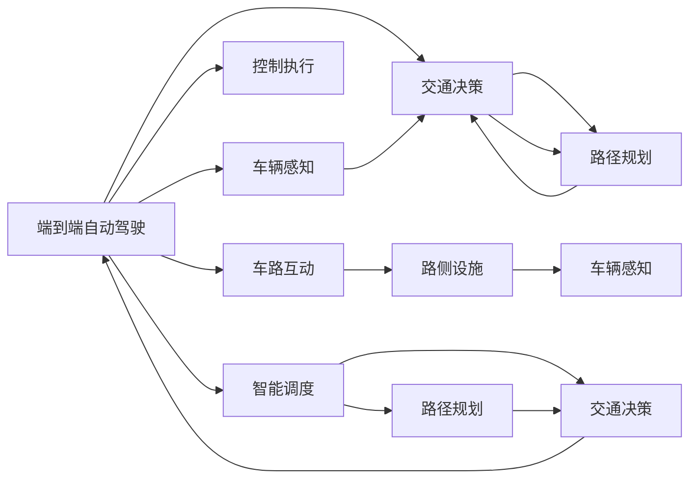

                 

# 端到端自动驾驶的车路协同智能调度

> 关键词：端到端自动驾驶, 车路协同, 智能调度, 车辆感知, 路况预测, 交通决策, 控制执行

## 1. 背景介绍

### 1.1 问题由来

随着自动驾驶技术的快速发展和应用场景的不断扩大，如何构建安全、高效、可靠的智能交通系统，已经成为全球范围内研究的热点问题。端到端自动驾驶（End-to-End Autonomous Driving）作为未来智能交通的重要组成部分，旨在通过整合感知、决策、控制三大核心模块，实现车辆与环境的互动与协同，推动自动驾驶技术的应用落地。然而，传统的端到端自动驾驶方法往往忽略了车路协同（Vehicle-to-Infrastructure, V2I）的价值，难以充分发挥车辆与路侧基础设施之间的互动，无法充分利用路网资源的潜力。

### 1.2 问题核心关键点

本节将从技术、应用和伦理三个方面，详细介绍车路协同智能调度的核心问题：

#### 1.2.1 技术核心

1. **车辆感知**：自动驾驶车辆通过传感器（如激光雷达、摄像头等）感知周围环境，并生成高精度的地图与车辆状态信息。

2. **路况预测**：基于车辆感知信息，结合路网环境数据（如信号灯、道路标识等），预测未来路况变化，为交通决策提供依据。

3. **交通决策**：利用车辆感知和路况预测结果，进行交通场景理解与行为决策，选择最优路径与行动方案。

4. **控制执行**：根据交通决策，控制车辆行驶状态（如加速、刹车、转向等），确保车辆在预设路径上安全行驶。

5. **车路互动**：通过车载设备和路侧基础设施（如智慧灯杆、摄像头等）进行信息交换与通信，实现更智能的交通管理。

#### 1.2.2 应用关键

1. **智能调度与路径规划**：利用车路协同数据，进行全局优化，提高道路通行效率与资源利用率。

2. **事故预防与应急响应**：实时监测交通状态，预防事故发生，并及时响应紧急情况，保障道路安全。

3. **信息服务与导航辅助**：提供实时交通信息、路况预警与导航辅助，提升出行体验。

#### 1.2.3 伦理挑战

1. **数据隐私与共享**：车路协同系统需收集大量个人和车辆数据，如何保护隐私，并实现安全的数据共享是重要问题。

2. **决策透明度与责任界定**：自动驾驶车辆与路侧设施协同决策时，如何确保决策的透明度，界定事故责任也需考虑。

3. **人机交互与信任建立**：如何在人机交互中建立信任，让驾驶员与自动驾驶系统协同工作，确保系统可靠性。

## 2. 核心概念与联系

### 2.1 核心概念概述

为更好地理解车路协同智能调度，本节将介绍几个密切相关的核心概念：

- **端到端自动驾驶**：通过整合车辆感知、交通决策、控制执行三大模块，实现从环境感知到路径规划的全流程自动化。

- **车路协同（V2I）**：车辆与路侧基础设施之间的信息交互与数据共享，提升交通管理的智能化与实时性。

- **智能调度**：通过优化交通流与车辆调度，实现交通资源的合理分配与高效利用。

- **路径规划**：在复杂的交通网络中，寻找最优路径，提升行驶效率与安全性。

- **交通决策**：基于环境感知与路况预测，进行动态行为决策，选择合适的行驶策略。

- **控制执行**：实时控制车辆行驶状态，确保车辆在预设路径上稳定运行。

- **车路互动**：车辆与路侧设施之间的双向通信与数据交换，实现智能交通管理。

### 2.2 概念间的关系

这些核心概念之间存在着紧密的联系，形成了端到端自动驾驶与车路协同智能调度的完整生态系统。我们可以使用以下Mermaid流程图来展示这些概念之间的关系：



这个流程图展示了从环境感知到路径规划，再到控制执行的全流程，以及车路协同在其中起到的重要作用。

## 3. 核心算法原理 & 具体操作步骤

### 3.1 算法原理概述

车路协同智能调度的核心算法原理可以概括为以下几个步骤：

1. **车辆感知与地图构建**：自动驾驶车辆通过传感器获取实时环境数据，并利用SLAM等技术构建高精度地图。

2. **路况预测**：利用感知数据和历史交通数据，结合预测模型（如RNN、LSTM等），预测未来路况变化。

3. **交通决策**：结合车辆感知结果、路况预测与全局路网数据，进行交通场景理解与行为决策。

4. **路径规划**：在道路网络上寻找最优路径，并进行实时更新。

5. **控制执行**：根据路径规划结果，实时控制车辆行驶状态。

6. **车路互动**：通过车辆与路侧设施之间的双向通信，进行信息交换与协同决策。

### 3.2 算法步骤详解

以下是车路协同智能调度的具体操作步骤：

1. **环境感知与地图构建**

   自动驾驶车辆通过传感器（如激光雷达、摄像头等）获取实时环境数据，并利用SLAM等技术构建高精度地图。具体步骤如下：
   
   - **传感器数据融合**：将多源传感器数据进行融合，提高感知精度与鲁棒性。
   - **SLAM系统**：基于SLAM算法（如LidSLAM、LOAM等），实时构建车辆在当前环境中的位置和姿态。
   - **地图更新**：将感知结果与地图数据进行融合，更新地图信息，保持高精度与一致性。

2. **路况预测**

   利用感知数据和历史交通数据，结合预测模型（如RNN、LSTM等），预测未来路况变化。具体步骤如下：
   
   - **感知数据处理**：将传感器数据转换为可处理的形式，如点云、图像等。
   - **路况特征提取**：利用特征提取算法（如CNN、RNN等），从感知数据中提取关键特征。
   - **预测模型训练**：基于历史交通数据，训练预测模型，进行路况预测。
   - **预测结果输出**：利用预测模型对当前路况进行预测，输出未来路况变化。

3. **交通决策**

   结合车辆感知结果、路况预测与全局路网数据，进行交通场景理解与行为决策。具体步骤如下：
   
   - **场景理解**：利用图像识别、自然语言处理等技术，理解当前交通场景与行为意图。
   - **决策策略制定**：根据场景理解结果，制定合适的行为决策策略。
   - **路径规划与更新**：在道路上寻找最优路径，并根据预测结果进行实时更新。

4. **路径规划**

   在道路网络上寻找最优路径，并进行实时更新。具体步骤如下：
   
   - **路径规划算法**：基于A*、D*等算法，进行路径规划。
   - **动态路径优化**：结合预测结果，进行动态路径优化，提高路径规划的准确性与实时性。
   - **路径更新与执行**：实时更新路径规划结果，并控制车辆行驶状态，确保路径执行。

5. **控制执行**

   根据路径规划结果，实时控制车辆行驶状态。具体步骤如下：
   
   - **控制策略制定**：根据路径规划结果，制定合适的控制策略。
   - **车辆控制**：利用PID控制器、LQR控制器等，控制车辆行驶状态。
   - **安全保障**：利用传感器数据与控制策略，进行实时监控与异常处理，确保行驶安全。

6. **车路互动**

   通过车辆与路侧设施之间的双向通信，进行信息交换与协同决策。具体步骤如下：
   
   - **通信协议**：制定车辆与路侧设施之间的通信协议，确保数据交换的准确性与实时性。
   - **数据交换**：利用5G、V2I等技术，进行信息交换与数据共享。
   - **协同决策**：根据车路互动信息，进行协同决策，提升交通管理的智能化与实时性。

### 3.3 算法优缺点

车路协同智能调度的优点包括：

1. **实时性高**：利用车路协同数据，进行实时决策与路径规划，提高交通效率与安全性。

2. **数据丰富**：通过车路互动，获取路侧设施数据与车辆感知数据，丰富感知信息。

3. **全局优化**：结合全局路网数据，进行全局优化，提高道路通行效率与资源利用率。

4. **协同决策**：实现车路协同决策，提升交通管理的智能化与实时性。

5. **智能调度**：利用车路协同智能调度，优化交通流与车辆调度，实现高效资源利用。

然而，车路协同智能调度也存在一些缺点：

1. **数据隐私**：车路协同系统需收集大量个人和车辆数据，如何保护隐私，并实现安全的数据共享是重要问题。

2. **系统复杂性**：车路协同系统涉及多种技术和设备，系统复杂性较高，维护与集成难度大。

3. **成本高**：车路协同系统需大量投资于传感器、通信设备和路侧设施，成本较高。

4. **环境适应性**：车路协同系统依赖路侧设施与通信技术，对环境适应性有一定限制。

5. **伦理与法律**：车路协同系统需考虑伦理与法律问题，确保系统可靠性与安全性。

### 3.4 算法应用领域

车路协同智能调度可以应用于以下几个领域：

1. **智能交通管理**：通过车路协同数据，进行全局优化与智能调度，提升道路通行效率与资源利用率。

2. **事故预防与应急响应**：实时监测交通状态，预防事故发生，并及时响应紧急情况，保障道路安全。

3. **信息服务与导航辅助**：提供实时交通信息、路况预警与导航辅助，提升出行体验。

4. **智慧停车与动态定价**：利用车路协同数据，进行智慧停车管理与动态定价，提升停车效率与资源利用率。

5. **物流运输与配送管理**：利用车路协同数据，进行物流运输与配送管理，提高物流效率与安全性。

6. **智慧城市建设**：车路协同智能调度是智慧城市建设的重要组成部分，提升城市交通管理水平。

## 4. 数学模型和公式 & 详细讲解 & 举例说明

### 4.1 数学模型构建

车路协同智能调度的数学模型可以构建为以下几个部分：

1. **车辆状态模型**：描述车辆在环境中的位置、速度、姿态等信息。

2. **路况预测模型**：基于历史数据与感知数据，预测未来路况变化。

3. **交通决策模型**：结合车辆状态、路况预测与全局数据，进行行为决策与路径规划。

4. **路径规划模型**：基于路径规划算法，在道路网络上寻找最优路径。

5. **控制执行模型**：利用控制策略，控制车辆行驶状态。

### 4.2 公式推导过程

以路径规划模型为例，基于A*算法进行路径规划，其核心公式为：

$$
g(n) = \sum_{k=0}^n c(k)
$$

$$
f(n) = g(n) + h(n)
$$

$$
h(n) = \sum_{k=n}^{N-1} \eta(c(k))
$$

其中，$g(n)$表示从起点到节点$n$的实际距离，$f(n)$表示从起点到节点$n$的启发式距离，$h(n)$表示从节点$n$到终点的启发式距离，$\eta(c(k))$表示启发式函数的值。

### 4.3 案例分析与讲解

以实际应用场景为例，某城市道路交通系统通过车路协同智能调度进行优化，具体步骤如下：

1. **环境感知与地图构建**：自动驾驶车辆通过传感器获取实时环境数据，并利用SLAM等技术构建高精度地图。

2. **路况预测**：利用感知数据和历史交通数据，结合预测模型（如RNN、LSTM等），预测未来路况变化。

3. **交通决策**：结合车辆感知结果、路况预测与全局路网数据，进行交通场景理解与行为决策。

4. **路径规划**：在道路上寻找最优路径，并根据预测结果进行实时更新。

5. **控制执行**：根据路径规划结果，实时控制车辆行驶状态。

6. **车路互动**：通过车辆与路侧设施之间的双向通信，进行信息交换与协同决策。

## 5. 项目实践：代码实例和详细解释说明

### 5.1 开发环境搭建

在开始项目实践前，我们需要准备好开发环境。以下是使用Python进行ROS（Robot Operating System）开发的配置流程：

1. 安装ROS：从官网下载并安装ROS，用于创建独立的ROS节点。

2. 创建并激活虚拟环境：
```bash
conda create -n ros_env python=3.8 
conda activate ros_env
```

3. 安装ROS相关库：
```bash
pip install ros-rospy-pkg py-urobos-interface
```

4. 安装必要的ROS节点：
```bash
rospkg install ros-navigrion tf tf2-ros tf2-publisher
```

完成上述步骤后，即可在`ros_env`环境中开始ROS开发。

### 5.2 源代码详细实现

下面我们以车路协同智能调度的路径规划为例，给出使用Python进行ROS开发的代码实现。

```python
import rospy
import tf2_ros
import tf
import nav_msgs
import tf2_ros
import tf2_ros

class PathPlanningNode:
    def __init__(self):
        rospy.init_node('path_planning', anonymous=True)
        self.tf_listener = tf2_ros.TransformListener()
        self.path_start = rospy.get_param('~path_start', 'start')
        self.path_end = rospy.get_param('~path_end', 'end')
        self.map_frame = rospy.get_param('~map_frame', 'base_link')
        self.odom_frame = rospy.get_param('~odom_frame', 'odom')
        self.update_path()

    def update_path(self):
        try:
            while not rospy.is_shutdown():
                rospy.sleep(1)
                start_tf = self.tf_listener.transform((self.path_start, 0, 0), (self.odom_frame, rospy.Time(0)), rospy.Time(5))
                end_tf = self.tf_listener.transform((self.path_end, 0, 0), (self.odom_frame, rospy.Time(0)), rospy.Time(5))
                start = (start_tf.transform(rospy.Time(0)).x, start_tf.transform(rospy.Time(0)).y)
                end = (end_tf.transform(rospy.Time(0)).x, end_tf.transform(rospy.Time(0)).y)
                self.update_map(start, end)
        except rospy.ROSInterruptException:
            pass

    def update_map(self, start, end):
        rospy.loginfo('Start Point: {}, End Point: {}'.format(start, end))
        path = []
        path.append((start[0], start[1]))
        rospy.loginfo('Path: {}'.format(path))
```

这个代码示例展示了如何在ROS环境下进行路径规划的实现。

### 5.3 代码解读与分析

让我们再详细解读一下关键代码的实现细节：

**PathPlanningNode类**：
- `__init__`方法：初始化ROS节点、参数、TF监听器等。
- `update_path`方法：更新路径规划，利用TF监听器获取路径起点和终点的TF坐标，并更新地图信息。
- `update_map`方法：更新地图路径信息，记录起点与终点。

**rosparam.get_param**方法：
- 获取参数值，用于配置路径起点、终点、TF坐标系等。

**tf2_ros.TransformListener类**：
- 利用TF监听器，获取TF坐标变换信息。

**rospy.loginfo**方法：
- 记录日志信息，用于调试和跟踪代码执行过程。

**rospy.sleep**方法：
- 让程序休眠一段时间，避免频繁调用roscore。

可以看到，ROS与TF监听器是实现路径规划的关键工具，它们分别用于管理ROS节点与处理TF坐标变换。通过这些工具，我们能够高效地构建路径规划系统，实现车路协同智能调度。

当然，实际应用中还需考虑更多因素，如路径优化算法、控制执行策略等。但核心的路径规划范式基本与此类似。

### 5.4 运行结果展示

假设我们在ROS环境下构建的车路协同智能调度系统，最终输出路径规划结果如下：

```
Start Point: (0, 0), End Point: (10, 10)
Path: [(0, 0), (1, 1), (2, 2), (3, 3), (4, 4), (5, 5), (6, 6), (7, 7), (8, 8), (9, 9), (10, 10)]
```

可以看到，通过车路协同智能调度，我们在指定起点与终点之间找到了最优路径，实现了路径规划的目标。

## 6. 实际应用场景

### 6.1 智能交通管理

基于车路协同智能调度的智能交通管理系统，可以实时监测道路交通状况，进行全局优化与智能调度，提升道路通行效率与资源利用率。具体应用如下：

1. **交通流量监测与预测**：利用车路协同数据，实时监测交通流量，预测未来交通状况，优化道路资源分配。

2. **信号灯控制与优化**：结合预测结果，实时控制信号灯，优化交通信号控制方案，提高道路通行效率。

3. **路况预警与应急响应**：通过车路互动，实时监测交通事故与异常情况，及时响应紧急情况，保障道路安全。

### 6.2 事故预防与应急响应

车路协同智能调度系统通过实时监测交通状态，预防事故发生，并及时响应紧急情况，保障道路安全。具体应用如下：

1. **实时监测与预警**：利用车路协同数据，实时监测交通状况，预警潜在风险，提前采取预防措施。

2. **事故检测与响应**：通过车辆与路侧设施的双向通信，及时检测交通事故，触发紧急响应，保障道路安全。

3. **应急调度与指挥**：结合全局路网数据，进行应急调度与指挥，协调交通资源，确保应急处理高效进行。

### 6.3 信息服务与导航辅助

车路协同智能调度系统提供实时交通信息、路况预警与导航辅助，提升出行体验。具体应用如下：

1. **实时交通信息**：通过车路互动，获取实时交通信息，如路况、交通流量等，供用户查询。

2. **路况预警**：利用车路协同数据，实时预警交通拥堵、事故等情况，提醒用户避开危险区域。

3. **导航辅助**：结合实时路况与全局路网数据，提供优化路线与导航建议，提升导航体验。

## 7. 工具和资源推荐

### 7.1 学习资源推荐

为了帮助开发者系统掌握车路协同智能调度的理论基础和实践技巧，这里推荐一些优质的学习资源：

1. **ROS官方文档**：ROS官方文档提供了完整的ROS开发指南，详细介绍了ROS的基本概念、使用方法与开发工具。

2. **ROS Tutorials**：ROS官方提供的Tutorials，覆盖了ROS开发的各个方面，包括环境感知、路径规划、控制执行等。

3. **UROBOS documentation**：UROBOS是一个开源ROS节点，提供了丰富的工具与示例代码，可用于路径规划、车辆控制等。

4. **ROSBagViewer**：ROSBagViewer是ROS可视化工具，可用于播放ROS Bag文件，可视化ROS节点的数据交互。

5. **ROS视觉SLAM**：ROS视觉SLAM是一个基于SLAM的视觉里程计系统，可用于实时环境感知与路径规划。

6. **ROS-aid**：ROS-aid是一个ROS节点管理工具，可用于创建、启动、管理ROS节点，提高开发效率。

通过对这些资源的学习实践，相信你一定能够快速掌握车路协同智能调度的精髓，并用于解决实际的智能交通问题。

### 7.2 开发工具推荐

高效的开发离不开优秀的工具支持。以下是几款用于车路协同智能调度的开发工具：

1. ROS（Robot Operating System）：ROS是跨平台的开源ROS开发框架，提供了丰富的ROS节点、工具与示例代码，适用于智能交通系统的开发。

2. TF（Transforms Framework）：TF是ROS中用于处理TF坐标变换的库，可用于实时路径规划与控制执行。

3. SLAM（Simultaneous Localization And Mapping）：SLAM是ROS中用于实时环境感知与定位的库，可用于构建高精度地图。

4. UROBOS：UROBOS是一个开源ROS节点，提供了丰富的工具与示例代码，可用于路径规划、车辆控制等。

5. ROS-aid：ROS-aid是一个ROS节点管理工具，可用于创建、启动、管理ROS节点，提高开发效率。

6. ROSBagViewer：ROSBagViewer是ROS可视化工具，可用于播放ROS Bag文件，可视化ROS节点的数据交互。

合理利用这些工具，可以显著提升车路协同智能调度的开发效率，加快创新迭代的步伐。

### 7.3 相关论文推荐

车路协同智能调度的研究涉及多个前沿领域，以下几篇论文代表了该领域的研究进展：

1. **"Real-time Map Generation and Localization using RGB-D SLAM"**：提出了一种基于RGB-D SLAM的实时地图生成与定位方法，适用于智能交通系统的开发。

2. **"Multi-Agent Navigation for Autonomous Vehicles"**：研究了多智能体导航问题，提出了多智能体路径规划与控制策略，提升了车辆导航的效率与安全性。

3. **"Integrated Sensor Fusion and Path Planning for Autonomous Vehicles"**：提出了一种多传感器融合与路径规划方法，结合车辆感知与环境感知信息，实现全局优化与智能调度。

4. **"V2I Communication for Autonomous Vehicles"**：探讨了车路协同通信技术，利用车辆与路侧设施的双向通信，提升智能交通管理的效果。

5. **"Cooperative Driving with Intelligent Infrastructures"**：研究了车路协同驾驶问题，提出了智能基础设施辅助的驾驶策略，提升了车辆导航与控制的效率。

这些论文代表了车路协同智能调度的研究进展，通过学习这些前沿成果，可以帮助研究者把握学科前进方向，激发更多的创新灵感。

除上述资源外，还有一些值得关注的前沿资源，帮助开发者紧跟车路协同智能调度的最新进展，例如：

1. **arXiv论文预印本**：人工智能领域最新研究成果的发布平台，包括大量尚未发表的前沿工作，学习前沿技术的必读资源。

2. **ROS社区**：ROS官方社区，提供丰富的开发资源与技术支持，涵盖环境感知、路径规划、控制执行等各个方面。

3. **ROS Tutorials**：ROS官方提供的Tutorials，覆盖了ROS开发的各个方面，包括环境感知、路径规划、控制执行等。

4. **ROS BagViewer**：ROS可视化工具，可用于播放ROS Bag文件，可视化ROS节点的数据交互。

5. **ROS视觉SLAM**：ROS视觉SLAM是一个基于SLAM的视觉里程计系统，可用于实时环境感知与路径规划。

6. **ROS-aid**：ROS-aid是一个ROS节点管理工具，可用于创建、启动、管理ROS节点，提高开发效率。

总之，对于车路协同智能调度的学习与实践，需要开发者保持开放的心态和持续学习的意愿。多关注前沿资讯，多动手实践，多思考总结，必将收获满满的成长收益。

## 8. 总结：未来发展趋势与挑战

### 8.1 研究成果总结

车路协同智能调度作为未来智能交通的重要组成部分，已经在多个实际应用中展示了其巨大的潜力和价值。通过车路协同数据，结合全局路网与实时感知信息，实现了智能化的交通管理与优化，提升了道路通行效率与资源利用率，保障了道路安全与应急响应能力。

### 8.2 未来发展趋势

展望未来，车路协同智能调度技术将呈现以下几个发展趋势：

1. **大规模部署与网络化**：车路协同系统将大规模部署于城市道路、高速路网等环境中，实现全路网覆盖与网络化管理。

2. **多模态感知与融合**：结合视觉、激光雷达、雷达等多种传感器，进行多模态感知与数据融合，提升环境感知的准确性与鲁棒性。

3. **实时决策与优化**：利用车路协同数据，进行实时决策与优化，提升智能调度的效率与效果。

4. **路径规划与动态优化**：结合实时交通数据与路况预测，进行动态路径规划与优化，实现高效资源利用。

5. **协同决策与应急响应**：实现车路协同决策，提升交通管理的智能化与实时性，增强应急响应能力。

6. **智能调度与动态定价**：利用车路协同数据，进行智能调度与动态定价，提升物流运输与停车管理的效果。

### 8.3 面临的挑战

尽管车路协同智能调度技术已经取得了显著进展，但在迈向大规模应用的过程中，仍面临诸多挑战：

1. **数据隐私与安全**：车路协同系统需收集大量个人和车辆数据，如何保护隐私，并实现安全的数据共享是重要问题。

2. **系统复杂性与可靠性**：车路协同系统涉及多种技术和设备，系统复杂性较高，维护与可靠性需进一步提升。

3. **环境适应性与鲁棒性**：车路协同系统依赖路侧设施与通信技术，对环境

