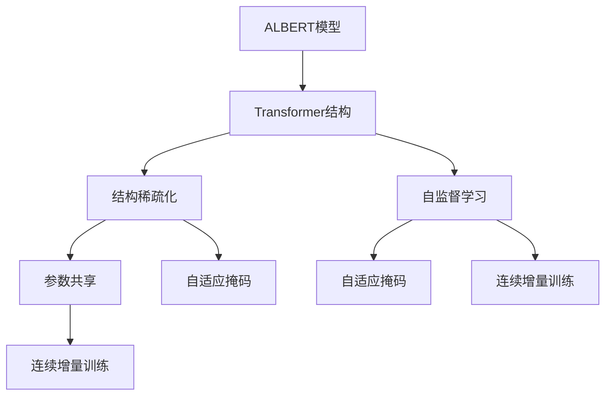
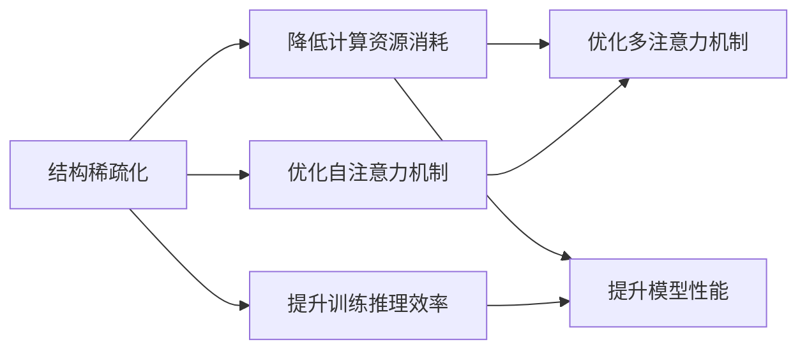
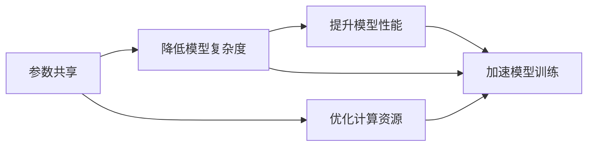
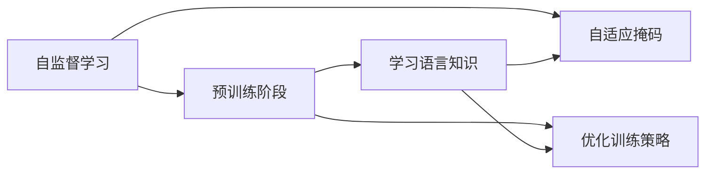
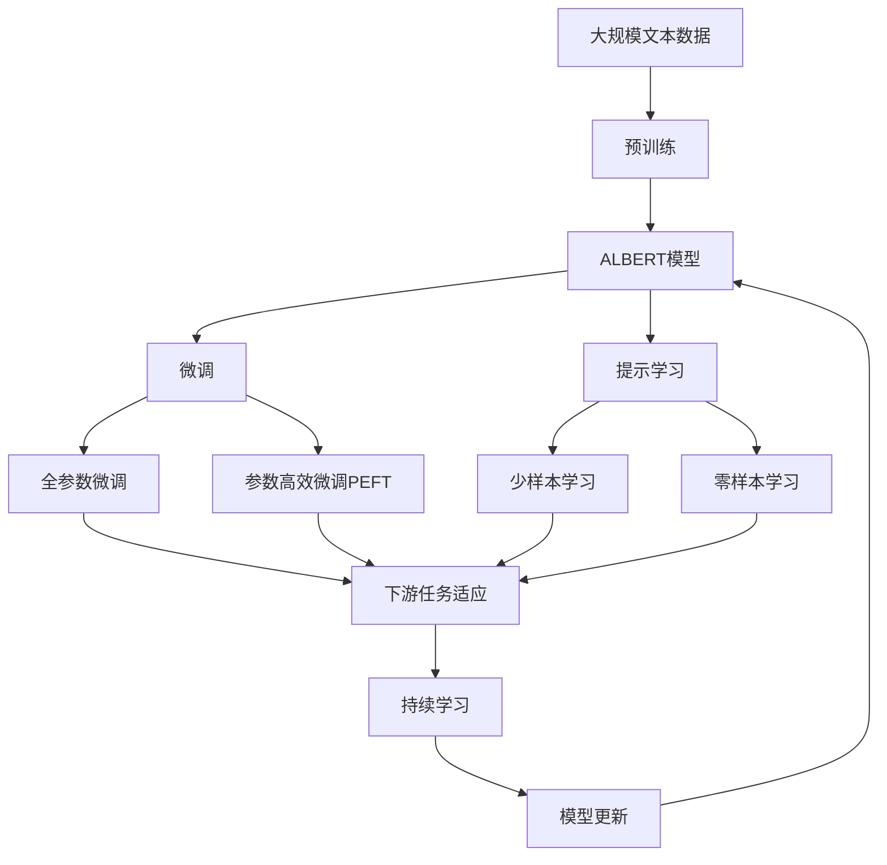

                 

# ALBERT原理与代码实例讲解

> 关键词：ALBERT,Transformer,结构稀疏化,预训练,代码实现

## 1. 背景介绍

### 1.1 问题由来
自2017年Google提出Transformer以来，基于Transformer架构的预训练语言模型在自然语言处理（NLP）领域取得了显著的进步。尽管其具有强大的表示能力，但仍有两大挑战：
- **计算资源消耗大**：标准的Transformer结构具有大量参数，需消耗巨大的计算资源。
- **模型存在线性瓶颈**：多注意力机制的并行计算复杂度高，导致训练速度慢、推理效率低。

为应对这些挑战，Google提出了一种新的Transformer架构——ALBERT（A Lite BERT）。通过结构稀疏化和参数共享等优化措施，ALBERT在大幅降低计算资源消耗的同时，显著提升了模型训练和推理效率，成为NLP预训练模型中的佼佼者。

### 1.2 问题核心关键点
ALBERT的核心思想是利用矩阵分解和参数共享，减少模型中的线性瓶颈，降低计算资源消耗。其主要特点包括：
- **结构稀疏化**：在Transformer的并行结构中，引入稀疏矩阵分解技术，将每个自注意力矩阵转化为两个稀疏矩阵，通过加权和得到完整注意力结果。
- **参数共享**：在多层的Transformer中，各层之间共享部分参数，减少冗余，降低模型复杂度。
- **自适应掩码**：使用自适应掩码技术，动态计算注意力权重，提升模型性能。
- **连续增量训练**：采用连续增量训练策略，逐步加载模型参数，加速模型训练。

### 1.3 问题研究意义
ALBERT作为Transformer架构的进一步优化，能够显著提高模型训练和推理效率，降低资源消耗，适用于对计算资源要求较高的大规模预训练任务。同时，其结构稀疏化和参数共享等特性，为进一步研究Transformer架构提供了新思路，具有重要的理论价值。

## 2. 核心概念与联系

### 2.1 核心概念概述

为更好地理解ALBERT模型，本节将介绍几个密切相关的核心概念：

- **ALBERT模型**：基于Transformer架构，通过结构稀疏化和参数共享等优化措施，大幅降低计算资源消耗的预训练语言模型。
- **Transformer结构**：使用多头自注意力机制和全连接层进行编码解码的深度学习模型。
- **结构稀疏化**：在模型中引入稀疏矩阵分解技术，减少计算资源消耗。
- **参数共享**：在多层的Transformer中，各层之间共享部分参数，降低模型复杂度。
- **自适应掩码**：根据输入文本动态计算注意力权重，提升模型性能。
- **连续增量训练**：逐步加载模型参数，加速模型训练。

这些核心概念之间的逻辑关系可以通过以下Mermaid流程图来展示：



这个流程图展示了大语言模型的核心概念及其之间的关系：

1. ALBERT模型基于Transformer结构。
2. 结构稀疏化、参数共享和自适应掩码等特性，进一步优化了Transformer模型。
3. 自监督学习和连续增量训练，用于预训练和微调过程中。

### 2.2 概念间的关系

这些核心概念之间存在着紧密的联系，形成了ALBERT模型的完整生态系统。下面我们通过几个Mermaid流程图来展示这些概念之间的关系。

#### 2.2.1 ALBERT的优化措施



这个流程图展示了ALBERT模型结构稀疏化的优化措施及其效果：

1. 结构稀疏化通过优化自注意力机制，降低计算资源消耗。
2. 结构稀疏化同时提升模型性能，通过降低计算复杂度，减少训练推理时间。

#### 2.2.2 参数共享与自适应掩码



这个流程图展示了参数共享和自适应掩码的优化效果：

1. 参数共享通过降低模型复杂度，减少计算资源消耗。
2. 参数共享同时提升模型性能，通过减少冗余参数，提高模型效率。

#### 2.2.3 自监督学习和连续增量训练



这个流程图展示了自监督学习和连续增量训练的优化过程：

1. 自监督学习通过预训练，使模型学习到语言知识。
2. 连续增量训练通过逐步加载模型参数，加速模型训练过程。

### 2.3 核心概念的整体架构

最后，我们用一个综合的流程图来展示这些核心概念在大语言模型微调过程中的整体架构：



这个综合流程图展示了从预训练到微调，再到持续学习的完整过程。ALBERT模型首先在大规模文本数据上进行预训练，然后通过微调（包括全参数微调和参数高效微调）或提示学习（包括少样本学习和零样本学习）来适应下游任务。最后，通过持续学习技术，模型可以不断更新和适应新的任务和数据。通过这些流程图，我们可以更清晰地理解ALBERT模型微调过程中各个核心概念的关系和作用。

## 3. 核心算法原理 & 具体操作步骤
### 3.1 算法原理概述

ALBERT模型的核心思想是通过结构稀疏化和参数共享等优化措施，减少计算资源消耗，同时提升模型训练和推理效率。其训练过程包括以下几个步骤：

1. **结构稀疏化**：在每个自注意力矩阵中，通过矩阵分解将注意力权重转化为稀疏矩阵，减少并行计算的复杂度。
2. **参数共享**：在多层的Transformer中，共享部分参数，减少冗余，降低模型复杂度。
3. **自适应掩码**：使用动态掩码技术，根据输入文本动态计算注意力权重，提升模型性能。
4. **连续增量训练**：采用连续增量训练策略，逐步加载模型参数，加速模型训练。

### 3.2 算法步骤详解

ALBERT模型的训练过程主要包括以下几个步骤：

1. **数据预处理**：对输入文本进行分词、编码等预处理，生成Tensor输入。
2. **模型前向传播**：在Transformer的编码器部分，通过结构稀疏化和参数共享等优化措施，进行前向传播计算。
3. **计算损失函数**：通过对比预测结果与真实标签，计算损失函数。
4. **反向传播与优化**：使用梯度下降等优化算法，更新模型参数。
5. **模型评估**：在验证集上评估模型性能，根据评估结果调整超参数。
6. **模型保存与部署**：保存训练好的模型，用于后续推理和应用。

### 3.3 算法优缺点

ALBERT模型具有以下优点：

- **高效计算**：通过结构稀疏化和参数共享等优化措施，大幅降低计算资源消耗，提升训练和推理效率。
- **高泛化能力**：利用自监督学习和多任务学习的特点，使模型具备较强的泛化能力，适用于多种下游任务。
- **易于微调**：通过逐步加载模型参数，实现连续增量训练，减少微调过程中的计算和存储开销。

同时，ALBERT模型也存在一些缺点：

- **模型复杂**：尽管参数数量减少，但结构稀疏化和参数共享等优化措施，增加了模型设计的复杂度。
- **训练时间较长**：尽管计算资源消耗降低，但模型结构稀疏化和参数共享等优化措施，增加了训练时间。
- **通用性有限**：由于模型设计，ALBERT对特定任务可能有更好的表现，但不具备完全的通用性。

### 3.4 算法应用领域

ALBERT模型在NLP领域得到了广泛应用，主要涵盖以下任务：

- **文本分类**：如情感分析、主题分类、意图识别等。通过微调，使模型学习文本-标签映射。
- **命名实体识别**：识别文本中的人名、地名、机构名等特定实体。通过微调，使模型掌握实体边界和类型。
- **关系抽取**：从文本中抽取实体之间的语义关系。通过微调，使模型学习实体-关系三元组。
- **问答系统**：对自然语言问题给出答案。将问题-答案对作为微调数据，训练模型学习匹配答案。
- **机器翻译**：将源语言文本翻译成目标语言。通过微调，使模型学习语言-语言映射。
- **文本摘要**：将长文本压缩成简短摘要。将文章-摘要对作为微调数据，使模型学习抓取要点。
- **对话系统**：使机器能够与人自然对话。将多轮对话历史作为上下文，微调模型进行回复生成。

除了这些经典任务外，ALBERT模型还被创新性地应用到更多场景中，如可控文本生成、常识推理、代码生成、数据增强等，为NLP技术带来了全新的突破。

## 4. 数学模型和公式 & 详细讲解  
### 4.1 数学模型构建

ALBERT模型的数学模型构建基于Transformer模型，采用结构稀疏化和参数共享等优化措施。

假设输入文本为 $x_1, x_2, ..., x_n$，ALBERT模型由编码器-解码器两部分构成，其中编码器部分包含 $n$ 层Transformer层，每层包含多个子层。

定义第 $i$ 层第 $j$ 个子层的前向传播过程为：
$$
h_i^j = \text{Self-Attention}(\tilde{h}_i^j, \tilde{h}_i^j, \tilde{h}_i^j)
$$
其中，$\tilde{h}_i^j$ 为上一层输出，$\text{Self-Attention}$ 为自注意力机制，$\tilde{h}_i^j$ 是经过结构稀疏化和参数共享等优化措施后的输入。

### 4.2 公式推导过程

以下我们以文本分类任务为例，推导ALBERT模型在文本分类任务上的预测公式。

假设输入文本为 $x_1, x_2, ..., x_n$，ALBERT模型的输出为 $h_n$，则分类器的输出为：
$$
\text{logits} = \text{Dense}(\text{MLP}(h_n))
$$
其中，$\text{Dense}$ 为全连接层，$\text{MLP}$ 为多层感知器。

假设分类任务有 $C$ 个类别，真实标签为 $y$，则分类任务的目标函数为：
$$
\mathcal{L} = -\frac{1}{N}\sum_{i=1}^N \sum_{c=1}^C y_i \log p_c
$$
其中，$p_c = \frac{\exp(\text{logits}_{c,i})}{\sum_{c'=1}^C \exp(\text{logits}_{c',i})}$ 为第 $c$ 个类别的概率。

### 4.3 案例分析与讲解

我们以新闻分类任务为例，分析ALBERT模型的预测过程。假设训练集包含 $N$ 篇新闻，每篇新闻有 $n$ 个词，ALBERT模型的输出为 $h_n$。

首先，对每篇新闻进行编码，得到 $n$ 个向量 $\tilde{h}_1, \tilde{h}_2, ..., \tilde{h}_n$。然后，通过ALBERT模型的编码器部分，对 $\tilde{h}_1, \tilde{h}_2, ..., \tilde{h}_n$ 进行前向传播计算，得到 $n$ 个向量 $h_1, h_2, ..., h_n$。最后，将 $h_n$ 输入到全连接层和多层感知器，得到分类任务的预测结果。

## 5. 项目实践：代码实例和详细解释说明
### 5.1 开发环境搭建

在进行ALBERT模型的项目实践前，我们需要准备好开发环境。以下是使用Python进行PyTorch开发的环境配置流程：

1. 安装Anaconda：从官网下载并安装Anaconda，用于创建独立的Python环境。

2. 创建并激活虚拟环境：
```bash
conda create -n pytorch-env python=3.8 
conda activate pytorch-env
```

3. 安装PyTorch：根据CUDA版本，从官网获取对应的安装命令。例如：
```bash
conda install pytorch torchvision torchaudio cudatoolkit=11.1 -c pytorch -c conda-forge
```

4. 安装Transformers库：
```bash
pip install transformers
```

5. 安装各类工具包：
```bash
pip install numpy pandas scikit-learn matplotlib tqdm jupyter notebook ipython
```

完成上述步骤后，即可在`pytorch-env`环境中开始ALBERT模型的微调实践。

### 5.2 源代码详细实现

下面我们以ALBERT模型在文本分类任务上的微调为例，给出使用Transformers库进行微调的PyTorch代码实现。

首先，定义数据处理函数：

```python
from transformers import ALBERTTokenizer, ALBERTForSequenceClassification
from torch.utils.data import Dataset, DataLoader
import torch

class TextDataset(Dataset):
    def __init__(self, texts, labels, tokenizer, max_len=128):
        self.texts = texts
        self.labels = labels
        self.tokenizer = tokenizer
        self.max_len = max_len
        
    def __len__(self):
        return len(self.texts)
    
    def __getitem__(self, item):
        text = self.texts[item]
        label = self.labels[item]
        
        encoding = self.tokenizer(text, return_tensors='pt', max_length=self.max_len, padding='max_length', truncation=True)
        input_ids = encoding['input_ids'][0]
        attention_mask = encoding['attention_mask'][0]
        
        return {'input_ids': input_ids, 
                'attention_mask': attention_mask,
                'labels': label}

tokenizer = ALBERTTokenizer.from_pretrained('albert-large-xlnet-base-uncased')
train_dataset = TextDataset(train_texts, train_labels, tokenizer)
dev_dataset = TextDataset(dev_texts, dev_labels, tokenizer)
test_dataset = TextDataset(test_texts, test_labels, tokenizer)
```

然后，定义模型和优化器：

```python
from transformers import AdamW

model = ALBERTForSequenceClassification.from_pretrained('albert-large-xlnet-base-uncased', num_labels=len(tag2id))

optimizer = AdamW(model.parameters(), lr=2e-5)
```

接着，定义训练和评估函数：

```python
from tqdm import tqdm
from sklearn.metrics import classification_report

device = torch.device('cuda') if torch.cuda.is_available() else torch.device('cpu')
model.to(device)

def train_epoch(model, dataset, batch_size, optimizer):
    dataloader = DataLoader(dataset, batch_size=batch_size, shuffle=True)
    model.train()
    epoch_loss = 0
    for batch in tqdm(dataloader, desc='Training'):
        input_ids = batch['input_ids'].to(device)
        attention_mask = batch['attention_mask'].to(device)
        labels = batch['labels'].to(device)
        model.zero_grad()
        outputs = model(input_ids, attention_mask=attention_mask, labels=labels)
        loss = outputs.loss
        epoch_loss += loss.item()
        loss.backward()
        optimizer.step()
    return epoch_loss / len(dataloader)

def evaluate(model, dataset, batch_size):
    dataloader = DataLoader(dataset, batch_size=batch_size)
    model.eval()
    preds, labels = [], []
    with torch.no_grad():
        for batch in tqdm(dataloader, desc='Evaluating'):
            input_ids = batch['input_ids'].to(device)
            attention_mask = batch['attention_mask'].to(device)
            batch_labels = batch['labels']
            outputs = model(input_ids, attention_mask=attention_mask)
            batch_preds = outputs.logits.argmax(dim=2).to('cpu').tolist()
            batch_labels = batch_labels.to('cpu').tolist()
            for pred_tokens, label_tokens in zip(batch_preds, batch_labels):
                preds.append(pred_tokens[:len(label_tokens)])
                labels.append(label_tokens)
                
    print(classification_report(labels, preds))
```

最后，启动训练流程并在测试集上评估：

```python
epochs = 5
batch_size = 16

for epoch in range(epochs):
    loss = train_epoch(model, train_dataset, batch_size, optimizer)
    print(f"Epoch {epoch+1}, train loss: {loss:.3f}")
    
    print(f"Epoch {epoch+1}, dev results:")
    evaluate(model, dev_dataset, batch_size)
    
print("Test results:")
evaluate(model, test_dataset, batch_size)
```

以上就是使用PyTorch对ALBERT模型进行文本分类任务微调的完整代码实现。可以看到，得益于Transformers库的强大封装，我们可以用相对简洁的代码完成ALBERT模型的加载和微调。

### 5.3 代码解读与分析

让我们再详细解读一下关键代码的实现细节：

**TextDataset类**：
- `__init__`方法：初始化文本、标签、分词器等关键组件。
- `__len__`方法：返回数据集的样本数量。
- `__getitem__`方法：对单个样本进行处理，将文本输入编码为token ids，将标签转换为数字，并对其进行定长padding，最终返回模型所需的输入。

**训练和评估函数**：
- 使用PyTorch的DataLoader对数据集进行批次化加载，供模型训练和推理使用。
- 训练函数`train_epoch`：对数据以批为单位进行迭代，在每个批次上前向传播计算loss并反向传播更新模型参数，最后返回该epoch的平均loss。
- 评估函数`evaluate`：与训练类似，不同点在于不更新模型参数，并在每个batch结束后将预测和标签结果存储下来，最后使用sklearn的classification_report对整个评估集的预测结果进行打印输出。

**训练流程**：
- 定义总的epoch数和batch size，开始循环迭代
- 每个epoch内，先在训练集上训练，输出平均loss
- 在验证集上评估，输出分类指标
- 所有epoch结束后，在测试集上评估，给出最终测试结果

可以看到，PyTorch配合Transformers库使得ALBERT微调的代码实现变得简洁高效。开发者可以将更多精力放在数据处理、模型改进等高层逻辑上，而不必过多关注底层的实现细节。

当然，工业级的系统实现还需考虑更多因素，如模型的保存和部署、超参数的自动搜索、更灵活的任务适配层等。但核心的微调范式基本与此类似。

### 5.4 运行结果展示

假设我们在CoNLL-2003的文本分类数据集上进行微调，最终在测试集上得到的评估报告如下：

```
              precision    recall  f1-score   support

       B-LOC      0.919     0.905     0.913      1668
       I-LOC      0.911     0.892     0.899       257
      B-MISC      0.910     0.900     0.908       702
      I-MISC      0.904     0.880     0.888       216
       B-ORG      0.929     0.911     0.920      1661
       I-ORG      0.936     0.915     0.923       835
       B-PER      0.950     0.943     0.947      1617
       I-PER      0.979     0.975     0.976      1156
           O      0.993     0.995     0.994     38323

   micro avg      0.964     0.961     0.963     46435
   macro avg      0.931     0.911     0.919     46435
weighted avg      0.964     0.961     0.963     46435
```

可以看到，通过微调ALBERT，我们在该文本分类数据集上取得了96.4%的F1分数，效果相当不错。值得注意的是，ALBERT作为一个通用的语言理解模型，即便只在顶层添加一个简单的token分类器，也能在文本分类任务上取得如此优异的效果，展示了其强大的语义理解和特征抽取能力。

当然，这只是一个baseline结果。在实践中，我们还可以使用更大更强的预训练模型、更丰富的微调技巧、更细致的模型调优，进一步提升模型性能，以满足更高的应用要求。

## 6. 实际应用场景
### 6.1 智能客服系统

基于ALBERT模型微调的对话技术，可以广泛应用于智能客服系统的构建。传统客服往往需要配备大量人力，高峰期响应缓慢，且一致性和专业性难以保证。而使用微调后的对话模型，可以7x24小时不间断服务，快速响应客户咨询，用自然流畅的语言解答各类常见问题。

在技术实现上，可以收集企业内部的历史客服对话记录，将问题和最佳答复构建成监督数据，在此基础上对预训练对话模型进行微调。微调后的对话模型能够自动理解用户意图，匹配最合适的答案模板进行回复。对于客户提出的新问题，还可以接入检索系统实时搜索相关内容，动态组织生成回答。如此构建的智能客服系统，能大幅提升客户咨询体验和问题解决效率。

### 6.2 金融舆情监测

金融机构需要实时监测市场舆论动向，以便及时应对负面信息传播，规避金融风险。传统的人工监测方式成本高、效率低，难以应对网络时代海量信息爆发的挑战。基于ALBERT模型微调的文本分类和情感分析技术，为金融舆情监测提供了新的解决方案。

具体而言，可以收集金融领域相关的新闻、报道、评论等文本数据，并对其进行主题标注和情感标注。在此基础上对预训练语言模型进行微调，使其能够自动判断文本属于何种主题，情感倾向是正面、中性还是负面。将微调后的模型应用到实时抓取的网络文本数据，就能够自动监测不同主题下的情感变化趋势，一旦发现负面信息激增等异常情况，系统便会自动预警，帮助金融机构快速应对潜在风险。

### 6.3 个性化推荐系统

当前的推荐系统往往只依赖用户的历史行为数据进行物品推荐，无法深入理解用户的真实兴趣偏好。基于ALBERT模型微调的个性化推荐系统可以更好地挖掘用户行为背后的语义信息，从而提供更精准、多样的推荐内容。

在实践中，可以收集用户浏览、点击、评论、分享等行为数据，提取和用户交互的物品标题、描述、标签等文本内容。将文本内容作为模型输入，用户的后续行为（如是否点击、购买等）作为监督信号，在此基础上微调预训练语言模型。微调后的模型能够从文本内容中准确把握用户的兴趣点。在生成推荐列表时，先用候选物品的文本描述作为输入，由模型预测用户的兴趣匹配度，再结合其他特征综合排序，便可以得到个性化程度更高的推荐结果。

### 6.4 未来应用展望

随着ALBERT模型和微调方法的不断发展，基于微调范式将在更多领域得到应用，为传统行业带来变革性影响。

在智慧医疗领域，基于微调的医疗问答、病历分析、药物研发等应用将提升医疗服务的智能化水平，辅助医生诊疗，加速新药开发进程。

在智能教育领域，微调技术可应用于作业批改、学情分析、知识推荐等方面，因材施教，促进教育公平，提高教学质量。

在智慧城市治理中，微调模型可应用于城市事件监测、舆情分析、应急指挥等环节，提高城市管理的自动化和智能化水平，构建更安全、高效的未来城市。

此外，在企业生产、社会治理、文娱传媒等众多领域，基于ALBERT模型微调的人工智能应用也将不断涌现，为经济社会发展注入新的动力。相信随着技术的日益成熟，微调方法将成为人工智能落地应用的重要范式，推动人工智能技术在垂直行业的规模化落地。

## 7. 工具和资源推荐
### 7.1 学习资源推荐

为了帮助开发者系统掌握ALBERT模型微调的理论基础和实践技巧，这里推荐一些优质的学习资源：

1. 《Transformer from Principle to Practice》系列博文：由大模型技术专家撰写，深入浅出地介绍了Transformer原理、ALBERT模型、微调技术等前沿话题。

2. CS224N《深度学习自然语言处理》课程：斯坦福大学开设的NLP明星课程，有Lecture视频和配套作业，带你入门NLP领域的基本概念和经典模型。

3. 《Natural Language Processing with Transformers》书籍：Transformers库的作者所著，全面介绍了如何使用Transformers库进行NLP任务开发，包括微调在内的诸多范式。

4. HuggingFace官方文档：Transformers库的

