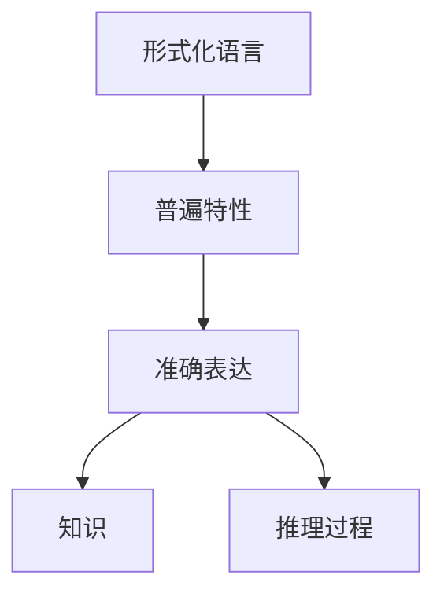
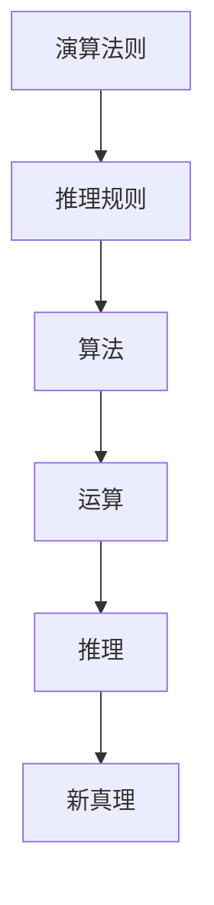
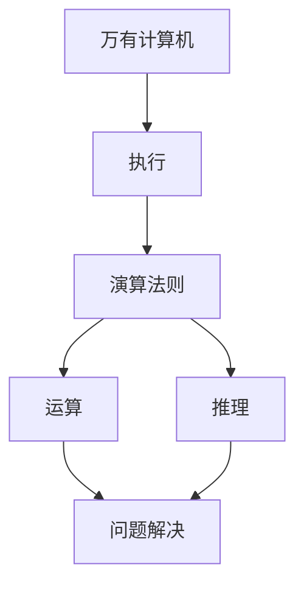
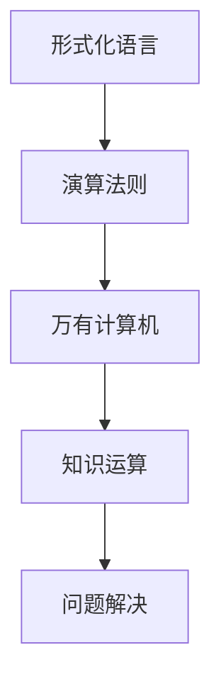

# 计算：第一部分 计算的诞生 第 3 章 莱布尼茨的计算之梦 思想的大衍术

作者：禅与计算机程序设计艺术 / Zen and the Art of Computer Programming

## 1. 背景介绍

### 1.1 问题的由来

在计算机科学的发展历程中，有一个人对其产生了深远影响，他就是哥特弗里德·威廉·莱布尼茨(Gottfried Wilhelm Leibniz)。作为一位博学多才的思想家、数学家和哲学家，莱布尼茨对计算机科学的发展做出了卓越贡献。他的"计算之梦"不仅孕育了现代计算机的雏形,更重要的是,他提出了一种全新的思维方式——"思想的大衍术"。

### 1.2 研究现状

莱布尼茨生于17世纪的欧洲,那个时代的科学家们正在努力探索自然界的奥秘。他们渴望找到一种普遍的语言和方法,来描述和解释世界上的一切现象。在这种背景下,莱布尼茨提出了"思想的大衍术"这一宏伟构想,试图建立一种能够表达和处理任何知识的形式化系统。

### 1.3 研究意义

莱布尼茨的"思想的大衍术"不仅为后来的符号逻辑和计算机科学奠定了基础,更重要的是,它体现了一种崭新的思维方式。这种思维方式强调形式化、系统化和自动化,为人类认识世界提供了全新的视角。正是基于这种思维方式,计算机科学才得以诞生和发展。

### 1.4 本文结构

本文将从以下几个方面深入探讨莱布尼茨的"计算之梦"和"思想的大衍术":

1. 核心概念与联系
2. 核心算法原理与具体操作步骤
3. 数学模型和公式详细讲解与举例说明
4. 项目实践:代码实例和详细解释说明
5. 实际应用场景
6. 工具和资源推荐
7. 总结:未来发展趋势与挑战
8. 附录:常见问题与解答

## 2. 核心概念与联系

莱布尼茨的"思想的大衍术"是一个宏大的理论体系,它包含了多个核心概念,这些概念相互关联,共同构成了这一理论的基础。

### 2.1 形式化语言

莱布尼茨认为,要实现"思想的大衍术",首先需要建立一种形式化的语言。这种语言应该具有严格的语法和语义,能够准确地表达任何知识和推理过程。他提出了一种被称为"普遍特性"(Characteristica Universalis)的形式语言,试图用它来描述世界上的一切事物和概念。

### 2.2 演算法则

除了形式化语言,莱布尼茨还提出了"演算法则"(Calculus Ratiocinator)的概念。这是一种基于形式化语言的推理规则和算法,能够对知识进行运算和推理。他设想,通过这种演算法则,人类可以像计算数字那样计算概念,从已知的真理推导出新的真理。

### 2.3 万有计算机

莱布尼茨还构想了一种被称为"万有计算机"(Calculus Universalis)的机器,它能够执行"演算法则"中的运算和推理。这个想法可以被视为现代计算机的雏形。他认为,如果能够建造这样一台机器,就可以通过机械化的方式解决任何问题。

### 2.4 概念之间的联系

这三个核心概念——形式化语言、演算法则和万有计算机——相互关联,共同构成了莱布尼茨"思想的大衍术"的理论基础。形式化语言为知识和推理提供了表达工具,演算法则提供了操作和推理的规则,而万有计算机则是实现这一切的机械装置。

通过这些概念的相互作用,莱布尼茨希望能够建立一种全新的思维方式,将人类的思考过程形式化、系统化和自动化,从而实现"思想的大衍术"的宏伟目标。

## 3. 核心算法原理与具体操作步骤

### 3.1 算法原理概述

莱布尼茨的"演算法则"可以被视为一种早期的算法理论。它试图将人类的推理过程形式化,并提供一种系统的方法来操作和推导知识。

"演算法则"的核心思想是将概念视为符号,并根据一定的规则对这些符号进行运算和推理。通过这种方式,人类可以像计算数字那样计算概念,从已知的真理推导出新的真理。

### 3.2 算法步骤详解

1. **建立形式化语言**

   首先,需要建立一种形式化的语言,用于表达知识和推理过程。这种语言应该具有严格的语法和语义,能够准确地描述任何概念和命题。

2. **符号化知识**

   将知识和概念用形式化语言中的符号表示。每个概念都被赋予一个唯一的符号,并且符号之间的关系也被明确定义。

3. **定义推理规则**

   确定一组推理规则,用于操作和组合这些符号。这些规则应该是精确的、一致的,并且能够保证推理的正确性。

4. **执行推理过程**

   根据推理规则,对符号进行运算和组合,从已知的真理出发,推导出新的结论。这个过程可以被视为一种算法,它遵循特定的步骤和规则,以达到预期的目标。

5. **验证结果**

   对推导出的结论进行验证,确保它们是正确的、一致的,并且符合已知的真理。

6. **迭代优化**

   根据验证结果,对形式化语言、符号表示和推理规则进行调整和优化,以提高推理过程的效率和准确性。

### 3.3 算法优缺点

**优点:**

1. **形式化和系统化**: 将知识和推理过程形式化和系统化,有利于提高推理的准确性和一致性。
2. **自动化**: 通过定义推理规则,可以实现自动化的推理过程,减轻人工推理的工作量。
3. **普遍性**: 理论上,这种方法可以应用于任何领域的知识和推理,具有很强的通用性。

**缺点:**

1. **复杂性**: 建立完整的形式化语言和推理规则系统是一项极其复杂的任务,需要大量的人力和时间投入。
2. **局限性**: 虽然理论上具有普遍性,但在实践中,很多领域的知识和推理过程难以完全形式化。
3. **验证困难**: 对于复杂的推理过程,验证结果的正确性和一致性是一个巨大的挑战。

### 3.4 算法应用领域

虽然莱布尼茨的"演算法则"理论本身并没有直接应用,但它为后来的符号逻辑、计算机科学和人工智能奠定了基础。以下是一些潜在的应用领域:

1. **形式化推理系统**: 在数理逻辑、自动定理证明等领域,可以借鉴"演算法则"的思想,建立形式化的推理系统。
2. **知识表示和推理**: 在人工智能领域,知识表示和自动推理是重要的研究方向,可以借鉴"演算法则"的理论基础。
3. **程序语言设计**: 程序语言的设计也需要形式化的语法和语义,可以从"演算法则"中汲取灵感。
4. **自动化推理工具**: 基于"演算法则"的理论,可以开发自动化的推理工具,用于辅助人类进行推理和决策。

## 4. 数学模型和公式详细讲解与举例说明

### 4.1 数学模型构建

为了更好地理解和应用"演算法则",我们可以构建一个简化的数学模型。在这个模型中,我们将使用一种形式化的语言来表示概念和命题,并定义一组推理规则来操作这些符号。

让我们定义一个集合 $\mathcal{C}$,它包含了所有可能的概念符号。每个概念符号都是一个独特的字符串,用来表示一个特定的概念。例如,`human`表示"人"这个概念,`animal`表示"动物"这个概念。

我们还定义一个集合 $\mathcal{P}$,它包含了所有可能的命题符号。每个命题符号都是一个由概念符号和逻辑运算符组成的表达式,用来表示一个特定的命题。例如,`human -> animal`表示"人是动物"这个命题。

推理过程可以被视为一个函数 $f: \mathcal{P} \rightarrow \mathcal{P}$,它根据一组推理规则,将一组已知的命题转换为一组新的命题。

### 4.2 公式推导过程

我们定义以下推理规则:

1. **模型公理规则**:
   $$
   \forall p \in \mathcal{P}, p \rightarrow p
   $$
   这个规则表示,任何命题都蕴含着它自身。

2. **推理规则**:
   $$
   \frac{p \rightarrow q, q \rightarrow r}{p \rightarrow r}
   $$
   这个规则表示,如果 $p$ 蕴含 $q$,而 $q$ 又蕴含 $r$,那么我们可以推导出 $p$ 蕴含 $r$。

3. **替换规则**:
   $$
   \frac{p \rightarrow q}{(p \rightarrow r) \rightarrow (q \rightarrow r)}
   $$
   这个规则表示,如果 $p$ 蕴含 $q$,那么对于任何命题 $r$,$(p \rightarrow r)$ 蕴含 $(q \rightarrow r)$。

通过这些规则,我们可以从一组已知的命题出发,推导出新的命题。例如,假设我们有以下已知命题:

$$
\begin{align*}
&p_1: \text{human} \rightarrow \text{animal} \
&p_2: \text{animal} \rightarrow \text{living}
\end{align*}
$$

我们可以按照以下步骤推导出一个新的命题:

$$
\begin{align*}
&\text{premise 1:} &&p_1: \text{human} \rightarrow \text{animal} \
&\text{premise 2:} &&p_2: \text{animal} \rightarrow \text{living} \
&\text{apply rule 2:} &&\frac{p_1, p_2}{\text{human} \rightarrow \text{living}} \
&\therefore &&\text{human} \rightarrow \text{living}
\end{align*}
$$

这个推导过程表明,如果"人是动物",而"动物是生物",那么我们可以推导出"人是生物"。

### 4.3 案例分析与讲解

为了更好地理解这个数学模型和推理过程,让我们来分析一个具体的案例。

假设我们有以下已知命题:

$$
\begin{align*}
&p_1: \text{programmer} \rightarrow \text{human} \
&p_2: \text{human} \rightarrow \text{animal} \
&p_3: \text{animal} \rightarrow \text{living}
\end{align*}
$$

我们想要推导出"程序员是生物"这个命题,即 `programmer -> living`。

首先,根据模型公理规则,我们可以得到:

$$
\begin{align*}
&p_1 \rightarrow p_1 \
&p_2 \rightarrow p_2 \
&p_3 \rightarrow p_3
\end{align*}
$$

接下来,我们应用推理规则 2:

$$
\begin{align*}
&\frac{p_1, p_2}{(\text{programmer}