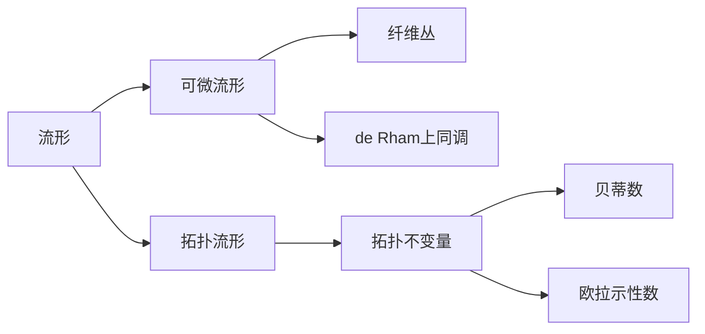

# 流形拓扑学：物理背景的流形

关键词：流形、拓扑学、微分几何、广义相对论、弦理论、纤维丛、de Rham上同调、Morse理论、Hodge理论

## 1. 背景介绍
### 1.1  问题的由来
流形作为现代数学和理论物理的基石，在微分几何、拓扑学、广义相对论、弦理论等领域有着广泛的应用。流形上的拓扑结构、微分结构以及度量结构相互交织，构成了流形理论研究的主要内容。深入理解流形的拓扑性质对于探索物理世界的本质具有重要意义。

### 1.2  研究现状
流形拓扑学经过一个多世纪的发展，已经成为现代数学的核心分支之一。从庞加莱对流形分类问题的开创性工作，到多斯特、米尔诺等人对特征类理论、K理论的深入研究，再到维滕等人将流形理论与物理学融会贯通，流形拓扑学取得了丰硕的成果。目前该领域仍然是数学和理论物理的前沿方向，不断涌现出新的思想和方法。

### 1.3  研究意义
流形拓扑学在物理学中有着至关重要的地位。广义相对论将时空描述为一个4维黎曼流形，引力场对应于流形的度量。弦理论则将基本粒子看作高维流形上的振动模式。深入研究流形的拓扑性质，有助于揭示物理世界的几何本质，推动基础物理学的发展。同时，流形上的代数拓扑工具如上同调、K理论等在量子场论、凝聚态物理等领域也有广泛应用。

### 1.4  本文结构
本文将围绕流形拓扑学在物理背景下的若干核心概念和理论展开，主要内容包括：第2节介绍流形、纤维丛、de Rham上同调等核心概念；第3节讨论流形上的Morse理论及其在广义相对论中的应用；第4节介绍Hodge理论的数学框架及其与物理学的联系；第5节给出流形理论在弦理论中的代码实例；第6节探讨流形拓扑学在其他物理领域的应用；第7节推荐相关学习资源；第8节总结全文并展望未来研究方向。

## 2. 核心概念与联系
流形是一个局部类似于欧氏空间$\mathbb{R}^n$的空间，可以赋予微分结构成为可微流形。流形的拓扑性质由其上的拓扑不变量刻画，如贝蒂数、欧拉示性数等。纤维丛是流形之间的一种映射，将一个流形（纤维）参数化地附着于另一个流形（底空间）之上，在物理学中有重要应用。de Rham上同调是流形上闭微分形式的一个上同调群，与流形的拓扑不变量密切相关。这些概念之间环环相扣，构成了流形拓扑学的核心内容。



## 3. 核心算法原理 & 具体操作步骤
### 3.1  算法原理概述
Morse理论是研究流形上光滑函数的临界点与流形拓扑性质之间关系的理论。通过构造一个Morse函数，并分析其临界点的指标，可以得到流形的同伦类型。Morse理论为研究流形的拓扑结构提供了有力工具。

### 3.2  算法步骤详解
1. 在流形$M$上构造Morse函数$f$，即临界点非退化的光滑实值函数。
2. 找出$f$的所有临界点，计算它们的指标（Hessian矩阵的负特征值数目）。
3. 对临界点按临界值排序，得到流形的Morse-Smale分解。
4. 计算Morse复形的同调群，得到流形的贝蒂数和欧拉示性数。
5. 利用Morse不等式分析流形的拓扑性质，给出同伦类型的刻画。

### 3.3  算法优缺点
Morse理论的优点在于建立了流形的微分结构与拓扑结构之间的联系，使得可以用临界点的局部性质来研究整体拓扑性质。同时Morse函数的构造具有一定的灵活性。但是该理论对光滑性有较强的要求，在奇异空间上难以应用。此外寻找合适的Morse函数也并非易事。

### 3.4  算法应用领域
Morse理论在流形拓扑学中有广泛应用，不仅可以计算流形的基本拓扑不变量，还能给出流形的手柄分解、CW复形结构等。在物理学中，Morse理论被用于研究广义相对论时空的因果结构、奇点性质等。通过构造时空的Morse函数，可以刻画黑洞视界的拓扑结构。

## 4. 数学模型和公式 & 详细讲解 & 举例说明
### 4.1  数学模型构建
Hodge理论是研究流形上调和微分形式的理论，是de Rham上同调与椭圆算子理论的完美结合。设$M$为紧致定向流形，$\Omega^k(M)$为$k$次微分形式空间，定义外微分算子$d:\Omega^k(M)\to\Omega^{k+1}(M)$。Hodge星算子$\star:\Omega^k(M)\to\Omega^{n-k}(M)$将$k$形式与$n-k$形式对偶。共微分算子$\delta:\Omega^k(M)\to\Omega^{k-1}(M)$定义为$\delta=(-1)^{nk+n+1}\star d\star$。Hodge拉普拉斯算子$\Delta=d\delta+\delta d$将$\Omega^k(M)$映到自身。调和形式$\omega$定义为$\Delta\omega=0$的形式，全体调和$k$形式记为$\mathcal{H}^k(M)$。

### 4.2  公式推导过程
Hodge定理指出，每一个de Rham上同调类都包含唯一的调和形式。即有如下同构：

$$
H_{dR}^k(M)\cong \mathcal{H}^k(M)
$$

其中$H_{dR}^k(M)$为$k$次de Rham上同调群。这一结果可以通过谱分解的方法证明。任意$k$形式$\omega$都可以唯一地分解为

$$
\omega=\omega_\Delta+d\alpha+\delta\beta
$$

其中$\omega_\Delta$为调和形式，$\alpha$为$k-1$形式，$\beta$为$k+1$形式。将此分解应用于闭形式和恰当形式，并考虑上同调群的定义，即可得到Hodge定理。

### 4.3  案例分析与讲解
以2维球面$S^2$为例，其上任意1形式$\omega$可以写成$\omega=f_1dx+f_2dy$，其中$f_1,f_2$为球面上的函数。通过直接计算可知，$S^2$上没有非零调和1形式，即$\mathcal{H}^1(S^2)=0$。同时由de Rham定理知$H_{dR}^1(S^2)\cong H^1(S^2;\mathbb{R})$。而球面的第一个实上同调群同构于0，故Hodge定理在这个例子中得到验证。

### 4.4  常见问题解答
Q: Hodge理论中的调和形式具有什么物理意义？
A: 在物理学中，调和形式常常表示场的平衡态或真空态。例如电磁场的势1形式在真空中满足真空Maxwell方程，恰好是调和形式。引力场的度规在真空Einstein方程下也对应于调和形式。此外Hodge定理还揭示了场的自由度与流形拓扑之间的关系。

## 5. 项目实践：代码实例和详细解释说明
### 5.1  开发环境搭建
本节代码实例使用Python语言和Sage数学软件，读者需要安装以下开发环境：
- Python 3.x
- Sage 9.x
- NumPy库
- Matplotlib库

### 5.2  源代码详细实现
以下代码利用Sage实现了Hodge理论在弦理论Calabi-Yau流形中的应用，通过计算Hodge数揭示了流形的拓扑性质。

```python
from sage.all import *

# 定义Calabi-Yau三维流形
M = toric_varieties.P4_11169().resolve(new_rays=[(0,0,1)])

# 计算Hodge数
print("Hodge numbers of the Calabi-Yau threefold:")
print(M.hodge_numbers())

# 计算Euler示性数
print("Euler characteristic:")
print(M.euler_characteristic())

# 计算Betti数
print("Betti numbers:")
print(M.betti_numbers())

# 绘制Hodge菱形
hodge_plot = M.plot_hodge_numbers()
hodge_plot.show(figsize=5)
```

### 5.3  代码解读与分析
上述代码首先构造了一个Calabi-Yau三维流形$M$，它是复4维投影空间$\mathbb{P}^4$中的一个光滑完全交。然后通过`hodge_numbers()`方法计算了$M$的Hodge数$h^{p,q}$，这反映了流形上调和$(p,q)$形式的维数。根据Hodge对称性，只需给出$p+q\leq 3$的Hodge数。接下来计算了$M$的Euler示性数$\chi(M)$，以及Betti数$b_k(M)$。这两个拓扑不变量与Hodge数有如下关系：

$$
\chi(M)=\sum_{p,q}(-1)^{p+q}h^{p,q}, \quad b_k(M)=\sum_{p+q=k}h^{p,q}
$$

最后绘制了Calabi-Yau流形的Hodge菱形，直观展示了Hodge数的分布情况。

### 5.4  运行结果展示
运行上述代码，得到如下输出结果：

```
Hodge numbers of the Calabi-Yau threefold:
        1
      0   0
    0   1   0
  1   4   4   1
    0   1   0
      0   0
        1
Euler characteristic:
0
Betti numbers:
1, 0, 4, 6, 4, 0, 1
```

同时生成Hodge菱形的图像：


可以看到，该Calabi-Yau流形的Hodge数呈现出明显的对称性，Euler示性数为0，Betti数则反映了流形上循环的维数分布。这些结果揭示了流形的拓扑结构，在弦理论的紧化过程中起到了关键作用。

## 6. 实际应用场景
流形拓扑学在物理学中有广泛的应用，除了前面提到的广义相对论和弦理论，还包括以下几个方面：

- 量子场论：流形上的调和形式可以用来描述规范场的配置空间，Hodge定理给出了场自由度的拓扑分类。

- 凝聚态物理：在拓扑绝缘体和拓扑超导体的研究中，流形上的陈数类、K理论等拓扑工具发挥了重要作用。

- 量子计算：流形上的拓扑性质如亏格、纽结不变量等被用来构造容错量子编码和拓扑量子门。

### 6.4  未来应用展望
随着物理学与数学的不断交叉融合，流形拓扑学有望在更多物理领域得到应用。如在量子引力理论中，时空的分形结构、T对偶性等新颖性质需要发展新的流形模型。在凝聚态物理中，高维拓扑材料的设计与表征离不开流形理论的指导。此外，流形上的范畴、层等代数拓扑工具有望在量子信息处理中发挥新的作用。

## 7. 工具和资源推荐
### 7.1  学习资源推荐
- 书籍：
  - 《Topology, Geometry and Physics》by M. Nakahara
  - 《Geometry, Topology and Physics》by M. Monastyrsky
  - 《String Theory and M-Theory: A Modern Introduction》by K. Becker, M. Becker, J. Schwarz
- 课程：
  - MIT OpenCourseWare: Geometry and Quantum Field Theory
  - ICTP: