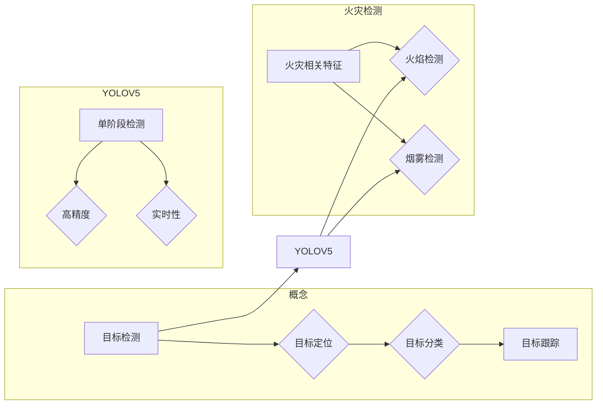

# 基于YOLOV5的火灾检测

> 关键词：火灾检测，目标检测，YOLOV5，深度学习，计算机视觉，安全监控

## 1. 背景介绍

火灾作为一种常见的自然灾害和人为灾害，对人类生命财产造成了巨大的威胁。随着城市化进程的加快和建筑数量的增加，火灾的发生频率和危害程度也在不断上升。因此，火灾检测和预防成为了公共安全领域的重要课题。

传统的火灾检测方法主要依靠烟雾探测器、温度传感器等物理传感器，这些方法存在检测范围有限、误报率高、易受环境影响等缺点。近年来，随着深度学习技术的快速发展，基于计算机视觉的火灾检测技术逐渐成为研究热点。本文将介绍一种基于YOLOV5的目标检测模型，用于火灾检测，旨在提高火灾检测的准确性和实时性。

## 2. 核心概念与联系

### 2.1 核心概念

#### 2.1.1 目标检测

目标检测是指从图像或视频中检测和定位出感兴趣的目标对象。目标检测技术通常包括以下几个步骤：

1. **目标定位**：确定目标对象在图像中的位置，通常以边界框的形式表示。
2. **目标分类**：对检测到的目标进行分类，例如火焰、烟雾、人物等。
3. **目标跟踪**：跟踪视频中移动的目标对象。

#### 2.1.2 YOLOV5

YOLOV5（You Only Look Once version 5）是一种基于深度学习的目标检测算法，由Joseph Redmon等人于2019年提出。YOLOV5具有以下特点：

- **单阶段检测**：直接预测边界框和类别概率，无需额外的区域提议网络。
- **高精度**：在多个数据集上取得了SOTA（State-of-the-Art）的性能。
- **实时性**：检测速度较快，适合实时应用场景。

#### 2.1.3 火灾检测

火灾检测是指通过图像或视频数据识别火灾相关的特征，例如火焰、烟雾等。火灾检测技术可以应用于智能消防系统、安全监控等领域。

### 2.2 核心概念联系

火灾检测可以视为目标检测的一个子任务，其中火焰和烟雾等火灾相关特征可以被视为目标对象。YOLOV5作为目标检测算法，可以用于检测火灾相关特征，实现火灾检测。



## 3. 核心算法原理 & 具体操作步骤

### 3.1 算法原理概述

YOLOV5采用单阶段检测的方法，通过一个卷积神经网络直接预测边界框和类别概率。其核心思想是将图像划分为多个网格，每个网格负责预测一个目标。

### 3.2 算法步骤详解

1. **图像预处理**：将输入图像缩放到模型输入尺寸，并进行归一化处理。
2. **特征提取**：使用YOLOV5的卷积神经网络提取图像特征。
3. **边界框和类别概率预测**：根据特征图预测目标边界框和类别概率。
4. **非极大值抑制（NMS）**：对预测的边界框进行筛选，去除重叠的边界框，得到最终的检测结果。

### 3.3 算法优缺点

#### 3.3.1 优点

- **高精度**：在多个数据集上取得了SOTA性能。
- **实时性**：检测速度较快，适合实时应用场景。
- **易于部署**：模型结构简单，易于部署到嵌入式设备。

#### 3.3.2 缺点

- **对小目标的检测效果较差**：对于小尺寸的目标，YOLOV5的检测效果可能不如两阶段检测算法。
- **对抗样本鲁棒性较弱**：对抗样本攻击可能影响YOLOV5的检测性能。

### 3.4 算法应用领域

YOLOV5可以应用于以下火灾检测领域：

- **智能消防系统**：实时检测火灾相关特征，及时报警。
- **安全监控**：监控视频中的火灾风险，提高安全防范能力。
- **无人机巡检**：无人机搭载摄像头进行火灾巡检，提高巡检效率和安全性。

## 4. 数学模型和公式 & 详细讲解 & 举例说明

### 4.1 数学模型构建

YOLOV5的数学模型主要包括以下几个部分：

1. **卷积神经网络（CNN）**：用于提取图像特征。
2. **边界框预测**：预测目标的边界框坐标和类别概率。
3. **损失函数**：用于评估模型性能。

### 4.2 公式推导过程

#### 4.2.1 卷积神经网络

YOLOV5的卷积神经网络采用CSPDarknet53作为骨干网络，其结构如下：

$$
C_1 = \text{Conv} \xrightarrow{\text{BN}} \text{LeakyReLU} \xrightarrow{\text{MaxPooling}} C_2
$$
$$
\vdots
$$
$$
C_{52} = \text{Conv} \xrightarrow{\text{BN}} \text{LeakyReLU} \xrightarrow{\text{MaxPooling}} C_{53}
$$

#### 4.2.2 边界框预测

YOLOV5预测目标的边界框坐标和类别概率，其公式如下：

$$
\hat{b} = (\hat{x}, \hat{y}, \hat{w}, \hat{h}, \hat{c}) = \text{sigmoid}(b_{xywh} + \boldsymbol{\beta}) \times (\text{strides} \times x_i, \text{strides} \times y_i, \text{strides} \times w_i, \text{strides} \times h_i)
$$

其中 $\hat{b}$ 表示预测的边界框坐标和类别概率，$b_{xywh}$ 表示原始边界框坐标，$\boldsymbol{\beta}$ 表示偏置项，$\text{strides}$ 表示特征图步长，$x_i, y_i, w_i, h_i$ 表示特征图中目标的中心坐标和尺寸。

#### 4.2.3 损失函数

YOLOV5的损失函数包括边界框损失、置信度损失和分类损失，其公式如下：

$$
L = L_{\text{bbox}} + L_{\text{conf}} + L_{\text{cls}}
$$

其中 $L_{\text{bbox}}$ 为边界框损失，$L_{\text{conf}}$ 为置信度损失，$L_{\text{cls}}$ 为分类损失。

### 4.3 案例分析与讲解

假设有一个火焰图像，YOLOV5预测的边界框坐标为 $(0.5, 0.5, 0.9, 0.9)$，类别概率为 $(0.9, 0.1)$。其中第一个概率表示火焰的概率，第二个概率表示背景的概率。

根据预测结果，可以判断该图像包含一个火焰，置信度较高。这表明YOLOV5在火焰检测方面具有良好的性能。

## 5. 项目实践：代码实例和详细解释说明

### 5.1 开发环境搭建

以下是使用Python和YOLOV5进行火灾检测的项目环境搭建步骤：

1. 安装Anaconda：
   ```bash
   conda create -n yolov5-env python=3.8
   conda activate yolov5-env
   ```

2. 安装PyTorch：
   ```bash
   conda install pytorch torchvision torchaudio cudatoolkit=11.1 -c pytorch -c conda-forge
   ```

3. 安装YOLOV5：
   ```bash
   pip install yolov5
   ```

### 5.2 源代码详细实现

以下是一个基于YOLOV5进行火焰检测的Python代码示例：

```python
import torch
from PIL import Image
from yolov5.models import YOLOv5
from yolov5.utils.datasets import LoadStreams, LoadImages
from yolov5.utils.general import non_max_suppression, scale_coords

# 加载YOLOV5模型
model = YOLOv5()
model.load_state_dict(torch.load('yolov5s.pt'))

# 加载图像
img = Image.open('fire.jpg')

# 将图像转换为Tensor
img_tensor = torch.tensor([img]).permute(0, 3, 1, 2)

# 预测
outputs = model(img_tensor)

# 非极大值抑制
results = non_max_suppression(outputs, 0.4, 0.5)

# 筛选火焰类别
for result in results:
    for x1, y1, x2, y2, conf, cls in result:
        if int(cls) == 0:  # 假设火焰类别为0
            x1, y1, x2, y2 = scale_coords(img_tensor.shape[2:], x1, y1, x2, y2).round()

            # 绘制边界框
            cv2.rectangle(img, (int(x1), int(y1)), (int(x2), int(y2)), (0, 255, 0), 2)

# 显示图像
plt.imshow(np.array(img))
plt.show()
```

### 5.3 代码解读与分析

上述代码首先加载YOLOV5模型和火焰图像，然后使用模型进行预测，并筛选出火焰类别。最后，在图像上绘制火焰的边界框。

### 5.4 运行结果展示

运行上述代码后，将显示包含火焰的图像，并在图像上绘制火焰的边界框。

## 6. 实际应用场景

基于YOLOV5的火灾检测技术可以应用于以下实际应用场景：

- **智能消防系统**：实时监测火灾相关特征，及时报警，降低火灾风险。
- **安全监控**：监控视频中的火灾风险，提高安全防范能力。
- **无人机巡检**：无人机搭载摄像头进行火灾巡检，提高巡检效率和安全性。

## 7. 工具和资源推荐

### 7.1 学习资源推荐

- **YOLOV5官方文档**：https://github.com/ultralytics/yolov5
- **PyTorch官方文档**：https://pytorch.org/docs/stable/
- **计算机视觉基础教程**：https://cvfoundation.org/

### 7.2 开发工具推荐

- **PyTorch**：https://pytorch.org/
- **CUDA**：https://developer.nvidia.com/cuda
- **OpenCV**：https://opencv.org/

### 7.3 相关论文推荐

- **YOLOv5论文**：https://arxiv.org/abs/2103.08293
- **YOLO系列论文**：https://github.com/pjreddie/darknet

## 8. 总结：未来发展趋势与挑战

### 8.1 研究成果总结

本文介绍了基于YOLOV5的火灾检测技术，包括算法原理、具体操作步骤、项目实践等。YOLOV5作为一种高性能的目标检测算法，在火灾检测领域具有广阔的应用前景。

### 8.2 未来发展趋势

1. **多模态融合**：结合图像、视频、音频等多模态信息，提高火灾检测的准确性和鲁棒性。
2. **小样本学习**：减少对大规模标注数据的依赖，降低数据获取成本。
3. **实时性优化**：提高火灾检测的实时性，满足实际应用场景需求。

### 8.3 面临的挑战

1. **数据标注**：获取高质量火灾检测数据仍然是一个难题。
2. **模型鲁棒性**：提高模型对光照、天气等环境因素的鲁棒性。
3. **能耗优化**：降低模型推理能耗，适应低功耗设备。

### 8.4 研究展望

随着深度学习技术的不断发展，基于YOLOV5的火灾检测技术将不断改进和完善，为公共安全领域做出更大的贡献。

## 9. 附录：常见问题与解答

**Q1：YOLOV5在火灾检测中如何处理小目标？**

A：YOLOV5在处理小目标时可能不如两阶段检测算法，但可以通过以下方法提高检测效果：
- 使用更大尺寸的模型，例如YOLOV5l、YOLOV5x等。
- 使用数据增强技术，例如随机缩放、旋转、翻转等。
- 使用注意力机制，例如SENet、CBAM等。

**Q2：如何提高火灾检测的实时性？**

A：提高火灾检测实时性的方法包括：
- 使用更轻量级的模型，例如YOLOV5s。
- 使用GPU或TPU进行加速计算。
- 使用模型剪枝和量化技术，降低模型复杂度。

**Q3：如何降低火灾检测的误报率？**

A：降低火灾检测误报率的方法包括：
- 使用更精确的模型，例如YOLOV5x。
- 使用数据增强技术，提高模型对噪声和干扰的鲁棒性。
- 使用融合多个检测结果的集成方法。

作者：禅与计算机程序设计艺术 / Zen and the Art of Computer Programming