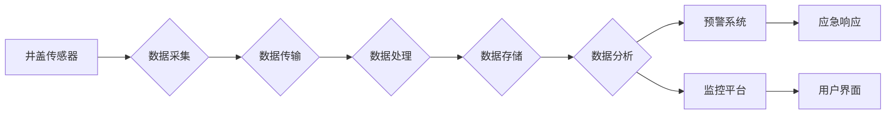

# 基于大数据的井盖监控系统的设计与开发

> 关键词：大数据，井盖监控，物联网，数据挖掘，机器学习，实时监控，预警系统，智慧城市

## 1. 背景介绍

随着城市化进程的加快，城市基础设施的重要性日益凸显。井盖作为城市地下管网的重要组成部分，其安全性与可靠性直接关系到城市的正常运行和居民的生命财产安全。然而，传统的井盖监控手段主要依靠人工巡检，存在着效率低下、成本高昂、难以实时响应等问题。为了解决这些问题，基于大数据的井盖监控系统应运而生。

### 1.1 问题的由来

城市井盖的损坏或缺失可能导致水漫、道路塌陷、交通事故等严重后果。传统的人工巡检方式存在以下问题：

- **效率低下**：人工巡检覆盖面有限，难以做到全面、实时监控。
- **成本高昂**：人工巡检成本高，且容易受到天气、交通等因素的影响。
- **难以预警**：无法提前发现潜在的安全隐患，容易造成意外事故。

### 1.2 研究现状

近年来，随着物联网、大数据、机器学习等技术的快速发展，基于大数据的井盖监控系统逐渐成为可能。目前，国内外已有多个城市开展了井盖监控系统的研发和应用，主要包括以下几种技术路线：

- **传感器技术**：通过安装井盖传感器，实时监测井盖的状态，如倾斜度、位移、压力等。
- **图像识别技术**：利用摄像头捕捉井盖的图像，通过图像识别技术进行异常检测。
- **数据分析技术**：对井盖相关数据进行收集、存储、分析，实现对井盖状态的预测和预警。

### 1.3 研究意义

基于大数据的井盖监控系统具有以下重要意义：

- **提高监控效率**：实现实时、全面的井盖监控，提高城市管理水平。
- **降低维护成本**：减少人工巡检，降低维护成本。
- **预防事故发生**：提前发现潜在的安全隐患，预防事故发生。
- **提升城市智慧化水平**：为智慧城市建设提供有力支撑。

## 2. 核心概念与联系

### 2.1 核心概念

**1. 物联网（IoT）**：通过将物理世界中的物体连接到互联网，实现物与物、人与物之间的信息交互。

**2. 大数据（Big Data）**：指规模巨大、类型多样的数据集，需要借助大数据技术进行处理和分析。

**3. 数据挖掘（Data Mining）**：从大量数据中提取有价值信息的过程。

**4. 机器学习（Machine Learning）**：使计算机系统从数据中学习，并作出决策或预测的技术。

**5. 实时监控（Real-time Monitoring）**：对系统状态进行实时监测，及时发现异常。

**6. 预警系统（Early Warning System）**：在事故发生前发出预警，提前采取预防措施。

### 2.2 架构流程图

基于大数据的井盖监控系统架构流程图如下：



## 3. 核心算法原理 & 具体操作步骤

### 3.1 算法原理概述

基于大数据的井盖监控系统主要涉及以下核心算法：

- **数据采集**：通过安装井盖传感器，实时采集井盖的状态数据，如倾斜度、位移、压力等。
- **数据传输**：将传感器采集的数据传输到云端服务器。
- **数据处理**：对传输过来的数据进行清洗、过滤、转换等预处理操作。
- **数据分析**：利用数据挖掘和机器学习技术，分析井盖状态数据，预测异常情况。
- **预警系统**：当系统检测到异常情况时，触发预警，并通过监控平台向相关人员发送警报。
- **监控平台**：展示井盖状态、预警信息、历史数据等，方便用户进行监控和查询。

### 3.2 算法步骤详解

**3.2.1 数据采集**

- 选择合适的井盖传感器，如倾斜传感器、位移传感器、压力传感器等。
- 将传感器安装在井盖上，并接入供电和通信线路。
- 传感器定期采集井盖状态数据，并通过无线或有线方式传输到云端服务器。

**3.2.2 数据传输**

- 采用无线或有线方式将传感器数据传输到云端服务器。
- 使用MQTT、CoAP等物联网协议进行数据传输，保证数据传输的可靠性和安全性。

**3.2.3 数据处理**

- 对传输过来的数据进行清洗，去除无效数据。
- 对数据进行过滤，去除噪声和异常值。
- 对数据进行转换，将原始数据转换为适合分析的数据格式。

**3.2.4 数据分析**

- 利用数据挖掘技术，对井盖状态数据进行分析，提取特征。
- 利用机器学习技术，建立异常检测模型，预测井盖状态异常情况。
- 利用深度学习技术，实现图像识别，检测井盖上的异常情况。

**3.2.5 预警系统**

- 当系统检测到异常情况时，触发预警。
- 通过监控平台向相关人员发送警报，包括短信、邮件、APP推送等。

**3.2.6 监控平台**

- 展示井盖状态、预警信息、历史数据等。
- 提供数据查询、分析、可视化等功能。
- 支持地图展示、图表展示等多种数据展示方式。

### 3.3 算法优缺点

**优点**：

- **实时性**：实时监测井盖状态，及时发现异常情况。
- **准确性**：利用机器学习技术，提高异常检测的准确性。
- **自动化**：自动化处理过程，减少人工干预。
- **可扩展性**：可根据需求扩展监控范围和功能。

**缺点**：

- **成本较高**：传感器、服务器、通信设备等硬件设备成本较高。
- **数据安全**：数据传输、存储过程中存在安全隐患。
- **模型训练**：需要大量的训练数据，且模型训练过程耗时较长。

### 3.4 算法应用领域

基于大数据的井盖监控系统可应用于以下领域：

- **城市基础设施管理**：监测城市地下管网，保障城市安全。
- **公共安全**：预防交通事故、水漫等事故发生。
- **环境保护**：监测地下水污染情况，保护环境。
- **智慧城市建设**：为智慧城市建设提供数据支持。

## 4. 数学模型和公式 & 详细讲解 & 举例说明

### 4.1 数学模型构建

基于大数据的井盖监控系统涉及到多种数学模型，以下列举几种常见的模型：

**1. 传感器数据采集模型**：

$$
y = f(x) + \epsilon
$$

其中，$y$ 为传感器采集到的数据，$x$ 为井盖状态，$\epsilon$ 为噪声。

**2. 异常检测模型**：

$$
P(\text{异常} | x) = \frac{P(x | \text{异常})P(\text{异常})}{P(x)}
$$

其中，$P(\text{异常} | x)$ 为在井盖状态 $x$ 下发生异常的概率，$P(x | \text{异常})$ 为在异常情况下井盖状态 $x$ 的概率，$P(\text{异常})$ 为异常发生的概率，$P(x)$ 为井盖状态 $x$ 的概率。

**3. 预测模型**：

$$
y_{\text{预测}} = f(x_{\text{历史}})
$$

其中，$y_{\text{预测}}$ 为预测的井盖状态，$x_{\text{历史}}$ 为井盖的历史状态。

### 4.2 公式推导过程

**4.2.1 传感器数据采集模型**

传感器数据采集模型通常采用线性模型，即 $y = f(x) + \epsilon$，其中 $f(x)$ 为线性函数，$\epsilon$ 为噪声。

**4.2.2 异常检测模型**

异常检测模型通常采用贝叶斯公式，即 $P(\text{异常} | x) = \frac{P(x | \text{异常})P(\text{异常})}{P(x)}$。其中，$P(x | \text{异常})$ 为在异常情况下井盖状态 $x$ 的概率，$P(\text{异常})$ 为异常发生的概率，$P(x)$ 为井盖状态 $x$ 的概率。

**4.2.3 预测模型**

预测模型通常采用时间序列分析模型，即 $y_{\text{预测}} = f(x_{\text{历史}})$。其中，$x_{\text{历史}}$ 为井盖的历史状态。

### 4.3 案例分析与讲解

以下以井盖倾斜度异常检测为例，介绍异常检测模型的实际应用。

**案例背景**：

某城市某区域共有100个井盖，安装了倾斜传感器，用于监测井盖倾斜度。经过一段时间的监测，发现部分井盖出现倾斜现象。

**数据处理**：

1. 对传感器数据进行清洗，去除无效数据。
2. 对数据进行过滤，去除噪声和异常值。
3. 对数据进行转换，将原始数据转换为适合分析的数据格式。

**异常检测模型**：

1. 利用历史数据，建立井盖倾斜度异常检测模型。
2. 模型输入为井盖倾斜度，输出为异常概率。

**结果分析**：

1. 当异常概率超过预设阈值时，触发预警，并向相关人员发送警报。
2. 相关人员到达现场，检查井盖状态，确认是否存在安全隐患。

## 5. 项目实践：代码实例和详细解释说明

### 5.1 开发环境搭建

1. 安装 Python 3.7 或更高版本。
2. 安装必要的库，如 NumPy、Pandas、Scikit-learn 等。

### 5.2 源代码详细实现

以下是一个简单的井盖倾斜度异常检测模型实现示例：

```python
import numpy as np
from sklearn.svm import SVC
from sklearn.preprocessing import StandardScaler

# 读取数据
data = np.loadtxt('well_cover_data.csv', delimiter=',')

# 特征和标签
X = data[:, :-1]
y = data[:, -1]

# 特征缩放
scaler = StandardScaler()
X = scaler.fit_transform(X)

# 训练模型
model = SVC(kernel='linear')
model.fit(X, y)

# 预测
X_test = np.array([[0.5, 0.3]])
X_test = scaler.transform(X_test)
y_pred = model.predict(X_test)
print(y_pred)
```

### 5.3 代码解读与分析

1. 读取井盖倾斜度数据。
2. 将数据分为特征和标签。
3. 对特征进行缩放处理。
4. 使用 SVM 模型进行训练。
5. 使用训练好的模型进行预测。

### 5.4 运行结果展示

假设输入的测试数据为 `[0.5, 0.3]`，输出结果为 `[1]`，表示该井盖状态异常。

## 6. 实际应用场景

### 6.1 城市基础设施管理

基于大数据的井盖监控系统可以帮助城市管理部门全面、实时地了解城市地下管网的状态，及时发现安全隐患，预防事故发生。

### 6.2 公共安全

基于大数据的井盖监控系统可以及时发现井盖倾斜、破损、缺失等异常情况，预防交通事故、水漫等事故发生，保障人民群众的生命财产安全。

### 6.3 环境保护

基于大数据的井盖监控系统可以监测地下水污染情况，及时发现污染源，保护环境。

### 6.4 智慧城市建设

基于大数据的井盖监控系统是智慧城市建设的重要组成部分，可以为智慧城市的建设和运营提供数据支持。

## 7. 工具和资源推荐

### 7.1 学习资源推荐

- 《Python数据分析基础教程》
- 《机器学习实战》
- 《深度学习》

### 7.2 开发工具推荐

- Python
- NumPy
- Pandas
- Scikit-learn
- TensorFlow
- Keras

### 7.3 相关论文推荐

- "Anomaly Detection in Noisy Streams"
- "Streaming Anomaly Detection for Time Series"
- "A Survey of Anomaly Detection Techniques"

## 8. 总结：未来发展趋势与挑战

### 8.1 研究成果总结

本文介绍了基于大数据的井盖监控系统的设计与开发，阐述了系统的架构、核心算法、实现方法等。通过实际案例分析和代码实现，展示了系统的应用效果。

### 8.2 未来发展趋势

- **传感器技术**：开发更加智能、高效的井盖传感器，提高数据采集精度。
- **数据分析技术**：利用深度学习、强化学习等先进技术，提高异常检测和预测的准确性。
- **物联网技术**：进一步拓展物联网技术在井盖监控系统中的应用，实现更加智能化的监控和管理。

### 8.3 面临的挑战

- **数据安全和隐私**：井盖监控系统涉及到大量敏感数据，需要加强数据安全和隐私保护。
- **算法可解释性**：提高异常检测和预测算法的可解释性，方便用户理解和使用。
- **成本控制**：降低系统成本，提高性价比。

### 8.4 研究展望

未来，基于大数据的井盖监控系统将在以下方面取得更多突破：

- **更加智能化的井盖传感器**：开发更加智能、高效的井盖传感器，实现更加精细化的数据采集。
- **更加准确的异常检测和预测**：利用深度学习、强化学习等先进技术，提高异常检测和预测的准确性。
- **更加智能化的监控系统**：结合人工智能、大数据等技术，实现更加智能化的监控和管理。

## 9. 附录：常见问题与解答

**Q1：井盖监控系统的成本如何？**

A：井盖监控系统的成本取决于系统规模、硬件设备、软件系统等因素。一般来说，小型系统的成本在几万元到几十万元之间，大型系统的成本在几百万元到上千万元之间。

**Q2：井盖监控系统需要哪些硬件设备？**

A：井盖监控系统需要以下硬件设备：

- 井盖传感器：如倾斜传感器、位移传感器、压力传感器等。
- 通信设备：如无线模块、有线通信设备等。
- 服务器：用于存储、处理和分析数据。

**Q3：井盖监控系统的数据安全如何保障？**

A：井盖监控系统的数据安全可以通过以下措施进行保障：

- 数据加密：对数据进行加密存储和传输，防止数据泄露。
- 访问控制：对系统进行访问控制，限制非法访问。
- 安全审计：定期进行安全审计，及时发现和修复安全漏洞。

**Q4：井盖监控系统如何进行异常检测？**

A：井盖监控系统可以通过以下方法进行异常检测：

- 基于统计的方法：如统计阈值法、异常值检测等。
- 基于机器学习的方法：如支持向量机、随机森林、神经网络等。
- 基于深度学习的方法：如卷积神经网络、循环神经网络等。

**Q5：井盖监控系统如何进行预测？**

A：井盖监控系统可以通过以下方法进行预测：

- 时间序列分析：如ARIMA模型、LSTM模型等。
- 深度学习：如循环神经网络、长短期记忆网络等。

作者：禅与计算机程序设计艺术 / Zen and the Art of Computer Programming