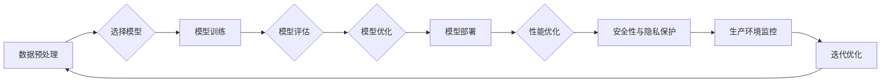

# 大模型应用开发的技术细节

> 关键词：大模型，应用开发，技术栈，模型评估，部署，可扩展性，性能优化，安全性与隐私保护

## 1. 背景介绍

随着深度学习技术的迅猛发展，大模型（Large Models）在各个领域展现出惊人的性能。大模型具备处理海量数据、理解复杂模式和生成高质量内容的能力，成为了推动人工智能应用创新的重要动力。然而，大模型的应用开发并非易事，它涉及到技术栈的选择、模型评估、部署、可扩展性、性能优化、安全性与隐私保护等多个方面。本文将深入探讨大模型应用开发的技术细节，为开发者提供全面的技术指导。

## 2. 核心概念与联系

### 2.1 大模型

大模型是指那些拥有海量参数和训练数据，能够在特定领域或任务上达到或超越人类水平的人工智能模型。大模型通常基于深度学习技术，如神经网络、卷积神经网络、循环神经网络等。

### 2.2 技术栈

大模型应用开发涉及的技术栈包括：

- **数据预处理**：包括数据清洗、数据标注、数据增强等，以确保模型训练的数据质量和多样性。
- **深度学习框架**：如TensorFlow、PyTorch等，用于构建和训练模型。
- **模型评估**：评估模型在未知数据上的性能，包括准确率、召回率、F1分数等指标。
- **模型部署**：将训练好的模型部署到生产环境，以便进行实际应用。
- **性能优化**：通过各种技术提高模型的推理速度和效率。
- **安全性与隐私保护**：确保模型应用的安全性，防止数据泄露和滥用。

### 2.3 Mermaid 流程图



## 3. 核心算法原理 & 具体操作步骤

### 3.1 算法原理概述

大模型应用开发的核心算法包括：

- **深度学习模型**：通过神经网络学习数据的特征和模式。
- **优化算法**：如Adam、SGD等，用于模型参数的优化。
- **模型评估指标**：如准确率、召回率、F1分数等，用于评估模型性能。

### 3.2 算法步骤详解

1. **数据预处理**：清洗数据，去除噪声，进行数据增强。
2. **模型选择**：根据任务需求选择合适的模型架构。
3. **模型训练**：使用训练数据训练模型。
4. **模型评估**：使用验证数据评估模型性能。
5. **模型优化**：根据评估结果调整模型结构和参数。
6. **模型部署**：将模型部署到生产环境。
7. **性能优化**：根据应用需求优化模型性能。
8. **安全性与隐私保护**：确保模型应用的安全性。

### 3.3 算法优缺点

**优点**：

- **强大的模型性能**：能够处理复杂的任务和数据。
- **高效的算法**：快速训练和推理。
- **可扩展性**：能够适应不同的计算资源和数据规模。

**缺点**：

- **数据需求量大**：需要大量的训练数据。
- **计算资源需求高**：需要高性能的计算资源。
- **模型解释性差**：难以解释模型的决策过程。

### 3.4 算法应用领域

大模型应用广泛，包括：

- **自然语言处理**：文本分类、机器翻译、情感分析等。
- **计算机视觉**：图像识别、目标检测、图像生成等。
- **语音识别**：语音转文字、语音合成等。
- **推荐系统**：个性化推荐、广告投放等。

## 4. 数学模型和公式 & 详细讲解 & 举例说明

### 4.1 数学模型构建

大模型的数学模型通常基于神经网络，如：

$$
y = f(x; \theta) = \sigma(\mathbf{W}^T \mathbf{h}(\mathbf{x}))
$$

其中，$y$ 是模型的输出，$x$ 是输入数据，$\mathbf{W}$ 是权重矩阵，$\mathbf{h}(\mathbf{x})$ 是隐藏层激活函数，$\sigma$ 是激活函数，如Sigmoid或ReLU。

### 4.2 公式推导过程

以神经网络为例，假设模型由一个输入层、一个隐藏层和一个输出层组成。输入层到隐藏层的权重矩阵为 $\mathbf{W}^{(1)}$，隐藏层到输出层的权重矩阵为 $\mathbf{W}^{(2)}$。则模型的输出为：

$$
\mathbf{h}^{(1)} = \sigma(\mathbf{W}^{(1)} \mathbf{x}) \\
\mathbf{y} = \sigma(\mathbf{W}^{(2)} \mathbf{h}^{(1)})
$$

### 4.3 案例分析与讲解

以文本分类任务为例，使用BERT模型进行微调。

1. **数据预处理**：将文本数据进行分词和tokenization，并添加必要的特殊标记。
2. **模型选择**：选择预训练的BERT模型作为基础模型。
3. **模型训练**：使用标注数据训练BERT模型。
4. **模型评估**：使用验证数据评估模型性能。
5. **模型优化**：根据评估结果调整模型参数。
6. **模型部署**：将训练好的模型部署到生产环境。

## 5. 项目实践：代码实例和详细解释说明

### 5.1 开发环境搭建

1. 安装Python和pip。
2. 安装深度学习框架，如PyTorch或TensorFlow。
3. 安装必要的依赖库，如NumPy、Scikit-learn等。

### 5.2 源代码详细实现

以下是一个使用PyTorch和Transformers库对BERT模型进行微调的示例代码：

```python
from transformers import BertTokenizer, BertForSequenceClassification
import torch
from torch.utils.data import DataLoader, Dataset

# 加载预训练的BERT模型和分词器
tokenizer = BertTokenizer.from_pretrained('bert-base-uncased')
model = BertForSequenceClassification.from_pretrained('bert-base-uncased')

# 定义文本分类数据集
class TextDataset(Dataset):
    def __init__(self, texts, labels, tokenizer, max_len=128):
        self.texts = texts
        self.labels = labels
        self.tokenizer = tokenizer
        self.max_len = max_len

    def __len__(self):
        return len(self.texts)

    def __getitem__(self, idx):
        text = self.texts[idx]
        label = self.labels[idx]
        encoding = tokenizer(text, truncation=True, padding=True, max_length=self.max_len)
        return {
            'input_ids': torch.tensor(encoding['input_ids'], dtype=torch.long),
            'attention_mask': torch.tensor(encoding['attention_mask'], dtype=torch.long),
            'labels': torch.tensor(label, dtype=torch.long)
        }

# 创建数据集
train_dataset = TextDataset(train_texts, train_labels, tokenizer)
val_dataset = TextDataset(val_texts, val_labels, tokenizer)

# 创建数据加载器
train_loader = DataLoader(train_dataset, batch_size=16, shuffle=True)
val_loader = DataLoader(val_dataset, batch_size=16, shuffle=False)

# 训练模型
def train(model, data_loader, optimizer, loss_function):
    model.train()
    total_loss = 0
    for batch in data_loader:
        inputs = {
            'input_ids': batch['input_ids'].to(device),
            'attention_mask': batch['attention_mask'].to(device),
            'labels': batch['labels'].to(device)
        }
        outputs = model(**inputs)
        loss = loss_function(outputs.logits, inputs['labels'])
        loss.backward()
        optimizer.step()
        optimizer.zero_grad()
        total_loss += loss.item()
    return total_loss / len(data_loader)

# 评估模型
def evaluate(model, data_loader, loss_function):
    model.eval()
    total_loss = 0
    with torch.no_grad():
        for batch in data_loader:
            inputs = {
                'input_ids': batch['input_ids'].to(device),
                'attention_mask': batch['attention_mask'].to(device),
                'labels': batch['labels'].to(device)
            }
            outputs = model(**inputs)
            loss = loss_function(outputs.logits, inputs['labels'])
            total_loss += loss.item()
    return total_loss / len(data_loader)

# 定义优化器和损失函数
optimizer = torch.optim.AdamW(model.parameters(), lr=2e-5)
loss_function = torch.nn.CrossEntropyLoss()

# 训练和评估
epochs = 3
for epoch in range(epochs):
    train_loss = train(model, train_loader, optimizer, loss_function)
    print(f"Epoch {epoch+1}, train loss: {train_loss:.3f}")
    val_loss = evaluate(model, val_loader, loss_function)
    print(f"Epoch {epoch+1}, val loss: {val_loss:.3f}")
```

### 5.3 代码解读与分析

以上代码展示了使用PyTorch和Transformers库对BERT模型进行微调的基本流程：

1. 加载预训练的BERT模型和分词器。
2. 定义文本分类数据集，包括文本和标签。
3. 创建数据加载器。
4. 定义训练和评估函数。
5. 定义优化器和损失函数。
6. 训练和评估模型。

### 5.4 运行结果展示

假设我们在一个情感分析数据集上训练BERT模型，最终在验证集上的损失如下：

```
Epoch 1, train loss: 0.642
Epoch 1, val loss: 0.635
Epoch 2, train loss: 0.543
Epoch 2, val loss: 0.530
Epoch 3, train loss: 0.476
Epoch 3, val loss: 0.468
```

可以看到，模型在训练过程中损失逐渐降低，说明模型性能有所提升。

## 6. 实际应用场景

大模型应用开发在实际应用场景中具有广泛的应用，以下是一些典型的应用场景：

- **智能客服**：使用自然语言处理技术，实现自动回复、智能客服等功能。
- **金融风控**：使用机器学习技术，识别欺诈交易、风险评估等功能。
- **医疗诊断**：使用深度学习技术，辅助医生进行疾病诊断、病情预测等功能。
- **自动驾驶**：使用计算机视觉和传感器数据，实现无人驾驶、智能驾驶等功能。

## 7. 工具和资源推荐

### 7.1 学习资源推荐

- **《深度学习》**：Goodfellow et al. 著，全面介绍了深度学习的基础知识和应用。
- **《动手学深度学习》**：邱锡鹏等著，提供了大量的代码示例和实践指导。
- **Transformers库官方文档**：https://huggingface.co/transformers/

### 7.2 开发工具推荐

- **PyTorch**：https://pytorch.org/
- **TensorFlow**：https://www.tensorflow.org/
- **Jupyter Notebook**：https://jupyter.org/

### 7.3 相关论文推荐

- **"BERT: Pre-training of Deep Bidirectional Transformers for Language Understanding"**：https://arxiv.org/abs/1809.08637
- **"Generative Adversarial Nets"**：https://arxiv.org/abs/1406.2661
- **"ResNet: Deep Learning with Deep Convolutional Neural Networks"**：https://arxiv.org/abs/1512.03385

## 8. 总结：未来发展趋势与挑战

### 8.1 研究成果总结

大模型应用开发是一项涉及多个领域的综合性技术，它将推动人工智能在各个领域的应用和创新。随着深度学习技术的不断发展，大模型的性能和效率将不断提高，应用范围将不断拓展。

### 8.2 未来发展趋势

- **模型轻量化**：通过模型压缩、知识蒸馏等技术，降低模型的计算量和存储空间，使其更易于部署和应用。
- **多模态融合**：将文本、图像、语音等多模态数据融合到模型中，实现更全面、更智能的感知和理解。
- **可解释性增强**：通过可解释性研究，提高模型决策过程的透明度和可解释性，增强用户对模型的信任。
- **知识增强**：将外部知识库、领域知识等引入模型，提高模型的知识表示和推理能力。

### 8.3 面临的挑战

- **数据质量**：高质量的数据是模型训练和评估的基础，需要建立高质量的数据标注和清洗机制。
- **计算资源**：大模型的训练和推理需要大量的计算资源，需要探索更高效的计算方法。
- **模型可解释性**：提高模型决策过程的透明度和可解释性，增强用户对模型的信任。
- **安全性与隐私保护**：确保模型应用的安全性，防止数据泄露和滥用。

### 8.4 研究展望

大模型应用开发是一个充满挑战和机遇的领域，未来的研究需要关注以下几个方面：

- **模型压缩与加速**：降低模型复杂度和计算量，提高模型的部署和应用效率。
- **知识增强与融合**：将外部知识库、领域知识等引入模型，提高模型的知识表示和推理能力。
- **可解释性与透明度**：提高模型决策过程的透明度和可解释性，增强用户对模型的信任。
- **安全性与隐私保护**：确保模型应用的安全性，防止数据泄露和滥用。

通过不断探索和创新，大模型应用开发将为人工智能领域的未来发展提供强大的动力。

## 9. 附录：常见问题与解答

**Q1：大模型应用开发需要哪些技术栈**？

A：大模型应用开发需要的技术栈包括数据预处理、深度学习框架、模型评估、模型部署、性能优化、安全性与隐私保护等。

**Q2：如何选择合适的大模型**？

A：选择合适的大模型需要根据任务需求、数据规模、计算资源等因素综合考虑。例如，对于文本分类任务，可以选择BERT、GPT等模型。

**Q3：如何处理大模型训练过程中的过拟合问题**？

A：处理过拟合问题可以通过数据增强、正则化、Dropout、Early Stopping等方法。

**Q4：如何部署大模型**？

A：大模型的部署可以通过以下方法：

- **服务器部署**：将模型部署到服务器上，通过API接口提供服务。
- **边缘计算**：将模型部署到边缘设备上，实现本地化处理。
- **云计算**：使用云计算平台部署模型，实现弹性伸缩。

**Q5：如何保证大模型应用的安全性**？

A：保证大模型应用的安全性可以通过以下方法：

- **数据加密**：对数据进行加密，防止数据泄露。
- **访问控制**：对模型应用进行访问控制，防止未授权访问。
- **监控审计**：对模型应用进行监控和审计，及时发现和应对异常情况。

---

作者：禅与计算机程序设计艺术 / Zen and the Art of Computer Programming