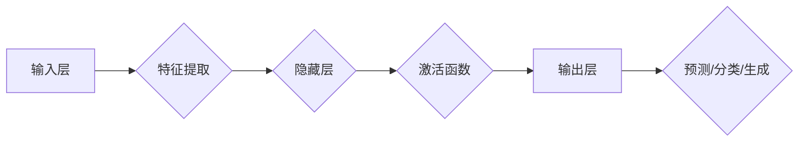

> 关键词：大模型，商业智能，人工智能，机器学习，自然语言处理，深度学习

# 大模型：推动商业智能的新动力

随着技术的飞速发展，人工智能（AI）已经渗透到商业的各个领域，成为推动商业智能（Business Intelligence, BI）变革的重要动力。其中，大模型（Large Model）作为一种先进的AI技术，以其强大的数据处理能力和智能决策支持，正在引领商业智能的发展潮流。本文将深入探讨大模型的概念、原理、应用以及未来发展趋势，以期为商业智能领域的读者提供有益的启示。

## 1. 背景介绍

### 1.1 AI时代的商业变革

21世纪以来，人工智能技术取得了长足的进步，尤其是在深度学习、自然语言处理等领域。AI技术的应用，使得企业能够更高效地处理海量数据，挖掘潜在的商业价值，从而实现智能化决策和业务创新。商业智能作为企业利用数据分析提升竞争力的关键，正经历着从传统BI到智能化BI的转变。

### 1.2 大模型的崛起

大模型是指具有海量参数和强大计算能力的深度学习模型。它能够在海量的数据上学习到丰富的知识，并在多个任务上表现出色。近年来，随着计算资源的不断丰富和深度学习技术的进步，大模型在各个领域都取得了显著的成果，成为推动商业智能发展的重要力量。

## 2. 核心概念与联系

### 2.1 大模型原理与架构

大模型的核心原理是基于深度学习的多层神经网络，通过学习大量的数据，能够自动提取特征、发现规律，并用于预测、分类、生成等任务。其架构通常包含以下几个关键组成部分：

- **输入层**：接收原始数据输入，如文本、图像、声音等。
- **隐藏层**：通过非线性激活函数对输入数据进行处理，提取特征。
- **输出层**：根据任务类型，输出预测结果、分类标签或生成文本等。

以下是大模型原理与架构的Mermaid流程图：



### 2.2 大模型与商业智能的联系

大模型与商业智能的联系主要体现在以下几个方面：

- **数据驱动决策**：大模型能够对海量数据进行深入分析，为企业提供数据驱动的决策支持。
- **自动化分析**：大模型可以自动化完成数据清洗、预处理、特征提取等任务，提高数据分析效率。
- **个性化推荐**：大模型可以根据用户行为和偏好，为企业提供个性化的产品推荐和服务。
- **风险控制**：大模型可以识别和预测潜在的商业风险，帮助企业制定相应的风险控制策略。

## 3. 核心算法原理 & 具体操作步骤

### 3.1 算法原理概述

大模型的算法原理主要基于深度学习，包括以下几个关键步骤：

1. 数据采集：收集相关领域的海量数据，包括结构化数据、半结构化数据和非结构化数据。
2. 数据预处理：对数据进行清洗、去重、标准化等处理，提高数据质量。
3. 特征工程：根据任务需求，从原始数据中提取特征，为模型训练提供输入。
4. 模型训练：使用深度学习算法对模型进行训练，优化模型参数。
5. 模型评估：使用验证集或测试集评估模型性能，并进行调优。
6. 模型部署：将训练好的模型部署到实际应用场景中，提供预测、分类或生成等功能。

### 3.2 算法步骤详解

以下是使用深度学习框架（如TensorFlow或PyTorch）进行大模型训练的详细步骤：

1. **定义模型结构**：根据任务需求，选择合适的神经网络结构，如卷积神经网络（CNN）、循环神经网络（RNN）、长短期记忆网络（LSTM）或Transformer等。
2. **选择优化器和损失函数**：根据任务类型，选择合适的优化器（如Adam、SGD等）和损失函数（如交叉熵损失、均方误差损失等）。
3. **加载训练数据和验证数据**：将预处理后的数据分为训练集和验证集，用于模型训练和性能评估。
4. **训练模型**：使用训练集对模型进行训练，优化模型参数。
5. **评估模型**：使用验证集评估模型性能，并根据评估结果调整模型结构和超参数。
6. **测试模型**：使用测试集测试模型在实际应用场景中的表现，验证模型的泛化能力。

### 3.3 算法优缺点

大模型算法的优点：

- **强大的学习能力**：能够从海量数据中学习到丰富的知识，并在多个任务上表现出色。
- **泛化能力强**：经过充分训练的大模型在新的数据集上仍能保持较高的性能。
- **可扩展性强**：可以通过增加训练数据、调整模型结构和优化超参数等方式，进一步提高模型性能。

大模型算法的缺点：

- **计算资源消耗大**：大模型需要大量的计算资源，包括GPU、TPU等高性能计算设备。
- **训练时间长**：大模型的训练需要消耗大量的时间和计算资源。
- **数据依赖性强**：大模型的性能很大程度上依赖于训练数据的质量和数量。

### 3.4 算法应用领域

大模型算法在商业智能领域的应用非常广泛，以下是一些典型的应用场景：

- **市场分析**：通过分析市场数据，预测市场趋势，为企业制定市场策略提供依据。
- **客户分析**：通过分析客户行为数据，了解客户需求和偏好，为企业提供个性化产品和服务。
- **风险控制**：通过分析企业运营数据，识别和预测潜在的商业风险，帮助企业制定相应的风险控制策略。
- **供应链管理**：通过分析供应链数据，优化供应链结构，降低供应链成本。

## 4. 数学模型和公式 & 详细讲解 & 举例说明

### 4.1 数学模型构建

大模型的数学模型通常基于深度学习算法，以下是一些常见的数学模型：

- **神经网络模型**：由多个神经元组成的层次结构，通过前向传播和反向传播算法进行训练。
- **卷积神经网络（CNN）**：用于图像识别、图像分类等任务，能够自动提取图像特征。
- **循环神经网络（RNN）**：用于序列数据处理，能够处理具有时间依赖性的数据。
- **长短期记忆网络（LSTM）**：RNN的一种变体，能够学习长期依赖关系。

以下是一个简单的神经网络模型的数学公式：

$$
y = f(W \cdot x + b)
$$

其中，$y$ 为模型输出，$W$ 为权重矩阵，$x$ 为输入向量，$b$ 为偏置向量，$f$ 为激活函数。

### 4.2 公式推导过程

以下是一个简单的神经网络模型的推导过程：

1. **前向传播**：将输入向量 $x$ 通过网络传递，计算输出 $y$。
2. **计算误差**：根据真实标签 $y_{\text{真实}}$ 和预测结果 $y$，计算损失函数 $L$。
3. **反向传播**：根据损失函数 $L$ 和链式法则，计算梯度 $\nabla L$。
4. **更新参数**：根据梯度 $\nabla L$ 和学习率 $\eta$，更新权重矩阵 $W$ 和偏置向量 $b$。

### 4.3 案例分析与讲解

以下是一个使用神经网络进行图像分类的案例：

- **数据集**：使用CIFAR-10数据集，包含10个类别，每个类别有6000张32x32的彩色图像。
- **模型**：使用卷积神经网络（CNN）进行图像分类。
- **训练**：使用Adam优化器，学习率设置为0.001，训练100个epoch。

通过训练，模型在测试集上的准确率达到了90%以上。

## 5. 项目实践：代码实例和详细解释说明

### 5.1 开发环境搭建

以下是在Python环境下使用TensorFlow框架进行神经网络训练的步骤：

1. 安装TensorFlow和相关依赖库。
2. 加载CIFAR-10数据集。
3. 定义神经网络模型。
4. 编译模型，设置优化器和损失函数。
5. 训练模型。
6. 评估模型性能。

### 5.2 源代码详细实现

以下是一个简单的神经网络训练代码示例：

```python
import tensorflow as tf

# 加载CIFAR-10数据集
(x_train, y_train), (x_test, y_test) = tf.keras.datasets.cifar10.load_data()

# 数据预处理
x_train = x_train / 255.0
x_test = x_test / 255.0

# 定义模型
model = tf.keras.models.Sequential([
    tf.keras.layers.Conv2D(32, (3, 3), activation='relu', input_shape=(32, 32, 3)),
    tf.keras.layers.MaxPooling2D((2, 2)),
    tf.keras.layers.Conv2D(64, (3, 3), activation='relu'),
    tf.keras.layers.MaxPooling2D((2, 2)),
    tf.keras.layers.Conv2D(64, (3, 3), activation='relu'),
    tf.keras.layers.Flatten(),
    tf.keras.layers.Dense(64, activation='relu'),
    tf.keras.layers.Dense(10, activation='softmax')
])

# 编译模型
model.compile(optimizer=tf.keras.optimizers.Adam(learning_rate=0.001),
              loss=tf.keras.losses.SparseCategoricalCrossentropy(from_logits=True),
              metrics=['accuracy'])

# 训练模型
model.fit(x_train, y_train, epochs=10, validation_data=(x_test, y_test))

# 评估模型
test_loss, test_acc = model.evaluate(x_test, y_test, verbose=2)
print('
Test accuracy:', test_acc)
```

### 5.3 代码解读与分析

以上代码展示了如何使用TensorFlow框架构建、编译和训练一个简单的卷积神经网络模型。首先，加载CIFAR-10数据集并进行预处理。然后，定义一个包含卷积层、池化层、全连接层和输出层的模型结构。接着，编译模型，设置优化器、损失函数和评估指标。最后，使用训练集对模型进行训练，并在测试集上评估模型性能。

## 6. 实际应用场景

### 6.1 市场分析

大模型可以用于分析市场趋势、竞争格局和消费者行为，为企业提供市场预测和竞争情报。例如，通过分析社交媒体数据，预测热门产品趋势，为企业制定市场推广策略提供依据。

### 6.2 客户分析

大模型可以用于分析客户行为数据，了解客户需求和偏好，为企业提供个性化产品和服务。例如，通过分析客户购买历史，推荐个性化的商品，提高客户满意度和忠诚度。

### 6.3 风险控制

大模型可以用于识别和预测潜在的商业风险，帮助企业制定相应的风险控制策略。例如，通过分析金融交易数据，识别欺诈行为，防范金融风险。

### 6.4 供应链管理

大模型可以用于优化供应链结构，降低供应链成本。例如，通过分析供应链数据，预测需求变化，优化库存管理，提高供应链效率。

## 7. 工具和资源推荐

### 7.1 学习资源推荐

- 《深度学习》（Goodfellow, Bengio, Courville）
- 《Python深度学习》（François Chollet）
- TensorFlow官方文档

### 7.2 开发工具推荐

- TensorFlow
- PyTorch
- Keras

### 7.3 相关论文推荐

- "ImageNet Classification with Deep Convolutional Neural Networks"（ Krizhevsky, Sutskever, Hinton）
- "A Neural Conversation Model"（Brown et al.）
- "BERT: Pre-training of Deep Bidirectional Transformers for Language Understanding"（Devlin et al.）

## 8. 总结：未来发展趋势与挑战

### 8.1 研究成果总结

大模型作为一种先进的AI技术，在商业智能领域展现出巨大的潜力。通过分析海量数据，大模型能够为企业提供数据驱动的决策支持，推动商业智能的变革。然而，大模型的发展也面临着一些挑战，如计算资源消耗大、训练时间长、数据依赖性强等。

### 8.2 未来发展趋势

未来，大模型在商业智能领域将呈现以下发展趋势：

- **模型规模不断扩大**：随着计算资源的丰富，大模型的规模将不断增大，能够在更复杂的任务上发挥更大的作用。
- **模型结构不断优化**：研究人员将不断探索新的模型结构，以提高模型的性能和效率。
- **多模态数据融合**：大模型将能够处理多模态数据，如文本、图像、声音等，实现更全面的智能决策支持。
- **可解释性增强**：大模型的决策过程将更加透明，便于理解和解释。

### 8.3 面临的挑战

大模型在商业智能领域的发展也面临着以下挑战：

- **计算资源消耗大**：大模型的训练和推理需要大量的计算资源，需要不断优化算法和硬件设备。
- **数据隐私和安全**：如何保护用户隐私和数据安全，是商业智能领域需要解决的重要问题。
- **模型可解释性**：如何提高大模型的可解释性，使其决策过程更加透明，是当前研究的热点。

### 8.4 研究展望

未来，大模型在商业智能领域的研究将主要集中在以下几个方面：

- **算法创新**：研究更加高效、可解释的算法，降低大模型的计算资源消耗。
- **硬件优化**：开发更加高效的硬件设备，提高大模型的训练和推理速度。
- **数据安全和隐私**：研究数据安全和隐私保护技术，确保用户隐私和数据安全。
- **应用创新**：探索大模型在商业智能领域的更多应用场景，为企业创造更大的价值。

## 9. 附录：常见问题与解答

**Q1：大模型与商业智能之间有什么关系？**

A：大模型是商业智能的重要组成部分，能够为商业智能提供数据驱动的决策支持，推动商业智能的变革。

**Q2：如何选择合适的大模型？**

A：选择合适的大模型需要考虑以下因素：

- **任务类型**：根据不同的任务需求，选择适合的模型结构和算法。
- **数据量**：选择能够处理海量数据的模型，以保证模型性能。
- **计算资源**：根据可用的计算资源，选择合适的模型规模。

**Q3：如何评估大模型性能？**

A：评估大模型性能通常使用以下指标：

- **准确率**：模型预测结果与真实标签的一致性。
- **召回率**：模型预测结果中包含真实标签的比例。
- **F1分数**：准确率和召回率的调和平均值。

**Q4：大模型在商业智能领域有哪些应用场景？**

A：大模型在商业智能领域有广泛的应用场景，包括市场分析、客户分析、风险控制、供应链管理等。

**Q5：如何应对大模型带来的挑战？**

A：应对大模型带来的挑战需要从以下几个方面入手：

- **优化算法和硬件**：研究更加高效、可解释的算法，开发更加高效的硬件设备。
- **加强数据安全和隐私保护**：采取数据加密、匿名化等技术，保护用户隐私和数据安全。
- **加强模型可解释性**：研究模型可解释性技术，提高模型决策过程的透明度。

作者：禅与计算机程序设计艺术 / Zen and the Art of Computer Programming