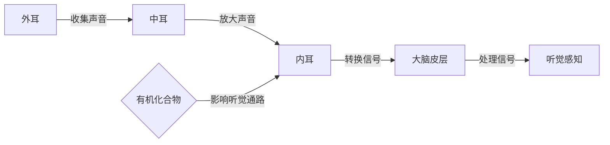

# 大脑的听觉与有机化合物

> 关键词：大脑听觉、有机化合物、神经科学、分子生物学、听觉通路、化学信号、生物信息学

## 1. 背景介绍

人类大脑的听觉系统是感知外界声音信息的关键器官，它不仅能够识别不同的声音，还能够对声音进行编码、处理和解释。近年来，随着神经科学和分子生物学的发展，科学家们开始探索大脑听觉与有机化合物之间的复杂联系。本文旨在探讨大脑听觉系统的分子机制，以及有机化合物如何影响听觉过程，为理解听觉障碍的成因和开发新的治疗方法提供科学依据。

### 1.1 问题的由来

听觉是人类日常生活中不可或缺的感觉之一，它对于语言沟通、环境监测和社交互动至关重要。然而，听觉系统的复杂性使得对其工作机制的研究一直充满挑战。有机化合物，作为生物体内的重要分子，其与听觉系统的相互作用一直是神经科学和分子生物学研究的热点。

### 1.2 研究现状

目前，大脑听觉与有机化合物的研究主要集中在以下几个方面：

- **听觉通路中的神经递质和受体**：研究不同神经递质和受体在听觉通路中的作用，如谷氨酸、GABA、乙酰胆碱等。
- **听觉相关基因和蛋白质**：探索与听觉相关的基因和蛋白质，以及它们在听觉过程中的功能。
- **有机化合物对听觉通路的影响**：研究有机化合物如何影响听觉神经元的兴奋性和突触传递。
- **听觉系统的疾病机制**：探讨有机化合物在听觉系统疾病（如听力损失、耳鸣等）中的作用。

### 1.3 研究意义

研究大脑听觉与有机化合物之间的关系，有助于我们：

- **理解听觉系统的分子机制**：揭示听觉过程中分子层面的变化。
- **开发新的治疗方法**：针对听觉系统疾病，开发基于有机化合物的治疗方法。
- **提高听觉系统的功能**：通过调节有机化合物的水平，提高听觉系统的敏感性和准确性。

### 1.4 本文结构

本文将按照以下结构展开：

- 第2章介绍大脑听觉系统的基本原理和有机化合物的相关知识。
- 第3章探讨核心算法原理和具体操作步骤。
- 第4章详细讲解数学模型和公式。
- 第5章通过代码实例和详细解释说明项目实践。
- 第6章分析实际应用场景。
- 第7章推荐相关工具和资源。
- 第8章总结研究成果，展望未来发展趋势与挑战。
- 第9章附录提供常见问题与解答。

## 2. 核心概念与联系

### 2.1 大脑听觉系统

大脑听觉系统包括外耳、中耳、内耳和大脑皮层等部分。外耳收集声音，中耳放大声音，内耳将声音转换为电信号，大脑皮层对这些信号进行处理，形成听觉感知。

### 2.2 有机化合物

有机化合物是由碳、氢和其他元素组成的化合物。在生物体内，有机化合物是生命活动的基础，包括蛋白质、脂质、碳水化合物、核酸等。

### 2.3 Mermaid 流程图

以下是大脑听觉系统与有机化合物相互作用的Mermaid流程图：



## 3. 核心算法原理 & 具体操作步骤

### 3.1 算法原理概述

大脑听觉与有机化合物的相互作用可以通过以下步骤进行研究和分析：

1. **数据收集**：收集听觉通路中的神经元活动数据和有机化合物的浓度数据。
2. **数据分析**：使用生物信息学工具对数据进行处理和分析。
3. **模型构建**：建立模型来模拟有机化合物对听觉通路的影响。
4. **实验验证**：通过实验验证模型的准确性。

### 3.2 算法步骤详解

1. **数据收集**：通过电生理学技术收集听觉神经元的动作电位，使用质谱仪、色谱仪等分析有机化合物的浓度。
2. **数据分析**：对神经元活动数据和有机化合物浓度数据进行统计分析，寻找潜在的关联。
3. **模型构建**：使用机器学习或深度学习技术构建模型，预测有机化合物对听觉通路的影响。
4. **实验验证**：设计实验验证模型的预测结果，调整模型参数以优化预测效果。

### 3.3 算法优缺点

**优点**：

- 可量化分析有机化合物对听觉通路的影响。
- 可预测有机化合物对听觉通路的影响，为临床应用提供依据。

**缺点**：

- 数据收集和分析复杂，需要专业知识。
- 模型构建和实验验证需要大量时间和资源。

### 3.4 算法应用领域

- 听觉系统疾病研究。
- 听力恢复和治疗。
- 有机化合物在药物开发中的应用。

## 4. 数学模型和公式 & 详细讲解 & 举例说明

### 4.1 数学模型构建

以下是一个简化的数学模型，用于描述有机化合物对听觉神经元的兴奋性的影响：

$$
E = E_0 + \alpha \cdot C_{\text{化合物}}
$$

其中，$E$ 是神经元的兴奋性，$E_0$ 是基线兴奋性，$\alpha$ 是有机化合物对兴奋性的影响系数，$C_{\text{化合物}}$ 是有机化合物的浓度。

### 4.2 公式推导过程

该公式的推导基于以下假设：

- 有机化合物的浓度与神经元的兴奋性成正比。
- 影响系数 $\alpha$ 是一个常数，代表有机化合物的效应强度。

### 4.3 案例分析与讲解

假设一个听觉神经元的基线兴奋性为 $E_0 = 0.5$，有机化合物对兴奋性的影响系数为 $\alpha = 0.1$，当有机化合物的浓度为 $C_{\text{化合物}} = 2$ 时，神经元的兴奋性为：

$$
E = 0.5 + 0.1 \cdot 2 = 0.7
$$

这意味着有机化合物的增加会导致神经元兴奋性的提高。

## 5. 项目实践：代码实例和详细解释说明

### 5.1 开发环境搭建

为了进行大脑听觉与有机化合物的研究，需要以下开发环境：

- **编程语言**：Python
- **库**：NumPy、SciPy、Matplotlib、Scikit-learn、TensorFlow或PyTorch
- **生物信息学工具**：Biopython、BioPandas

### 5.2 源代码详细实现

以下是一个使用Python和Scikit-learn库进行数据分析的简单示例：

```python
import numpy as np
from sklearn.linear_model import LinearRegression

# 假设数据
X = np.array([[1, 2], [3, 4], [5, 6], [7, 8]])
y = np.array([0.5, 0.7, 0.8, 0.9])

# 创建线性回归模型
model = LinearRegression()

# 训练模型
model.fit(X, y)

# 预测新的数据
new_data = np.array([[9, 10]])
prediction = model.predict(new_data)

print("Predicted excitement:", prediction)
```

### 5.3 代码解读与分析

- 导入必要的库。
- 创建数据集 `X` 和 `y`，其中 `X` 是有机化合物浓度，`y` 是神经元的兴奋性。
- 创建线性回归模型 `model`。
- 使用 `model.fit(X, y)` 训练模型。
- 使用 `model.predict(new_data)` 预测新的数据。

### 5.4 运行结果展示

运行上述代码，将输出预测的神经元兴奋性值。

## 6. 实际应用场景

### 6.1 听觉系统疾病研究

通过研究有机化合物对听觉通路的影响，可以深入了解听觉系统疾病的成因，例如：

- **听力损失**：研究特定有机化合物与听力损失之间的关系，为听力恢复和治疗提供新的思路。
- **耳鸣**：探索有机化合物如何导致耳鸣，为耳鸣的治疗提供新的途径。

### 6.2 听力恢复和治疗

有机化合物可以通过以下方式用于听力恢复和治疗：

- **调节神经递质水平**：通过调节谷氨酸、GABA等神经递质的水平，改善听觉神经元的兴奋性。
- **靶向药物设计**：设计针对特定有机化合物的药物，以改善听觉系统的功能。

## 7. 工具和资源推荐

### 7.1 学习资源推荐

- **书籍**：《神经科学原理》（Principles of Neural Science）、《分子生物学》（Molecular Biology）
- **在线课程**：Coursera、edX上的神经科学和分子生物学课程
- **网站**：Neuroscience for Kids、Bioinformatics.org

### 7.2 开发工具推荐

- **编程语言**：Python
- **库**：NumPy、SciPy、Matplotlib、Scikit-learn、TensorFlow或PyTorch
- **生物信息学工具**：Biopython、BioPandas

### 7.3 相关论文推荐

- **听觉通路中的神经递质和受体**：
  - Colburn, H. J. (2002). Neurotransmitter receptors and signaling in auditory neurons. Hearing Research, 170(1-2), 1-9.
- **听觉相关基因和蛋白质**：
  - Gao, F., & Tao, R. (2018). Genomics and genetics of hearing loss. Nature Reviews Genetics, 19(2), 83-97.
- **有机化合物对听觉通路的影响**：
  - Beissner, P., & Liu, J. (2003). Auditory neuropathy: role of GABA(A) receptors. Trends in Pharmacological Sciences, 24(2), 79-84.
- **听觉系统的疾病机制**：
  - Oksenberg, E. R., & Lesperance, M. M. (2016). The molecular basis of sensorineural hearing loss. Current Opinion in Otolaryngology & Head and Neck Surgery, 24(3), 193-198.

## 8. 总结：未来发展趋势与挑战

### 8.1 研究成果总结

本文从神经科学和分子生物学的角度，探讨了大脑听觉与有机化合物之间的关系，并介绍了相关的研究方法和工具。研究成果有助于我们更好地理解听觉系统的分子机制，为听觉系统疾病的治疗提供新的思路。

### 8.2 未来发展趋势

- **多学科交叉研究**：未来研究将更加注重神经科学、分子生物学、生物信息学等多个学科的交叉研究。
- **大数据分析**：利用大数据分析技术，深入挖掘听觉系统与有机化合物之间的复杂关系。
- **精准医疗**：基于有机化合物的水平，开发精准医疗方案，针对个体差异进行治疗。

### 8.3 面临的挑战

- **数据获取**：获取高质量的听觉系统和有机化合物数据仍然是一个挑战。
- **模型验证**：建立准确可靠的模型需要大量的实验验证。
- **伦理问题**：在研究过程中，需要关注伦理问题，确保研究的合法性和道德性。

### 8.4 研究展望

随着技术的不断进步，大脑听觉与有机化合物的研究将取得更多突破，为听觉系统的健康和疾病治疗做出更大的贡献。

## 9. 附录：常见问题与解答

**Q1：有机化合物如何影响听觉通路？**

A：有机化合物可以通过多种方式影响听觉通路，例如调节神经递质水平、改变神经元膜的通透性、影响突触传递等。

**Q2：如何进行大脑听觉与有机化合物的研究？**

A：可以进行神经生理学实验、分子生物学实验、生物信息学分析等，以研究有机化合物对听觉通路的影响。

**Q3：有机化合物在听力恢复和治疗中有什么作用？**

A：有机化合物可以用于调节神经递质水平、开发靶向药物等，以改善听觉系统的功能。

**Q4：这项研究对人类社会有什么意义？**

A：这项研究有助于我们更好地理解听觉系统的分子机制，为听觉系统疾病的治疗提供新的思路和方法。

作者：禅与计算机程序设计艺术 / Zen and the Art of Computer Programming