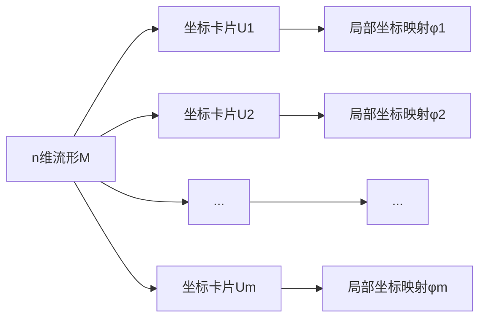

下面是以《流形拓扑学理论与概念的实质：Whitney嵌入定理》为标题的技术博客文章正文部分：

# 流形拓扑学理论与概念的实质：Whitney嵌入定理

## 1. 背景介绍

### 1.1 问题的由来

在数学和物理学中，流形(manifold)是一个基本概念,用于研究复杂的几何结构。流形是一种拓扑空间,在某种意义上看起来像欧几里得空间的一部分。然而,在更深层次上,流形的概念揭示了空间的本质结构和性质。

流形嵌入问题是指,给定两个流形M和N,其中M的维数小于N,确定是否存在一个嵌入映射f:M→N,使得f(M)是N的子流形。这个问题在数学、物理、计算机科学等领域都有重要应用。

### 1.2 研究现状

早期,数学家们主要关注低维流形的嵌入问题,例如环面嵌入三维欧几里得空间。随着研究的深入,人们逐渐认识到高维流形嵌入的重要性。1944年,著名数学家惠特尼(Hassler Whitney)提出了著名的惠特尼嵌入定理,为高维流形的嵌入问题提供了一个完整的解决方案。

### 1.3 研究意义

惠特尼嵌入定理不仅在纯数学领域具有重要意义,而且在物理学、计算机科学等领域也有广泛应用。例如,在计算机图形学中,三维物体的表面可以看作是二维流形嵌入三维欧几里得空间;在机器人技术中,机器人的运动路径可以看作是一维流形嵌入三维空间。因此,深入理解惠特尼嵌入定理及其背后的数学原理,对于解决实际问题具有重要意义。

### 1.4 本文结构

本文将从以下几个方面深入探讨惠特尼嵌入定理:

1. 核心概念与联系
2. 核心算法原理及具体操作步骤
3. 数学模型和公式详细讲解及举例说明
4. 项目实践:代码实例和详细解释说明
5. 实际应用场景
6. 工具和资源推荐
7. 总结:未来发展趋势与挑战
8. 附录:常见问题与解答

## 2. 核心概念与联系

### 2.1 流形(Manifold)

流形是现代几何学和拓扑学的核心概念之一。一个n维流形M是一个拓扑空间,在每一点p∈M的某个邻域U上,都存在一个同胚映射φ:U→Rn,将U映射到n维欧几里得空间Rn的一个开子集V上。换言之,流形在局部上看起来像Rn。


流形的概念统一了几何与拓扑,揭示了空间的本质结构,是现代数学的基石之一。

### 2.2 嵌入(Embedding)

嵌入是将一个空间对象"嵌入"到另一个更高维的空间对象中的过程。更精确地说,如果有两个流形M和N,其中M的维数小于N,那么一个嵌入映射f:M→N是一个满射,使得f(M)是N的子流形,并且f在M上是同胚。

```mermaid
graph LR
    A[低维流形M] --> B[嵌入映射f]
    B --> C[高维流形N]
    C --> D[f(M)是N的子流形]
```

嵌入映射保持了原有流形的拓扑结构,是研究流形几何性质的重要工具。

### 2.3 惠特尼嵌入定理(Whitney Embedding Theorem)

惠特尼嵌入定理是嵌入理论的核心成果,由惠特尼在1944年提出。它回答了这样一个基本问题:给定一个n维流形M,是否总能将其嵌入到一个足够高维的欧几里得空间Rm中?惠特尼的定理给出了一个确切的维数下界:

**惠特尼嵌入定理**:任何n维紧致流形M都可以嵌入到(2n+1)维欧几里得空间R2n+1中。

这个定理为高维流形的嵌入问题提供了一个完整的解决方案,是现代几何与拓扑学的里程碑式成果。

## 3. 核心算法原理与具体操作步骤

### 3.1 算法原理概述

惠特尼嵌入定理的证明过程构造了一个显式的嵌入映射,将n维流形M嵌入到(2n+1)维欧几里得空间R2n+1中。这个映射的构造过程可以概括为以下几个关键步骤:

1. 将流形M分成有限个坐标卡片(coordinate patch),在每个卡片上定义局部坐标系。
2. 构造一个辅助函数ρ,称为惯性径向函数(inertia radial function),将M映射到R2n+1中的一个子集。
3. 通过一个扰动映射(perturbation map)将ρ(M)的像扰动到R2n+1的一个嵌入子流形上。

这个算法的核心思想是:首先将流形M映射到R2n+1中的一个"肿胀"的子集ρ(M),然后通过一个适当的扰动将其"拉平",从而得到一个嵌入子流形。

```mermaid
graph LR
    A[n维流形M] --> B[惯性径向函数ρ]
    B --> C[ρ(M)在R^(2n+1)中的"肿胀"子集]
    C --> D[扰动映射]
    D --> E[R^(2n+1)中的嵌入子流形]
```

### 3.2 算法步骤详解

下面我们将详细介绍惠特尼嵌入算法的具体步骤。

#### 步骤1:坐标卡片划分

首先,我们将n维紧致流形M分成有限个坐标卡片{Uα},在每个Uα上定义局部坐标映射φα:Uα→Rn。这些坐标卡片构成了M的一个有限覆盖。



#### 步骤2:惯性径向函数的构造

定义惯性径向函数(inertia radial function)ρ:Rn→R2n+1如下:

$$\rho(x_1,\ldots,x_n) = \left(x_1,\ldots,x_n,\sum_{i=1}^nx_i^2,\sum_{1\leq i<j\leq n}x_ix_j,\ldots,\sum_{1\leq i_1<\ldots<i_n\leq n}x_{i_1}\ldots x_{i_n}\right)$$

其中,最后n+1个分量是x1,...,xn的所有次数为2,...,n+1的单项式。

将ρ限制在M上,我们得到一个映射ρ|M:M→R2n+1,这个映射将M"肿胀"到R2n+1中的一个子集ρ(M)上。

```mermaid
graph LR
    A[n维流形M] --> B[惯性径向函数ρ|M]
    B --> C[ρ(M)在R^(2n+1)中的"肿胀"子集]
```

#### 步骤3:扰动映射的构造

为了将ρ(M)"拉平"到一个嵌入子流形上,我们需要构造一个扰动映射(perturbation map)。具体来说,对于每个坐标卡片Uα,定义一个映射:

$$\tau_\alpha: \phi_\alpha(U_\alpha) \times (-\epsilon,\epsilon)^{2n+1} \rightarrow \mathbb{R}^{2n+1}$$

其中ε>0是一个小的正数。这个映射将ρ(Uα)的点沿着法向量方向适当扰动,使得扰动后的点位于R2n+1中的一个嵌入子流形上。

通过将所有坐标卡片的扰动映射"缝合"在一起,我们得到了整个流形M到R2n+1的一个嵌入映射。

```mermaid
graph LR
    A[n维流形M] --> B[坐标卡片U1]
    A --> C[坐标卡片U2]
    A --> D[...]
    A --> E[坐标卡片Um]
    B --> F[局部扰动映射τ1]
    C --> G[局部扰动映射τ2]
    D --> H[...]
    E --> I[局部扰动映射τm]
    F --> J[R^(2n+1)中的嵌入子流形]
    G --> J
    H --> J
    I --> J
```

这个扰动映射的构造过程是整个算法的核心部分,需要使用一些精细的技巧来保证扰动后的映射仍然是一个嵌入。

### 3.3 算法优缺点

惠特尼嵌入算法是一个非常巧妙和深刻的算法,它为高维流形的嵌入问题提供了一个完整的解决方案。该算法的优点包括:

1. 简单性:算法的基本思想非常简单,即先"肿胀"然后"拉平"。
2. 一般性:算法适用于任何紧致流形,不受维数和其他条件的限制。
3. 最优性:算法给出了将n维流形嵌入欧几里得空间所需的最小维数2n+1。

然而,这个算法也存在一些缺点和局限性:

1. 构造性:算法只给出了嵌入映射的存在性证明,但没有提供一个显式的构造方法。
2. 计算复杂性:尽管算法在理论上是可构造的,但实际计算过程可能非常复杂,特别是对于高维流形。
3. 几何直观性:算法使用了一些抽象的技巧,缺乏直观的几何解释。

### 3.4 算法应用领域

惠特尼嵌入定理及其算法在许多领域都有重要应用,包括但不限于:

1. 微分几何和拓扑学:作为研究高维流形几何性质的基础理论。
2. 计算机图形学:三维物体表面可视为二维流形嵌入三维空间。
3. 机器人技术:机器人运动路径可视为一维流形嵌入三维空间。
4. 数据可视化:将高维数据嵌入到低维空间中进行可视化。
5. 计算拓扑学:用于研究数据集的拓扑不变量。

## 4. 数学模型和公式详细讲解与举例说明

### 4.1 数学模型构建

为了更好地理解惠特尼嵌入定理及其算法,我们需要建立一个严格的数学模型。首先,我们给出流形和嵌入的形式定义。

**定义4.1.1(流形)** 设M是一个拓扑空间,n是一个非负整数。如果对于M中的每一点p,都存在一个开邻域U和一个同胚映射φ:U→Rn,那么我们称M是一个n维流形。

**定义4.1.2(嵌入)** 设M和N是两个流形,其中dimM=m,dimN=n且m≤n。如果存在一个映射f:M→N满足:

1. f是单射;
2. f是拓扑映射,即f和f-1都是连续的;
3. f(M)是N的一个子流形,

那么我们称f是一个嵌入映射,并称M嵌入到N中。

在惠特尼嵌入定理中,我们主要关注将一个n维紧致流形M嵌入到(2n+1)维欧几里得空间R2n+1中的情况。

### 4.2 公式推导过程

下面我们来推导惠特尼嵌入算法中使用的惯性径向函数ρ和扰动映射τα的具体形式。

#### 4.2.1 惯性径向函数ρ

我们希望构造一个映射ρ:Rn→R2n+1,使得ρ(Rn)在R2n+1中"肿胀"成一个子集。为此,我们考虑