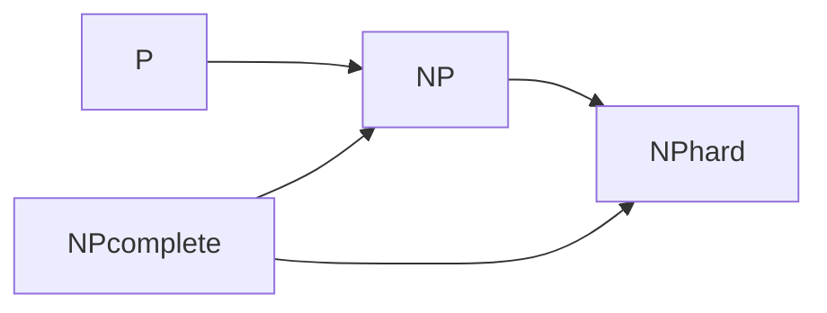

# 计算：第四部分 计算的极限 第 9 章 计算复杂性 NP 完全问题

## 1. 背景介绍
### 1.1  问题的由来
计算复杂性理论是计算机科学领域的一个重要分支,它研究计算问题的内在难度和所需的计算资源。在这个领域中,NP完全问题是一类非常特殊且重要的问题。这些问题的求解在理论上具有极高的复杂度,但又与现实生活中的很多应用密切相关。理解NP完全问题的本质,对于探索计算的极限、设计高效算法具有重要意义。

### 1.2  研究现状
自从1971年Stephen Cook提出NP完全问题以来,相关研究已经取得了长足进展。许多经典问题如旅行商问题(TSP)、背包问题等都被证明是NP完全的。研究者们探索了这些问题之间的内在联系,发现了许多NP完全问题之间可以通过多项式时间归约相互转化。同时,针对特定NP完全问题的近似算法和启发式算法也取得了丰硕成果,在实践中得到了广泛应用。

### 1.3  研究意义
NP完全问题的研究对计算机科学和人工智能具有重要意义:

1. 探索计算的本质和极限,加深对计算复杂性的理解。
2. 促进算法设计技术的发展,启发新的算法思路。
3. 解决实际应用中的关键问题,如优化、机器学习等。
4. 为其他学科提供交叉研究的新视角和方法。

### 1.4  本文结构
本文将从以下几个方面对NP完全问题进行深入探讨:

1. 核心概念:P类、NP类、多项式时间归约、NP完全等。
2. 经典NP完全问题及其应用。
3. 针对NP完全问题的算法设计技术。
4. NP完全问题与其他计算问题的联系。
5. NP完全问题研究的最新进展与未来展望。

## 2. 核心概念与联系
要理解NP完全问题,首先需要掌握一些核心概念:

- 判定问题:可以用"是"或"否"回答的问题。
- P类:能在多项式时间内求解的判定问题。
- NP类:可以在多项式时间内验证一个解的判定问题。
- 多项式时间归约:一个问题A可以在多项式时间内转化为另一个问题B。
- NP难问题:NP类中最难的问题,所有NP问题都可以归约到它。
- NP完全问题:既属于NP类,又是NP难的问题。

这些概念之间有着紧密的逻辑联系:



如果P=NP,那么所有NP问题都可以高效求解,这是计算复杂性理论中的一个重大猜想。

## 3. 核心算法原理 & 具体操作步骤
### 3.1  算法原理概述
针对NP完全问题,主要有三类算法思路:

1. 精确算法:穷举搜索、动态规划、分支限界等。
2. 近似算法:贪心、线性规划松弛等。
3. 启发式算法:模拟退火、遗传算法、蚁群算法等。

### 3.2  算法步骤详解
以旅行商问题(TSP)为例,分支限界算法的基本步骤如下:

1. 将问题表示为状态空间树。
2. 设置界限函数,估计从当前结点到目标结点的代价下界。
3. 采用DFS策略遍历状态空间树:
   - 如果当前结点是叶结点,更新当前最优解。
   - 如果当前结点的界限函数值大于当前最优解,剪枝回溯。
   - 否则,扩展当前结点,生成子结点。
4. 搜索过程结束后,当前最优解即为所求的最优解。

### 3.3  算法优缺点
精确算法的优点是可以得到最优解,但在最坏情况下时间复杂度很高。近似算法和启发式算法通过放宽限制、引入随机性等方法,在牺牲部分解的质量的情况下提高了求解效率。但它们通常无法保证解的最优性,且算法性能依赖于具体问题和参数选择。

### 3.4  算法应用领域
NP完全问题算法被广泛应用于组合优化、机器学习、人工智能等领域。如旅行商问题可用于物流路径规划,背包问题可用于资源分配和投资决策,图着色问题可用于任务调度和网络优化等。

## 4. 数学模型和公式 & 详细讲解 & 举例说明
### 4.1  数学模型构建
以0-1背包问题为例,可以建立如下数学模型:

$$
\begin{aligned}
\max \quad & \sum_{i=1}^n v_i x_i \
\text{s.t.} \quad & \sum_{i=1}^n w_i x_i \leq W \
& x_i \in \{0,1\}, \quad i=1,2,\dots,n
\end{aligned}
$$

其中,$x_i$表示第$i$个物品是否选取,$v_i$和$w_i$分别表示第$i$个物品的价值和重量,$W$表示背包的容量。

### 4.2  公式推导过程
可以使用动态规划算法求解0-1背包问题。定义状态$dp[i][j]$表示前$i$个物品中选取总重不超过$j$的物品的最大价值。状态转移方程为:

$$
dp[i][j] = \max\{dp[i-1][j], dp[i-1][j-w_i]+v_i\}
$$

边界条件为:$dp[0][j]=0$,最终答案为$dp[n][W]$。

### 4.3  案例分析与讲解
考虑一个背包容量为10,共有5个物品的0-1背包问题,物品的重量和价值如下表所示:

| 物品编号 | 1 | 2 | 3 | 4 | 5 |
|----------|---|---|---|---|---|
| 重量     | 2 | 3 | 4 | 5 | 6 |
| 价值     | 3 | 4 | 5 | 6 | 7 |

使用动态规划算法求解,可以得到最优解为选取物品1、3、4,总价值为14。

### 4.4  常见问题解答
Q: 动态规划算法的时间复杂度是多少?
A: 0-1背包问题的动态规划算法时间复杂度为$O(nW)$,其中$n$为物品数量,$W$为背包容量。

Q: 除了动态规划,还有哪些算法可以求解0-1背包问题?
A: 还可以使用回溯法、分支限界法等精确算法,以及贪心法、近似算法等启发式方法。

## 5. 项目实践：代码实例和详细解释说明
### 5.1  开发环境搭建
本项目使用C++语言实现,需要安装g++编译器。在Linux系统下,可以使用如下命令安装:

```bash
sudo apt-get install g++
```

### 5.2  源代码详细实现
0-1背包问题的动态规划实现如下:

```cpp
#include <iostream>
#include <algorithm>
using namespace std;

const int N = 1010;
int n, W;
int w[N], v[N];
int dp[N][N];

int main() {
    cin >> n >> W;
    for (int i = 1; i <= n; i++) cin >> w[i] >> v[i];

    for (int i = 1; i <= n; i++) {
        for (int j = 0; j <= W; j++) {
            dp[i][j] = dp[i-1][j];
            if (j >= w[i]) dp[i][j] = max(dp[i][j], dp[i-1][j-w[i]] + v[i]);
        }
    }

    cout << dp[n][W] << endl;
    return 0;
}
```

### 5.3  代码解读与分析
- 第1-4行:包含必要的头文件,定义常量和变量。
- 第6-7行:读入物品数量$n$和背包容量$W$。
- 第8行:读入每个物品的重量$w_i$和价值$v_i$。
- 第10-15行:使用二重循环实现动态规划,更新状态$dp[i][j]$。
- 第17行:输出最终结果$dp[n][W]$。

### 5.4  运行结果展示
使用如下命令编译并运行程序:

```bash
g++ -o knapsack knapsack.cpp
./knapsack < input.txt
```

其中,`input.txt`为输入数据文件,包含物品数量、背包容量和物品重量价值信息。运行结果为最优解的总价值。

## 6. 实际应用场景
NP完全问题在许多实际场景中都有重要应用,例如:

- 物流运输:旅行商问题可用于规划最优配送路线。
- 资源分配:背包问题可用于预算分配、投资决策等。
- 任务调度:图着色问题可用于考试安排、生产调度等。
- 网络设计:最小生成树问题可用于通信网络、电路设计等。
- 机器学习:最大团问题可用于社交网络分析、推荐系统等。

### 6.4  未来应用展望
随着人工智能、大数据等技术的快速发展,NP完全问题的应用场景将更加广阔:

- 深度学习中的神经网络架构搜索和参数优化。
- 强化学习中的组合优化问题求解。
- 量子计算中的量子电路设计和优化。
- 区块链中的共识机制和激励机制设计。

## 7. 工具和资源推荐
### 7.1  学习资源推荐
- 《算法导论》第3版,Thomas H.Cormen等著,机械工业出版社。
- Coursera公开课《算法设计与分析》,Tim Roughgarden主讲。
- 《挑战程序设计竞赛》第2版,秋叶拓哉等著,人民邮电出版社。

### 7.2  开发工具推荐
- C++:g++, Visual Studio, Dev-C++等。
- Java:JDK, Eclipse, IntelliJ IDEA等。
- Python:PyCharm, Anaconda, Jupyter Notebook等。

### 7.3  相关论文推荐
- Cook S. The complexity of theorem-proving procedures[C]//Proceedings of the third annual ACM symposium on Theory of computing. 1971: 151-158.
- Karp R M. Reducibility among combinatorial problems[M]//Complexity of computer computations. Springer, Boston, MA, 1972: 85-103.
- Vazirani V V. Approximation algorithms[M]. Springer Science & Business Media, 2013.

### 7.4  其他资源推荐
- GitHub上的NP完全问题相关项目:Awesome-NP-Complete, NP-Complete-Problems等。
- 在线评测系统:LeetCode, HackerRank, Codeforces等。
- 学术会议:STOC, FOCS, SODA, ICALP等。

## 8. 总结：未来发展趋势与挑战
### 8.1  研究成果总结
NP完全问题的研究已经取得了丰硕成果,主要体现在:

- 发现了大量的NP完全问题及其内在联系。
- 开发了多种高效的精确、近似和启发式算法。
- 深化了对计算复杂性理论的认识和理解。

### 8.2  未来发展趋势
NP完全问题研究的未来发展趋势包括:

- 探索P与NP的关系,攻克"P=NP?"难题。
- 设计更高效、更通用的近似算法和启发式算法。
- 利用新的计算模型和范式,如量子计算、生物计算等。
- 加强与人工智能、大数据、区块链等领域的融合。

### 8.3  面临的挑战
NP完全问题研究仍面临诸多挑战:

- P=NP问题仍是一个巨大的未知数。
- 很多问题的近似算法和启发式算法性能有待提高。
- 如何将理论成果有效应用于实践仍需要进一步探索。
- 新的计算模型和范式的潜力尚未完全发掘出来。

### 8.4  研究展望
展望未来,NP完全问题的研究将继续深化和拓展:

- 在理论层面,进一步完善计算复杂性理论体系。
- 在算法层面,发掘新的优化思路和技术。
- 在应用层面,与前沿交叉学科深度融合。