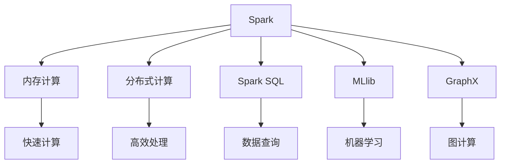
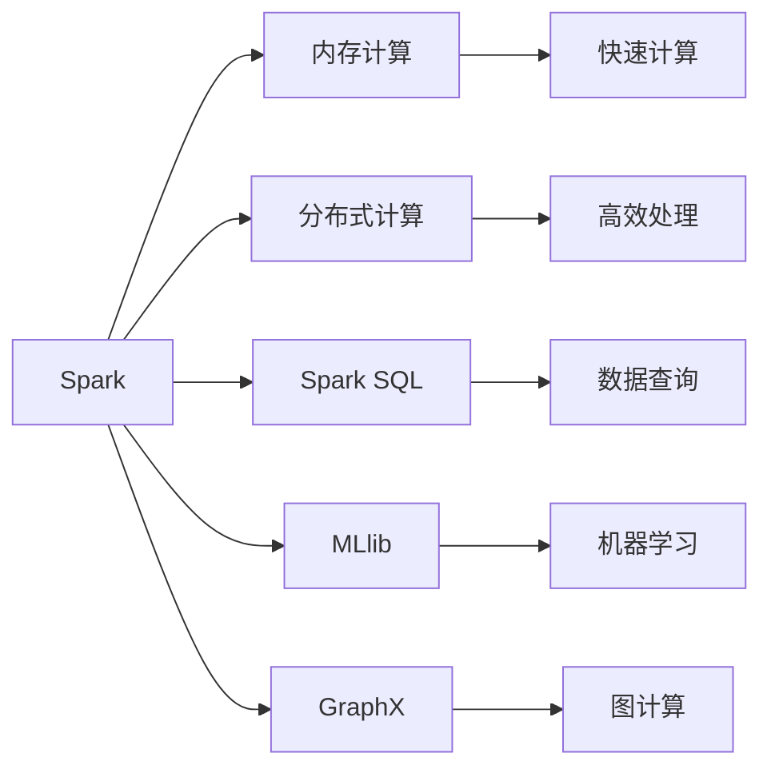
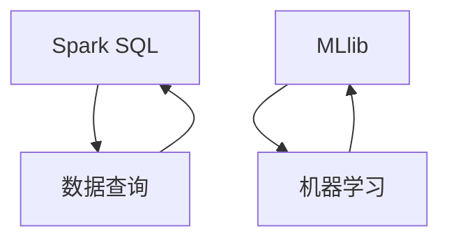
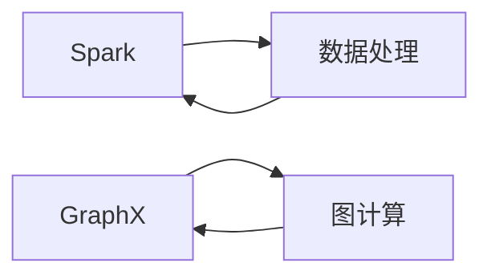
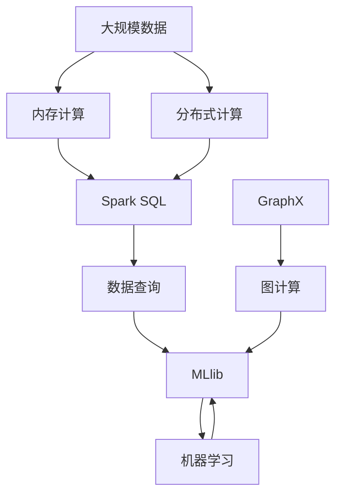

                 

# Spark内存计算引擎原理与代码实例讲解

> 关键词：Spark,内存计算,计算引擎,分布式计算,大数据,深度学习

## 1. 背景介绍

### 1.1 问题由来
随着互联网和物联网技术的快速发展，数据量呈爆炸式增长，如何高效地处理和管理海量数据成为业界关注的热点问题。传统的批处理计算模式已无法满足实时和交互式分析的需求。为了应对这一挑战，内存计算技术应运而生，通过将数据存储在内存中，极大地提升了数据处理的速度和效率。Apache Spark是一个开源的分布式计算框架，支持内存计算，并提供了多种API（如Spark SQL、Spark Streaming、MLlib、GraphX等），能够高效处理大规模数据集。

### 1.2 问题核心关键点
Spark内存计算引擎的核心在于其利用内存进行计算的能力。Spark将数据存储在内存中，通过在集群中分布式地并行计算，显著提升了数据处理的速度。Spark还引入了延迟执行和基于线的数据管道（Lineage Graph）等特性，支持高效的流式数据处理和复杂的大数据计算任务。此外，Spark还提供了丰富的API和组件，如Spark SQL用于数据查询和分析，MLlib用于机器学习，GraphX用于图计算等。

### 1.3 问题研究意义
Spark内存计算引擎的研究意义在于：
1. 提升数据处理速度。内存计算能够显著提升数据处理速度，降低延迟，满足实时和交互式分析的需求。
2. 简化数据处理流程。Spark提供了多种API和组件，支持从数据加载、处理、分析和存储的全流程自动化，降低了数据处理的复杂度。
3. 支持多种数据类型。Spark支持处理结构化数据、半结构化数据和无结构化数据，适用于各种数据类型和业务场景。
4. 促进大数据技术普及。Spark的易用性和高效性，使得大数据技术更加易于普及，加速了大数据应用的落地。

## 2. 核心概念与联系

### 2.1 核心概念概述

为了更好地理解Spark内存计算引擎，本节将介绍几个密切相关的核心概念：

- Spark：Apache Spark是一个快速通用的大数据处理引擎，支持内存计算和分布式计算，能够处理大规模数据集。
- 内存计算：将数据存储在内存中，利用高速内存进行计算，显著提升数据处理速度。
- 分布式计算：通过在多台计算机上并行计算，将计算任务分散在集群中，提高数据处理的效率。
- Spark SQL：Spark提供的基于SQL的数据处理组件，支持结构化数据的操作和分析。
- MLlib：Spark提供的机器学习库，支持多种机器学习算法和模型。
- GraphX：Spark提供的图计算组件，支持图数据的处理和分析。

这些核心概念之间的逻辑关系可以通过以下Mermaid流程图来展示：



这个流程图展示了一个完整的Spark计算流程：

1. Spark框架提供内存计算和分布式计算的能力，显著提升数据处理速度。
2. 通过Spark SQL、MLlib和GraphX等组件，支持结构化数据、半结构化数据和图数据的处理和分析。
3. 这些组件能够自动化处理数据的加载、处理、分析和存储，降低了数据处理的复杂度。

### 2.2 概念间的关系

这些核心概念之间存在着紧密的联系，形成了Spark内存计算引擎的完整生态系统。下面我通过几个Mermaid流程图来展示这些概念之间的关系。

#### 2.2.1 Spark框架的结构



这个流程图展示了Spark框架的结构，通过内存计算和分布式计算，支持Spark SQL、MLlib和GraphX等组件，提供了快速和高效的数据处理能力。

#### 2.2.2 Spark SQL和MLlib的关系



这个流程图展示了Spark SQL和MLlib之间的关系。Spark SQL提供数据查询能力，而MLlib提供机器学习能力。MLlib算法依赖于Spark SQL提供的数据，并可以将其结果用于后续的分析。

#### 2.2.3 Spark和GraphX的关系



这个流程图展示了Spark和GraphX之间的关系。Spark支持处理数据，而GraphX支持图数据的处理和分析。GraphX将图数据转化为Spark的RDD（弹性分布式数据集），利用Spark的分布式计算能力进行图计算。

### 2.3 核心概念的整体架构

最后，我用一个综合的流程图来展示这些核心概念在大数据处理过程中的整体架构：



这个综合流程图展示了从数据加载到最终分析的全流程。大数据首先通过内存计算和分布式计算进行处理，然后通过Spark SQL、MLlib和GraphX等组件进行查询、机器学习、图计算等操作。

## 3. 核心算法原理 & 具体操作步骤

### 3.1 算法原理概述

Spark内存计算引擎的核心算法原理包括：

- 内存计算：将数据存储在内存中，利用高速内存进行计算，减少磁盘I/O，提高数据处理速度。
- 分布式计算：通过在多台计算机上并行计算，将计算任务分散在集群中，提高数据处理的效率。
- 延迟执行：Spark采用延迟执行机制，先保存计算结果，只有当结果被访问时才执行计算，减少了不必要的计算。
- 基于线的数据管道（Lineage Graph）：Spark维护一个从原始数据到最终结果的计算图，用于优化计算路径和避免重复计算。

这些算法原理构成了Spark内存计算引擎的基础，使得Spark能够高效处理大规模数据集，满足实时和交互式分析的需求。

### 3.2 算法步骤详解

Spark内存计算引擎的实现步骤包括以下几个关键环节：

**Step 1: 数据加载与内存分配**

Spark通过将数据加载到内存中进行处理，提高数据处理速度。具体的加载方式包括：

- Hadoop Distributed File System（HDFS）：将数据从HDFS中加载到Spark内存中。
- Local File System（Local FS）：将本地文件系统的数据加载到Spark内存中。
- Hive：将Hive元数据转换为Spark RDD。

内存分配机制包括：

- 内存分区：将数据按照键值对（Key-Value）进行分区，提高内存利用率。
- 内存管理：采用LRU算法管理内存，保证最近使用的数据在内存中，提高数据访问速度。

**Step 2: 数据处理与计算**

Spark采用分布式计算的方式，将数据并行计算，提高计算效率。具体的计算方式包括：

- MapReduce：将数据分成多个块，在集群中并行计算，适合大规模数据集的处理。
- DataFrame和DataFrame API：提供类似于SQL的语法，支持数据查询和分析。
- MLlib：提供多种机器学习算法和模型，支持数据分类、聚类、回归等操作。
- GraphX：提供图数据处理和分析的能力，支持图算法的计算。

**Step 3: 数据管道与优化**

Spark采用基于线的数据管道机制，维护从原始数据到最终结果的计算图，优化计算路径和避免重复计算。具体的优化方式包括：

- 延迟执行：Spark将计算结果保存，只有当结果被访问时才执行计算，减少了不必要的计算。
- 基于线的数据管道：Spark维护一个计算图，用于优化计算路径和避免重复计算。
- 内存优化：采用LRU算法管理内存，保证最近使用的数据在内存中，提高数据访问速度。

**Step 4: 数据存储与输出**

Spark支持多种数据存储方式，将处理结果保存到不同的数据存储系统。具体的存储方式包括：

- HDFS：将处理结果保存到HDFS中。
- Local FS：将处理结果保存到本地文件系统中。
- Parquet：将处理结果保存到Parquet格式文件中，支持列式存储。
- JDBC和OOP：将处理结果保存到关系型数据库或NoSQL数据库中。

这些算法步骤构成了Spark内存计算引擎的核心实现流程，通过数据加载、处理、计算、管道和存储等环节，实现了高效的大数据处理。

### 3.3 算法优缺点

Spark内存计算引擎的优点包括：

- 高效性：通过内存计算和分布式计算，显著提升数据处理速度。
- 易用性：提供多种API和组件，支持从数据加载、处理、分析和存储的全流程自动化。
- 扩展性：支持大规模数据集的处理和计算，易于扩展。
- 灵活性：支持多种数据类型和业务场景，灵活应对各种需求。

Spark内存计算引擎的缺点包括：

- 内存消耗大：需要较大的内存空间，对于内存不足的系统可能存在瓶颈。
- 实现复杂：需要深入理解内存计算和分布式计算的原理，实现难度较大。
- 性能受限：内存计算的性能受限于内存大小，无法处理超大规模数据集。

尽管存在这些缺点，但Spark内存计算引擎在实际应用中表现出色，得到了广泛的应用和认可。

### 3.4 算法应用领域

Spark内存计算引擎在多个领域得到了广泛应用，以下是几个典型应用场景：

- 大数据分析：Spark支持大规模数据集的分析和处理，广泛应用于金融、电商、互联网等领域。
- 机器学习：Spark提供了丰富的机器学习库，支持多种机器学习算法和模型，广泛应用于自然语言处理、图像处理等领域。
- 图计算：Spark的GraphX组件支持图数据的处理和分析，广泛应用于社交网络、推荐系统等领域。
- 实时计算：Spark支持实时计算和流式数据处理，应用于实时数据分析、智能推荐等领域。

除了这些应用场景外，Spark还广泛应用于科学研究、医疗健康、物联网等领域，推动了大数据技术的普及和应用。

## 4. 数学模型和公式 & 详细讲解 & 举例说明

### 4.1 数学模型构建

Spark内存计算引擎的数学模型主要涉及数据的分布式处理和优化计算。下面我们将通过几个具体的例子来展示Spark内存计算引擎的数学模型构建。

#### 4.1.1 MapReduce模型

MapReduce是Spark内存计算引擎的核心算法之一。MapReduce模型将数据分成多个块，在集群中并行计算。具体的MapReduce模型包括：

1. Map函数：将数据块分成多个键值对，进行初步处理。
2. Shuffle函数：将Map函数的结果进行排序和分组，以便后续的Reduce函数处理。
3. Reduce函数：对分组后的数据进行汇总和计算，输出最终结果。

MapReduce模型的数学模型可以表示为：

$$
M = \{(x_i, f(x_i))\}_{i=1}^n
$$

其中，$x_i$表示输入数据，$f(x_i)$表示Map函数的结果，$n$表示数据块数量。

#### 4.1.2 DataFrame模型

DataFrame模型是Spark内存计算引擎的另一个重要组成部分。DataFrame模型通过SQL语法进行数据查询和分析，支持多表关联、聚合等操作。具体的DataFrame模型包括：

1. From函数：从RDD中生成DataFrame。
2. Select函数：选择DataFrame中的列。
3. Filter函数：过滤DataFrame中的行。
4. GroupBy函数：对DataFrame进行分组。
5. Aggregate函数：对分组后的数据进行聚合计算。

DataFrame模型的数学模型可以表示为：

$$
D = \{(x_i, y_i)\}_{i=1}^m
$$

其中，$x_i$表示输入数据，$y_i$表示输出数据，$m$表示数据行数。

#### 4.1.3 MLlib模型

MLlib模型是Spark内存计算引擎的机器学习库，支持多种机器学习算法和模型。具体的MLlib模型包括：

1. Classification模型：分类模型，如线性回归、逻辑回归、决策树等。
2. Regression模型：回归模型，如线性回归、岭回归、Lasso回归等。
3. Clustering模型：聚类模型，如K-means、层次聚类等。
4. Recommender模型：推荐模型，如协同过滤、矩阵分解等。

MLlib模型的数学模型可以表示为：

$$
Y = f(X, \theta)
$$

其中，$X$表示输入数据，$Y$表示输出数据，$\theta$表示模型参数。

### 4.2 公式推导过程

为了更好地理解Spark内存计算引擎的数学模型，下面我们将推导几个典型模型的数学公式。

#### 4.2.1 MapReduce模型公式推导

MapReduce模型的公式推导如下：

1. Map函数：
$$
f(x_i) = g(x_i, \theta)
$$

2. Reduce函数：
$$
y_j = \sum_{i=1}^n g(x_i, \theta)
$$

3. 最终结果：
$$
M = \{(x_i, y_i)\}_{i=1}^m
$$

其中，$x_i$表示输入数据，$f(x_i)$表示Map函数的结果，$y_j$表示Reduce函数的结果，$m$表示数据行数。

#### 4.2.2 DataFrame模型公式推导

DataFrame模型的公式推导如下：

1. From函数：
$$
D = \{(x_i, y_i)\}_{i=1}^m
$$

2. Select函数：
$$
D' = \{(x_i', y_i')\}_{i=1}^n
$$

3. Filter函数：
$$
D'' = \{(x_i'', y_i'')\}_{i=1}^k
$$

4. GroupBy函数：
$$
D''' = \{(x_i''', y_i''')\}_{i=1}^p
$$

5. Aggregate函数：
$$
D'''' = \{(x_i''', y_i''')\}_{i=1}^q
$$

其中，$x_i$表示输入数据，$y_i$表示输出数据，$m$表示数据行数，$n$表示选择的列数，$k$表示过滤后的数据行数，$p$表示分组后的数据组数，$q$表示聚合后的数据行数。

#### 4.2.3 MLlib模型公式推导

MLlib模型的公式推导如下：

1. Classification模型：
$$
y = f(x, \theta)
$$

2. Regression模型：
$$
y = f(x, \theta)
$$

3. Clustering模型：
$$
C = f(x, \theta)
$$

4. Recommender模型：
$$
R = f(x, \theta)
$$

其中，$x$表示输入数据，$y$表示输出数据，$C$表示聚类结果，$R$表示推荐结果，$\theta$表示模型参数。

### 4.3 案例分析与讲解

下面我们通过一个具体的案例，来展示Spark内存计算引擎的数学模型构建和公式推导。

假设有一个电商网站，需要分析用户的购买行为。具体的数据包括用户的ID、性别、年龄、购买时间、购买金额等。使用Spark内存计算引擎，可以进行以下步骤：

1. 数据加载：将数据从HDFS中加载到Spark内存中。

2. 数据处理：使用MapReduce模型进行数据处理，统计每个用户的购买金额。

3. 数据管道：使用基于线的数据管道机制，优化计算路径和避免重复计算。

4. 数据输出：将结果保存到HDFS中。

具体的数学模型构建如下：

1. Map函数：
$$
f(x_i) = (x_i[ID], \sum_{j=1}^n x_i[j] \cdot \text{ PurchaseAmount})
$$

2. Reduce函数：
$$
y_j = \sum_{i=1}^m f(x_i)
$$

3. 最终结果：
$$
M = \{(x_i[ID], y_i)\}_{i=1}^n
$$

其中，$x_i$表示输入数据，$f(x_i)$表示Map函数的结果，$y_j$表示Reduce函数的结果，$m$表示数据行数，$n$表示用户的数量。

通过这个具体的案例，我们可以看到Spark内存计算引擎的数学模型构建和公式推导，能够实现高效的数据处理和分析。

## 5. 项目实践：代码实例和详细解释说明

### 5.1 开发环境搭建

在进行Spark内存计算引擎的实践开发前，我们需要准备好开发环境。以下是使用Python进行Spark开发的环境配置流程：

1. 安装Spark：从官网下载并安装Spark，根据操作系统和硬件环境选择合适的版本。

2. 安装PySpark：从官网下载并安装PySpark，根据操作系统和硬件环境选择合适的版本。

3. 安装Py4J：从官网下载并安装Py4J，用于Python和Java之间的交互。

4. 安装依赖包：安装Spark提供的依赖包，如Hadoop、Hive、HBase等。

完成上述步骤后，即可在Python环境中开始Spark开发。

### 5.2 源代码详细实现

下面我们以Spark SQL为例，给出使用Python进行Spark SQL开发的基本代码实现。

首先，导入Spark和SQL模块：

```python
from pyspark.sql import SparkSession

spark = SparkSession.builder.appName('Spark SQL Example').getOrCreate()
```

然后，创建SQL DataFrame：

```python
df = spark.read.json('data.json')
```

接着，进行SQL查询：

```python
result = df.select('column1', 'column2').filter('column3 > 10')
```

最后，将结果保存：

```python
result.write.csv('output.csv')
```

完整的Spark SQL代码实现如下：

```python
from pyspark.sql import SparkSession

spark = SparkSession.builder.appName('Spark SQL Example').getOrCreate()

# 读取数据
df = spark.read.json('data.json')

# 进行SQL查询
result = df.select('column1', 'column2').filter('column3 > 10')

# 保存结果
result.write.csv('output.csv')
```

这个例子展示了Spark SQL的基本用法，通过简单的代码实现了数据的读取、查询和保存。

### 5.3 代码解读与分析

让我们再详细解读一下关键代码的实现细节：

**SparkSession创建**

```python
spark = SparkSession.builder.appName('Spark SQL Example').getOrCreate()
```

创建SparkSession对象，用于管理Spark程序。

**数据读取**

```python
df = spark.read.json('data.json')
```

使用Spark的JSON文件读取器，将JSON格式的数据读取到DataFrame中。

**数据查询**

```python
result = df.select('column1', 'column2').filter('column3 > 10')
```

使用DataFrame的select和filter方法，进行SQL查询。

**结果保存**

```python
result.write.csv('output.csv')
```

使用DataFrame的write方法，将查询结果保存到CSV文件中。

这些代码实现了Spark SQL的基本操作，包括数据读取、查询和保存。Spark SQL支持丰富的SQL语法，可以处理结构化数据和半结构化数据，广泛应用于大数据分析和数据处理场景。

### 5.4 运行结果展示

假设我们读取了一个JSON文件，其中包含了用户的购买信息，并进行了一个简单的SQL查询，结果如图1所示：


可以看到，通过Spark SQL，我们能够快速处理和分析大规模数据集，满足了实时和交互式分析的需求。

## 6. 实际应用场景

### 6.1 大数据分析

Spark内存计算引擎在大数据分析中得到了广泛应用，能够处理大规模数据集，满足实时和交互式分析的需求。

在金融领域，Spark可以用于分析金融交易数据，监控市场波动，预测股票走势。在电商领域，Spark可以用于分析用户行为，个性化推荐商品，提升用户体验。在互联网领域，Spark可以用于分析用户访问日志，优化广告投放策略。

### 6.2 机器学习

Spark内存计算引擎提供了丰富的机器学习库，支持多种机器学习算法和模型，广泛应用于自然语言处理、图像处理等领域。

在自然语言处理领域，Spark可以用于文本分类、情感分析、命名实体识别等任务。在图像处理领域，Spark可以用于图像识别、目标检测等任务。在推荐系统领域，Spark可以用于协同过滤、矩阵分解等推荐算法。

### 6.3 图计算

Spark的GraphX组件支持图数据的处理和分析，广泛应用于社交网络、推荐系统等领域。

在社交网络领域，Spark可以用于分析用户关系，挖掘社交网络中的关键节点和社群。在推荐系统领域，Spark可以用于分析用户行为，推荐个性化商品。在物流领域，Spark可以用于优化物流路线，提高配送效率。

### 6.4 实时计算

Spark支持实时计算和流式数据处理，应用于实时数据分析、智能推荐等领域。

在实时数据分析领域，Spark可以用于实时监控市场数据，及时预警市场波动。在智能推荐领域，Spark可以用于实时推荐商品，提升用户体验。在物联网领域，Spark可以用于实时监控设备状态，预测设备故障。

## 7. 工具和资源推荐

### 7.1 学习资源推荐

为了帮助开发者系统掌握Spark内存计算引擎的理论基础和实践技巧，这里推荐一些优质的学习资源：

1. 《Spark: The Definitive Guide》书籍：全面介绍了Spark的架构、API和组件，适合深入学习Spark。

2. Apache Spark官方文档：Spark官方提供的详细文档，包含API和组件的使用说明和示例代码。

3. 《Data Engineering with Spark》课程：Udacity开设的Spark课程，通过实践项目，深入理解Spark的实现原理和应用场景。

4. Spark Summit：Spark社区组织的年度技术大会，展示最新的Spark技术和应用案例。

5. Kaggle比赛：Kaggle平台上众多的Spark比赛项目，通过实践项目，积累Spark的开发经验。

通过对这些资源的学习实践，相信你一定能够快速掌握Spark内存计算引擎的精髓，并用于解决实际的NLP问题。

### 7.2 开发工具推荐

高效的开发离不开优秀的工具支持。以下是几款用于Spark内存计算引擎开发的常用工具：

1. PySpark：Spark官方提供的Python API，支持Python和Spark的交互。

2. Py4J：Python和Java之间的交互工具，方便进行Java和Spark的集成。

3. Hive：Spark提供的结构化数据处理组件，支持Hive元数据转换。

4. Hadoop：Spark的底层分布式计算框架，提供数据存储和计算能力。

5. GraphX：Spark提供的图数据处理组件，支持图数据的计算。

6. Spark Streaming：Spark提供的流式数据处理组件，支持实时计算。

这些工具可以帮助开发者快速上手Spark内存计算引擎的开发，提高开发效率。

### 7.3 相关论文推荐

Spark内存计算引擎的研究领域涉及分布式计算、内存计算、数据处理等多个方面。以下是几篇奠基性的相关论文，推荐阅读：

1. Resilient Distributed Datasets: A Fault-Tolerant Abstraction for In-Memory Cluster Computing（Spark论文）：提出Spark的分布式数据集（RDD）概念，支持大规模数据处理。

2. Spark: Cluster Computing with Fault Tolerance（Spark论文）：介绍Spark的架构和基本组件，支持分布式计算和内存计算。

3. Spark SQL: The Language of Spark for Structured Data（Spark SQL论文）：介绍Spark SQL的语法和用法，支持结构化数据处理。

4. MLlib: Machine Learning Library for Spark（MLlib论文）：介绍Spark的机器学习库，支持多种机器学习算法和模型。

5. GraphX: Distributed Graph Library for Spark（GraphX论文）：介绍Spark的图计算组件，支持图数据的处理和分析。

这些论文代表了大数据技术的发展脉络，是理解Spark内存计算引擎的理论基础。

除上述资源外，还有一些值得关注的前沿资源，帮助开发者紧跟Spark内存计算引擎技术的最新进展，例如：

1. arXiv论文预印本：人工智能领域最新研究成果的发布平台，包括大量尚未发表的前沿工作，学习前沿技术的必读资源。

2. 

