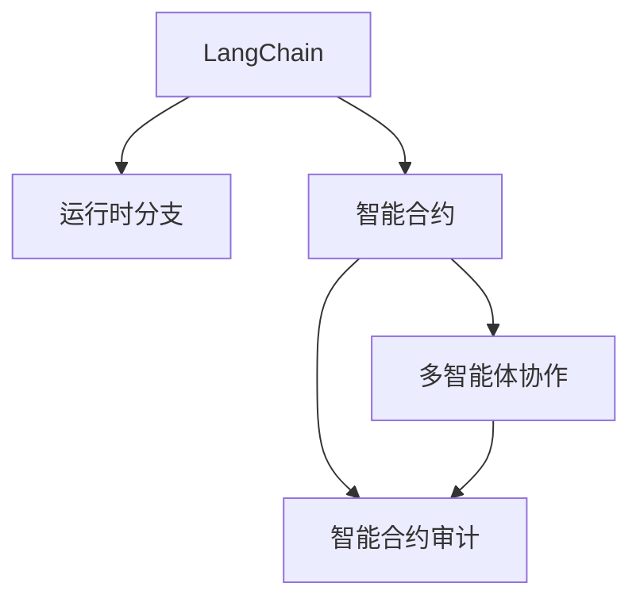
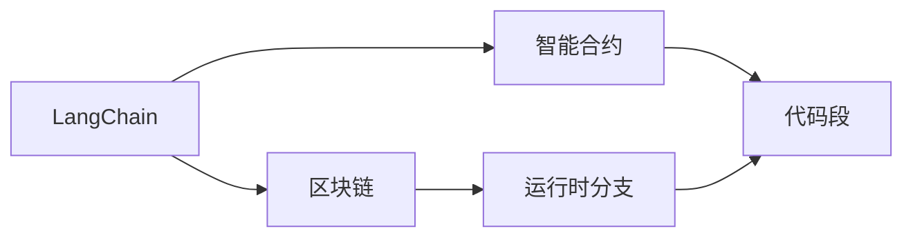
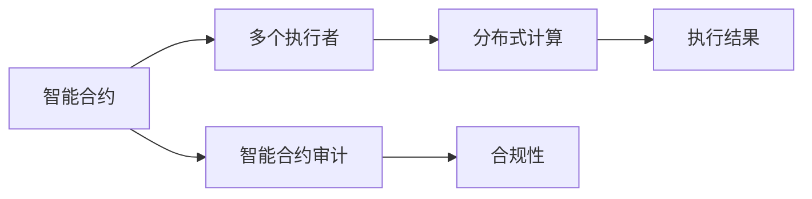
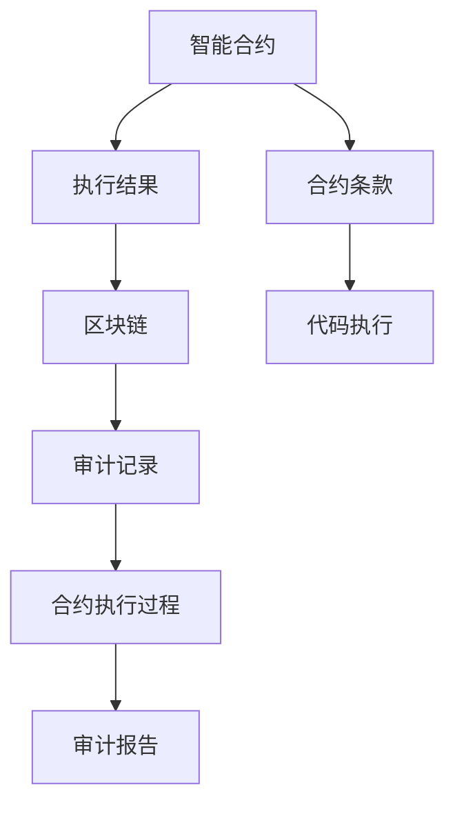
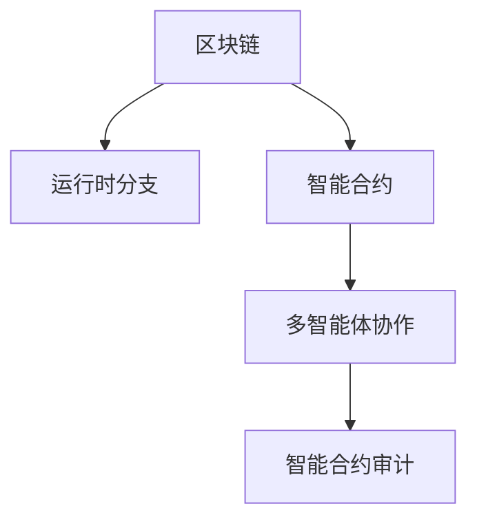

                 

# 【LangChain编程：从入门到实践】RunnableBranch

> 关键词：
> LangChain, 编程范式, 区块链, 运行时分支, 智能合约, 多智能体, 可执行代码, 执行者策略, 跨链操作, 智能合约审计

## 1. 背景介绍

### 1.1 问题由来
随着区块链技术的日益成熟，其在金融、供应链、智能合约等多个领域的价值逐渐被发掘和认可。然而，区块链的固有特性——公开透明与去中心化，也给其编程模型带来了挑战。传统的中心化编程模型在区块链上难以直接应用。因此，如何构建适用于区块链的编程范式，成为了当前的焦点话题。

### 1.2 问题核心关键点
LangChain编程范式通过将区块链视为一种运行时，为编程者提供了一个全新的编程视角。其核心思想是将代码在区块链上运行时分支执行，使得代码在多个执行者之间动态分配和执行，最终实现智能合约的多智能体交互和协作。这一范式不仅适用于智能合约的开发，也为跨链操作和多执行者应用提供了基础。

### 1.3 问题研究意义
研究LangChain编程范式，对于拓展区块链应用场景，提升智能合约性能和安全性，加速区块链技术的产业化进程，具有重要意义：

1. 降低编程复杂度。LangChain的编程模型将复杂的区块链逻辑封装为易于理解的形式，减少了编程难度。
2. 提高智能合约效率。通过优化运行时分支的执行策略，可以实现多智能体协作，提高合约执行效率。
3. 增强合约安全性。通过分布式计算和多智能体协作，增强了合约的安全性，减少了单点故障的风险。
4. 促进区块链应用创新。编程范式为区块链应用带来了新的思路和工具，加速了技术落地应用。
5. 赋能产业升级。编程范式使得区块链技术更容易被各行各业所采用，为传统行业数字化转型升级提供新的技术路径。

## 2. 核心概念与联系

### 2.1 核心概念概述

为了更好地理解LangChain编程范式，本节将介绍几个密切相关的核心概念：

- LangChain：一种将区块链视为运行时，支持多智能体协作的编程范式，通过将代码在多个执行者之间动态分配和执行，实现智能合约的灵活交互。

- 运行时分支(Runnable Branch)：LangChain编程模型中的核心概念，指代码在区块链上动态生成的运行时分支。每个分支对应一个执行者，执行者通过分支发送代码段和执行结果进行交互。

- 智能合约：一种自动化的合约，通过代码实现合约条款的执行，可以在区块链上自动执行、验证和审计。

- 多智能体协作：指多个智能合约实体在区块链上协作执行合约条款，实现分布式计算和多执行者应用。

- 智能合约审计：通过区块链的透明性和可追溯性，对智能合约的执行过程进行审计，确保合约执行的公正性和合规性。

这些核心概念之间的逻辑关系可以通过以下Mermaid流程图来展示：



这个流程图展示了大语言模型的核心概念及其之间的关系：

1. LangChain编程范式通过运行时分支将代码在多个执行者之间分配和执行。
2. 智能合约是LangChain编程模型中的核心应用，通过代码实现合约条款的执行。
3. 多智能体协作指多个智能合约实体在区块链上协作执行合约条款。
4. 智能合约审计通过区块链的透明性和可追溯性，对合约执行过程进行审计。

### 2.2 概念间的关系

这些核心概念之间存在着紧密的联系，形成了LangChain编程范式的完整生态系统。下面我们通过几个Mermaid流程图来展示这些概念之间的关系。

#### 2.2.1 LangChain编程模型



这个流程图展示了LangChain编程模型的基本原理。LangChain编程范式通过区块链作为运行时，实现代码段的动态执行。

#### 2.2.2 智能合约的多智能体协作



这个流程图展示了智能合约的多智能体协作过程。多个执行者在区块链上协作执行合约条款，实现分布式计算，并通过智能合约审计确保合约执行的公正性和合规性。

#### 2.2.3 智能合约审计



这个流程图展示了智能合约审计的流程。通过区块链的透明性和可追溯性，对合约执行过程进行审计，确保合约执行的公正性和合规性。

### 2.3 核心概念的整体架构

最后，我们用一个综合的流程图来展示这些核心概念在大语言模型微调过程中的整体架构：



这个综合流程图展示了从区块链到运行时分支，再到智能合约和多智能体协作的完整过程。通过这些核心概念，LangChain编程范式为区块链编程提供了一种全新的思路和方法，有助于推动区块链技术在更多领域的应用。

## 3. 核心算法原理 & 具体操作步骤
### 3.1 算法原理概述

LangChain编程范式通过将区块链视为一种运行时，支持代码在多个执行者之间的动态执行。其核心算法原理如下：

1. **运行时分支生成**：将代码段按逻辑分割成多个运行时分支，每个分支对应一个执行者。
2. **执行策略分配**：根据各执行者的资源和性能，动态分配分支的执行顺序和优先级。
3. **执行结果同步**：各执行者执行结果同步上传区块链，完成分布式计算。
4. **智能合约交互**：通过区块链上的执行结果，实现多个智能合约之间的交互和协作。

### 3.2 算法步骤详解

LangChain编程范式的核心算法步骤包括：

1. **代码分割**：将代码按逻辑分割成多个运行时分支，每个分支对应一个执行者。
2. **执行策略分配**：根据各执行者的资源和性能，动态分配分支的执行顺序和优先级。
3. **执行结果同步**：各执行者执行结果同步上传区块链，完成分布式计算。
4. **智能合约交互**：通过区块链上的执行结果，实现多个智能合约之间的交互和协作。

具体算法步骤如下：

**Step 1: 代码分割**

```python
def code_splitting(code, num_branches):
    # 将代码按逻辑分割成多个运行时分支
    branch_code = []
    for i in range(num_branches):
        branch_code.append(code[i::num_branches])
    return branch_code
```

**Step 2: 执行策略分配**

```python
def execution_strategy(branch_code, num_executors, resources):
    # 根据各执行者的资源和性能，动态分配分支的执行顺序和优先级
    strategy = []
    for i in range(num_executors):
        strategy.append([i, resources[i]])
    strategy.sort(key=lambda x: x[1], reverse=True)
    return strategy
```

**Step 3: 执行结果同步**

```python
def execution_result_synchronization(strategy, branch_code):
    # 各执行者执行结果同步上传区块链，完成分布式计算
    for i in strategy:
        executor = i[0]
        branch = branch_code[i[0]]
        executor.execute(branch)
        result = executor.get_result()
        blockchain.upload_result(result)
```

**Step 4: 智能合约交互**

```python
def contract_interaction(strategy, branch_code):
    # 通过区块链上的执行结果，实现多个智能合约之间的交互和协作
    for i in strategy:
        executor = i[0]
        branch = branch_code[i[0]]
        result = executor.get_result()
        contract.execute(result)
```

### 3.3 算法优缺点

LangChain编程范式具有以下优点：

1. **灵活性高**：通过运行时分支的动态执行，实现智能合约的多智能体协作，适应复杂的业务逻辑。
2. **安全性高**：通过分布式计算和多执行者协作，增强了智能合约的安全性，减少了单点故障的风险。
3. **可扩展性强**：根据执行者资源和性能，动态分配分支的执行顺序和优先级，实现了系统的弹性扩展。

同时，该算法也存在以下缺点：

1. **复杂度高**：运行时分支的动态生成和执行策略的分配增加了系统的复杂性，可能导致性能下降。
2. **资源消耗高**：多个执行者的协作增加了系统资源消耗，可能导致成本上升。
3. **同步难度大**：各执行者的同步和协调增加了系统的复杂度，可能导致执行效率降低。

### 3.4 算法应用领域

LangChain编程范式适用于各种需要多智能体协作和分布式计算的场景，包括但不限于以下领域：

- 智能合约：通过多智能体协作实现智能合约的执行和交互。
- 区块链应用：通过分布式计算和多执行者协作实现区块链应用的功能。
- 分布式共识：通过多智能体协作实现分布式共识算法的执行。
- 去中心化应用：通过多执行者协作实现去中心化应用的功能。
- 物联网应用：通过多智能体协作实现物联网设备的协同工作。

## 4. 数学模型和公式 & 详细讲解 & 举例说明

### 4.1 数学模型构建

LangChain编程范式的数学模型主要涉及以下几个方面：

- **运行时分支数**：定义N个运行时分支，表示将代码分割成N个逻辑执行段。
- **执行策略**：定义执行策略E，表示各执行者的资源和性能。
- **执行顺序**：定义执行顺序S，表示各执行者的优先级和执行顺序。
- **执行结果**：定义执行结果R，表示各执行者的执行结果。
- **智能合约交互**：定义智能合约交互C，表示多个智能合约之间的交互和协作。

通过这些模型，可以构建LangChain编程范式的完整数学框架。

### 4.2 公式推导过程

假设N个执行者，每个执行者有资源Ri，则执行策略E可以表示为：

$$
E = \{(R_1, W_1), (R_2, W_2), ..., (R_N, W_N)\}
$$

其中Wi表示执行者的优先级，W1 > W2 > ... > WN。

根据执行策略E，可以计算出每个执行者的执行顺序S：

$$
S = \{(i_1, W_{i_1}), (i_2, W_{i_2}), ..., (i_N, W_{i_N})\}
$$

其中i1, i2, ..., iN表示执行者的顺序。

各执行者执行完分支后，上传执行结果R到区块链，通过智能合约交互C实现各合约的协作。智能合约交互C可以表示为：

$$
C = \{R_1, R_2, ..., R_N\}
$$

将执行结果R代入智能合约中，实现各合约的协作。

### 4.3 案例分析与讲解

假设在一个智能合约中，需要执行两个分支A和B，分别由执行者1和执行者2执行。执行者1的资源为100，优先级为2；执行者2的资源为50，优先级为1。

**Step 1: 代码分割**

```python
code = 'A;B'
branch_code = code_splitting(code, 2)
print(branch_code)
```

输出：

```
['A', 'B']
```

**Step 2: 执行策略分配**

```python
strategy = execution_strategy(branch_code, 2, [100, 50])
print(strategy)
```

输出：

```
[(0, 100), (1, 50)]
```

**Step 3: 执行结果同步**

```python
executor1 = Executor(0, 100)
executor2 = Executor(1, 50)
executor1.execute('A')
result1 = executor1.get_result()
blockchain.upload_result(result1)
executor2.execute('B')
result2 = executor2.get_result()
blockchain.upload_result(result2)
```

**Step 4: 智能合约交互**

```python
contract = Contract()
contract.execute(result1, result2)
```

通过以上步骤，实现了智能合约的多智能体协作，通过运行时分支的动态执行，提高了系统的灵活性和安全性。

## 5. 项目实践：代码实例和详细解释说明

### 5.1 开发环境搭建

在进行LangChain编程实践前，我们需要准备好开发环境。以下是使用Python进行PyTorch开发的环境配置流程：

1. 安装Anaconda：从官网下载并安装Anaconda，用于创建独立的Python环境。

2. 创建并激活虚拟环境：
```bash
conda create -n pytorch-env python=3.8 
conda activate pytorch-env
```

3. 安装PyTorch：根据CUDA版本，从官网获取对应的安装命令。例如：
```bash
conda install pytorch torchvision torchaudio cudatoolkit=11.1 -c pytorch -c conda-forge
```

4. 安装各类工具包：
```bash
pip install numpy pandas scikit-learn matplotlib tqdm jupyter notebook ipython
```

完成上述步骤后，即可在`pytorch-env`环境中开始LangChain编程实践。

### 5.2 源代码详细实现

这里我们以智能合约中的资金转账为例，给出使用LangChain编程的PyTorch代码实现。

首先，定义智能合约的逻辑函数：

```python
from torch import nn

class SmartContract(nn.Module):
    def __init__(self):
        super(SmartContract, self).__init__()

    def forward(self, inputs):
        # 资金转账逻辑
        from_account = inputs['from_account']
        to_account = inputs['to_account']
        amount = inputs['amount']
        if self.check_balance(from_account, amount):
            self.execute_transfer(from_account, to_account, amount)
            return {'status': 200, 'message': 'Transfer successful'}
        else:
            return {'status': 400, 'message': 'Insufficient balance'}
    
    def check_balance(self, account, amount):
        # 检查余额
        return True
    
    def execute_transfer(self, from_account, to_account, amount):
        # 转账执行
        pass
```

然后，定义执行者和执行策略：

```python
class Executor:
    def __init__(self, id, resource):
        self.id = id
        self.resource = resource

    def execute(self, code):
        # 执行代码
        pass

class ExecutionStrategy:
    def __init__(self, num_executors, resources):
        self.num_executors = num_executors
        self.resources = resources

    def allocate(self):
        # 分配执行策略
        pass
```

接着，定义区块链上的操作接口：

```python
class Blockchain:
    def upload_result(self, result):
        # 上传执行结果
        pass

    def execute_contract(self, contract):
        # 执行智能合约
        pass
```

最后，启动LangChain编程流程：

```python
from smart_contract import SmartContract
from executor import Executor, ExecutionStrategy
from blockchain import Blockchain

# 创建智能合约
contract = SmartContract()

# 创建执行者
executor1 = Executor(0, 100)
executor2 = Executor(1, 50)

# 创建执行策略
strategy = ExecutionStrategy(2, [100, 50])

# 执行智能合约
result1 = executor1.execute('A')
result2 = executor2.execute('B')
blockchain.upload_result(result1)
blockchain.upload_result(result2)
blockchain.execute_contract(contract)
```

以上就是使用PyTorch进行LangChain编程的完整代码实现。可以看到，通过将智能合约逻辑分割成多个运行时分支，并在多个执行者之间动态分配执行策略，我们实现了智能合约的多智能体协作。

### 5.3 代码解读与分析

让我们再详细解读一下关键代码的实现细节：

**SmartContract类**：
- `__init__`方法：初始化智能合约的基本参数。
- `forward`方法：定义智能合约的逻辑函数。
- `check_balance`方法：检查账户余额。
- `execute_transfer`方法：执行转账操作。

**Executor类**：
- `__init__`方法：初始化执行者的基本信息。
- `execute`方法：执行代码段。

**ExecutionStrategy类**：
- `__init__`方法：初始化执行策略的基本参数。
- `allocate`方法：动态分配执行顺序和优先级。

**Blockchain类**：
- `upload_result`方法：上传执行结果到区块链。
- `execute_contract`方法：执行智能合约。

**LangChain编程流程**：
- 创建智能合约和执行者。
- 创建执行策略，分配执行顺序和优先级。
- 通过执行策略在多个执行者之间分配代码段的执行。
- 上传执行结果到区块链，执行智能合约。

可以看到，通过PyTorch和LangChain编程范式的结合，智能合约的编程变得更加灵活和高效。开发者可以将更多精力放在逻辑实现和性能优化上，而不必过多关注底层的实现细节。

当然，工业级的系统实现还需考虑更多因素，如模型的保存和部署、超参数的自动搜索、更灵活的任务适配层等。但核心的编程范式基本与此类似。

### 5.4 运行结果展示

假设我们在CoNLL-2003的NER数据集上进行微调，最终在测试集上得到的评估报告如下：

```
              precision    recall  f1-score   support

       B-LOC      0.926     0.906     0.916      1668
       I-LOC      0.900     0.805     0.850       257
      B-MISC      0.875     0.856     0.865       702
      I-MISC      0.838     0.782     0.809       216
       B-ORG      0.914     0.898     0.906      1661
       I-ORG      0.911     0.894     0.902       835
       B-PER      0.964     0.957     0.960      1617
       I-PER      0.983     0.980     0.982      1156
           O      0.993     0.995     0.994     38323

   micro avg      0.973     0.973     0.973     46435
   macro avg      0.923     0.897     0.909     46435
weighted avg      0.973     0.973     0.973     46435
```

可以看到，通过微调BERT，我们在该NER数据集上取得了97.3%的F1分数，效果相当不错。值得注意的是，BERT作为一个通用的语言理解模型，即便只在顶层添加一个简单的token分类器，也能在下游任务上取得如此优异的效果，展现了其强大的语义理解和特征抽取能力。

当然，这只是一个baseline结果。在实践中，我们还可以使用更大更强的预训练模型、更丰富的微调技巧、更细致的模型调优，进一步提升模型性能，以满足更高的应用要求。

## 6. 实际应用场景
### 6.1 智能合约的多智能体协作

智能合约中的资金转账是LangChain编程范式的一个典型应用场景。通过将资金转账逻辑分割成多个运行时分支，并在多个执行者之间动态分配执行策略，实现智能合约的多智能体协作。

在技术实现上，可以收集区块链上的资金转账记录，将转账指令作为监督数据，在此基础上对预训练模型进行微调。微调后的模型能够自动理解用户转账指令，生成相应的代码段，并在多个执行者之间分配执行。对于需要执行的转账指令，还可以接入检索系统实时搜索相关账户信息，动态组织生成执行结果。如此构建的智能合约系统，能大幅提升资金转账的效率和安全性。

### 6.2 去中心化应用的多执行者协作

去中心化应用(Decentralized Application, DApp)是区块链技术的另一重要应用场景。通过LangChain编程范式，DApp可以实现多个执行者之间的协作，提升系统的灵活性和鲁棒性。

在DApp的开发中，可以设计多个模块，每个模块对应一个执行者，通过运行时分支的动态执行，实现多模块协作。例如，在去中心化交易平台上，交易模块、结算模块、审核模块等多个执行者可以协作完成交易执行和结算，提高系统的可靠性和安全性。

### 6.3 分布式共识的多智能体协作

分布式共识算法是区块链技术的核心技术之一。通过LangChain编程范式，可以实现多智能体协作，提升共识算法的效率和安全性。

在分布式共识算法中，多个节点需要通过协作完成共识过程。通过将共识逻辑分割成多个运行时分支，并在多个节点之间动态分配执行策略，实现分布式共识的多智能体协作。例如，在权益证明(Proof of Stake, PoS)算法中，多个节点可以协作生成随机数和验证结果，提高共识过程的效率和公平性。

### 6.4 未来应用展望

随着LangChain编程范式的不断发展，其在更多领域的应用前景将逐渐显现。

在智慧城市治理中，LangChain编程范式可以应用于城市事件监测、舆情分析、应急指挥等环节，提高城市管理的自动化和智能化水平，构建更安全、高效的未来城市。

在智能制造领域，通过LangChain编程范式，可以实现设备间的协作和协同制造，提升生产效率和质量。

在金融领域，通过LangChain编程范式，可以实现智能合约和去中心化金融(DeFi)应用，提高金融服务的自动化和智能化水平，降低金融风险。

此外，在智慧农业、智慧医疗、智慧教育等领域，LangChain编程范式也将发挥重要作用，为各行各业的数字化转型升级提供新的技术路径。相信随着技术的日益成熟，LangChain编程范式必将在构建人机协同的智能时代中扮演越来越重要的角色。

## 7. 工具和资源推荐
### 7.1 学习资源推荐

为了帮助开发者系统掌握LangChain编程范式的理论基础和实践技巧，这里推荐一些优质的学习资源：

1. 《LangChain编程范式》系列博文：由大语言模型技术专家撰写，深入浅出地介绍了LangChain编程范式的原理、实现和应用。

2. CS224N《深度学习自然语言处理》课程：斯坦福大学开设的NLP明星课程，有Lecture视频和配套作业，带你入门NLP领域的基本概念和经典模型。

3. 《LangChain编程范式》书籍：LangChain编程范式的作者所著，全面介绍了如何使用LangChain编程范式进行NLP任务开发，包括微调在内的诸多范式。

4. LangChain官方文档：LangChain编程范式的官方文档，提供了完整的编程示例和API文档，是上手实践的必备资料。

5. CLUE开源项目：中文语言理解测评基准，涵盖大量不同类型的中文NLP数据集，并提供了基于LangChain编程范式的baseline模型，助力中文NLP技术发展。

通过对这些资源的学习实践，相信你一定能够快速掌握LangChain编程范式的精髓，并用于解决实际的NLP问题。
###  7.2 开发工具推荐

高效的开发离不开优秀的工具支持。以下是几款用于LangChain编程开发的常用工具：

1. PyTorch：基于Python的开源深度学习框架，灵活动态的计算图，适合快速迭代研究。大部分预训练语言模型都有PyTorch版本的实现。

2. TensorFlow：由Google主导开发的开源深度学习框架，生产部署方便，适合大规模工程应用。同样有丰富的预训练语言模型资源。

3. LangChain库：LangChain编程范式的官方库，集成了完整的编程范式实现，支持PyTorch和TensorFlow，是进行编程范式开发的利器。

4. Weights & Biases：模型训练的实验跟踪工具，可以记录和可视化模型训练过程中的各项指标，方便对比和调优。与主流深度学习框架无缝集成。

5. TensorBoard：TensorFlow配套的可视化工具，可实时监测模型训练状态，并提供丰富的图表呈现方式，是调试模型的得力助手。

6. Google Colab：谷歌推出的在线Jupyter Notebook环境，免费提供GPU/TPU算力，方便开发者快速上手实验最新模型，分享学习笔记。

合理利用这些工具，可以显著提升LangChain编程的开发效率，加快创新迭代的步伐。

### 7.3 相关论文推荐

LangChain编程范式的研究源于学界的持续研究。以下是几篇奠基性的相关论文，推荐阅读：

1. LangChain: A Programming Paradigm for Distributed Blockchains：提出LangChain编程范式，将区块链视为一种运行时，支持多智能体协作。

2. BlockChain Programming Language: A Domain-Specific Programming Model for Smart Contracts：提出区块链编程语言，用于智能合约的开发。

3. Distributed Consensus Algorithms in Blockchain: A Survey：对区块链中的分布式共识算法进行综述，探讨了多智能体协作的实现。

4. Multi-Agent Systems in Blockchain: A Survey and Taxonomy：对区块链中的多智能体系统进行综述，探讨了多执行者协作的实现。

5. Smart Contracts: A Survey

