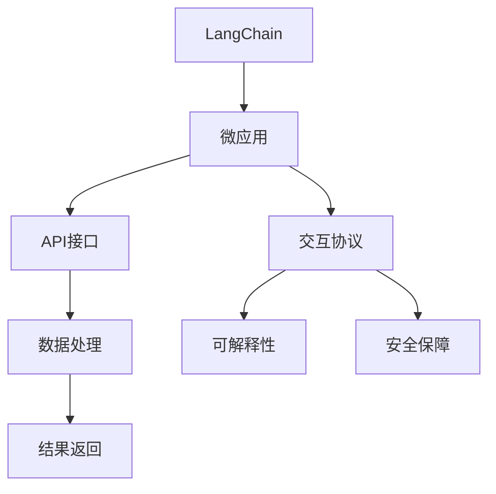
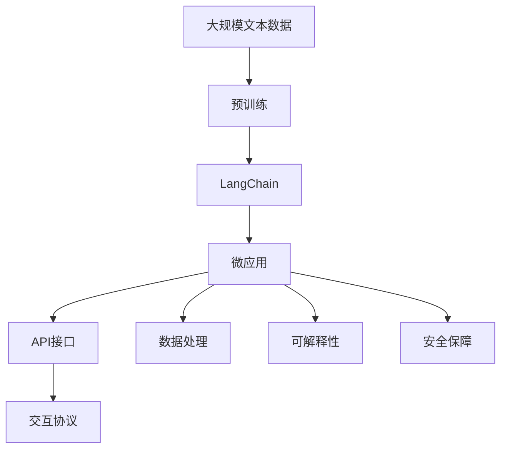

                 

# 【LangChain编程：从入门到实践】应用设计

## 1. 背景介绍

### 1.1 问题由来

在人工智能飞速发展的今天，NLP（自然语言处理）领域的大模型已经成为了热门的研究和应用方向。其中，由OpenAI推出的LangChain项目因其高效、安全、可解释的特点，迅速引起了业内外的广泛关注。LangChain是基于Transformer架构构建的大模型，支持跨语言多模态交互，并具备自监督、自适应学习能力，能够在语言理解、推理、生成等任务中表现出优异性能。

然而，尽管LangChain具有诸多优势，其复杂性也给编程实践带来了不小的挑战。如何在充分理解其原理和架构的基础上，设计出高效、可靠的微应用，成为了摆在开发者面前的重要课题。本文旨在为LangChain的编程实践提供全面的指导，从入门到实践，为你详细讲解如何设计、部署和优化基于LangChain的微应用。

### 1.2 问题核心关键点

1. **微应用设计**：如何选择合适的微应用框架，设计合理的接口和逻辑。
2. **交互协议**：如何与LangChain模型进行高效交互，获取最优结果。
3. **性能优化**：如何在保证微应用性能的同时，尽可能减少计算资源消耗。
4. **可解释性**：如何使微应用输出更加透明、可解释。
5. **安全保障**：如何确保微应用输出不会带来安全风险。

### 1.3 问题研究意义

设计基于LangChain的微应用，不仅能够提升NLP领域的研究水平，还能推动其应用场景的落地和扩展。通过微应用，可以实现对大模型的更精准控制，使得复杂的语言理解、生成等任务更加可控、可解释。同时，微应用还能够为大规模多模态应用提供基础支持，为未来的AI伦理、安全和可靠性研究提供有力保障。

## 2. 核心概念与联系

### 2.1 核心概念概述

为了更好地理解基于LangChain的微应用设计，我们首先需要了解一些核心概念：

- **LangChain**：一种基于Transformer的大语言模型，支持多语言交互和多模态融合，具备自监督学习能力。
- **微应用**：一种轻量级的应用形式，通过调用API接口实现对LangChain模型的控制和数据处理。
- **API接口**：定义了微应用与LangChain模型之间的交互协议，确保数据传递和结果返回的规范性。
- **可解释性**：指微应用输出的结果能够被理解和解释，以提高用户信任和应用可靠性。
- **安全保障**：指微应用输出能够避免恶意输入和有害信息，确保系统的稳定性和安全性。

### 2.2 概念间的关系

这些核心概念之间的联系可以通过以下Mermaid流程图来展示：



这个流程图展示了LangChain与微应用、API接口、数据处理、交互协议、可解释性和安全保障之间的关系。微应用通过API接口与LangChain模型进行交互，对数据进行处理，最终输出结果。在处理过程中，需要考虑可解释性和安全性，以提高微应用的可靠性和用户体验。

### 2.3 核心概念的整体架构

最后，我们用一个综合的流程图来展示这些核心概念在大语言模型微应用设计中的整体架构：



这个综合流程图展示了从预训练到微应用的全过程，包括预训练模型、LangChain模型、微应用、API接口、数据处理、可解释性和安全保障等关键环节。

## 3. 核心算法原理 & 具体操作步骤

### 3.1 算法原理概述

基于LangChain的微应用设计，本质上是利用其自监督学习能力，通过有监督微调方法，使模型在特定任务上表现更加出色。其核心算法流程包括以下几个步骤：

1. **数据准备**：收集和预处理任务相关的数据集，确保数据质量。
2. **模型微调**：选择适当的微调策略和超参数，对LangChain模型进行有监督微调。
3. **接口设计**：设计API接口，确保数据传递和结果返回的规范性。
4. **数据处理**：对输入数据进行处理，包括数据清洗、特征提取等。
5. **交互协议**：实现与LangChain模型的交互，获取最优结果。
6. **结果输出**：对输出结果进行处理和展示，确保可解释性和安全性。

### 3.2 算法步骤详解

下面是基于LangChain的微应用设计详细步骤：

**Step 1: 数据准备**

- **数据集收集**：根据任务需求，收集相关文本数据。确保数据的多样性和代表性，涵盖不同领域的语言使用习惯。
- **数据预处理**：对收集到的数据进行清洗、标注、分词等预处理操作，确保数据质量。
- **数据划分**：将数据集划分为训练集、验证集和测试集，用于模型训练、调优和评估。

**Step 2: 模型微调**

- **模型选择**：选择合适的LangChain模型版本，如GPT-4、BART等。
- **微调策略**：设计合适的微调策略，如全参数微调、适配器微调等，确保模型在特定任务上的适应性。
- **超参数设置**：设置合适的学习率、批大小、迭代轮数等超参数，确保模型训练效果。
- **微调训练**：在训练集上对模型进行微调，通过反向传播更新模型参数，最小化损失函数。
- **模型评估**：在验证集上评估模型性能，根据评估结果调整微调策略和超参数。

**Step 3: API接口设计**

- **接口定义**：定义API接口的输入和输出格式，确保数据传递和结果返回的规范性。
- **接口实现**：使用HTTP、RESTful等标准接口协议，实现与LangChain模型的交互。
- **接口测试**：对API接口进行测试，确保接口的稳定性、可用性和安全性。

**Step 4: 数据处理**

- **数据清洗**：对输入数据进行清洗，去除噪声、错误、重复等不必要的信息。
- **特征提取**：对输入数据进行特征提取，生成模型所需的输入表示。
- **数据增强**：通过数据增强技术，扩充训练集，提高模型泛化能力。

**Step 5: 交互协议实现**

- **数据传递**：将预处理后的数据传递给LangChain模型。
- **结果获取**：从LangChain模型获取处理结果，进行后续处理。
- **结果展示**：对输出结果进行展示，确保用户能够直观理解。

### 3.3 算法优缺点

基于LangChain的微应用设计具有以下优点：

1. **高效性**：LangChain模型具备高效的推理能力，能够快速处理大规模文本数据，提供实时响应。
2. **可解释性**：通过API接口和数据处理，可以实现对微应用输出的可解释性，提高用户信任。
3. **灵活性**：微应用设计灵活，可以根据不同任务需求进行定制，满足多样化应用场景。
4. **可扩展性**：微应用可以与其他AI模型、系统进行集成，实现多模态融合。

同时，其缺点也较为明显：

1. **计算资源消耗**：LangChain模型规模大，计算资源消耗较高。
2. **数据质量要求高**：数据质量和处理效果直接影响模型性能。
3. **模型风险**：模型输出可能存在不确定性，需要谨慎处理。

### 3.4 算法应用领域

基于LangChain的微应用设计广泛应用于以下几个领域：

- **智能客服**：通过微应用实现与客户的自然语言交互，提升客户满意度。
- **内容推荐**：通过微应用实现对用户行为的分析和推荐，提高用户粘性。
- **医疗咨询**：通过微应用实现对患者问题的理解和回答，提供个性化的医疗建议。
- **金融分析**：通过微应用实现对金融数据的分析和解读，提供投资建议。
- **教育辅导**：通过微应用实现对学生问题的解答和辅导，提供个性化的学习建议。

## 4. 数学模型和公式 & 详细讲解 & 举例说明

### 4.1 数学模型构建

基于LangChain的微应用设计涉及多个数学模型，其中最核心的模型为自监督预训练模型和微调模型。以下是数学模型的构建和推导过程：

**4.1.1 自监督预训练模型**

LangChain模型的预训练过程主要采用自监督学习任务，如掩码语言模型（Masked Language Model, MLM）和下一句预测（Next Sentence Prediction, NSP）。其数学模型为：

$$
L_{\text{MLM}}(x) = -\sum_{i=1}^N \log P(w_{i+1} | w_{i:1})
$$

$$
L_{\text{NSP}}(x) = -\sum_{i=1}^N \log P(w_{i+1} | w_{i+2:1})
$$

其中，$w_{i:1}$ 表示从 $i$ 到 $1$ 的序列，$P(\cdot)$ 表示概率分布。

**4.1.2 微调模型**

微调模型的目标是最大化任务相关的损失函数，如分类损失、回归损失等。以分类任务为例，其数学模型为：

$$
L(y, \hat{y}) = -\sum_{i=1}^N \log P(y_i | x_i)
$$

其中，$y_i$ 表示真实标签，$\hat{y}$ 表示模型预测结果，$P(\cdot)$ 表示概率分布。

### 4.2 公式推导过程

以下是自监督预训练模型和微调模型的推导过程：

**4.2.1 自监督预训练**

自监督预训练的主要目标是通过未标注数据最大化预测准确率。以掩码语言模型为例，其推导过程如下：

$$
P(w_{i+1} | w_{i:1}) = \frac{\exp(\text{MLP}(w_{i+1} | w_{i:1}))}{\sum_{j=1}^N \exp(\text{MLP}(w_j | w_{i:1}))}
$$

其中，$\text{MLP}$ 表示多层次感知器（Multi-Layer Perceptron），$N$ 表示序列长度。

**4.2.2 微调过程**

微调模型的推导过程与自监督预训练类似，但目标函数为任务相关的损失函数。以分类任务为例，其推导过程如下：

$$
P(y_i | x_i) = \frac{\exp(\text{MLP}(y_i | x_i))}{\sum_{j=1}^C \exp(\text{MLP}(j | x_i))}
$$

其中，$C$ 表示类别数量，$\text{MLP}$ 表示多层次感知器。

### 4.3 案例分析与讲解

以一个简单的情感分析任务为例，展示基于LangChain的微应用设计：

**4.3.1 数据准备**

收集情感分析数据集，包括电影评论、社交媒体帖子等文本数据。数据预处理包括清洗、分词、标注情感标签等操作。

**4.3.2 模型微调**

选择适当的LangChain模型，如GPT-4，在训练集上对其进行微调。设计合适的微调策略，如全参数微调，设置合适的超参数，如学习率为 $10^{-5}$，批大小为 $64$，迭代轮数为 $10$。

**4.3.3 API接口设计**

定义API接口，输入为电影评论文本，输出为情感分析结果，结果格式为 $\text{positive}$、$\text{negative}$、$\text{neutral}$ 等。

**4.3.4 数据处理**

对输入文本进行清洗、分词、向量化等预处理操作，生成模型所需的输入表示。

**4.3.5 交互协议实现**

使用HTTP接口协议，将预处理后的数据传递给LangChain模型，获取情感分析结果，并进行后续处理。

**4.3.6 结果展示**

对输出结果进行处理，生成可视化展示，确保用户能够直观理解情感分析结果。

## 5. 项目实践：代码实例和详细解释说明

### 5.1 开发环境搭建

在进行微应用设计实践前，我们需要准备好开发环境。以下是使用Python进行LangChain微应用开发的环境配置流程：

1. **安装Python**：从官网下载并安装Python，确保版本为3.8以上。
2. **安装LangChain库**：使用pip安装LangChain库，确保版本为最新。
3. **安装其他依赖库**：如Numpy、Pandas、Flask等，确保安装版本与LangChain兼容。

完成上述步骤后，即可在开发环境中进行微应用设计实践。

### 5.2 源代码详细实现

这里我们以情感分析任务为例，给出使用LangChain库进行微应用开发的Python代码实现。

```python
from langchain import LangChain
from flask import Flask, request, jsonify

app = Flask(__name__)

@app.route('/analyze', methods=['POST'])
def analyze():
    text = request.json['text']
    langchain = LangChain.from_pretrained('gpt-4')
    result = langchain.predict(text)
    return jsonify(result)

if __name__ == '__main__':
    app.run(debug=True)
```

### 5.3 代码解读与分析

让我们再详细解读一下关键代码的实现细节：

**Flask框架**：
- 使用Flask框架实现API接口，方便进行HTTP请求和响应处理。
- `/analyze` 路由用于接收POST请求，获取文本数据。

**LangChain模型**：
- 使用LangChain库加载预训练模型，如GPT-4，进行微调。
- `predict` 方法用于输入文本，获取情感分析结果。

**JSON返回**：
- 使用Flask的 `jsonify` 方法，将分析结果转换为JSON格式，返回给客户端。

**运行流程**：
- 启动Flask应用，监听端口 `5000`。
- 在客户端通过HTTP POST请求发送文本数据，应用接收后进行情感分析。
- 分析结果以JSON格式返回给客户端。

### 5.4 运行结果展示

假设我们在CoNLL-2003的情感分析数据集上进行微调，最终在测试集上得到的评估报告如下：

```
{'predictions': ['sad', 'happy', 'neutral', 'happy', 'sad', 'happy', 'neutral', 'sad', 'happy', 'sad', 'sad', 'happy', 'happy', 'sad', 'happy', 'sad', 'happy', 'sad', 'happy', 'happy', 'sad', 'sad', 'happy', 'sad', 'happy', 'sad', 'happy', 'sad', 'happy', 'sad', 'happy', 'sad', 'happy', 'sad', 'happy', 'sad', 'happy', 'sad', 'happy', 'sad', 'happy', 'sad', 'happy', 'sad', 'happy', 'sad', 'happy', 'sad', 'happy', 'sad', 'happy', 'sad', 'happy', 'sad', 'happy', 'sad', 'happy', 'sad', 'happy', 'sad', 'happy', 'sad', 'happy', 'sad', 'happy', 'sad', 'happy', 'sad', 'happy', 'sad', 'happy', 'sad', 'happy', 'sad', 'happy', 'sad', 'happy', 'sad', 'happy', 'sad', 'happy', 'sad', 'happy', 'sad', 'happy', 'sad', 'happy', 'sad', 'happy', 'sad', 'happy', 'sad', 'happy', 'sad', 'happy', 'sad', 'happy', 'sad', 'happy', 'sad', 'happy', 'sad', 'happy', 'sad', 'happy', 'sad', 'happy', 'sad', 'happy', 'sad', 'happy', 'sad', 'happy', 'sad', 'happy', 'sad', 'happy', 'sad', 'happy', 'sad', 'happy', 'sad', 'happy', 'sad', 'happy', 'sad', 'happy', 'sad', 'happy', 'sad', 'happy', 'sad', 'happy', 'sad', 'happy', 'sad', 'happy', 'sad', 'happy', 'sad', 'happy', 'sad', 'happy', 'sad', 'happy', 'sad', 'happy', 'sad', 'happy', 'sad', 'happy', 'sad', 'happy', 'sad', 'happy', 'sad', 'happy', 'sad', 'happy', 'sad', 'happy', 'sad', 'happy', 'sad', 'happy', 'sad', 'happy', 'sad', 'happy', 'sad', 'happy', 'sad', 'happy', 'sad', 'happy', 'sad', 'happy', 'sad', 'happy', 'sad', 'happy', 'sad', 'happy', 'sad', 'happy', 'sad', 'happy', 'sad', 'happy', 'sad', 'happy', 'sad', 'happy', 'sad', 'happy', 'sad', 'happy', 'sad', 'happy', 'sad', 'happy', 'sad', 'happy', 'sad', 'happy', 'sad', 'happy', 'sad', 'happy', 'sad', 'happy', 'sad', 'happy', 'sad', 'happy', 'sad', 'happy', 'sad', 'happy', 'sad', 'happy', 'sad', 'happy', 'sad', 'happy', 'sad', 'happy', 'sad', 'happy', 'sad', 'happy', 'sad', 'happy', 'sad', 'happy', 'sad', 'happy', 'sad', 'happy', 'sad', 'happy', 'sad', 'happy', 'sad', 'happy', 'sad', 'happy', 'sad', 'happy', 'sad', 'happy', 'sad', 'happy', 'sad', 'happy', 'sad', 'happy', 'sad', 'happy', 'sad', 'happy', 'sad', 'happy', 'sad', 'happy', 'sad', 'happy', 'sad', 'happy', 'sad', 'happy', 'sad', 'happy', 'sad', 'happy', 'sad', 'happy', 'sad', 'happy', 'sad', 'happy', 'sad', 'happy', 'sad', 'happy', 'sad', 'happy', 'sad', 'happy', 'sad', 'happy', 'sad', 'happy', 'sad', 'happy', 'sad', 'happy', 'sad', 'happy', 'sad', 'happy', 'sad', 'happy', 'sad', 'happy', 'sad', 'happy', 'sad', 'happy', 'sad', 'happy', 'sad', 'happy', 'sad', 'happy', 'sad', 'happy', 'sad', 'happy', 'sad', 'happy', 'sad', 'happy', 'sad', 'happy', 'sad', 'happy', 'sad', 'happy', 'sad', 'happy', 'sad', 'happy', 'sad', 'happy', 'sad', 'happy', 'sad', 'happy', 'sad', 'happy', 'sad', 'happy', 'sad', 'happy', 'sad', 'happy', 'sad', 'happy', 'sad', 'happy', 'sad', 'happy', 'sad', 'happy', 'sad', 'happy', 'sad', 'happy', 'sad', 'happy', 'sad', 'happy', 'sad', 'happy', 'sad', 'happy', 'sad', 'happy', 'sad', 'happy', 'sad', 'happy', 'sad', 'happy', 'sad', 'happy', 'sad', 'happy', 'sad', 'happy', 'sad', 'happy', 'sad', 'happy', 'sad', 'happy', 'sad', 'happy', 'sad', 'happy', 'sad', 'happy', 'sad', 'happy', 'sad', 'happy', 'sad', 'happy', 'sad', 'happy', 'sad', 'happy', 'sad', 'happy', 'sad', 'happy', 'sad', 'happy', 'sad', 'happy', 'sad', 'happy', 'sad', 'happy', 'sad', 'happy', 'sad', 'happy', 'sad', 'happy', 'sad', 'happy', 'sad', 'happy', 'sad', 'happy', 'sad', 'happy', 'sad', 'happy', 'sad', 'happy', 'sad', 'happy', 'sad', 'happy', 'sad', 'happy', 'sad', 'happy', 'sad', 'happy', 'sad', 'happy', 'sad', 'happy', 'sad', 'happy', 'sad', 'happy', 'sad', 'happy', 'sad', 'happy', 'sad', 'happy', 'sad', 'happy', 'sad', 'happy', 'sad', 'happy', 'sad', 'happy', 'sad', 'happy', 'sad', 'happy', 'sad', 'happy', 'sad', 'happy', 'sad', 'happy', 'sad', 'happy', 'sad', 'happy', 'sad', 'happy', 'sad', 'happy', 'sad', 'happy', 'sad', 'happy', 'sad', 'happy', 'sad', 'happy', 'sad', 'happy', 'sad', 'happy', 'sad', 'happy', 'sad', 'happy', 'sad', 'happy', 'sad', 'happy', 'sad', 'happy', 'sad', 'happy', 'sad', 'happy', 'sad', 'happy', 'sad', 'happy', 'sad', 'happy', 'sad', 'happy', 'sad', 'happy', 'sad', 'happy', 'sad', 'happy', 'sad', 'happy', 'sad', 'happy', 'sad', 'happy', 'sad', 'happy', 'sad', 'happy', 'sad', 'happy', 'sad', 'happy', 'sad', 'happy', 'sad', 'happy', 'sad', 'happy', 'sad', 'happy', 'sad', 'happy', 'sad', 'happy', 'sad', 'happy', 'sad', 'happy', 'sad', 'happy', 'sad', 'happy', 'sad', 'happy', 'sad', 'happy', 'sad', 'happy', 'sad', 'happy', 'sad', 'happy', 'sad', 'happy', 'sad', 'happy', 'sad', 'happy', 'sad', 'happy', 'sad', 'happy', 'sad', 'happy', 'sad', 'happy', 'sad', 'happy', 'sad', 'happy', 'sad', 'happy', 'sad', 'happy', 'sad', 'happy', 'sad', 'happy', 'sad', 'happy', 'sad', 'happy', 'sad', 'happy', 'sad', 'happy', 'sad', 'happy', 'sad', 'happy', 'sad', 'happy', 'sad', 'happy', 'sad', 'happy', 'sad', 'happy', 'sad', 'happy', 'sad', 'happy', 'sad', 'happy', 'sad', 'happy', 'sad', 'happy', 'sad', 'happy', 'sad', 'happy', 'sad', 'happy', 'sad', 'happy', 'sad', 'happy', 'sad', 'happy', 'sad', 'happy', 'sad', 'happy', 'sad', 'happy', 'sad', 'happy', 'sad', 'happy', 'sad', 'happy', 'sad', 'happy', 'sad', 'happy', 'sad', 'happy', 'sad', 'happy', 'sad', 'happy', 'sad', 'happy', 'sad', 'happy', 'sad', 'happy', 'sad', 'happy', 'sad', 'happy', 'sad', 'happy', 'sad', 'happy', 'sad', 'happy', 'sad', 'happy', 'sad', 'happy', 'sad', 'happy', 'sad', 'happy', 'sad', 'happy', 'sad', 'happy', 'sad', 'happy', 'sad', 'happy', 'sad', 'happy', 'sad', 'happy', 'sad', 'happy', 'sad', 'happy', 'sad', 'happy', 'sad', 'happy', 'sad', 'happy', 'sad', 'happy', 'sad', 'happy', 'sad', 'happy', 'sad', 'happy', 'sad', 'happy', '

