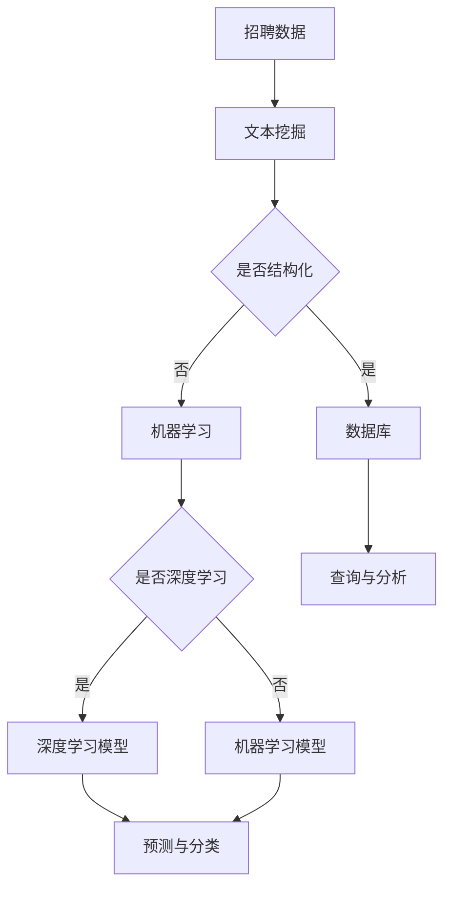

# 基于大数据的招聘数据能分析与应用

> 关键词：招聘数据分析，大数据，机器学习，人力资源，人才挖掘，预测分析，可视化

## 1. 背景介绍

随着互联网和大数据技术的飞速发展，招聘领域也经历了深刻的变革。传统的招聘方式主要依赖于人工筛选简历、电话面试等手段，效率低下，且难以准确评估候选人的能力和潜力。而大数据技术的应用为招聘领域带来了新的机遇，通过对海量招聘数据的深度分析，可以为招聘决策提供科学依据，提高招聘效率和质量。

### 1.1 问题的由来

招聘过程中的挑战主要包括：

- **简历筛选效率低**：简历数量庞大，人工筛选耗时费力，且容易漏掉优秀人才。
- **人才评估不准确**：传统的面试方法难以全面评估候选人的技能和潜力。
- **招聘成本高**：招聘周期长，招聘成本高，且人才流失率较高。

### 1.2 研究现状

近年来，基于大数据的招聘数据分析在学术界和工业界都得到了广泛的研究和应用。研究者们提出了许多有效的算法和技术，如文本挖掘、机器学习、深度学习等，用于分析招聘数据，提高招聘效率和质量。

### 1.3 研究意义

基于大数据的招聘数据分析具有以下重要意义：

- **提高招聘效率**：通过自动化筛选简历，缩短招聘周期。
- **优化人才评估**：利用数据挖掘技术，全面评估候选人能力。
- **降低招聘成本**：减少人力投入，降低招聘成本。
- **提升人才匹配度**：提高人才与岗位的匹配度，降低人才流失率。

### 1.4 本文结构

本文将围绕基于大数据的招聘数据分析与应用展开，具体内容包括：

- 核心概念与联系
- 核心算法原理与具体操作步骤
- 数学模型和公式
- 项目实践
- 实际应用场景
- 工具和资源推荐
- 总结与展望

## 2. 核心概念与联系

### 2.1 核心概念

- **招聘数据**：包括职位描述、候选人简历、面试记录、绩效考核数据等。
- **文本挖掘**：从非结构化的文本数据中提取结构化信息。
- **机器学习**：利用算法从数据中学习规律，进行预测和分类。
- **深度学习**：一种特殊的机器学习算法，通过多层神经网络进行特征提取和学习。

### 2.2 核心概念原理和架构的 Mermaid 流程图



## 3. 核心算法原理 & 具体操作步骤

### 3.1 算法原理概述

基于大数据的招聘数据分析主要分为以下几个步骤：

1. **数据收集**：收集招聘过程中的各类数据，如职位描述、简历、面试记录等。
2. **数据预处理**：对收集到的数据进行清洗、去重、转换等预处理操作，使其适合后续分析。
3. **文本挖掘**：利用文本挖掘技术，从非结构化的简历文本中提取结构化信息，如技能、经验、教育背景等。
4. **特征工程**：根据业务需求，从原始数据中提取对招聘决策有用的特征。
5. **模型训练**：选择合适的机器学习或深度学习模型，对特征进行训练，构建预测模型。
6. **模型评估**：使用测试数据评估模型的性能，并根据评估结果调整模型参数。
7. **模型部署**：将训练好的模型部署到实际应用中，进行招聘决策。

### 3.2 算法步骤详解

**3.2.1 数据收集**

数据收集是招聘数据分析的基础，常见的招聘数据来源包括：

- **企业内部数据**：职位发布信息、简历库、面试记录、绩效考核数据等。
- **第三方数据**：招聘网站数据、社交媒体数据、公共数据库等。

**3.2.2 数据预处理**

数据预处理主要包括以下步骤：

- **数据清洗**：去除重复数据、错误数据、缺失数据等。
- **数据去重**：去除重复的简历信息。
- **数据转换**：将文本数据转换为数值型或类别型数据，如将教育背景转换为编码。

**3.2.3 文本挖掘**

文本挖掘技术可以从简历文本中提取以下信息：

- **技能**：如编程语言、工具、平台等。
- **经验**：如工作年限、项目经验等。
- **教育背景**：如学历、专业等。
- **个性特征**：如沟通能力、团队协作能力等。

**3.2.4 特征工程**

特征工程是招聘数据分析的关键步骤，通过以下方法提取特征：

- **词袋模型**：将简历文本分解为词袋，提取词频、词频-逆文档频率等特征。
- **TF-IDF**：提取词语的重要性，降低常见词语的影响。
- **N-gram**：提取词组特征，提高模型对复杂表达的理解能力。
- **实体识别**：识别简历中的实体，如公司名称、职位名称等。

**3.2.5 模型训练**

选择合适的机器学习或深度学习模型，如逻辑回归、支持向量机、神经网络等，对特征进行训练，构建预测模型。

**3.2.6 模型评估**

使用测试数据评估模型的性能，根据评估结果调整模型参数，如学习率、批量大小等。

**3.2.7 模型部署**

将训练好的模型部署到实际应用中，进行招聘决策。

### 3.3 算法优缺点

**优点**：

- **自动化**：提高招聘流程的自动化程度，节省人力成本。
- **高效**：快速筛选简历，缩短招聘周期。
- **准确**：提高人才评估的准确性，降低人才流失率。

**缺点**：

- **数据依赖**：模型的性能依赖于数据质量，数据质量差会影响模型效果。
- **模型复杂**：模型训练和部署需要一定的技术门槛。
- **伦理风险**：需要关注数据隐私和算法偏见问题。

### 3.4 算法应用领域

基于大数据的招聘数据分析在以下领域有广泛应用：

- **简历筛选**：自动化筛选简历，提高招聘效率。
- **人才匹配**：根据岗位需求，匹配合适的候选人。
- **人才画像**：构建候选人画像，全面了解候选人能力。
- **招聘效果分析**：分析招聘效果，优化招聘策略。

## 4. 数学模型和公式 & 详细讲解 & 举例说明

### 4.1 数学模型构建

招聘数据分析中常用的数学模型包括：

- **逻辑回归**：用于分类任务，如简历筛选、人才匹配等。
- **支持向量机**：用于分类和回归任务，如人才画像、招聘效果分析等。
- **神经网络**：用于复杂的多变量非线性建模，如人才画像、招聘效果分析等。

### 4.2 公式推导过程

以逻辑回归为例，假设输入特征向量为 $\mathbf{x} = [x_1, x_2, ..., x_n]$，模型参数向量为 $\mathbf{w} = [w_1, w_2, ..., w_n]$，则逻辑回归模型的预测公式为：

$$
\hat{y} = \sigma(\mathbf{w}^T \mathbf{x})
$$

其中 $\sigma$ 为逻辑函数，用于将线性组合的结果转换为概率值。

### 4.3 案例分析与讲解

以下是一个简单的招聘数据分析案例：

**案例**：某企业需要招聘一名软件工程师，要求掌握Java和Python编程语言。

**数据**：收集了100份软件工程师简历，包括姓名、性别、年龄、工作年限、Java技能水平、Python技能水平等。

**目标**：根据简历信息，预测候选人是否适合该岗位。

**步骤**：

1. **数据预处理**：将文本数据转换为数值型数据，如使用One-Hot编码表示性别、使用技能熟练度评分表示技能水平。
2. **特征工程**：构建特征向量，如 $\mathbf{x} = [性别, 年龄, 工作年限, Java技能水平, Python技能水平]$。
3. **模型训练**：使用逻辑回归模型进行训练。
4. **模型评估**：使用测试集评估模型性能。
5. **模型部署**：将模型部署到招聘系统中，进行候选人筛选。

**结果**：模型能够准确预测候选人是否适合该岗位。

## 5. 项目实践：代码实例和详细解释说明

### 5.1 开发环境搭建

为了进行招聘数据分析，需要以下开发环境：

- **Python**：主流编程语言，拥有丰富的数据分析库。
- **NumPy**：用于科学计算和数据分析。
- **Pandas**：用于数据处理和分析。
- **Scikit-learn**：用于机器学习。
- **Matplotlib**：用于数据可视化。

### 5.2 源代码详细实现

以下是一个简单的招聘数据分析代码示例：

```python
import pandas as pd
from sklearn.linear_model import LogisticRegression
from sklearn.model_selection import train_test_split
from sklearn.metrics import accuracy_score

# 加载数据
data = pd.read_csv('resume_data.csv')

# 数据预处理
data['gender'] = data['gender'].map({'男': 0, '女': 1})
data['Java'] = data['Java'].map({'精通': 5, '熟练': 3, '一般': 1})
data['Python'] = data['Python'].map({'精通': 5, '熟练': 3, '一般': 1})

# 特征和标签
X = data[['gender', 'age', 'experience', 'Java', 'Python']]
y = data['suitable']

# 划分训练集和测试集
X_train, X_test, y_train, y_test = train_test_split(X, y, test_size=0.2)

# 模型训练
model = LogisticRegression()
model.fit(X_train, y_train)

# 模型评估
y_pred = model.predict(X_test)
print('Accuracy:', accuracy_score(y_test, y_pred))
```

### 5.3 代码解读与分析

以上代码首先加载简历数据，然后进行数据预处理，包括将文本数据转换为数值型数据、构建特征向量等。接着，使用逻辑回归模型进行训练，并在测试集上评估模型性能。

### 5.4 运行结果展示

运行以上代码，输出模型在测试集上的准确率。

## 6. 实际应用场景

基于大数据的招聘数据分析在以下实际应用场景中取得了显著效果：

- **简历筛选**：自动筛选简历，提高招聘效率，降低人力成本。
- **人才匹配**：根据岗位需求和候选人能力，匹配合适的候选人。
- **人才画像**：构建候选人画像，全面了解候选人能力，为招聘决策提供依据。
- **招聘效果分析**：分析招聘效果，优化招聘策略，提高招聘成功率。

## 7. 工具和资源推荐

### 7.1 学习资源推荐

- 《Python数据分析》
- 《机器学习实战》
- 《深度学习》
- 《数据科学入门》

### 7.2 开发工具推荐

- **数据分析**：Pandas、NumPy、Matplotlib
- **机器学习**：Scikit-learn、TensorFlow、PyTorch
- **数据可视化**：Matplotlib、Seaborn、Plotly

### 7.3 相关论文推荐

- **招聘数据分析**：
  - "Big Data and HR Analytics: A Systematic Review"
  - "A Review of Predictive Analytics in Talent Management"
- **机器学习**：
  - "Machine Learning: A Probabilistic Perspective"
  - "Deep Learning"

## 8. 总结：未来发展趋势与挑战

### 8.1 研究成果总结

基于大数据的招聘数据分析在招聘领域取得了显著成果，为招聘决策提供了科学依据，提高了招聘效率和人才匹配度。

### 8.2 未来发展趋势

未来，基于大数据的招聘数据分析将呈现以下发展趋势：

- **数据来源多样化**：除了简历数据，还将利用社交媒体、在线行为等数据进行分析。
- **模型算法创新**：开发更先进的机器学习和深度学习算法，提高模型性能。
- **个性化推荐**：根据候选人和岗位需求，进行个性化推荐。
- **可解释性研究**：提高模型的可解释性，降低算法偏见。

### 8.3 面临的挑战

基于大数据的招聘数据分析也面临着以下挑战：

- **数据隐私**：招聘数据涉及个人隐私，需要保护数据安全。
- **算法偏见**：模型可能会学习到不公平的偏见，需要采取措施避免。
- **技术门槛**：招聘数据分析需要一定的技术门槛，需要培养相关人才。

### 8.4 研究展望

未来，基于大数据的招聘数据分析将继续发展，为招聘领域带来更多创新和变革。通过技术创新和伦理考量，招聘数据分析将为人力资源管理和人才发展提供更加智能和高效的解决方案。

## 9. 附录：常见问题与解答

**Q1：招聘数据分析需要哪些数据？**

A：招聘数据分析需要的数据包括职位描述、简历、面试记录、绩效考核数据等。

**Q2：如何处理招聘数据中的噪声？**

A：可以通过数据清洗、数据去重、数据转换等方法处理招聘数据中的噪声。

**Q3：招聘数据分析有哪些应用场景？**

A：招聘数据分析可以应用于简历筛选、人才匹配、人才画像、招聘效果分析等场景。

**Q4：招聘数据分析有哪些挑战？**

A：招聘数据分析面临的挑战包括数据隐私、算法偏见、技术门槛等。

**Q5：如何提高招聘数据分析的准确性和可解释性？**

A：可以通过使用更先进的算法、引入更多的数据源、提高数据质量等方法提高招聘数据分析的准确性和可解释性。

作者：禅与计算机程序设计艺术 / Zen and the Art of Computer Programming